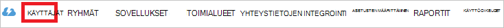

<properties
    pageTitle="Opetusohjelma: Azure Active Directory-integrointi Novatus | Microsoft Azure"
    description="Opettele määrittämään kertakirjautumisen Azure Active Directory- ja LearnUpon välillä."
    services="active-directory"
    documentationCenter=""
    authors="jeevansd"
    manager="femila"
    editor=""/>

<tags
    ms.service="active-directory"
    ms.workload="identity"
    ms.tgt_pltfrm="na"
    ms.devlang="na"
    ms.topic="article"
    ms.date="08/15/2016"
    ms.author="jeedes"/>

# Opetusohjelma: LearnUpon Azure Active Directory-integrointi

Tässä opetusohjelmassa tavoitteena on, kuinka voit integroida LearnUpon Azure Active Directory (Azure AD).  
Azure AD-integraation LearnUpon avulla voit seuraavat edut:

- Voit hallita Azure AD, jolla on pääsy LearnUpon
- Voit ottaa käyttöön automaattisesti Hae kirjautunut käyttöön LearnUpon (kertakirjautumisen) niiden Azure AD-tilien käyttäjille
- Voit hallita asiakkaiden yhdessä keskitetyssä sijainnissa - Azure Active Directory perinteinen 

Jos haluat tietää tarkempia tietoja SaaS sovelluksen integrointi Azure AD-kohdassa [mitä sovellusten käyttö- ja kertakirjautumisen Azure Active Directory-hakemistosta](active-directory-appssoaccess-whatis.md).

## Edellytykset

Määrittää Azure AD-integroinnin LearnUpon, tarvitset seuraavat:

- Azure AD-tilaus
- LearnUpon single-merkki käytössä-tilauksessa

> [AZURE.NOTE] Voit esikatsella vaiheet Tässä opetusohjelmassa, Emme suosittele käyttämällä tuotantoympäristössä.

Voit esikatsella vaiheet Tässä opetusohjelmassa-noudattamalla näitä suosituksia:

- Älä käytä tuotantoympäristössä, ellei se on tarpeen.
- Jos sinulla ei ole kokeiluversion Azure AD-ympäristössä, voit hankkia yksi kuukausi kokeiluversion [tähän](https://azure.microsoft.com/pricing/free-trial/).

## Skenaarion kuvaus
Tässä opetusohjelmassa tavoitteena on, jotta voit testata Azure AD kertakirjautumisen testiympäristössä.  
Tässä opetusohjelmassa kuvatut skenaarion kuuluu kaksi tärkeimmät rakenneosien:

1. LearnUpon lisääminen valikoimasta
2. Yksittäinen määrittäminen ja testaus Azure AD-on

## LearnUpon lisääminen valikoimasta
Voit määrittää LearnUpon integroida Azure AD-haluat lisätä LearnUpon valikoimasta hallitun SaaS sovellusluettelo.

**Jos haluat lisätä LearnUpon valikoimasta, toimi seuraavasti:**

1. Valitse **Active Directory** **Azure perinteinen portal**, valitse vasemmassa siirtymisruudussa. 

    ![Active Directory][1]

2. Valitse kansio, jonka haluat ottaa käyttöön yhteystietojen integrointi **Hakemisto** -luettelosta.

3. Avaa sovellukset-näkymässä kansio-näkymässä, valitse ylin-valikossa **sovellukset** .

    ![Sovellukset][2]

4. Valitse sivun alareunassa **Lisää** .

    ![Sovellukset][3]

5. Valitse **Mitä haluat tehdä** -valintaikkunasta **Lisää sovellus-valikoimasta**.

    ![Sovellukset][4]

6. Kirjoita hakuruutuun **LearnUpon**.

    

7. Valitse tulosruudussa **LearnUpon**ja valitse **Valmis** , voit lisätä sovelluksen.

    

##  Yksittäinen määrittäminen ja testaus Azure AD-on
Tässä osassa tavoitteena on noudattamalla voit määrittää ja testaa Azure AD kertakirjautumisen LearnUpon nimeltä "Britta Simon" testikäyttäjän perusteella.

Kertakirjautumisen toimimaan Azure AD on tiedettävä vastaavaan käyttäjän LearnUpon, Azure AD-käyttäjälle. Toisin sanoen suhteen Azure AD-käyttäjä ja Aiheeseen liittyvät LearnUpon-linkki on vahvistettava.  
Linkki-yhteys on muodostettu määrittämällä **käyttäjänimi** arvo arvoksi LearnUpon **käyttäjänimi** Azure AD.

Määrittäminen ja testaaminen Azure AD kertakirjautumisen LearnUpon kanssa, sinun on tehtävä seuraavat hakukyselyn:

1. **[Azure AD määrittäminen Single Sign](#configuring-azure-ad-single-single-sign-on)** - käyttäjät voivat käyttää tätä toimintoa.
2. **[Käyttäjän testata luominen Azure AD](#creating-an-azure-ad-test-user)** - Testaa Azure AD kertakirjautumisen Britta Simon kanssa.
4. **[Luomisesta LearnUpon testata käyttäjän](#creating-a-learnupon-test-user)** - tapahtumista Britta Simon ovat LearnUpon, jotka on linkitetty hän Azure AD esitys.
5. **[Käyttäjän testata määrittäminen Azure AD](#assigning-the-azure-ad-test-user)** - Britta Simon käyttämään Azure AD kertakirjautumisen käyttöön.
5. **[Testaus Single Sign](#testing-single-sign-on)** - voit tarkistaa, toimiiko määritykset.

### Azure AD-Single Sign-On määrittäminen

Tässä osassa tavoitteena on Azure AD kertakirjautumisen Azure perinteinen portaalissa ottaminen käyttöön ja määrittää kertakirjautumisen LearnUpon-sovelluksessa.

**Määrittää Azure AD kertakirjautumisen LearnUpon, toimimalla seuraavasti:**

1. Valitse Azure perinteinen portaalissa integrointi **LearnUpon** sovellus-sivulla **Määritä kertakirjautumisen** **Määrittäminen Single Sign** -valintaikkunan avaaminen.

    ![Kertakirjautumisen määrittäminen][6] 

2. **Miten käyttäjät voivat kirjautua LearnUpon haluat käyttää** sivulla Valitse **Azure AD kertakirjautumisen**ja valitse sitten **Seuraava**.

     

3. Valitse **Määritä sovelluksen asetukset** -sivulla toimimalla seuraavasti:.

     

    a. Kirjoita **Vastaus URL** -tekstiruutuun vahvistus kuluttaja palvelun URL-osoite käyttämällä seuraavaa kaavaa:`https://\<companyname\>.learnupon.com/saml/consumer`

    b. Valitse **Seuraava**. 

4. Valitse **Määritä kertakirjautumisen osoitteessa LearnUpon** -sivulla toimimalla seuraavasti:

     

    a. Valitse **Lataa**ja tallenna sitten tiedosto tietokoneesta. Tämä varmenne ja metatietojen URL-osoitteet (kohteen tunnus, kirjaudu SSO URL- ja kirjaudu ulos URL-osoite) määrittämään SSO LearnUpon reunassa annettava.

    b. Valitse **Seuraava**.

1. Avata toisen selain ja kirjaudu sisään LearnUpon järjestelmänvalvojatilillä. 

1. Valitse **asetukset** -välilehti.

     

1. Valitse **Kertakirjautuminen - SAML**ja valitse sitten **Yleisasetukset** SAML-asetusten määrittämiseen.

     

5. Valitse **Yleisasetukset** -kohdassa toimimalla seuraavasti:

     

    a. Valitse **käytössä**.

    b. **Version**Valitse **2.0**.

    c-näppäinyhdistelmää. **Ohita ehdot**Valitse **ei**.

    d. **SAML suojaustunnuksen kirjaa parametri nimi** -tekstiruutuun pyynnön kirjaa parametrin SAML kuluttaja URL-osoitteen nimen alla yllä olevasta tyyppi on vahvistettu ja todentaa – esimerkiksi **SAMLResponse**SAML-vahvistus.

    e. Kirjoita haluamasi arvo, joka ilmaisee SAML vahvistus-käyttäjät-tunnus (sähköpostiosoite) sijainti - esimerkiksi **Nimimuotoa tunnus** -tekstiruutuun **urn: oasis: nimet: tc: SAML:1.1:nameid-muoto: emailAddress**.

    f. Kirjoita arvo, joka osoittaa, mihin käyttäjien lähetetään, jos ne sitten ladatut kuvakkeessa Azure perinteinen portal-kirjautuminen näytössä **Tunnistaa palvelun sijainti** -tekstiruutuun.

    g.in Azure perinteinen portal kopioi **Yhden Sign-Out palvelun URL-osoite**ja liitä se sitten **Kirjaudu ulos URL** -textbos.

    h. Valitse **Hallitse sormella tulostaa**ja lataa sormella Tulosta ladatut varmenteen. 

1. Valitse **Käyttäjäasetukset**ja tee sitten seuraavasti:

     

    a. Kirjoita haluamasi arvo, joka kertoo us SAML vahvistus-käyttäjien Etunimi sijainti - esimerkiksi **Etunimi tunnus-muodossa** -tekstiruutuun: **http://schemas.xmlsoap.org/ws/2005/05/identity/claims/ givenname**.

    b. Kirjoita haluamasi arvo, joka kertoo us SAML vahvistus-käyttäjien Sukunimi sijainti - esimerkiksi **Viimeisen nimimuotoa tunnus** -tekstiruutuun: **http://schemas.xmlsoap.org/ws/2005/05/identity/claims/ Sukunimi**.

6. Azure perinteinen-portaalissa Valitse vahvistus Sign-määritys ja valitse sitten **Seuraava**.

    ![Azure AD-Single Sign-On][10]

7. Valitse **Sign Vahvista** -sivulla **Valmis**.  

    ![Azure AD-Single Sign-On][11]

### Azure AD-testikäyttäjän luominen
Tässä osassa tavoitteena on luotava testikäyttäjän kutsutaan Britta Simon Azure perinteinen portaalissa.

![Luo Azure AD-käyttäjä][20]

**Voit luoda testikäyttäjän Azure AD-toimimalla seuraavasti:**

1. Valitse **Active Directory** **Azure perinteinen portal**, valitse vasemmassa siirtymisruudussa.

     

2. Valitse kansio, jonka haluat ottaa käyttöön yhteystietojen integrointi **Hakemisto** -luettelosta.

3. Ylä-valikossa käyttäjäluettelon, näkyviin napsauttamalla **käyttäjät**.

     

4. Avaa **Lisää käyttäjä** -valintaikkunan alareunassa työkalurivillä, valitse **Lisää käyttäjä**.

     

5. Tee valintaikkunassa **Kerro kyseisen käyttäjän tietoja** -sivulla seuraavasti:

     

    a. Käyttäjänä tyyppi Valitse uusi käyttäjä organisaatiossa.

    b. Kirjoita käyttäjänimi- **tekstiruutuun** **BrittaSimon**.

    c-näppäinyhdistelmää. Valitse **Seuraava**.

6.  Suorita **Käyttäjäprofiili** -sivulla seuraavat toimet:

     

    a. Kirjoita **Ensimmäinen nimi** -tekstiruutuun **Britta**.  

    b. Kirjoita **Sukunimi** -tekstiruutuun tyyppi- **Simon**.

    c-näppäinyhdistelmää. Kirjoita **Näyttönimi** -tekstiruutuun **Britta Simon**.

    d. Valitse **rooli** -luettelosta **käyttäjä**.

    e. Valitse **Seuraava**.

7. Valitse **Hae tilapäinen salasana** -valintaikkunan sivulla **Luo**.

     

8. **Hae tilapäinen salasana** -valintaikkunan sivulla toimimalla seuraavasti:

     

    a. Kirjoita **Uusi salasana**arvo muistiin.

    b. Valitse **Valmis**.   

### LearnUpon testikäyttäjän luominen

Tässä osassa tavoitteena on nimeltään Britta Simon LearnUpon käyttäjän luominen. LearnUpon tukee vain perustuvan valmistelu, joka on oletusarvoisesti käytössä.

Ei ole toimi puolestasi sisältö. Uusi käyttäjä luodaan yritys käyttää LearnUpon, jos sitä ei ole vielä aikana. [Azure AD-Single Sign-On määrittäminen](#configuring-azure-ad-single-single-sign-on).

> [AZURE.NOTE] Jos haluat luoda luodun käyttäjän manuaalisesti, on LearnUpon-tukeen.

### Azure AD-testikäyttäjän määrittäminen

Tässä osassa tavoitteena on Britta Simon käyttämään Azure kertakirjautumisen hänen käyttöoikeuden myöntämisestä LearnUpon ottaminen käyttöön.

![Määrittää käyttäjälle][200] 

**Jos haluat määrittää Britta Simon LearnUpon, toimi seuraavasti:**

1. Azure perinteinen-portaalissa Avaa sovellukset-näkymässä kansio-näkymässä, valitse **sovellukset** yläreunan-valikossa.

    ![Määrittää käyttäjälle][201] 

2. Valitse sovellukset-luettelosta **LearnUpon**.

     

1. Valitse ylä-valikossa Valitse **käyttäjiä**.

    ![Määrittää käyttäjälle][203] 

1. Valitse käyttäjät-luettelosta **Britta Simon**.

2. Napsauta työkalurivin alaosassa **määrittäminen**.

    ![Määrittää käyttäjälle][205]

### Kertakirjautumisen testaaminen

Tässä osassa tavoitteena on Testaa Azure AD yksittäisen Sign-asetusten käyttäminen Access-paneeli.  
Access-ruudussa LearnUpon-ruutua napsauttaessasi sinun pitäisi saada automaattisesti kirjautunut-on LearnUpon sovelluksen.

## Lisäresursseja

* [Luettelo siitä, miten voit integroida SaaS sovellusten Azure Active Directory-opetusohjelmat](active-directory-saas-tutorial-list.md)
* [Mikä on sovellusten käyttö- ja kertakirjautumisen Azure Active Directory-hakemistosta?](active-directory-appssoaccess-whatis.md)

<!--Image references-->

[1]: ./media/active-directory-saas-learnupon-tutorial/tutorial_general_01.png
[2]: ./media/active-directory-saas-learnupon-tutorial/tutorial_general_02.png
[3]: ./media/active-directory-saas-learnupon-tutorial/tutorial_general_03.png
[4]: ./media/active-directory-saas-learnupon-tutorial/tutorial_general_04.png

[6]: ./media/active-directory-saas-learnupon-tutorial/tutorial_general_05.png
[10]: ./media/active-directory-saas-learnupon-tutorial/tutorial_general_06.png
[11]: ./media/active-directory-saas-learnupon-tutorial/tutorial_general_07.png
[20]: ./media/active-directory-saas-learnupon-tutorial/tutorial_general_100.png

[200]: ./media/active-directory-saas-learnupon-tutorial/tutorial_general_200.png
[201]: ./media/active-directory-saas-learnupon-tutorial/tutorial_general_201.png
[203]: ./media/active-directory-saas-learnupon-tutorial/tutorial_general_203.png
[204]: ./media/active-directory-saas-learnupon-tutorial/tutorial_general_204.png
[205]: ./media/active-directory-saas-learnupon-tutorial/tutorial_general_205.png
