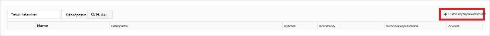

<properties
    pageTitle="Opetusohjelma: Azure Active Directory-integrointi UserEcho | Microsoft Azure"
    description="Opettele määrittämään kertakirjautumisen Azure Active Directory- ja UserEcho välillä."
    services="active-directory"
    documentationCenter=""
    authors="jeevansd"
    manager="femila"
    editor=""/>

<tags
    ms.service="active-directory"
    ms.workload="identity"
    ms.tgt_pltfrm="na"
    ms.devlang="na"
    ms.topic="article"
    ms.date="10/20/2016"
    ms.author="jeedes"/>

# Opetusohjelma: UserEcho Azure Active Directory-integrointi

Tässä opetusohjelmassa tavoitteena on, kuinka voit integroida UserEcho Azure Active Directory (Azure AD).  
Azure AD-integraation UserEcho avulla voit seuraavat edut: 

- Voit hallita Azure AD, jolla on pääsy UserEcho 
- Voit ottaa käyttöön automaattisesti Hae kirjautunut käyttöön UserEcho (kertakirjautumisen) niiden Azure AD-tilien käyttäjille
- Voit hallita asiakkaiden yhdessä keskitetyssä sijainnissa - Azure perinteinen portal

Jos haluat tietää tarkempia tietoja SaaS sovelluksen integrointi Azure AD-kohdassa [mitä sovellusten käyttö- ja kertakirjautumisen Azure Active Directory-hakemistosta](active-directory-appssoaccess-whatis.md).

## Edellytykset 

Määrittää Azure AD-integroinnin UserEcho, tarvitset seuraavat:

- Azure AD-tilaus
- UserEcho single-merkki käytössä-tilauksessa

> [AZURE.NOTE] Voit esikatsella vaiheet Tässä opetusohjelmassa, Emme suosittele käyttämällä tuotantoympäristössä.

Voit esikatsella vaiheet Tässä opetusohjelmassa-noudattamalla näitä suosituksia:

- Älä käytä tuotantoympäristössä, ellei se on tarpeen.
- Jos sinulla ei ole kokeiluversion Azure AD-ympäristössä, voit hankkia yksi kuukausi kokeiluversion [tähän](https://azure.microsoft.com/pricing/free-trial/). 

 
## Skenaarion kuvaus
Tässä opetusohjelmassa tavoitteena on, jotta voit testata Azure AD kertakirjautumisen testiympäristössä.  
Tässä opetusohjelmassa kuvatut skenaarion kuuluu kaksi tärkeimmät rakenneosien:

1. UserEcho lisääminen valikoimasta 
2. Yksittäinen määrittäminen ja testaus Azure AD-on

## UserEcho lisääminen valikoimasta
Voit määrittää UserEcho integroida Azure AD-haluat lisätä UserEcho valikoimasta hallitun SaaS sovellusluettelo.

**Jos haluat lisätä UserEcho valikoimasta, toimi seuraavasti:**

1. Valitse **Active Directory** **Azure perinteinen portal**, valitse vasemmassa siirtymisruudussa. 

    ![Active Directory][1]

2. Valitse kansio, jonka haluat ottaa käyttöön yhteystietojen integrointi **Hakemisto** -luettelosta.

3. Avaa sovellukset-näkymässä kansio-näkymässä, valitse ylin-valikossa **sovellukset** .

    ![Sovellukset][2]

4. Valitse sivun alareunassa **Lisää** .

    ![Sovellukset][3]

5. Valitse **Mitä haluat tehdä** -valintaikkunasta **Lisää sovellus-valikoimasta**.

    ![Sovellukset][4]

6. Kirjoita hakuruutuun **UserEcho**.

    

7. Valitse tulosruudussa **UserEcho**ja valitse **Valmis** , voit lisätä sovelluksen.

    

##  Yksittäinen määrittäminen ja testaus Azure AD-on
Tässä osassa tavoitteena on noudattamalla voit määrittää ja testaa Azure AD kertakirjautumisen UserEcho nimeltä "Britta Simon" testikäyttäjän perusteella.

Kertakirjautumisen toimimaan Azure AD on tiedettävä vastaavaan käyttäjän UserEcho, Azure AD-käyttäjälle. Toisin sanoen suhteen Azure AD-käyttäjä ja Aiheeseen liittyvät UserEcho-linkki on vahvistettava.  
Linkki-yhteys on muodostettu määrittämällä **käyttäjänimi** arvo arvoksi UserEcho **käyttäjänimi** Azure AD.
 
Määrittäminen ja testaaminen Azure AD kertakirjautumisen UserEcho kanssa, sinun on tehtävä seuraavat hakukyselyn:

1. **[Azure AD määrittäminen Single Sign](#configuring-azure-ad-single-single-sign-on)** - käyttäjät voivat käyttää tätä toimintoa.
2. **[Käyttäjän testata luominen Azure AD](#creating-an-azure-ad-test-user)** - Testaa Azure AD kertakirjautumisen Britta Simon kanssa.
4. **[Luomisesta UserEcho testata käyttäjän](#creating-a-userecho-test-user)** - tapahtumista Britta Simon ovat UserEcho, jotka on linkitetty hän Azure AD esitys.
5. **[Käyttäjän testata määrittäminen Azure AD](#assigning-the-azure-ad-test-user)** - Britta Simon käyttämään Azure AD kertakirjautumisen käyttöön.
5. **[Testaus Single Sign](#testing-single-sign-on)** - voit tarkistaa, toimiiko määritykset.

### Azure AD-Single Sign-On määrittäminen

Tässä osassa tavoitteena on Azure AD kertakirjautumisen Azure perinteinen portaalissa ottaminen käyttöön ja määrittää kertakirjautumisen UserEcho-sovelluksessa. 

**Määrittää Azure AD kertakirjautumisen UserEcho, toimimalla seuraavasti:**

1. Valitse Azure perinteinen portaalissa integrointi **UserEcho** sovellus-sivulla **Määritä kertakirjautumisen** **Määrittäminen Single Sign** -valintaikkunan avaaminen.

    ![Kertakirjautumisen määrittäminen][6] 

2. **Miten käyttäjät voivat kirjautua UserEcho haluat käyttää** sivulla Valitse **Azure AD kertakirjautumisen**ja valitse sitten **Seuraava**.

     

3. Valitse **Määritä sovelluksen asetukset** -sivulla toimimalla seuraavasti:

     

    a. Kirjoita **Merkki-URL** -tekstiruutuun käyttää käyttäjien kirjautua UserEcho sovelluksen URL-osoite (esimerkiksi: *https://fabrikam.UserEcho.com/*).

    b. Valitse **Seuraava**.
 
 
4. Valitse **Määritä kertakirjautumisen osoitteessa UserEcho** -sivulla toimimalla seuraavasti:

     

    a. Valitse **Lataa**ja tallenna sitten tiedosto tietokoneesta.

    b. Valitse **Seuraava**.

1. Toisessa selainikkunassa Kirjaudu UserEcho yrityksen sivustoon järjestelmänvalvojana.

1. Yläkulmassa työkalurivin käyttäjänimi Laajenna-valikko ja valitse sitten **asetukset**.

     

1. Valitse **integroinnit**.

     

1. Valitse **verkkosivusto**ja valitse sitten **kertakirjautumisen (SAML2)**.

     

1. Tee **kertakirjautumisen (SAML)** -sivulla seuraavat toimet:

     

    a. **SAML on otettu käyttöön**Valitse **Kyllä**. 

    b. Azure perinteinen portaalissa Määritä kertakirjautumisen UserEcho valintaikkunan sivulla, valitse kopioi **Sign-palvelun URL** -arvon ja liitä se **SAML SSO URL** -tekstiruutuun.

    c-näppäinyhdistelmää. Azure perinteinen portaalissa Määritä kertakirjautumisen UserEcho valintaikkunan sivulla, valitse kopioi **Remote Kirjaudu URL-osoite** -arvo ja liitä se sitten **Remote logoout URL** -tekstiruutuun. 

    d. Avaa ladatut varmenteen Muistiossa, sisällön kopioiminen ja liittäminen **X.509-varmenne** -tekstiruutuun.    

    e. Valitse **Tallenna**.

6. Azure perinteinen-portaalissa Valitse vahvistus Sign-määritys ja valitse sitten **Seuraava**. 

    ![Azure AD-Single Sign-On][10]

7. Valitse **Sign Vahvista** -sivulla **Valmis**.  

    ![Azure AD-Single Sign-On][11]

### Azure AD-testikäyttäjän luominen
Tässä osassa tavoitteena on luotava testikäyttäjän kutsutaan Britta Simon Azure perinteinen portaalissa.

![Luo Azure AD-käyttäjä][20]

**Voit luoda testikäyttäjän Azure AD-toimimalla seuraavasti:**

1. Valitse **Active Directory** **Azure perinteinen portal**, valitse vasemmassa siirtymisruudussa.

      

2. Valitse kansio, jonka haluat ottaa käyttöön yhteystietojen integrointi **Hakemisto** -luettelosta.

3. Ylä-valikossa käyttäjäluettelon, näkyviin napsauttamalla **käyttäjät**.

     
 
4. Avaa **Lisää käyttäjä** -valintaikkunan alareunassa työkalurivillä, valitse **Lisää käyttäjä**. 

     

5. Tee valintaikkunassa **Kerro kyseisen käyttäjän tietoja** -sivulla seuraavasti: 

      

    a. Käyttäjänä tyyppi Valitse uusi käyttäjä organisaatiossa.

    b. Kirjoita käyttäjänimi- **tekstiruutuun** **BrittaSimon**.

    c-näppäinyhdistelmää. Valitse **Seuraava**.

6.  Suorita **Käyttäjäprofiili** -sivulla seuraavat toimet: 

     
 
    a. Kirjoita **Ensimmäinen nimi** -tekstiruutuun **Britta**.  

    b. Kirjoita **Sukunimi** -tekstiruutuun tyyppi- **Simon**.

    c-näppäinyhdistelmää. Kirjoita **Näyttönimi** -tekstiruutuun **Britta Simon**.

    d. Valitse **rooli** -luettelosta **käyttäjä**.
    e. Valitse **Seuraava**.

7. Valitse **Hae tilapäinen salasana** -valintaikkunan sivulla **Luo**.

     
 
8. **Hae tilapäinen salasana** -valintaikkunan sivulla toimimalla seuraavasti:

     
  
    a. Kirjoita **Uusi salasana**arvo muistiin.

    b. Valitse **Valmis**.   

  
 
### UserEcho testikäyttäjän luominen

Tässä osassa tavoitteena on nimeltään Britta Simon UserEcho käyttäjän luominen.

**Luo kutsutaan Britta Simon UserEcho käyttäjä, toimi seuraavasti:**

1. Kertakirjauksen UserEcho yrityksen sivustoon järjestelmänvalvojana.

1. Yläkulmassa työkalurivin käyttäjänimi Laajenna-valikko ja valitse sitten **asetukset**.

     

1. Valitse **käyttäjät**, laajenna **käyttäjät** -osiossa.

     

1. Valitse **käyttäjiä**.

     

1. Valitse **Kutsu uusi käyttäjä**.

    

1. Valitse **Uusi käyttäjä kutsu** -valintaikkunassa seuraavasti:

     

    a. Kirjoita **nimi** -tekstiruutuun **Britta Simon**.

    b. Kirjoita **sähköpostiosoite** -tekstiruutuun Azure perinteinen portaalissa Britta henkilön sähköpostiosoite.

    c-näppäinyhdistelmää. Valitse **Kutsu**.

Kutsu on lähetetty Britta, jonka avulla hän voi aloittaa UserEcho. 

### Azure AD-testikäyttäjän määrittäminen

Tässä osassa tavoitteena on Britta Simon käyttämään Azure kertakirjautumisen hänen käyttöoikeuden myöntämisestä UserEcho ottaminen käyttöön.

![Määrittää käyttäjälle][200] 

**Jos haluat määrittää Britta Simon UserEcho, toimi seuraavasti:**

1. Azure perinteinen-portaalissa Avaa sovellukset-näkymässä kansio-näkymässä, valitse **sovellukset** yläreunan-valikossa.

    ![Määrittää käyttäjälle][201] 

2. Valitse sovellukset-luettelosta **UserEcho**.

     

1. Valitse ylä-valikossa Valitse **käyttäjiä**.

    ![Määrittää käyttäjälle][203] 

1. Valitse käyttäjät-luettelosta **Britta Simon**.

2. Napsauta työkalurivin alaosassa **määrittäminen**.

    ![Määrittää käyttäjälle][205]

### Kertakirjautumisen testaaminen

Tässä osassa tavoitteena on Testaa Azure AD yksittäisen Sign-asetusten käyttäminen Access-paneeli.  
Access-ruudussa UserEcho-ruutua napsauttaessasi sinun pitäisi saada automaattisesti kirjautunut-on UserEcho sovelluksen.

## Lisäresursseja

* [Luettelo siitä, miten voit integroida SaaS sovellusten Azure Active Directory-opetusohjelmat](active-directory-saas-tutorial-list.md)
* [Mikä on sovellusten käyttö- ja kertakirjautumisen Azure Active Directory-hakemistosta?](active-directory-appssoaccess-whatis.md)

<!--Image references-->

[1]: ./media/active-directory-saas-userecho-tutorial/tutorial_general_01.png
[2]: ./media/active-directory-saas-userecho-tutorial/tutorial_general_02.png
[3]: ./media/active-directory-saas-userecho-tutorial/tutorial_general_03.png
[4]: ./media/active-directory-saas-userecho-tutorial/tutorial_general_04.png

[6]: ./media/active-directory-saas-userecho-tutorial/tutorial_general_05.png
[10]: ./media/active-directory-saas-userecho-tutorial/tutorial_general_06.png
[11]: ./media/active-directory-saas-userecho-tutorial/tutorial_general_07.png
[20]: ./media/active-directory-saas-userecho-tutorial/tutorial_general_100.png

[200]: ./media/active-directory-saas-userecho-tutorial/tutorial_general_200.png
[201]: ./media/active-directory-saas-userecho-tutorial/tutorial_general_201.png
[203]: ./media/active-directory-saas-userecho-tutorial/tutorial_general_203.png
[204]: ./media/active-directory-saas-userecho-tutorial/tutorial_general_204.png
[205]: ./media/active-directory-saas-userecho-tutorial/tutorial_general_205.png

