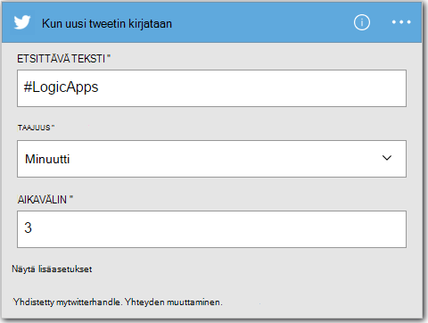
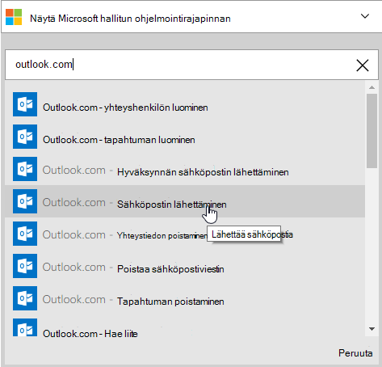
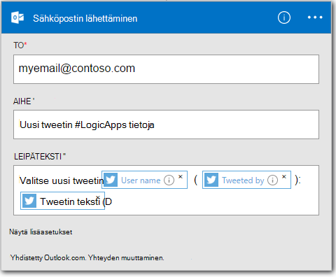

<properties
    pageTitle="Logiikan sovelluksen luominen | Microsoft Azure"
    description="Opettele yhteyden SaaS services logiikan sovelluksen luominen"
    authors="jeffhollan"
    manager="dwrede"
    editor=""
    services="logic-apps"
    documentationCenter=""/>

<tags
    ms.service="logic-apps"
    ms.workload="na"
    ms.tgt_pltfrm="na"
    ms.devlang="na"
    ms.topic="get-started-article"
    ms.date="10/18/2016"
    ms.author="jehollan"/>

# Uuden yhteyden SaaS services logiikan sovelluksen luominen

Tässä ohjeaiheessa kerrotaan, miten, muutaman minuutin kuluttua voit aloittaa [Azure logiikan](app-service-logic-what-are-logic-apps.md)sovelluksilla. Käymme tässä läpi yksinkertaisen työnkulun, jolla voit lähettää kiinnostavat tweets sähköpostiin.

Jos haluat käyttää tässä tilanteessa, sinun on:

- Azure tilauksen
- Twitter-tili
- Outlook.com- tai isännöityä Office 365-postilaatikkoon

## Sähköpostin tweets logiikan uuden sovelluksen luominen

1. [Azure portaalin Raporttinäkymät-ikkunan](https://portal.azure.com)valitsemalla **Uusi**. 
2. Etsintäpalkin Etsi logiikan-sovelluksen ja valitse sitten **Logiikan sovelluksen**. Voit myös valita **Uusi** **Web + Mobile**, ja valita **Logiikan sovelluksen**. 
3. Logiikan sovelluksen nimi, valitse sijainti, resurssiryhmä ja valitse **Luo**.  Jos valitset **raporttinäkymät-ikkunan kiinnittäminen** logiikan sovellus avautuu automaattisesti käyttöön kerran.  
4. Avattuasi logiikan sovelluksen ensimmäisen kerran voit valita mallin käyttöön.  Nyt valitsemalla **Tyhjä logiikan App** luonnissa tämä alusta alkaen. 
1. Sinun on luotava ensimmäinen kohde on käynnistintä.  Tämä on tapahtuman, joka alkaa logiikan sovelluksen.  Etsi **twitter** -käynnistimen hakuruutuun ja valitse se.
7. Nyt Kirjoita hakusana käynnistettävän käyttöön.  **Korkojakso** ja **aikavälin** määritetään, kuinka usein logiikan sovelluksen tarkistaa uudet tweets (ja palaa kaikki tweets aikana, kun aikaväli).
    

5. Valitse **Uusi vaihe** -painiketta ja valitse sitten **Lisää toiminnon** tai **Lisää ehto**
6. Kun valitset **Lisää toiminnon**, voit hakea [käytettävissä olevat yhdysviivat](../connectors/apis-list.md) toiminnon. Voit esimerkiksi valita **Outlook.com – Lähetä sähköpostia** lähettää sähköpostia outlook.com-osoitteesta:  
    

7. Olet nyt voivat täyttää tietoja näytettävää sähköpostiviestiä parametrit:  

8. Voit valita lopuksi, jotta logiikan sovelluksen **Tallenna** live.

## Hallitse logiikan sovelluksen luonnin jälkeen

Logiikan-sovellus on nyt hyvin alkuun. Se säännöllisesti tarkistaa tweets syötetty hakusanoja kanssa. Kun Access löytää vastaavia tweetin, lähettää sähköpostia. Lopuksi Katso, miten voit poistaa sovelluksen käytöstä tai se on edistymisestä.

1. Siirry [Azure Portal](https://portal.azure.com)

1. Valitse näytön vasemmassa reunassa **Selaa** ja valitse **Logiikan sovellukset**.

2. Valitse nykyisen tilan ja yleisiä tietoja juuri luomasi uusi logiikan-sovellus.

3. Voit muokata logiikan uusi sovellus valitsemalla **Muokkaa**.

5. Sovelluksen käytöstä, valitse **Poista käytöstä** painikkeita.

1. Näytä Suorita ja liipaisin hammashoitoa seurannassa, kun logiikan-sovellus on käynnissä.  Voit napsauttaa **Päivitä** uusimmat tiedot.

Pienempi kuin 5 minuuttia ehdit käynnissä pilveen yksinkertainen logiikan-sovelluksen määrittäminen. Lisätietoja logiikan ominaisuuksien käyttämisestä on artikkelissa [käyttäminen logiikan app ominaisuudet]. Lisätietoja logiikan App määritelmiä itse artikkelissa [logiikan App määritelmien luominen](app-service-logic-author-definitions.md).

<!-- Shared links -->
[Azure portal]: https://portal.azure.com
[Logiikan app-ominaisuuksien käyttäminen]: app-service-logic-create-a-logic-app.md
