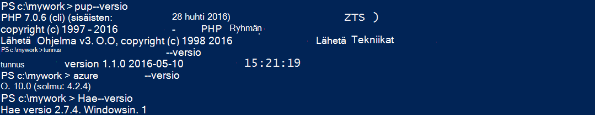
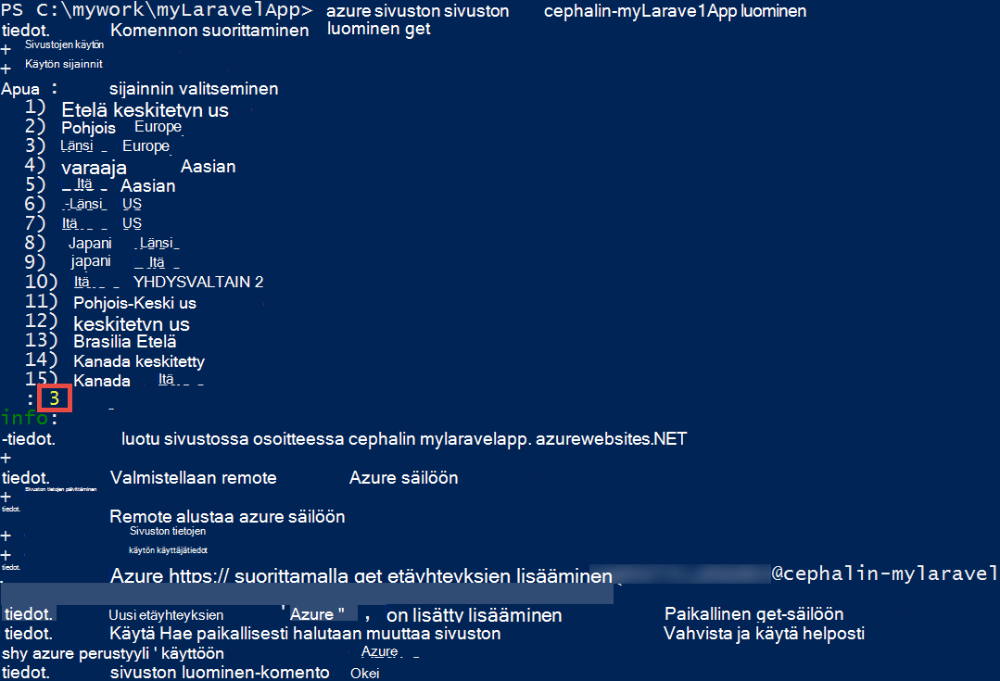
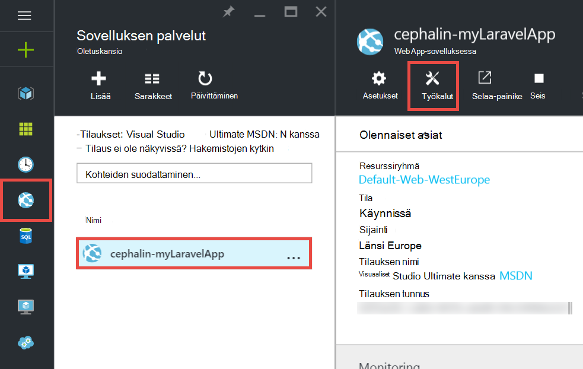
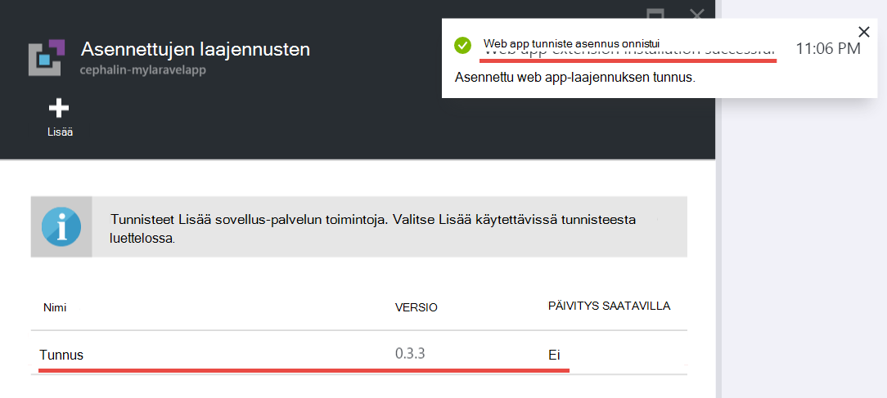
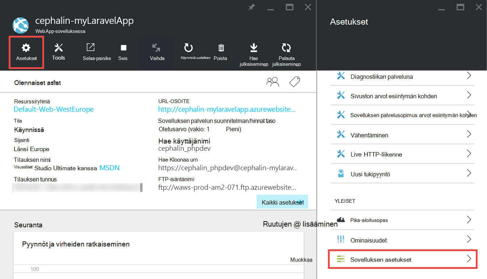
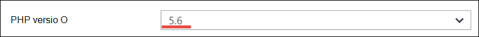
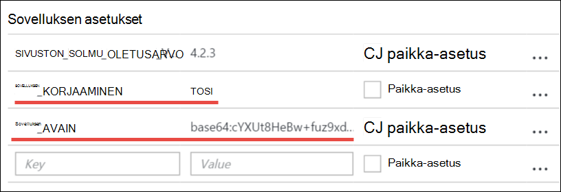
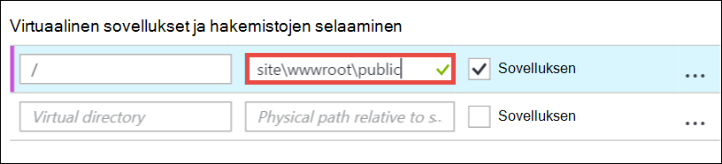
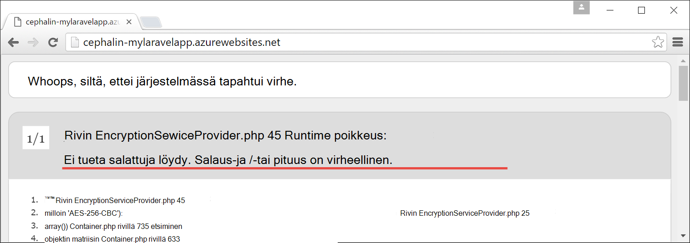

<properties
    pageTitle="Luoda ja määrittää PHP web App-sovelluksen käyttöön Azure"
    description="Opetusohjelma, joka näyttää, miten voit suorittaa Azure App palvelun PHP (Laravel) verkkosovellukseen. Opettele määrittämään Azure App palvelun PHP Frameworkin, voit valita ehtojen mukaan."
    services="app-service\web"
    documentationCenter="php"
    authors="cephalin"
    manager="wpickett"
    editor=""
    tags="mysql"/>

<tags
    ms.service="app-service-web"
    ms.workload="web"
    ms.tgt_pltfrm="na"
    ms.devlang="PHP"
    ms.topic="article"
    ms.date="06/03/2016" 
    ms.author="cephalin"/>

# Luoda ja määrittää PHP web App-sovelluksen käyttöön Azure

[AZURE.INCLUDE [tabs](../../includes/app-service-web-get-started-nav-tabs.md)]

Tässä opetusohjelmassa näytetään, miten voit luoda ja määrittää PHP verkkosovellukseen käyttöönottaminen Azure, ja Azure App palvelun ehtojen mukaan PHP koodiin määrittämisestä. Opetusohjelman lopussa on toimiva [Laravel](https://www.laravel.com/) web App-sovelluksen käytössä live [Azure sovelluksen](../app-service/app-service-value-prop-what-is.md)-palvelussa.

PHP kehittäjän voit tuoda tuttuja PHP-framework Azure. Tässä opetusohjelmassa käyttää Laravel yksinkertaisesti betonin app esimerkki. Opit seuraavat asiat: 

- Ottaa käyttöön Git käyttäminen
- PHP versio
- Käynnistä-tiedoston, jota ei ole sovelluksen pääkansio
- Access-ympäristön kielikohtaiset muuttujat
- Azure-sovelluksen päivittäminen

Voit käyttää oppimasi tähän muiden, voit ottaa käyttöön Azure PHP web-sovelluksiin.

>[AZURE.INCLUDE [app-service-linux](../../includes/app-service-linux.md)] 

## Edellytykset

- Asenna [PHP 5.6.x](http://php.net/downloads.php) (beeta-argumentti on PHP 7 tuki)
- Asenna [tunnus](https://getcomposer.org/download/)
- Asenna [Azure CLI](../xplat-cli-install.md)
- Asenna [Git](http://www.git-scm.com/downloads)
- Hanki Microsoft Azure-tili. Jos sinulla ei ole tiliä, voit [Rekisteröidy maksuttoman kokeiluversion](/pricing/free-trial/?WT.mc_id=A261C142F) tai [aktivoida Visual Studio tilaajan etuja](/pricing/member-offers/msdn-benefits-details/?WT.mc_id=A261C142F).

>[AZURE.NOTE] Katso käytössä verkkosovellukseen. [Kokeile App palvelun](http://go.microsoft.com/fwlink/?LinkId=523751) välittömästi ja lyhytkestoinen starter-sovelluksen luominen, ei ole luottokortti, ei ole sitoumukset.

## Keskihajonta-laitteeseen PHP (Laravel)-sovelluksen luominen

1. Avaa uusi Windows-komentokehote, PowerShell-ikkuna, Linux-liittymän tai OS X-päätteen. Suorita seuraavat komennot voit varmistaa, että tarvittavat työkalut asennetaan tietokoneeseen oikein. 

        php --version
        composer --version
        azure --version
        git --version

    

    Jos et ole vielä asentanut työkaluja, katso [edellytykset](#Prerequisites) Lataa.
    
2. Asenna Laravel seuraavalla tavalla:

        composer global require "laravel/installer

3. `CD`työn kansioon ja luo uusi Laravel sovellus seuraavalla tavalla:

        cd <working_directory>
        laravel new <app_name>

4. `CD`kyselyjä juuri luomasi `<app_name>` hakemistosta ja testaa sovelluksen seuraavalla tavalla:

        cd <app_name>
        php artisan serve
        
    Sinun pitäisi nähdä Laravel käynnistyskuvan ja siirry http://localhost:8000 selaimessa nyt.
    
    
    
Niin paljon, aivan säännöllisesti Laravel työnkulun ja et tähän lisätietoja <a href="https://laravel.com/docs/5.2" rel="nofollow">Laravel</a>. Nyt siirtää.

## Azure-web-sovelluksen luominen ja Git käyttöönoton asetusten määrittäminen

>[AZURE.NOTE] "Odota! Entä jos haluan käyttöönotto FTP?" Tällä [FTP-opetusohjelma](web-sites-php-mysql-deploy-use-ftp.md) tarpeisiin. 

Azure-CLI voit web-sovelluksen luominen Azure App palvelun ja se määritetään Git-ympäristö, jonka yksirivinen-komennon. Oletetaan, että toiminto.

1. Vaihda ASM tilaan ja kirjaudu sisään ja Azure:

        azure config mode asm
        azure login
    
    Noudata voi jatkaa Kirjaudu sisään.
    
    

4. Suorita Azure web-sovelluksen luominen ja Git käyttöönotto-komento. Kun sinulta kysytään, määrittää minuuttimäärän, jonka haluamasi alue.

        azure site create --git <app_name>
    
    
    
    >[AZURE.NOTE] Jos olet ole määrittänyt käyttöönoton tunnistetiedot Azure tilauksen, sinua pyydetään luoda niitä. Näitä tunnistetietoja ei Azure tilin tunnistetiedot, käytetään sovelluksen palvelun Git ominaisuuksissa ja FTP-kirjautumiset. 
    
    Tämä komento luo uuden Git säilön nykyisen kansion (kanssa `git init`) ja muodostaa Azure kuin Git etäyhteyksien tietovarasto (kanssa `git remote add`).

<a name="configure"/>
## Azure web App-sovelluksen määrittäminen

Jos haluat tutustua Azure Laravel-sovelluksen sinun on kiinnittää huomiota monella tavalla. Tee tämä samalla Harjoitus PHP-Framework värisinä.

- Määritä PHP 5.5.9 tai uudempi. Katso [Uusimmat Laravel 5.2 palvelinvaatimukset](https://laravel.com/docs/5.2#server-requirements) palvelinvaatimukset koko luettelon. Luettelon loput ovat tiedostotunnisteista, jotka ovat jo käytössä Azure's PHP asennuksia. 
- Määritä ympäristömuuttujat sovelluksen tarvitsee. Laravel käyttää `.env` helposti asetus ympäristön muuttujien tiedosto. Koska se ei kuulu vahvistetun tietolähteen ohjausobjektiin (katso [Laravel ympäristön määritys](https://laravel.com/docs/5.2/configuration#environment-configuration)Azure koodiin app-asetukset Määritä sen sijaan.
- Varmista, että Laravel sovelluksen aloituskohta, `public/index.php`, on ensin ladattu. Artikkelissa [Laravel elinkaari yleiskatsaus](https://laravel.com/docs/5.2/lifecycle#lifecycle-overview). Toisin sanoen, sinun on määritettävä osoittamaan web-sovelluksen pääkansion URL-osoite `public` hakemisto.
- Ota käyttöön Azure-tunnus-tunniste, koska sinulla composer.json. Näin voit antaa tunnus huolehtia hankkiminen tarvittavat paketit, kun otat käyttöön kanssa `git push`. Se on helppokäyttöisyys. Tunnus automaatio ei käyttöön vain poistettavien `/vendor` - `.gitignore` tiedoston niin, että Git sisältää ("un-ohittaa") kaikki sisältö `vendor` hakemisto, kun vahvistetaan ja koodin lisäämistä.

Määritä oletetaan, että seuraavien toimintojen peräkkäin.

4. Määritä haluamasi Laravel-ohjelman käyttöön tarvitaan PHP-version.

        azure site set --php-version 5.6

    Olet valmis PHP-version määrittäminen! 
    
4. Luo uusi `APP_KEY` oman Azure web-sovelluksen ja määritä se app-asetukseksi Azure-verkkosovelluksessa.

        php artisan key:generate --show
        azure site appsetting add APP_KEY="<output_of_php_artisan_key:generate_--show>"

4. Ottaminen käyttöön myös, jotta preempt missään suojaus virheenkorjaus Laravel `Whoops, looks like something went wrong.` sivulle.

        azure site appsetting add APP_DEBUG=true

    Asetus ympäristömuuttujat olet valmis!
    
    >[AZURE.NOTE] Odota, luodaan hidastaa vähän ja kerrotaan, mitä Laravel tekee ja Azure mitä tähän. Laravel käyttää `.env` tiedoston pääkansion toimittamaan ympäristömuuttujat-sovellukseen, osassa näkyvät rivin `APP_DEBUG=true` (ja myös `APP_KEY=...`). Tämä muuttuja pääsee `config/app.php` koodin     `'debug' => env('APP_DEBUG', false),`. [env()](https://laravel.com/docs/5.2/helpers#method-env) on Laravel helper menetelmä, joka käyttää PHP [getenv()](http://php.net/manual/en/function.getenv.php) kattaa-kohdassa.
    >
    >Kuitenkin `.env` ohitetaan Git mukaan, koska se on korostettuna `.gitignore` tiedoston pääkansioon. Vain valitseminen `.env`  
 -paikallisen Git säilöön ei kulutetaan Azure tiedostoja muiden kanssa. Voit vain poistaa kyseisen rivin `.gitignore`, mutta että olet jo muodostettu, että vahvistetaan tämän tiedoston lähde ohjausobjektiin ei ole suositeltavaa. Voit kuitenkin yhä on voi määrittää ympäristömuuttujia Azure. 
    >
    >Hyviä uutisia on sovelluksen asetusten Azure-sovelluksen palvelun tukee [getenv()](http://php.net/manual/en/function.getenv.php)  
 -PHP. Näin voit luoda FTP- tai muulla tavoin voit ladata manuaalisesti `.env` tiedoston kyselyjä Azure, voit määrittää haluamasi muuttujat Azure sovelluksen asetusten ilman vain `.env` Azure-tietokannassa, kuten vain teit. Lisäksi jos muuttuja on sekä `.env` tiedoston ja Azure sovelluksen asetukset asetus Azure voittaa.     

4. Kaksi tehtävien (näennäiskansio ja käyttöönotosta tunnus) edellyttää [Azure portal](https://portal.azure.com)- [portal](https://portal.azure.com) Azure-tilisi niin kirjautuminen.

4. Aloita vasemmasta valikosta napsauttamalla **Sovelluksen Services** > **&lt;app_name >** > **Työkalut**.

    
    
    >[AZURE.TIP] Jos napsautat sen sijaan, että **Työkalut** **asetukset** , sinun on käyttää **Sovelluksen asetukset**  
 sivu, jolla voi määrittää PHP versiot-sovelluksen asetukset- ja Näennäiskansiot tapaan vain asentaminen. 
    
4. Valitse **tunnisteet** > **Lisää** voit lisätä tunnisteen.

4. Valitse **tunnus** **Valitse tunniste** - [sivu](../azure-portal-overview.md) (*sivu*: portaalisivu, joka avaa vaakasuunnassa).

4. **Valitse **Hyväksy ehdot** -sivu.** 

5. **Valitse **Lisää tunniste** -sivu.**

    Kun Azure valmis lisääminen tunnisteen pitäisi ponnahdusikkunoiden helpossa muodossa olevan viestin yläkulmassa sekä  **tunnus** luetellut **tunnisteet** -sivu.

    

    Ottaminen käyttöön tunnus olet valmis!
    
4. Web-sovelluksen sivu, valitse **asetukset** > **Asetukset**.

    

    Huomioi PHP-versio, voit määrittää aiemmin **Sovelluksen asetukset** -sivu:

    

    ja lisäämäsi app-asetukset:
    
    

4. Vieritä näytön alareunaan sivu ja muuta **site\wwwroot\public** **site\wwwroot**sijaan osoittamaan virtual pääkansioon.

    

4. Valitse **Tallenna** sivu yläreunassa.

    Olet valmis määrittäminen näennäiskansio! 

## Web-sovelluksen Git (sekä ympäristömuuttujat määrittäminen) käyttöönotto

Olet valmis ottamaan koodisi nyt. Tee tässä takaisin sisään komentokehote tai päätteen.

4. Tekemäsi muutokset ja ota käyttöön koodisi Azure web App-sovellukseen säilöön, minkä tahansa Git tapaan:

        git add .
        git commit -m "Hurray! My first commit for my Azure app!"
        git push azure master 

    Kun käynnissä `git push`, sinua pyydetään antamaan salasana Git käyttöönotto. Jos ohjelma luo käyttöönoton käyttäjätietoja `azure site create` aiempaa versiota, kirjoita salasana, joita käytit.
    
5. Katsotaan se selaimessa suoritettavat suorittamalla tämän komennon:

        azure site browse

    Selaimen pitäisi näkyä Laravel käynnistyskuvan.
    
    
    
    Onnittelut, sinulla on nyt käytössä Laravel verkkosovellukseen Azure-tietokannassa.
             
## Yleisten virheiden vianmääritys

Seuraavassa on kuvattu joitakin virheitä, joita saattaa ilmetä, kun tämä opetusohjelma:

- [Azure CLI näkyy "" sivuston"ei ole azure komento"](#clierror)
- [Web-sovellus näkyy HTTP 403-virhe](#http403)
- [Web-sovellus näkyy "Whoops, näyttää esimerkiksi järjestelmässä tapahtui virhe."](#whoops)
- [Web-sovellus näkyy "Ei ole tuettu salaus löytyi."](#encryptor)

### Azure CLI näkyy "" sivuston"ei ole azure komento"

Kun käynnissä `azure site *` komentorivin terminaalissa, näet virheen`error:   'site' is not an azure command. See 'azure help'.` 

Tämä on yleensä ja tuloksena on siirrytään "ARM" (Azure resurssien hallinta)-tilassa. Voit ratkaista tämän vaihtaa takaisin "ASM" (Azure hallinta)-tilaan suorittamalla `azure config mode asm`.

### Web-sovellus näkyy HTTP 403-virhe

Olet ottanut koodiin Azure onnistuneesti, mutta kun selaat Azure web App-sovellukseen, saat `HTTP 403` tai`You do not have permission to view this directory or page.`

Tämä on todennäköisesti, koska web app ei löydä aloituskohtaa Laravel-sovellukseen. Varmista, että olet muuttanut virtual pääkansion osoittamaan `site\wwwroot\public`, jossa on Laravel `index.php` on (katso [Määritä Azure online](#configure)).

### Web-sovellus näkyy "Whoops, alkoholijuomat kuin järjestelmässä tapahtui virhe."

Olet ottanut koodiin Azure onnistuneesti, mutta kun Siirry Azure web app-suojaus sanoma`Whoops, looks like something went wrong.`

Saat enemmän kuvailevaa virhe-käyttöön Laravel virheenkorjaus määrittämällä `APP_DEBUG` ympäristömuuttuja `true` (katso [Määritä Azure online](#configure)).

### Web-sovellus näkyy "Ei ole tuettu salaus löytyi."

Olet ottanut koodiin Azure onnistuneesti, mutta kun Siirry Azure web-sovelluksen, näkyviin tulee virhesanoma, joka on alla:

    
Tämä on nasty virhe, mutta vähintään ei suojaus koska on otettu käyttöön Laravel virheenkorjaus. Virhe merkkijonon Laravel foorumeilla markkinointivuosittain haun näet, että se on asetusta ei APP_KEY `.env`, tai tässä tapauksessa ei pysty `.env` Azure-tietokannassa lainkaan. Voit korjata tämän asetuksen lisäämällä `APP_KEY` Azure sovelluksena määrittäminen (katso [Määritä Azure online](#configure)).
    
## Seuraavat vaiheet

Lue, miten voit lisätä sovelluksen tietoja luomalla [Azure MySQL-tietokantaan](../store-php-create-mysql-database.md). Tarkista hyödyntämällä hyödyllisiä linkkejä myös PHP Azure-tietokannassa seuraavia ohjeita:

- [PHP Developer Center](/develop/php/).
- [Web-sovelluksen luominen Azure Marketplace-sivustosta](app-service-web-create-web-app-from-marketplace.md)
- [Määritä PHP Azure App palvelun Web Apps-sovelluksissa](web-sites-php-configure.md)
- [Muuntaa WordPress Multisite Azure sovelluksen-palvelussa](web-sites-php-convert-wordpress-multisite.md)
- [Yritysluokan WordPress Azure sovelluksen-palvelusta](web-sites-php-enterprise-wordpress.md)
