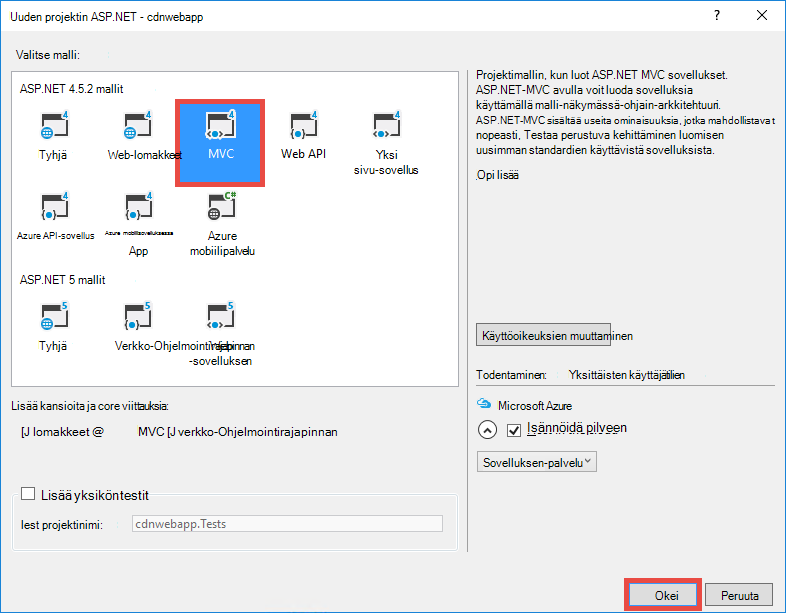
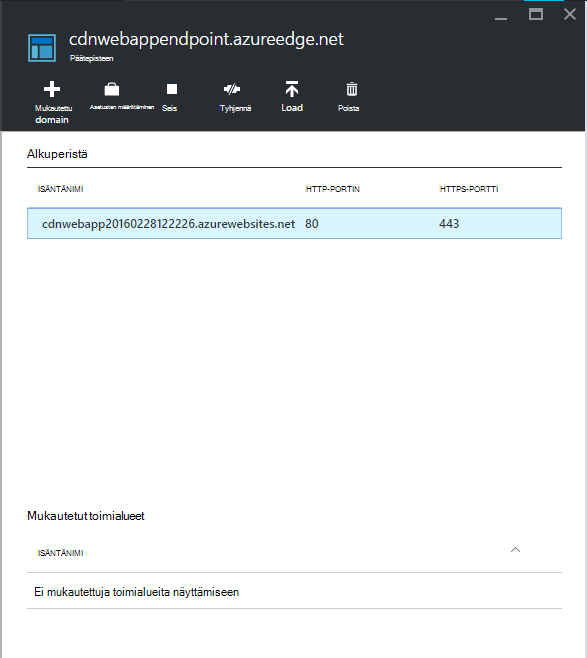

<properties 
    pageTitle="Käytä Azure CDN Azure sovelluksen-palvelussa" 
    description="Opetusohjelma, avulla opit web-sovelluksen käyttöönotto Azure sovelluksen-palveluun, joka on integroitu Azure CDN päätepisteen sisältö" 
    services="app-service\web,cdn" 
    documentationCenter=".net" 
    authors="cephalin" 
    manager="wpickett" 
    editor="jimbe"/>

<tags 
    ms.service="app-service" 
    ms.workload="tbd" 
    ms.tgt_pltfrm="na" 
    ms.devlang="dotnet" 
    ms.topic="article" 
    ms.date="07/01/2016" 
    ms.author="cephalin"/>


# <a name="use-azure-cdn-in-azure-app-service"></a>Käytä Azure CDN Azure sovelluksen-palvelussa

[Sovelluksen palvelun](http://go.microsoft.com/fwlink/?LinkId=529714) voi integroida [Azure CDN](/services/cdn/), lisäät luontaisen [App palvelun](http://go.microsoft.com/fwlink/?LinkId=529714) verkkosovelluksissa yleinen skaalauksen ominaisuuksia web app-sisällön yleisesti-palvelimen solmujen lähellä asiakkaille, että tarjoillaan (päivitetty kaikki nykyisen solmun sijainnit-luettelo löytyy [tähän](http://msdn.microsoft.com/library/azure/gg680302.aspx)). Tilanteissa, kuten Suomen staattisia kuvia integrointi voit lisätä oman Azure App palvelun Web Apps-sovellusten suorituskykyä ja parantaa merkittävästi web-sovelluksen käyttökokemuksen kaikkialla maailmassa. 

Web Apps-integraation Azure CDN antaa seuraavat edut:

- Sisällön käyttöönoton (kuvien, komentosarjojen ja tyylisivut) integroida web-sovelluksen [Jatkuva käyttöönoton](app-service-continuous-deployment.md) yhteydessä
- Päivitä helposti-sovellukseen Azure-sovelluksen palvelun, kuten jQuery tai käynnistyksen versiot NuGet-paketit 
- Visual Studio samalla käyttöliittymästä Web-sovelluksen ja CDN served sisällön hallinta
- Integroi ASP.NET niputus ja minification Azure CDN

[AZURE.INCLUDE [app-service-web-to-api-and-mobile](../../includes/app-service-web-to-api-and-mobile.md)] 

## <a name="what-you-will-build"></a>Mitä muodostetaan ##

Otetaan käyttöön verkkosovellukseen Azure-sovelluksen palveluun käyttämällä oletusarvoista ASP.NET MVC mallin Visual Studiossa, lisää koodi tukemaan sisältöä integroitu Azure-CDN, kuten kuva, ohjauskoneen toiminnon tulokset ja oletusarvon JavaScript- ja CSS-tiedostojen ja koodin määrittäminen varakyselyjen järjestelmä nippujen served silloin, kun CDN on offline-tilassa, myös kirjoittaminen.

## <a name="what-you-will-need"></a>Tarvittavat komponentit ##

Tässä opetusohjelmassa on seuraavat edellytykset:

-   Aktiivinen [Microsoft Azure-tiliin](/account/)
-   Visual Studio 2015 [Azure SDK .NET](http://go.microsoft.com/fwlink/p/?linkid=323510&clcid=0x409). Jos käytät Visual Studiossa, vaiheet voivat vaihdella.

> [AZURE.NOTE] Sinun on suoritettava tässä opetusohjelmassa Azure tilin:
> + Voit [avata Azure-tili maksutta](/pricing/free-trial/) – hyvitykset Hae avulla voit kokeilla maksettu Azure services ja senkin jälkeen, kun niitä käytetään voit pitää tilin ja käyttää vapaa Azure-palvelut, kuten Web Apps.
> + Voit [aktivoida Visual Studio tilaajan edut](/pricing/member-offers/msdn-benefits-details/) - Your Visual Studio tilauksen käyttöösi hyvitykset joka kuukausi, jonka maksettu Azure-palveluiden avulla.
>
> Jos haluat aloittaa Azure App palvelun ennen rekisteröimässä Azure-tili, siirry [Yritä App palvelu](http://go.microsoft.com/fwlink/?LinkId=523751), jossa lyhytkestoinen starter verkkosovellukseen heti voit luoda sovelluksen-palvelussa. Ei ole pakollinen; luottokortit ei ole sitoumukset.

## <a name="deploy-a-web-app-to-azure-with-an-integrated-cdn-endpoint"></a>Web-sovelluksen käyttöön Azure integroitu CDN päätepisteen kanssa ##

Tässä osassa otetaan käyttöön oletusarvoinen ASP.NET MVC sovelluksen mallissa Visual Studio 2015 sovelluksen-palveluun ja integroida uusi CDN päätepiste. Noudata seuraavia ohjeita:

1. Visual Studio 2015, Luo uusi ASP.NET web-sovelluksen valikkoriviltä siirtymällä **Tiedosto > Uusi > Projekti > verkko > ASP.NET Web-sovelluksen**. Anna sille nimi ja valitse **OK**.

    

3. **MVC** ja valitse **OK**.

    

4. Jos vielä eivät ole kirjautuneena sisään Azure-tiliin, valitse oikeassa yläkulmassa tili-kuvake ja noudata Kirjaudu Azure-tili-valintaikkunassa. Kun olet valmis, Määritä sovellus alla kuvatulla tavalla ja valitse sitten Luo uusi sovelluksen Service-palvelupaketti, kun sovellus **Uusi** .  

    

5. Määritä uusi sovellus Service-suunnitelma-valintaikkunassa alla kuvatulla tavalla ja valitse **OK**. 

    

8. Valitse **Luo** web-sovelluksen luominen.

    

9. Kun ASP.NET-sovellus on luotu, voit julkaista sen Azure Azure App aktiviteetin-ruudun napsauttamalla **Julkaise `<app name>` tämän Web Appiin nyt**. Valitse **Julkaise** loppuun.

    

    Julkaistuja sovelluksen selaimessa tulee näkyviin, kun julkaiseminen on valmis. 

1. Luo CDN päätepiste, kirjaudu sisään [Azure portal](https://portal.azure.com). 
2. Valitse **+ Uusi** > **Media + CDN** > **CDN**.

    

3. Määritä **CDN**, **sijainti**, **resurssiryhmä**, **hinnoittelu taso**ja valitse sitten **Luo**

       

4. **CDN profiili** -sivu napsauttamalla **+ päätepisteen** -painiketta. Anna sille nimi, valitse **Web Appissa** **Origin tyyppi** -valikko ja koodiin **Origin hostname** avattavassa valikossa ja valitse sitten **Lisää**.  

    


    > [AZURE.NOTE] Kun luodaan CDN päätepiste **päätepisteen** sivu näkyy sen CDN URL-osoite ja se on integroitu origin muokattavan toimialueen. Voit kuitenkin kestää hetken uuden CDN päätepisteen konfiguroinnin täysin muuttuvan CDN solmu sijainteihin. 

3. **Päätepisteen** -sivu Valitse juuri luomasi CDN päätepisteen nimi.

    

3. Valitse **Määritä** -painiketta. **Määritä** , sivu-Valitse **kyselyn merkkijono välimuistiin toiminta** avattavassa valikossa **välimuistiin jokaisen yksilöllinen URL-osoite** ja valitse sitten **Tallenna** -painiketta.


    

Kun otat tämän, saman linkin toisessa kyselyssä merkkijonoja: n tallennetaan erilliset tapahtumat.

>[AZURE.NOTE] Kyselymerkkijonon ottaminen käyttöön ei ole välttämätön opetusohjelman sisältö, kun haluat tehdä tämä etuajassa mahdollisimman asiasta jälkeen muutoksia tähän suorittaminen kestää leviäminen CDN solmujen aika ja et halua muiden kysely-merkkijono-käyttävä sisältöä, tukkia CDN-välimuisti (päivittäminen CDN sisältö on lisätietoja jäljempänä).

2. Siirry nyt CDN päätepisteosoite. Jos päätepiste on valmis, pitäisi näkyä näkyviin koodiin. Jos **HTTP 404** -virhe, CDN päätepisteen ei ole valmis. Voit joutua odottamaan tunneiksi reunan solmujen muuttuvan CDN kokoonpanoa varten. 

    

1. Kokeile seuraavaksi ASP.NET projektin **~/Content/bootstrap.css** -tiedostoa. Siirry selaimen ikkunan * *http://*&lt;cdnName >*.azureedge.net/Content/bootstrap.css**. Omien asetusten tätä URL-osoite on:

        http://az673227.azureedge.net/Content/bootstrap.css

    Joka vastaa CDN päätepisteen osoitteessa seuraava origin URL-osoite:

        http://cdnwebapp.azurewebsites.net/Content/bootstrap.css

    Kun siirryt * *http://*&lt;cdnName >*.azureedge.net/Content/bootstrap.css**, pyydetään lataamaan bootstrap.css, joka oli verkkosovelluksen Azure-tietokannassa. 

    

Voit käyttää samalla tavalla kuin julkinen URL-Osoitteen etsiminen * *http://*&lt;palvelun nimi >*.cloudapp.net/** suoraan CDN päätepiste. Esimerkki:

-   Script polusta .js-tiedosto
-   Mitä tahansa /Content sisällön tiedoston polku
-   Ohjaimen tai toiminnon 
-   Jos kyselymerkkijonon on käytössä CDN päätepisteen, minkä tahansa kyselyn merkkijonojen URL-osoite
-   Koko Azure web Appissa, jos kaikki sisältö on julkinen

Huomaa, että se ei saa aina hyvä (tai yleensä hyvä) tukemaan Azure CDN läpi koko Azure web-sovelluksen. Joitakin huomautukset ovat seuraavat:

-   Tämän menetelmän edellyttää, että koko sivuston olevan julkinen, koska Azure CDN ei voi olla minkä tahansa arkaluontoista sisältöä.
-   Jos CDN päätepisteen menee offline-tilassa jostakin syystä, onko suunniteltu ylläpito- tai käyttäjän virhe koko koodiin menee offline-tilaan paitsi asiakkaat voivat ohjataan origin URL-Osoitteen * *http://*&lt;nimi >*.azurewebsites.net/**. 
-   Vaikka ja mukautetut välimuisti-komponenttien asetukset (katso [määrittäminen välimuistiasetukset staattiset tiedostot Azure-sovellukseen](#configure-caching-options-for-static-files-in-your-azure-web-app)) CDN päätepisteen ei paranna suorituskykyä erittäin dynaamisen sisällön. Jos yritit ladata kotisivun CDN päätepisteen kuin edellä, Huomaa, että kului vähintään viisi sekuntia ladata oletuskotisivu ensimmäistä kertaa, joka on melko yksinkertainen sivu. Kuvitellaan, mitä käydä asiakas-ratkaisun Jos sivu sisältää dynaamisen sisällön, joka on päivitettävä minuutin välein. Lyhyt välimuistin vanheneminen, joka vastaa usein käytetyt välimuistin epäonnistumisten CDN päätepisteen osoitteessa käsittelevä CDN päätepisteen dynaamisen sisällön edellyttää. Tämä hurts Azure koodiin suorituskykyä ja defeats CDN käyttötarkoituksen.

Vaihtoehtona on selvittää, mitä sisältöä tukemaan Azure CDN-tapaus-välein Azure-sovellukseen. Tämän vuoksi tullut jo käyttämisestä sisällön lomaketiedostot CDN päätepisteestä. Voin kerrotaan, kuinka tukemaan tietyn ohjauskoneen-toiminto läpi CDN päätepisteen- [yhteyshenkilönä sisällön ohjauskoneen toiminnot Azure CDN kautta](#serve-content-from-controller-actions-through-azure-cdn).

## <a name="configure-caching-options-for-static-files-in-your-azure-web-app"></a>Määritä staattisia tiedostoja välimuistin asetukset Azure-sovellukseen ##

Azure-sovellukseen integrointi Azure CDN voit määrittää, kuinka välimuistiin CDN päätepisteen staattiseksi sisällöksi. Voit tehdä tämän Avaa *Web.config* ASP.NET projektin (kuten **cdnwebapp**) ja lisää `<staticContent>` elementin `<system.webServer>`. Alla olevassa XML määrittää välimuistin voimassa kolme päivää.  

    <system.webServer>
      <staticContent>
        <clientCache cacheControlMode="UseMaxAge" cacheControlMaxAge="3.00:00:00"/>
      </staticContent>
      ...
    </system.webServer>

Kun teet näin, kaikki staattiset tiedostot Azure-sovellukseen tarkkailla CDN välimuistin saman sääntö. Välimuistiasetukset eritellympiä hallintaan Lisää *Web.config* -tiedosto kansioon ja asetuksia siellä. Esimerkiksi *Web.config* -tiedoston lisääminen *\Content* -kansioon ja sisällön korvaaminen seuraavat XML:

    <?xml version="1.0"?>
    <configuration>
      <system.webServer>
        <staticContent>
          <clientCache cacheControlMode="UseMaxAge" cacheControlMaxAge="15.00:00:00"/>
        </staticContent>
      </system.webServer>
    </configuration>

Tämä asetus valitaan, kaikki staattiset tiedostot välimuistiin 15 päivää *\Content* -kansiosta.

Lisätietoja siitä, miten voit määrittää `<clientCache>` elementti, katso [välimuistiin &lt;clientCache >](http://www.iis.net/configreference/system.webserver/staticcontent/clientcache).

Seuraavan osion voin myös kerrotaan, miten voit määrittää ohjauskoneen toiminnon tulosten välimuistiasetukset CDN välimuistin.

## <a name="serve-content-from-controller-actions-through-azure-cdn"></a>Yhteyshenkilönä sisällön ohjauskoneen toiminnot Azure CDN kautta ##

Kun verkkosovelluksissa integroida Azure CDN on suhteellisen helppoa tukemaan Azure CDN kautta ohjauskoneen toiminnot-sisältöä. Uudelleen, jos tukemaan oman CDN läpi koko Azure web-sovelluksen, ei tarvitse tehdä tämä lainkaan, koska ohjauskoneen toiminnot ovat jo tavoitettavissa CDN kautta. Mutta voin jo maininnut- [käyttöönotto Azure web app-sovelluksessa integroitu CDN päätepisteissä](#deploy-a-web-app-to-azure-with-an-integrated-cdn-endpoint)syistä voivat päättää vastaan tämä ja valitse sen sijaan voit valita haluamasi tukemaan Azure CDN-ohjain-toiminto. [Maarten Balliauw](https://twitter.com/maartenballiauw) näytetään, miten tehdään hauska MemeGenerator ohjauskoneen [pelkistäviä viive Azure CDN kanssa verkossa](http://channel9.msdn.com/events/TechDays/Techdays-2014-the-Netherlands/Reducing-latency-on-the-web-with-the-Windows-Azure-CDN). Voin yksinkertaisesti toistamaan sen tähän.

Oletetaan, että haluat luoda memes perusteella nuorten Chuck Norris kuvan (valokuvan [Jari](http://www.flickr.com/photos/alan-light/218493788/)valo) tässä muodossa-sovellukseen:


Sinulla on yksinkertainen `Index` toiminto, jonka avulla voit määrittää superlatiivin kuvan asiakkaat Luo meme sitten, kun ne julkaiseminen toiminnon. Koska Chuck Norris, todennäköisesti odottanut tällä sivulla voit liittyä ole Suositut yleisesti. Tämä on hyvä esimerkki käsittelevä osittain dynaamisen sisällön Azure CDN kanssa. 

Noudata edellä esiteltyjä ohjauskoneen toiminto: n määrittäminen:

1. *\Controllers* -kansioon Luo uusi .cs tiedosto nimeltä *MemeGeneratorController.cs* ja korvaa sisällön seuraava koodi. Korvaa oman tiedostopolku `~/Content/chuck.bmp` ja että CDN nimi `yourCDNName`.


        using System;
        using System.Collections.Generic;
        using System.Diagnostics;
        using System.Drawing;
        using System.IO;
        using System.Net;
        using System.Web.Hosting;
        using System.Web.Mvc;
        using System.Web.UI;

        namespace cdnwebapp.Controllers
        {
          public class MemeGeneratorController : Controller
          {
            static readonly Dictionary<string, Tuple<string ,string>> Memes = new Dictionary<string, Tuple<string, string>>();

            public ActionResult Index()
            {
              return View();
            }

            [HttpPost, ActionName("Index")]
            public ActionResult Index_Post(string top, string bottom)
            {
              var identifier = Guid.NewGuid().ToString();
              if (!Memes.ContainsKey(identifier))
              {
                Memes.Add(identifier, new Tuple<string, string>(top, bottom));
              }

              return Content("<a href=\"" + Url.Action("Show", new {id = identifier}) + "\">here's your meme</a>");
            }

            [OutputCache(VaryByParam = "*", Duration = 1, Location = OutputCacheLocation.Downstream)]
            public ActionResult Show(string id)
            {
              Tuple<string, string> data = null;
              if (!Memes.TryGetValue(id, out data))
              {
                return new HttpStatusCodeResult(HttpStatusCode.NotFound);
              }

              if (Debugger.IsAttached) // Preserve the debug experience
              {
                return Redirect(string.Format("/MemeGenerator/Generate?top={0}&bottom={1}", data.Item1, data.Item2));
              }
              else // Get content from Azure CDN
              {
                return Redirect(string.Format("http://<yourCDNName>.azureedge.net/MemeGenerator/Generate?top={0}&bottom={1}", data.Item1, data.Item2));
              }
            }

            [OutputCache(VaryByParam = "*", Duration = 3600, Location = OutputCacheLocation.Downstream)]
            public ActionResult Generate(string top, string bottom)
            {
              string imageFilePath = HostingEnvironment.MapPath("~/Content/chuck.bmp");
              Bitmap bitmap = (Bitmap)Image.FromFile(imageFilePath);

              using (Graphics graphics = Graphics.FromImage(bitmap))
              {
                SizeF size = new SizeF();
                using (Font arialFont = FindBestFitFont(bitmap, graphics, top.ToUpperInvariant(), new Font("Arial Narrow", 100), out size))
                {
                    graphics.DrawString(top.ToUpperInvariant(), arialFont, Brushes.White, new PointF(((bitmap.Width - size.Width) / 2), 10f));
                }
                using (Font arialFont = FindBestFitFont(bitmap, graphics, bottom.ToUpperInvariant(), new Font("Arial Narrow", 100), out size))
                {
                    graphics.DrawString(bottom.ToUpperInvariant(), arialFont, Brushes.White, new PointF(((bitmap.Width - size.Width) / 2), bitmap.Height - 10f - arialFont.Height));
                }
              }
              MemoryStream ms = new MemoryStream();
              bitmap.Save(ms, System.Drawing.Imaging.ImageFormat.Png);
              return File(ms.ToArray(), "image/png");
            }

            private Font FindBestFitFont(Image i, Graphics g, String text, Font font, out SizeF size)
            {
              // Compute actual size, shrink if needed
              while (true)
              {
                size = g.MeasureString(text, font);

                // It fits, back out
                if (size.Height < i.Height &&
                     size.Width < i.Width) { return font; }

                // Try a smaller font (90% of old size)
                Font oldFont = font;
                font = new Font(font.Name, (float)(font.Size * .9), font.Style);
                oldFont.Dispose();
              }
            }
          }
        }

2. Kaksoisnapsauta oletusarvo `Index()` toiminto ja valitse **Lisää näkymä**.

    

3.  Hyväksy alla asetukset ja sitten **Lisää**.

    

4. Avaa uusi *Views\MemeGenerator\Index.cshtml* ja sisällön korvaaminen seuraavat yksinkertainen HTML superlatiivin lähettämistä varten:

        <h2>Meme Generator</h2>
        
        <form action="" method="post">
            <input type="text" name="top" placeholder="Enter top text here" />
            <br />
            <input type="text" name="bottom" placeholder="Enter bottom text here" />
            <br />
            <input class="btn" type="submit" value="Generate meme" />
        </form>

5. Julkaise uudelleen Azure web App-sovellukseen ja siirry * *http://*&lt;palvelun nimi >*.cloudapp.net/MemeGenerator/Index** selaimessa. 

Kun lähetät lomakkeen arvot kohteeseen `/MemeGenerator/Index`, `Index_Post` toiminto menetelmä palauttaa linkki `Show` toiminto menetelmä vastaaviin syötteen tunnuksessa on virhe. Kun olet napsauttanut linkkiä, pääset seuraava koodi:  

    [OutputCache(VaryByParam = "*", Duration = 1, Location = OutputCacheLocation.Downstream)]
    public ActionResult Show(string id)
    {
      Tuple<string, string> data = null;
      if (!Memes.TryGetValue(id, out data))
      {
        return new HttpStatusCodeResult(HttpStatusCode.NotFound);
      }

      if (Debugger.IsAttached) // Preserve the debug experience
      {
        return Redirect(string.Format("/MemeGenerator/Generate?top={0}&bottom={1}", data.Item1, data.Item2));
      }
      else // Get content from Azure CDN
      {
        return Redirect(string.Format("http://<yourCDNName>.azureedge.net/MemeGenerator/Generate?top={0}&bottom={1}", data.Item1, data.Item2));
      }
    }

Jos paikallisen virheenkorjaus on liitetty, näkyviin tulee paikallisen uudelleenohjaus Normaali virheenkorjaus kokemusta. Jos se on käynnissä Azure web App-sovelluksessa, valitse se ohjaa:

    http://<yourCDNName>.azureedge.net/MemeGenerator/Generate?top=<formInput>&bottom=<formInput>

Joka vastaa CDN päätepisteen osoitteessa seuraava origin URL-osoite:

    http://<yourSiteName>.azurewebsites.net/cdn/MemeGenerator/Generate?top=<formInput>&bottom=<formInput>

Kun URL-osoite uudelleen aiemmin sääntöä, saa välimuistiin CDN päätepisteen todellinen tiedosto on:

    http://<yourSiteName>.azurewebsites.net/MemeGenerator/Generate?top=<formInput>&bottom=<formInput>

Voit käyttää `OutputCacheAttribute` määrite `Generate` menetelmää voit määrittää, miten toiminnon tulos välimuistiin, joka tukee Azure CDN. Seuraava koodi Määritä 1 tunti (3 600 sekuntia) välimuistin voimassaolon.

    [OutputCache(VaryByParam = "*", Duration = 3600, Location = OutputCacheLocation.Downstream)]

Vastaavasti voit voi toimia sisällön ohjauskoneen toiminnon määrittäminen Azure-sovellukseen kautta Azure-CDN välimuistiin haluamasi vaihtoehto.

Seuraavan osion voin kerrotaan, kuinka tukemaan Azure CDN – CSS ja yhdistettyjä ja minified komentosarjoja. 

## <a name="integrate-aspnet-bundling-and-minification-with-azure-cdn"></a>Integroi ASP.NET niputus ja minification Azure CDN ##

Komentosarjojen ja CSS-tyylisivut harvoin muuttuvat, ja niitä kaiken lähdetietoina Azure CDN välimuistin. Helpoin tapa niputus ja minification integroida Azure CDN käsittelevä Azure CDN läpi koko web-sovelluksen on. Kuitenkin kuin voi halutessaan vastaan tämän menetelmän [liittää Azure web app- ja toimii staattinen sisältölähdettä Azure CDN verkkosivua Azure CDN päätepisteen](#deploy-a-web-app-to-azure-with-an-integrated-cdn-endpoint)kuvattu syistä, voin kerrotaan, kuinka voit tehdä säilyttämällä haluamasi develper kokemus ASP.NET niputus ja minification, kuten:

-   Hyvien virheenkorjaus tila-toiminto
-   Virtaviivaistettu käyttöönotto
-   Komentosarjan/CSS-versiopäivitykset työasemaohjelmista heti päivitykset
-   Kun CDN päätepisteen epäonnistuu varakyselyjen järjestelmä
-   Pienennä koodin muokkaaminen

ASP.NET projekti, jonka loit [liittää Azure CDN päätepisteen Azure web app- ja toimii staattinen sisältölähdettä Azure CDN verkkosivua](#deploy-a-web-app-to-azure-with-an-integrated-cdn-endpoint), Avaa *App_Start\BundleConfig.cs* ja tutustu `bundles.Add()` menetelmäkutsujen.

    public static void RegisterBundles(BundleCollection bundles)
    {
        bundles.Add(new ScriptBundle("~/bundles/jquery").Include(
                    "~/Scripts/jquery-{version}.js"));
        ...
    }

Ensimmäinen `bundles.Add()` lauseen Lisää komentosarja-pikaoppaista näennäiskansio `~/bundles/jquery`. Avaa *Views\Shared\_Layout.cshtml* nähdäksesi, kuinka komentosarjan pikaoppaista tunnisteen muodostetaan. Sinun pitäisi Etsi seuraava rivi Razor koodi:

    @Scripts.Render("~/bundles/jquery")

Kun Razor koodi suoritetaan Azure web App-sovelluksessa, se on mahdollista `<script>` seuraavanlainen komentosarja-pikaoppaista-tunniste: 

    <script src="/bundles/jquery?v=FVs3ACwOLIVInrAl5sdzR2jrCDmVOWFbZMY6g6Q0ulE1"></script>

Kun se suoritetaan Visual Studiossa kirjoittamalla `F5`, se hahmonnetaan kunkin komentosarjatiedosto olevien erikseen (yllä tapauksessa vain yksi komentosarjatiedosto on töihin):

    <script src="/Scripts/jquery-1.10.2.js"></script>

Näin voit virheenkorjaus oman kehitysympäristö JavaScript-koodia pienentämisestä samanaikainen asiakasyhteydet (Niputustoiminnon) ja parantaa tiedoston lataamisen tuotannon suorituskyvyn (minification). Se on hyvä ominaisuus säilyttää Azure CDN integrointi. Lisäksi hahmontamisen töihin on jo automaattisesti luotu versiomerkkijono, koska haluat toistaa vastaavia toimintoja niin, että aina, kun päivität jQuery-versiosi NuGet kautta, se voidaan päivittää osoitteessa asiakaspuolen mahdollisimman pian.

Noudata alla olevia ohjeita integrointi ASP.NET niputus ja minification CDN päätepisteen kanssa.

1. Takaisin sisään *App_Start\BundleConfig.cs*, muokata `bundles.Add()` tapoja eri [Pikaoppaista konstruktori](http://msdn.microsoft.com/library/jj646464.aspx), sellainen, joka määrittää CDN-osoitteen. Voit tehdä tämän korvaa `RegisterBundles` menetelmä määritelmä seuraava koodi:  
    
        public static void RegisterBundles(BundleCollection bundles)
        {
          bundles.UseCdn = true;
          var version = System.Reflection.Assembly.GetAssembly(typeof(Controllers.HomeController))
            .GetName().Version.ToString();
          var cdnUrl = "http://<yourCDNName>.azureedge.net/{0}?" + version;

          bundles.Add(new ScriptBundle("~/bundles/jquery", string.Format(cdnUrl, "bundles/jquery")).Include(
                "~/Scripts/jquery-{version}.js"));

          bundles.Add(new ScriptBundle("~/bundles/jqueryval", string.Format(cdnUrl, "bundles/jqueryval")).Include(
                "~/Scripts/jquery.validate*"));

          // Use the development version of Modernizr to develop with and learn from. Then, when you're
          // ready for production, use the build tool at http://modernizr.com to pick only the tests you need.
          bundles.Add(new ScriptBundle("~/bundles/modernizr", string.Format(cdnUrl, "bundles/modernizr")).Include(
                "~/Scripts/modernizr-*"));

          bundles.Add(new ScriptBundle("~/bundles/bootstrap", string.Format(cdnUrl, "bundles/bootstrap")).Include(
                "~/Scripts/bootstrap.js",
                "~/Scripts/respond.js"));

          bundles.Add(new StyleBundle("~/Content/css", string.Format(cdnUrl, "Content/css")).Include(
                "~/Content/bootstrap.css",
                "~/Content/site.css"));
        }


    Varmista, että korvaa `<yourCDNName>` Azure CDN nimellä.

    Tavallinen kirjaimin olet määrittämässä `bundles.UseCdn = true` ja huolellisesti CDN URL-osoite lisätään jokaiselle pikaoppaista. Esimerkki: ensimmäisen konstruktoria koodissa:

        new ScriptBundle("~/bundles/jquery", string.Format(cdnUrl, "bundles/jquery"))

    on sama kuin: 

        new ScriptBundle("~/bundles/jquery", string.Format(cdnUrl, "http://<yourCDNName>.azureedge.net/bundles/jquery?<W.X.Y.Z>"))

    Tämä konstruktori kertoo ASP.NET niputus ja minification hahmonnetaan yksittäisen komentosarjatiedostot aloittaessasi paikallisesti, mutta määritetty CDN osoite käyttämään kyseistä komentosarja. Huomaa kuitenkin kaksi tärkeitä ominaisuuksia ja tämän huolellisesti CDN URL-osoite:
    
    - Alkuperäinen tämä CDN URL-osoite on `http://<yourSiteName>.azurewebsites.net/bundles/jquery?<W.X.Y.Z>`, joka on todella näennäiskansio komentosarjan töihin WWW-sovelluksessa.
    - Koska käytössäsi on CDN konstruktori, töihin CDN komentosarja-tunniste ei enää sisällä hahmontamisen URL-Osoitteen automaattisesti luotu versio merkkijonon. Sinun on luotava manuaalisesti yksilöllinen versiomerkkijono aina, kun komentosarja-pikaoppaista on muokattu pakottaminen osoitteessa Azure CDN epäonnistumisten. Yksilöivä versiomerkkijono on säilyvät muuttumattomina kautta, kun otat käyttöön Suurenna osumia osoitteessa Azure CDN töihin käyttöönoton elinkaaren yhtä aikaa.

3. Kyselymerkkijonon `<W.X.Y.Z>` hakee from *Properties\AssemblyInfo.cs* ASP.NET projektin. Voit määrittää käyttöönoton työnkulun, joka sisältää kasvavat Kokoonpanoversio aina, kun julkaiset Azure. Tai voit muokata *Properties\AssemblyInfo.cs* vain projektin kasvavan versiomerkkijono automaattisesti aina, kun luot-käyttämällä yleismerkki "*". Esimerkiksi muuttaa `AssemblyVersion` alla kuvatulla tavalla:
    
        [assembly: AssemblyVersion("1.0.0.*")]
    
    Muut strategia voi tehostaa luodaan yksilöllinen merkkijono elinkaaren käyttöönoton ajaksi toimii tähän.

3. Julkaise ASP.NET-sovelluksessa ja käyttää aloitussivulle.
 
4. Näytä sivun HTML-koodi. Sinun pitäisi nähdä hahmontaa yksilöllinen versio merkkijonolla aina, kun julkaiset muutokset Azure web App-sovellukseen CDN URL-Osoitteen. Esimerkki:  
    
        ...
        <link href="http://az673227.azureedge.net/Content/css?1.0.0.25449" rel="stylesheet"/>
        <script src="http://az673227.azureedge.net/bundles/modernizer?1.0.0.25449"></script>
        ...
        <script src="http://az673227.azureedge.net/bundles/jquery?1.0.0.25449"></script>
        <script src="http://az673227.azureedge.net/bundles/bootstrap?1.0.0.25449"></script>
        ...

5. Visual Studiossa virheenkorjaus Visual Studiossa ASP.NET-sovelluksen kirjoittamalla `F5`., 

6. Näytä sivun HTML-koodi. Näet kunkin komentosarjatiedosto hahmontaa yksitellen niin, että sinulla on yhtenäinen virheenkorjaus, ilmenee Visual Studiossa.  
    
        ...
        <link href="/Content/bootstrap.css" rel="stylesheet"/>
        <link href="/Content/site.css" rel="stylesheet"/>
        <script src="/Scripts/modernizr-2.6.2.js"></script>
        ...
        <script src="/Scripts/jquery-1.10.2.js"></script>
        <script src="/Scripts/bootstrap.js"></script>
        <script src="/Scripts/respond.js"></script>
        ...    

## <a name="fallback-mechanism-for-cdn-urls"></a>Varakyselyjen järjestelmä CDN URL-osoitteet ##

Azure CDN päätepisteen epäonnistuu jostakin syystä, kun haluat verkkosivulle on automaattinen käyttämään origin verkkopalvelin lataamisen JavaScript- tai automaattinen varakyselyjen-asetus. On vakavia menetät vuoksi CDN ole käytettävissä, mutta paljon vakavia menetät tärkeitä sivun toimintoja komentosarjojen ja tyylisivut koodiin kuvat.

[Pikaoppaista](http://msdn.microsoft.com/library/system.web.optimization.bundle.aspx) -luokka sisältää ominaisuuden, jonka avulla voit määrittää varakyselyjen järjestelmä CDN epäonnistumiseen [CdnFallbackExpression](http://msdn.microsoft.com/library/system.web.optimization.bundle.cdnfallbackexpression.aspx) . Jos haluat käyttää tätä ominaisuutta, noudata seuraavia ohjeita:

1. ASP.NET-projektin Avaa *App_Start\BundleConfig.cs*, johon lisäsit CDN URL-osoite kunkin [Pikaoppaista konstruktori](http://msdn.microsoft.com/library/jj646464.aspx), ja lisää `CdnFallbackExpression` koodi neljään varakyselyjen järjestelmä lisääminen oletusarvon nippujen esitetyllä.  
    
        public static void RegisterBundles(BundleCollection bundles)
        {
          var version = System.Reflection.Assembly.GetAssembly(typeof(BundleConfig))
            .GetName().Version.ToString();
          var cdnUrl = "http://cdnurl.azureedge.net/.../{0}?" + version;
          bundles.UseCdn = true;

          bundles.Add(new ScriptBundle("~/bundles/jquery", string.Format(cdnUrl, "bundles/jquery")) 
                { CdnFallbackExpression = "window.jquery" }
                .Include("~/Scripts/jquery-{version}.js"));

          bundles.Add(new ScriptBundle("~/bundles/jqueryval", string.Format(cdnUrl, "bundles/jqueryval")) 
                { CdnFallbackExpression = "$.validator" }
                .Include("~/Scripts/jquery.validate*"));

          // Use the development version of Modernizr to develop with and learn from. Then, when you're
          // ready for production, use the build tool at http://modernizr.com to pick only the tests you need.
          bundles.Add(new ScriptBundle("~/bundles/modernizr", string.Format(cdnUrl, "bundles/modernizer")) 
                { CdnFallbackExpression = "window.Modernizr" }
                .Include("~/Scripts/modernizr-*"));

          bundles.Add(new ScriptBundle("~/bundles/bootstrap", string.Format(cdnUrl, "bundles/bootstrap"))     
                { CdnFallbackExpression = "$.fn.modal" }
                .Include(
                        "~/Scripts/bootstrap.js",
                        "~/Scripts/respond.js"));

          bundles.Add(new StyleBundle("~/Content/css", string.Format(cdnUrl, "Content/css")).Include(
                "~/Content/bootstrap.css",
                "~/Content/site.css"));
        }

    Kun `CdnFallbackExpression` on ei null-komentosarjan syötetään HTML: Testaa, onko töihin on ladattu, ja jos ei käsitellä töihin suoraan origin verkkopalvelin. Tämä ominaisuus on määritettävä JavaScript-lauseke, joka testaa, onko vastaaviin CDN töihin on ladattu oikein. Tarvittavat kunkin pikaoppaista Testaa lausekkeen eroaa sisällön mukaan. Yllä oletusarvon nippujen: varten
    
    - `window.jquery`määritetään jquery-{versio} .js
    - `$.validator`määritetään jquery.validate.js
    - `window.Modernizr`määritetään modernizer-{versio} .js
    - `$.fn.modal`määritetään bootstrap.js
    
    Olet ehkä jo huomannut, että minulla ei ole määrittänyt CdnFallbackExpression varten `~/Cointent/css` pikaoppaista. Tämä johtuu siitä, että käytössä on [System.Web.Optimization ohjelmavirhe](https://aspnetoptimization.codeplex.com/workitem/104) , injects `<script>` sijaan odotettua varakyselyjen CSS-tunniste `<link>` tunniste.
    
    Ei, mutta [Ember Consulting ryhmän](https://github.com/EmberConsultingGroup)tarjoamia hyvä [Tyylin Pikaoppaista varmistusta](https://github.com/EmberConsultingGroup/StyleBundleFallback) . 

2. Käytä vaihtoehtoista menetelmää CSS, .cs uuden tiedoston luominen ASP.NET-projektin *App_Start* kansioon *StyleBundleExtensions.cs*ja korvata sen sisällön [GitHub koodilla](https://github.com/EmberConsultingGroup/StyleBundleFallback/blob/master/Website/App_Start/StyleBundleExtensions.cs). 

4. *App_Start\StyleFundleExtensions.cs*, valitse Nimeä uudelleen nimitilan nimitilan ASP.NET-sovelluksen (kuten **cdnwebapp**). 

3. Palaa `App_Start\BundleConfig.cs` ja korvaa edellisen `bundles.Add` lauseen kanssa seuraava koodi:  

        bundles.Add(new StyleBundle("~/Content/css", string.Format(cdnUrl, "Content/css"))
          .IncludeFallback("~/Content/css", "sr-only", "width", "1px")
          .Include(
            "~/Content/bootstrap.css",
            "~/Content/site.css"));

    Menetelmä tunniste käyttää samaa verrata lisätäkseen komentosarjan HTML-muodossa, voit tarkistaa, DOM vastaavaa luokan nimeä, säännön nimi ja määrittää CSS-pikaoppaista ja takaisin origin verkkopalvelin sisältö kuuluu, jos se epäonnistuu vastaavan säännön arvo.

4. Julkaise Azure koodiin uudelleen ja käyttää aloitussivulle. 
5. Näytä sivun HTML-koodi. Lisättyä komentosarjojen tulisi löytää seuraavankaltaiselta:    
    
    ```
    ...
    <link href="http://az673227.azureedge.net/Content/css?1.0.0.25474" rel="stylesheet"/>
<script>(function() {
                var loadFallback,
                    len = document.styleSheets.length;
                for (var i = 0; i < len; i++) {
                    var sheet = document.styleSheets[i];
                    if (sheet.href.indexOf('http://az673227.azureedge.net/Content/css?1.0.0.25474') !== -1) {
                        var meta = document.createElement('meta');
                        meta.className = 'sr-only';
                        document.head.appendChild(meta);
                        var value = window.getComputedStyle(meta).getPropertyValue('width');
                        document.head.removeChild(meta);
                        if (value !== '1px') {
                            document.write('<link href="/Content/css" rel="stylesheet" type="text/css" />');
                        }
                    }
                }
                return true;
            }())||document.write('<script src="/Content/css"><\/script>');</script>

    <script src="http://az673227.azureedge.net/bundles/modernizer?1.0.0.25474"></script>
    <script>(window.Modernizr)||document.write('<script src="/bundles/modernizr"><\/script>');</script>
    ... 
    <script src="http://az673227.azureedge.net/bundles/jquery?1.0.0.25474"></script>
    <script>(window.jquery)||document.write('<script src="/bundles/jquery"><\/script>');</script>

    <script src="http://az673227.azureedge.net/bundles/bootstrap?1.0.0.25474"></script>
    <script>($.fn.modal)||document.write('<script src="/bundles/bootstrap"><\/script>');</script>
    ...
    ```

    Huomaa, että lisättyä komentosarjan CSS-pikaoppaista sisältää edelleen automaatiokoodia jääneeseen kohteesta `CdnFallbackExpression` rivin ominaisuutta:

        }())||document.write('<script src="/Content/css"><\/script>');</script>

    Mutta koska ensimmäinen osa || lauseke palauttaa aina true (suoraan yllä olevasta allekirjoitusrivillä), document.write()-funktio suoritetaan aina.

6. Voit testata, onko varakyselyjen komentosarja toimii, palaa CDN päätepisteen sivu ja valitse **Pysäytä**.

    

7. Päivitä selainikkunan Azure-verkkosovelluksessa. Ladattu oikein kaikissa komentosarjojen ja tyylisivut pitäisi tulla näkyviin.

## <a name="more-information"></a>Lisätietoja 
- [Yleistä Azure sisällön toimittamisen verkon (CDN)](../cdn/cdn-overview.md)
- [Azure CDN käyttäminen](../cdn/cdn-create-new-endpoint.md)
- [Integroi Azure CDN pilvipalveluun](../cdn/cdn-cloud-service-with-cdn.md)
- [ASP.NET niputus ja Minification](http://www.asp.net/mvc/tutorials/mvc-4/bundling-and-minification)

