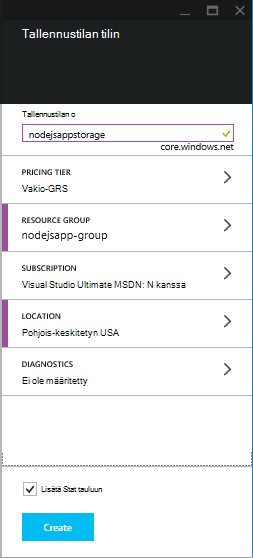
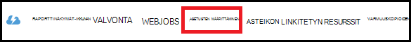
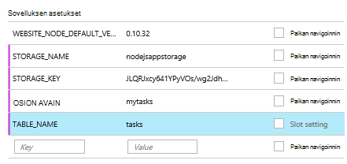

<properties
    pageTitle="Azure-taulukosta palveluun node.js web Appissa"
    description="Tässä opetusohjelmassa avulla opit Azure-taulukosta-palvelun avulla voit tallentaa tietoja Node.js-sovelluksesta, joka isännöi Azure App palvelun verkkosovelluksissa."
    tags="azure-portal"
    services="app-service\web, storage"
    documentationCenter="nodejs"
    authors="rmcmurray"
    manager="wpickett"
    editor=""/>

<tags
    ms.service="storage"
    ms.workload="storage"
    ms.tgt_pltfrm="na"
    ms.devlang="nodejs"
    ms.topic="article"
    ms.date="08/11/2016"
    ms.author="robmcm"/>

# Azure-taulukosta palveluun node.js web Appissa

## Yleiskatsaus

Tässä opetusohjelmassa näytetään, miten taulukon palvelu Azure tietojen hallinta avulla voit tallentaa ja käyttää tietoja isännöidään [Azure App palvelun](http://go.microsoft.com/fwlink/?LinkId=529714) verkkosovelluksissa [solmu] -sovelluksesta. Tässä opetusohjelmassa oletetaan, että edellisen kokemusta solmu ja [Git]avulla.

Opit seuraavat asiat:

* Opit käyttämään asentaa solmu moduulit npm (solmu paketinhallinta)

* Azure-taulukosta-palvelun kanssa työskentely

* Opi käyttämään Azure-CLI web-sovelluksen luominen.

Noudattamalla tässä opetusohjelmassa luot yksinkertaisen verkkopohjaisia "tehtäväluettelo-sovellus, jonka avulla luodaan, hakeminen ja tehtävien suorittamisesta. Taulukko-palvelu on tallennettu tehtävien.

Näin valmiin sovelluksen:

![Näyttää tyhjän tasklist verkkosivulle][node-table-finished]

>[AZURE.NOTE] Jos haluat aloittaa Azure App palvelun ennen rekisteröimässä Azure-tili, siirry [Yritä App palvelu](http://go.microsoft.com/fwlink/?LinkId=523751), jossa lyhytkestoinen starter verkkosovellukseen heti voit luoda sovelluksen-palvelussa. Ei ole pakollinen; luottokortit ei ole sitoumukset.

## Edellytykset

Ennen kuin noudattamalla tämän artikkelin, varmista, että sinulla on asennettuna seuraavat:

* [solmun] versio 0.10.24 tai uudempi versio

* [Git]

[AZURE.INCLUDE [create-account-and-websites-note](../../includes/create-account-and-websites-note.md)]

## Tallennustilan tilin luominen

Luo tili Azure-tallennustilan. Sovellus käyttää tätä tiliä Seurattavien kohteiden tallentamiseen.

1.  Lokitiedoston [Azure Portal](https://portal.azure.com/).

2. Portaalin vasemmassa alareunassa **Uusi** -kuvaketta ja valitse sitten **tiedot + tallennustilan** > **tallennustilan**. Anna tilille tallennustilan yksilöllinen nimi ja luo uusi [resurssiryhmä](../azure-resource-manager/resource-group-overview.md) sen.

    

    Kun tallennustilan-tili on luotu, **ilmoitukset** -painike vilkkuu vihreä **onnistumisen** ja tallennustilaa tili-sivu on avoinna osoittamaan, että se kuuluu luomasi uusi resurssiryhmä.

5. Valitse sivu tallennustilan tilin **asetukset** > **avaimet**. Kopioi Leikepöydälle ensisijainen pikanäppäin.

    ![Pikanäppäin][portal-storage-access-keys]

##Asenna moduulit ja luo rakennustelineet

Tässä osassa luodaan uusi solmu-sovellus ja npm avulla voit lisätä moduulin paketit. Tämän sovelluksen käytetään [Express] ja [Azure] -moduuleja. Express-moduulin tarjoaa kehyksen Model näkymän ohjauskoneen solmu, kun Azure moduulit muodostaa yhteyden taulukko-palveluun.

### Asenna express ja luo rakennustelineet

1. Komentoriviltä, Luo uusi kansio nimeltä **tasklist** ja vaihda tähän kansioon.  

2. Kirjoita seuraava komento Express-moduulin asentaminen.

        npm install express-generator@4.2.0 -g

    Voit joutua valitseminen sudo ennen komentoa määräytyy käyttöjärjestelmän mukaan:

        sudo npm install express-generator@4.2.0 -g

    Tulos näyttää samalta seuraavassa esimerkissä:

        express-generator@4.2.0 /usr/local/lib/node_modules/express-generator
        ├── mkdirp@0.3.5
        └── commander@1.3.2 (keypress@0.1.0)

    > [AZURE.NOTE] '-G-parametri on asennettu moduulin yleisesti. Näin voit Käytämme **express** luomiseen web app-rakennustelineet eikä sinun tarvitse kirjoittaa lisätietoja polusta.

4. Luo sovelluksen rakennustelineet, kirjoita **express** kehote:

        express

    Tämä komento näkyy samalla tavalla kuin seuraavassa esimerkissä:

           create : .
           create : ./package.json
           create : ./app.js
           create : ./public
           create : ./public/images
           create : ./routes
           create : ./routes/index.js
           create : ./routes/users.js
           create : ./public/stylesheets
           create : ./public/stylesheets/style.css
           create : ./views
           create : ./views/index.jade
           create : ./views/layout.jade
           create : ./views/error.jade
           create : ./public/javascripts
           create : ./bin
           create : ./bin/www

           install dependencies:
             $ cd . && npm install

           run the app:
             $ DEBUG=my-application ./bin/www

    Nyt on useita uusia kansioita ja tiedostoja **tasklist** hakemistossa.

### Asenna moduuleja

Yhden tiedoston, **express** Luo on **package.json**. Tiedoston nimi sisältää moduulin riippuvuudet luettelo. Myöhemmin, kun asennat sovelluksen palvelun Web Apps sovelluksen, tämä tiedosto määrittää moduulit on oltava asennettuna Azure.

-Komentorivin Kirjoita seuraava komento asentaa moduulit- **package.json** -tiedostossa. Voit joutua käyttämään "sudo".

    npm install

Tämä komento näkyy samalla tavalla kuin seuraavassa esimerkissä:

    debug@0.7.4 node_modules\debug

    cookie-parser@1.0.1 node_modules\cookie-parser
    ├── cookie-signature@1.0.3
    └── cookie@0.1.0

    [...]

Kirjoita seuraava komento asentaa [azure], [solmu uuid], [nconf] ja [asynkroninen] moduulit:

    npm install azure-storage node-uuid async nconf --save

**--Tallenna** merkinnän Lisää nämä moduulit merkintöjen **package.json** tiedostoon.

Tämä komento näkyy samalla tavalla kuin seuraavassa esimerkissä:

    async@0.9.0 node_modules\async

    node-uuid@1.4.1 node_modules\node-uuid

    nconf@0.6.9 node_modules\nconf
    ├── ini@1.2.1
    ├── async@0.2.9
    └── optimist@0.6.0 (wordwrap@0.0.2, minimist@0.0.10)

    [...]

## Sovelluksen luominen

On nyt voit luoda sovelluksen.

### Mallin luominen

*Malli* on objekti, joka edustaa sovelluksen tiedot. Sovelluksen vain malli on tehtäväobjekti, joka edustaa kohdetta Tehtävät-luettelo. Tehtävien on seuraavat kentät:

- PartitionKey
- RowKey
- nimi (merkkijono)
- luokan (merkkijono)
- valmiit (totuusarvo)

**PartitionKey** ja **RowKey** käytetään taulukon-palvelun taulukon avaimet. Lisätietoja on artikkelissa [taulukon Service-tietomallin perusteet](https://msdn.microsoft.com/library/azure/dd179338.aspx).

1. **Tasklist** kansioon Luo uusi kansio nimeltä **Mallit**.

2. **Mallit** -kansioon Luo uusi tiedosto nimeltä **task.js**. Tämä tiedosto sisältää sovelluksen luomat tehtävät mallista.

3. **Task.js** tiedoston alussa Lisää tarvittavat kirjastojen viittaamaan seuraava koodi:

        var azure = require('azure-storage');
        var uuid = require('node-uuid');
        var entityGen = azure.TableUtilities.entityGenerator;

4. Lisää seuraava koodi määrittäminen ja viedä tehtävän objektin. Tämä objekti on vastuussa yhteyden taulukkoon.

        module.exports = Task;

        function Task(storageClient, tableName, partitionKey) {
          this.storageClient = storageClient;
          this.tableName = tableName;
          this.partitionKey = partitionKey;
          this.storageClient.createTableIfNotExists(tableName, function tableCreated(error) {
            if(error) {
              throw error;
            }
          });
        };

5. Lisää seuraava koodi, voit määrittää muita tapoja tehtävän objektin jotka mahdollistavat aktiviteettien taulukon tallennettuja tietoja:

        Task.prototype = {
          find: function(query, callback) {
            self = this;
            self.storageClient.queryEntities(this.tableName, query, null, function entitiesQueried(error, result) {
              if(error) {
                callback(error);
              } else {
                callback(null, result.entries);
              }
            });
          },

          addItem: function(item, callback) {
            self = this;
            // use entityGenerator to set types
            // NOTE: RowKey must be a string type, even though
            // it contains a GUID in this example.
            var itemDescriptor = {
              PartitionKey: entityGen.String(self.partitionKey),
              RowKey: entityGen.String(uuid()),
              name: entityGen.String(item.name),
              category: entityGen.String(item.category),
              completed: entityGen.Boolean(false)
            };
            self.storageClient.insertEntity(self.tableName, itemDescriptor, function entityInserted(error) {
              if(error){  
                callback(error);
              }
              callback(null);
            });
          },

          updateItem: function(rKey, callback) {
            self = this;
            self.storageClient.retrieveEntity(self.tableName, self.partitionKey, rKey, function entityQueried(error, entity) {
              if(error) {
                callback(error);
              }
              entity.completed._ = true;
              self.storageClient.updateEntity(self.tableName, entity, function entityUpdated(error) {
                if(error) {
                  callback(error);
                }
                callback(null);
              });
            });
          }
        }

6. Tallenna ja sulje **task.js** -tiedosto.

### Luo ohjain

*Ohjain* käsittelee HTTP-pyynnöt ja hahmontaa HTML-vastauksen.

1. **Tasklist/tiet** kansioon Luo uusi tiedosto nimeltä **tasklist.js** ja avaa se tekstieditorissa.

2. Lisää seuraava koodi **tasklist.js**. Tämä Lataa azure ja asynkroninen moduulit, jotka käyttävät **tasklist.js**. Tämä asetus määrittää myös **TaskList** -funktiota, joka on välitetty määritimme aiemmin **tehtävän** objektin esiintymä:

        var azure = require('azure-storage');
        var async = require('async');

        module.exports = TaskList;

3. Määritä **TaskList** objekti.

        function TaskList(task) {
          this.task = task;
        }

4. Lisää **TaskList**seuraavista tavoista:

        TaskList.prototype = {
          showTasks: function(req, res) {
            self = this;
            var query = new azure.TableQuery()
              .where('completed eq ?', false);
            self.task.find(query, function itemsFound(error, items) {
              res.render('index',{title: 'My ToDo List ', tasks: items});
            });
          },

          addTask: function(req,res) {
            var self = this;
            var item = req.body.item;
            self.task.addItem(item, function itemAdded(error) {
              if(error) {
                throw error;
              }
              res.redirect('/');
            });
          },

          completeTask: function(req,res) {
            var self = this;
            var completedTasks = Object.keys(req.body);
            async.forEach(completedTasks, function taskIterator(completedTask, callback) {
              self.task.updateItem(completedTask, function itemsUpdated(error) {
                if(error){
                  callback(error);
                } else {
                  callback(null);
                }
              });
            }, function goHome(error){
              if(error) {
                throw error;
              } else {
               res.redirect('/');
              }
            });
          }
        }

### Muokkaa app.js

1. **Tasklist** hakemistosta Avaa **app.js** -tiedosto. Tämä tiedosto on luotu aiemmin suorittamalla **Pika** -komennon.

2. Tiedoston alkuun, Lisää seuraava azure moduuli, Määritä taulukkonimi-osio-näppäintä, ja tässä esimerkissä käyttämä tallennustila tunnistetietojen määrittäminen:

        var azure = require('azure-storage');
        var nconf = require('nconf');
        nconf.env()
             .file({ file: 'config.json', search: true });
        var tableName = nconf.get("TABLE_NAME");
        var partitionKey = nconf.get("PARTITION_KEY");
        var accountName = nconf.get("STORAGE_NAME");
        var accountKey = nconf.get("STORAGE_KEY");

    > [AZURE.NOTE] nconf ladataan määritysten arvot ympäristömuuttujat tai **config.json** -tiedosto, joka luodaan myöhemmin.

3. App.js-tiedostossa Vieritä on näkyvissä seuraava komento:

        app.use('/', routes);
        app.use('/users', users);

    Korvaa yllä rivien alapuolella näkyvää koodia. Tämä alusta <strong>tehtävän</strong> esiintymä yhteyden tallennustilan-tilisi avulla. Tämä on välitetty <strong>TaskList</strong>, joka käyttää sitä viestintä taulukko-palvelun kanssa:

        var TaskList = require('./routes/tasklist');
        var Task = require('./models/task');
        var task = new Task(azure.createTableService(accountName, accountKey), tableName, partitionKey);
        var taskList = new TaskList(task);

        app.get('/', taskList.showTasks.bind(taskList));
        app.post('/addtask', taskList.addTask.bind(taskList));
        app.post('/completetask', taskList.completeTask.bind(taskList));

4. Tallenna tiedosto **app.js** .

### Indeksi-näkymän muokkaaminen

1. Avaa tekstieditorissa **tasklist/views/index.jade** -tiedosto.

2. Korvaa tiedoston koko sisällön seuraava koodi. Tämä määrittää näkymän, joka näyttää olemassa olevien tehtävien ja sisältää lomakkeen uusien tehtävien lisääminen ja aiemmin luotuja merkitseminen valmiiksi.

        extends layout

        block content
          h1= title
          br

          form(action="/completetask", method="post")
            table.table.table-striped.table-bordered
              tr
                td Name
                td Category
                td Date
                td Complete
              if (typeof tasks === "undefined")
                tr
                  td
              else
                each task in tasks
                  tr
                    td #{task.name._}
                    td #{task.category._}
                    - var day   = task.Timestamp._.getDate();
                    - var month = task.Timestamp._.getMonth() + 1;
                    - var year  = task.Timestamp._.getFullYear();
                    td #{month + "/" + day + "/" + year}
                    td
                      input(type="checkbox", name="#{task.RowKey._}", value="#{!task.completed._}", checked=task.completed._)
            button.btn(type="submit") Update tasks
          hr
          form.well(action="/addtask", method="post")
            label Item Name:
            input(name="item[name]", type="textbox")
            label Item Category:
            input(name="item[category]", type="textbox")
            br
            button.btn(type="submit") Add item

3. Tallenna ja sulje **index.jade** tiedosto.

### Yleisen asettelun

**Näkymien** hakemistossa **layout.jade** -tiedosto on yleinen malli **.jade** muita tiedostoja. Tässä vaiheessa muokataan käyttämään [Twitter-automaattinen](https://github.com/twbs/bootstrap), joka on Työkalut, joka on helppo suunnitteluun nice näköisen verkkosovellukseen.

Lataa ja Pura tiedostot [Twitter-automaattista käynnistystä](http://getbootstrap.com/)varten. Kopioi **bootstrap.min.css** -tiedostoa käynnistyksen **css** -kansion **julkinen/tyylisivut** hakemiston sovelluksesi.

**Näkymät** -kansioon ja Avaa **layout.jade** ja korvata koko sisällön seuraavasti:

    doctype html
    html
      head
        title= title
        link(rel='stylesheet', href='/stylesheets/bootstrap.min.css')
        link(rel='stylesheet', href='/stylesheets/style.css')
      body.app
        nav.navbar.navbar-default
          div.navbar-header
          a.navbar-brand(href='/') My Tasks
        block content

### Config-tiedoston luominen

Suorita sovellus paikallisesti, emme sijoittaa Azuren tallennustilaan tunnistetiedot määritystiedostossa. Luo tiedosto nimeltä * *config.json* *seuraavat JSON kanssa:

    {
        "STORAGE_NAME": "<storage account name>",
        "STORAGE_KEY": "<storage access key>",
        "PARTITION_KEY": "mytasks",
        "TABLE_NAME": "tasks"
    }

Korvaa aiemmin luomasi tallennustilan tilin nimi **tallennustilan tilin nimi** ja korvaa **tallennustilan pikanäppäin** tallennustilan tilin ensisijainen pikanäppäin. Esimerkki:

    {
        "STORAGE_NAME": "nodejsappstorage",
        "STORAGE_KEY": "KG0oDd..."
        "PARTITION_KEY": "mytasks",
        "TABLE_NAME": "tasks"
    }

Tallenna tiedosto *yhden kansion ylempänä* kuin **tasklist** -hakemiston tältä:

    parent/
      |-- config.json
      |-- tasklist/

Syy tekoa on välttää tarkistuksen määritystiedoston tietolähteen ohjausobjektiin kohtaa, johon voi tulla julkinen. Kun sovellus on käyttöön Azure-Käytämme ympäristömuuttujat määritystiedostossa sijaan.

## Suorita sovellus paikallisesti

Voit testata sovelluksen paikallisessa tietokoneessa, toimi seuraavasti:

1. Komentorivin muuttaa kansioiden **tasklist** -kansioon.

2. Käytä seuraavaa komentoa paikallisesti sovellusta käynnistettäessä:

        npm start

3. Avaa selain ja siirry http://127.0.0.1:3000.

    Web-sivun samalla tavalla kuin seuraavassa esimerkissä näkyy.

    ![WWW-sivun näyttäminen tyhjä tasklist][node-table-finished]

4. Luo uusi tehtävä, kirjoita nimi ja luokka ja valitse **Lisää kohde**. 

6. Voit merkitä tehtävän merkitseminen valmiiksi, valitse **Valmis** ja valitse **Päivitystehtävät**.

    ![Kuva tehtävät-luettelossa uusi kohde][node-table-list-items]

Sovellus on käynnissä paikallisesti, mutta se on tallentaminen Azure-taulukosta-palvelun tiedot.

## Azure sovellusta käyttöönotto

Tämän osan vaiheet Luo uusi web app-sovelluksen palvelun Azure komentorivin työkalujen avulla ja ottaa käyttöön sovelluksen Git avulla. Suorittamalla nämä vaiheet on oltava Azure tilauksen.

> [AZURE.NOTE] Nämä vaiheet voidaan suorittaa myös käyttämällä [Azure-portaalissa](https://portal.azure.com/). Katso [Muodosta ja ota käyttöön Node.js verkkosovellukseen Azure sovelluksen-palvelussa].
>
> Jos olet luonut ensimmäisen online, sinun on käytettävä tämän sovelluksen käyttöönotto Azure-portaalissa.

Aloita asennus kirjoittamalla seuraava komento komentoriviltä [Azure CLI] :

    npm install azure-cli -g

### Julkaisun asetusten tuominen

Tässä vaiheessa Lataa tilauksen tietoja sisältävän tiedoston.

1. Kirjoita seuraava komento:

        azure account download

    Tämä komento Avaa selaimessa, ja siirtyy lataussivulle. Jos näyttöön tulee kehote, kirjaudu sisään Azure-tilaukseen liittyvää tiliä.

    <!-- ![The download page][download-publishing-settings] -->

    Tiedoston lataus alkaa automaattisesti. Jos sitä ei näy, olet napsauttanut linkkiä sivun lataamaan tiedoston alussa. Tallenna tiedosto ja huomioi tiedostopolku.

2. Kirjoita seuraava komento tuo asetukset:

        azure account import <path-to-file>

    Määritä edellisessä vaiheessa lataamaasi julkaisun asetukset-tiedoston polku ja tiedostonimi.

3. Poista Julkaise-asetustiedosto tuodut asetukset. Se ei enää tarvita ja sisältää arkaluontoisia tietoja Azure tilauksen.

### Sovelluksen palvelun web-sovelluksen luominen

1. Komentorivin muuttaa kansioiden **tasklist** -kansioon.

2. Seuraavalla komennolla voit luoda uuden verkkosovellukseen.

        azure site create --git

    Ohjelma kysyy, web-sovelluksen nimen ja sijainnin. Anna yksilöllinen nimi ja valitse saman maantieteellisen sijainnin Azure-tallennustilan tilin.

    `--git` Parametri luo Git säilön Azure-web-sovelluksen. Se myös alustaa Git säilön nykyiseen kansioon, jos ei mitään olemassa, ja lisää [Git remote] nimeltä "azure', jolla voidaan julkaista Azure sovelluksen. Lopuksi Luo **web.config** -tiedosto, joka sisältää asetukset, joita käytetään Azure host solmu sovelluksia. Jos jätät `--git` parametri, mutta hakemiston sisältää Git säilö, komento silti luoda 'azure' remote.

    Kun toiminto on valmis, näyttöön tulee tulosteen seuraavankaltaiselta. Huomaat, että sivuston **luotu** rivin alkuun web Appin URL-osoite.

        info:   Executing command site create
        help:   Need a site name
        Name: TableTasklist
        info:   Using location southcentraluswebspace
        info:   Executing `git init`
        info:   Creating default .gitignore file
        info:   Creating a new web site
        info:   Created web site at  tabletasklist.azurewebsites.net
        info:   Initializing repository
        info:   Repository initialized
        info:   Executing `git remote add azure https://username@tabletasklist.azurewebsites.net/TableTasklist.git`
        info:   site create command OK

    > [AZURE.NOTE] Jos tämä on ensimmäinen App palvelun online-tilauksen, ohjelma neuvoo Azure-portaalin käyttäminen web-sovelluksen luominen. Lisätietoja on artikkelissa [Muodosta ja ota käyttöön Node.js verkkosovellukseen Azure sovelluksen-palvelussa].

### Määritä ympäristömuuttujat

Tässä vaiheessa voit Lisää ympäristömuuttujat web app määrityksiin Azure.
Komentoriviltä Anna seuraavat tiedot:

    azure site appsetting add
        STORAGE_NAME=<storage account name>;STORAGE_KEY=<storage access key>;PARTITION_KEY=mytasks;TABLE_NAME=tasks

Korvaa **<storage account name>** ja tallennustilaa nimi tili aiemmin luodut ja korvaa **<storage access key>** ensisijainen pikanäppäin tallennustilan tilin kanssa. (Käytä config.json-tiedostona, joka aiemmin luomasi samat arvot.)

Vaihtoehtoisesti voit määrittää ympäristömuuttujat [Azure-portaalissa](https://portal.azure.com/):

1.  Avaa web app-sivu valitsemalla **Selaa** > **Verkkosovelluksissa** > web-sovelluksen nimi.

1.  Valitse sivu web-sovelluksen **Kaikki asetukset** > **Asetukset**.

    <!--  -->

1.  Vieritä sivua alaspäin **sovelluksen asetukset** -kohtaan ja Lisää avain/arvo-pareina.

    

1. Valitse **Tallenna**.

### Sovelluksen julkaiseminen

Voit julkaista sovellus, Vahvista kooditiedostoja Git ja sitten push azure/perustyyliin.

1. Määritä käyttöönoton tunnistetiedot.

        azure site deployment user set <name> <password>

2. Lisää ja vahvista sovelluksen tiedostoista.

        git add .
        git commit -m "adding files"

3. Push Vahvista sovelluksen palvelun web App-sovellukseen:

        git push azure master

    Määritä target-haara **perusmuodon** . Käyttöönoton lopussa saat lause, joka on samankaltainen kuin seuraavassa esimerkissä:

        To https://username@tabletasklist.azurewebsites.net/TableTasklist.git
         * [new branch]      master -> master

4. Kun push-toiminto on valmis, siirry web Appin URL-osoite palauttama aiemmin `azure create site` komento tuo sovelluksen.

## Seuraavat vaiheet

Kun tämän artikkelin ohjeita kuvaavat taulukon-palvelun avulla voit tallentaa tietoja, voit käyttää myös [MongoDB](https://mlab.com/azure/). 

## Lisäresursseja

[Azure CLI]

## Mikä on muuttunut
* Katso muutoksen opas verkkosivuilta App palveluun: [Azure App palvelu ja sen vaikutus aiemmin Azure-palvelut](http://go.microsoft.com/fwlink/?LinkId=529714)

<!-- URLs -->

[Muodosta ja ota käyttöön Node.js verkkosovellukseen Azure sovelluksen-palvelussa]: web-sites-nodejs-develop-deploy-mac.md
[Azure Developer Center]: /develop/nodejs/

[solmu]: http://nodejs.org
[Git]: http://git-scm.com
[Express]: http://expressjs.com
[for free]: http://windowsazure.com
[Git remote]: http://git-scm.com/docs/git-remote

[Azure CLI]: ../xplat-cli-install.md

[Azure]: https://github.com/Azure/azure-sdk-for-node
[solmun uuid]: https://www.npmjs.com/package/node-uuid
[nconf]: https://www.npmjs.com/package/nconf
[Asynkroninen]: https://www.npmjs.com/package/async

[Azure Portal]: https://portal.azure.com

[Create and deploy a Node.js application to an Azure Web Site]: web-sites-nodejs-develop-deploy-mac.md
 
<!-- Image References -->

[node-table-finished]: ./media/storage-nodejs-use-table-storage-web-site/table_todo_empty.png
[node-table-list-items]: ./media/storage-nodejs-use-table-storage-web-site/table_todo_list.png
[download-publishing-settings]: ./media/storage-nodejs-use-table-storage-web-site/azure-account-download-cli.png
[portal-new]: ./media/storage-nodejs-use-table-storage-web-site/plus-new.png
[portal-storage-account]: ./media/storage-nodejs-use-table-storage-web-site/new-storage.png
[portal-quick-create-storage]: ./media/storage-nodejs-use-table-storage-web-site/quick-storage.png
[portal-storage-access-keys]: ./media/storage-nodejs-use-table-storage-web-site/manage-access-keys.png
[go-to-dashboard]: ./media/storage-nodejs-use-table-storage-web-site/go_to_dashboard.png
[web-configure]: ./media/storage-nodejs-use-table-storage-web-site/sql-task-configure.png
[app-settings-save]: ./media/storage-nodejs-use-table-storage-web-site/savebutton.png
[app-settings]: ./media/storage-nodejs-use-table-storage-web-site/storage-tasks-appsettings.png
