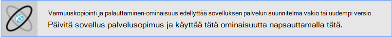
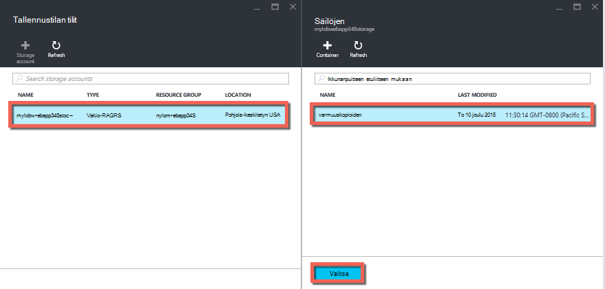
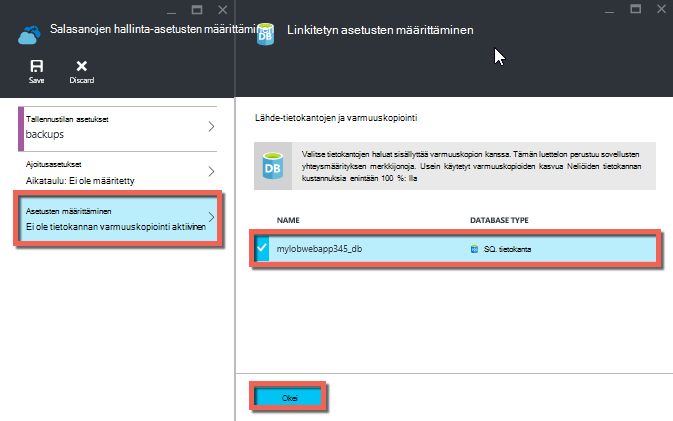
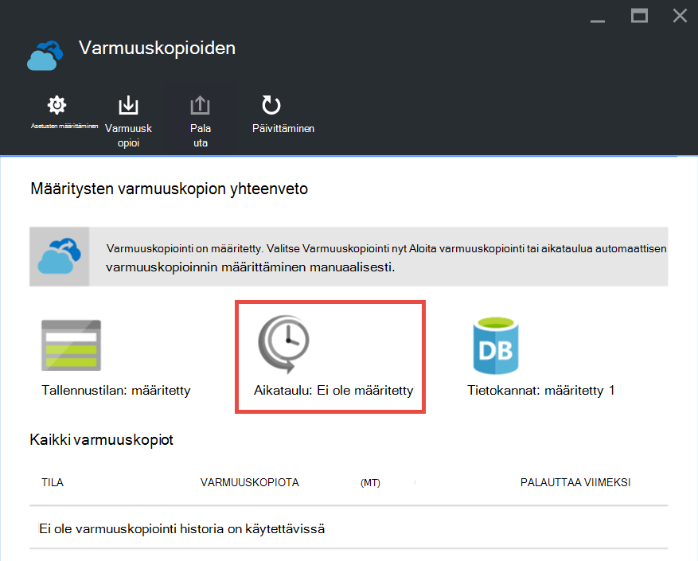

<properties 
    pageTitle="Azure sovelluksen varmuuskopiointi" 
    description="Opi luomaan varmuuskopiot sovellus App Azure-palvelussa." 
    services="app-service" 
    documentationCenter="" 
    authors="cephalin" 
    manager="wpickett" 
    editor="jimbe"/>

<tags 
    ms.service="app-service" 
    ms.workload="na" 
    ms.tgt_pltfrm="na" 
    ms.devlang="na" 
    ms.topic="article" 
    ms.date="07/06/2016" 
    ms.author="cephalin"/>

# Azure sovelluksen varmuuskopiointi

[Azure](../app-service/app-service-value-prop-what-is.md) -sovelluksen palvelun varmuuskopiointi ja palauttaminen-ominaisuuden avulla voit helposti luoda sovelluksen varmuuskopioiden manuaalisesti tai automaattisesti. Voit palauttaa sovelluksen edelliseen tilaan tai jokin alkuperäisen sovelluksen varmuuskopioiden perusteella uuden sovelluksen luominen. 

Saat lisätietoja sovelluksen palauttaminen varmuuskopiosta, [palauttaa Azure-sovelluksen](web-sites-restore.md).

## Mitä sivustomalliin varmuuskopioida 
Sovelluksen palvelun voit varmuuskopioida seuraavat tiedot:

* Sovelluksen määritys
* Tiedoston sisältö
* Mikä tahansa Azure SQL-tietokannat tai Azure MySQL (ClearDB)-tietokannat (Voit valita mitkä sisällytettävien varmuuskopioinnin) sovelluksen yhteydessä

Nämä tiedot varmuuskopioidaan Azure-tallennustilan tilin ja säilö, joka määritetään. 

> [AZURE.NOTE] Kunkin varmuuskopio on valmis offline-kopio sovelluksesi ei lisäävän päivityksen.

## Vaatimukset ja rajoitukset

* Varmuuskopiointi ja palauttaminen-ominaisuus edellyttää sovelluksen palvelusopimus on **Vakio** taso tai uudempi versio. Saat lisätietoja sovelluksen palvelun suunnitelma käyttämään korkeampi taso skaalaus [skaalata Azure-sovelluksen määrittäminen](web-sites-scale.md). Huomaa, että **Premium** taso sallii suurempi määrä päivittäin varmuuskopioita kuin **Vakio** taso.
* Tarvitset Azure-tallennustilan tilin ja saman tilauksen sovellus, jonka haluat varmuuskopioida säilö. Lisätietoja Azure tallennustilan tilit saat [linkkejä](#moreaboutstorage) tämän artikkelin lopussa.
* Varmuuskopioiden voi olla enintään 10 Gigatavun sovelluksen ja tietokannan sisällön. Näkyviin tulee virhe, jos varmuuskopion koko ylittää rajoitusta. 

## Luo manuaalinen varmuuskopiointi

2. [Azure-portaalissa](https://portal.azure.com)Siirry sinua sovelluksen sivu, valitse **asetukset**ja sitten **varmuuskopiot**. **Varmuuskopiointi** -sivu tulee näkyviin.
    
    ![Varmuuskopiointi-sivu][ChooseBackupsPage]

    >[AZURE.NOTE]Jos näet viestin alta, napsauttamalla sitä päivittää sovelluksen palvelun palvelupaketin, ennen kuin voit jatkaa varmuuskopiot.
Lisätietoja on kohdassa [skaalata Azure-sovelluksen määrittäminen](web-sites-scale.md) .  
    >

3. Valitse **Varmuuskopiointi** -sivu **tallennustilan: ei ole määritetty** tallennustilan tilin määrittäminen.

    ![Valitse tallennustilan tili][ChooseStorageAccount]
    
4. Valitse varmuuskopioinnin kohde valitsemalla **Tallennustilan tilin** ja **säilö**. Tallennustilan tilin on kuuluttava haluat varmuuskopioida sovelluksen saman tilauksen. Jos haluat, voit luoda uuden tallennustilan tilin tai uusi säilö vastaaviin näiden. Kun olet valmis, valitse **Valitse**.
    
    
    
5. **Määritä varmuuskopion asetukset** -sivu, joka on vielä auki, valitse **Tietokanta**-asetukset, valitse tietokannat sisällytettävät varmuuskopioiden (SQL-tietokanta tai MySQL) valitse sitten **OK**.  

    

    > [AZURE.NOTE]  Tietokannan näkyvän tässä luettelossa sen yhteysmerkkijonon on oltava **yhteysmerkkijonoja** -osassa, kun sovellus **sovelluksen asetukset** -sivu.

6. **Määritä varmuuskopion asetukset** -sivu valitsemalla **Tallenna**.  

7. Valitse **Varmuuskopioi** **varmuuskopioiden** sivu komentopalkista.
    
    ![BackUpNow-painike][BackUpNow]
    
    Näet edistymisen viestin varmuuskopioinnin aikana.

Kun olet määrittänyt tallennustilan tilin ja varmuuskopioiden säilö, voit tehdä manuaalinen varmuuskopiointi milloin tahansa.  

## Automaattisen varmuuskopioinnin määrittäminen

1. Valitse **Varmuuskopiointi** -sivu **aikataulun: ei ole määritetty**. 

    
    
1. **Aikataulun varmuuskopiointiasetuksia** , sivu-arvoksi **Ajoitettu varmuuskopiointi** **-**ja valitse varmuuskopioinnin ajoituksen määrittäminen tarpeen mukaan ja valitse **OK**.
    
    ![Ota käyttöön automaattinen varmuuskopiointi][SetAutomatedBackupOn]
    
4. **Määritä varmuuskopion asetukset** -sivu, joka on vielä auki Valitse **Tallennustilan asetukset**ja valitse sitten varmuuskopioinnin kohde **Tallennustilan tilin** ja **säilö**valitsemalla. Tallennustilan tilin on kuuluttava haluat varmuuskopioida sovelluksen saman tilauksen. Jos haluat, voit luoda uuden tallennustilan tilin tai uusi säilö vastaaviin näiden. Kun olet valmis, valitse **Valitse**.
    
    
    
5. **Määritä varmuuskopion asetukset** -sivu- **Tietokanta**-asetukset, valitse tietokannat sisällytettävät varmuuskopioiden (SQL-tietokanta tai MySQL) valitse sitten **OK**.  

    

    > [AZURE.NOTE]  Tietokannan näkyvän tässä luettelossa sen yhteysmerkkijonon on oltava **yhteysmerkkijonoja** -osassa, kun sovellus **sovelluksen asetukset** -sivu.

6. **Määritä varmuuskopiointi-asetukset** -sivu valitsemalla **Tallenna**.  

## Sovelluksen varmuuskopion vain osan

Toisinaan et halua voit varmuuskopioida kaikki sovelluksen. Seuraavassa on muutamia esimerkkejä:

-   Voit [Viikoittain varmuuskopioinnin määrittäminen](web-sites-backup.md#configure-automated-backups) sovellus, joka sisältää staattiseksi sisällöksi, joka ei koskaan muuttuu, kuten vanhoja blogimerkintöjen tai kuvia.
-   Sovellus on yli 10 Gigatavua, (joka on enintään summa, voit varmuuskopioida kerrallaan).
-   Et halua lokitiedostojen varmuuskopioida.

Voit valita, mitkä täsmälleen haluat varmuuskopioida tiedostot osittaisen varmuuskopioiden avulla.

### Tiedostojen jättäminen pois varmuuskopiointi

Tiedostojen ja kansioiden pois varmuuskopioiden luominen `_backup.filter` tiedoston sovelluksen D:\home\site\wwwroot-kansiossa ja määritä tiedostot ja kansiot, jotka haluat jättää pois sieltä-luettelo. Helppo tapa käyttää tätä on [Kudu konsolin](https://github.com/projectkudu/kudu/wiki/Kudu-console)kautta. 

Oletetaan, että sinulla on sovellus, joka sisältää lokitiedostot ja edellisen vuoden, voit muuttaa enää staattisia kuvia. Sinulla on jo vanha kuvia sisältävän sovelluksen varmuuskopiot. Nyt haluat varmuuskopioida sovelluksen päivittäin, mutta et halua maksaa projektiin lokitiedostojen tai staattinen kuva-tiedostoja, jotka koskaan muuttaa.

![Kirjaa kansion][LogsFolder]
![kansion kuvat][ImagesFolder]
    
Vaiheet alla Näytä kuinka nämä tiedostot pois varmuuskopion.

1. Siirry `http://{yourapp}.scm.azurewebsites.net/DebugConsole` ja määritä kansiot, jotka haluat jättää pois varmuuskopiot. Tässä esimerkissä haluat jättää pois seuraavat tiedostot ja kansiot, kyseisen Käyttöliittymän mukaisesti:

        D:\home\site\wwwroot\Logs
        D:\home\LogFiles
        D:\home\site\wwwroot\Images\2013
        D:\home\site\wwwroot\Images\2014
        D:\home\site\wwwroot\Images\brand.png

    [AZURE.NOTE] Viimeinen rivi näkyy, että voit jättää henkilöiden tiedostoja sekä kansioita.

2. Luo tiedosto nimeltä `_backup.filter` ja sijoittaa edellisessä luettelossa tiedoston, mutta poista `D:\home`. Luettelon yhden kansion tai tiedoston riviä kohden. Jotta tiedoston sisällön pitäisi olla:

    \site\wwwroot\Logs \LogFiles \site\wwwroot\Images\2013 \site\wwwroot\Images\2014 \site\wwwroot\Images\brand.png

3. Lataa tämä tiedosto `D:\home\site\wwwroot\` sivustoosi käyttäen [ftp](web-sites-deploy.md#ftp) tai minkä tahansa muun tavan hakemistoon. Jos haluat, voit luoda tiedoston suoraan `http://{yourapp}.scm.azurewebsites.net/DebugConsole` ja lisätä sisältöä siellä.

4. Suorita varmuuskopioiden samalla tavalla tavalliseen tapaan sen [manuaalisesti](#create-a-manual-backup) tai [automaattisesti](#configure-automated-backups).

Nyt, kaikki tiedostot ja kansiot, jotka on määritelty `_backup.filter` varmuuskopioinnin ulkopuolelle. Tässä esimerkissä lokitiedostojen ja 2013 ja 2014 kuvatiedostot enää varmuuskopioidaan, sekä brand.png.

>[AZURE.NOTE] Osittainen varmuuskopioiden sivuston palauttaminen samalla tavalla, kuin [Tavallinen varmuuskopion palauttaminen](web-sites-restore.md). Palautus tällöin toimi oikean kohdetta.
>
>Kun Täysi varmuuskopiointi on palautettu, sivuston kaikki sisältö on korvattu mikä on varmuuskopion. Jos tiedosto on sivustossa, mutta ei varmuuskopioinnin se saa poistaa. Mutta kun osittainen varmuuskopiointi on palautettu, sisältöön, joka sijaitsee jokin on mustalla listalla kansioita tai minkä tahansa on mustalla listalla tiedoston jätetään sellaisenaan.

## Varmuuskopioiden tallentaminen

Kun olet tehnyt yhden tai useamman varmuuskopiot, kun sovellus, varmuuskopioista on näkyvissä-tallennustilan tilin sekä sovelluksen **säilöt** -sivu. Tallennustilan tilin kunkin varmuuskopiointi koostuu .zip-tiedosto, joka sisältää palautettavat tiedot ja .xml-tiedostossa, joka sisältää luettelon sisällön .zip-tiedosto. Voit unzip ja Selaa nämä tiedostot, jos haluat käyttää varmuuskopiot suoritusta sovelluksen palauttaminen.

Tietokannan varmuuskopiointi sovelluksen tallennetaan ylimmällä .zip-tiedosto. SQL-tietokantaan tämä on BACPAC-tiedosto (ei ole tiedostotunnisteen) ja voidaan tuoda. Luo uusi SQL-tietokanta BACPAC viennin perusteella, on artikkelissa [uuden käyttäjän-tietokannan luominen BACPAC tiedoston tuominen](http://technet.microsoft.com/library/hh710052.aspx).

> [AZURE.WARNING] Tiedostoja **websitebackups** säilössä muuttaminen voi aiheuttaa virheellinen ja näin ollen ei-restorable varmuuskopion.

## Seuraavat vaiheet
Lisätietoja sovelluksen palauttaminen varmuuskopiosta on artikkelissa [palauttaa Azure-sovelluksen](web-sites-restore.md). Voit myös varmuuskopioida ja palauttaa sovelluksen Service-sovelluksista käsin REST API (katso [Käytä LOPUT varmuuskopioiminen ja palauttaminen App palvelun sovellukset](websites-csm-backup.md)).

>[AZURE.NOTE] Jos haluat aloittaa Azure App palvelun ennen rekisteröimässä Azure-tili, siirry [Yritä App palvelu](http://go.microsoft.com/fwlink/?LinkId=523751), jossa lyhytkestoinen starter verkkosovellukseen heti voit luoda sovelluksen-palvelussa. Ei ole pakollinen; luottokortit ei ole sitoumukset.

<!-- IMAGES -->
[ChooseBackupsPage]: ./media/web-sites-backup/01ChooseBackupsPage.png
[ChooseStorageAccount]: ./media/web-sites-backup/02ChooseStorageAccount.png
[IncludedDatabases]: ./media/web-sites-backup/03IncludedDatabases.png
[BackUpNow]: ./media/web-sites-backup/04BackUpNow.png
[BackupProgress]: ./media/web-sites-backup/05BackupProgress.png
[SetAutomatedBackupOn]: ./media/web-sites-backup/06SetAutomatedBackupOn.png
[Frequency]: ./media/web-sites-backup/07Frequency.png
[StartDate]: ./media/web-sites-backup/08StartDate.png
[StartTime]: ./media/web-sites-backup/09StartTime.png
[SaveIcon]: ./media/web-sites-backup/10SaveIcon.png
[ImagesFolder]: ./media/web-sites-backup/11Images.png
[LogsFolder]: ./media/web-sites-backup/12Logs.png
[GhostUpgradeWarning]: ./media/web-sites-backup/13GhostUpgradeWarning.png
 
