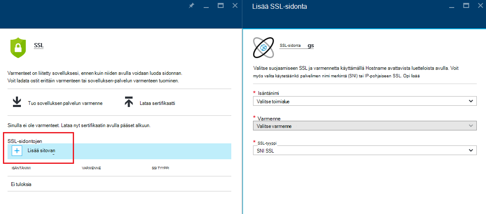
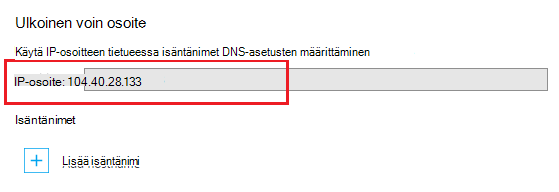
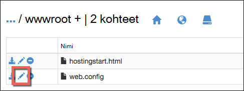

<properties
    pageTitle="Suojattu sinua sovelluksen mukautettua toimialuetta millä HTTPS | Microsoft Azure"
    description="Katso miten turvalliseksi mukautetun toimialuenimeä Azure App palvelun sovelluksen määrittämällä SSL-varmenteen sidonta. Opit myös SSL-varmenteen hakemisesta useita työkaluja."
    services="app-service"
    documentationCenter=".net"
    authors="cephalin"
    manager="wpickett"
    editor="jimbe"
    tags="top-support-issue"/>

<tags
    ms.service="app-service"
    ms.workload="na"
    ms.tgt_pltfrm="na"
    ms.devlang="na"
    ms.topic="article"
    ms.date="08/08/2016"
    ms.author="cephalin"/>

# Suojattu sinua sovelluksen mukautettua toimialuetta millä HTTPS

> [AZURE.SELECTOR]
- [Osta SSL-varmenteen Azure-tietokannassa](web-sites-purchase-ssl-web-site.md)
- [Käytä SSL-varmenteen muualta](web-sites-configure-ssl-certificate.md)

Tässä artikkelissa kerrotaan, miten voit ottaa käyttöön HTTPS verkkosovellukseen, mobiilisovelluksen taustassa tai API-sovelluksen [Azure App palvelu](../app-service/app-service-value-prop-what-is.md) , joka käyttää mukautettua toimialuenimeä. Se peittää vain palvelimen todennuksen. Jos tarvitset kaksisuuntainen käyttöoikeuksien (mukaan lukien asiakkaan todennus), tutustu [Siitä, miten voit määrittää TLS molemminpuoleista App palvelun](app-service-web-configure-tls-mutual-auth.md).

Suojaaminen HTTPS sovellusta, joka on mukautettua toimialuenimeä, voit lisätä kyseisen toimialueen kohdalta varmennetta. Oletusarvoisesti Azure suojaa ** \*. azurewebsites.net** yleismerkkien toimialue, joilla yksi SSL-varmenne, jotta asiakkaat jo käyttää sovelluksen osoitteessa * *https://*&lt;appname >*. azurewebsites.net**. Jos haluat käyttää mukautettua toimialuetta, mutta **contoso.com**, **www.contoso.com**, ja ** \*. contoso.com**, varmennetta ei voi suojata. Lisäksi kaikki [yleismerkkien varmenteet](https://casecurity.org/2014/02/26/pros-and-cons-of-single-domain-multi-domain-and-wildcard-certificates/), kuten varmennetta ei ole yhtä turvallinen kuin käyttämällä mukautetun toimialueen ja sertifikaatin mukautetun toimialueen.   

>[AZURE.NOTE] Pyydä apua Azure asiantuntijoiden milloin tahansa [Azure keskustelupalstoilla](https://azure.microsoft.com/support/forums/). Lisää mukautettu tukea Siirry [Azure tukevat](https://azure.microsoft.com/support/options/) ja valitse **Pyydä tuki**.

## Tarvitset
Voit suojata mukautettua toimialuenimeä kanssa HTTPS-mukautetun SSL-varmenteen sitoa mukautetun toimialueen Azure-tietokannassa. Ennen kuin sidonta mukautetun varmenteen, sinun on seuraavasti:

- **Määritä mukautettu toimialue** - sovelluksen-palvelun avulla vain lisääminen toimialuenimi on jo määritetty sovelluksen varmennetta. Katso ohjeet [Yhdistä mukautettua toimialuenimeä Azure-sovellukseen](web-sites-custom-domain-name.md). 
- **Laajentaa Basic taso tai uudempi versio** Sovelluksen palvelusopimusten vaihtoehdot-alemman hinnoittelu tasoa ei tueta mukautetut SSL-varmenteita. Katso ohjeet [skaalata Azure-sovelluksen määrittäminen](web-sites-scale.md). 
- **Hanki SSL-varmenteen** – Jos sinulla ei vielä ole jokin, sinun on hankittava yksi luotettu [varmenteen myöntäjä](http://en.wikipedia.org/wiki/Certificate_authority) (CA). Varmenne on täytettävä seuraavat vaatimukset:

    - Se on allekirjoitettu luotettu varmenteen myöntäjä (palvelimia ei ole yksityinen CA).
    - Esityksessä on yksityinen avain.
    - Se on luotu avaimen exchange ja viedä. PFX-tiedosto.
    - Tiedostossa käytetään vähintään 2048-bittinen salaus.
    - Sen aihenimi vastaa suojaamiseen tarvitaan mukautettua toimialuetta. Suojaamiseen yksi sertifikaatti useita toimialueita, sinun on käytettävä yleismerkkien nimi (esimerkiksi ** \*. contoso.com**) tai määrittää subjectAltName arvoja.
    - Se on yhdistetty kaikki **[keskitason varmenteen](http://en.wikipedia.org/wiki/Intermediate_certificate_authorities)** Myöntäjän käyttämä. Muussa tapauksessa saattaa kohtaat irreproducible yhteensopivuusongelmat joitakin asiakassovelluksissa.

        >[AZURE.NOTE] Hanki SSL-varmenne, joka täyttää kaikki vaatimukset helpoin tapa on sellainen         [ostetaan Azure-portaalissa suoraan](web-sites-purchase-ssl-web-site.md). Tämän artikkelin avulla voit tehdä manuaalisesti ja sitoa mukautetun toimialueen sovelluksen-palvelussa.
        >   
        > **Elliptic käyrän salaus ECC ()-varmenteet** käyttää sovelluksen-palvelun kanssa, mutta on tämän artikkelin ulkopuolella. Käsitellä Myöntäjän tarkat vaiheet Luo ECC varmenteet.

## Vaihe 1. Hanki SSL-varmenne

Koska toimittavat eri SSL-varmenteen tietotyyppeihin eri hinta pisteisiin, voit aloittaa olisi päätät, minkä tyyppistä SSL-varmenteen ostaminen. Jos haluat suojata yksittäisen toimialuenimi (**www.contoso.com**), sinun on vain sertifikaatin. Useiden toimialuenimien suojaamiseen (**contoso.com** *ja* **www.contoso.com** 
*ja* **mail.contoso.com**), tarvitset [yleismerkkien varmenteen](http://en.wikipedia.org/wiki/Wildcard_certificate) tai [Aiheen vaihtoehtoinen nimi](http://en.wikipedia.org/wiki/SubjectAltName) varmenteen (`subjectAltName`).

Kun tiedät, mitä SSL-varmenteen ostaminen, voit lähettää varmenteen allekirjoitus pyytää (CSR) voit käyttää CA. Kun saat pyydetty varmenteen Myöntäjä takaisin, luo sitten .pfx-tiedosto varmenteesta. Voit suorittaa nämä vaiheet valittua-työkalun avulla. Seuraavassa on yleisiä työkaluja ohjeet:

- [Certreq.exe vaiheet](#bkmk_certreq) - sertifikaatin pyytäminen luomiseen Windows-apuohjelma. Se on osa Windows kulunut Windows XP tai Windows Server 2000: ssa.
- [IIS Manager vaiheet](#bkmk_iismgr) - vaihtoehto, jos olet jo tuntee työkalu.
- [OpenSSL vaiheet](#bkmk_openssl) - [Avaa lähde- ja Office kaikissa ympäristöissä työkalun](https://www.openssl.org). Sen avulla voit auttaa SSL-varmenteen noutaminen tahansa ympäristössä.
- [subjectAltName vaiheet käyttämällä OpenSSL](#bkmk_subjectaltname) - ohjeet käytön `subjectAltName` varmenteet.

Jos haluat testata asetukset ennen kuin ostat varmenteen sovelluksen-palvelussa, voit luoda [itse allekirjoitettua varmennetta](https://en.wikipedia.org/wiki/Self-signed_certificate). Tässä opetusohjelmassa avulla luomisessa kahdella tavalla:

- [Itse allekirjoitetun varmenteen Certreq.exe vaiheet](#bkmk_sscertreq)
- [Itse allekirjoitetun varmenteen OpenSSL vaiheet](#bkmk_ssopenssl)

### Hanki varmenne Certreq.exe käyttäminen

1. Luo tiedosto (kuten **myrequest.txt**), ja kopioi se seuraava teksti ja tallenna se toimimasta hakemistossa. Korvaa `<your-domain>` paikkamerkki ja sovelluksen mukautettua toimialuenimeä.

        [NewRequest]
        Subject = "CN=<your-domain>"  ; E.g. "CN=www.contoso.com", or "CN=*.contoso.com" for a wildcard certificate
        Exportable = TRUE
        KeyLength = 2048              ; Required minimum is 2048
        KeySpec = 1
        KeyUsage = 0xA0
        MachineKeySet = True
        ProviderName = "Microsoft RSA SChannel Cryptographic Provider"
        ProviderType = 12
        HashAlgorithm = SHA256

        [EnhancedKeyUsageExtension]
        OID=1.3.6.1.5.5.7.3.1         ; Server Authentication

    Katso lisätietoja asetuksista CSR ja muut vaihtoehdot [Certreq oppaat](https://technet.microsoft.com/library/dn296456.aspx).

4. Valitse komentokehote- `CD` työkansion ja suorittamalla seuraava komento CSR luomiseen:

        certreq -new myrequest.txt myrequest.csr

    **myrequest.CSR** luodaan nyt nykyisen toimimasta hakemistossa.

5. Lähetä **myrequest.csr** , hanki SSL-varmenteen Myöntäjä. Voit joko Lataa tiedosto tai sen sisällön kopioiminen tekstieditorissa web-lomakkeeseen.

    Microsoft luottaa CAs luettelo on artikkelissa [Microsoft luotettujen päämyöntäjien varmenteen ohjelma: osallistujien][cas].

6. Kun varmenteiden Myöntäjä on vastannut sinulle sertifikaatilla (. CER) tiedosto, tallenna se toimimasta hakemistossa. Suorita seuraava komento suorittamiseen odotetaan CSR.

        certreq -accept -user <certificate-name>.cer

    Tämä komento tallentaa valmis sertifikaatin sertifikaatin Windows-kaupasta.

6. Jos keskitason varmenteen Myöntäjän on käytössä, asenna ne ennen kuin jatkat. Yleensä mieleen ladata erikseen Myöntäjän ja eri sivustoon Palvelintyypit useita muotoja. Valitse Microsoft IIS versiota.

    Kun olet ladannut varmenteet, jokainen niistä Resurssienhallinnassa hiiren kakkospainikkeella ja valitse  **Asenna varmenne**. Käytä oletusarvoista **Varmenteen tuontitoiminnossa**ja jatka valitsemalla **Seuraava** , kunnes tuonti on valmis.

7. SSL-varmenteen tuominen varmennetta, paina `Win` + `R` ja suorita **certmgr.msc** käynnistää varmenteen hallinta. Valitse **Omat** > **Varmenteet**. **Myönnetty** -sarakkeessa näkyy merkinnän mukautettua toimialuenimeä ja varmenteiden Myöntäjä Luo varmenteen **Myöntäjä** -sarakkeen avulla.

    ![Lisää kuva tähän varmenteen hallinta][certmgr]

9. Kaksoisnapsauta varmennetta ja valitse **Kaikki tehtävät** > **Vie**. **Varmenteen vieminen-toiminnossa**Valitse **Seuraava**, sitten Valitse **Kyllä, vie yksityinen avain**ja valitse sitten **Seuraava** uudelleen.

    ![Vie yksityinen avain][certwiz1]

10. Valitse **Henkilökohtaisten tietojen vaihtaminen - PKCS 12**, **Sisällytä kaikki varmenteet mahdollisuuksien varmenteen polku**ja **Vie kaikki laajennetut ominaisuudet**. Valitse sitten **Seuraava**.

    ![Sisällytä kaikki varmenteet ja lisäominaisuudet][certwiz2]

11. Valitse **salasana**, kirjoita ja vahvista salasana. Valitse **Seuraava**.

    ![Määritä salasana][certwiz3]

12. Säätää viedyn varmenteen kanssa tunniste **.pfx**polku ja tiedostonimi. Valitse **Seuraava** loppuun.

    ![tiedoston polku][certwiz4]

Olet nyt valmiina PFX vietävän tiedoston lataaminen App palvelu. Katso [Vaihe 2. Lataa ja sitoa mukautetun SSL-varmenteen](#bkmk_configuressl).

### Hanki varmenne IIS-hallinnan avulla

1. Luo CSR ja IIS Manager lähettäminen varmenteiden Myöntäjä. Lisätietoja CSR luodaan kohdassa [Pyydä Internet-palvelinvarmennetta (IIS 7)][iiscsr].

3. Lähetä oman CSR, saat SSL-varmenteen Myöntäjä. Microsoft luottaa CAs luettelo on artikkelissa [Microsoft luotettujen päämyöntäjien varmenteen ohjelma: osallistujien][cas].

3. Suorita CSR sertifikaatin, joka varmenteiden Myöntäjä lähettää puolestasi. Lisätietoja Viimeistellään hän on kohdassa [asentaminen Internet-palvelinvarmennetta (IIS 7)][installcertiis].

4. Jos keskitason varmenteen Myöntäjän on käytössä, asenna ne ennen kuin jatkat. Yleensä mieleen ladata erikseen Myöntäjän ja eri sivustoon Palvelintyypit useita muotoja. Valitse Microsoft IIS versiota.

    Kun olet ladannut varmenteet, jokainen niistä Resurssienhallinnassa hiiren kakkospainikkeella ja valitse **Asenna varmenne**. 
    Käytä oletusarvoista **Varmenteen tuontitoiminnossa**ja jatka valitsemalla **Seuraava** , kunnes tuonti on valmis.

4. Vie SSL-varmenteen IIS Managerista. Katso lisätietoja varmenteen vieminen Valitse [Vie palvelinvarmennetta (IIS 7)][exportcertiis]. 

    >[AZURE.IMPORTANT] **Varmenteen vieminen-toiminnossa**Varmista, että valitset **Kyllä, vie yksityinen avain**  
    >
    >![Vie yksityinen avain][certwiz1]  
    >
    > ja valitse myös **Henkilökohtaisia tietoja Exchange - PKCS 12**, **Sisällytä kaikki varmenteet mahdollisuuksien varmenteen polku**ja     **Vie kaikki laajennetut ominaisuudet**.
    >
    >![Sisällytä kaikki varmenteet ja lisäominaisuudet][certwiz2]

Olet nyt valmiina PFX vietävän tiedoston lataaminen App palvelu. Katso [Vaihe 2. Lataa ja sitoa mukautetun SSL-varmenteen](#bkmk_configuressl).

### Hanki varmenne OpenSSL käyttäminen

1. Kirjoita komentorivin terminaalissa `CD` toimimasta kansioon Luo yksityinen avain ja CSR suorittamalla seuraavan komennon:

        openssl req -sha256 -new -nodes -keyout myserver.key -out server.csr -newkey rsa:2048

2. Anna tarvittavat tiedot. Esimerkki:

        Country Name (2 letter code)
        State or Province Name (full name) []: Washington
        Locality Name (eg, city) []: Redmond
        Organization Name (eg, company) []: Microsoft
        Organizational Unit Name (eg, section) []: Azure
        Common Name (eg, YOUR name) []: www.microsoft.com
        Email Address []:

        Please enter the following 'extra' attributes to be sent with your certificate request

        A challenge password []:

    Kun olet valmis, on oltava kaksi tiedostojen käsitteleminen hakemistossa: **myserver.key** ja **server.csr**. 
    **Server.csr** sisältää hän ja tarvitset **myserver.key** myöhemmin.

3. Lähetä oman CSR, saat SSL-varmenteen Myöntäjä. Microsoft luottaa CAs luettelo on artikkelissa [Microsoft luotettujen päämyöntäjien varmenteen ohjelma: osallistujien][cas].

4. Kun varmenteiden Myöntäjä lähettää sinulle pyydetty varmenne, Tallenna nimellä **myserver.crt** toimimasta hakemistossa. Jos Myöntäjän tarjoaa teksti-muodossa, kopioi sisältö **myserver.crt** tekstieditorissa ja tallenna se. Tiedoston pitäisi näyttää seuraavalta:

        -----BEGIN CERTIFICATE-----
        MIIDJDCCAgwCCQCpCY4o1LBQuzANBgkqhkiG9w0BAQUFADBUMQswCQYDVQQGEwJV
        UzELMAkGA1UECBMCV0ExEDAOBgNVBAcTB1JlZG1vbmQxEDAOBgNVBAsTB0NvbnRv
        c28xFDASBgNVBAMTC2NvbnRvc28uY29tMB4XDTE0MDExNjE1MzIyM1oXDTE1MDEx
        NjE1MzIyM1owVDELMAkGA1UEBhMCVVMxCzAJBgNVBAgTAldBMRAwDgYDVQQHEwdS
        ZWRtb25kMRAwDgYDVQQLEwdDb250b3NvMRQwEgYDVQQDEwtjb250b3NvLmNvbTCC
        ASIwDQYJKoZIhvcNAQEBBQADggEPADCCAQoCggEBAN96hBX5EDgULtWkCRK7DMM3
        enae1LT9fXqGlbA7ScFvFivGvOLEqEPD//eLGsf15OYHFOQHK1hwgyfXa9sEDPMT
        3AsF3iWyF7FiEoR/qV6LdKjeQicJ2cXjGwf3G5vPoIaYifI5r0lhgOUqBxzaBDZ4
        xMgCh2yv7NavI17BHlWyQo90gS2X5glYGRhzY/fGp10BeUEgIs3Se0kQfBQOFUYb
        ktA6802lod5K0OxlQy4Oc8kfxTDf8AF2SPQ6BL7xxWrNl/Q2DuEEemjuMnLNxmeA
        Ik2+6Z6+WdvJoRxqHhleoL8ftOpWR20ToiZXCPo+fcmLod4ejsG5qjBlztVY4qsC
        AwEAATANBgkqhkiG9w0BAQUFAAOCAQEAVcM9AeeNFv2li69qBZLGDuK0NDHD3zhK
        Y0nDkqucgjE2QKUuvVSPodz8qwHnKoPwnSrTn8CRjW1gFq5qWEO50dGWgyLR8Wy1
        F69DYsEzodG+shv/G+vHJZg9QzutsJTB/Q8OoUCSnQS1PSPZP7RbvDV9b7Gx+gtg
        7kQ55j3A5vOrpI8N9CwdPuimtu6X8Ylw9ejWZsnyy0FMeOPpK3WTkDMxwwGxkU3Y
        lCRTzkv6vnHrlYQxyBLOSafCB1RWinN/slcWSLHADB6R+HeMiVKkFpooT+ghtii1
        A9PdUQIhK9bdaFicXPBYZ6AgNVuGtfwyuS5V6ucm7RE6+qf+QjXNFg==
        -----END CERTIFICATE-----

5. Komentorivin terminaalissa, suorita seuraava komento **myserver.key** ja **myserver.crt** **myserver.pfx** tuominen:

        openssl pkcs12 -export -out myserver.pfx -inkey myserver.key -in myserver.crt

    Kun sinulta kysytään, Määritä salasanalla suojatun .pfx-tiedosto.

    > [AZURE.NOTE] Jos keskitason varmenteen Myöntäjän, täytyy sisältää ne `-certfile` parametri. Yleensä mieleen ladata erikseen Myöntäjän ja eri sivustoon Palvelintyypit useita muotoja. Valitse versio, jossa `.pem` tunniste.
    >
    > Oman `openssl -export` komennon pitäisi näyttää seuraavalta, joka luo .pfx-tiedosto, joka sisältää keskitason varmenteet **keskitason cets.pem** tiedostosta:
    >  
    > `openssl pkcs12 -chain -export -out myserver.pfx -inkey myserver.key -in myserver.crt -certfile intermediate-cets.pem`

Olet nyt valmiina PFX vietävän tiedoston lataaminen App palvelu. Katso [Vaihe 2. Lataa ja sitoa mukautetun SSL-varmenteen](#bkmk_configuressl).

### Hanki käyttämällä OpenSSL SubjectAltName varmenne

1. Luo tiedosto nimeltä **sancert.cnf**, kopioi se seuraava teksti ja Tallenna toimimasta kansiossa:

        # -------------- BEGIN custom sancert.cnf -----
        HOME = .
        oid_section = new_oids
        [ new_oids ]
        [ req ]
        default_days = 730
        distinguished_name = req_distinguished_name
        encrypt_key = no
        string_mask = nombstr
        req_extensions = v3_req # Extensions to add to certificate request
        [ req_distinguished_name ]
        countryName = Country Name (2 letter code)
        countryName_default =
        stateOrProvinceName = State or Province Name (full name)
        stateOrProvinceName_default =
        localityName = Locality Name (eg, city)
        localityName_default =
        organizationalUnitName  = Organizational Unit Name (eg, section)
        organizationalUnitName_default  =
        commonName              = Your common name (eg, domain name)
        commonName_default      = www.mydomain.com
        commonName_max = 64
        [ v3_req ]
        subjectAltName=DNS:ftp.mydomain.com,DNS:blog.mydomain.com,DNS:*.mydomain.com
        # -------------- END custom sancert.cnf -----

    Valitse rivi, joka alkaa `subjectAltName`, korvaa kaikki toimialuenimien, jonka haluat suojata arvo (lisäksi  `commonName`). Esimerkki:

        subjectAltName=DNS:sales.contoso.com,DNS:support.contoso.com,DNS:fabrikam.com

    Sinun ei tarvitse muuttaa minkä tahansa muun kentän, mukaan lukien `commonName`. Voit pyydetään ne on määritettävä muutama vaiheisiin.

1. Kirjoita komentorivin terminaalissa `CD` työkansion ja suorita seuraava komento:

        openssl req -sha256 -new -nodes -keyout myserver.key -out server.csr -newkey rsa:2048 -config sancert.cnf

2. Anna tarvittavat tiedot. Esimerkki:

        Country Name (2 letter code) []: US
        State or Province Name (full name) []: Washington
        Locality Name (eg, city) []: Redmond
        Organizational Unit Name (eg, section) []: Azure
        Your common name (eg, domain name) []: www.microsoft.com

    Kun olet valmis, on oltava kaksi tiedostojen käsitteleminen hakemistossa: **myserver.key** ja **server.csr**. 
    **Server.csr** sisältää hän ja tarvitset **myserver.key** myöhemmin.

3. Lähetä oman CSR, saat SSL-varmenteen Myöntäjä. Microsoft luottaa CAs luettelo on artikkelissa [Microsoft luotettujen päämyöntäjien varmenteen ohjelma: osallistujien][cas].

4. Kun varmenteiden Myöntäjä lähettää sinulle pyydetty varmenne, tallentaa sen **myserver.crt**-tiedostoon. Jos Myöntäjän tarjoaa teksti-muodossa, kopioi sisältö **myserver.crt** tekstieditorissa ja tallenna se. Tiedoston pitäisi näyttää seuraavalta:

        -----BEGIN CERTIFICATE-----
        MIIDJDCCAgwCCQCpCY4o1LBQuzANBgkqhkiG9w0BAQUFADBUMQswCQYDVQQGEwJV
        UzELMAkGA1UECBMCV0ExEDAOBgNVBAcTB1JlZG1vbmQxEDAOBgNVBAsTB0NvbnRv
        c28xFDASBgNVBAMTC2NvbnRvc28uY29tMB4XDTE0MDExNjE1MzIyM1oXDTE1MDEx
        NjE1MzIyM1owVDELMAkGA1UEBhMCVVMxCzAJBgNVBAgTAldBMRAwDgYDVQQHEwdS
        ZWRtb25kMRAwDgYDVQQLEwdDb250b3NvMRQwEgYDVQQDEwtjb250b3NvLmNvbTCC
        ASIwDQYJKoZIhvcNAQEBBQADggEPADCCAQoCggEBAN96hBX5EDgULtWkCRK7DMM3
        enae1LT9fXqGlbA7ScFvFivGvOLEqEPD//eLGsf15OYHFOQHK1hwgyfXa9sEDPMT
        3AsF3iWyF7FiEoR/qV6LdKjeQicJ2cXjGwf3G5vPoIaYifI5r0lhgOUqBxzaBDZ4
        xMgCh2yv7NavI17BHlWyQo90gS2X5glYGRhzY/fGp10BeUEgIs3Se0kQfBQOFUYb
        ktA6802lod5K0OxlQy4Oc8kfxTDf8AF2SPQ6BL7xxWrNl/Q2DuEEemjuMnLNxmeA
        Ik2+6Z6+WdvJoRxqHhleoL8ftOpWR20ToiZXCPo+fcmLod4ejsG5qjBlztVY4qsC
        AwEAATANBgkqhkiG9w0BAQUFAAOCAQEAVcM9AeeNFv2li69qBZLGDuK0NDHD3zhK
        Y0nDkqucgjE2QKUuvVSPodz8qwHnKoPwnSrTn8CRjW1gFq5qWEO50dGWgyLR8Wy1
        F69DYsEzodG+shv/G+vHJZg9QzutsJTB/Q8OoUCSnQS1PSPZP7RbvDV9b7Gx+gtg
        7kQ55j3A5vOrpI8N9CwdPuimtu6X8Ylw9ejWZsnyy0FMeOPpK3WTkDMxwwGxkU3Y
        lCRTzkv6vnHrlYQxyBLOSafCB1RWinN/slcWSLHADB6R+HeMiVKkFpooT+ghtii1
        A9PdUQIhK9bdaFicXPBYZ6AgNVuGtfwyuS5V6ucm7RE6+qf+QjXNFg==
        -----END CERTIFICATE-----

5. Komentorivin terminaalissa, suorita seuraava komento **myserver.key** ja **myserver.crt** **myserver.pfx** tuominen:

        openssl pkcs12 -export -out myserver.pfx -inkey myserver.key -in myserver.crt

    Kun sinulta kysytään, Määritä salasanalla suojatun .pfx-tiedosto.

    > [AZURE.NOTE] Jos keskitason varmenteen Myöntäjän, täytyy sisältää ne `-certfile` parametri. Yleensä mieleen ladata erikseen Myöntäjän ja eri sivustoon Palvelintyypit useita muotoja. Valitse versio, jossa `.pem` tunniste).
    >
    > Oman `openssl -export` komennon pitäisi näyttää seuraavalta, joka luo .pfx-tiedosto, joka sisältää keskitason varmenteet **keskitason cets.pem** tiedostosta:
    >  
    > `openssl pkcs12 -chain -export -out myserver.pfx -inkey myserver.key -in myserver.crt -certfile intermediate-cets.pem`

Olet nyt valmiina PFX vietävän tiedoston lataaminen App palvelu. Katso [Vaihe 2. Lataa ja sitoa mukautetun SSL-varmenteen](#bkmk_configuressl).

### Luo itse allekirjoitettua varmennetta käyttämällä Certreq.exe ###

>[AZURE.IMPORTANT] Itse allekirjoitetun varmenteet ovat vain testaus. Useimmissa selaimissa palauttaa virheitä, kun käyt sivustoa, joka on suojattu itse allekirjoitetun varmenteen. Selaimet, voivat myös kieltäytyä Siirry siihen sivustoon. 

1. Luo tekstitiedosto (kuten **mycert.txt**), kopioi se seuraava teksti ja tiedosto tallennetaan toimimasta hakemisto. Korvaa `<your-domain>` paikkamerkki ja sovelluksen mukautettua toimialuenimeä.

        [NewRequest]
        Subject = "CN=<your-domain>"  ; E.g. "CN=www.contoso.com", or "CN=*.contoso.com" for a wildcard certificate
        Exportable = TRUE
        KeyLength = 2048              ; KeyLength can be 2048, 4096, 8192, or 16384 (required minimum is 2048)
        KeySpec = 1
        KeyUsage = 0xA0
        MachineKeySet = True
        ProviderName = "Microsoft RSA SChannel Cryptographic Provider"
        ProviderType = 12
        HashAlgorithm = SHA256
        RequestType = Cert            ; Self-signed certificate
        ValidityPeriod = Years
        ValidityPeriodUnits = 1

        [EnhancedKeyUsageExtension]
        OID=1.3.6.1.5.5.7.3.1         ; Server Authentication

    Tärkeää-parametri on `RequestType = Cert`, joka määrittää itse allekirjoitettua varmennetta. 
    Katso lisätietoja asetuksista CSR ja muut vaihtoehdot [Certreq oppaat](https://technet.microsoft.com/library/dn296456.aspx).

4. Kirjoita komentokehotteeseen `CD` työkansion ja suorita seuraava komento:

        certreq -new mycert.txt mycert.crt
    
    Uuden itse allekirjoitetun sertifikaatin on asennettu varmennetta.

7. Varmenteen vieminen säilöstä, paina `Win` + `R` ja suorita **certmgr.msc** käynnistää varmenteen hallinta. Valitse **Omat** > **Varmenteet**. **Myönnetty** -sarakkeessa näkyy merkinnän mukautettua toimialuenimeä ja varmenteiden Myöntäjä Luo varmenteen **Myöntäjä** -sarakkeen avulla.

    ![Lisää kuva tähän varmenteen hallinta][certmgr]

9. Kaksoisnapsauta varmennetta ja valitse **Kaikki tehtävät** > **Vie**. **Varmenteen vieminen-toiminnossa**Valitse **Seuraava**, sitten Valitse **Kyllä, vie yksityinen avain**ja valitse sitten **Seuraava** uudelleen.

    ![Vie yksityinen avain][certwiz1]

10. Valitse **Henkilökohtaisten tietojen vaihtaminen - PKCS 12**, **Sisällytä kaikki varmenteet mahdollisuuksien varmenteen polku**ja **Vie kaikki laajennetut ominaisuudet**. Valitse sitten **Seuraava**.

    ![Sisällytä kaikki varmenteet ja lisäominaisuudet][certwiz2]

11. Valitse **salasana**, kirjoita ja vahvista salasana. Valitse **Seuraava**.

    ![Määritä salasana][certwiz3]

12. Säätää viedyn varmenteen kanssa tunniste **.pfx**polku ja tiedostonimi. Valitse **Seuraava** loppuun.

    ![tiedoston polku][certwiz4]

Olet nyt valmiina PFX vietävän tiedoston lataaminen App palvelu. Katso [Vaihe 2. Lataa ja sitoa mukautetun SSL-varmenteen](#bkmk_configuressl).

###Luo itse allekirjoitettua varmennetta käyttämällä OpenSSL ###

>[AZURE.IMPORTANT] Itse allekirjoitetun varmenteet ovat vain testaus. Useimmissa selaimissa palauttaa virheitä, kun käyt sivustoa, joka on suojattu itse allekirjoitetun varmenteen. Selaimet, voivat myös kieltäytyä Siirry siihen sivustoon. 

1. Luo nimetty **serverauth.cnf**tekstitiedosto sitten seuraavan sisällön kopioiminen ja tallenna se toimimasta kansiossa:

        [ req ]
        default_bits           = 2048
        default_keyfile        = privkey.pem
        distinguished_name     = req_distinguished_name
        attributes             = req_attributes
        x509_extensions        = v3_ca

        [ req_distinguished_name ]
        countryName         = Country Name (2 letter code)
        countryName_min         = 2
        countryName_max         = 2
        stateOrProvinceName     = State or Province Name (full name)
        localityName            = Locality Name (eg, city)
        0.organizationName      = Organization Name (eg, company)
        organizationalUnitName      = Organizational Unit Name (eg, section)
        commonName          = Common Name (eg, your app's domain name)
        commonName_max          = 64
        emailAddress            = Email Address
        emailAddress_max        = 40

        [ req_attributes ]
        challengePassword       = A challenge password
        challengePassword_min       = 4
        challengePassword_max       = 20

        [ v3_ca ]
         subjectKeyIdentifier=hash
         authorityKeyIdentifier=keyid:always,issuer:always
         basicConstraints = CA:false
         keyUsage=nonRepudiation, digitalSignature, keyEncipherment
         extendedKeyUsage = serverAuth

2. Kirjoita komentorivin terminaalissa `CD` työkansion ja suorita seuraava komento:

        openssl req -sha256 -x509 -nodes -days 365 -newkey rsa:2048 -keyout myserver.key -out myserver.crt -config serverauth.cnf

    Tämä komento luo kaksi tiedostoa: **myserver.crt** (itse allekirjoitetun varmenteen) ja **myserver.key** (yksityinen avain) perusteella **serverauth.cnf**asetukset.

3. Varmenteen vieminen .pfx-tiedosto suorittamalla seuraavan komennon:

        openssl pkcs12 -export -out myserver.pfx -inkey myserver.key -in myserver.crt

    Kun sinulta kysytään, Määritä salasanalla suojatun .pfx-tiedosto.

Olet nyt valmiina PFX vietävän tiedoston lataaminen App palvelu. Katso [Vaihe 2. Lataa ja sitoa mukautetun SSL-varmenteen](#bkmk_configuressl).

## Vaihe 2. Lataa ja sitoa mukautetun SSL-varmenne

Ennen kuin voit siirtää, [mitä tarvitset](#bkmk_domainname) -osiossa ja varmista, että

- sinulla ole mukautettua toimialuetta, joka yhdistää Azure-sovellukseen
- sovellus on käynnissä, **Basic** taso tai uudempi versio, ja
- Sinun on SSL-varmenteen myöntäjältä mukautetun toimialueen.

1. Avaa selaimessa ** [Azure-portaalissa.](https://portal.azure.com/)**
2.  Valitse sivun vasemmassa reunassa **App Service** -asetus.
3.  Napsauta, johon haluat määrittää tämän todistuksen sovelluksen nimeä. 
4.  Valitse **asetukset**-kohdassa **SSL-varmenteita**
5.  Valitse **Lataa sertifikaatti**
6.  Valitse [Vaiheessa](#bkmk_getcert) 1 .pfx-tiedosto, jonka olet vienyt ja määritä salasanaa, jolla voit luoda ennen. Valitse **Lataa** Lataa sertifikaatti. Pitäisi tulla näkyviin ladatut varmennetta takaisin sisään **SSL-varmenne** -sivu.
7. Kohdassa **ssl sidontojen** valitsemalla **Lisää sidontojen**
8. Valitse toimialuenimi, jota suojattu SSL ja varmennetta käyttämällä **Lisää SSL sidonta** -sivu avattavista luetteloista avulla. Voit myös valita käytetäänkö **[Palvelimen nimi merkintä (SNI)](http://en.wikipedia.org/wiki/Server_Name_Indication)** tai IP-pohjaiseen SSL.

    

       •    IP based SSL associates a certificate with a domain name by mapping the dedicated public IP address of the server to the domain name. This requires each domain name (contoso.com, fabricam.com, etc.) associated with your service to have a dedicated IP address. This is the traditional          method of associating SSL certificates with a web server.
       •    SNI based SSL is an extension to SSL and **[Transport Layer Security](http://en.wikipedia.org/wiki/Transport_Layer_Security)** (TLS) that allows multiple domains to share the same IP address, with separate security certificates for each domain. Most modern browsers (including Internet Explorer, Chrome, Firefox and Opera) support SNI, however older browsers may not support SNI. For more information on SNI, see the **[Server Name Indication](http://en.wikipedia.org/wiki/Server_Name_Indication)** article on Wikipedia.
     
9. Valitse **Lisää sidonta** voit tallentaa muutokset ja ottaa SSL.

## Vaihe 3. Muuta oman toimialueen nimen kartoitus (IP perusteinen SSL vain)

Jos käytät vain **SNI SSL** -sidontojen, Ohita tämä osa. Aiemmin luotu jaettu IP-osoite sovelluksen myönnetyt käyttää useita **SNI SSL** sidontojen yhdessä. Kuitenkin Jos luot **IP-pohjaisen SSL** -sidonta, sovelluksen palvelu luo oma IP-osoite sidonta, koska **IP-pohjaisen SSL** edellyttää jotakin. Vain yksi varattu IP osoite voidaan luoda, vuoksi voidaan lisätä vain yhden **IP-pohjaisen SSL** sidonta.

Tarvitset vuoksi tämä kiinteä IP-osoite, voit määrittää sovelluksen edelleen, jos:

- Voit [käyttää mukautettua toimialuetta yhdistämään A-tietue](web-sites-custom-domain-name.md#a) Azure sovelluksen ja juuri lisäämäsi **IP-pohjaisen SSL** -sidonta. Tässä skenaariossa on uudelleen nykyisen tietueen osoittamaan kiinteä IP-osoite toimimalla seuraavasti:

    1. Kun olet määrittänyt IP perusteella SSL-sidonta, sovellus on määritetty kiinteä IP-osoite. Löydät IP-osoitteen sovelluksesi yläpuolella **isäntänimet** -osan asetukset-kohdassa **Mukautettu toimialue** -sivulla. Se merkitään **Ulkoinen IP-osoite**
    
        

    2. [Uudelleen mukautetun toimialuenimen tämän uuden IP-osoitteeseen tietueessa](web-sites-custom-domain-name.md#a).

- On jo vähintään yksi **SNI SSL** -sidontojen sovelluksen, ja **IP-pohjaisen SSL** -sidonta juuri lisäämäsi. Kun sidonta on valmis, että * &lt;appname >*. azurewebsites.net toimialueen nimi viittaa uusi IP-osoite. Tämän vuoksi kaikki aiemmin [CNAME yhdistäminen mukautetun toimialueen](web-sites-custom-domain-name.md#cname) * &lt;appname >*. azurewebsites.net, mukaan lukien **SNI SSL** suojata, joka vastaanottaa myös uusi osoite, joka on luotu **IP-pohjaisen SSL** vain liikenne. Tässä skenaariossa on **SNI SSL** -liikenne lähettää takaisin alkuperäiseen jaetun IP-osoite toimimalla seuraavasti:

    1. Määritä sovellus, jossa on **SNI SSL** -sidonta kaikki [Mukautetut toimialueet yhdistämismäärityksiä CNAME](web-sites-custom-domain-name.md#cname) .

    2. Uudelleen jokaisen CNAME-tietue **sni.** &lt;appname >. sen sijaan, että azurewebsites.net &lt;appname >. azurewebsites.net.

## Vaihe 4. Mukautetun toimialueen HTTPS-testi

Kaikki haluamasi hahmottaa on nyt varmistaaksesi, että mukautettu toimialue toimii HTTPS. Eri selaimissa, siirry `https://<your.custom.domain>` näet, että se toimii sovelluksen ylöspäin.

- Jos sovelluksen antaa tarkistusvirheitä varmenne, käytät luultavasti itse allekirjoitettua varmennetta.

- Jos tämä ei ole, voit ovat poistuneet pois keskitason varmenteet, kun viet .pfx-sertifikaatti. Palaa tarkistamaan, että CSR vastaa sovelluksen palvelun vaatimukset [etsimääsi tietoa](#bkmk_domainname) .

## Pakota HTTPS-sovellus

Jos haluat sovelluksen HTTP annettavien, Ohita tämä vaihe. Sovelluksen palvelu suorittaa *ei* Säilytä HTTPS, jotta käyttäjät voivat edelleen käyttää http:n sovelluksen. Voit halutessasi suojattavan HTTPS, kun sovellus voit määrittää suorittamaan säännöt `web.config` tiedoston, kun sovellus. Jokaisen sovelluksen Service-sovelluksessa on tämän tiedoston sovelluksen kielen puitteissa riippumatta.

> [AZURE.NOTE] Tällä kielikohtaiset uudelleenohjaus pyynnöt. ASP.NET-MVC käyttää [RequireHttps](http://msdn.microsoft.com/library/system.web.mvc.requirehttpsattribute.aspx) suodattimen sijaan suorittamaan sääntö `web.config` (katso [käyttöönotto suojatun ASP.NET MVC 5-sovelluksen web App-sovellukseen](web-sites-dotnet-deploy-aspnet-mvc-app-membership-oauth-sql-database.md)).

Noudattamalla seuraavia ohjeita:

1. Siirry, kun sovellus Kudu virheenkorjaus-konsolin. Osoite on `https://<appname>.scm.azurewebsites.net/DebugConsole`.

2. Virheenkorjaus-konsolin CD-levyn `D:\home\site\wwwroot`.

3. Avaa `web.config` kynä-vaihtoehdon.

    

    Jos otat käyttöön Visual Studiossa tai Git sovelluksen, sovelluksen palvelun luo automaattisesti sopivan `web.config` sovelluksen pääkansiossa .NET, PHP, Node.js tai Python sovelluksen varten. 
    Jos `web.config` ei ole, suorita `touch web.config` verkkopohjaisia komentokehotteen luomiseen. Vaihtoehtoisesti voit luoda paikallisen projektin ja ota uudelleen koodisi.

4. Jos haluat käyttää luomiseen `web.config`, kopioi se seuraava koodi ja tallenna se. Jos olet avannut aiemmin web.config ja valitse haluat kopioida kokonaan `<rule>` tunnisteen kyselyjä oman `web.config`'s `configuration/system.webServer/rewrite/rules` elementti.

        <?xml version="1.0" encoding="UTF-8"?>
        <configuration>
          <system.webServer>
            <rewrite>
              <rules>
                <!-- BEGIN rule TAG FOR HTTPS REDIRECT -->
                <rule name="Force HTTPS" enabled="true">
                  <match url="(.*)" ignoreCase="false" />
                  <conditions>
                    <add input="{HTTPS}" pattern="off" />
                  </conditions>
                  <action type="Redirect" url="https://{HTTP_HOST}/{R:1}" appendQueryString="true" redirectType="Permanent" />
                </rule>
                <!-- END rule TAG FOR HTTPS REDIRECT -->
              </rules>
            </rewrite>
          </system.webServer>
        </configuration>

    Tämä sääntö palauttaa HTTP-301 (pysyvä uudelleenohjaus) HTTPS-protokollan aina, kun käyttäjä pyytää http:n sivun. Se ohjaa http://contoso.com-https://contoso.com.

    >[AZURE.IMPORTANT] Jos määritettynä on jo muita `<rule>` -tunnisteet oman `web.config`, Aseta kopioitu `<rule>` tunnisteen ennen toisen `<rule>` tunnisteet.

4. Tallenna tiedosto Kudu virheenkorjaus-konsolissa. Se tulee voimaan heti ohjata kaikki pyynnöt HTTPS.

Lisätietoja IIS: N URL-osoite uudelleen-moduulin ohjeissa [URL-osoite uudelleen](http://www.iis.net/downloads/microsoft/url-rewrite) .

## Lisää resursseja ##
- [Microsoft Azure-Valvontakeskus](/support/trust-center/security/)
- [Kokoonpanoasetusten määrittäminen lukitus Azure sivustoja](/blog/2014/01/28/more-to-explore-configuration-options-unlocked-in-windows-azure-web-sites/)
- [Ota Diagnostiikan kirjaus](web-sites-enable-diagnostic-log.md)
- [Azure App palvelun web Apps-sovellusten määrittäminen](web-sites-configure.md)
- [Azure hallinta-portaalissa](https://manage.windowsazure.com)

>[AZURE.NOTE] Jos haluat aloittaa Azure App palvelun ennen rekisteröimässä Azure-tili, siirry [Yritä App palvelu](http://go.microsoft.com/fwlink/?LinkId=523751), jossa lyhytkestoinen starter-sovelluksen heti voit luoda sovelluksen-palvelussa. Ei ole pakollinen; luottokortit ei ole sitoumukset.

[customdomain]: web-sites-custom-domain-name.md
[iiscsr]: http://technet.microsoft.com/library/cc732906(WS.10).aspx
[cas]: http://social.technet.microsoft.com/wiki/contents/articles/31634.microsoft-trusted-root-certificate-program-participants-v-2016-april.aspx
[installcertiis]: http://technet.microsoft.com/library/cc771816(WS.10).aspx
[exportcertiis]: http://technet.microsoft.com/library/cc731386(WS.10).aspx
[openssl]: http://www.openssl.org/
[portal]: https://manage.windowsazure.com/
[tls]: http://en.wikipedia.org/wiki/Transport_Layer_Security
[staticip]: ./media/web-sites-configure-ssl-certificate/staticip.png
[website]: ./media/web-sites-configure-ssl-certificate/sslwebsite.png
[scale]: ./media/web-sites-configure-ssl-certificate/sslscale.png
[standard]: ./media/web-sites-configure-ssl-certificate/sslreserved.png
[pricing]: /pricing/details/
[configure]: ./media/web-sites-configure-ssl-certificate/sslconfig.png
[uploadcert]: ./media/web-sites-configure-ssl-certificate/ssluploadcert.png
[uploadcertdlg]: ./media/web-sites-configure-ssl-certificate/ssluploaddlg.png
[sslbindings]: ./media/web-sites-configure-ssl-certificate/sslbindings.png
[sni]: http://en.wikipedia.org/wiki/Server_Name_Indication
[certmgr]: ./media/web-sites-configure-ssl-certificate/waws-certmgr.png
[certwiz1]: ./media/web-sites-configure-ssl-certificate/waws-certwiz1.png
[certwiz2]: ./media/web-sites-configure-ssl-certificate/waws-certwiz2.png
[certwiz3]: ./media/web-sites-configure-ssl-certificate/waws-certwiz3.png
[certwiz4]: ./media/web-sites-configure-ssl-certificate/waws-certwiz4.png

