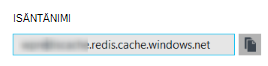
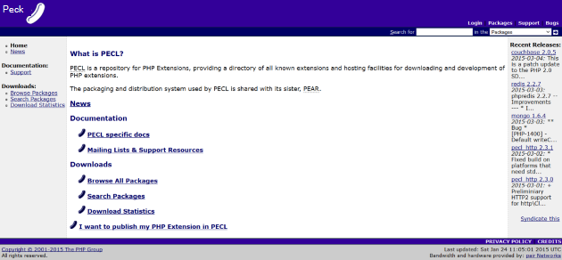

<properties
    pageTitle="Azure-sovelluksen palvelun verkkosovellukseen muodostaa välimuistin Redis Memcache-protokollan kautta | Microsoft Azure"
    description="Azure-sovelluksen palvelussa verkkosovellukseen yhdistäminen Redis välimuistin Memcache-protokollan avulla"
    services="app-service\web"
    documentationCenter="php"
    authors="SyntaxC4"
    manager="wpickett"
    editor="riande"/>

<tags
    ms.service="app-service-web"
    ms.devlang="php"
    ms.topic="get-started-article"
    ms.tgt_pltfrm="windows"
    ms.workload="na"
    ms.date="02/29/2016"
    ms.author="cfowler"/>

# <a name="connect-a-web-app-in-azure-app-service-to-redis-cache-via-the-memcache-protocol"></a>Azure-sovelluksen palvelun verkkosovellukseen muodostaa välimuistin Redis Memcache-protokollan kautta

Tässä artikkelissa käydään WordPress verkkosovellukseen [Azure](http://go.microsoft.com/fwlink/?LinkId=529714) -sovelluksen palvelun yhdistämisestä [Azure Redis välimuistin] [ 12] käyttämällä [Memcache] [ 13] protokolla. Jos sinulla on, joka käyttää Memcached palvelimeen ladatun välimuistiin tallentaminen online, voi siirtäminen Azure App palvelun ja käyttää ensimmäisen osapuolen välimuistiin ratkaisun Microsoft Azure mahdollisimman vähän muutoksia sovelluksen koodin. Lisäksi voit käyttää aiemmin luotuja Memcache osaamisalueet luominen erittäin skaalattava distributed Azure Redis välimuistin Azure App palvelun sovellukset ladatun välimuistiin tallentaminen, kuten .NET, PHP, Node.js, Java ja Python Suositut sovelluksen kehysten käytön aikana.  

Sovelluksen Service Web Apps ottaa käyttöön tämän sovelluksen skenaarion Web Apps-Memcache korjaus, joka on paikallinen Memcached-palvelin, joka toimii Memcache välityspalvelimen välimuistiin Azure Redis välimuistin puhelut kanssa. Näin sovellusta, joka välittää välimuistin tietoja Memcache-protokollan avulla Redis välimuistin. Memcache Tämä korjaus toimii protokolla tasolla, jotta se voidaan käyttää minkä tahansa sovelluksen tai sovelluksen framework, kunhan se välittää Memcache-protokollan avulla.

[AZURE.INCLUDE [app-service-web-to-api-and-mobile](../../includes/app-service-web-to-api-and-mobile.md)] 

## <a name="prerequisites"></a>Edellytykset

Web Apps-Memcache korjaus voidaan on kaikissa sovelluksissa, jos se välittää Memcache-protokollan avulla. Tässä esimerkissä viittaus-sovellus on skaalattava WordPress-sivusto, jossa on valmisteltu Azure Marketplacesta.

Seuraa artikkelin näissä artikkeleissa:

* [Azure Redis välimuisti-palvelun esiintymän valmistelu][0]
* [Ottaa käyttöön skaalattava WordPress sivuston Azure-tietokannassa][1]

Kun sinulla on otettu käyttöön skaalattava WordPress-sivustossa ja Redis välimuisti-esiintymän valmisteltu ovat valmiina Jatka ottaminen käyttöön Memcache korjaus Azure App palvelun verkkosovelluksissa.

## <a name="enable-the-web-apps-memcache-shim"></a>Ota käyttöön Web Apps-Memcache korjaus

Jotta voit määrittää Memcache korjaus, sinun on luotava kolme app-asetukset. Tämän voi tehdä käyttämällä usealla eri tavalla, mukaan lukien [Azure Portal](http://go.microsoft.com/fwlink/?LinkId=529715)- [perinteinen portal][3], [Azure PowerShellin cmdlet-komennot] [ 5] tai [Azure käyttöliittymä][5]. Tämä viesti tarkoitetaan valitsen [Azure-portaalin] käyttäminen[ 4] app-asetukset. Voit noutaa seuraavat arvot Redis välimuistin esiintymän **asetukset** -sivu.


### <a name="add-redishost-app-setting"></a>Lisää REDIS_HOST asetus

Sinun on luotava ensimmäisen sovelluksen-asetus on **REDIS\_HOST** asetus. Tämä asetus määrittää kohde, johon korjaus välittää välimuistin tietoja. Voit noutaa REDIS_HOST sovelluksen asetukselle arvon Redis välimuistin esiintymän **Ominaisuudet** -sivu.



Määrittää sovelluksen-asetukseksi käyttäjäavainten **REDIS\_HOST** ja **hostname** Redis välimuistin esiintymän app asetuksen arvoa.


### <a name="add-rediskey-app-setting"></a>Lisää REDIS_KEY asetus

Sinun on luotava toinen sovellus-asetus on **REDIS\_AVAIMEN** asetus. Tämä asetus on todennus-tunnusta tarvitaan suojatusti access Redis välimuistin esiintymä. Voit hakea REDIS_KEY sovelluksen asetus Redis välimuistin esiintymän **pikanäppäimet** -sivu-arvon.


Määrittää sovelluksen-asetukseksi käyttäjäavainten **REDIS\_AVAIMEN** ja Redis välimuistin esiintymän **Perusavain** -sovelluksen-asetuksen arvoa.


### <a name="add-memcacheshimredisenable-app-setting"></a>Lisää MEMCACHESHIM_REDIS_ENABLE asetus

Viimeinen app asetusta käytetään käyttöön Memcache korjaus Web Apps-sovelluksissa, jossa on käytössä REDIS_HOST ja REDIS_KEY muodostaa välimuistin Azure Redis ja välittää välimuistin puhelut. Määrittää sovelluksen-asetukseksi käyttäjäavainten **MEMCACHESHIM\_REDIS\_käyttöön** ja arvon **True**.


Kun olet valmis lisääminen kolme (3)-sovelluksen, asetukset valitsemalla **Tallenna**.

## <a name="enable-memcache-extension-for-php"></a>Ota käyttöön PHP Memcache tunniste

Järjestyksessä puhua Memcache protokolla-sovelluksen on asennettava PHP--WordPress sivuston kieli-framework Memcache-tunniste.

### <a name="download-the-phpmemcache-extension"></a>Lataa php_memcache tunniste

Siirry [PECL][6]. Välimuistiin luokka-kohdassa [memcache][7]. Napsauta sarakkeen ladattavat DLL-linkkiä.



Lataa PHP käytössä olevien Web Apps-versiota ei viestiketjun turvallinen (Soittaa) x86-linkki. (Oletusarvo on PHP 5.4)


### <a name="enable-the-phpmemcache-extension"></a>Ota käyttöön php_memcache-tunniste

Tiedoston lataamisen jälkeen unzip ja lataa **php\_memcache.dll** kyselyjä **d:\\home\\sivuston\\wwwroot\\bin\\tunniste\\ ** hakemisto. Kun verkkosovellukseen php_memcache.dll on ladattu palvelimeen, sinun on käyttöön PHP suorituksen tunniste. Jotta Azure-portaalissa Memcache-tunniste, avaa web-sovelluksen **Asetukset** -sivu ja valitse Lisää uusi sovellus-asetus avaimella **PHP\_TUNNISTEET** ja arvon **bin\\tunniste\\php_memcache.dll**.


> [AZURE.NOTE] Jos haluat ladata useita PHP tiedostotunnisteita web app, PHP_EXTENSIONS arvon pitäisi olla DLL suhteelliset polut pilkuilla erotettu luettelo.


Kun olet valmis, valitse **Tallenna**.

## <a name="install-memcache-wordpress-plugin"></a>Memcache WordPress laajennuksen asentaminen

> [AZURE.NOTE] Voit ladata [Memcached objektin välimuistiin-laajennusten](https://wordpress.org/plugins/memcached/) myös WordPress.org.

Valitse WordPress laajennukset-sivulla **Lisää uusi**.


Kirjoita hakuruutuun **memcached** ja paina **Enter**-näppäintä.


Etsi **Memcached objektivälimuistin** luettelosta ja valitse sitten **Asenna**.


### <a name="enable-the-memcache-wordpress-plugin"></a>Ota käyttöön Memcache WordPress-laajennus

>[AZURE.NOTE] Noudata tässä blogissa ottamisesta [käyttöön sivuston Web Apps-laajennuksen] [ 8] Asenna Visual Studio Team Services.

Valitse `wp-config.php` tiedoston, Lisää seuraava koodi yläpuolella Lopeta muokkaaminen kommentti tiedoston alareunassa.

```php
$memcached_servers = array(
    'default' => array('localhost:' . getenv("MEMCACHESHIM_PORT"))
);
```

Kun tämä koodi on liitetty, monaco automaattisesti Tallenna asiakirja.

Seuraavaksi objektin välimuistiin-laajennusten ottaminen käyttöön. Tämä tapahtuu vetämällä ja pudottamalla **objektin cache.php** **Web-osa-sisältö ja laajennukset ja memcached** kansiosta Memcache objektivälimuisti-toiminnon käyttöön **Web-osa-sisältö** -kansioon.


Nyt kun **objektin cache.php** -tiedosto on **Web-osa-sisältö** -kansiossa, Memcached objektivälimuistin on nyt käytössä.


## <a name="verify-the-memcache-object-cache-plugin-is-functioning"></a>Tarkista Memcache objektin välimuistiin-laajennusten toimii

Kaikki vaiheet, jotta Web Apps-Memcache korjaus on nyt valmis. Riittää vasemmalla on varmistaa, että tietojen täyttäminen Redis välimuistin esiintymä.

### <a name="enable-the-non-ssl-port-support-in-azure-redis-cache"></a>Azure Redis välimuistin-SSL Port (portti)-tuen ottaminen käyttöön

>[AZURE.NOTE] Tämän artikkelin kirjoittamisen aikana Redis CLI ei tue SSL-yhteys näin tarvitaan seuraavia ohjeita.

Siirry Azure-portaalissa, jonka loit web-sovelluksen Redis välimuistin esiintymä. Kun välimuistin sivu on avoinna, valitse **asetukset** -kuvaketta.


**Access-portit** luettelosta.


Valitse **ei** **Salli käyttöoikeus vain SSL kautta**.


Näet, että muut SSL-portti on nyt määritetty. Valitse **Tallenna**.


### <a name="connect-to-azure-redis-cache-from-redis-cli"></a>Yhteyden muodostaminen Azure Redis välimuistin Redis.txt cli

>[AZURE.NOTE] Tässä vaiheessa oletetaan, että Redis.txt on asennettu paikallisesti kehittäminen käyttämääsi laitteeseen. [Asenna Redis.txt paikallisesti käyttämällä näitä ohjeita][9].

Avaa komentorivi konsoli värisinä ja kirjoita seuraava komento:

```shell
redis-cli –h <hostname-for-redis-cache> –a <primary-key-for-redis-cache> –p 6379
```

Korvaa ** &lt;hostname-varten-Redis.txt-välimuistin&gt; ** todellinen xxxxx.redis.cache.windows.net hostname kanssa ja ** &lt;ensisijainen avain-varten-Redis.txt-välimuistin&gt; ** välimuistin access-näppäintä ja paina sitten **Enter**. Kun CLI on yhdistetty Redis välimuisti-esiintymässä, Lähetä Redis.txt komentoja. Alla olevassa näyttökuvassa voin olet päättänyt luettelon näppäimet.


Puhelun luettelon näppäimet olisi palauttavat arvon. Jos ei, kokeile siirtyminen web App-sovellukseen ja yritä uudelleen.

## <a name="conclusion"></a>Tekemistä

Onnittelen! WordPress-sovellus on nyt keskitetystä ladatun välimuistin nousevassa siirtonopeuden tukeen. Muista, että Web Apps Memcache korjaus voidaan käyttää minkä tahansa Memcache asiakkaan ohjelmointikieli tai sovelluksen framework riippumatta. Voit lähettää palautetta tai kysy kysymyksiä Web Apps-Memcache, korjaus kirjaa [MSDN] -keskustelupalstoilta[ 10] tai [Stackoverflow][11].

>[AZURE.NOTE] Jos haluat aloittaa Azure App palvelun ennen rekisteröimässä Azure-tili, siirry [Yritä App palvelu](http://go.microsoft.com/fwlink/?LinkId=523751), jossa lyhytkestoinen starter verkkosovellukseen heti voit luoda sovelluksen-palvelussa. Ei ole pakollinen; luottokortit ei ole sitoumukset.

## <a name="whats-changed"></a>Mikä on muuttunut
* Katso muutoksen opas verkkosivuilta App palveluun: [Azure App palvelu ja sen vaikutus aiemmin Azure-palvelut](http://go.microsoft.com/fwlink/?LinkId=529714)


[0]: ../redis-cache/cache-dotnet-how-to-use-azure-redis-cache.md#create-a-cache
[1]: http://bit.ly/1t0KxBQ
[2]: http://manage.windowsazure.com
[3]: http://portal.azure.com
[4]: ../powershell-install-configure.md
[5]: /downloads
[6]: http://pecl.php.net
[7]: http://pecl.php.net/package/memcache
[8]: http://blog.syntaxc4.net/post/2015/02/05/how-to-enable-a-site-extension-in-azure-websites.aspx
[9]: http://redis.io/download#installation
[10]: https://social.msdn.microsoft.com/Forums/home?forum=windowsazurewebsitespreview
[11]: http://stackoverflow.com/questions/tagged/azure-web-sites
[12]: /services/cache/
[13]: http://memcached.org
