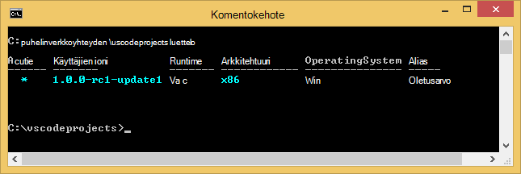
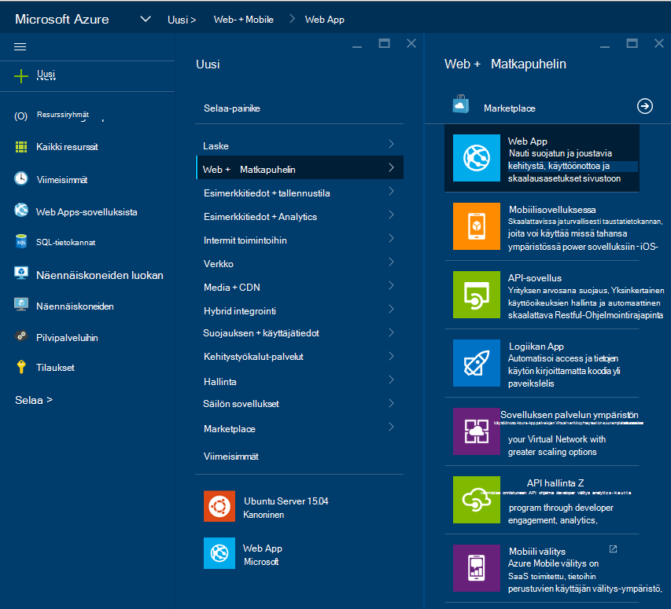

<properties
   pageTitle="ASP.NET-5 web-sovelluksen luominen Visual Studio-koodissa"
   description="Tässä opetusohjelmassa kuvataan, miten ASP.NET 5 web-sovelluksen luominen Visual Studio-koodin avulla."
   services="app-service\web"
   documentationCenter=".net"
   authors="erikre"
   manager="wpickett"
   editor="jimbe"/>

<tags
    ms.service="app-service-web" 
    ms.workload="web" 
    ms.tgt_pltfrm="dotnet" 
    ms.devlang="na" 
    ms.topic="article" 
    ms.date="02/26/2016" 
    ms.author="cephalin"/>

# ASP.NET-5 web-sovelluksen luominen Visual Studio-koodissa

## Yleiskatsaus

Tässä opetusohjelmassa näytetään, miten ASP.NET 5 web-sovelluksen luominen käyttämällä [Visual Studio (ja-koodi)](http://code.visualstudio.com//Docs/whyvscode) ja [Azure App palvelun](../app-service/app-service-value-prop-what-is.md)käyttöön. 

> [AZURE.NOTE] Tässä artikkelissa viittaa web Apps-sovelluksista, vaikka se koskee myös API-sovellusten ja mobiilisovellukset. 

ASP.NET 5 on merkittäviä uudelleensuunnittelua ASP.NET. ASP.NET 5 on uusi Avaa-lähde- ja Office kaikissa ympäristöissä framework etsimisen Moderni pilvipohjainen web Apps-sovellusten käyttäminen .NET. Lisätietoja on artikkelissa [Johdanto ASP.NET-5](http://docs.asp.net/en/latest/conceptual-overview/aspnet.html). Lisätietoja Azure App palvelun web Apps-sovelluksista on artikkelissa [Yleistä Web Apps](app-service-web-overview.md).

[AZURE.INCLUDE [app-service-web-try-app-service.md](../../includes/app-service-web-try-app-service.md)]

## Edellytykset  

* Asenna [ja koodi](http://code.visualstudio.com/Docs/setup).
* Asenna [Node.js](http://nodejs.org) - Node.js on nopea ja skaalattava palvelin-sovellusten käyttäminen JavaScript luomiseen. Solmun on Runtimen (solmu) ja [npm](http://www.npmjs.com/) on solmu moduulit paketin hallintaa. Npm käytetään scaffold tämän opetusohjelman ASP.NET 5 web app-sovelluksessa.
* Asenna Git – voit asentaa sen kummassa tahansa seuraavista sijainneista: [Chocolatey](https://chocolatey.org/packages/git) tai [git scm.com](http://git-scm.com/downloads). Jos ole ennen käyttänyt Git, [git scm.com](http://git-scm.com/downloads) ja valitse vaihtoehto, jos haluat **Käyttää Git Windows komentokehote**. Kun olet asentanut Git, sinun on myös Git käyttäjänimi ja sähköposti, kun se on käytössä pakollinen myöhemmin opetusohjelman (kun suorittamiseen vahvistamista ja koodi).  

## ASP.NET 5 ja DNX asentaminen
ASP.NET-5/DNX (.NET suorittamisen-ympäristössä) on lean .NET-pino etsimisen Moderni cloud ja verkkosovelluksissa käynnissä olevat OS x: ssä ja Windows Linux. Se ole muodostettu alkava optimoitu kehittäminen framework antamaan sovellukset, jotka joko käyttöön pilveen tai suorittaa-ympäristöön. Se koostuu mahdollisimman vähän katseltavan moduulit osia niin joustavuutta säilyttää aikana ratkaisujen luomisesta.

Tässä opetusohjelmassa on suunniteltu aloittamista, sovellusten uusimmat kehittäminen-versioita käytettäessä ASP.NET-5 ja DNX. Seuraavat ohjeet ovat Windows. Katso tarkempia ohjeita OS X, Linux ja Windows- [asennuksen ASP.NET-5 ja DNX](https://code.visualstudio.com/Docs/ASPnet5#_installing-aspnet-5-and-dnx). 

1. Asenna Windows .NET versio hallinta (DNVM), Avaa komentorivi-ikkuna ja suorittamalla seuraavan komennon.

        @powershell -NoProfile -ExecutionPolicy unrestricted -Command "&{$Branch='dev';iex ((new-object net.webclient).DownloadString('https://raw.githubusercontent.com/aspnet/Home/dev/dnvminstall.ps1'))}"

    Tämä Lataa DNVM komentosarja ja sijoita se käyttäjän profiiliin hakemistossa. 

2. **Käynnistä Windows** DNVM-asennuksen viimeistelemiseen. 

    Windowsin uudelleenkäynnistyksen jälkeen voit avata komentokehote vahvistamiseksi DNVM sijainnin kirjoittamalla seuraavasti:

        where dnvm

    Komentokehote näkyy polku seuraavankaltaiselta.

    

3. Nyt kun olet luonut DNVM, sinun on käytettävä Lataa sovellukset toimimaan DNX. Suorita seuraava komentoriville seuraava komento:

        dnvm upgrade

    Varmista, että DNVM ja tarkastella aktiivisen runtime kirjoittamalla komentoriville seuraava:

        dnvm list

    Komentokehote näkyy aktiivisen runtime tietoja.

    

    Jos luettelossa on useampi kuin yksi DNX runtime, voit valita antamaan seuraavat (tai uudempi versio) Määritä aktiivinen DNX runtime komentokehotteen. Määrittää sen saman version kuin se, jota käytetään ASP.NET-5-luontitoiminnon avulla, kun luot koodiin jäljempänä tässä opetusohjelmassa. *Voit joutua ei voi muuttaa aktiivisen runtime, jos se on määritetty päivittymään käytettävissä viimeistään.*

        dnvm use 1.0.0-update1 –p

> [AZURE.NOTE] Katso tarkempia ohjeita OS X, Linux ja Windows- [asennuksen ASP.NET-5 ja DNX](https://code.visualstudio.com/Docs/ASPnet5#_installing-aspnet-5-and-dnx). 

## Web-sovelluksen luominen 

Tässä osassa näytetään, miten scaffold uuden sovelluksen ASP.NET web App-sovelluksen avulla. Solmun pakettien hallinta (npm) aiot asentaa [Yeoman](http://yeoman.io/) (sovelluksen rakennustelineet työkalu - Visual Studio ja koodin vastikkeen **Tiedosto > uusi projekti** toiminto), [Grunt](http://gruntjs.com/) (JavaScript tehtävän runner) ja [Bower](http://bower.io/) (asiakkaan puoli paketinhallinta). 

1. Avaa komentorivi järjestelmänvalvojan oikeuksin ja siirry sijaintiin, johon haluat luoda ASP.NET projektin. Luo esimerkiksi C: ylimmällä tasolla *vscodeprojects* hakemisto\.

2. Kirjoita komentokehotteeseen asentamalla Yeoman ja tukitiedostojen Työkalut seuraavat.

        npm install -g yo grunt-cli generator-aspnet bower

    > [AZURE.NOTE] Näyttöön voi tulla varoitus-ehdottaminen npm-versio on vanhentunut. Varoitus ei vaikuta tässä opetusohjelmassa.

3. Kirjoita komentokehotteeseen luomaan projektikansio ja scaffold sovelluksen seuraavasti.

        yo aspnet

4. Valitse **Web-sovelluksen perustoiminnot** ASP.NET-5 luontitoiminto valikon ja paina nuolinäppäimillä ** &lt;Enter >**.

    

5. Määritä uusi ASP.NET web-sovellus nimi **SampleWebApp**. Kun tätä nimeä käytetään koko opetusohjelman, jos valitset eri nimellä, sinun on korvata jokaiselle esiintymälle **SampleWebApp**. Kun painat ** &lt;Enter >**, Yeoman Luo uusi kansio nimeltä **SampleWebApp** ja tarvittavia tiedostoja, kun uusi sovellus.

6. Komentokehotteen muuttaa uuden projektikansion kansioita:

        cd SampleWebApp

7. Myös komentokehotteen, jos haluat asentaa sovelluksen suorittamiseen tarvittavat NuGet paketit, kirjoita seuraava komento:

        dnu restore

8. Avaa ja koodin kirjoittamalla komentoriville seuraava:

        code .

## Suorita web-sovelluksen paikallisesti

Nyt, kun olet luonut web-sovelluksen ja noutaa kaikki NuGet sovelluksen paketit, voit suorittaa web-sovelluksen paikallisesti.

1. **Komento-valikoima** ja koodissa Lisää seuraavat Näytä käytettävissä Suorita-komento asetukset:

        dnx: Run Command

    > [AZURE.NOTE] Jos Omnisharp palvelin ei ole käynnissä, se käynnistyy. Kirjoita uudelleen yllä olevan komennon.

    Valitse seuraavaksi suorittaa koodiin seuraava komento:
        
        dnx web - (SampleWebApp)

    Komentorivi-ikkuna näkyy, että sovellus on käynnistetty. Jos komentorivi-ikkuna ei Näytä sanoma, valitse näytön vasemmassa corning ja koodin virheet projektin.
    
    > [AZURE.NOTE]Varmenteiden komennon **Komento valikoiman** edellyttää **>** merkki komentorivin alussa. Voit tarkastella *project.json* tiedoston **web** -komento liittyvät tiedot.   
    > Jos komento ei näy, tai se ei ole käytettävissä, sinun on ehkä asennettava C#-tunniste. Suorita `>Extensions: Install Extension` ja `ext install c#` asentamiseksi C#-laajennuksia.

2. Avaa selain ja siirry seuraava URL-osoite.

    **http://localhost:5000**

    Web-sovelluksen oletussivun tulee näkyviin.

    

3. Sulje selain. **Komentorivi-ikkuna**painamalla **Näppäinyhdistelmää Ctrl + C** -sovelluksen Sammuta ja sulje **Komentorivi-ikkuna**. 

## Web-sovelluksen luominen Azure-portaalissa

Seuraavat vaiheet opastaa verkkosovellukseen luominen Azure-portaalissa.

1. Kirjaudu sisään [Azure Portal](https://portal.azure.com).

2. Valitse **Uusi** yläreunasta portaalin vasemmalle.

3. Valitse **WWW-sovellukset > Web-sovelluksen**.

    

4. Kirjoita **nimi**, esimerkiksi **SampleWebAppDemo**-arvoa. Huomaa, että nimi on oltava yksilöllinen ja portaalin pakottaa käyttöön, kun yrität nimi. Tämän vuoksi, jos valitset enter odottamaasi arvoa, tarvitset korvattavat arvon jokaiselle esiintymälle **SampleWebAppDemo** näkyvissä olevat Tässä opetusohjelmassa. 

5. Valitse aiemmin aiemmin **App palvelun suunnitteleminen** tai luoda uuden. Jos luot uuden suunnitelman, valitse hinnoittelu taso, sijainnin ja muita asetuksia. Saat lisätietoja sovelluksen palvelusopimusten vaihtoehdot on artikkelissa, [Azure App palvelun suunnitelmien perusteellisempaa yleiskatsaus](../app-service/azure-web-sites-web-hosting-plans-in-depth-overview.md).

    

6. Valitse **Luo**.

    

## Uusi web-sovelluksen Git julkaisemisen ottaminen käyttöön

Git on jaettu versio ohjausobjektin järjestelmä, voit tehdä Azure App palvelun web-sovelluksen käyttöönotto. Web-sovelluksen paikallisen Git säilöön, kirjoittaa koodin tallentaa ja käyttöön koodisi Azure mukaan valitseminen remote säilöön.   

1. Lokitiedoston [Azure Portal](https://portal.azure.com).

2. Valitse **Selaa**.

3. Valitse **Web Apps -sovellusten** avulla voit tarkastella luetteloa Azure-tilaukseen liittyvää web Apps-sovelluksista.

4. Valitse web Appissa, jonka loit tässä opetusohjelmassa.

5. Valitse web app-sivu **asetukset** > **Jatkuva käyttöönotto**. 

    

6. Valitse **Valitse lähde > paikallisen Git säilöön**.

7. Valitse **OK**.

    

8. Jos käyttöönoton tunnistetietojen julkaiseminen verkkosovellukseen tai muussa App Service-sovelluksessa ei ole aiemmin määrittäminen, määrittää niitä nyt:

    * Valitse **asetukset** > **käyttöönoton tunnistetiedot**. **Määritä käyttöönoton tunnistetiedot** -sivu tulee näkyviin.

    * Luo käyttäjänimi ja salasana.  Tarvitset salasanan myöhemmin Git määritettäessä.

    * Valitse **Tallenna**.

9. Valitse web-sovelluksen sivu **Asetukset > ominaisuudet**. Remote Git säilö, jotka ottaa käyttöön URL-osoite näkyy **GIT**URL-osoitteeseen.

10. Kopioi opetusohjelman **GIT URL-osoite** -arvo myöhempää käyttöä varten.

    

## Web-sovelluksen julkaiseminen App Azure-palvelu

Tässä osiossa luot paikallisen Git tietovaraston ja push kyseisen säilöstä, web-sovelluksen käyttöön Azure Azure.

1. Valitse vasemmanpuoleisessa siirtymispalkissa **Git** -vaihtoehto ja koodi.

    

2. Valitse **alusta git säilöön** , varmista, että työtilan on git hallinnassa. 

    

3. Avaa komentorivi-ikkuna ja muuta hakemistoja web app-kansioon. Kirjoita seuraava komento:

        git config core.autocrlf false

    Tämä komento estää tietoja tekstistä CRLF päätteet ja LF päätteet asiaan ongelma.

4. Koodin ja lisää Vahvista viesti ja valitse **Vahvista kaikki** tarkistuksen kuvake.

    

5. Git päätyttyä käsittely näet, että ei ole tiedostoja, valitse **muutokset**Git-ikkunassa. 

    

6. Muuta takaisin komentoikkunassa missä komentokehote osoittaa hakemiston koodiin sijainti.

7. Luo remote viittausta valitseminen päivitykset web App-sovellukseen käyttämällä Git URL-osoite (pääte ".git"), joka on kopioitu aiemmassa versiossa.

        git remote add azure [URL for remote repository]

8. Määritä Git tunnistetietojen tallentaminen paikallisesti niin, että ne lisätään automaattisesti luotu koodi ja oman push-komentoja.

        git config credential.helper store

9. Siirtää muutokset Azure kirjoittamalla seuraava komento. Tämä alkuperäinen push Azure jälkeen osaat tehdä push-komennot ja koodi. 

        git push -u azure master

    Pyydettäessä salasana, jonka loit aiemmin Azure. **Huomautus: Salasana ei näy.**

    Yllä olevan komennon tulosteen päättyy viestillä käyttöönoton onnistuu.

        remote: Deployment successful.
        To https://user@testsite.scm.azurewebsites.net/testsite.git
        [new branch]      master -> master

> [AZURE.NOTE] Jos teet muutoksia sovelluksen, voit julkaista suoraan koodissa ja **Vahvista kaikki** vaihtoehdon perään **Push** -vaihtoehdon valitseminen Git sisäistä toimintoa käyttäen. Etsii käytettävissä avattavasta valikosta **Vahvista kaikki** ja **Päivitä** -painikkeiden vieressä **Push** -vaihtoehto.

Jos haluat tehdä yhteistyötä projektin, ota huomioon valitseminen, GitHub välissä Azure valitseminen.

## Suorita sovellus Azure-tietokannassa
Nyt kun olet ottanut web app-suorittamalla oletetaan, että kun ylläpidettävä Azure-sovelluksen. 

Voit tehdä tämän kahdella tavalla:

* Avaa selain ja kirjoita nimi koodiin seuraavasti.   

        http://SampleWebAppDemo.azurewebsites.net
 
* Etsi web App-ohjelman web app-sivu Azure-portaaliin, ja voit tarkastella sovelluksen **Selaa** 
* oletusselaimessa.

## Yhteenveto
Tässä opetusohjelmassa opit verkkosovellukseen luominen ja koodi ja ota se käyttöön Azure. Saat lisätietoja ja koodi on artikkelissa [Miksi Visual Studio-koodin?](https://code.visualstudio.com/Docs/) Lisätietoja sovelluksen palvelun web Apps-sovelluksista on artikkelissa [Yleistä Web Apps](app-service-web-overview.md). 
