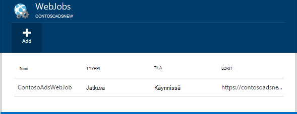
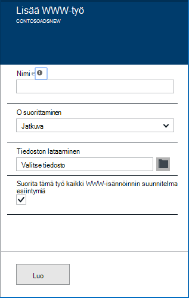
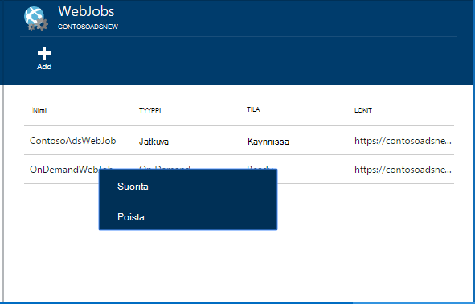
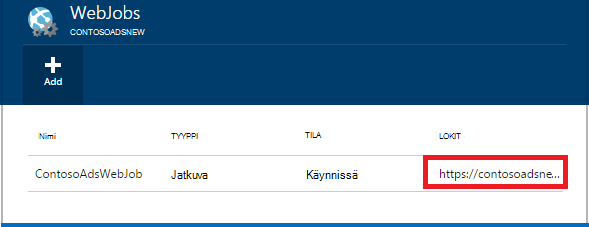

<properties 
    pageTitle="Suorita taustaprosessit WebJobs" 
    description="Opi suorittamaan taustaprosessit Azure-verkkosovelluksissa." 
    services="app-service" 
    documentationCenter="" 
    authors="tdykstra" 
    manager="wpickett" 
    editor="jimbe"/>

<tags 
    ms.service="app-service" 
    ms.workload="na" 
    ms.tgt_pltfrm="na" 
    ms.devlang="na" 
    ms.topic="article" 
    ms.date="04/27/2016" 
    ms.author="tdykstra"/>

# <a name="run-background-tasks-with-webjobs"></a>Suorita taustaprosessit WebJobs

## <a name="overview"></a>Yleiskatsaus

Voit suorittaa ohjelmia tai komentosarjoja WebJobs [Sovelluksen Service](http://go.microsoft.com/fwlink/?LinkId=529714) -sovellukseen kolmella tavalla: pyydettäessä jatkuvasti tai aikataulun. Ei voi käyttää WebJobs ilman lisäkustannuksia.

Tässä artikkelissa kerrotaan WebJobs ottamisesta [Azure-portaalissa](https://portal.azure.com). Lisätietoja käyttöönotto Visual Studiossa tai jatkuva toimituksen prosessin avulla Katso, [miten voit ottaa käyttöön Azure WebJobs Web Apps](websites-dotnet-deploy-webjobs.md).

Azure WebJobs SDK helpottaa monia WebJobs ohjelmointi tehtävät. Lisätietoja on artikkelissa [WebJobs SDK ominaisuudet](websites-dotnet-webjobs-sdk.md).

 Azure-funktioiden (tällä hetkellä esikatselu) on voidaan suorittaa ohjelmia ja komentosarjoja Azure sovelluksen-palvelussa. Lisätietoja on artikkelissa [Azure Funktiot yleiskatsaus](../azure-functions/functions-overview.md).

[AZURE.INCLUDE [app-service-web-to-api-and-mobile](../../includes/app-service-web-to-api-and-mobile.md)] 

## <a name="acceptablefiles"></a>Komentosarjojen tai ohjelmien hyväksyttävä tiedostotyypit

Hyväksytään seuraavia tiedostotyyppejä:

* cmd., .bat, .exe (käyttämällä windows cmd)
* .ps1 (PowerShellillä)
* .SH (joko bash)
* .php (joko php)
* .PY (joko python)
* .js (joko solmu)
* .JAR (joko java)

## <a name="CreateOnDemand"></a>Luo edelleen demand WebJob-portaalissa

1. [Azure-portaalin](https://portal.azure.com) **Web App** -sivu, valitse **kaikki asetukset > WebJobs** näyttämään **WebJobs** -sivu.
    
    
    
5. Valitse **Lisää**. **Lisää WebJob** -valintaikkuna tulee näyttöön.
    
    
    
2. **Nimi**anna sille nimi WebJob. Nimen on alettava kirjaimella tai luku ja ei sisällä erikoismerkkejä, muu kuin "-" ja "_".
    
4. Valitse **pyydettäessä Suorita** **miten Suorita** -ruutuun.
    
3. **Tiedoston lataaminen** -ruutuun napsauttamalla kansiokuvaketta ja komentosarjan sisältävä zip-tiedosto selaamalla. Zip-tiedostossa on oltava suoritettavan-tiedoston (.exe cmd. .bat .sh .php .py .js) sekä mahdolliset tukitiedostot ohjelman tai komentosarjan suorittamiseen.
    
5. Valitse **Luo** Lataa komentosarja web App-sovellukseen. 
    
    WebJob määrittämäsi nimi näkyy **WebJobs** -sivu-luettelossa.
    
6. Suorita WebJob, napsauta sen nimeä luettelossa hiiren kakkospainikkeella ja valitse **Suorita**.
    
    
    
## <a name="CreateContinuous"></a>Luo jatkuvasti käynnissä WebJob

1. Voit luoda jatkuvasti suoritetaan WebJob, suorita sitten samat vaiheet WebJob, että suoritetaan kerran, mutta **Voit Suorita** -ruutuun Valitse **Jatkuva**luomiseen.

2. Voit aloittaa tai lopettaa jatkuva WebJob, napsauta WebJob luettelosta ja valitse **käynnistää** tai **pysäyttää**.
    
> [AZURE.NOTE] Web-sovelluksen käytetään useamman kuin yhden esiintymän, jatkuvasti käynnissä WebJob suoritetaan kaikki kopioita. Tarvittaessa tai ajoitetun WebJobs suorittaa valitulle kuormituksen mukaan Microsoft Azure yksittäistä esiintymää.
    
> Jatkuva WebJobs luotettavasti ja kaikki esiintymät, saat käyttöön aina * hakumäärityksen asetus verkkosovelluksessa muussa tapauksessa voit pysäyttää käynnissä, kun palvelujen ohjauksen hallinta Host (isäntä)-sivustossa on ollut käyttämättömänä liian kauan.

## <a name="CreateScheduledCRON"></a>Luo ajoitetun WebJob, CRON lausekkeen avulla

Tämä menetelmä on saatavana Basic, Standard tai Premium tilassa Web Apps-sovellusten ja edellyttää **Aina** asetuksen käyttöön, kun sovellus.

Voit muuttaa Valitse tarvittaessa WebJob ajoitetun WebJob, riittää, että Sisällytä `settings.job` tiedoston WebJob zip-tiedoston ylimmällä tasolla. JSON tiedoston projektityypin `schedule` ominaisuus [CRON lauseke](https://en.wikipedia.org/wiki/Cron)alla olevassa esimerkissä kohden.

CRON lauseke koostuu 6 kentät: `{second} {minute} {hour} {day} {month} {day of the week}`.

Jos esimerkiksi haluat käynnistävän oman WebJob 15 minuutin välein oman `settings.job` on:

```json
{
    "schedule": "0 */15 * * * *"
}
``` 

Muita CRON aikataulun Esimerkkejä:

- Tunnissa (eli aina minuuttia määrä on 0):`0 0 * * * *` 
- Tunnin välein 9 AM-5 PM avulla:`0 0 9-17 * * *` 
- Kello 30 päivittäin:`0 30 9 * * *`
- Kello 30 viikon päivittäin:`0 30 9 * * 1-5`

**Huomautus**: kun käyttöönotto Visual Studio WebJob, varmista, että Merkitse oman `settings.job` tiedoston ominaisuudet-kopiona Jos uudempaan".


## <a name="CreateScheduled"></a>Luo ajoitetun WebJob, Azure-ajoituksen käyttäminen

Seuraavat Vaihtoehtoinen menetelmä on käyttää Azure-ajoituksen. Tässä tapauksessa oman WebJob ei ole minkä tahansa suoran tuntemus aikatauluun. Sen sijaan Azure-ajoituksen saa määritetty käynnistettävän oman WebJob aikataulun. 

Azure-portaalissa ei vielä ole mahdollisuus luoda ajoitetun WebJob, mutta, kunnes ominaisuus lisätään, voit tehdä [perinteinen portal](http://manage.windowsazure.com).

1. [Perinteinen portal](http://manage.windowsazure.com) Siirry WebJob-sivulle ja valitse **Lisää**.

1. Valitse **miten Suorita** -ruutuun **Suorita aikataulun**.
    
    ![Uuden ajoitetun työn][NewScheduledJob]
    
2. Valitse työtäsi **Ajoituksen alue** ja valitse sitten oikeassa alakulmassa valintaikkunan Jatka seuraavalle sivulle-nuolta.

3. **Luo projekti** -valintaikkunassa haluamasi **Toistuminen** tyypin valitseminen: **erikseen työ** - tai **Toistuva työ**.
    
    ![Aikataulun Toistuminen][SchdRecurrence]
    
4. Valitseminen myös **Aloitus** : **nyt** tai **tiettynä ajankohtana**.
    
    ![Aikataulun aloitusaika][SchdStart]
    
5. Jos haluat aloittaa tiettynä ajankohtana, valitse aloitus aika-arvot **Aloitus-**kohdassa.
    
    ![Aikataulun Käynnistä tiettynä ajankohtana][SchdStartOn]
    
6. Jos valitsit toistuvan työn, sinulla **toistuvaksi jokaisen** Määritä esiintymä ja **Pääte-** asetus, joka määrittää päättymisaika.
    
    ![Aikataulun Toistuminen][SchdRecurEvery]
    
7. Jos valitset **viikkoa**, voit valita **Tietyn aikataulussa** -ruutuun ja määritä viikonpäivien, jonka haluat suorittaa työn.
    
    ![Aikataulun viikonpäivien][SchdWeeksOnParticular]
    
8. Jos valitset **kuukauden** ja valitse **Tietyn aikataulussa** , voit määrittää toimimaan numeroidun **päivän** kuukauden työn. 
    
    ![Aikataulun tietyn päivämäärän kuukauden][SchdMonthsOnPartDays]
    
9. Jos valitset **Viikonpäivät**, voit valita mitkä päivä tai viikonpäivien haluat suorittaa työn kuukauden.
    
    ![Tietyn viikonpäivien kuukaudessa ajoittaminen][SchdMonthsOnPartWeekDays]
    
10. Lopuksi voit käyttää **esiintymien** vaihtoehto myös valita viikko kuukausi (ensimmäinen, toinen, kolmas jne.) haluat suorittaa määrittämäsi viikonpäivien työn.
    
    ![Tietyn viikonpäivien tietyn viikkojen kuukaudessa ajoittaminen][SchdMonthsOnPartWeekDaysOccurences]
    
11. Luotuasi vähintään yksi työt niiden nimet näkyvät WebJobs välilehdelle tilansa, aikataulu-tyyppiä ja muita tietoja. Viimeksi 30 WebJobs historiatiedot säilytetään.
    
    ![Projektit-luettelossa][WebJobsListWithSeveralJobs]
    
### <a name="Scheduler"></a>Ajoitetuissa ja Azure ajoitus

Ajoitetuissa voi määrittää tarkemmin [perinteinen portal](http://manage.windowsazure.com)Azure ajoitus-sivuilla.

1.  Valitse WebJobs-sivulla projektin **aikataulun** linkkiä, siirry Azure ajoitus sivu. 
    
    ![Linkki Azure ajoitus][LinkToScheduler]
    
2. Valitse ajoitus-sivulla työn.
    
    ![Työn ajoitus sivu][SchedulerPortal]
    
3. **Työn toiminto** -sivu avautuu, jossa voit edelleen määrittää työn. 
    
    ![Työn toiminnon PageInScheduler][JobActionPageInScheduler]
    
## <a name="ViewJobHistory"></a>Työhistorian tarkasteleminen

1. Voit tarkastella suorittamisen historiatiedot työn, mukaan lukien työt, joka on luotu käyttämällä WebJobs SDK-paketissa, valitsemalla sen vastaavan linkin **lokit** -sarakkeen WebJobs-sivu. (Voit Leikepöytä-kuvake kopioi log tiedoston sivun URL-osoite Leikepöydälle, jos haluat, että.)
    
    
        
2. Tiedot-sivu napsauttamalla linkkiä, Avaa WebJob. Tällä sivulla näkyy nimi, suorittaa, se suoritettiin viimeisen ajat komento ja sen onnistumisesta tai epäonnistumisesta. Valitse **Viimeisimmät suoritetaan**, näkevän tietoja kerrallaan.
    
    ![WebJobDetails][WebJobDetails]
    
3. **WebJob Suorita tiedot** -sivu tulee näkyviin. Valitse **Näytä tai piilota tulosteen** Nähdäksesi lokin sisällön tekstissä. Lokiin on teksti-muodossa. 
    
    ![Web-työ suoritetaan tiedot][WebJobRunDetails]
    
4. Erillisessä selainikkunassa tulosteen tekstin näkyviin napsauttamalla **Lataa** -linkkiä. Voit ladata itse tekstiä, napsauta linkkiä hiiren kakkospainikkeella ja selaimesi avulla voit tallentaa tiedoston sisältöä.
    
    ![Lataa log tulostus][DownloadLogOutput]
    
5. Sivun yläreunassa **WebJobs** -linkki on kätevä tapa siirtyä WebJobs luettelo historia-koontinäytössä.
    
    ![WebJobs luetteloon][WebJobsLinkToDashboardList]
    
    ![Historia-koontinäytön WebJobs luettelo][WebJobsListInJobsDashboard]
    
    Valitsemalla on seuraavissa linkeissä Avaa valitun projektin WebJob tiedot-sivulla.


## <a name="WHPNotes"></a>Huomautuksia
    
- Web Apps-sovellusten vapaa-tilassa voit aikakatkaisu, kun 20 minuutin ajan, jos ei pyynnöt palvelujen ohjauksen hallinta (käyttöönotosta)-sivustoon ja web app-portaalissa on eivät avaudu Azure. Todellinen sivuston pyynnöt ei palauta tämä.
- Jatkuva työn koodi on kirjoitettava suorittaa loputonta silmukkaa.
- Jatkuva työt suoritetaan jatkuvasti vain silloin, kun web app on käytössä.
- Perustiedot ja vakio tilat tarjous aina ominaisuus, joka otettu käyttöön, kun asettamisen verkkosovelluksissa estää.
- Voit korjata vain käynnissä jatkuvasti WebJobs. Virheenkorjaus ajoitettuihin tai tarvittaessa WebJobs ei tueta.

## <a name="NextSteps"></a>Seuraavat vaiheet
 
Lisätietoja on artikkelissa [Azure WebJobs suositellaan resurssien][WebJobsRecommendedResources].

[PSonWebJobs]:http://blogs.msdn.com/b/nicktrog/archive/2014/01/22/running-powershell-web-jobs-on-azure-websites.aspx
[WebJobsRecommendedResources]:http://go.microsoft.com/fwlink/?LinkId=390226

[OnDemandWebJob]: ./media/web-sites-create-web-jobs/01aOnDemandWebJob.png
[WebJobsList]: ./media/web-sites-create-web-jobs/02aWebJobsList.png
[NewContinuousJob]: ./media/web-sites-create-web-jobs/03aNewContinuousJob.png
[NewScheduledJob]: ./media/web-sites-create-web-jobs/04aNewScheduledJob.png
[SchdRecurrence]: ./media/web-sites-create-web-jobs/05SchdRecurrence.png
[SchdStart]: ./media/web-sites-create-web-jobs/06SchdStart.png
[SchdStartOn]: ./media/web-sites-create-web-jobs/07SchdStartOn.png
[SchdRecurEvery]: ./media/web-sites-create-web-jobs/08SchdRecurEvery.png
[SchdWeeksOnParticular]: ./media/web-sites-create-web-jobs/09SchdWeeksOnParticular.png
[SchdMonthsOnPartDays]: ./media/web-sites-create-web-jobs/10SchdMonthsOnPartDays.png
[SchdMonthsOnPartWeekDays]: ./media/web-sites-create-web-jobs/11SchdMonthsOnPartWeekDays.png
[SchdMonthsOnPartWeekDaysOccurences]: ./media/web-sites-create-web-jobs/12SchdMonthsOnPartWeekDaysOccurences.png
[RunOnce]: ./media/web-sites-create-web-jobs/13RunOnce.png
[WebJobsListWithSeveralJobs]: ./media/web-sites-create-web-jobs/13WebJobsListWithSeveralJobs.png
[WebJobLogs]: ./media/web-sites-create-web-jobs/14WebJobLogs.png
[WebJobDetails]: ./media/web-sites-create-web-jobs/15WebJobDetails.png
[WebJobRunDetails]: ./media/web-sites-create-web-jobs/16WebJobRunDetails.png
[DownloadLogOutput]: ./media/web-sites-create-web-jobs/17DownloadLogOutput.png
[WebJobsLinkToDashboardList]: ./media/web-sites-create-web-jobs/18WebJobsLinkToDashboardList.png
[WebJobsListInJobsDashboard]: ./media/web-sites-create-web-jobs/19WebJobsListInJobsDashboard.png
[LinkToScheduler]: ./media/web-sites-create-web-jobs/31LinkToScheduler.png
[SchedulerPortal]: ./media/web-sites-create-web-jobs/32SchedulerPortal.png
[JobActionPageInScheduler]: ./media/web-sites-create-web-jobs/33JobActionPageInScheduler.png
 
