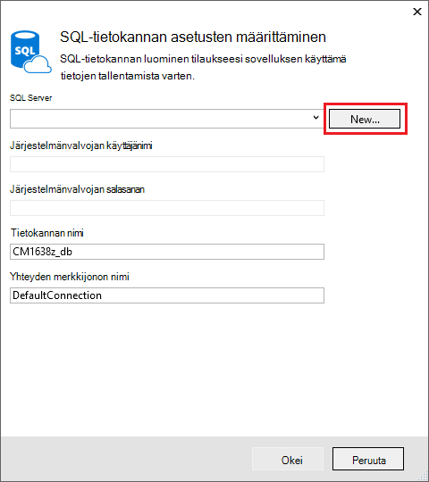

<properties 
    pageTitle="ASP.NET-MVC-sovelluksen luominen auth ja SQL DB ja ota käyttöön App Azure-palvelu" 
    description="Lue, miten kehittää ASP.NET MVC 5-sovelluksessa, jossa SQL-tietokantaan taustatietokannan, Lisää todennus- ja ja ota se käyttöön Azure." 
    services="app-service\web" 
    documentationCenter=".net" 
    authors="Rick-Anderson" 
    writer="Rick-Anderson" 
    manager="wpickett" 
    editor=""/>

<tags 
    ms.service="app-service-web" 
    ms.workload="web" 
    ms.tgt_pltfrm="na" 
    ms.devlang="dotnet" 
    ms.topic="article" 
    ms.date="03/21/2016" 
    ms.author="riande"/> 

# ASP.NET-MVC-sovelluksen luominen auth ja SQL DB ja ota käyttöön App Azure-palvelu

Tässä opetusohjelmassa näytetään, miten voit luoda suojatun ASP.NET MVC 5 verkkosovellukseen, jonka avulla käyttäjät log sisään Facebook- tai Google. Sovellus on yksinkertainen yhteystietoluettelosta, joka käyttää ADO.NET-kohteen Framework tietokannan käytön. Sovelluksen käyttöön [Azure App palvelu](http://go.microsoft.com/fwlink/?LinkId=529714). 

Opetusohjelman on valmis, valitse on suojattu tietoihin perustuvien web-sovelluksen määrittäminen ja pilveen käynnissä ja cloud tietokannan käytön. Seuraavassa kuvassa näkyy kirjautuminen valmiin sovelluksen.

![Kirjaudu sisään-sivulla][rxb]

Opit:

* Voit luoda suojatun ASP.NET MVC 5 web projektin Visual Studio.
* Tietoa todennusta ja määritä niiden Google- tai Facebook-tileiltä (sosiaalisen tarjoajan todennus käyttämällä [OAuth 2.0](http://oauth.net/2 "http://oauth.net/2")) tunnuksilla kirjautuvat käyttäjät.
* Tietoa todentaa ja määritä käyttäjille, jotka Rekisteröidy tietokannan hallitsee sovelluksen (paikallinen todennus [ASP.NET tunnistetietojen](http://asp.net/identity/)avulla).
* Voit käyttää ADO.NET kohteen Framework 6 koodi ensimmäisen lukemiseen ja kirjoittamiseen tietojen SQL-tietokantaan.
* Opit käyttämään kohteen Framework koodin ensimmäisen siirrot tietokannan käyttöönotto.
* Voit tallentaa relaatiotietoja pilvipalveluun käyttämällä Azure SQL-tietokantaan.
* Web-projekti, joka käyttää tietokannan [web app](http://go.microsoft.com/fwlink/?LinkId=529714) -sovelluksen Azure-palvelu ottamisesta.

>[AZURE.NOTE] Tämä on pitkä opetusohjelma. Ohjeartikkelissa Azure App palvelu ja Visual Studio web-projektit lyhyt esittely, [Luo ASP.NET web-sovelluksen Azure App palvelu](web-sites-dotnet-get-started.md). Vianmääritysohjeita tiedot kohdassa [vianmääritys](#troubleshooting) .
>
>Tai jos haluat aloittaa Azure App palvelun ennen rekisteröimässä Azure-tili, siirry [Yritä App palvelu](http://go.microsoft.com/fwlink/?LinkId=523751), jossa lyhytkestoinen starter verkkosovellukseen heti voit luoda sovelluksen-palvelussa. Ei ole pakollinen; luottokortit ei ole sitoumukset.

## Edellytykset

Tässä opetusohjelmassa suorittamiseen tarvitset Microsoft Azure-tiliin. Jos sinulla ei ole tiliä, voit [aktivoida Visual Studio tilaajan etuja](/pricing/member-offers/msdn-benefits-details/?WT.mc_id=A261C142F) tai [maksuttoman kokeiluversion käyttäjäksi rekisteröityminen](/pricing/free-trial/?WT.mc_id=A261C142F).

Määrittää oman kehitysympäristö, sinun on asennettava [Visual Studio 2013: n päivitys 5](http://go.microsoft.com/fwlink/?LinkId=390521) tai uudempi versio, ja [Azure SDK.NET](http://go.microsoft.com/fwlink/?linkid=324322&clcid=0x409)uusimman version. Tässä artikkelissa on kirjoitettu Visual Studio Päivitä 4 ja SDK 2.8.1. Visual Studio 2015 kanssa asennettu uusimmat [Azure SDK.NET](http://go.microsoft.com/fwlink/?linkid=518003&clcid=0x409) sovellu kuvatulla tavalla, mutta jotkin näytöt erilainen kuvat.

## ASP.NET MVC 5-sovelluksen luominen

### Projektin luominen

1. Valitse **Tiedosto** -valikossa **Uusi projekti**.

    

1. **Uusi projekti** -valintaikkunassa Laajenna **C#** ja valitse **Web** **Asennettu mallit**-kohdassa ja valitse sitten **ASP.NET Web-sovelluksen**. Sovelluksen **ContactManager**nimi ja valitse sitten **OK**.

    
 
    **Huomautus:** Varmista, että "ContactManager". Koodin, sinun olla kopioiminen myöhemmin estää oletetaan, että projektinimi on ContactManager. 

1. Valitse **Uusi ASP.NET-projekti** -valintaikkunassa **MVC** -malli. Tarkista **todennus** on määritetty **Yksittäisiä käyttäjätilejä**, **Host pilveen** on valittuna ja **Sovelluksen palvelu** on valittuna.

    

1. Valitse **OK**.

1. **Määritä Microsoft Azure Web App-asetukset** -valintaikkuna tulee näyttöön. Joudut ehkä kirjautua sisään, jos et ole vielä tehnyt niin tai anna tunnistetiedot uudelleen, jos kirjautumisen on vanhentunut.

1. Valinnainen – Muuta arvon **Web-sovelluksen nimi** -ruutuun (Katso alla olevassa kuvassa).

    Web-sovelluksen URL-osoite on {name} .azurewebsites .net-siten, että nimi on oltava yksilöllinen azurewebsites.net toimialueen. Ohjatun määritystoiminnon ehdottaa yksilöllinen nimi liittämällä luvun projektinimi "ContactManager" ja, joka on kunnossa Tässä opetusohjelmassa.

5. **Resurssiryhmä** avattavasta Valitse aiemmin luotuun ryhmään tai **Luo uusi resurssiryhmä**(Katso alla olevassa kuvassa). 

    Halutessasi voit valita, jotka ovat jo resurssiryhmä. Mutta uusi resurssiryhmä luoda ja käyttää sitä vain tässä opetusohjelmassa, jos se on helppo poistaa kaikki Azure resurssit, jotka olet luonut opetusohjelman lopuksi heidän kanssaan. Resurssiryhmien tietoja on artikkelissa [Azure resurssien hallinnan yleiskatsaus](../azure-resource-manager/resource-group-overview.md). 

5. **Sovelluksen palvelusopimus** avattavasta Valitse luettelossa suunnitelman tai **Luo uusi sovellus-palvelun suunnittelu**(Katso alla olevassa kuvassa).

    Voit halutessasi valita sovelluksen Service-suunnitelma, joka on jo. Sovelluksen palvelusopimusten vaihtoehdot tietoja on artikkelissa [Azure App palvelun suunnitelmien perusteellisempaa yleiskatsaus](../app-service/azure-web-sites-web-hosting-plans-in-depth-overview.md). 

1. Valitse **Selaa lisäpalveluja Azure** SQL-tietokanta lisätään.

    

1. Valitse **+** Lisää SQL-tietokannan kuvaketta.

    

1. Valitse **Uusi** **Määrittäminen SQL-tietokanta** -valintaikkunassa:

    

1. Kirjoita nimi järjestelmänvalvoja ja vahva salasana.

    

    Palvelimen nimi on oltava yksilöllinen. Se voi olla pienet kirjaimet, numerona ja väliviivoja. Se ei voi olla lopussa yhdysmerkin. Käyttäjänimi ja salasana ovat uudet luotavan uuden palvelimen tunnistetiedot. 

    Jos sinulla on jo tietokantapalvelimeen, voit valita yhden sijaan. Tietokannan palvelimia arvokkaita resurssin ja haluat yleensä useiden tietokantojen luominen samassa palvelimessa testaus ja kehitys sijaan luominen tietokantapalvelimeen tietokantaa kohden. Tässä opetusohjelmassa varten tarvitset vain palvelin väliaikaisesti, ja luomalla palvelimen sivuston samaan resurssiryhmään voit avulla on helppo poistaa molempien web app- ja resurssien poistamalla resurssiryhmän, kun enää tarvitse opetusohjelman. 

    Jos valitset aiemmin luodun tietokantapalvelimen, varmista, että web app- ja tietokanta on samassa alueella.

    

4. Valitse **Luo**.

    Visual Studio Luo ContactManager web-projekti, Luo resurssiryhmä ja sovelluksen palvelusopimus, joka on määritetty, ja luo verkkosovellukseen Azure-sovelluksen palvelun määrittämäsi nimi.

### Määrittää sivun ylä- ja alatunniste

1. Napsauta **Ratkaisunhallinnassa** Avaa *Layout.cshtml* tiedosto *Views\Shared* -kansiossa.

    ![Napsauta ratkaisunhallinnassa _Layout.cshtml][newapp004]

1. Korvaa seuraava koodi ActionLink *Layout.cshtml* -tiedostossa.

    @Html.ActionLink("CMEsittely","Hakemisto","Yhteyttä", uusi {alueen =" "}, uusi { @class ="siirtymispalkki tuotemerkin"})
                   

    Varmista, että voit muuttaa kolmas parametri "Kotona" "Yhteystiedot". Yllä merkintä Luo "yhteystiedot-linkki kullakin sivulla yhteystiedot ohjauskoneen, indeksi-menetelmää. Muuta sovelluksen nimen otsikko-ja alatunnisteen "Omat ASP.NET-sovelluksesta" ja "Nimi" "Contact Managerin" ja "CM esittely". 
 
### Suorita sovellus paikallisesti

1. Paina CTRL + F5 Suorita sovellus.

    Sovelluksen aloitus-sivulla näkyy oletusselaimessa.

    

Tämä on kaikki, sinun on suoritettava nyt, jotka ottaa käyttöön Azure-sovelluksen luominen. 

## Azure sovelluksen käyttöönotto

1. Visual Studiossa Napsauta **Ratkaisunhallinnassa** projektin hiiren kakkospainikkeella ja valitse **Julkaise** pikavalikosta.

    
    
    **Sivuston julkaiseminen** ohjattu toiminto avautuu.

1. Valitse **Julkaise** -valintaikkunan **Julkaise**.

    

    Luomasi sovellus on nyt käynnissä pilveen. Kun seuraavan kerran sovelluksen käyttöönottoa vain muutetut (tai uudet)-tiedostoja otetaan käyttöön.

    

## Ota käyttöön SSL projektin ##

1. **Ratkaisunhallinnassa** **ContactManager** -projekti ja valitse sitten F4-näppäintä Avaa **Ominaisuudet** -ikkuna.

3. Muuta arvoksi **True** **SSL käytössä** . 

4. Kopioi **SSL URL-osoite**.

    SSL-URL-osoite on https://localhost:44300 / paitsi, jos olet luonut SSL-verkkosovelluksissa.

    ![Ota SSL][rxSSL]
 
1. **Ratkaisunhallinnassa**Napsauta hiiren kakkospainikkeella **Contact Manager** -projekti ja valitse **Ominaisuudet**.

1. Valitse **Web** -välilehti.

1. Voit muuttaa **Projektin URL-osoitteen** **SSL URL-osoite** ja Tallenna sivu (ohjausobjektin S).

    
 
1. Varmista, että Internet Explorer on selainta, joka käynnistää Visual Studiossa, alla olevassa kuvassa esitetyllä tavalla:

    

    Selaimen valitsimen avulla voit määrittää Visual Studio Avaa selaimessa. Voit valita useita selaimet ja on Visual Studio Päivitä kaikissa selaimissa, kun teet muutoksia. Katso lisätietoja [Käyttämällä selaimen linkki Visual Studio 2013: ssa](http://www.asp.net/visual-studio/overview/2013/using-browser-link).

    

1. Paina CTRL + F5 sovelluksen käyttämiseen. Valitse **Kyllä** , jotka on luotu IIS Express itse allekirjoitetun varmenteen määrittäminen luotetuksi aloittaa.

     

1. Lue **Suojausvaroitus** -valintaikkuna ja valitse sitten **Kyllä** , jos haluat asentaa edustava **localhost**varmenne.

    

1. Internet Explorer näyttää *Aloitussivu* ja varoituksia ei ole SSL.

     

     Internet Explorer on hyvä vaihtoehto, kun käytät SSL koska se hyväksyy varmenne ja näyttää HTTPS sisällön ilman varoitusta. Microsoft Edge ja Google Chrome myös hyväksyä varmenne. Firefox käyttää varmenteen omassa kaupan siten, että se näkyy ilmoitus.

     

## Tietokannan lisääminen sovellukseen

Seuraavaksi Päivitä voi näyttää ja Päivitä yhteystiedot ja tallentaa tiedot tietokannan Lisää sovellus. Sovelluksen käytetään kohteen Framework (EF) on luotu ja lukea ja päivittää tiedot.

### Lisää tiedot mallia luokkia yhteystietoja varten

Aloita luomalla yksinkertaisen Tietomallin koodi.

1. **Ratkaisunhallinnassa**Mallit-kansion hiiren kakkospainikkeella, valitse **Lisää**ja sitten **luokka**.

    

2. **Lisää uusi kohde** -valintaikkunassa uuden luokan tiedoston *Contact.cs*nimi ja valitse sitten **Lisää**.

    ![Lisää uusi kohde-valintaikkuna][adddb002]

3. Korvaa Contact.cs-tiedoston sisällön seuraava koodi.

        using System.ComponentModel.DataAnnotations;
        using System.Globalization;
        namespace ContactManager.Models
        {
            public class Contact
            {
                public int ContactId { get; set; }
                public string Name { get; set; }
                public string Address { get; set; }
                public string City { get; set; }
                public string State { get; set; }
                public string Zip { get; set; }
                [DataType(DataType.EmailAddress)]
                public string Email { get; set; }
            }
        }
**Ota yhteyttä** -luokka määrittää tiedot, jotka voit tallentaa kunkin yhteyshenkilön sekä perusavaimen *ContactID*, tietokannan tarvitsemat.

### Luo verkkosivua, sovelluksen käyttäjät voivat käsitellä yhteystiedot

ASP.NET-MVC rakennustelineet-toimintoa voit luoda automaattisesti koodi, joka suorittaa luominen, lukea, päivittää ja poistaa (CRUD)-toimintoja. 

1. Luo projekti **(Ctrl + Vaihto + B)**. (Projektin täytyy luoda ennen kuin käytät rakennustelineet järjestelmä.)
 
1. **Ratkaisunhallinnassa**ohjaimet-kansiota hiiren kakkospainikkeella ja valitse **Lisää**ja valitse sitten **ohjauskoneen**.

    ![Lisää ohjauskoneen ohjaimet kansion pikavalikko][addcode001]

5. **Lisää Scaffold** -valintaikkunassa valitse **MVC 5 ohjauskoneen näkymiä, käyttämällä EF** ja valitse sitten **Lisää**.
    
    

1. Valitse avattava **mallin luokka** -ruudussa **yhteyshenkilön (ContactManager.Models)**. (Katso alla olevassa kuvassa).

1. Valitse **tietojen kontekstin luokan** **ApplicationDbContext (ContactManager.Models)**. **ApplicationDbContext** käytetään jäsenyyden DB ja tutustu yhteyshenkilön tiedot.

    

1. Valitse **Lisää**.

   Visual Studio Luo valvonta on menetelmien ja näkymien CRUD tietokannan toimille **yhteyshenkilön** objekteja.

## Käyttöön siirrot, on luotu, lisää mallitiedot ja tietojen alustimessa ##

Seuraava tehtävä on otetaan käyttöön [Koodin ensimmäisen siirrot](http://msdn.microsoft.com/library/hh770484.aspx) luominen tietokannan taulukoiden, jotka olet luonut tietomallin perusteella.

1. Valitse **Työkalut** -valikosta **NuGet pakettien hallinta** ja valitse sitten **Paketin hallinta-konsolin**.

    

2. Kirjoita **Konsoli pakettien hallinta** -ikkunassa seuraava komento:

        enable-migrations

    **Ota siirrot** -komento luo *siirrot* -kansio ja sanan alle kyseiseen kansioon, joita voi muokata Määritä tietokannan ja määritä siirrot *Configuration.cs* tiedoston. 

2. Kirjoita **Konsoli pakettien hallinta** -ikkunassa seuraava komento:

        add-migration Initial

    **Lisää siirron alku** -komento luo tiedosto nimeltä ** &lt;date_stamp&gt;alkuperäisen** *siirrot* -kansiossa. Tässä tiedostossa koodi luo tietokantataulukot. Ensimmäinen parametri ( **Alkuperäinen** ) käytetään luomaan tiedoston nimi. Näet uudet luokkatiedostot, napsauta **Ratkaisunhallinnassa**.

    **Ensimmäisen** luokan **ylös** -menetelmä luo sekä yhteystietojen taulukosta ja **alas** -menetelmän (käytetään, kun haluat palata edelliseen tilaan) pudottaa siihen.

3. Avaa *Migrations\Configuration.cs* -tiedosto. 

4. Lisää seuraava `using` lause. 

         using ContactManager.Models;

5. *Lähde* -menetelmä korvaa seuraava koodi:

        protected override void Seed(ContactManager.Models.ApplicationDbContext context)
        {
            context.Contacts.AddOrUpdate(p => p.Name,
               new Contact
               {
                   Name = "Debra Garcia",
                   Address = "1234 Main St",
                   City = "Redmond",
                   State = "WA",
                   Zip = "10999",
                   Email = "debra@example.com",
               },
                new Contact
                {
                    Name = "Thorsten Weinrich",
                    Address = "5678 1st Ave W",
                    City = "Redmond",
                    State = "WA",
                    Zip = "10999",
                    Email = "thorsten@example.com",
                },
                new Contact
                {
                    Name = "Yuhong Li",
                    Address = "9012 State st",
                    City = "Redmond",
                    State = "WA",
                    Zip = "10999",
                    Email = "yuhong@example.com",
                },
                new Contact
                {
                    Name = "Jon Orton",
                    Address = "3456 Maple St",
                    City = "Redmond",
                    State = "WA",
                    Zip = "10999",
                    Email = "jon@example.com",
                },
                new Contact
                {
                    Name = "Diliana Alexieva-Bosseva",
                    Address = "7890 2nd Ave E",
                    City = "Redmond",
                    State = "WA",
                    Zip = "10999",
                    Email = "diliana@example.com",
                }
                );
        }

    Tämä koodi alustaa (siemenet) tietokanta on näkyvissä. Saat lisätietoja valuuttamuunnosten tietokannan [alustus ja virheenkorjaus kohteen Framework (EF) hidastustekniikkaa](http://blogs.msdn.com/b/rickandy/archive/2013/02/12/seeding-and-debugging-entity-framework-ef-dbs.aspx). Luo projektin vahvistamiseksi Käännä ei ole virheitä.

6. Kirjoita **Paketin hallinta-konsolin** komento:

        update-database

    ![Paketin hallinta-konsolin komennot][addcode009]

    **Päivitä tietokannan** suoritetaan ensimmäinen siirron, joka luo tietokanta. Oletusarvon mukaan tietokanta on luotu SQL Server Express LocalDB tietokannan. 

7. Paina CTRL + F5 sovelluksen käyttämiseen, ja valitse sitten **Cm: N esittely** ; linkki tai siirry https://localhost:(port#)/Cm. 

    Sovelluksen näkyvät lähde-tiedot ja Muokkaa, tiedot ja poista linkkejä. Voit luoda, muokata, poistaa ja tarkastella tietoja.

    ![MVC näkymiä tiedoista][rx2]

## Lisää OAuth2-palvelu

>[AZURE.NOTE] Lisätietoja siitä, miten voit käyttää Google- ja Facebook developer portaalin sivustot, tämän opetusohjelman linkit opetusohjelmiin ASP.NET-sivustossa. Kuitenkin Google- ja Facebook muuttaa omien sivustojen useammin näiden opetusohjelmat päivitetään, ja ne ovat nyt ajan tasalla. Jos sinulla on vaikeuksia ohjeiden, katso jäljempänä tässä opetusohjelmassa, mikä on muuttunut luettelo esitellyt Disqus kommentti. 

[OAuth] (http://oauth.net/ "http://OAuth.NET/") on avoinna protokolla, joka mahdollistaa suojatun luvan perus- ja standard menetelmän, nuolet ja työpöydän verkkosovelluksista. ASP.NET-MVC internet-malli näyttää Facebook-, Twitter-, Google- ja Microsoft kuin käyttöoikeustarkistuspalvelun OAuth käyttämällä. Vaikka tässä opetusohjelmassa käyttää vain Google käyttöoikeustarkistuspalvelun, voit helposti muokata koodi, voit käyttää mitä tahansa näistä palveluista. Toteuttamisesta toimittajia vaiheet ovat hyvin samankaltaisia näet tämän opetusohjelman vaiheita. Jos haluat käyttää Facebook käyttöoikeustarkistuspalvelun, katso [MVC 5-sovellus Facebook, Twitteriin, Linkediniin ja Google OAuth2 Sign-on ](http://www.asp.net/mvc/tutorials/mvc-5/create-an-aspnet-mvc-5-app-with-facebook-and-google-oauth2-and-openid-sign-on).

Tässä opetusohjelmassa käyttää todennus-roolien luvan ottaa käyttöön. Vain kyseisille käyttäjille, jotka lisäät *canEdit* rooli, voivat muuttaa tietoja (eli luominen, muokkaaminen ja poistaminen yhteystiedot).

1. Noudata [MVC 5-sovelluksessa, jossa Facebookiin, Twitteriin, LinkedIn ja Google OAuth2 Sign-on](http://www.asp.net/mvc/tutorials/mvc-5/create-an-aspnet-mvc-5-app-with-facebook-and-google-oauth2-and-openid-sign-on#goog) kohdassa **Google-sovelluksen OAuth 2 OAuth2 Google-sovelluksen määrittäminen**.

3. Suorita ja testaa sovelluksen tarkistamaan, että voit kirjautua sisään Google-todennusta.

2. Jos haluat luoda sosiaalisen kirjautuminen painikkeita toimittajakohtaiset kuvakkeet, katso [melko sosiaalisen kirjautuminen painikkeet ASP.NET MVC 5](http://www.jerriepelser.com/blog/pretty-social-login-buttons-for-asp-net-mvc-5)

## Jäsenyyden Ohjelmointirajapinnan käyttäminen

Tässä osassa Lisää paikallinen käyttäjä ja *canEdit* rooli jäsenyystietokantaan. *CanEdit* -roolin nämä käyttäjät voi muokata tietoja. Paras käytäntö on nimi rooleille toimilla, he voivat tehdä, joten *canEdit* on ensisijainen kutsutaan *järjestelmänvalvojan*roolin päälle. Kun sovelluksen kehitystyö, voit lisätä uuden roolit, kuten *canDeleteMembers* vähemmän kuvaava *superAdmin*sijaan.

1. Avaa *migrations\configuration.cs* -tiedosto ja lisää seuraava `using` lauseet:

        using Microsoft.AspNet.Identity;
        using Microsoft.AspNet.Identity.EntityFramework;

1. Lisää luokan **AddUserAndRole** seuraavasti:

        bool AddUserAndRole(ContactManager.Models.ApplicationDbContext context)
        {
            IdentityResult ir;
            var rm = new RoleManager<IdentityRole>
                (new RoleStore<IdentityRole>(context));
            ir = rm.Create(new IdentityRole("canEdit"));
            var um = new UserManager<ApplicationUser>(
                new UserStore<ApplicationUser>(context));
            var user = new ApplicationUser()
            {
                UserName = "user1@contoso.com",
            };
            ir = um.Create(user, "P_assw0rd1");
            if (ir.Succeeded == false)
                return ir.Succeeded;
            ir = um.AddToRole(user.Id, "canEdit");
            return ir.Succeeded;
        }

1. Soittaa uuden menetelmän **lähde** -menetelmää:

        protected override void Seed(ContactManager.Models.ApplicationDbContext context)
        {
            AddUserAndRole(context);
            context.Contacts.AddOrUpdate(p => p.Name,
                // Code removed for brevity
        }

    Seuraavat kuvat näkyvät *lähde* -menetelmä muutokset:

    

    Koodi luo uusi rooli nimeltä *canEdit*, Luo uusi paikallinen käyttäjä *user1@contoso.com*, ja lisää *user1@contoso.com* *canEdit* roolin. Lisätietoja [ASP.NET tunnistetietojen opetusohjelmat](http://www.asp.net/identity/overview/features-api) ASP.NET-sivustossa.

## Lisää uusi sosiaalisten kirjautuminen käyttäjät väliaikaisen koodin avulla canEdit rooli  ##

Tässä osassa muokataan tilapäisesti tilin ohjaimen voi lisätä uusia käyttäjiä rekisteröiminen OAuth-palvelussa *canEdit* roolin **ExternalLoginConfirmation** -menetelmää. Toivottavasti antamaan työkalun samalla [WSAT](http://msdn.microsoft.com/library/ms228053.aspx) tulevaisuudessa minkä ansiosta pystyt luomaan ja muokkaamaan käyttäjätilit ja roolit. Vasta sitten voit tehdä saman toiminnon tilapäinen-koodin avulla.

1. Avaa **Controllers\AccountController.cs** -tiedosto ja siirry **ExternalLoginConfirmation** -menetelmää.

1. Lisää seuraavat puhelun **AddToRoleAsync** juuri ennen **SignInAsync** puhelun.

        await UserManager.AddToRoleAsync(user.Id, "canEdit");

   Yllä olevan koodin Lisää äskettäin rekisteröity käyttäjä "canEdit"-rooleihin, jotka antavat ne access toiminnon menetelmiä, jotka muuttavat tietoja (Muokkaa). Seuraavat koodikatkelman näyttää koodin uuden rivin kontekstissa.

          // POST: /Account/ExternalLoginConfirmation
          [HttpPost]
          [AllowAnonymous]
          [ValidateAntiForgeryToken]
          public async Task ExternalLoginConfirmation(ExternalLoginConfirmationViewModel model, string returnUrl)
          {
             if (User.Identity.IsAuthenticated)
             {
                return RedirectToAction("Index", "Manage");
             }
             if (ModelState.IsValid)
             {
                // Get the information about the user from the external login provider
                var info = await AuthenticationManager.GetExternalLoginInfoAsync();
                if (info == null)
                {
                   return View("ExternalLoginFailure");
                }
                var user = new ApplicationUser { UserName = model.Email, Email = model.Email };
                var result = await UserManager.CreateAsync(user);
                if (result.Succeeded)
                {
                   result = await UserManager.AddLoginAsync(user.Id, info.Login);
                   if (result.Succeeded)
                   {
                      await UserManager.AddToRoleAsync(user.Id, "canEdit");
                      await SignInManager.SignInAsync(user, isPersistent: false, rememberBrowser: false);
                      return RedirectToLocal(returnUrl);
                   }
                }
                AddErrors(result);
             }
             ViewBag.ReturnUrl = returnUrl;
             return View(model);
          }

Myöhemmin-opetusohjelman käyttöönottoa Azure, jossa sinun sisään Google tai toisen kolmannen osapuolen käyttöoikeustarkistuspalvelun sovelluksen. Tämä lisää äskettäin rekisteröity tilisi *canEdit* rooli. Kuka tahansa, joka etsii web Appin URL-osoite ja Google-tunnus on Rekisteröi ja päivittää tietokannan. Jos haluat estää muita käyttäjiä tekemästä, voit lopettaa sivuston. Sinun on Tarkista, kuka on *canEdit* rooli tarkastelemalla tietokanta.

**Paketin hallinta-konsolin** osumien ajan NUOLI-näppäinyhdistelmää ja tuo näkyviin seuraava komento:

        Update-Database

**Update-Database** -komennon suorittaminen **lähde** -menetelmä ja, joka suorittaa aiemmin lisäämäsi **AddUserAndRole** -menetelmää. **AddUserAndRole** -menetelmä luo käyttäjän *user1@contoso.com* ja lisää hän *canEdit* rooli.

## SSL-ja hyväksy-määritettä sovelluksen suojaaminen ##

Tässä osassa voit lisätä toiminnon menetelmiä rajoittaaksesi [Hyväksy](http://msdn.microsoft.com/library/system.web.mvc.authorizeattribute.aspx) -määrite. Anonyymit käyttäjät voi tarkastella vain **indeksi** toiminnon menetelmää koti-ohjaimen. Rekisteröityneet käyttäjät voi yhteyshenkilön tiedot (Cm ohjauskoneen **indeksi** - ja **tiedot** -sivujen), tietoja-sivu ja yhteyshenkilö-sivulla. Vain käyttäjät, *canEdit* -roolin saa oikeuden toiminnon käyttötapoja, jotka muuttavat tietoja.

1. Avaa *App_Start\FilterConfig.cs* -tiedosto ja korvaa *RegisterGlobalFilters* -menetelmän (joka laskee yhteen kaksi suodatinta) seuraavasti:

        public static void RegisterGlobalFilters(GlobalFilterCollection filters)
        {
            filters.Add(new HandleErrorAttribute());
            filters.Add(new System.Web.Mvc.AuthorizeAttribute());
            filters.Add(new RequireHttpsAttribute());
        }
        
    Koodi Lisää [Hyväksy](http://msdn.microsoft.com/library/system.web.mvc.authorizeattribute.aspx) -suodatin ja [RequireHttps](http://msdn.microsoft.com/library/system.web.mvc.requirehttpsattribute.aspx) suodatin-sovellukseen. [Hyväksy](http://msdn.microsoft.com/library/system.web.mvc.authorizeattribute.aspx) -suodatin estää anonyymit käyttäjät käyttämästä kaikki menetelmät-sovelluksessa. Voit valita on muutamia menetelmiä todennus-vaatimus ulos, jotta anonyymit käyttäjät voivat kirjautua sisään ja voit tarkastella aloitussivulla käyttämällä [AllowAnonymous](http://blogs.msdn.com/b/rickandy/archive/2012/03/23/securing-your-asp-net-mvc-4-app-and-the-new-allowanonymous-attribute.aspx) -määrite. [RequireHttps](http://msdn.microsoft.com/library/system.web.mvc.requirehttpsattribute.aspx) edellyttää, että kaikki access web App-sovellukseen HTTPS kautta.

    Vaihtoehtoinen menetelmä on [Hyväksy](http://msdn.microsoft.com/library/system.web.mvc.authorizeattribute.aspx) -määrite ja [RequireHttps](http://msdn.microsoft.com/library/system.web.mvc.requirehttpsattribute.aspx) -määritteen lisääminen kunkin ohjauskoneen, mutta se on suojauksen parhaat käytännöt koskee koko sovellus. Kun lisäät ne yleisesti jokaisen uuden ohjaimen ja toiminto menetelmän lisätään automaattisesti suojattu--sinun ei tarvitse muistaa voit käyttää niitä. Katso lisätietoja [sovelluksen ASP.NET MVC ja uusi AllowAnonymous-määrite](http://blogs.msdn.com/b/rickandy/archive/2012/03/23/securing-your-asp-net-mvc-4-app-and-the-new-allowanonymous-attribute.aspx). 

1. Lisää [AllowAnonymous](http://blogs.msdn.com/b/rickandy/archive/2012/03/23/securing-your-asp-net-mvc-4-app-and-the-new-allowanonymous-attribute.aspx) määrite aloitus ohjauskoneen, **indeksi** -menetelmää. [AllowAnonymous](http://blogs.msdn.com/b/rickandy/archive/2012/03/23/securing-your-asp-net-mvc-4-app-and-the-new-allowanonymous-attribute.aspx) määrite mahdollistaa valkoinen luettelo tavoista haluat osallistua pois lupaa. 

        public class HomeController : Controller
        {
          [AllowAnonymous]
          public ActionResult Index()
          {
             return View();
          }

    Jos teet *AllowAnonymous*yleinen haku, näet, että sitä käytetään tilin ohjauskoneen, kirjaudu sisään- ja rekisteröintitietojen menetelmistä.

1. Lisää *CmController.cs* `[Authorize(Roles = "canEdit")]` HttpGet ja HttpPost menetelmiä, jotka muuttavat *Cm* ohjauskoneen tietojen (luominen, muokkaaminen, poistaminen, paitsi indeksi- ja tiedot jokaisen toiminto-menetelmä). Valmiit koodin osa on alla: 

        // GET: Cm/Create
        [Authorize(Roles = "canEdit")]
        public ActionResult Create()
        {
           return View(new Contact { Address = "123 N 456 W",
            City="Great Falls", Email = "ab@cd.com", Name="Joe Smith", State="MT",
           Zip = "59405"});
        }
        // POST: Cm/Create
        // To protect from overposting attacks, please enable the specific properties you want to bind to, for 
        // more details see http://go.microsoft.com/fwlink/?LinkId=317598.
        [HttpPost]
        [ValidateAntiForgeryToken]
         [Authorize(Roles = "canEdit")]
        public ActionResult Create([Bind(Include = "ContactId,Name,Address,City,State,Zip,Email")] Contact contact)
        {
            if (ModelState.IsValid)
            {
                db.Contacts.Add(contact);
                db.SaveChanges();
                return RedirectToAction("Index");
            }
            return View(contact);
        }
        // GET: Cm/Edit/5
        [Authorize(Roles = "canEdit")]
        public ActionResult Edit(int? id)
        {
            if (id == null)
            {
                return new HttpStatusCodeResult(HttpStatusCode.BadRequest);
            }
            Contact contact = db.Contacts.Find(id);
            if (contact == null)
            {
                return HttpNotFound();
            }
            return View(contact);
        }
        
1. Paina CTRL + F5 sovelluksen käyttämiseen.

1. Jos olet kirjautunut edelleen aiemmasta istunnosta, osumien **Kirjaudu ulos** -linkkiä.

1. Valitse **tietoja** tai **yhteyshenkilön** linkkejä. Sinut ohjataan kirjautumissivulle, koska anonyymit käyttäjät eivät voi tarkastella sivut.

1. **Rekisteröi uusi käyttäjä** -linkkiä ja Lisää paikallinen käyttäjä, jolla sähköpostin *joe@contoso.com*. Tarkista *Esko* voit tarkastella tietoja aloitus- ja ota sivuja. 

    

1. *CM esittely* -linkkiä ja varmista, että näet tiedot.

1. Valitse Muokkaa-linkki sivun, sinut ohjataan kirjautumissivulle (koska *canEdit* rooli ei lisätä uuden paikallisen käyttäjän).

1. Kirjaudu sisään *user1@contoso.com* "P_assw0rd1" salasanalla ("0" "Word" on nolla). Sinut ohjataan aiemmin valittuna Muokkaa-sivu. 
2. 

    Jos et voi kirjautua sisään, tili ja salasana, kokeile lähdekoodin salasana kopioimalla ja liittämällä se. Jos et silti pysty kirjautumaan, tarkista **AspNetUsers** -taulukkoon ja varmista **käyttäjänimi** -sarake *user1@contoso.com* on lisätty. 

1. Tarkista, voit tehdä muutoksia tietoihin.

## Sovelluksen käyttöön Azure

1. Visual Studiossa Napsauta **Ratkaisunhallinnassa** projektin hiiren kakkospainikkeella ja valitse **Julkaise** pikavalikosta.

    ![Julkaise projekti-pikavalikko][firsdeploy003]

    **Sivuston julkaiseminen** ohjattu toiminto avautuu.

1. Valitse **Julkaise** -valintaikkunan vasemmassa reunassa **asetukset** -välilehti. 

2. Valitse **ApplicationDbContext** tietokantaan, kun olet luonut projektin loit.
   

1. Valitse **ContactManagerContext** **Suorittaa koodin ensimmäisen siirrot**.

    

1. Valitse **Julkaise**.

1. Kirjaudu sisään *user1@contoso.com* (salasanalla, "P_assw0rd1") ja tarkista, voit muokata tietoja.

1. Kirjaudu ulos.

1. Siirry [Google sovelluskehittäjät konsolin](https://console.developers.google.com/) ja **tunnistetiedot** välilehden päivitys uudelleenohjaus URI ja JavaScript-Orgins käyttämään Azure URL-Osoitetta.

1. Kirjaudu sisään Google tai Facebookista. Joka lisää Google- tai Facebook-tilin **canEdit** rooli. Jos saat viestin HTTP 400 virheen *uudelleenohjaus URI-pyynnössä: https://contactmanager {Omat version}.azurewebsites.net/signin-google ei vastannut rekisteröity uudelleenohjaus URI.*, sinun täytyy odottaa tekemäsi muutokset välittyvät. Jos saat virheilmoituksen yli muutaman minuutin kuluttua, varmista, URI ovat oikein.

### Pysäytä web Appissa voit estää muita tekemästä rekisteröiminen  

1. Siirry **Palvelimen Explorer** **Azure > App palvelu > {resurssiryhmän} > {web Appin}**.

4. Web-sovelluksen hiiren kakkospainikkeella ja valitse **Lopeta**. 

    Voit myös [Azure-portaalin](https://portal.azure.com/)ja voit voit Siirry web app-sivu ja valitse sitten sivu yläreunassa olevaa **Lopeta** -kuvaketta.

    

### Poista AddToRoleAsync, julkaiseminen ja testaaminen

1. Kommentin tai poistaa tilin ohjauskoneen **ExternalLoginConfirmation** menetelmä seuraava koodi:

        await UserManager.AddToRoleAsync(user.Id, "canEdit");

1. Luo projektin (joka tallentaa tiedoston muutokset ja tarkistaa, sinulla ei ole käännösvirheitä).

5. Napsauta **Ratkaisunhallinnassa** projektin hiiren kakkospainikkeella ja valitse **Julkaise**.

       
    
4. Napsauta **Käynnistä-painiketta esikatselu** -painiketta. Vain tiedostot, jotka on päivitettävä on otettu käyttöön.

5. Aloita web-sovelluksen Visual Studio tai -portaalista. **Et voi julkaista, kun web Appissa on pysähtynyt**.

    

5. Palaa Visual Studio ja valitse sitten **Julkaise**.

3. Azure-sovellus avautuu oletusselaimessa. Jos olet kirjautunut sisään, kirjaudu ulos, jotta voit tarkastella nimettömänä käyttäjänä aloitussivulle.  

4. Napsauta **Lisää** -linkkiä. Sinut ohjataan Kirjaudu sisään-sivulla.

5. Kirjaudu sisään-sivulla **Rekisteröi** -linkkiä ja luoda paikallisen tilin. Käytämme tämän paikallisen tilin vahvistamiseksi voit käyttää vain luku-sivuja, mutta et voi käyttää sivut, jotka muuttavat tietoja (joka on suojattu *canEdit* -roolin mukaan). Myöhemmin opetusohjelman voit poistaa paikallisen tilin käyttö. 

    

1. Varmista, että voit siirtyä siihen *tietoja* ja *Yhteystiedot* -sivuja.

    

1. Valitse Siirry **Cm** ohjauskoneen **CM esittely** -linkki. Vaihtoehtoisesti voit lisätä *cm: N* URL-osoite. 

    
 
1. Valitse Muokkaa-linkki. 

    Sinut ohjataan kirjautumissivulle. 

2. Kohdassa **käyttää toiseen palveluun, kirjaudu sisään**, valitse Google tai Facebook ja kirjaudu sisään aiemmin rekisteröidyn-tilille. (Jos työskentelet nopeasti ja istunnon eväste aikakatkaisu ei automaattisesti kirjaudut sisään Google- tai Facebook-tiliä, olet aiemmin käyttänyt.)

2. Varmista, että voit muokata tietoja, kun kirjautunut tiliin.

    **Huomautus:** Et voi kirjautua ulos Google tästä sovellus ja kirjaudu eri google-tilille saman selaimen kanssa. Jos käytössäsi on yksi selaimessa, sinun on Siirry Google ja kirjaudu ulos. Voit kirjautua sisään toisen tilin saman kolmannen osapuolen käyttöoikeudet (esimerkiksi Google) kanssa eri selaimella.

    Jos Google-tilin tiedot ensimmäinen ja viimeinen nimi ei ole täytetty, NullReferenceException tapahtuu.

## Tarkista SQL Azure DB ##

1. Siirry **Palvelimen Explorer** **Azure > SQL-tietokantoja > {tietokannan}**

2. Tietokannan napsauttamalla hiiren kakkospainikkeella ja valitse sitten **Avaa SQL Server objektin Resurssienhallinnassa**.
 
    
 
3. Jos aiemmin eivät ole yhteydessä tähän tietokantaan, sinua voidaan pyytää lisää palomuurisääntö käyttämiseksi nykyisen IP-osoite. IP-osoite on valmiiksi täytettyjä. Valitsemalla **Lisää palomuurisääntö** käyttämiseksi.

    

3. Kirjaudu sisään tietokantaa, jossa käyttäjänimi ja salasana, jonka olet määrittänyt tietokantapalvelimen luotaessa. 
 
1. **AspNetUsers** taulukkoa hiiren kakkospainikkeella ja valitse **Näytä tiedot**.

    
 
1. Huomautus **canEdit** rooli on rekisteröityjä Google-tilin käyttäjätunnus ja tunnus *user1@contoso.com*. Nämä tiedostot on vain käyttäjät, **canEdit** rooli. (Vahvistat, seuraavan vaiheen.)

    
 
2. **SQL Server Object Explorerissa** **AspNetUserRoles** napsauttamalla hiiren kakkospainikkeella ja valitse **Näytä tiedot**.

    
 
3. Varmista, että **käyttäjätunnus** on *user1@contoso.com* ja olet rekisteröitynyt Google-tiliä. 

## Vianmääritys

Jos kohtaat ongelmia, seuraavassa on ehdotuksia suoritettavat toimet.

* Virheet valmistelu SQL tietokanta - Varmista, että sinulla on asennettu nykyisen SDK-paketissa. Versiot ennen 2.8.1 on ohjelmavirhe, joissakin tilanteissa aiheuttaa virheitä, kun ja yrittää luoda tietokantapalvelin tai tietokanta.
* Virhesanoma "toimintoa ei tueta tarjouksen tilaustyypin" Kun luominen Azure resurssit - sama kuin edellä.
* Virheiksi, kun otat - harkitse siirtymistä [basic ASP.NET-käyttöönoton](web-sites-dotnet-get-started.md) artikkelin kautta. Käyttöönottotapa on helpompaa, ja jos sinulla on sama ongelma voi olla helpompi erottaa. Esimerkiksi yrityksen joissakin ympäristöissä yrityksen palomuuri saattavat estää Web käyttöönotto ei voi muokata, millaisia yhteydet Azure, joka edellyttää.
* Ei voi valita yhteysmerkkijonon ohjatun sivuston julkaisemisen asentaessasi - Jos Azure resurssien luomiseen käytetyt eri menetelmän (esimerkiksi yrität verkkosovellukseen käyttöönottaminen ja SQL-tietokanta on luotu portaalissa) SQL-tietokantaan ei ehkä ole liitetty web Appissa. Helpoin ratkaisu on luotava uusi web app- ja tietokanta käyttämällä ja opetusohjelman esitetyllä tavalla. Sinun ei tarvitse opetusohjelman aloittaminen alusta – Julkaise ohjatun voit valita uuden web-sovelluksen luominen ja saat saman, jotka saat, kun luot projektin Azure resurssien luominen-valintaikkuna.
* Google- tai Facebook developer-portaalissa ohjeet ovat vanhentuneet – katso jäljempänä tässä opetusohjelmassa esitellyt Disqus kommentti.

## Seuraavat vaiheet

Olet luonut todentaa käyttäjät basic ASP.NET MVC web-sovelluksen. Saat lisätietoja perustehtäviä todennus ja kuinka voit suojata luottamuksellisia tietoja opetusohjelmassa.

- [Luo suojatun ASP.NET MVC 5 verkkosovellukseen ja kirjaudu sisään sähköpostin vahvistus ja salasanan palauttaminen](http://www.asp.net/mvc/overview/getting-started/create-an-aspnet-mvc-5-web-app-with-email-confirmation-and-password-reset)
- [ASP.NET-MVC 5-sovelluksessa, jossa SMS ja sähköpostin kaksiosainen todentamismenetelmä](http://www.asp.net/mvc/overview/getting-started/aspnet-mvc-5-app-with-sms-and-email-two-factor-authentication)
- [Käyttöönoton salasanat ja muut luottamukselliset tiedot ASP.NET ja Azure parhaat käytännöt](http://www.asp.net/identity/overview/features-api/best-practices-for-deploying-passwords-and-other-sensitive-data-to-aspnet-and-azure) 
- [Facebook-ja Google OAuth2 ASP.NET MVC 5-sovelluksen luominen](http://www.asp.net/mvc/tutorials/mvc-5/create-an-aspnet-mvc-5-app-with-facebook-and-google-oauth2-and-openid-sign-on ) Tämä sisältää ohjeita siitä, miten voit lisätä profiilitiedot käyttäjän rekisteröinti DB ja lisätietoja käyttäen Facebook käyttöoikeustarkistuspalvelun.
- [ASP.NET-MVC 5 käytön aloittaminen](http://www.asp.net/mvc/tutorials/mvc-5/introduction/getting-started)

Katso kohteen Framework käyttämisestä monimutkaisemman opetusohjelmassa [EF ja MVC käytön aloittaminen](http://www.asp.net/mvc/tutorials/getting-started-with-ef-using-mvc/creating-an-entity-framework-data-model-for-an-asp-net-mvc-application).

Tässä opetusohjelmassa kirjoitetun [Luokiteltavaa henkilöä hiiren kakkospainikkeella Anderson](http://blogs.msdn.com/b/rickandy/) (Twitter- [@RickAndMSFT](https://twitter.com/RickAndMSFT)) apua Tom Backman ja Pekka Dorrans (Twitter- [@blowdart](https://twitter.com/blowdart)). 

Olet tykännyt kohdetta tai mitä haluat nähdä ***Please jättää palautetta*** entistä sujuvampaa tietoja itse opetusohjelman paitsi myös tuotteista, esimerkissä. Palaute auttaa meitä priorisoida parannukset. Voit myös pyytää ja äänestää uusia aiheita, [Näytä Me miten kanssa koodi](http://aspnet.uservoice.com/forums/228522-show-me-how-with-code).

## Mikä on muuttunut

* Katso muutoksen opas verkkosivuilta App palveluun: [Azure App palvelu ja sen vaikutus aiemmin Azure-palvelut](http://go.microsoft.com/fwlink/?LinkId=529714)

<!-- bookmarks -->
[Add an OAuth Provider]: #addOauth
[Using the Membership API]:#mbrDB
[Create a Data Deployment Script]:#ppd
[Update the Membership Database]:#ppd2

[setupwindowsazureenv]: #bkmk_setupwindowsazure
[createapplication]: #bkmk_createmvc4app
[deployapp1]: #bkmk_deploytowindowsazure1
[deployapp11]: #bkmk_deploytowindowsazure11
[adddb]: #bkmk_addadatabase

<!-- images-->
[rx2]: ./media/web-sites-dotnet-deploy-aspnet-mvc-app-membership-oauth-sql-database/rx2.png

[rx5]: ./media/web-sites-dotnet-deploy-aspnet-mvc-app-membership-oauth-sql-database-vs2013/rx5.png
[rx6]: ./media/web-sites-dotnet-deploy-aspnet-mvc-app-membership-oauth-sql-database-vs2013/rx6.png
[rx7]: ./media/web-sites-dotnet-deploy-aspnet-mvc-app-membership-oauth-sql-database-vs2013/rx7.png
[rx8]: ./media/web-sites-dotnet-deploy-aspnet-mvc-app-membership-oauth-sql-database-vs2013/rx8.png
[rx9]: ./media/web-sites-dotnet-deploy-aspnet-mvc-app-membership-oauth-sql-database-vs2013/rx9.png

[rxb]: ./media/web-sites-dotnet-deploy-aspnet-mvc-app-membership-oauth-sql-database/rxb.png

[rxSSL]: ./media/web-sites-dotnet-deploy-aspnet-mvc-app-membership-oauth-sql-database/rxSSL.png

[rxNOT]: ./media/web-sites-dotnet-deploy-aspnet-mvc-app-membership-oauth-sql-database-vs2013/rxNOT.png
[rxNOT2]: ./media/web-sites-dotnet-deploy-aspnet-mvc-app-membership-oauth-sql-database-vs2013/rxNOT2.png

[rxNOT]: ./media/web-sites-dotnet-deploy-aspnet-mvc-app-membership-oauth-sql-database-vs2013/rxNOT.png
[rxNOT]: ./media/web-sites-dotnet-deploy-aspnet-mvc-app-membership-oauth-sql-database-vs2013/rxNOT.png
[rxNOT]: ./media/web-sites-dotnet-deploy-aspnet-mvc-app-membership-oauth-sql-database-vs2013/rxNOT.png
[rr1]: ./media/web-sites-dotnet-deploy-aspnet-mvc-app-membership-oauth-sql-database-vs2013/rr1.png

[rxPrevDB]: ./media/web-sites-dotnet-deploy-aspnet-mvc-app-membership-oauth-sql-database-vs2013/rxPrevDB.png

[rxWSnew]: ./media/web-sites-dotnet-deploy-aspnet-mvc-app-membership-oauth-sql-database-vs2013/rxWSnew2.png
[rxCreateWSwithDB]: ./media/web-sites-dotnet-deploy-aspnet-mvc-app-membership-oauth-sql-database-vs2013/rxCreateWSwithDB.png

[setup007]: ./media/web-sites-dotnet-deploy-aspnet-mvc-app-membership-oauth-sql-database-vs2013/dntutmobile-setup-azure-site-004.png

[newapp004]: ./media/web-sites-dotnet-deploy-aspnet-mvc-app-membership-oauth-sql-database/dntutmobile-createapp-004.png

[firsdeploy003]: ./media/web-sites-dotnet-deploy-aspnet-mvc-app-membership-oauth-sql-database/dntutmobile-deploy1-publish-001.png

[adddb002]: ./media/web-sites-dotnet-deploy-aspnet-mvc-app-membership-oauth-sql-database/dntutmobile-adddatabase-002.png
[addcode001]: ./media/web-sites-dotnet-deploy-aspnet-mvc-app-membership-oauth-sql-database/dntutmobile-controller-add-context-menu.png

[addcode008]: ./media/web-sites-dotnet-deploy-aspnet-mvc-app-membership-oauth-sql-database-vs2013/dntutmobile-migrations-package-manager-menu.png
[addcode009]: ./media/web-sites-dotnet-deploy-aspnet-mvc-app-membership-oauth-sql-database/dntutmobile-migrations-package-manager-console.png

[Important information about ASP.NET in Azure web apps]: #aspnetwindowsazureinfo
[Next steps]: #nextsteps

[ImportPublishSettings]: ./media/web-sites-dotnet-deploy-aspnet-mvc-app-membership-oauth-sql-database-vs2013/ImportPublishSettings.png
 
