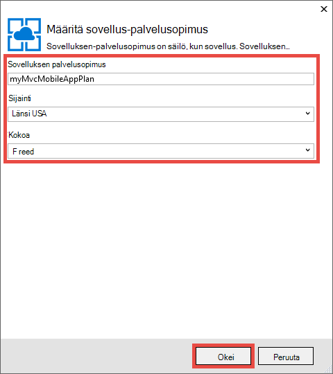
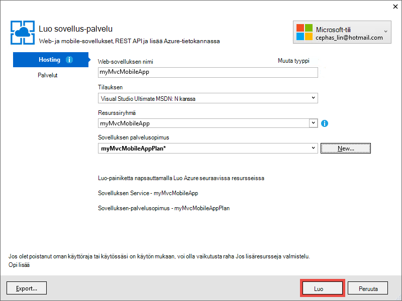

<properties 
    pageTitle="Ota käyttöön ASP.NET MVC 5 mobile web-sovellus App Azure-palvelussa" 
    description="Opetusohjelma, avulla opit web-sovelluksen käyttöönotto Azure-sovelluksen palveluun mobile-ominaisuuksien käyttäminen ASP.NET MVC 5 verkkosovellus." 
    services="app-service" 
    documentationCenter=".net" 
    authors="cephalin" 
    manager="wpickett" 
    editor="jimbe"/>

<tags 
    ms.service="app-service" 
    ms.workload="na" 
    ms.tgt_pltfrm="na" 
    ms.devlang="dotnet" 
    ms.topic="article" 
    ms.date="01/12/2016" 
    ms.author="cephalin;riande"/>

# Ota käyttöön ASP.NET MVC 5 mobile web-sovellus App Azure-palvelussa

Tässä opetusohjelmassa opeta kehittää ASP.NET MVC 5-web-sovelluksen, joka on mobile soveltuvia ja ottaa käyttöön sovelluksen Azure-palvelu perusteet. Tässä opetusohjelmassa, sinun on [Visual Studio Express 2013 Web] [ Visual Studio Express 2013] tai Visual Studiossa, jos sinulla on jo, professional edition. Voit käyttää [Visual Studio 2015] , mutta näyttökuvien ole eri ja sinun on käytettävä ASP.NET 4.x malleja.

[AZURE.INCLUDE [create-account-and-websites-note](../../includes/create-account-and-websites-note.md)]

## Mikä luominen

Tässä opetusohjelmassa, lisätä yksinkertaisen kokouksen luettelo-sovellus, jossa on annettu [starter projektin]mobile-ominaisuuksien[StarterProject]. Seuraavassa näyttökuvassa näkyy ASP.NET-istunnot valmiit-sovelluksessa, selaimen emulaattori Internet Explorer 11 F12 Kehitystyökalut-komento.

![][FixedSessionsByTag]

Voit käyttää Internet Explorer 11 F12-Kehitystyökalut ja [Fiddler työkalun] [ Fiddler] virheenkorjaus sovelluksen avulla. 

## Opit taidot

Näin opit:

-   Opi käyttämään Visual Studio 2013 julkaisemaan Azure App palvelun web-sovelluksen suoraan web App-sovelluksen avulla.
-   Miten ASP.NET MVC 5-mallien käyttää CSS: N automaattinen framework parantaa näytön mobiililaitteissa
-   Mobiili-kohtaisia näkymien kohdentamisen tietyn mobiiliselaimet, kuten iPhone- ja Android luominen
-   Voit luoda vastaa näkymiä (näkymät, joka vastaa eri selaimissa kaikissa laitteissa)

## Määritä kehitysympäristö

Määrittäminen oman kehitysympäristö asentamalla Azure SDK .NET 2.5.1 tai uudempi versio. 

1. Voit asentaa Azure SDK .NET-napsauttamalla seuraavaa linkkiä. Jos sinulla ei ole vielä asennettu Visual Studio-2013, se asennetaan linkin. Tässä opetusohjelmassa edellyttää Visual Studio 2013. [Azure Visual Studio 2013: n SDK][AzureSDKVs2013]
1. Web-ympäristö Installer-ikkunassa valitsemalla **Asenna** ja jatkaa asennusta.

Sinun on myös mobiiliselaimen emulaattorin. Toimii seuraavasti:

-   Selaimen emulaattorin [Internet Explorer 11 F12 Kehitystyökalut] -[ EmulatorIE11] (käytetään kaikissa mobiiliselaimen näyttökuvat). Siinä on käyttäjän agentti merkkijonon Esiasetukset Windows Phone 8, Windows Phone 7 tai Apple iPad-sovelluksessa.
-   [DevTools Google Chrome]-selainta emulaattorin[EmulatorChrome]. Se sisältää monia Android-laitteissa sekä Apple iPhone, Apple iPad ja Amazon Kindle Fireen esiasetuksia. Toimii samalla myös touch tapahtumat.
-   [Opera Mobile emulaattorin][EmulatorOpera]

Visual Studio projektien C\# lähdekoodin ovat käytettävissä tämän ohjeaiheen mukana:

-   [Starter projektin lataaminen][StarterProject]
-   [Valmis projektin lataaminen][CompletedProject]

##Ota käyttöön starter-projekti Azure web app-sovelluksessa

1.  Lataa kokouksen luettelon sovelluksen [starter projektin][StarterProject].

2.  Valitse Resurssienhallinnassa ladatut ZIP-tiedostoa hiiren kakkospainikkeella ja valitse *Ominaisuudet*.

3.  Valitse **Ominaisuudet** -valintaikkunassa **Salli** -painiketta. (Eston estää suojausvaroitus, joka seuraa, kun yrität käyttää *.zip* -tiedosto, jotka olet ladannut verkosta.)

4.  ZIP-tiedostoa hiiren kakkospainikkeella ja valitsemalla **Pura kaikki** unzip tiedosto. 

5.  Avaa Visual Studion *C#\Mvc5Mobile.sln* -tiedosto.

6.  Napsauta ratkaisunhallinnassa projektin hiiren kakkospainikkeella ja valitse **Julkaise**.

    ![][DeployClickPublish]

7.  Valitse Julkaise Web **Microsoft Azure App palvelua**.

    ![][DeployClickWebSites]

8.  Jos et ole jo kirjautunut Azure, valitse **Lisää tili**.

    ![][DeploySignIn]

9.  Noudata kehotteita kirjautuaksesi sisään Azure-tiliin.

11. Sovelluksen palvelu-valintaikkunan pitäisi nyt näkyä olet kirjautunut sisään, kun. Valitse **Uusi**.

    ![][DeployNewWebsite]  

12. Määritä yksilöllisen sovelluksen etuliite **Web-sovelluksen nimi** -kenttään. Täydellinen web-sovelluksen nimi on * &lt;etuliite >*. azurewebsites.net. Lisäksi tai määritä uusi nimi resurssille ryhmän **resurssiryhmä**. Valitse **Uusi** , Luo uusi sovelluksen palvelun suunnitelma.

    ![][DeploySiteSettings]

13. Määritä uusi sovellus-palvelusopimus ja valitse **OK**. 

    

13. Luo sovelluksen palvelu-valintaikkunasta takaisin sisään valitsemalla **Luo**.

     

13. Jälkeen Azure resursseja on luotu, julkaista verkossa valintaikkunan täyttyy asetusten uusi sovellus. Valitse **Julkaise**.

    ![][DeployPublishSite]

    Visual Studio on tehty starter projektin julkaiseminen Azure web Appissa, kun työpöydän selain avautuu näkymään live web Appissa.

14. Käynnistä mobiiliselaimen emulaattorin, kokous-sovelluksen URL-Osoitteen kopioiminen (*<prefix>*. azurewebsites.net) emulaattori, kyselyjä ja oikeassa-painiketta ja valitse **Selaa tunnisteen mukaan**. Jos käytössäsi on Internet Explorer 11 oletusselaimeksi vain tarvitse kirjoittaa `F12`, valitse `Ctrl+8`, ja muuta sitten selaimen profiilin **Windows Phone**. Alla olevassa kuvassa näkyy *AllTags* näkymän pysty-tilassa (siirtymätehosteeseen **Selaa tunnisteen mukaan**).

    ![][AllTags]

>[AZURE.TIP] Kun korjaat Visual Studion-sovelluksen MVC 5, voit julkaista koodiin Azure uudelleen ja varmista, että suoraan mobiililaitteen selain tai selaimen emulaattorin live web-sovelluksen.

Näyttö on hyvin luettavissa mobiililaitteella. Voit myös jo tarkastella jotkin automaattinen CSS-framework käyttää visuaalisia tehosteita.
Napsauta **ASP.NET** -linkkiä.

![][SessionsByTagASP.NET]

ASP.NET-tunniste Näytä on Zoomaus varustettu näyttö, jossa Automaattinen tekee automaattisesti puolestasi. Voit parantaa kuitenkin vastaamaan paremmin mobiiliselaimessa tässä näkymässä. Esimerkiksi **päivämääräsarakkeen** on vaikea lukea. Opetusohjelman-myöhemmin muutat, jotta se mobile soveltuvia *AllTags* -näkymä.

##Automaattisen käynnistyksen CSS Framework

Uusi MVC 5 malli on käynnistyksen tukee. On jo nähdä, miten se heti parantaa sovelluksen eri näkymiä. Siirtymispalkin yläreunassa on esimerkiksi tiivistettävä automaattisesti, kun selain leveys on pienempi. Työpöydän selaimesta yritä selaimen ikkunan kokoa ja näet, miten siirtymispalkissa muuttaa sen ulkoasua ja teemaa. Tämä on vastaa web-rakenne, joka on rakennettu automaattinen.

Jos haluat nähdä, miltä Web-sovelluksen näyttää ilman automaattinen, Avaa *sovelluksen\_Käynnistä\\BundleConfig.cs* ja rivit, jotka sisältävät *bootstrap.js* ja *bootstrap.css*kommentti. Seuraava koodi näkyy kaksi lauseita, `RegisterBundles` menetelmä muutoksen jälkeen:

     bundles.Add(new ScriptBundle("~/bundles/bootstrap").Include(
              //"~/Scripts/bootstrap.js",
              "~/Scripts/respond.js"));

    bundles.Add(new StyleBundle("~/Content/css").Include(
              //"~/Content/bootstrap.css",
              "~/Content/site.css"));

Paina `Ctrl+F5` sovelluksen käyttämiseen.

Noudata tiivistettävä siirtymispalkissa on nyt vain tavallisen Järjestämätön luettelo. Valitse **Selaa tunnisteen mukaan** ja valitse sitten **ASP.NET**.
Mobiili emulaattorin-näkymässä näet nyt, kun se ei ole enää Zoomaus varustettu näyttöä ja on Vieritä sivuttain näkyviin taulukon oikealle puolelle.

![][SessionsByTagASP.NETNoBootstrap]

Kumoa tekemäsi muutokset ja Päivitä mobiiliselaimessa voit varmistaa, että mobile soveltuvia näyttö on palautettu.

Automaattinen ei koske ASP.NET MVC 5 ja voit hyödyntää näistä toiminnoista missä tahansa web-sovelluksessa. Mutta se on nyt valmiina ASP.NET MVC 5-projektimalli niin, että MVC 5 Web-sovelluksen voit hyödyntää automaattinen oletusarvoisesti.

Lisätietoja automaattinen Siirry [Automaattinen] [ BootstrapSite] sivuston.

Seuraavassa osassa näet miten mobile selaimen tietyn näkymiä.

##Ohita näkymiä, rakenteista ja osittainen näkymät

Voit ohittaa missä tahansa näkymässä (mukaan lukien asettelut ja osittainen näkymät) mobiiliselaimet yleensä yksittäisiä mobiiliselaimen tai tietyn kaikissa selaimissa. Antamaan mobile-näkymän näkymä tiedoston kopioiminen ja lisätä *. Mobile* tiedoston nimeksi. Esimerkiksi luoda *hakemiston* mobiilinäkymässä, voit kopioida *näkymien\\Home\\Index.cshtml* , *näkymien\\Home\\Index.Mobile.cshtml*.

Tässä osassa Luo mobile kielikohtaiset asettelutiedosto.

Alkavan, kopioi *näkymien\\jaettu\\\_Layout.cshtml* , *näkymien\\jaettu\\\_Layout.Mobile.cshtml*. Avaa * \_Layout.Mobile.cshtml* ja otsikon muuttaminen **MVC5** sovelluksesta **MVC5 sovelluksen (Matkapuhelin)**.

Kussakin `Html.ActionLink` Soita siirtymispalkin, poista "Selaamalla" kunkin *ActionLink*-linkkiä. Seuraava koodi esittää valmis `<ul class="nav navbar-nav">` tunnisteen tiedoston asettelu mobiililaitteille.

    <ul class="nav navbar-nav">
        <li>@Html.ActionLink("Home", "Index", "Home")</li>
        <li>@Html.ActionLink("Date", "AllDates", "Home")</li>
        <li>@Html.ActionLink("Speaker", "AllSpeakers", "Home")</li>
        <li>@Html.ActionLink("Tag", "AllTags", "Home")</li>
    </ul>

Kopioi *näkymien\\Home\\AllTags.cshtml* tiedoston *näkymien\\Home\\AllTags.Mobile.cshtml*. Avaa uusi tiedosto ja muuta `<h2>` "Tunnisteet", "tunnisteet (M)-osan:

    <h2>Tags (M)</h2>

Siirry tunnisteet-sivulle, työpöydän selaimessa ja mobiiliselaimen emulaattorin avulla. Mobiiliselaimen emulaattori näkyy kaksi tekemäsi muutokset (otsikko * \_Layout.Mobile.cshtml* ja *AllTags.Mobile.cshtml*otsikko).

![][AllTagsMobile_LayoutMobile]

Sen sijaan työpöydän näytön ei ole muutettu (jossa on otsikot * \_Layout.cshtml* ja *AllTags.cshtml*).

![][AllTagsMobile_LayoutMobileDesktop]

##Selaimen kielikohtaiset näkymien luominen

Lisäksi mobile kielikohtaiset ja työpöydän kielikohtaiset näkymiä voit luoda yksittäisen selaimen näkymiä. Voit esimerkiksi luoda näkymiä, jotka ovat erikseen iPhone- tai Android-selain. Tässä osassa Luo iPhone selaimessa ja iPhone-version *AllTags* näkymän asettelu.

Avaa *Global.asax* -tiedosto ja lisää seuraava koodi alareunaan `Application_Start` menetelmää.

    DisplayModeProvider.Instance.Modes.Insert(0, new DefaultDisplayMode("iPhone")
    {
        ContextCondition = (context => context.GetOverriddenUserAgent().IndexOf
            ("iPhone", StringComparison.OrdinalIgnoreCase) >= 0)
    });

Koodi määrittää uuden näyttötila nimeltä "iPhone-, joka vastaa saapuviin sivupyynnön vastaan. Jos saapuvan pyynnön vastaa ehtoa, määrittämäsi (toisin sanoen jos käyttäjäagentin sisältää merkkijonon "iPhone"), ASP.NET MVC etsii näkymiä, joiden nimessä on "iPhone" liitteen.

>[AZURE.NOTE] Lisättäessä kannettavan selaimen kielikohtaiset näytön tilassa esimerkiksi iPhone- ja Android-muista ensimmäisen argumentin arvoksi `0` (Lisää luettelon yläosassa), varmista, että selain kielikohtaiset tila on nähden mobile malli (*. Mobile.cshtml). Jos mobiilisovelluksen malli on luettelon yläosassa sen sijaan, se on valittuna (ensimmäinen vastine wins- ja mobile mallin vastaa kaikkia mobiiliselaimet) tarkoitettu näyttötilan päälle. 

Koodin, napsauta hiiren kakkospainikkeella `DefaultDisplayMode`, valitse **Ratkaise**ja valitse sitten `using System.Web.WebPages;`. Tämä lisää viittaus `System.Web.WebPages` nimitilan, joka on where `DisplayModeProvider` ja `DefaultDisplayMode` on määritetty.

![][ResolveDefaultDisplayMode]

Voit myös lisätä vain manuaalisesti, seuraava rivi `using` tiedoston kohtaan.

    using System.Web.WebPages;

Tallenna muutokset. Kopioi *näkymien\\jaettu\\\_Layout.Mobile.cshtml* tiedoston *näkymiä\\jaettu\\\_Layout.iPhone.cshtml*. Avaa uusi tiedosto ja muuta sitten otsikko `MVC5 Application (Mobile)` , `MVC5 Application (iPhone)`.

Kopioi *näkymien\\Home\\AllTags.Mobile.cshtml* tiedoston *näkymien\\Home\\AllTags.iPhone.cshtml*. Muuta uuden tiedoston `<h2>` "Tunnisteet (iPhone)"-"tunnisteet (M)-osa.

Suorita sovellus. Suorita mobiiliselaimen emulaattorin, varmista, että sen käyttäjäagentti on määritetty "iPhone- ja Etsi *AllTags* -näkymä. Jos käytät Internet Explorer 11 F12 Kehitystyökalut emulaattori, määrittää emulointia seuraavasti:

-   Selaimen profiilin = **Windows Phone**
-   Käyttäjäagentin merkkijonon = **Mukautettu**
-   Mukautettu merkkijono = **Apple-iPhone5C1/1001.525**

Seuraavassa näyttökuvassa näkyy *AllTags* näkymän palautui Internet Explorer 11 F12 Kehitystyökalut kanssa mukautettuja käyttäjäagenttimerkkijonon emulaattori (tämä on iPhone 5 C käyttäjäagentin merkkijonon).

![][AllTagsIPhone_LayoutIPhone]

Mobiiliselaimessa Valitse **kaiuttimet** -linkki. Mobiilinäkymä (*AllSpeakers.Mobile.cshtml*) ei ole, kaiuttimet oletusnäkymä (*AllSpeakers.cshtml*) muodostetaan mobile asettelunäkymän avulla (*\_Layout.Mobile.cshtml*). Katso alla otsikko **MVC5 sovelluksen (Matkapuhelin)** on määritetty * \_Layout.Mobile.cshtml*.

![][AllSpeakers_LayoutMobile]

Voit yleisesti poistaminen käytöstä (ei-sähköistä) oletusnäkymä-värien sisällä asettelu mobiililaitteille määrittämällä `RequireConsistentDisplayMode` , `true` - *näkymien\\\_ViewStart.cshtml* tiedoston seuraavasti:

    @{
        Layout = "~/Views/Shared/_Layout.cshtml";
        DisplayModeProvider.Instance.RequireConsistentDisplayMode = true;
    }

Kun `RequireConsistentDisplayMode` on määritetty `true`, asettelu mobiililaitteille (*\_Layout.Mobile.cshtml*) käytetään vain mobiilinäkymien (eli, kun Näkymätiedosto on lomakkeen * **ViewName**. Mobile.cshtml*). Haluat ehkä määrittää `RequireConsistentDisplayMode` , `true` Jos mobile asettelu ei toimi hyvin ei-sähköistä näkymien kanssa. Seuraavassa näyttökuvassa näkyy tapaa *kaiuttimet* -sivulla näkyy kun `RequireConsistentDisplayMode` on määritetty `true` (ilman merkkijonon "(Matkapuhelin)" siirtymis yläpalkissa).

![][AllSpeakers_LayoutMobileOverridden]

Voit poistaa käytöstä tietyn yhdenmukaisia näyttötila määrittämällä `RequireConsistentDisplayMode` , `false` view-tiedostossa. Seuraavat merkinnät-vaihtoehto *näkymien\\Home\\AllSpeakers.cshtml* tiedoston joukot `RequireConsistentDisplayMode` , `false`:

    @model IEnumerable<string>

    @{
        ViewBag.Title = "All speakers";
        DisplayModeProvider.Instance.RequireConsistentDisplayMode = false;
    }

Tässä osassa on on katsomista mobile asettelut ja näkymien luomisesta ja niiden asettelut ja määrättyjä laitteita, kuten iPhonen näkymien luominen.
Automaattinen CSS-framework tärkein etu on kuitenkin vastaa asettelua, mikä tarkoittaa, että yhden stylesheet voi suojata työpöytä, puhelinnumero ja tablet selaimet yhdenmukaisen ulkoasun luomiseen. Seuraavassa osassa näet miten voit hyödyntää automaattinen mobile soveltuvia näkymien luomiseen.

##Paranna kaiuttimet-luettelo

Näkemäsi vain, kun *kaiuttimet* näkymä ei voi lukea, mutta linkit ovat pieniä ja on vaikea napauttamalla mobiililaitteella. Tässä osassa teet *AllSpeakers* näkymän mobile soveltuvia, suuri, helposti napauttamalla linkkejä ja sisältää hakuruutuun, voit etsiä nopeasti kaiuttimet.

Voit käynnistyksen [linkitetyn luettelon ryhmän][] muotoilijat *kaiuttimet* näkymän parantamiseksi. Valitse *näkymiä\\Home\\AllSpeakers.cshtml*, korvaa Razor-tiedoston sisällön alla olevan koodin.

     @model IEnumerable<string>

    @{
        ViewBag.Title = "All Speakers";
    }

    <h2>Speakers</h2>

    

        @foreach (var speaker in Model)
        {
            @Html.ActionLink(speaker, "SessionsBySpeaker", new { speaker }, new { @class = "list-group-item" })
        }
    

`class="list-group"` Määritteen `
` tunnisteen koskee käynnistyksen luettelo-tyylejä ja `class="input-group-item"` määrite koskee käynnistyksen luettelokohteen tyylejä kunkin linkin.

Päivitä mobiiliselaimessa. Päivitetty näkymä näyttää seuraavanlaiselta:

![][AllSpeakersFixed]

Automaattisen käynnistyksen [linkitetyn luettelon ryhmän][] tyylejä on koko ruutuun kunkin linkin napsautettava, joka on saman paljon paremman käyttökokemuksen. Siirry työpöytä-näkymään ja noudata yhdenmukaisen ulkoasun ja ilmeen.

![][AllSpeakersFixedDesktop]

Vaikka mobiiliselaimen näkymä on entistä sujuvampaa on vaikeaa siirtyä kaiuttimet pitkästä luettelosta. Automaattinen ei voi luoda Etsi suodattimen toimintoja ulos,-valmiilla, mutta voi lisätä muutamalla koodin rivit. Ensin hakukenttä lisääminen näkymään ja valitse suodatin-funktion JavaScript-koodia liitetään. - *Näkymien\\Home\\AllSpeakers.cshtml*, lisätä \<lomakkeen\> merkitseminen vain sen jälkeen, kun \<h2\> tunnisteen alla kuvatulla tavalla:

    @model IEnumerable<string>

    @{
        ViewBag.Title = "All Speakers";
    }

    <h2>Speakers</h2>

    <form class="input-group">
        
        <input type="text" class="form-control" placeholder="Search speaker">
    </form>
     
    

        @foreach (var speaker in Model)
        {
            @Html.ActionLink(speaker, 
                             "SessionsBySpeaker", 
                             new { speaker }, 
                             new { @class = "list-group-item" })
        }
    

Huomaa, `<form>` ja `<input>` tunnisteet molemmat on käytetty käynnistyksen tyylejä. `` Elementin Lisää käynnistyksen [glyphicon][] Etsi-ruutuun.

Lisää JavaScript-tiedosto nimeltä *filter.js* *komentosarjat* -kansio. Avaa tiedosto ja liitä se seuraava koodi:

    $(function () {

        // reset the search form when the page loads
        $("form").each(function () {
            this.reset();
        });

        // wire up the events to the <input> element for search/filter
        $("input").bind("keyup change", function () {
            var searchtxt = this.value.toLowerCase();
            var items = $(".list-group-item");

            // show all speakers that begin with the typed text and hide others
            for (var i = 0; i < items.length; i++) {
                var val = items[i].text.toLowerCase();
                val = val.substring(0, searchtxt.length);
                if (val == searchtxt) {
                    $(items[i]).show();
                }
                else {
                    $(items[i]).hide();
                }
            }
        });
    });

Haluat myös filter.js sisällyttäminen rekisteröity nippujen. Avaa *sovelluksen\_Käynnistä\\BundleConfig.cs* ja muuta ensimmäisen nippujen. Muuta ensimmäisen `bundles.Add` (n **jquery** -pikaoppaista) sisältämään *komentosarjojen\\filter.js*seuraavasti:

     bundles.Add(new ScriptBundle("~/bundles/jquery").Include(
                "~/Scripts/jquery-{version}.js",
                "~/Scripts/filter.js"));

**Jquery** -pikaoppaista on jo muunnettu oletusarvoisesti * \_asettelun* näkymä. Myöhemmin voit käyttää samaa JavaScript-koodia suodatin-toiminto koskee muut näkymät.

Päivitä mobiiliselaimessa ja siirtyy *AllSpeakers* -näkymään. Kirjoita hakukenttään "sc". Kaiuttimet luettelon suodatettava etsintämerkkijonon mukaan.

![][AllSpeakersFixedSearchBySC]

##Paranna tunnisteet-luettelo

*Kaiuttimet* -näkymä, kuten *tunnisteita* näkymä ei voi lukea, mutta linkit ovat pieniä ja vaikea napauttamalla mobiililaitteella. Voit korjata *tunnisteet* näkymää samalla tavalla kuin korjaat *kaiuttimet* -näkymä, jos käytät edempänä koodin muuttuu, mutta seuraavaan `Html.ActionLink` menetelmä syntaksi *näkymiä\\Home\\AllTags.cshtml*:

    @Html.ActionLink(tag, 
                     "SessionsByTag", 
                     new { tag }, 
                     new { @class = "list-group-item" })

Päivitetyt työpöytäselain näyttää seuraavasti:

![][AllTagsFixedDesktop]

Ja päivitetyt mobiiliselaimessa näyttää seuraavasti: 

![][AllTagsFixed]

>[AZURE.NOTE] Jos huomaat, että alkuperäisen luettelomuotoilu on edelleen olemassa mobiiliselaimessa ja ihmetellä, mitä on tapahtunut oman nice käynnistyksen tyylejä, tämä on aiemmissa toiminnon luominen tiettyyn mobiilinäkymien Palvelutietojen. Nyt, kun käytät automaattinen CSS-framework vastaa web ratkaisut, siirry head ja poista näiden mobile kielikohtaiset ja mobile-kohtaisia asettelunäkymiä. Kun olet tehnyt, päivitetyt mobiiliselaimessa näkyy käynnistyksen tyylejä.

##Paranna päivämäärät-luettelo

Voit parantaa *päivämäärät* näkymän esimerkiksi *kaiuttimien* ja *tunnisteet* -näkymien entistä parempi, jos käytät edempänä koodin muuttuu, mutta seuraavaan `Html.ActionLink` menetelmä syntaksin *näkymien\\Home\\AllDates.cshtml*:

    @Html.ActionLink(date.ToString("ddd, MMM dd, h:mm tt"), 
                     "SessionsByDate", 
                     new { date }, 
                     new { @class = "list-group-item" })

Näkyviin tulee päivitetyt mobiiliselainnäkymän tältä:

![][AllDatesFixed]

Voit parantaa *päivämäärät* näkymän järjestämällä päivämäärä / aika-arvot päivämäärän mukaan. Tämä voidaan toteuttaa ja automaattisen käynnistyksen [paneelit][] tyylejä. Korvaa sisältö *näkymien\\Home\\AllDates.cshtml* tiedosto seuraava koodi:

    @model IEnumerable<DateTime>

    @{
        ViewBag.Title = "All Dates";
    }

    <h2>Dates</h2>

    @foreach (var dategroup in Model.GroupBy(x=>x.Date))
    {
        

            

                @dategroup.Key.ToString("ddd, MMM dd")
            

            

                @foreach (var date in dategroup)
                {
                    @Html.ActionLink(date.ToString("h:mm tt"), 
                                     "SessionsByDate", 
                                     new { date }, 
                                     new { @class = "list-group-item" })
                }
            

        

    }

Tämä koodi luo erillinen `
` tunniste kunkin distinct-luettelosta päivämäärän ja käyttää [linkitetyn luettelon ryhmän][] vastaaviin linkkien kuin aiemmin. Näin mobiiliselaimessa näyttää seuraavalta kun koodi suoritetaan:

![][AllDatesFixed2]

Vaihda työpöydän selaimeen. Huomaa kuitenkin yhtenäisen ulkoasun.

![][AllDatesFixed2Desktop]

##Paranna SessionsTable-näkymä

Tässä osassa Tee *SessionsTable* näkymää lisää mobile soveltuvia. Tämä muutos on laajemmat aikaisemmat muutokset.

Mobiiliselaimessa, napauta **tunniste** -painiketta ja kirjoita sitten `asp` hakuruutuun.

![][AllTagsFixedSearchByASP]

Napauta **ASP.NET** -linkkiä.

![][SessionsTableTagASP.NET]

Kuten näet, näytön muotoillaan taulukoksi, joka on tällä hetkellä suunniteltu voi tarkastella työpöydän selaimessa. On kuitenkin hieman vaikea lukea mobile selaimesta. Voit korjata ongelman Avaa *näkymien\\Home\\SessionsTable.cshtml* ja korvaa-tiedoston sisällön seuraava koodi:

    @model IEnumerable<Mvc5Mobile.Models.Session>

    <h2>@ViewBag.Title</h2>

    

        

            @foreach (var session in Model)
            {
                

                    

                        @Html.ActionLink(session.Title, 
                                         "SessionByCode", 
                                         new { session.Code }, 
                                         new { @class="list-group-item active" })
                        

                            

                                @Html.Partial("_SpeakersLinks", session)
                            

                            

                                @session.DateText
                            

                            

                                @Html.Partial("_TagsLinks", session)
                            

                        

                    

                

            }
        

    

Koodin tekee 3 asioita:

-   muotoilee käynnistyksen [mukautetun linkitetyn luettelon ryhmän][] istunnon tiedot pystysuunnassa niin, että nämä tiedot ovat järkevä mobile selaimessa (kuten luettelo-ryhmä-kohteen-teksti-luokkien avulla)
-   koskee [ruudukon järjestelmän][] asettelua niin, että istunnon kohteet flow vaakasuunnassa työpöydän selaimessa ja pystysuunnassa mobiiliselaimessa (sarake-md-4-luokan avulla)
-   [vastaa apuohjelmien][] avulla voit piilottaa istunnon tunnisteet tarkasteltaessa mobiiliselaimessa (piilotettu xs-luokan avulla)

Voit myös napauttamalla Go to vastaavat istunnon linkin otsikko. Alla olevassa kuvassa näkyy koodin muuttuu.

![][FixedSessionsByTag]

Automaattisen käynnistyksen ruudukko-järjestelmään, jotka olet lisännyt automaattisesti järjestää istunnot pystysuuntaisesta mobiiliselaimessa. Huomaa myös, että tunnisteet eivät näy. Vaihda työpöydän selaimeen.

![][SessionsTableFixedTagASP.NETDesktop]

Huomaa, että tunnisteet näkyvät nyt työpöydän selaimessa. Myös näet, että olet lisännyt automaattisen käynnistyksen ruudukon järjestelmän järjestää istunnon kohteita kahden sarakkeen. Jos voit suurentaa selaimessa, näet, että järjestelyn vaihtuu kolmeen sarakkeeseen.

##Paranna SessionByCode-näkymä

Lopuksi korjaaminen, jotta se mobile soveltuvia *SessionByCode* -näkymä.

Mobiiliselaimessa, napauta **tunniste** -painiketta ja kirjoita sitten `asp` hakuruutuun.

![][AllTagsFixedSearchByASP]

Napauta **ASP.NET** -linkkiä. ASP.NET-tunnisteen istunnot tulevat näkyviin.

![][FixedSessionsByTag]

Valitse **yksi sivu-sovelluksen ASP.NET ja AngularJS rakentaminen** -linkki.

![][SessionByCode3-644]

Työpöydän oletusnäkymä on Hieno, mutta voit parantaa ulkoasun helposti käyttämällä automaattinen Graafisen joitakin osia.

Avaa *näkymien\\Home\\SessionByCode.cshtml* ja korvata sisällön seuraavat merkinnät:

    @model Mvc5Mobile.Models.Session

    @{
        ViewBag.Title = "Session details";
    }
    <h3>@Model.Title (@Model.Code)</h3>
    

        <strong>@Model.DateText</strong> in <strong>@Model.Room</strong>
    

    

        

            Speakers
        

        @foreach (var speaker in Model.Speakers)
        {
            @Html.ActionLink(speaker, 
                             "SessionsBySpeaker", 
                             new { speaker }, 
                             new { @class="panel-body" })
        }
    

    
@Model.Abstract

    

        

            Tags
        

        @foreach (var tag in Model.Tags)
        {
            @Html.ActionLink(tag, 
                             "SessionsByTag", 
                             new { tag }, 
                             new { @class = "panel-body" })
        }
    

Uusi merkintä käyttää käynnistyksen paneelit muotoilijat parantamiseksi Mobiilinäkymä. 

Päivitä mobiiliselaimessa. Seuraavassa kuvassa näkyy vain tekemäsi koodin muutokset:

![][SessionByCodeFixed3-644]

## Rivitä ja tarkistaminen

Tässä opetusohjelmassa on osoittanut käyttämisestä ASP.NET MVC 5 mobile soveltuvia Web-sovellusten kehittämiseen. Näitä ovat:

-   ASP.NET MVC 5-sovelluksen sovelluksen web App-palvelun ottaminen käyttöön
-   Automaattinen avulla voit luoda MVC 5-sovelluksessa vastaa WWW-asettelu
-   Ohita asettelu, näkymien ja osittainen näkymiä, yleisesti sekä yksittäisten näkymän
-   Ohjausobjektin asettelun ja osittainen ohittaa käyttäminen avulla `RequireConsistentDisplayMode` ominaisuus
-   Luoda näkymiä, joka kohdistaa selaimet, kuten iPhone-selaimessa
-   Käytä käynnistyksen tyylejä Razor koodissa

## Katso myös

-   [9 perusperiaatteet vastaa web-rakenne](http://blog.froont.com/9-basic-principles-of-responsive-web-design/)
-   [Automaattinen][BootstrapSite]
-   [Virallinen käynnistyksen blogi][]
-   [Twitter käynnistyksen opetusohjelman opetusohjelma tasavalta][]
-   [Automaattisen käynnistyksen leikkikenttä][]
-   [W3C suositus Mobile Web Application parhaat käytännöt][]
-   [W3C Candidate suositus media-kyselyissä][]

## Mikä on muuttunut
* Katso muutoksen opas verkkosivuilta App palveluun: [Azure App palvelu ja sen vaikutus aiemmin Azure-palvelut](http://go.microsoft.com/fwlink/?LinkId=529714)

<!-- Internal Links -->
[Deploy the starter project to an Azure web app]: #bkmk_DeployStarterProject
[Bootstrap CSS Framework]: #bkmk_bootstrap
[Override the Views, Layouts, and Partial Views]: #bkmk_overrideviews
[Create Browser-Specific Views]:#bkmk_browserviews
[Improve the Speakers List]: #bkmk_Improvespeakerslist
[Improve the Tags List]: #bkmk_improvetags
[Improve the Dates List]: #bkmk_improvedates
[Improve the SessionsTable View]: #bkmk_improvesessionstable
[Improve the SessionByCode View]: #bkmk_improvesessionbycode

<!-- External Links -->
[Visual Studio Express 2013]: http://www.visualstudio.com/downloads/download-visual-studio-vs#d-express-web
[Visual Studio 2015]: https://www.visualstudio.com/downloads/download-visual-studio-vs
[AzureSDKVs2013]: http://go.microsoft.com/fwlink/p/?linkid=323510&clcid=0x409
[Fiddler]: http://www.fiddler2.com/fiddler2/
[EmulatorIE11]: http://msdn.microsoft.com/library/ie/dn255001.aspx
[EmulatorChrome]: https://developers.google.com/chrome-developer-tools/docs/mobile-emulation
[EmulatorOpera]: http://www.opera.com/developer/tools/mobile/
[StarterProject]: http://go.microsoft.com/fwlink/?LinkID=398780&clcid=0x409
[CompletedProject]: http://go.microsoft.com/fwlink/?LinkID=398781&clcid=0x409
[BootstrapSite]: http://getbootstrap.com/
[WebPIAzureSdk23NetVS13]: ./media/web-sites-dotnet-deploy-aspnet-mvc-mobile-app/WebPIAzureSdk23NetVS13.png
[linkitetty luettelo-ryhmä]: http://getbootstrap.com/components/#list-group-linked
[glyphicon]: http://getbootstrap.com/components/#glyphicons
[paneelit]: http://getbootstrap.com/components/#panels
[mukautetun linkitetyn luettelon-ryhmä]: http://getbootstrap.com/components/#list-group-custom-content
[ruudukon järjestelmän]: http://getbootstrap.com/css/#grid
[vastaa apuohjelmat]: http://getbootstrap.com/css/#responsive-utilities
[Virallinen käynnistyksen blogi]: http://blog.getbootstrap.com/
[Twitter käynnistyksen opetusohjelman opetusohjelma tasavalta]: http://www.tutorialrepublic.com/twitter-bootstrap-tutorial/
[Automaattisen käynnistyksen leikkikenttä]: http://www.bootply.com/
[W3C suositus Mobile Web Application parhaat käytännöt]: http://www.w3.org/TR/mwabp/
[W3C Candidate suositus media-kyselyissä]: http://www.w3.org/TR/css3-mediaqueries/

<!-- Images -->
[DeployClickPublish]: ./media/web-sites-dotnet-deploy-aspnet-mvc-mobile-app/deploy-to-azure-website-1.png
[DeployClickWebSites]: ./media/web-sites-dotnet-deploy-aspnet-mvc-mobile-app/deploy-to-azure-website-2.png
[DeploySignIn]: ./media/web-sites-dotnet-deploy-aspnet-mvc-mobile-app/deploy-to-azure-website-3.png
[DeployUsername]: ./media/web-sites-dotnet-deploy-aspnet-mvc-mobile-app/deploy-to-azure-website-4.png
[DeployPassword]: ./media/web-sites-dotnet-deploy-aspnet-mvc-mobile-app/deploy-to-azure-website-5.png
[DeployNewWebsite]: ./media/web-sites-dotnet-deploy-aspnet-mvc-mobile-app/deploy-to-azure-website-6.png
[DeploySiteSettings]: ./media/web-sites-dotnet-deploy-aspnet-mvc-mobile-app/deploy-to-azure-website-7.png
[DeployPublishSite]: ./media/web-sites-dotnet-deploy-aspnet-mvc-mobile-app/deploy-to-azure-website-8.png
[MobileHomePage]: ./media/web-sites-dotnet-deploy-aspnet-mvc-mobile-app/mobile-home-page.png
[FixedSessionsByTag]: ./media/web-sites-dotnet-deploy-aspnet-mvc-mobile-app/SessionsByTag-ASP.NET-Fixed.png
[AllTags]: ./media/web-sites-dotnet-deploy-aspnet-mvc-mobile-app/AllTags.png
[SessionsByTagASP.NET]: ./media/web-sites-dotnet-deploy-aspnet-mvc-mobile-app/SessionsByTag-ASP.NET.png
[SessionsByTagASP.NETNoBootstrap]: ./media/web-sites-dotnet-deploy-aspnet-mvc-mobile-app/SessionsByTag-ASP.NET-NoBootstrap.png
[AllTagsMobile_LayoutMobile]: ./media/web-sites-dotnet-deploy-aspnet-mvc-mobile-app/AllTagsMobile-_LayoutMobile.png
[AllTagsMobile_LayoutMobileDesktop]: ./media/web-sites-dotnet-deploy-aspnet-mvc-mobile-app/AllTagsMobile-_LayoutMobile-Desktop.png
[ResolveDefaultDisplayMode]: ./media/web-sites-dotnet-deploy-aspnet-mvc-mobile-app/Resolve-DefaultDisplayMode.png
[AllTagsIPhone_LayoutIPhone]: ./media/web-sites-dotnet-deploy-aspnet-mvc-mobile-app/AllTagsIPhone-_LayoutIPhone.png
[AllSpeakers_LayoutMobile]: ./media/web-sites-dotnet-deploy-aspnet-mvc-mobile-app/AllSpeakers-_LayoutMobile.png
[AllSpeakers_LayoutMobileOverridden]: ./media/web-sites-dotnet-deploy-aspnet-mvc-mobile-app/AllSpeakers-_LayoutMobile-Overridden.png
[AllSpeakersFixed]: ./media/web-sites-dotnet-deploy-aspnet-mvc-mobile-app/AllSpeakers-Fixed.png
[AllSpeakersFixedDesktop]: ./media/web-sites-dotnet-deploy-aspnet-mvc-mobile-app/AllSpeakers-Fixed-Desktop.png
[AllSpeakersFixedSearchBySC]: ./media/web-sites-dotnet-deploy-aspnet-mvc-mobile-app/AllSpeakers-Fixed-SearchBySC.png
[AllTagsFixedDesktop]: ./media/web-sites-dotnet-deploy-aspnet-mvc-mobile-app/AllTags-Fixed-Desktop.png 
[AllTagsFixed]: ./media/web-sites-dotnet-deploy-aspnet-mvc-mobile-app/AllTags-Fixed.png
[AllDatesFixed]: ./media/web-sites-dotnet-deploy-aspnet-mvc-mobile-app/AllDates-Fixed.png
[AllDatesFixed2]: ./media/web-sites-dotnet-deploy-aspnet-mvc-mobile-app/AllDates-Fixed2.png
[AllDatesFixed2Desktop]: ./media/web-sites-dotnet-deploy-aspnet-mvc-mobile-app/AllDates-Fixed2-Desktop.png
[AllTagsFixedSearchByASP]: ./media/web-sites-dotnet-deploy-aspnet-mvc-mobile-app/AllTags-Fixed-SearchByASP.png
[SessionsTableTagASP.NET]: ./media/web-sites-dotnet-deploy-aspnet-mvc-mobile-app/SessionsTable-Tag-ASP.NET.png
[SessionsTableFixedTagASP.NETDesktop]: ./media/web-sites-dotnet-deploy-aspnet-mvc-mobile-app/SessionsTable-Fixed-Tag-ASP.NET-Desktop.png
[SessionByCode3-644]: ./media/web-sites-dotnet-deploy-aspnet-mvc-mobile-app/SessionByCode-3-644.png
[SessionByCodeFixed3-644]: ./media/web-sites-dotnet-deploy-aspnet-mvc-mobile-app/SessionByCode-Fixed-3-644.png
 
