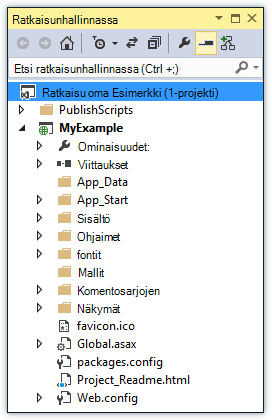

<properties
    pageTitle="ASP.NET-sovelluksen käyttöönotto Visual Studiossa Azure-sovelluksen palveluun | Microsoft Azure"
    description="Lue, miten ASP.NET web-projekti käyttöön uuden verkkosovellukseen Azure-sovelluksen palvelun Visual Studiossa."
    services="app-service\web"
    documentationCenter=".net"
    authors="tdykstra"
    manager="wpickett"
    editor=""/>

<tags
    ms.service="app-service-web"
    ms.workload="web"
    ms.tgt_pltfrm="na"
    ms.devlang="dotnet"
    ms.topic="get-started-article"
    ms.date="07/22/2016"
    ms.author="rachelap"/>

# ASP.NET web-sovelluksen käyttöön Azure-sovelluksen palvelun Visual Studiossa

[AZURE.INCLUDE [tabs](../../includes/app-service-web-get-started-nav-tabs.md)]

## Yleiskatsaus

Tässä opetusohjelmassa näytetään ASP.NET web-sovelluksen [web app ja Azure App palvelun](app-service-web-overview.md) ottamisesta käyttöön Visual Studio 2015 avulla.

Opetusohjelman oletetaan, että olet ASP.NET-kehittäjä, joka ei ole edellistä versiota käytettäessä Azure on. Kun olet valmis, sinun on yksinkertainen web-sovelluksen määrittäminen ja suorittamalla pilveen.

Opit:

* Voit luoda uuden sovelluksen palvelun verkkosovellukseen, kun web uuden projektin luominen Visual Studiossa.
* Miten Ota käyttöön Visual Studiossa sovelluksen web App-palvelun web-projekti.

Kaavio kuvaa opetusohjelman toiminnot.

Opetusohjelman lopussa [vianmääritys](#troubleshooting) osan antaa ideoiden, jos järjestelmässä ei toimi ja [seuraavat vaiheet](#next-steps) -osassa on linkkejä muihin opetusohjelmat, siirry Azure App palvelun käyttämisestä Lisää syvyys.

Tämä on aloittaminen opetusohjelma, web-projekti, se näyttää ottamisesta käyttöön on yksinkertainen yksi, joka ei käytä tietokantaa ja ei-todennuksen tai luvan. Tutustu linkit käyttöönoton aiheisiin [Azure web-sovelluksen käyttöönotto](web-sites-deploy.md).

Asentaminen Azure SDK .NET tarvittava aika lukuun ottamatta tässä opetusohjelmassa kestää noin 10 – 15 minuuttia suorittamiseen.

## Edellytykset

* Opetusohjelman oletetaan, että ole käyttänyt ASP.NET MVC ja Visual Studio. Jos tarvitset esittely, tutustu [ASP.NET MVC 5 käytön aloittaminen](http://www.asp.net/mvc/overview/getting-started/introduction/getting-started).

* Tarvitset Azure-tili. Voit [avata vapaa Azure-tili](/pricing/free-trial/?WT.mc_id=A261C142F) tai [aktivoida Visual Studio tilaajan etuja](/pricing/member-offers/msdn-benefits-details/?WT.mc_id=A261C142F). 

    Jos haluat aloittaa Azure App palvelun, ennen kuin kirjaudut Azure-tili, siirry [Yritä App palvelu](http://go.microsoft.com/fwlink/?LinkId=523751). Siellä voit luoda lyhytkestoinen starter-sovellus App palvelun – ei luottokortti ja ei ole sitoumukset.

## Kehittäminen ympäristön määrittäminen

Opetusohjelman kirjoitetaan for Visual Studio 2015 [Azure SDK.NET](../dotnet-sdk.md) 2.9 tai uudemman kanssa. 

* [Lataa Visual Studio 2015 uusimman Azure SDK-paketissa](http://go.microsoft.com/fwlink/?linkid=518003). SDK asentaa Visual Studio 2015, jos sinulla ei ole jo.

    >[AZURE.NOTE] Sen mukaan, kuinka monta SDK riippuvuuksien on jo käyttämääsi laitteeseen SDK asentaminen saattaa kestää kauan, useita minuuteista vähintään puolessa tunnissa.

Jos on Visual Studio 2013 ja haluat käyttää sitä, voit [ladata Visual Studio 2013: n uusimmat Azure SDK-paketissa](http://go.microsoft.com/fwlink/?LinkID=324322). Jotkin näytöt eivät ehkä eroaa kuvat.

## Määritä uusi web-projekti

Seuraava vaihe on web projektin luominen Visual Studio ja Azure-sovelluksen palvelun verkkosovellukseen. Tässä osassa opetusohjelman Määritä uusi web-projekti. 

1. Avaa Visual Studio 2015.

2. Valitse **Tiedosto > Uusi > Project**.

3. Valitse **Uusi projekti** -valintaikkunassa **Visual C# > verkko > ASP.NET Web-sovelluksen**.

3. Varmista, että **.NET Framework 4.5.2** on valittu kohde framework.

4.  [Azure-sovelluksen tiedot](../application-insights/app-insights-overview.md) valvoo koodiin käytettävyys, suorituskykyä ja käyttö. **Lisää sovellus tietoja Project** -valintaruutu on valittuna web projektin luominen Visual Studio asennettuasi oletusaika ensimmäisen mukaan. Poista valintaruudun valinta, jos se on valittuna, mutta et halua yritä sovelluksen tiedot.

4. Sovelluksen **MyExample**nimi ja valitse sitten **OK**.

    

5. **Uusi ASP.NET-projekti** -valintaikkunassa valitse **MVC** malli ja valitse sitten **Muuta käyttöoikeuksien**.

    Tässä opetusohjelmassa, voit ottaa käyttöön ASP.NET MVC web-projekti. Jos haluat ASP.NET-verkko-Ohjelmointirajapinnan projektin opetteleminen, lue [seuraavat vaiheet](#next-steps) -osa. 

    

6. **Muuta todennus** -valintaikkunassa **Ei todennus**ja valitse sitten **OK**.

    

    Aloittaminen opetusohjelmassa olet käyttöönotto yksinkertainen sovellusta, joka ei toimi käyttäjän Kirjaudu sisään.

5. **Uusi ASP.NET-projekti** -valintaikkunassa **Microsoft Azure** -osassa Varmista, että **isännöidä pilveen** on valittuna ja että **App palvelu** on valittuna avattavasta luettelosta.

    

    Nämä asetukset suoraan Visual Studio web projektin Azure verkkosovelluksen luomiseen.

6. Valitse **OK**

## Määrittää uuden verkkosovellukseen Azure-resurssit

Nyt näet Visual Studiossa, johon haluat luoda Azure resursseista.

5. **Luo sovelluksen Service** -valintaikkunassa **Lisää tili**ja kirjaudu sitten sisään Azure ID ja salasana, jonka avulla hallita Azure tilauksen tilin kanssa.

    

    Jos olet jo kirjautunut sisään aiemmin samassa tietokoneessa, ei ehkä näy **Lisää tili** -painiketta. Siinä tapauksessa voit ohittaa tämän vaiheen tai voit joutua muuttamaan Anna tunnistetiedot uudelleen.
 
3. Kirjoita **Web-sovelluksen nimi** , joka on yksilöllinen *azurewebsites.net* toimialueeseen. Esimerkiksi voit nimetä sen MyExample numeroilla ja tee siitä yksilöllinen, kuten MyExample810 oikealle. Jos web oletusnimi on luonut puolestasi, se on yksilöllinen ja voit myös käyttää.

    Jos joku muu on jo käytetty Lisää nimen, näet punainen huutomerkki oikealle sen sijaan, että vihreä valintamerkki ja kirjoita eri nimellä.

    Sovelluksen URL-osoite on saman niminen plus *. azurewebsites.net*. Jos nimi on esimerkiksi `MyExample810`, URL-osoite on `myexample810.azurewebsites.net`.

    Voit käyttää mukautettua toimialuetta myös Azure web-sovelluksen kanssa. Lisätietoja on artikkelissa [määrittäminen Azure-sovelluksen palvelun mukautettua toimialuenimeä](web-sites-custom-domain-name.md).

6. **Uusi** **Resurssiryhmä** -ruudun vieressä olevaa painiketta ja kirjoita sitten "MyExample" tai muu nimi, jos käytät mieluummin. 

    

    Resurssiryhmä on kokoelma, kuten online- ja VMs Azure resurssit. Opetusohjelma se on yleensä helpointa luoda uusi resurssiryhmä, koska, joka on helppo poistaa yhdessä vaiheessa tahansa Azure resurssien avulla voit luoda opetusohjelman. Lisätietoja on artikkelissa [Azure resurssien hallinnan yleiskatsaus](../azure-resource-manager/resource-group-overview.md).

4. Napsauta vieressä **App palvelun suunnitteleminen** avattavasta **Uusi** -painiketta.

    

    **Sovelluksen-palvelun suunnittelu määrittäminen** -valintaikkuna tulee näyttöön.

    

    Seuraavissa vaiheissa Määritä uusi resurssiryhmä App Service-suunnitteleminen. Sovelluksen palvelusopimus määrittää Laske resurssit, jotka suoritetaan web Appissa. Esimerkiksi jos vapaa taso, API-sovellus toimii jaetun VMs joitakin maksettu tasoa, se suorittamisen erillinen VMs aikana. Lisätietoja on artikkelissa [sovelluksen palvelun suunnitelmien yleiskatsaus](../app-service/azure-web-sites-web-hosting-plans-in-depth-overview.md).

5. Kirjoita **Sovelluksen-palvelun suunnittelu määrittäminen** -valintaikkunan "MyExamplePlan" tai muu nimi, jos käytät mieluummin.

5. Valitse **sijainti** avattavasta luettelosta, joka on lähimpänä sinulle sijaintiin.

    Tämä asetus määrittää, mitkä Azure palvelinkeskuksen sovelluksen suoritetaan. Tässä opetusohjelmassa, voit valita minkä tahansa alueen ja se ei tee huomattavia ero. Mutta tuotannon-sovelluksen halutaan olevan mahdollisimman lähellä ohjelmat, joita käytät sitä, voit pienentää [viive](http://www.bing.com/search?q=web%20latency%20introduction&qs=n&form=QBRE&pq=web%20latency%20introduction&sc=1-24&sp=-1&sk=&cvid=eefff99dfc864d25a75a83740f1e0090)palvelimellesi.

5. Valitse **Valintaluettelo,** **vapaa**.

    Tässä opetusohjelmassa, vapaa hinnoittelu taso antaa hyvä riitä suorituskykyä.

6. **Määritä sovellus palvelun suunnitteleminen** -valintaikkunan valitsemalla **OK**.

7. **Luo sovelluksen Service** -valintaikkunassa valitsemalla **Luo**.

## Visual Studio Luo ja project web app

Visual Studio Luo hetki, yleensä alle minuutin, web-projekti ja online-sovelluksessa.  

**Ratkaisu** hallintaikkunan näyttää uuden projektin tiedostot ja kansiot.

**Azure App aktiviteetin** -ikkunassa näkyvät web-sovellus on luotu.

Ikkunan **Pilven** avulla voit tarkastella ja hallita Azure resurssit, kuten juuri luomasi uusi web-sovellus.

    
## Ota käyttöön web-projekti Azure web App-sovellukseen

Tässä osassa käyttöönottoa web-project web App-sovellukseen.

1. **Ratkaisunhallinnassa**projektin hiiren kakkospainikkeella ja valitse **Julkaise**.

    

    Muutaman sekunnin tulee näkyviin ohjatun **Sivuston julkaisemisen** . Ohjattu toiminto avautuu *Julkaise profiili* , jossa on asetusten käyttöönotto web-projekti uusi web App-sovellukseen.

    Julkaise-profiili sisältää käyttäjänimen ja salasanan käyttöönottoa varten.  Nämä tunnistetiedot on luotu, ja sinun ei tarvitse lisätä ne. Salasana salataan piilotetut käyttäjäkohtainen tiedoston `Properties\PublishProfiles` kansio.
 
8. **Sivuston julkaiseminen** ohjatun toiminnon **yhteys** -välilehdessä Valitse **Seuraava**.

    

    Seuraavaksi on **asetukset** -välilehti. Tässä voit muuttaa ottamaan virheenkorjaus koontiversio, virheiden poistamiseen [etäyhteyden](../app-service-web/web-sites-dotnet-troubleshoot-visual-studio.md#remotedebug)muodosta-määritys. Välilehti on myös useita [Tiedoston Julkaisuasetukset](https://msdn.microsoft.com/library/dd465337.aspx#Anchor_2).

10. Valitse **asetukset** -välilehdessä valitsemalla **Seuraava**.

    

    **Esikatselu** -välilehdessä on seuraava. Seuraavassa on näet, mitä tiedostoja olet luomassa kopioidaan projektin API-sovellukseen. Kun olet käyttöönotto projektin API-sovellukseen, jonka jo ottanut käyttöön aiemmin, vain muuttuneet tiedostot kopioidaan. Jos haluat nähdä luettelon mitä kopioidaan, voit valita **Käynnistä esikatselu** -painiketta.

11. **Esikatselu** -välilehdessä **Julkaise**.

    

    Kun napsautat **Julkaise**, Visual Studio alkaa kopiointia tiedostot Azure-palvelimeen. Tämä saattaa kestää muutaman minuutin.

    **Tulostus** ja **Azure App aktiviteetin** windows Näytä käyttöönoton toiminnot on otettu ja raportoi onnistumiseen käyttöönotto.

    

    Onnistuneen käyttöönoton yhteydessä oletusselain avautuu automaattisesti käyttöön web Appin URL-osoite ja luomasi sovellus on nyt käynnissä pilveen. URL-osoite selaimen osoiteriville näyttää web-sovelluksen ladataan Internetistä.

    

    > [AZURE.TIP]Voit ottaa **Web yhden valitsemalla Julkaise** -työkalurivin nopeasti käyttöönottoa varten. Valitse **Näytä > työkalurivit**, ja valitse sitten **Web yhden valitsemalla Julkaise**. Voit käyttää työkalurivin profiilin, valitsemalla voit julkaista tai avaa **Sivuston julkaiseminen** ohjatun toiminnon painiketta.
    > 

## Vianmääritys

Jos kohtaat ongelmia, kun tässä opetusohjelmassa kerrotaan, varmista, että käytät Azure SDK uusimman version .NET. Helpoin tapa tehdä on lataamaan [Azure SDK for Visual Studio 2015](http://go.microsoft.com/fwlink/?linkid=518003). Jos sinulla on nykyisen version asennuksen, WWW-ympäristö asennusohjelma kertoo, että ei ole asennettu ei tarvita.

Jos olet yrityksen verkossa ja yrität ottaa käyttöön sovelluksen Azure-palvelu palomuurin läpi, varmista, että porttien 443 ja 8172 on avoinna Web käyttöönotto. Jos et voi avata portit, katso muita asennusvaihtoehdot seuraavat vaiheet-seuraavaan osaan.

Kun olet sovelluksen ASP.NET web App Azure-palvelu käytössä, haluat ehkä lisätietoja Visual Studio ominaisuuksista, jotka helpottavat vianmääritys. Lisätietoja kirjaamisen remote virheenkorjaus ja lisää-kohdassa [vianmääritys Azure web Visual Studiossa](web-sites-dotnet-troubleshoot-visual-studio.md).

## Seuraavat vaiheet

Tässä opetusohjelmassa nähnyt luoda yksinkertaisen web-sovelluksen ja ota se käyttöön Azure web app-sovelluksessa. Seuraavassa on joitakin Aiheeseen liittyviä ohjeita ja ohjeaiheissa on lisätietoja Azure App palvelu:

* Seurata ja hallita [Azure portal](https://portal.azure.com/)-koodiin. 

    Lisätietoja on artikkelissa [Yleiskatsaus Azure-portaalin](/services/management-portal/) ja [Määritä verkkosovelluksissa Azure sovelluksen-palvelussa](web-sites-configure.md).

* Aiemmin luodun web-projektin käyttöön uuden web-sovelluksen, Visual Studiossa

    Napsauta **Ratkaisunhallinnassa**projektin hiiren kakkospainikkeella ja valitse sitten **Julkaise**. Valitse Julkaise kohteeseen **Microsoft Azure App palvelua** ja valitse sitten **Uusi**. Valintaikkunat ovat samat kuin mitä nähnyt Tässä opetusohjelmassa.

* Ota käyttöön web-projekti lähde-ohjausobjektista

    Lisätietoja [tietolähteen ohjausobjektin järjestelmän](http://www.asp.net/aspnet/overview/developing-apps-with-windows-azure/building-real-world-cloud-apps-with-windows-azure/source-control) [automatisointi käyttöönoton](http://www.asp.net/aspnet/overview/developing-apps-with-windows-azure/building-real-world-cloud-apps-with-windows-azure/continuous-integration-and-continuous-delivery) artikkelissa [Azure App palvelun web App-sovellusten käytön aloittaminen](app-service-web-get-started.md) ja [Azure web-sovelluksen asentamisesta](web-sites-deploy.md).

* ASP.NET-verkko Ohjelmointirajapinnan käyttöön Azure App Service API-sovelluksen

    Nähnyt luominen Azure App palvelun, joka on tarkoitettu pääasiassa isännöimiseen sivusto esiintymän. Sovelluksen palvelun tarjoaa myös isännöimiseen verkko-ohjelmointirajapinnan, kuten CORS tukevat ominaisuudet ja API metatietojen tuki asiakas-koodin luominen. Voit käyttää API ominaisuuksia online-sovelluksessa, mutta jos haluat isännöidä Ohjelmointirajapinnan App palvelun esiintymän pääasiassa, **API app** olisi tallentaa. Lisätietoja on artikkelissa [API-sovellusten ja ASP.NET Azure sovelluksen-palvelun käytön aloittaminen](../app-service-api/app-service-api-dotnet-get-started.md). 

* Lisää mukautettu toimialuenimi ja SSL

    SSL-ja oma toimialue (esimerkiksi www.contoso.com contoso.azurewebsites.net sijaan), Lisätietoja on seuraavissa resursseissa:

    * [Mukautetun toimialuenimen määrittäminen Azure App palvelun](web-sites-custom-domain-name.md)
    * [Ota käyttöön HTTPS Azure-sivustoon](web-sites-configure-ssl-certificate.md)

* Poista resurssiryhmän, joka sisältää web-sovelluksen ja kaikki siihen liittyvät Azure resurssit, kun olet valmis heidän kanssaan.

    Tietoja resurssiryhmät Azure-portaalissa käsittelemisestä on artikkelissa [Resurssienhallinta mallit ja Azure-portaalin käyttöönotto resursseilla](../resource-group-template-deploy-portal.md).   

*   Lisää esimerkkejä ASP.NET Web-sovelluksen luominen sovelluksen palvelun [Luo ja ota käyttöön Azure-sovelluksen palvelun ASP.NET web-sovellus](https://github.com/Microsoft/HealthClinic.biz/wiki/Create-and-deploy-an-ASP.NET-web-app-in-Azure-App-Service) ja [Luo ja ota käyttöön mobiilisovelluksessa Azure-sovelluksen palvelun](https://github.com/Microsoft/HealthClinic.biz/wiki/Create-and-deploy-a-mobile-app-in-Azure-App-Service) [HealthClinic.biz](https://github.com/Microsoft/HealthClinic.biz) 2015 Yhdistä [esittely](https://blogs.msdn.microsoft.com/visualstudio/2015/12/08/connectdemos-2015-healthclinic-biz/). Katso Lisää quickstarts-HealthClinic.biz esittely, [Azure Developer Työkalut Quickstarts](https://github.com/Microsoft/HealthClinic.biz/wiki/Azure-Developer-Tools-Quickstarts).
