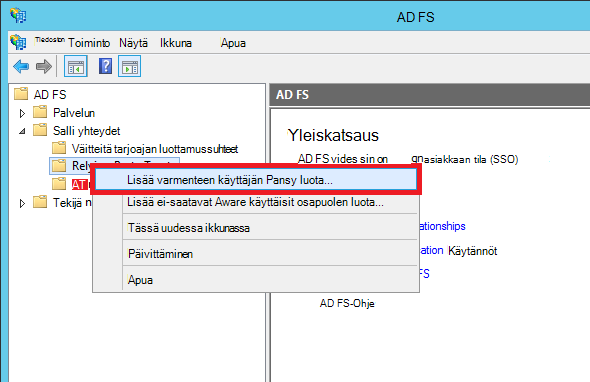

<properties 
    pageTitle="Liiketoiminta-Azure sovelluksen luominen AD FS-todennuksen | Microsoft Azure" 
    description="Lue, miten liiketoiminta-sovelluksen luominen Azure App palvelu, joka todentaa, kun paikallinen STS kanssa. Tässä opetusohjelmassa jotakin AD FS paikallinen STS nimellä." 
    services="app-service\web" 
    documentationCenter=".net" 
    authors="cephalin" 
    manager="wpickett" 
    editor=""/>

<tags 
    ms.service="app-service-web" 
    ms.devlang="dotnet" 
    ms.topic="article" 
    ms.tgt_pltfrm="na" 
    ms.workload="web" 
    ms.date="08/31/2016" 
    ms.author="cephalin"/>

# Liiketoiminta-Azure sovelluksen luominen ja AD FS-todennus

Tässä artikkelissa kerrotaan ASP.NET MVC liiketoiminta-sovelluksen luominen [Azure App palvelun](../app-service/app-service-value-prop-what-is.md) käyttäen paikallisen [Active Directory Federation Services](http://technet.microsoft.com/library/hh831502.aspx) tunnistetietojen toimittaja. Tässä skenaariossa voit käyttää, kun haluat luoda liiketoiminta-sovellusten Azure-sovelluksen käytössä, mutta organisaatio edellyttää directory-tiedot tallennetaan paikalla.

>[AZURE.NOTE] Yleiskatsaus Azure App palvelun eri todennus- ja asetukset-kohdassa [Tarkista paikallisen Active Directoryn Azure-sovelluksen kanssa](web-sites-authentication-authorization.md).

## Mitä muodostetaan ##

Luot basic ASP.NET-sovelluksen Azure App palvelun Web Apps-sovelluksissa on seuraavat ominaisuudet:

- Todentaa käyttäjät vastaan AD FS
- Käyttää `[Authorize]` sallivat käyttäjien eri toimintoja varten
- Staattinen määritys sekä virheenkorjaus Visual Studiossa julkaiseminen App palvelun Web Apps (määrittäminen kerran, korjata ja julkaista milloin tahansa)  

## Tarvitset ##

[AZURE.INCLUDE [free-trial-note](../../includes/free-trial-note.md)]

Sinun on suoritettava tässä opetusohjelmassa seuraavasti:

- Paikallisen AD FS käyttöönoton (Katso lopusta loppuun vaiheista testi testiympäristössä käytetään tässä opetusohjelmassa, [testata kurssin: erillinen STS AD FS-Azure AM (testiä) varten](https://blogs.msdn.microsoft.com/cephalin/2014/12/21/test-lab-standalone-sts-with-ad-fs-in-azure-vm-for-test-only/))
- Oikeudet luoda käyttäisit osapuolen luottamussuhteet AD FS hallinta
- Visual Studio 2013 Päivitä 4 tai uudempi versio
- [Azure SDK 2.8.1](http://go.microsoft.com/fwlink/p/?linkid=323510&clcid=0x409) tai uudempi versio

## Käyttää sovelluksen malli liiketoiminta-malli ##

Tässä opetusohjelmassa sovelluksen malli [Web App-sovelluksen WSFederation-DotNet)](https://github.com/AzureADSamples/WebApp-WSFederation-DotNet), luodaan Azure Active Directory-ryhmän. Koska AD FS tukee WS federaatio, voit käyttää sitä mallina luomiseen liiketoiminta-sovellusten vaivattomasti. Se on seuraavia ominaisuuksia:

- Käyttää [WS Federation](http://msdn.microsoft.com/library/bb498017.aspx) todentamismenetelmä paikallisen AD FS käyttöönotto
- Kirjaudu sisään ja kirjaudu ulos-toiminnot
- Käyttää [Microsoft.Owin](http://www.asp.net/aspnet/overview/owin-and-katana/an-overview-of-project-katana) (sijaan Windows Identity Foundation), joka on tulevan ASP.NET ja helpompaa kuin WIF todennus- ja määrittäminen

## Esimerkkisovelluksen määrittäminen ##

2.  Kloonaa tai Lataa malli-ratkaisun osoitteessa [Web App-sovelluksen WSFederation-DotNet](https://github.com/AzureADSamples/WebApp-WSFederation-DotNet) paikalliseen kansioon.

    > [AZURE.NOTE] [README.md](https://github.com/AzureADSamples/WebApp-WSFederation-DotNet/blob/master/README.md) ohjeita noudattamalla voit Azure Active Directory-sovelluksen asentaminen. Mutta tässä opetusohjelmassa, olet määrittänyt AD FS, joten noudata nämä ohjeet sen sijaan.

3.  Avaa ratkaisu ja avaa sitten **Ratkaisunhallinnassa**Controllers\AccountController.cs.

    Näet koodin yksinkertaisesti ongelmat todennus-todennus todennetaan käyttämällä WS Federation. Kaikki todennus on määritetty App_Start\Startup.Auth.cs.

4.  Avaa App_Start\Startup.Auth.cs. Valitse `ConfigureAuth` -menetelmä Huomaa rivin:

        app.UseWsFederationAuthentication(
            new WsFederationAuthenticationOptions
            {
                Wtrealm = realm,
                MetadataAddress = metadata                                      
            });

    OWIN kaikkialla maailmassa tämän koodikatkelman on todella ajoneuvon pienin, sinun on määritettävä WS Federation todennusta. Se on helpompaa ja lisää klassinen kuin WIF, jossa Web.config syötetään XML kaikkialla paikkaa. Vain tarvitsemasi tiedot ovat varmenteen käyttäjän osapuolen (RP)-tunnus ja AD FS-palvelun metatietojen tiedoston URL-osoite. Tässä on esimerkki:

    -   RP tunnus:`https://contoso.com/MyLOBApp`
    -   Metatietojen osoite:`http://adfs.contoso.com/FederationMetadata/2007-06/FederationMetadata.xml`

5.  Muuta App_Start\Startup.Auth.cs, staattinen merkkijonon tarkoitetaan:  
    <pre class="prettyprint">
    Yksityinen staattinen merkkijonon alueen = ConfigurationManager.AppSettings["ida:<mark>RPIdentifier</mark>"]; <mark><del>Yksityinen staattinen merkkijonon aadInstance = ConfigurationManager.AppSettings["ida:AADInstance"];</del></mark> 
     <mark><del>Yksityinen staattinen merkkijonon vuokraajan = ConfigurationManager.AppSettings["ida:Tenant"];</del></mark> 
     <mark><del>Yksityinen staattinen merkkijono metatietojen = merkkijono. Format ("{0} / {1} /federationmetadata/2007-06/federationmetadata.xml", aadInstance-vuokraajan);</del></mark> 
     <mark>Yksityinen staattinen merkkijono metatietojen = merkkijono. Format ("https:// {0} /federationmetadata/2007-06/federationmetadata.xml" ConfigurationManager.AppSettings["ida:ADFS"]);</mark>

    <mark><del>merkkijono myöntäjä = String.Format (CultureInfo.InvariantCulture, aadInstance, vuokraajan);</del></mark>
    </pre>

6.  Tee muutokset nyt Web.config. Avaa Web.config ja muuttaa sovelluksen seuraavia asetuksia:  
    <pre class="prettyprint">
    &lt;appSettings&gt;
    &lt;add key="webpages:Version" value="3.0.0.0" /&gt;
    &lt;add key="webpages:Enabled" value="false" /&gt;
    &lt;add key="ClientValidationEnabled" value="true" /&gt;
    &lt;add key="UnobtrusiveJavaScriptEnabled" value="true" /&gt;
      <mark><del>&lt;add key="ida:Wtrealm" value="[Enter the App ID URI of WebApp-WSFederation-DotNet https://contoso.onmicrosoft.com/WebApp-WSFederation-DotNet]" /&gt;</del></mark>
      <mark><del>&lt;add key="ida:AADInstance" value="https://login.windows.net" /&gt;</del></mark>
      <mark><del>&lt;add key="ida:Tenant" value="[Enter tenant name, e.g. contoso.onmicrosoft.com]" /&gt;</del></mark>
      <mark>&lt;add key="ida:RPIdentifier" value="[Enter the relying party identifier AD FS, kuten https://localhost:44320 mukaisena /] "/&gt;</mark>
      <mark>&lt;plusnäppäin ="HVT: ADFS"arvo ="[Anna AD FS-palveluun, kuten adfs.contoso.com FQDN]"/&gt; </mark>        

    &lt;/appSettings&gt;
    </pre>

    Täytä avainarvot vastaaviin-ympäristöön.

7.  Muodosta, sovellus ei ole virheitä.

Se on. Esimerkkisovellus on nyt valmis AD FS-käyttöä varten. Haluat määrittää RP luota AD FS-sovelluksen myöhemmin.

## Esimerkkisovelluksen Azure App palvelun Web Apps-sovellusten käyttöönotto

Tässä kohdassa voit julkaista web app sovelluksen sovelluksen palvelun verkkosovelluksissa säilyttämällä virheenkorjaus-ympäristössä. Huomaa, että haluat julkaista sovellus, ennen kuin se on RP-luota AD FS, joten todennus vieläkään toimi vielä. Jos tee se nyt voit voi kuitenkin olla web Appin URL-osoite, jonka avulla voit määrittää RP luota myöhemmin.

1. Projektin hiiren kakkospainikkeella ja valitse **Julkaise**.

    

2. Valitse **Microsoft Azure App palvelu**.
3. Jos et ole kirjautunut sisään Azure, valitse **Kirjaudu sisään** ja Azure tilauksen Microsoft-tilin avulla kirjaudun.
4. Kun olet kirjautunut sisään, valitse **Uusi** web-sovelluksen luominen.
5. Täytä kaikki pakolliset kentät. Aiot Yhdistä paikalliset tiedot myöhemmin, jotta et luo tietokannan web-sovelluksen.

    

6. Valitse **Luo**. Kun web-sovellus on luotu, Julkaise Web-valintaikkuna avautuu.
7. Muuta **http** **https** **Linkin URL-osoite**. Kopioi koko URL-osoite tekstieditorissa myöhempää käyttöä varten. Valitse **Julkaise**.

    

11. Avaa Visual Studion **Web.Release.config** projektin. Lisää huomioon seuraavat XML `<configuration>` merkitseminen ja korvata avainarvon Julkaise koodiin 's URL-osoite.  
    <pre class="prettyprint">
&lt;appSettings&gt;
   &lt;plusnäppäin = "HVT: RPIdentifier" arvo = "<mark>[esimerkiksi https://mylobapp.azurewebsites.net/]</mark>" xdt:Transform = "SetAttributes" xdt:Locator="Match(key)" /&gt;
&lt;/appSettings&gt;</pre>

Kun olet valmis, sinulla on kaksi RP tunnukset, jotka on määritetty projektin, yksi Visual Studiossa virheenkorjaus-ympäristön ja toinen Azure julkaistun web-sovelluksen. Haluat määrittää RP luota kunkin AD FS-ympäristöissä. Aikana virheenkorjaus, jotta käyttäminen AD FS **Virheenkorjaus** kokoonpanon käytetään Web.config sovelluksen-asetuksia. Kun se on julkaistu (oletusarvoisesti **Release** -määritys on julkaistu), muunnettua Web.config on ladattu palvelimeen, joka kattaa Web.Release.config-sovelluksen asetusten muutokset.

Jos haluat liittää Azure julkaistun web-sovelluksen virheenkorjaus (eli sinun täytyy ladata virheenkorjaussymbolit koodin julkaistun web App-sovelluksessa), voit luoda Kloonaa virheenkorjaus-määritys Azure virheenkorjaus, mutta oma mukautettu Web.config muunnos (kuten Web.AzureDebug.config), joka käyttää Web.Release.config sovelluksen asetusten kanssa. Voit ylläpitää staattista määritystä eri ympäristöissä eri.

## Varmenteen käyttäjän osapuolen luottamussuhteet AD FS hallinnan määrittäminen ##

Nyt sinun täytyy määrittää RP-luota AD FS hallinta, ennen kuin voit käyttää malli-sovelluksen ja AD FS todella todentamismenetelmä. Sinun on kaksi erillistä RP luottamussuhteet, yksi virheenkorjaus-ympäristön ja toinen julkaistun web-sovelluksen määrittäminen.

> [AZURE.NOTE] Varmista, että toista seuraavat vaiheet sekä oman ympäristössä.

4.  ADFS-palvelimeen Kirjaudu sisään tunnistetiedot, jotka AD FS oikeuksia hallinta.
5.  Avaa AD FS hallinta. **AD FS\Trusted Relationships\Relying osapuolen luottaa** hiiren kakkospainikkeella ja valitse **Osapuolen Lisää käyttäisit luota**.

    

5.  Valitse **Valitse tietolähde** -sivulla **tietoja varmenteen käyttäjän osapuolen tietojen kirjoittaminen manuaalisesti**. 

    

6.  **Määritä näyttönimi** -sivulla sovelluksen näyttönimi ja valitse **Seuraava**.
7.  **Valitse protokolla** -sivulle valitsemalla **Seuraava**.
8.  **Varmenteen määrittäminen** -sivulle valitsemalla **Seuraava**.

    > [AZURE.NOTE] Sinun on käytettävä HTTPS jo, koska salatun tunnusten ovat valinnaisia. Jos todella haluat salata AD FS tällä sivulla tunnusta, sinun on lisättävä myös tunnuksen salauksen logiikan koodisi. Lisätietoja on artikkelissa [määrittäminen manuaalisesti OWIN WS-Federation middleware ja hyväksymällä salattuja tunnusten](http://chris.59north.com/post/2014/08/21/Manually-configuring-OWIN-WS-Federation-middleware-and-accepting-encrypted-tokens.aspx).
  
5.  Ennen kuin siirryt seuraavaan vaiheeseen sivulle, tarvitset yhden tiedon Visual Studio projektin. Huomaa projektin ominaisuudet-sovelluksen **SSL URL-osoite** . 

    

6.  Takaisin sisään AD FS hallinta- **URL-Osoitteen määrittäminen** -sivulla **Lisää käyttäisit osapuolen luota ohjatun toiminnon**Valitse **WS Federation passiivinen protokolla tuen ottaminen käyttöön** ja Visual Studio projektin edellisessä vaiheessa muistiin kirjoittamasi SSL-URL-osoitteen tyyppi. Valitse sitten **Seuraava**.

    

    > [AZURE.NOTE] URL-osoite määrittää, johon lähettäminen asiakkaalle todennuksen onnistumisen jälkeen. Virheenkorjaus-ympäristön luultavasti <code>https://localhost:&lt;port&gt;/</code>. Julkaistun web-sovelluksen on oltava web Appin URL-osoite.

7.  Varmista, että projektin SSL URL-osoite näkyy jo **Määrittäminen tunnisteet** , sivulla ja valitse sitten **Seuraava**. Valitse **Seuraava** aivan oletusarvon valinnoissa ohjatun toiminnon loppuun.

    > [AZURE.NOTE] Visual Studio projektin App_Start\Startup.Auth.cs, tunniste vastaa arvoa vastaan <code>WsFederationAuthenticationOptions.Wtrealm</code> liitetyt todennuksen aikana. Edellisessä vaiheessa-sovelluksen URL-osoite lisätään oletusarvoisesti RP tunniste.

8.  Olet nyt määrittäminen projektin RP-sovelluksen AD FS. Seuraavaksi voit määrittää tämän sovelluksen lähettämään sovelluksen tarvitsemia saatavat. **Muokkaa ryhmän säännöt** -valintaikkunan on avattu oletusarvoisesti, ohjattu toiminto loppuun, voit ryhtyä välittömästi. Oletetaan, että määrittää vähintään seuraavat saatavat (ja rakenteet sulkeissa):

    -   Nimi (http://schemas.xmlsoap.org/ws/2005/05/identity/claims/name) - käyttävät ASP.NET hydrate `User.Identity.Name`.
    -   Täydellinen käyttäjätunnus (http://schemas.xmlsoap.org/ws/2005/05/identity/claims/upn) - yksilöivä organisaatioon kuuluvien käyttäjien.
    -   Ryhmäjäsenyyksiä roolit (http://schemas.microsoft.com/ws/2008/06/identity/claims/role) - muodossa voi käyttää `[Authorize(Roles="role1, role2,...")]` ulkoasu sallivat ohjaimet ja toiminnot. Tämän menetelmän eivät välttämättä ole useimmat performant rooli lupaa todellisuudessa. Jos AD käyttäjien kuuluvat satoja käyttöoikeusryhmät, ne muuttuvat rooli tunnuksen SAML ongelmaton satoja. Vaihtoehtoinen menetelmä on lähettäminen tietyn ryhmän rooliin vaatimus ehdollisesti käyttäjän jäsenyyden mukaan. Kuitenkin että Pyri yksinkertaisuuteen opetusohjelmassa.
    -   Tunnus (http://schemas.xmlsoap.org/ws/2005/05/identity/claims/nameidentifier) name - voi käyttää tehostetut vahvistus. Lisätietoja ansiosta käyttäminen tehostetut vahvistus on [Create - liiketoiminta Azure-sovelluksessa, jossa Azure Active Directory-todennus](web-sites-dotnet-lob-application-azure-ad.md#bkmk_crud)on kohdassa **Lisää liiketoiminta - toimintoja** .

    > [AZURE.NOTE] Varaa tyypit, sinun on määritettävä sovelluksen määritetään sovelluksen tarpeiden mukaan. Azure Active Directory-sovellusten (eli RP luottamussuhteet) tukemien saatavat luetteloon esimerkiksi näkyviin [tuettu tunnuksen ja varaa tyypit](http://msdn.microsoft.com/library/azure/dn195587.aspx).

8.  Valitse Muokkaa ryhmän säännöt-valintaikkunan **Lisää sääntö**.
9.  Määritä nimi, täydellisen Käyttäjätunnuksen ja roolin saatavat näyttökuvan esitetyllä tavalla ja valitse **Valmis**.

    

    Seuraavaksi voit luoda lyhytkestoisia nimen tunnus väittää esitellään [Nimi tunnisteista SAML vahvistukset](http://blogs.msdn.com/b/card/archive/2010/02/17/name-identifiers-in-saml-assertions.aspx)ohjeiden mukaisesti.

9.  Valitse **Lisää sääntö** uudelleen.
10. **Lähetä käyttämällä mukautetun säännön saatavat** ja valitse **Seuraava**.
11. Liitä **Mukautettu sääntö** -kenttään seuraavaa sääntöä kieltä, säännön **Kohti istunnon tunnisteen** nimi ja valitse **Valmis**.  
    <pre class="prettyprint">
    C1: [tyyppi == "http://schemas.microsoft.com/ws/2008/06/identity/claims/windowsaccountname"] &amp; &amp; 
    c2: [tyyppi == "http://schemas.microsoft.com/ws/2008/06/identity/claims/authenticationinstant"] = > Lisää (tallentaa = "_OpaqueIdStore"-tyypit = ("<mark>http://contoso.com/internal/sessionid</mark>"), kyselyn = "{0} { 1}. {2}. {3}. {4} "-parametri ="useEntropy"-parametri = c1. Arvo, parametri = c1. OriginalIssuer-parametri = "", parametri = c2. Arvon).
    </pre>

    Mukautetun säännön pitäisi näyttää samalta kuin tässä näyttökuvassa:

    

9.  Valitse **Lisää sääntö** uudelleen.
10. Valitse **Muunna saapuvien varaa** ja valitse **Seuraava**.
11. Määritä säännön mukaisesti näyttökuvan (avulla voit luoda mukautetun säännön ryhmän tyyppi) ja valitse **Valmis**.

    

    Lisätietoja lyhytkestoisia nimen tunnus-ryhmän ohjeet on artikkelissa [SAML vahvistukset tunnisteista nimi](http://blogs.msdn.com/b/card/archive/2010/02/17/name-identifiers-in-saml-assertions.aspx).

12. Valitse **Käytä** **Muokkaa ryhmän säännöt** -valintaikkunassa. Se pitäisi nyt näyttää samalta kuin seuraavista näyttökuvan:

    

    > [AZURE.NOTE] Varmista uudelleen, toista nämä vaiheet virheenkorjaus-ympäristön ja julkaistun web Appissa.

## Testaa sovelluksen liitetyt todennus

Olet valmis kokeilemaan sovelluksen käyttöoikeuksien logiikan AD FS vastaan. Oma AD FS-testiympäristössä minulla testi-käyttäjä, joka kuuluu testiryhmään-Active Directory (AD).

Voit esikatsella todennus virheenkorjaus-tyypin sinun tarvitsee tehdä nyt on `F5`. Jos haluat testata todennus julkaistun web App-sovelluksessa, siirry URL-osoite.

Kun web-sovelluksen latautuu, valitse **Kirjaudu sisään**. Saat pitäisi nyt sisäänkirjautuminen-valintaikkunan tai served mukaan AD FS mukaan AD FS valitsema todentamismenetelmän kirjautumissivulle. Näin voin hankkia Internet Explorer 11.

Kun kirjaudut sisään AD FS-käyttöönoton AD-toimialueen käyttäjän, pitäisi tulla näkyviin uudelleen kotisivun **Hei, <User Name>!** Valitse. Näin voin hankkia.

Tähän mennessä olet onnistui seuraavilla tavoilla:

- Sovellus on muutettu onnistuneesti AD FS ja vastaavia RP tunnus löytyy AD FS-tietokanta
- AD FS on todentaminen onnistui, AD-käyttäjä ja sovelluksen kotisivulle takaisin uudelleenohjaus
- AD FS kuin lähetetty nimi vaatimus (http://schemas.xmlsoap.org/ws/2005/05/identity/claims/name)-sovelluksen käyttäjänimi näkyy yläkulmassa seikka esitetyllä tavalla. 

Jos ryhmän nimi ei ole näkyvissä, sinun tullut **Hei,!**. Jos tarkastelet Views\Shared\_LoginPartial.cshtml, huomaat, että se käyttää `User.Identity.Name` näytettävä käyttäjänimi. Kuten edellä mainittiin, jos todennetun käyttäjän nimi vaatimus on käytettävissä SAML-tunnuksen, ASP.NET hydrates tämän ominaisuuden sitä. Saat kaikki saatavat, jotka on lähettänyt AD FS-sijoittaa keskeytyskohdasta Controllers\HomeController.cs, indeksi-toiminnon tapaa. Kun käyttäjä todennetaan, Tarkasta `System.Security.Claims.Current.Claims` sivustokokoelman.

 

## Määritä käyttäjät tietyn ohjaimet tai toiminnot

Koska lisäämiesi ryhmäjäsenyyksiä kuin roolin saatavat RP luota kokoonpanoa, voit käyttää niitä suoraan `[Authorize(Roles="...")]` ulkoasu-ohjaimia ja toiminnot. Luo-luku-päivitys-Delete (CRUD) kuvion liiketoiminta-sovelluksessa voit antaa tietyt roolit käyttämään kutakin. Nyt voit vain kokeilla tätä ominaisuutta aiemmin aloitus ohjaimen.

1. Avaa Controllers\HomeController.cs.
2. Koristeleminen `About` ja `Contact` toiminto menetelmät seuraava koodi-suojauksen samalla ryhmän jäsenyyksiä todennetun käyttäjän sisältävän.  
    <pre class="prettyprint">
    <mark>[Sallivat (roolit = "Testi ryhmän")]</mark> 
    julkisen ActionResult About() {ViewBag.Message = "Sovelluksen kuvaus sivusi.";

        return View();
    }

    <mark>[Sallivat (roolit = "Domain Admins")]</mark> 
    julkisen ActionResult Contact() {ViewBag.Message = "Yhteyshenkilön sivusi.";

        return View();
    }  </pre>

    Koska voin lisätty **Testata käyttäjän** **Testi** ryhmään Omat AD FS-testiympäristössä, voit testi ryhmän toiseen luvan testaamista `About`. Saat `Contact`, voin testataan **Domain Admins**, joka **Testaa käyttäjä** ei kuulu negatiivinen kirjainkokoa.

3. Käynnistä virheenkorjaus kirjoittamalla `F5` ja kirjaudu sisään ja valitse sitten **tietoja**. Sinun pitäisi nyt tarkasteleminen `~/About/Index` sivun onnistuu, jos todennetun käyttäjän sallitaan toiminnon.
4. Valitse **yhteyshenkilö**, joissa oma tapauksessa **Testikäyttäjän** ei olisi sallivat toiminnon. Selain ohjataan kuitenkin AD FS, jossa näkyy ilmestyy sanoma:

    

    Jos tämä virhe Tapahtumienvalvonta ADFS-palvelimeen tutkia, näet poikkeuksen seuraavan sanoman:  
    <pre class="prettyprint">
   Microsoft.IdentityServer.Web.InvalidRequestException: MSIS7042: <mark>saman asiakkaan selaimen istunnon on tehnyt 6"pyynnöt viimeksi"11"sekunteina.</mark> Lisätietoja järjestelmänvalvojalta.
   Microsoft.IdentityServer.Web.Protocols.PassiveProtocolHandler.UpdateLoopDetectionCookie (WrappedHttpListenerContext konteksti) on osoitteessa Microsoft.IdentityServer.Web.PassiveProtocolListener.ProcessProtocolRequest (ProtocolContext protocolContext, PassiveProtocolHandler protocolHandler) osoitteessa Microsoft.IdentityServer.Web.PassiveProtocolListener.OnGetContext (WrappedHttpListenerContext konteksti) Microsoft.IdentityServer.Web.Protocols.WSFederation.WSFederationProtocolHandler.SendSignInResponse (WSFederationContext kontekstissa, MSISSignInResponse vastaus)-palvelussa </pre>

    Tämän virheen syynä on, että oletusarvoisesti MVC palauttaa 401 ei oikeuksia kun käyttäjän roolia ei ole oikeuksia. Tämä käynnistää todennusta pyyntö tunnistetietojen palveluntarjoajan (AD FS). Koska käyttäjä on jo todennettu, AD FS palauttaa samalle sivulle, joka antaa toisen 401 sitten luominen uudelleenohjaus silmukan. Voit ohittaa AuthorizeAttribute's `HandleUnauthorizedRequest` yksinkertainen logiikka näyttämään jotain, joka on järkevää sijaan jatkuvaa uudelleenohjaus toista menetelmää.

5. Tiedoston luominen projektin nimi AuthorizeAttribute.cs ja liitä seuraava koodi siihen.

        using System;
        using System.Web.Mvc;
        using System.Web.Routing;
        
        namespace WebApp_WSFederation_DotNet
        {
            [AttributeUsage(AttributeTargets.Class | AttributeTargets.Method, Inherited = true, AllowMultiple = true)]
            public class AuthorizeAttribute : System.Web.Mvc.AuthorizeAttribute
            {
                protected override void HandleUnauthorizedRequest(AuthorizationContext filterContext)
                {
                    if (filterContext.HttpContext.Request.IsAuthenticated)
                    {
                        filterContext.Result = new System.Web.Mvc.HttpStatusCodeResult((int)System.Net.HttpStatusCode.Forbidden);
                    }
                    else
                    {
                        base.HandleUnauthorizedRequest(filterContext);
                    }
                }
            }
        }

    Ohitus-koodin lähettää sen sijaan, että HTTP 401 (ei oikeuksia) HTTP 403 (kielletty) todennetut mutta luvattoman tapauksissa.

6. Suorita virheenkorjaus uudelleen `F5`. Napsauttamalla **yhteyshenkilön** nyt näyttää informatiivisempi (tosin varjoksi) virhesanoma:

    

7. Julkaise Azure palvelun Web sovellukset sovelluksen uudelleen ja testaa live sovelluksen toiminta.

## Yhdistä paikalliset tiedot

Syy, haluat ehkä toteuttaa liiketoiminta-sovelluksen AD FS sijaan Azure Active Directory on yhteensopivuuden ongelmat pitäminen organisaation tiedot käytöstä tiloissa. Tämä voi myös tarkoittaa, että Azure-koodiin odotustilan paikalliset tietokannat, koska et voi käyttää [SQL-tietokannan](/services/sql-database/) tietojen taso web Apps-sovellukset.

Azure palvelun Web sovellukset tukee käyttäminen paikalliset tietokannat kanssa kahdella tavalla: [Hybrid yhteydet](../biztalk-services/integration-hybrid-connection-overview.md) ja [Virtual verkot](web-sites-integrate-with-vnet.md). Lisätietoja on artikkelissa [käyttämällä VNET integrointi ja Hybrid Azure App palvelun Web Apps -sovellusten yhteydessä](https://azure.microsoft.com/blog/2014/10/30/using-vnet-or-hybrid-conn-with-websites/).

## Muita resursseja

- [SSL-ja hyväksy-määritettä sovelluksen suojaaminen](web-sites-dotnet-deploy-aspnet-mvc-app-membership-oauth-sql-database.md#protect-the-application-with-ssl-and-the-authorize-attribute)
- [Todentamismenetelmä paikallisen Active Directory Azure-sovelluksessa](web-sites-authentication-authorization.md)
- [Liiketoiminta-Azure sovelluksen luominen ja Azure Active Directory-todennus](web-sites-dotnet-lob-application-azure-ad.md)
- [ASP.NET Visual Studio 2013: n paikallisen organisaation todennusta-asetus (ADFS) käyttäminen](http://www.cloudidentity.com/blog/2014/02/12/use-the-on-premises-organizational-authentication-option-adfs-with-asp-net-in-visual-studio-2013/)
- [Siirtää VS2013 Web projektin WIF Katana](http://www.cloudidentity.com/blog/2014/09/15/MIGRATE-A-VS2013-WEB-PROJECT-FROM-WIF-TO-KATANA/)
- [Active Directory Federation Services-palvelujen yleiskatsaus](http://technet.microsoft.com/library/hh831502.aspx)
- [WS Federation 1.1-määritys](http://download.boulder.ibm.com/ibmdl/pub/software/dw/specs/ws-fed/WS-Federation-V1-1B.pdf?S_TACT=105AGX04&S_CMP=LP)

