<properties 
    pageTitle="Liiketoiminta-Azure sovelluksen luominen Azure Active Directory-todennuksen | Microsoft Azure" 
    description="Opettele luomaan ASP.NET MVC liiketoiminta-sovelluksen Azure App palvelu, joka todentaa Azure Active Directory-hakemistosta" 
    services="app-service\web, active-directory" 
    documentationCenter=".net" 
    authors="cephalin" 
    manager="wpickett" 
    editor=""/>

<tags 
    ms.service="app-service-web" 
    ms.devlang="dotnet" 
    ms.topic="article" 
    ms.tgt_pltfrm="na" 
    ms.workload="web" 
    ms.date="09/01/2016" 
    ms.author="cephalin"/>

# Liiketoiminta-Azure sovelluksen luominen ja Azure Active Directory-todennus #

Tässä artikkelissa kerrotaan, miten .NET liiketoiminta-sovelluksen luominen [Azure App palvelun Web Apps -sovellusten](http://go.microsoft.com/fwlink/?LinkId=529714) käytön [todennus / luvan](../app-service/app-service-authentication-overview.md) ominaisuus. Se näyttää myös käyttämisestä sovelluksessa [Azure Active Directory Graph API](https://msdn.microsoft.com/Library/Azure/Ad/Graph/api/api-catalog) kyselyn directory tietoihin.

Azure Active Directory-vuokraajan, joiden avulla voi olla vain Azure-kansio. Tai se voi olla [synkronoitu paikallinen Active Directory](../active-directory/active-directory-aadconnect.md) yksittäinen Sign kokemus luomiseen työntekijät, jotka ovat paikallisen ja etäyhteyksien. Tässä artikkelissa käyttää oletuskansio Azure-tili.

## Mitä muodostetaan ##

Muodostetaan yksinkertaisen liiketoiminta--luominen-luku-päivitys-Delete (CRUD)-sovelluksen palvelun Web sovellukset, raidat työkohteet seuraavia ominaisuuksia:

- Todentaa käyttäjät Azure Active Directorysta
- Kyselyjen Directoryn käyttäjät ja ryhmät, [Azure Active Directory Graph-Ohjelmointirajapinnan](http://msdn.microsoft.com/library/azure/hh974476.aspx) käyttäminen
- ASP.NET-MVC *Ei todennus* -mallin käyttäminen

Jos tarvitset Azure liiketoiminta-sovelluksen Roolipohjainen käyttöoikeuksien valvonta (RBAC), tutustu [Seuraavaan vaiheeseen](#next).

## Tarvitset ##

[AZURE.INCLUDE [free-trial-note](../../includes/free-trial-note.md)]

Sinun on suoritettava tässä opetusohjelmassa seuraavasti:

- Azure Active Directory-vuokraajan eri käyttäjien kanssa
- Voit luoda sovelluksia Azure Active Directory-vuokraajan käyttöoikeudet
- Visual Studio 2013 Päivitä 4 tai uudempi versio
- [Azure SDK 2.8.1 tai uudempi versio](https://azure.microsoft.com/downloads/)

## Luo ja ota käyttöön verkkosovellukseen Azure ##

1. Valitse Visual Studion **Tiedosto** > **Uusi** > **projektin**.

2. Valitse **ASP.NET Web-sovelluksen**, projektin nimi ja valitse **OK**.

3. Valitse **MVC** malli ja muuta todennus **Ei**todentamiseen. **Host (isäntä) pilveen** on valittuna ja valitse **OK**.

    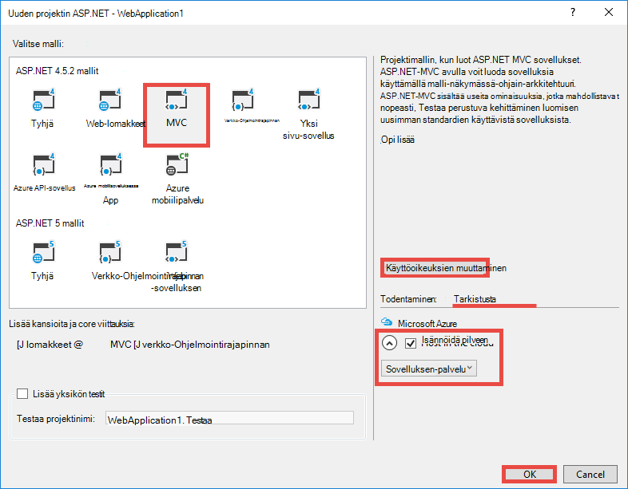

4. **Luo sovelluksen palvelu** -valintaikkunasta Valitse **Lisää tili** (ja valitse avattavasta valikosta **Lisää tili** ) kirjautua Azure-tili.

5. Kun kirjautuneena määrittäminen web Appissa. Luo resurssiryhmä ja uuden sovelluksen palvelun suunnitelman valitsemalla vastaaviin **Uusi** -painiketta. Valitse **Selaa Azure lisäpalveluja** Jatka.

    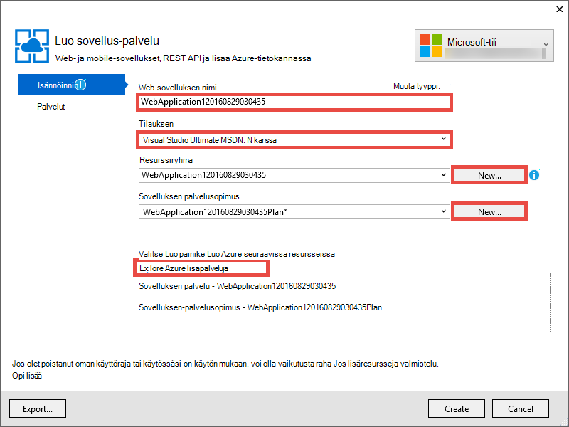

6. Valitse **palvelut** -välilehden **+** SQL-tietokantaan, kun sovellus lisätään. 

    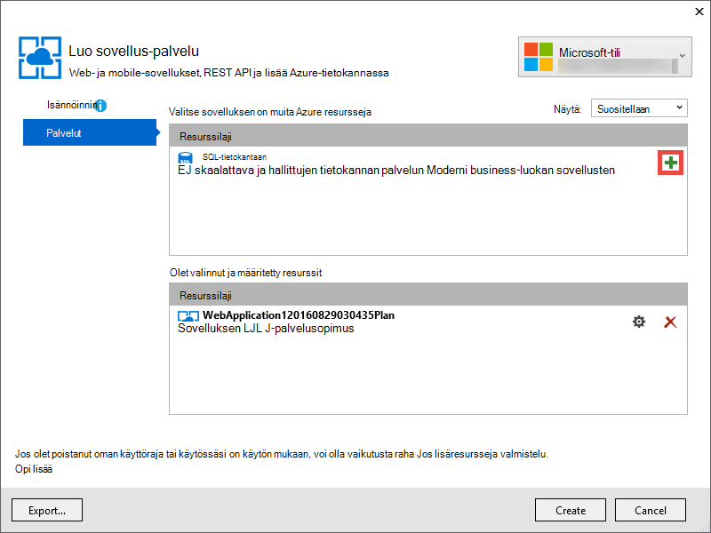

7. Valitse **Määrittäminen SQL-tietokantaan**, SQL Server-esiintymän **Uusi** .

8. **Määritä SQL Server**määrittää SQL Server-esiintymän. Valitse **OK**, **OK**ja **Luo** käyttö sovelluksen luominen Azure-tietokannassa.

9. **Azure App aktiviteetin**näet, kun sovellus luominen on valmis. Valitse * *Julkaise &lt; *appname*> tämän Web App nyt**Valitse **Julkaise **. 

    Visual Studio on valmis, kun se Julkaise-sovellus avautuu selaimessa. 

    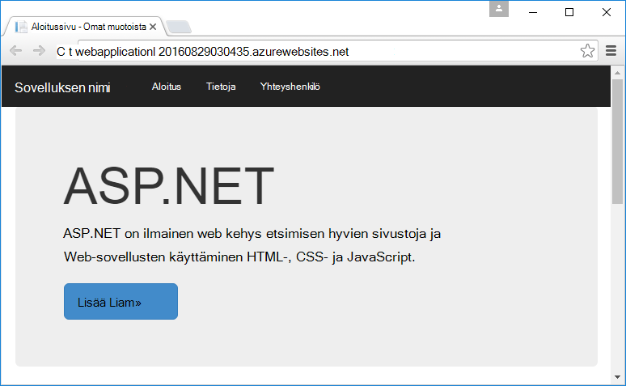

## Todennus- ja kansion käytön määrittäminen

1. Kirjaudu sisään [Azure portal](https://portal.azure.com).

2. Vasemmasta valikosta, valitse **Sovelluksen palvelut** > **&lt;*appname*>** > **todennusta / luvan **.

    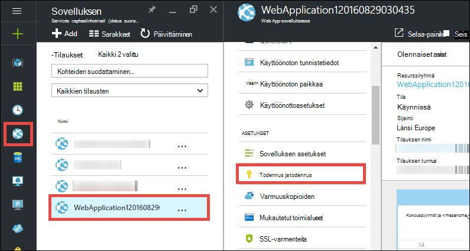

3. Azure Active Directory-todennus käyttöön **valitsemalla** > **Azure Active Directory** > **Express** > **OK**.

    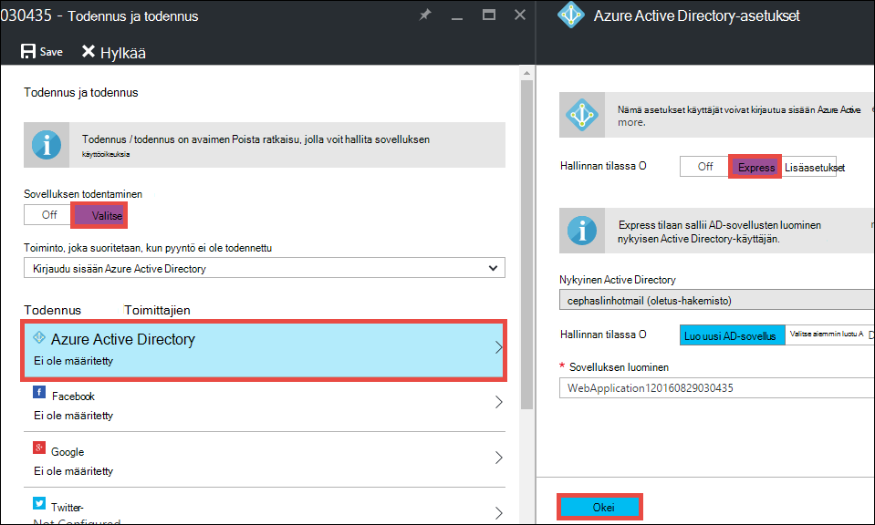

4. Valitse **Tallenna** -painikkeita.

    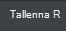

    Kun todennusasetukset tallennetaan onnistuneesti, yritä siirtyminen sovelluksesi uudelleen selaimessa. Oletusasetuksia pakottaa todentamisen koko-sovellukseen. Jos et ole jo kirjautunut, sinut ohjataan kirjautumisen näyttöön. Kun kirjautunut sisään, näyttöön tulee suojattuja HTTPS sovelluksen. Seuraavaksi sinun on otettava käyttöön directory tietojen käytön. 

5. Siirry [perinteiseen portal](https://manage.windowsazure.com).

6. Valitse vasemmasta valikosta **Active Directory** > **Oletus Directory** > **sovellusten** > **&lt;*appname*> **.

    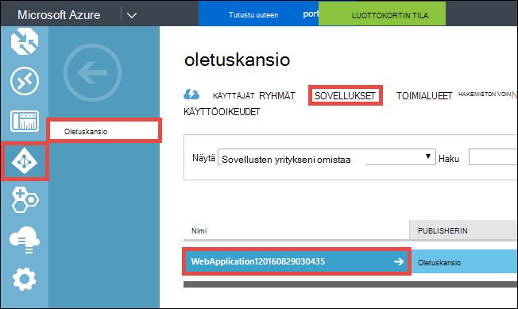

    Tämä on Azure Active Directory-sovellus, joka luodaan sovelluksen palvelun käyttöön luvan / käyttöoikeuksien.

7. Valitse **käyttäjät** ja **ryhmät** , varmista, että kaikki käyttäjät ja ryhmät-kansio. Jos näin ei ole, Luo muutaman testikäyttäjän ja ryhmät.

    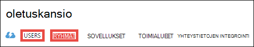

7. Valitse **Määritä** tämän sovelluksen määrittämisestä.

8. Siirry **näppäimet** -osioon ja Lisää avain valitsemalla kesto. Sitten **Valtuutetut käyttöoikeudet** ja valitse **kansio tietojen**. Valitse **Tallenna**.

    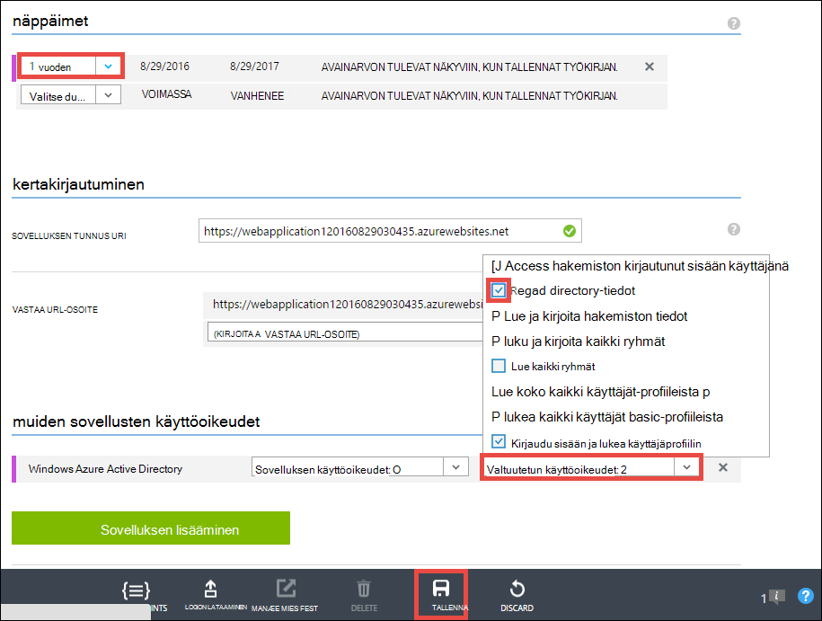

8. Kun asetukset on tallennettu, vieritä takaisin ylös **näppäimet** -kohta ja valitse **Kopioi** -painiketta voit kopioida asiakas-näppäintä. 

    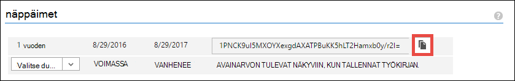

    >[AZURE.IMPORTANT] Jos siirryt pois tältä sivulta nyt, et voi käyttää asiakkaan avaimeen niitä uudelleen.

9. Seuraavaksi haluat määrittää koodiin avaimeen. Kirjaudu sisään [Azure resurssin Explorer](https://resources.azure.com) Azure-tilisi kanssa.

10. Valitse sivun yläreunassa muokkaamiseen Azure resurssin Explorerissa **Luku-/ kirjoitusoikeudet** .

    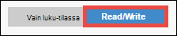

11. Etsi sovellus, joka sijaitsee tilaukset todennusasetukset > * *&lt;*subscriptionname*>** > **resourceGroups** > **&lt;*resourcegroupname*>** > **tarjoajien** > **Microsoft.Web** > **sivustojen** > **&lt;*appname*>** > **config** > **authsettings **.

12. Valitse **Muokkaa**.

    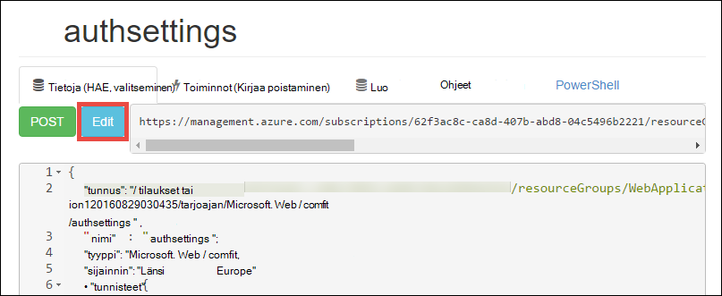

13. Määritä kieleksi-ruudussa `clientSecret` ja `additionalLoginParams` ominaisuudet toimimalla seuraavasti.

        ...
        "clientSecret": "<client key from the Azure Active Directory application>",
        ...
        "additionalLoginParams": ["response_type=code id_token", "resource=https://graph.windows.net"],
        ...

14. Valitse **Sijoita** yläreunasta, kun haluat lähettää tekemäsi muutokset.

    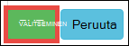

14. Nyt voit testata, jos sinulla on lupa käyttää Azure Active Directory Graph-Ohjelmointirajapinnan tunnuksen, siirtymällä * *https://&lt;*appname*>.azurewebsites.net/.auth/me** selaimessa. Jos olet määrittänyt kaikki oikein, näkyviin tulee `access_token` JSON-vastauksen-ominaisuutta.

    `~/.auth/me` URL-polku hallitsee sovelluksen todentaminen / lupa antaa kaikki tiedot liittyvät todennetut istunto. Lisätietoja on artikkelissa [todennus- ja Azure sovelluksen-palvelussa](../app-service/app-service-authentication-overview.md).

    >[AZURE.NOTE] `access_token` On voimassaoloajan. Kuitenkin App todentaminen / luvan voit suojaustunnuksen päivityksen toiminnot kanssa `~/.auth/refresh`. Lisätietoja sen käyttämisestä on artikkelissa     [Palvelun tunnuksen Sovelluskaupasta](https://cgillum.tech/2016/03/07/app-service-token-store/).

Seuraavaksi tehtävä joitakin hyödyllisiä directory tiedoilla.

## Sovelluksen lisääminen liiketoiminta-toiminnot

Nyt voit luoda yksinkertaisen CRUD työn kohteiden seuranta.  

5.  Luo luokkatiedosto nimeltä WorkItem.cs ~\Models-kansio ja korvaa `public class WorkItem {...}` se seuraavalla koodilla:

        using System.ComponentModel.DataAnnotations;

        public class WorkItem
        {
            [Key]
            public int ItemID { get; set; }
            public string AssignedToID { get; set; }
            public string AssignedToName { get; set; }
            public string Description { get; set; }
            public WorkItemStatus Status { get; set; }
        }

        public enum WorkItemStatus
        {
            Open,
            Investigating,
            Resolved,
            Closed
        }

7.  Luo projektin ansiosta uusi malli käyttää rakennustelineet logiikan Visual Studiossa.

8.  Uuden scaffolded kohteen `WorkItemsController` ~\Controllers kansioon (hiiren kakkospainikkeen **ohjaimet**, valitse **Lisää**ja valitse **Uusi scaffolded kohde**). 

9.  Valitse **MVC 5 ohjauskoneen näkymiä, käyttämällä kohde Framework** ja sitten **Lisää**.

10. Valitse malli, joka on luotu ja valitse sitten **+** ja sitten **Lisää** tietojen kontekstia ja valitse sitten **Lisää**.

    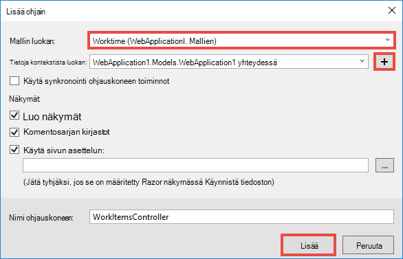

14. ~\Views\WorkItems\Create.cshtml (automaattisesti scaffolded kohdetta), Etsi `Html.BeginForm` helper menetelmä ja tehdä korostetun seuraavat muutokset:  
<pre class="prettyprint">
    @modelWebApplication1.Models.WorkItem

    @{ViewBag.Title = &quot;luominen&quot;; }

    &lt;H2&gt;luominen&lt;/h2&gt;

    @using(Html.BeginForm (<mark>&quot;Luo&quot;, &quot;WorkItems&quot;, FormMethod.Post, uusi {id = &quot;päälomake&quot; }</mark>)) {@Html.AntiForgeryToken()

        &lt;div class=&quot;form-horizontal&quot;&gt;
            &lt;h4&gt;WorkItem&lt;/h4&gt;
            &lt;hr /&gt;
            @Html.ValidationSummary(true, &quot;&quot;, new { @class = &quot;text-danger&quot; })
            &lt;div class=&quot;form-group&quot;&gt;
                @Html.LabelFor(model =&gt; model.AssignedToID, htmlAttributes: new { @class = &quot;control-label col-md-2&quot; })
                &lt;div class=&quot;col-md-10&quot;&gt;
                    @Html.EditorFor(model =&gt; model.AssignedToID, new { htmlAttributes = new { @class = &quot;form-control&quot;<mark>, @type = &quot;hidden&quot;</mark> } })
                    @Html.ValidationMessageFor(model =&gt; model.AssignedToID, &quot;&quot;, new { @class = &quot;text-danger&quot; })
                &lt;/div&gt;
            &lt;/div&gt;

            &lt;div class=&quot;form-group&quot;&gt;
                @Html.LabelFor(model =&gt; model.AssignedToName, htmlAttributes: new { @class = &quot;control-label col-md-2&quot; })
                &lt;div class=&quot;col-md-10&quot;&gt;
                    @Html.EditorFor(model =&gt; model.AssignedToName, new { htmlAttributes = new { @class = &quot;form-control&quot; } })
                    @Html.ValidationMessageFor(model =&gt; model.AssignedToName, &quot;&quot;, new { @class = &quot;text-danger&quot; })
                &lt;/div&gt;
            &lt;/div&gt;

            &lt;div class=&quot;form-group&quot;&gt;
                @Html.LabelFor(model =&gt; model.Description, htmlAttributes: new { @class = &quot;control-label col-md-2&quot; })
                &lt;div class=&quot;col-md-10&quot;&gt;
                    @Html.EditorFor(model =&gt; model.Description, new { htmlAttributes = new { @class = &quot;form-control&quot; } })
                    @Html.ValidationMessageFor(model =&gt; model.Description, &quot;&quot;, new { @class = &quot;text-danger&quot; })
                &lt;/div&gt;
            &lt;/div&gt;

            &lt;div class=&quot;form-group&quot;&gt;
                @Html.LabelFor(model =&gt; model.Status, htmlAttributes: new { @class = &quot;control-label col-md-2&quot; })
                &lt;div class=&quot;col-md-10&quot;&gt;
                    @Html.EnumDropDownListFor(model =&gt; model.Status, htmlAttributes: new { @class = &quot;form-control&quot; })
                    @Html.ValidationMessageFor(model =&gt; model.Status, &quot;&quot;, new { @class = &quot;text-danger&quot; })
                &lt;/div&gt;
            &lt;/div&gt;

            &lt;div class=&quot;form-group&quot;&gt;
                &lt;div class=&quot;col-md-offset-2 col-md-10&quot;&gt;
                    &lt;input type=&quot;submit&quot; value=&quot;Create&quot; class=&quot;btn btn-default&quot;<mark> id=&quot;submit-button&quot;</mark> /&gt;
                &lt;/div&gt;
            &lt;/div&gt;
        &lt;/div&gt;
    }

    &lt;jako&gt;
    @Html.ActionLink(&quot;Palaa luetteloon&quot;, &quot;indeksi&quot;) &lt;/div    &gt;

    @sectionKomentosarjojen { @Scripts.Render( &quot;~/bundles/jqueryval&quot;)     <mark> &lt;komentosarjan&gt; 
     / / henkilöiden ja ryhmien valitsin koodin var maxResultsPerPage = 14;         var-syöte = document.getElementById (&quot;AssignedToName&quot;);

            // Access token from request header, and tenantID from claims identity
            var token = &quot;@Request.Headers[&quot;X-MS-TOKEN-AAD-ACCESS-TOKEN&quot;]&quot;;
            var tenant =&quot;@(System.Security.Claims.ClaimsPrincipal.Current.Claims
                            .Where(c => c.Type == &quot;http://schemas.microsoft.com/identity/claims/tenantid&quot;)
                            .Select(c => c.Value).SingleOrDefault())&quot;;

            var picker = new AadPicker(maxResultsPerPage, input, token, tenant);

            // Submit the selected user/group to be asssigned.
            $(&quot;#submit-button&quot;).click({ picker: picker }, function () {
                if (!picker.Selected())
                    return;
                $(&quot;#main-form&quot;).get()[0].elements[&quot;AssignedToID&quot;].value = picker.Selected().objectId;
            });
        &lt;/script&gt;</mark>
    }
    </pre>
    
    Huomaa, että `token` ja `tenant` avulla `AadPicker` objektin Azure Active Directory Graph API soittamiseen. Haluat lisätä `AadPicker` myöhemmin.   
    
    >[AZURE.NOTE] Vain sekä saat `token` ja `tenant` asiakkaan kanssa reunasta `~/.auth/me`, mutta olisi palvelimen kutsun. Esimerkki:
    >  
    >     $.ajax({
    >         dataType: "json",
    >         url: "/.auth/me",
    >         success: function (data) {
    >             var token = data[0].access_token;
    >             var tenant = data[0].user_claims
    >                             .find(c => c.typ === 'http://schemas.microsoft.com/identity/claims/tenantid')
    >                             .val;
    >         }
    >     });
    
15. Muutokset kanssa ~ \Views\WorkItems\Edit.cshtml.

15. `AadPicker` Objekti on määritetty komentosarja, jonka haluat lisätä projektiin. Napsauta ~\Scripts-kansiota hiiren kakkospainikkeella, valitse **Lisää**ja sitten **JavaScript-tiedosto**. Kirjoita `AadPickerLibrary` , tiedostonimi ja valitse **OK**.

16. Kopioi sisältö [tähän](https://raw.githubusercontent.com/cephalin/active-directory-dotnet-webapp-roleclaims/master/WebApp-RoleClaims-DotNet/Scripts/AadPickerLibrary.js) ~ \Scripts\AadPickerLibrary.js.

    Komentosarjaa `AadPicker` objekti kutsuu [Azure Active Directory Graph API](https://msdn.microsoft.com/Library/Azure/Ad/Graph/api/api-catalog) Etsi käyttäjät ja ryhmät, jotka vastaavat syöte.  

17. ~\Scripts\AadPickerLibrary.js käytetään myös [jQuery Käyttöliittymän automaattisen täydennyksen widget](https://jqueryui.com/autocomplete/). Haluat niin jQuery Käyttöliittymän lisääminen projektiin. Projektin hiiren kakkospainikkeella ja valitse **NuGet pakettien hallinta**.

18. NuGet paketin hallinta valitsemalla Selaa, **jquery-käyttöliittymän** Kirjoita etsintäpalkin ja sitten **jQuery.UI.Combined**.

    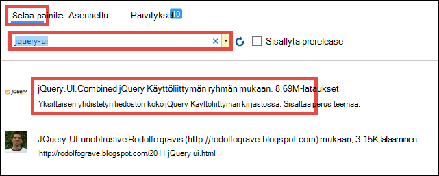

19. Napsauta oikeanpuoleisessa ruudussa valitsemalla **Asenna**ja valitse sitten **OK** , jos haluat jatkaa.

19. Avaa ~\App_Start\BundleConfig.cs ja tehdä korostetun seuraavat muutokset:  
    <pre class="prettyprint">
    julkinen staattinen void RegisterBundles(BundleCollection bundles) {nippujen. Lisää (uusi ScriptBundle (&quot;~/bundles/jquery&quot;). Sisällytä ( &quot;~/Scripts/jquery-{version}.js&quot;<mark>, &quot;~/Scripts/jquery-ui-{version}.js&quot;, &quot;~/Scripts/AadPickerLibrary.js&quot;</mark>));

        bundles.Add(new ScriptBundle(&quot;~/bundles/jqueryval&quot;).Include(
                    &quot;~/Scripts/jquery.validate*&quot;));

        // Use the development version of Modernizr to develop with and learn from. Then, when you&#39;re
        // ready for production, use the build tool at http://modernizr.com to pick only the tests you need.
        bundles.Add(new ScriptBundle(&quot;~/bundles/modernizr&quot;).Include(
                    &quot;~/Scripts/modernizr-*&quot;));

        bundles.Add(new ScriptBundle(&quot;~/bundles/bootstrap&quot;).Include(
                    &quot;~/Scripts/bootstrap.js&quot;,
                    &quot;~/Scripts/respond.js&quot;));

        bundles.Add(new StyleBundle(&quot;~/Content/css&quot;).Include(
                    &quot;~/Content/bootstrap.css&quot;,
                    &quot;~/Content/site.css&quot;<mark>,
                    &quot;~/Content/themes/base/jquery-ui.css&quot;</mark>));
    }
    </pre>

    On useita performant tapoja sovelluksen JavaScript- ja CSS-tiedostojen hallinta. Yksinkertaisuuden vain kuitenkin aiot liitettyjen kuittausten-niput, joka on ladattu jokaisen näkymän.

12. Valitse lopuksi ~ \Global.asax, Lisää seuraava rivi koodin `Application_Start()` menetelmä. `Ctrl`+`.`kunkin nimeämiskäytäntö tarkkuus virheen korjaamiseksi.

        AntiForgeryConfig.UniqueClaimTypeIdentifier = ClaimTypes.NameIdentifier;
    
    > [AZURE.NOTE] Sinun on tämän rivin koodin, koska MVC oletusmallin käyttää <code>[ValidateAntiForgeryToken]</code> korostusta joihinkin toiminnot. [Brock Allen](https://twitter.com/BrockLAllen)     [MVC 4, AntiForgeryToken](http://brockallen.com/2012/07/08/mvc-4-antiforgerytoken-and-claims/) ja vaateita koskevat rajoitukset on kuvattu toiminnan vuoksi HTTP-viesti saattaa epäonnistua tehostetut suojaustunnuksen vahvistus, koska:

    > - Azure Active Directory ei lähetä http://schemas.microsoft.com/accesscontrolservice/2010/07/claims/identityprovider, joka vaaditaan oletusarvoisesti tehostetut-tunnuksen.
    > - Jos Azure Active Directory on synkronoitu AD FS directory, AD FS luota oletusarvoisesti ei lähetä http://schemas.microsoft.com/accesscontrolservice/2010/07/claims/identityprovider vaatimus joko, vaikka voit määrittää manuaalisesti, AD FS Lähetä tämä vaatimus.

    > `ClaimTypes.NameIdentifies`määrittää vaatimus `http://schemas.xmlsoap.org/ws/2005/05/identity/claims/nameidentifier`, jotka Azure Active Directory.  

20. Nyt julkaisemaan muutokset. Projektin hiiren kakkospainikkeella ja valitse **Julkaise**.

21. Valitse **asetukset**, varmista, että on SQL-tietokantaan yhteysmerkkijonon, valitsemalla **Päivitä tietokannan** rakenteen muutokset malli ja valitse **Julkaise**.

    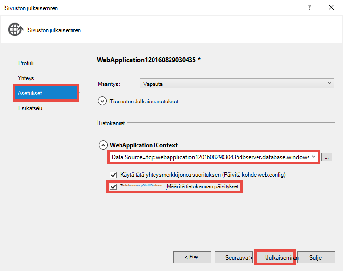

22. Siirry selaimessa https://&lt;*appname*>.azurewebsites.net/workitems ja valitse **Luo uusi**.

23. Valitse **AssignedToName** -ruudusta. Pitäisi tulla näkyviin käyttäjät ja ryhmät Azure Active Directory-vuokraajasta avattavassa valikossa. Voit suodattaa kirjoittamalla tai ottaa `Up` tai `Down` näppäintä tai valitse käyttäjän tai ryhmän. 

    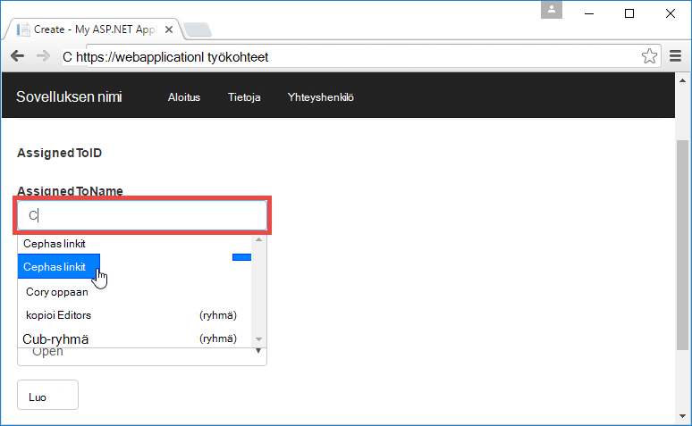

24. Valitse **Luo** , Tallenna muutokset. Valitse **Muokkaa** -luotu työnimikkeen noudata sama ongelma.

Congrats nyt käytössäsi on liiketoiminta-sovelluksen Azure-hakemisto käyttö! Ei, useampia Tee Graph-Ohjelmointirajapinnan kanssa. Katso [Azure AD Graph API viittaus](https://msdn.microsoft.com/library/azure/ad/graph/api/api-catalog).

## Seuraava vaihe

Jos tarvitset azure liiketoiminta-sovelluksen Roolipohjainen käyttöoikeuksien valvonta (RBAC), katso lisätietoja Azure Active Directory-ryhmän otoksen [Web App-sovelluksen RoleClaims-DotNet](https://github.com/Azure-Samples/active-directory-dotnet-webapp-roleclaims) . Sen avulla voit roolit Azure Active Directory-sovelluksen ottaminen käyttöön ja määritä käyttäjät, joilla `[Authorize]` ulkoasu.

Jos liiketoiminta-sovellus on pääsy paikalliset tiedot, katso [Access paikallisen resurssien hybrid yhteyksien Azure sovelluksen-palvelun avulla](web-sites-hybrid-connection-get-started.md).

## Muita resursseja

- [Todennus- ja Azure sovelluksen-palvelussa](../app-service/app-service-authentication-overview.md)
- [Todentamismenetelmä paikallisen Active Directory Azure-sovelluksessa](web-sites-authentication-authorization.md)
- [Liiketoiminta-sovelluksen luominen Azure AD FS-todennuksen kanssa](web-sites-dotnet-lob-application-adfs.md)
- [Sovelluksen palvelun Auth ja Azure AD-kaavion Ohjelmointirajapinta](https://cgillum.tech/2016/03/25/app-service-auth-aad-graph-api/)
- [Microsoft Azure Active Directory-mallit ja ohjeet](https://github.com/AzureADSamples)
- [Azure Active Directory tuetut tunnuksen ja varaa tyypit](http://msdn.microsoft.com/library/azure/dn195587.aspx)

[Protect the Application with SSL and the Authorize Attribute]: web-sites-dotnet-deploy-aspnet-mvc-app-membership-oauth-sql-database.md#protect-the-application-with-ssl-and-the-authorize-attribute
