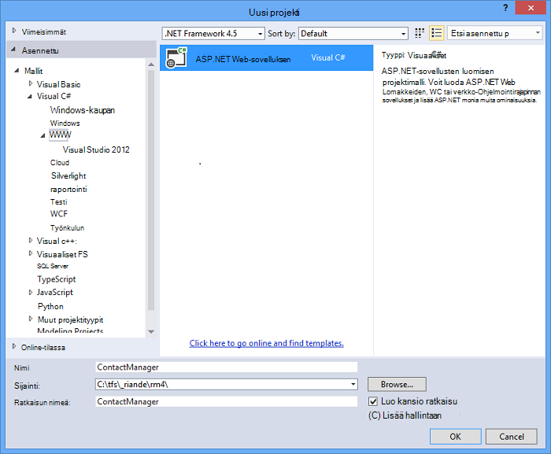
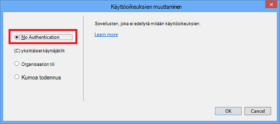
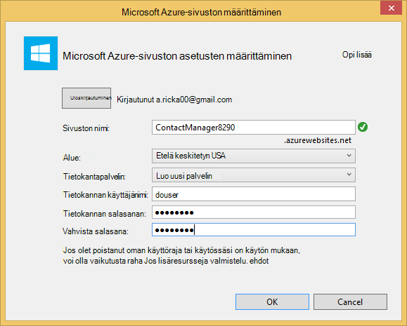
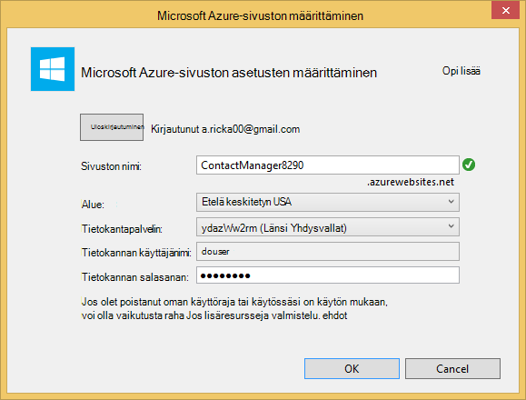
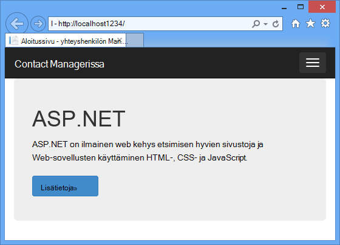
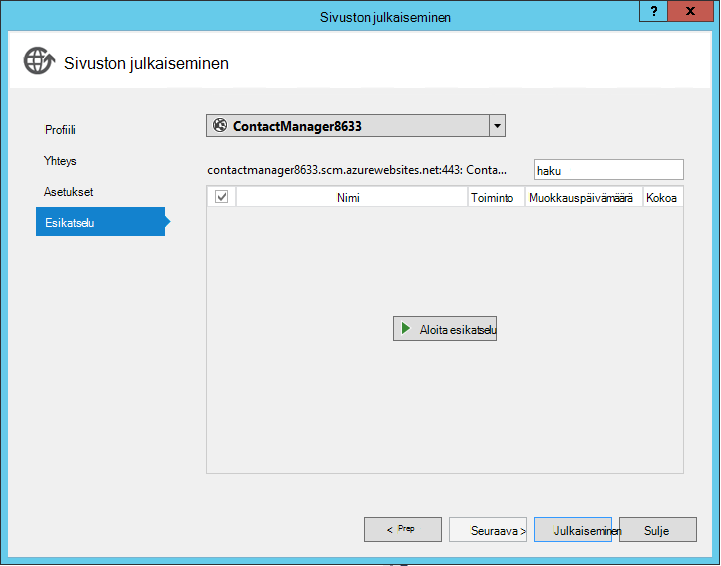
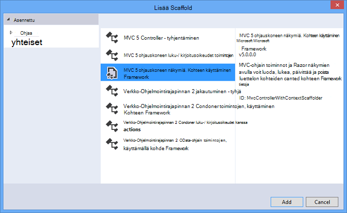
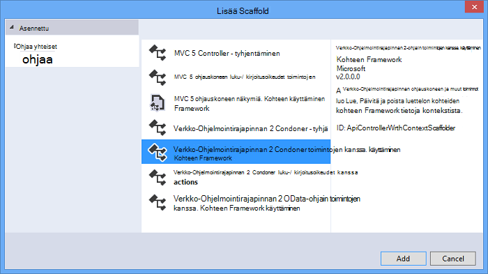
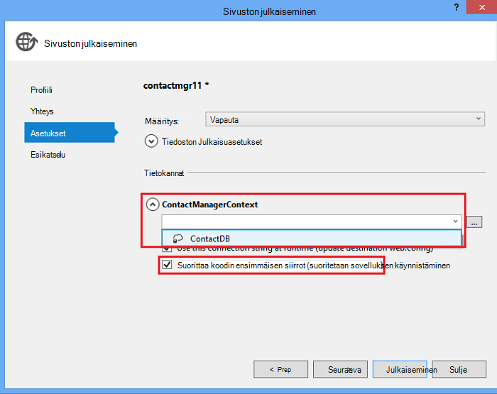

<properties 
    pageTitle="ASP.NET-verkko-Ohjelmointirajapinnan ja SQL-tietokannan käyttäminen Azure App palvelun REST-palvelun luominen" 
    description="Opetusohjelma, avulla opit Ota käyttöön, joka käyttää Visual Studiossa ASP.NET Web Ohjelmointirajapinnan Azure web App-sovellus." 
    services="app-service\web" 
    documentationCenter=".net" 
    authors="Rick-Anderson" 
    writer="Rick-Anderson" 
    manager="wpickett" 
    editor=""/>

<tags 
    ms.service="app-service-web" 
    ms.workload="web" 
    ms.tgt_pltfrm="na" 
    ms.devlang="dotnet" 
    ms.topic="article" 
    ms.date="02/29/2016" 
    ms.author="riande"/>

# ASP.NET-verkko-Ohjelmointirajapinnan ja SQL-tietokannan käyttäminen Azure App palvelun REST-palvelun luominen

Tässä opetusohjelmassa näytetään käyttöönottamisesta ASP.NET web app-sovelluksessa [Azure App palvelun](http://go.microsoft.com/fwlink/?LinkId=529714) Visual Studio 2013: ssa tai Visual Studio 2013 yhteisön Edition Julkaise-ohjatun toiminnon avulla. 

Voit avata Azure-tili maksutta, ja jos sinulla ei vielä ole Visual Studio 2013, SDK asentaa automaattisesti Visual Studio 2013 Web Expressin. Näin voit aloittaa kehittäminen Azure kokonaan maksutta.

Tässä opetusohjelmassa oletetaan, että sinulla ei ole edellisen kokemus Azure avulla. Tässä opetusohjelmassa on valmis, valitse on yksinkertainen verkkosovellukseen ylöspäin ja suorittamalla pilveen.
 
Opit:

* Ottamisesta käyttöön tietokoneen Azure kehittämiseen asentamalla Azure SDK-paketissa.
* Voit luoda Visual Studio ASP.NET MVC 5 projektin ja julkaista sen Azure-sovellukseen.
* ASP.NET-verkko-Ohjelmointirajapinnan käyttäminen käyttöön Restful-Ohjelmointirajapinta kutsuja.
* Miten tiedot tallennetaan Azure SQL-tietokannan avulla.
* Voit julkaista Azure sovellusten päivitykset.

Luot yksinkertaisen yhteystietoluettelon web-sovelluksen, joka perustuu ASP.NET MVC 5 ja käyttää ADO.NET-kohteen Framework tietokannan käytön. Seuraavassa kuvassa näkyy valmiin sovelluksen:

![näyttökuva web-sivusto][intro001]

<!-- the next line produces the "Set up the development environment" section as see at http://azure.microsoft.com/documentation/articles/web-sites-dotnet-get-started/ -->
[AZURE.INCLUDE [create-account-and-websites-note](../../includes/create-account-and-websites-note.md)]

### Projektin luominen

1. Käynnistä Visual Studio 2013.
1. Valitse **Tiedosto** -valikosta **Uusi projekti**.
3. **Uusi projekti** -valintaikkunassa Laajenna **Visual C#** ja valitse **Verkko** ja valitse sitten **ASP.NET Web-sovelluksen**. Sovelluksen **ContactManager** nimeä ja valitse **OK**.

    

1. **Uusi ASP.NET-projekti** -valintaikkunassa valitse **MVC** mallia, tarkista **Verkko-Ohjelmointirajapinnan** ja valitse sitten **Muuta käyttöoikeuksien**.

1. **Muuta todennus** -valintaikkunassa **Ei todennus**ja valitse sitten **OK**.

    

    Olet luomassa sovelluksen malli ei tarvitse ominaisuuksia, jotka vaativat käyttäjät voivat kirjautua. Lisätietoja todennus- ja ominaisuudet ottamisesta käyttöön on kohdassa [Vaiheisiin](#nextsteps) jäljempänä tässä opetusohjelmassa. 

1. **Uusi ASP.NET-projekti** -valintaikkunassa Varmista, että **Host pilveen** on valittuna ja valitse **OK**.

Jos et ole aiemmin kirjautunut Azure avulla, voit pyydetään kirjautumaan.

1. Ohjatun määritystoiminnon ehdottaa *ContactManager* perusteella yksilöllinen nimi (Katso alla olevassa kuvassa). Valitse alue lähellä. Voit löytää pienin viive tietokeskuksen [azurespeed.com](http://www.azurespeed.com/ "AzureSpeed.com") . 
2. Jos et ole luonut ennen tietokantapalvelimeen, valitse **Luo uusi server**-tietokannan käyttäjänimi ja salasana.

    

Jos sinulla on tietokantapalvelimeen, käytä, voit luoda uuden tietokannan. Tietokannan palvelimia arvokkaita resurssin ja haluat yleensä useiden tietokantojen luominen samassa palvelimessa testaus ja kehitys sijaan luominen tietokantapalvelimeen tietokantaa kohden. Varmista, että sivuston ja tietokanta on samassa alueella.

### Määrittää sivun ylä- ja alatunniste

1. **Ratkaisunhallinnassa**Laajenna *Views\Shared* -kansio ja Avaa *_Layout.cshtml* -tiedosto.

    ![Napsauta ratkaisunhallinnassa _Layout.cshtml][newapp004]

1. Korvaa *Views\Shared_Layout.cshtml* -tiedoston sisällön seuraava koodi:

        <!DOCTYPE html>
        <html lang="en">
        <head>
            <meta charset="utf-8" />
            <title>@ViewBag.Title - Contact Manager</title>
            <link href="~/favicon.ico" rel="shortcut icon" type="image/x-icon" />
            <meta name="viewport" content="width=device-width" />
            @Styles.Render("~/Content/css")
            @Scripts.Render("~/bundles/modernizr")
        </head>
        <body>
            <header>
                

                    

                        
@Html.ActionLink("Contact Manager", "Index", "Home")

                    

                

            </header>
            

                @RenderSection("featured", required: false)
                <section class="content-wrapper main-content clear-fix">
                    @RenderBody()
                </section>
            

            <footer>
                

                    

                        
&copy; @DateTime.Now.Year - Contact Manager

                    

                

            </footer>
            @Scripts.Render("~/bundles/jquery")
            @RenderSection("scripts", required: false)
        </body>
        </html>
            
Edellä merkintä muuttuu sovelluksen nimi "Omat ASP.NET-sovelluksen" "Contact Manager-, ja se poistaa ** **Home**-, **tietoja** ja**linkkejä.

### Suorita sovellus paikallisesti

1. Paina CTRL + F5 sovelluksen käyttämiseen.
Sovelluksen aloitus-sivulla näkyy oletusselaimessa.
    

Tämä on kaikki, sinun on suoritettava nyt, jotka ottaa käyttöön Azure-sovelluksen luominen. Haluat myöhemmin lisätä tietokantatoimintoja.

## Azure sovelluksen käyttöönotto

1. Visual Studiossa Napsauta **Ratkaisunhallinnassa** projektin hiiren kakkospainikkeella ja valitse **Julkaise** pikavalikosta.

    ![Julkaise projekti-pikavalikko][PublishVSSolution]

    **Sivuston julkaiseminen** ohjattu toiminto avautuu.

12. Valitse **Julkaise**.

Visual Studio aloittaa kopioimista Azure-palvelimeen. **Tulostusikkunassa** näyttää käyttöönoton toiminnot on tehty, ja raporttien onnistumiseen käyttöönotto.

14. Oletusselain avautuu automaattisesti käyttöön sivuston URL-osoite.

    Luomasi sovellus on nyt käynnissä pilveen.
    
    ![Tehtäväluettelon kotisivulle Azure käynnissä][rxz2]

## Tietokannan lisääminen sovellukseen

Seuraavaksi Päivitä MVC-sovelluksen Lisää voi näyttää ja päivittää yhteystiedot ja tallentaa tietokannan tiedot. Sovellus käyttää kohteen Framework on luotu ja voit lukea ja päivittää tietokanta.

### Lisää mallin tietoluokkien yhteystiedot

Aloita luomalla yksinkertaisen Tietomallin koodi.

1. **Ratkaisunhallinnassa**Mallit-kansion hiiren kakkospainikkeella, valitse **Lisää**ja sitten **luokka**.

    ![Lisää luokan mallit-kansion pikavalikko][adddb001]

2. **Lisää uusi kohde** -valintaikkunassa uuden luokan tiedoston *Contact.cs*nimi ja valitse sitten **Lisää**.

    ![Lisää uusi kohde-valintaikkuna][adddb002]

3. Korvaa Contacts.cs-tiedoston sisällön seuraava koodi.

        using System.Globalization;
        namespace ContactManager.Models
        {
            public class Contact
            {
                public int ContactId { get; set; }
                public string Name { get; set; }
                public string Address { get; set; }
                public string City { get; set; }
                public string State { get; set; }
                public string Zip { get; set; }
                public string Email { get; set; }
                public string Twitter { get; set; }
                public string Self
                {
                    get { return string.Format(CultureInfo.CurrentCulture,
                         "api/contacts/{0}", this.ContactId); }
                    set { }
                }
            }
        }

**Ota yhteyttä** -luokka määrittää tiedot, jotka voit tallentaa kunkin yhteyshenkilön sekä perusavaimen ContactID, jota tarvitaan tietokanta. Saat lisätietoja tietomallien [Seuraavat vaiheet](#nextsteps) -osassa jäljempänä tässä opetusohjelmassa.

### Luo verkkosivua, sovelluksen käyttäjät voivat käsitellä yhteystiedot

ASP.NET-MVC rakennustelineet-ominaisuuden automaattisesti luoda koodi, joka suorittaa luominen, lukea, päivittää ja poistaa (CRUD)-toimintoja.

## Lisää ohjaimen ja tietojen tarkasteleminen

1. Laajenna **Ratkaisunhallinnassa**ohjaimet-kansio.

3. Luo projekti **(Ctrl + Vaihto + B)**. (Projektin täytyy luoda ennen käyttämällä rakennustelineet.) 

4. Napsauta ohjaimet-kansiota hiiren kakkospainikkeella ja valitsemalla **Lisää**ja valitse sitten **valvonta**.

    ![Lisää ohjauskoneen ohjaimet kansion pikavalikko][addcode001]

1. **Lisää Scaffold** -valintaikkunassa valitse **MVC ohjauskoneen näkymiä, käyttämällä kohde Framework** ja sitten **Lisää**.

 

6. Määritetty nimi ohjauskoneen **HomeController**. Valitse **yhteyshenkilö** malli-luokka. **Uusien tietojen konteksti** -painiketta ja Hyväksy oletusasetukset "ContactManager.Models.ContactManagerContext" **uusi tietotyyppi kontekstissa**. Valitse **Lisää**.

    Valintaikkunan kysyy: "tiedosto, jonka nimi HomeController jo olemassa. Haluatko korvata? ". Valitse **Kyllä**. Olemme ovat korvaaminen Home ohjaimen, joka on luotu uusi projekti. Käytämme uusi Home ohjaimen yhteyshenkilön luettelossamme.

    Visual Studio Luo ohjauskoneen menetelmistä ja näkymien CRUD tietokannan toimille **yhteyshenkilön** objekteja.

## Käyttöön siirrot, on luotu, lisää mallitiedot ja tietojen alustimessa ##

Seuraava tehtävä on otetaan käyttöön [Koodin ensimmäisen siirrot](http://curah.microsoft.com/55220) jotta he voivat luoda tietokannan, olet luonut tietomallin perusteella.

1. Valitse **Työkalut** -valikossa **Kirjaston pakettien hallinta** ja valitse sitten **Paketin hallinta-konsolin**.

    ![Paketin hallinta-konsolin Työkalut-valikossa][addcode008]

2. Kirjoita **Konsoli pakettien hallinta** -ikkunassa seuraava komento:

        enable-migrations 
  
    **Ota siirrot** -komento luo *siirrot* -kansio ja sanan alle kyseiseen kansioon, voit määrittää siirrot *Configuration.cs* tiedoston. 

2. Kirjoita **Konsoli pakettien hallinta** -ikkunassa seuraava komento:

        add-migration Initial

    **Lisää siirron alku** -komento luo luokan nimeltä ** &lt;date_stamp&gt;alkuperäisen** , joka luo tietokannan. ( *Alkuperäinen* ) ensimmäinen parametri on haluamaansa ja käytetään tiedoston nimeä. Näet uudet luokkatiedostot, napsauta **Ratkaisunhallinnassa**.

    **Ensimmäisen** luokan **ylös** -menetelmä luo sekä yhteystietojen taulukosta ja **alas** -menetelmän (käytetään, kun haluat palata edelliseen tilaan) pudottaa siihen.

3. Avaa *Migrations\Configuration.cs* -tiedosto. 

4. Lisää seuraavat nimitilan. 

         using ContactManager.Models;

5. *Lähde* -menetelmä korvaa seuraava koodi:
        
        protected override void Seed(ContactManager.Models.ContactManagerContext context)
        {
            context.Contacts.AddOrUpdate(p => p.Name,
               new Contact
               {
                   Name = "Debra Garcia",
                   Address = "1234 Main St",
                   City = "Redmond",
                   State = "WA",
                   Zip = "10999",
                   Email = "debra@example.com",
                   Twitter = "debra_example"
               },
                new Contact
                {
                    Name = "Thorsten Weinrich",
                    Address = "5678 1st Ave W",
                    City = "Redmond",
                    State = "WA",
                    Zip = "10999",
                    Email = "thorsten@example.com",
                    Twitter = "thorsten_example"
                },
                new Contact
                {
                    Name = "Yuhong Li",
                    Address = "9012 State st",
                    City = "Redmond",
                    State = "WA",
                    Zip = "10999",
                    Email = "yuhong@example.com",
                    Twitter = "yuhong_example"
                },
                new Contact
                {
                    Name = "Jon Orton",
                    Address = "3456 Maple St",
                    City = "Redmond",
                    State = "WA",
                    Zip = "10999",
                    Email = "jon@example.com",
                    Twitter = "jon_example"
                },
                new Contact
                {
                    Name = "Diliana Alexieva-Bosseva",
                    Address = "7890 2nd Ave E",
                    City = "Redmond",
                    State = "WA",
                    Zip = "10999",
                    Email = "diliana@example.com",
                    Twitter = "diliana_example"
                }
                );
        }

    Yllä koodi alusta yhteystiedot sisältävä tietokanta. Saat lisätietoja valuuttamuunnosten tietokannan [Virheenkorjaus kohteen Framework (EF) hidastustekniikkaa](http://blogs.msdn.com/b/rickandy/archive/2013/02/12/seeding-and-debugging-entity-framework-ef-dbs.aspx).

1. Kirjoita **Paketin hallinta-konsolin** komento:

        update-database

    ![Paketin hallinta-konsolin komennot][addcode009]

    **Päivitä tietokannan** suoritetaan ensimmäinen siirron, joka luo tietokanta. Oletusarvon mukaan tietokanta on luotu SQL Server Express LocalDB tietokannan.

1. Paina CTRL + F5 sovelluksen käyttämiseen. 

Sovelluksen näkyvät lähde-tiedot ja Muokkaa, tiedot ja poista linkkejä.

![MVC näkymiä tiedoista][rxz3]

## Näkymän muokkaaminen

1. Avaa *Views\Home\Index.cshtml* -tiedosto. Seuraavassa vaiheessa olemme korvaa koodi, joka käyttää [jQuery](http://jquery.com/) ja [Knockout.js](http://knockoutjs.com/)luodut merkinnät. Uusi koodi verkko-Ohjelmointirajapinnan ja JSON yhteystietoja hakee ja sitoo sitten yhteyshenkilön tiedot käyttämällä knockout.js Käyttöliittymän. Lisätietoja on kohdassa [Vaiheisiin](#nextsteps) jäljempänä tässä opetusohjelmassa. 

2. Korvaa tiedoston sisällön seuraava koodi.

        @model IEnumerable<ContactManager.Models.Contact>
        @{
            ViewBag.Title = "Home";
        }
        @section Scripts {
            @Scripts.Render("~/bundles/knockout")
            
        }
        <ul id="contacts" data-bind="foreach: contacts">
            <li class="ui-widget-content ui-corner-all">
                <h1 data-bind="text: Name" class="ui-widget-header"></h1>
                

                

                    ,
                    
                    
                

                

                
Email?

                

                
Twitter?

                
<a data-bind="attr: { href: Self }, click: $root.removeContact" class="removeContact ui-state-default ui-corner-all">Remove</a>

            </li>
        </ul>
        <form id="addContact" data-bind="submit: addContact">
            <fieldset>
                <legend>Add New Contact</legend>
                <ol>
                    <li>
                        <label for="Name">Name</label>
                        <input type="text" name="Name" />
                    </li>
                    <li>
                        <label for="Address">Address</label>
                        <input type="text" name="Address" >
                    </li>
                    <li>
                        <label for="City">City</label>
                        <input type="text" name="City" />
                    </li>
                    <li>
                        <label for="State">State</label>
                        <input type="text" name="State" />
                    </li>
                    <li>
                        <label for="Zip">Zip</label>
                        <input type="text" name="Zip" />
                    </li>
                    <li>
                        <label for="Email">E-mail</label>
                        <input type="text" name="Email" />
                    </li>
                    <li>
                        <label for="Twitter">Twitter</label>
                        <input type="text" name="Twitter" />
                    </li>
                </ol>
                <input type="submit" value="Add" />
            </fieldset>
        </form>

3. Sisällön kansiota hiiren kakkospainikkeella ja valitse **Lisää**ja valitse sitten **Uusi kohde...**.

    ![Lisää tyylisivu sisällön kansion pikavalikko][addcode005]

4. **Lisää uusi kohde** -valintaikkunassa Kirjoita **tyylin** ylemmässä oikean hakuruutuun ja valitse sitten **Tyylisivu**.
    ![Lisää uusi kohde-valintaikkuna][rxStyle]

5. Nimeä tiedosto *Contacts.css* ja sitten **Lisää**. Korvaa tiedoston sisällön seuraava koodi.
    
        .column {
            float: left;
            width: 50%;
            padding: 0;
            margin: 5px 0;
        }
        form ol {
            list-style-type: none;
            padding: 0;
            margin: 0;
        }
        form li {
            padding: 1px;
            margin: 3px;
        }
        form input[type="text"] {
            width: 100%;
        }
        #addContact {
            width: 300px;
            float: left;
            width:30%;
        }
        #contacts {
            list-style-type: none;
            margin: 0;
            padding: 0;
            float:left;
            width: 70%;
        }
        #contacts li {
            margin: 3px 3px 3px 0;
            padding: 1px;
            float: left;
            width: 300px;
            text-align: center;
            background-image: none;
            background-color: #F5F5F5;
        }
        #contacts li h1
        {
            padding: 0;
            margin: 0;
            background-image: none;
            background-color: Orange;
            color: White;
            font-family: Trebuchet MS, Tahoma, Verdana, Arial, sans-serif;
        }
        .removeContact, .viewImage
        {
            padding: 3px;
            text-decoration: none;
        }

    Käytämme tätä tyylisivua asettelun, värit ja yhteystietojen hallinta-sovelluksessa käytettyjen tyylien.

6. Avaa *App_Start\BundleConfig.cs* -tiedosto.

7. Lisää seuraava koodi rekisteröidä [syrjäytyksen](http://knockoutjs.com/index.html "KO") laajennus.

        bundles.Add(new ScriptBundle("~/bundles/knockout").Include(
                    "~/Scripts/knockout-{version}.js"));
    Tässä esimerkissä yksinkertaistaa dynaaminen JavaScript-koodia, joka käsittelee näytön mallit syrjäytyksen avulla.

8. Muokkaa rekisteröidä *contacts.css* tyylisivu sisällön tai css-merkintä. Muuta seuraava komento:

                 bundles.Add(new StyleBundle("~/Content/css").Include(
                   "~/Content/bootstrap.css",
                   "~/Content/site.css"));
Seuraavasti:

        bundles.Add(new StyleBundle("~/Content/css").Include(
                   "~/Content/bootstrap.css",
                   "~/Content/contacts.css",
                   "~/Content/site.css"));

1. Paketin hallinta-konsolin suorittamalla seuraavan komennon syrjäytyksen asentamiseksi.

        Install-Package knockoutjs

## Lisää verkko-Ohjelmointirajapinnan Restful liittymän ohjain

1. **Ratkaisunhallinnassa**ohjaimet hiiren kakkospainikkeella ja valitse **Lisää** ja sitten **ohjauskoneen...** 

1. **Lisää Scaffold** -valintaikkunassa Anna **Web API 2-ohjain toimintojen, käyttämällä kohde Framework** ja valitse sitten **Lisää**.

    

4. Kirjoita **Lisää Controller** -valintaikkunassa ohjauskoneen nimeksi "ContactsController". Valitse "yhteystieto (ContactManager.Models)- **malli-luokka**.  Säilytä oletusarvo **tietojen konteksti-luokka**. 

6. Valitse **Lisää**.

### Suorita sovellus paikallisesti

1. Paina CTRL + F5 sovelluksen käyttämiseen.

    ![Indeksi-sivu][intro001]

2. Yhteystiedon ja valitse sitten **Lisää**. Sovelluksen kotisivulle palauttaa, ja näyttää kirjoittamasi yhteyshenkilöä.

    ![Indeksi-sivu, jossa tehtävät-luettelokohteet][addwebapi004]

3. Selaimen Liitä **/api/contacts** URL-osoite.

    Tuloksena oleva URL-osoite muistuttaa http://localhost:1234/api ja yhteystiedot. Olet lisännyt RESTful verkossa API palauttaa tallennettuja yhteystietoja. Firefox ja Chrome näyttää tiedot XML-muodossa.

    ![Indeksi-sivu, jossa tehtävät-luettelokohteet][rxFFchrome]
    

    IE kehottaa sinua avaamaan tai tallentamaan yhteystiedot.

    ![Verkko-Ohjelmointirajapinnan Tallenna valintaikkuna][addwebapi006]
    
    
    Voit avata palautetut yhteystiedot Muistiossa tai selaimella.
    
    Tämä tulos on käytetty toisessa sovelluksessa, kuten mobile verkkosivulle tai sovelluksen.

    ![Verkko-Ohjelmointirajapinnan Tallenna valintaikkuna][addwebapi007]

    **Suojausvaroitus**: Tässä vaiheessa sovellus on suojaamattoman ja koske CSRF hyökkäyksen. Myöhemmin-opetusohjelman on poistaa tätä. Katso lisätietoja [estää sivustojenvälisen pyytää väärennös (CSRF) hyökkäykset][prevent-csrf-attacks].
## XSRF suojaaminen

Sivustojenvälisen pyynnön väärennös (tunnetaan myös nimellä XSRF tai CSRF) on hyökkäys web isännöimä sovellukset, jolla haitallisen sivuston voivat vaikuttaa käyttäjän selaimeen ja selaimen luottaa sivustoa vuorovaikutuksesta vastaan. Nämä kalastelu on mahdollista, koska selaimet lähetetään automaattisesti jokaisen pyynnön ja tunnusten todennus sivustoon. Esimerkki kanonisesta on todennus-eväste, kuten ASP. VERKON käyttäjän todennusmenetelmien lippu. Kuitenkin sivustot, jonka avulla kaikki pysyvän todennus-järjestelmä (kuten Windows-todennuksen, Basic ja niin edelleen) voidaan kohdistaa nämä kalastelu mukaan.

Tietojen kalastelu-hyökkäystä poikkeavat XSRF hyökkäyksen. Tietojen kalastelu edellyttävät uhri vuorovaikutuksen. Tietojen kalastelu-hyökkäystä haitallisen sivuston jäljitellä kohdesivuston ja kyselyjä luottamuksellisten tietojen antaminen hän on huijattu uhri. XSRF hyökkäys on usein ei toimia tarpeen uhri. Hän on sen sijaan käyttäisit lähettäminen automaattisesti kaikki asianmukaiset evästeet kohde-sivuston selaimessa.

Lisätietoja on kohdassa [Avaa Web-sovelluksen suojaus-projekti](https://www.owasp.org/index.php/Main_Page) (OWASP) [XSRF](https://www.owasp.org/index.php/Cross-Site_Request_Forgery_(CSRF)).

1. **Ratkaisunhallinnassa** **ContactManager** projektin hiiren kakkospainikkeella ja valitse **Lisää** ja valitse sitten **luokan**.

2. Nimeä tiedosto *ValidateHttpAntiForgeryTokenAttribute.cs* ja lisää seuraava koodi:

        using System;
        using System.Collections.Generic;
        using System.Linq;
        using System.Net;
        using System.Net.Http;
        using System.Web.Helpers;
        using System.Web.Http.Controllers;
        using System.Web.Http.Filters;
        using System.Web.Mvc;
        namespace ContactManager.Filters
        {
            public class ValidateHttpAntiForgeryTokenAttribute : AuthorizationFilterAttribute
            {
                public override void OnAuthorization(HttpActionContext actionContext)
                {
                    HttpRequestMessage request = actionContext.ControllerContext.Request;
                    try
                    {
                        if (IsAjaxRequest(request))
                        {
                            ValidateRequestHeader(request);
                        }
                        else
                        {
                            AntiForgery.Validate();
                        }
                    }
                    catch (HttpAntiForgeryException e)
                    {
                        actionContext.Response = request.CreateErrorResponse(HttpStatusCode.Forbidden, e);
                    }
                }
                private bool IsAjaxRequest(HttpRequestMessage request)
                {
                    IEnumerable<string> xRequestedWithHeaders;
                    if (request.Headers.TryGetValues("X-Requested-With", out xRequestedWithHeaders))
                    {
                        string headerValue = xRequestedWithHeaders.FirstOrDefault();
                        if (!String.IsNullOrEmpty(headerValue))
                        {
                            return String.Equals(headerValue, "XMLHttpRequest", StringComparison.OrdinalIgnoreCase);
                        }
                    }
                    return false;
                }
                private void ValidateRequestHeader(HttpRequestMessage request)
                {
                    string cookieToken = String.Empty;
                    string formToken = String.Empty;
                    IEnumerable<string> tokenHeaders;
                    if (request.Headers.TryGetValues("RequestVerificationToken", out tokenHeaders))
                    {
                        string tokenValue = tokenHeaders.FirstOrDefault();
                        if (!String.IsNullOrEmpty(tokenValue))
                        {
                            string[] tokens = tokenValue.Split(':');
                            if (tokens.Length == 2)
                            {
                                cookieToken = tokens[0].Trim();
                                formToken = tokens[1].Trim();
                            }
                        }
                    }
                    AntiForgery.Validate(cookieToken, formToken);
                }
            }
        }

1. Lisää seuraavan *käyttäminen* lauseen sopimusten ohjauskoneen, jotta voit käyttää **[ValidateHttpAntiForgeryToken]** -määrite.

        using ContactManager.Filters;

1. Lisää **ContactsController** muutoksilta XSRF uhkien kirjaa maksutapojen **[ValidateHttpAntiForgeryToken]** -määrite. Lisää se menetelmät "PutContact", "PostContact" ja **DeleteContact** -toiminto.

        [ValidateHttpAntiForgeryToken]
            public IHttpActionResult PutContact(int id, Contact contact)
            {

1. Päivitä *Views\Home\Index.cshtml* -tiedosto, joka sisältää koodin hankkiminen XSRF tunnusten *komentosarjat* -osa.

         @section Scripts {
            @Scripts.Render("~/bundles/knockout")
            
         }

## Sovelluksen päivitys julkaiseminen Azure ja SQL-tietokantaan

Voit julkaista sovellus, toista noudatit aiemmin kuvatulla tavalla.

1. **Ratkaisunhallinnassa**projektin napsauttamalla hiiren kakkospainikkeella ja valitse **Julkaise**.

    ![Julkaiseminen][rxP]

5. Valitse **asetukset** -välilehti.
    

1. Kohdassa **ContactsManagerContext(ContactsManagerContext)**, voit muuttaa *Remote yhteysmerkkijono* yhteysmerkkijono yhteyshenkilön tietokannan **v** -kuvaketta. Valitse **ContactDB**.

    

7. Valitse valintaruutu **suorittaa koodin ensimmäisen**siirtojen (suoritetaan sovelluksen käynnistäminen).

1. Valitse **Seuraava** ja valitse sitten **Esikatselu**. Visual Studio näyttää tiedostot, jotka on lisätty tai päivitetty luettelo.

8. Valitse **Julkaise**.
Kun asennus on valmis, selaimen avautuu sovelluksen kotisivulle.

    ![Indeksi-sivu, jossa ei ole yhteystietoja][intro001]

    Visual Studio julkaisuprosessin automaattisesti määritetty yhteysmerkkijono *seuraavan koodin käyttöön korostetut osoittamaan SQL-tietokantaan* . Se on määritetty myös koodin ensimmäisen siirrot päivittämään automaattisesti tietokannan uusimpaan versioon ensimmäistä kertaa, sovellus käyttää tietokannan käyttöönoton jälkeen.

    Tässä määrityksessä tuloksena koodin ensimmäisen tietokannan luonut suorittamalla koodin **ensimmäisen** luokan aiemmin luomasi. Samalta tätä ensimmäistä kertaa, sovellus yritti tietokannan käyttöönoton jälkeen.

9. Kirjoita yhteyshenkilön samoin kuin suorittaessasi sovelluksen paikallisesti, tarkista, että tietokannan käyttö onnistui.

Kun huomaat, että kirjoitat kohde on tallennettu, ja yhteystietojen hallinta-sivulla näkyy, tiedät, että se on tallennettu tietokantaan.

![Indeksi-sivu, jossa yhteystiedot][addwebapi004]

Sovellus on nyt käynnissä pilvipalvelussa, käyttämällä SQL-tietokantaan ja tallentaa sen tiedot. Kun olet valmis testaus sovelluksen Azure, poista se. Sovellus on julkinen, mutta se ei ole, jolla rajoittaa.

>[AZURE.NOTE] Jos haluat aloittaa Azure App palvelun ennen rekisteröimässä Azure-tili, siirry [Yritä App palvelu](http://go.microsoft.com/fwlink/?LinkId=523751), jossa lyhytkestoinen starter verkkosovellukseen heti voit luoda sovelluksen-palvelussa. Ei ole pakollinen; luottokortit ei ole sitoumukset.

## Seuraavat vaiheet

Todellinen sovelluksen edellyttäisi todennus- ja ja käyttäisi jäsenyystietokannan tarkoitusta varten. [Suojatun ASP.NET-MVC-sovellus OAuth, jäsenyyden ja SQL-tietokantaan](web-sites-dotnet-deploy-aspnet-mvc-app-membership-oauth-sql-database.md) opetusohjelman perustuu tässä opetusohjelmassa ja näyttää ottamisesta käyttöön verkkosovelluksen jäsenyys-tietokannassa.

Toinen tapa tallentaa tiedot sovelluksen Azure on Azure tallennusvälineiden, joka antaa muita kuin relaatiotietoja tallennustilan BLOB-objektit ja taulukot. Seuraavissa linkeissä on lisätietoja tietojen verkko-Ohjelmointirajapinnan, ASP.NET MVC ja ikkunan Azure.
 

* [Kohteen Framework käyttämällä MVC käytön aloittaminen][EFCodeFirstMVCTutorial]
* [Johdanto ASP.NET-MVC 5](http://www.asp.net/mvc/tutorials/mvc-5/introduction/getting-started)
* [Ensimmäinen ASP.NET Web Ohjelmointirajapinta](http://www.asp.net/web-api/overview/getting-started-with-aspnet-web-api/tutorial-your-first-web-api)
* [Virheenkorjaus WAWS](web-sites-dotnet-troubleshoot-visual-studio.md)

Tässä opetusohjelmassa ja sovelluksen malli kirjoitetun [Luokiteltavaa henkilöä hiiren kakkospainikkeella Anderson](http://blogs.msdn.com/b/rickandy/) (Twitter- [@RickAndMSFT](https://twitter.com/RickAndMSFT)) apua Tom Backman ja Pekka Dorrans (Twitter- [@blowdart](https://twitter.com/blowdart)). 

Ota jätä palautetta Olet tykännyt kohdetta tai mitä haluat nähdä entistä sujuvampaa tietoja itse opetusohjelman paitsi myös tuotteista, esimerkissä. Palaute auttaa meitä priorisoida parannukset. Emme erityisen kiinnostuneita tietämään, mitä korko on enemmän automaatio prosessin jäsenyystietokannan käyttöönotto ja määrittäminen. 

## Mikä on muuttunut
* Katso muutoksen opas verkkosivuilta App palveluun: [Azure App palvelu ja sen vaikutus aiemmin Azure-palvelut](http://go.microsoft.com/fwlink/?LinkId=529714)

<!-- bookmarks -->
[Add an OAuth Provider]: #addOauth
[Add Roles to the Membership Database]:#mbrDB
[Create a Data Deployment Script]:#ppd
[Update the Membership Database]:#ppd2
[setupdbenv]: #bkmk_setupdevenv
[setupwindowsazureenv]: #bkmk_setupwindowsazure
[createapplication]: #bkmk_createmvc4app
[deployapp1]: #bkmk_deploytowindowsazure1
[adddb]: #bkmk_addadatabase
[addcontroller]: #bkmk_addcontroller
[addwebapi]: #bkmk_addwebapi
[deploy2]: #bkmk_deploydatabaseupdate

<!-- links -->
[EFCodeFirstMVCTutorial]: http://www.asp.net/mvc/tutorials/getting-started-with-ef-using-mvc/creating-an-entity-framework-data-model-for-an-asp-net-mvc-application
[dbcontext-link]: http://msdn.microsoft.com/library/system.data.entity.dbcontext(v=VS.103).aspx

<!-- images-->
[rxE]: ./media/web-sites-dotnet-rest-service-aspnet-api-sql-database/rxE.png
[rxP]: ./media/web-sites-dotnet-rest-service-aspnet-api-sql-database/rxP.png
[rx22]: ./media/web-sites-dotnet-rest-service-aspnet-api-sql-database/
[rxb2]: ./media/web-sites-dotnet-rest-service-aspnet-api-sql-database/rxb2.png
[rxz]: ./media/web-sites-dotnet-rest-service-aspnet-api-sql-database/rxz.png
[rxzz]: ./media/web-sites-dotnet-rest-service-aspnet-api-sql-database/rxzz.png
[rxz2]: ./media/web-sites-dotnet-rest-service-aspnet-api-sql-database/rxz2.png
[rxz3]: ./media/web-sites-dotnet-rest-service-aspnet-api-sql-database/rxz3.png
[rxStyle]: ./media/web-sites-dotnet-rest-service-aspnet-api-sql-database/rxStyle.png
[rxz4]: ./media/web-sites-dotnet-rest-service-aspnet-api-sql-database/rxz4.png
[rxz44]: ./media/web-sites-dotnet-rest-service-aspnet-api-sql-database/rxz44.png
[rxNewCtx]: ./media/web-sites-dotnet-rest-service-aspnet-api-sql-database/rxNewCtx.png
[rxPrevDB]: ./media/web-sites-dotnet-rest-service-aspnet-api-sql-database/rxPrevDB.png
[rxOverwrite]: ./media/web-sites-dotnet-rest-service-aspnet-api-sql-database/rxOverwrite.png
[rxPWS]: ./media/web-sites-dotnet-rest-service-aspnet-api-sql-database/rxPWS.png
[rxNewCtx]: ./media/web-sites-dotnet-rest-service-aspnet-api-sql-database/rxNewCtx.png
[rxAddApiController]: ./media/web-sites-dotnet-rest-service-aspnet-api-sql-database/rxAddApiController.png
[rxFFchrome]: ./media/web-sites-dotnet-rest-service-aspnet-api-sql-database/rxFFchrome.png
[intro001]: ./media/web-sites-dotnet-rest-service-aspnet-api-sql-database/dntutmobil-intro-finished-web-app.png
[rxCreateWSwithDB]: ./media/web-sites-dotnet-rest-service-aspnet-api-sql-database/rxCreateWSwithDB.png
[setup007]: ./media/web-sites-dotnet-rest-service-aspnet-api-sql-database/dntutmobile-setup-azure-site-004.png
[setup009]: ../Media/dntutmobile-setup-azure-site-006.png
[newapp002]: ./media/web-sites-dotnet-rest-service-aspnet-api-sql-database/dntutmobile-createapp-002.png
[newapp004]: ./media/web-sites-dotnet-rest-service-aspnet-api-sql-database/dntutmobile-createapp-004.png
[firsdeploy007]: ./media/web-sites-dotnet-rest-service-aspnet-api-sql-database/dntutmobile-deploy1-publish-005.png
[firsdeploy009]: ./media/web-sites-dotnet-rest-service-aspnet-api-sql-database/dntutmobile-deploy1-publish-007.png
[adddb001]: ./media/web-sites-dotnet-rest-service-aspnet-api-sql-database/dntutmobile-adddatabase-001.png
[adddb002]: ./media/web-sites-dotnet-rest-service-aspnet-api-sql-database/dntutmobile-adddatabase-002.png
[addcode001]: ./media/web-sites-dotnet-rest-service-aspnet-api-sql-database/dntutmobile-controller-add-context-menu.png
[addcode002]: ./media/web-sites-dotnet-rest-service-aspnet-api-sql-database/dntutmobile-controller-add-controller-dialog.png
[addcode004]: ./media/web-sites-dotnet-rest-service-aspnet-api-sql-database/dntutmobile-controller-modify-index-context.png
[addcode005]: ./media/web-sites-dotnet-rest-service-aspnet-api-sql-database/dntutmobile-controller-add-contents-context-menu.png
[addcode007]: ./media/web-sites-dotnet-rest-service-aspnet-api-sql-database/dntutmobile-controller-modify-bundleconfig-context.png
[addcode008]: ./media/web-sites-dotnet-rest-service-aspnet-api-sql-database/dntutmobile-migrations-package-manager-menu.png
[addcode009]: ./media/web-sites-dotnet-rest-service-aspnet-api-sql-database/dntutmobile-migrations-package-manager-console.png
[addwebapi004]: ./media/web-sites-dotnet-rest-service-aspnet-api-sql-database/dntutmobile-webapi-added-contact.png
[addwebapi006]: ./media/web-sites-dotnet-rest-service-aspnet-api-sql-database/dntutmobile-webapi-save-returned-contacts.png
[addwebapi007]: ./media/web-sites-dotnet-rest-service-aspnet-api-sql-database/dntutmobile-webapi-contacts-in-notepad.png
[Add XSRF Protection]: #xsrf
[WebPIAzureSdk20NetVS12]: ./media/web-sites-dotnet-rest-service-aspnet-api-sql-database/WebPIAzureSdk20NetVS12.png
[Add XSRF Protection]: #xsrf
[ImportPublishSettings]: ./media/web-sites-dotnet-rest-service-aspnet-api-sql-database/ImportPublishSettings.png
[ImportPublishProfile]: ./media/web-sites-dotnet-rest-service-aspnet-api-sql-database/ImportPublishProfile.png
[PublishVSSolution]: ./media/web-sites-dotnet-rest-service-aspnet-api-sql-database/PublishVSSolution.png
[ValidateConnection]: ./media/web-sites-dotnet-rest-service-aspnet-api-sql-database/ValidateConnection.png
[WebPIAzureSdk20NetVS12]: ./media/web-sites-dotnet-rest-service-aspnet-api-sql-database/WebPIAzureSdk20NetVS12.png
[prevent-csrf-attacks]: http://www.asp.net/web-api/overview/security/preventing-cross-site-request-forgery-(csrf)-attacks
 
