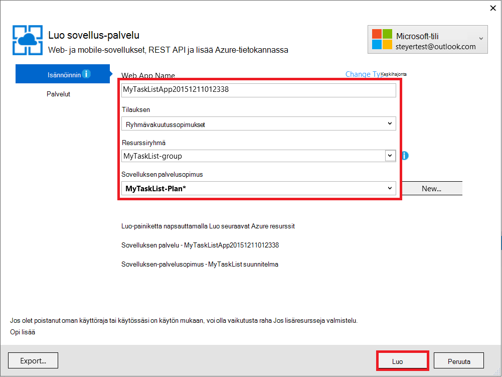
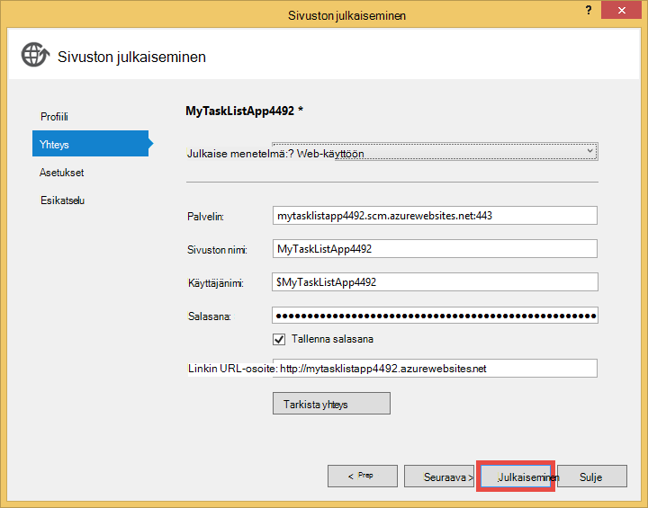

<properties 
    pageTitle="Web-sovelluksen luominen Azure-tietokannassa, joka yhdistää MongoDB virtual tietokoneessa käynnissä" 
    description="Opetusohjelma avulla opit käyttämään Git ASP.NET-sovelluksen käyttöön Azure App palvelun, joka on liitetty MongoDB Azure Virtual Machine."
    tags="azure-portal" 
    services="app-service\web, virtual-machines" 
    documentationCenter=".net" 
    authors="cephalin" 
    manager="wpickett" 
    editor=""/>

<tags 
    ms.service="app-service-web" 
    ms.workload="web" 
    ms.tgt_pltfrm="na" 
    ms.devlang="dotnet" 
    ms.topic="article" 
    ms.date="02/29/2016" 
    ms.author="cephalin"/>

# Web-sovelluksen luominen Azure-tietokannassa, joka yhdistää MongoDB virtual tietokoneessa käynnissä

Käytä Git, voit ottaa ASP.NET-sovellukseen Azure palvelun Web sovellukset. Tässä opetusohjelmassa muodostetaan yksinkertainen edusta ASP.NET-MVC tehtävien luettelon sovellus, joka muodostaa yhteyden MongoDB käynnissä virtual tietokoneeseen Azure-tietokantaan.  [MongoDB] [ MongoDB] on erinomainen suorituskyky NoSQL tietokannan Suositut Avaa lähde. Käynnissä ja testausta kehitystä tietokoneeseen ASP.NET-sovelluksen, kun lataat App palvelun Web Apps-sovellusten käyttäminen Git sovelluksen.

>[AZURE.NOTE] Jos haluat aloittaa Azure App palvelun ennen rekisteröimässä Azure-tili, siirry [Yritä App palvelu](http://go.microsoft.com/fwlink/?LinkId=523751), jossa lyhytkestoinen starter verkkosovellukseen heti voit luoda sovelluksen-palvelussa. Ei ole pakollinen; luottokortit ei ole sitoumukset.

## Taustan knowledge ##

Tunnet seuraavat on hyötyä Tässä opetusohjelmassa, mutta niitä ei tarvita:

* C# MongoDB ohjain. Katso lisätietoja kehittämisestä sovellusten C# vastaan MongoDB MongoDB [CSharp kielen Center][MongoC#LangCenter]. 
* ASP.NET web application framework. Saat lisätietoja kaikki sen [ASP.net-sivuston][ASP.NET].
* ASP .NET MVC web application framework. Saat lisätietoja kaikki sen [ASP.NET MVC sivuston][MVCWebSite].
* Azure. Voit aloittaa lukeminen osoitteessa [Azure][WindowsAzure].

## Edellytykset ##

- [Visual Studio Express 2013 Web]  [ VSEWeb] tai [Visual Studio 2013] [VSUlt]
- [.NET Azure SDK](http://go.microsoft.com/fwlink/p/?linkid=323510&clcid=0x409)
- Aktiivinen Microsoft Azure-tilaus

[AZURE.INCLUDE [create-account-and-websites-note](../../includes/create-account-and-websites-note.md)]

 
## Luo virtual machine ja asenna MongoDB ##

Tässä opetusohjelmassa oletetaan, että olet luonut virtual machine Azure-tietokannassa. Kun olet luonut virtuaalikoneen on MongoDB asentaminen virtuaalikoneen:

* Luo Windows-virtual machine ja asenna MongoDB on ohjeaiheessa [Asentaa MongoDB käytössä Windows Server Azure-tietokannassa virtual koneeseen][InstallMongoOnWindowsVM].

Kun olet luonut virtuaalikoneen Azure ja asennettu MongoDB, muista muista virtuaalikoneen ("testlinuxvm.cloudapp.net", kuten) ja ulkoista porttia DNS-nimeä, jonka olet määrittänyt päätepisteen MongoDB.  Tarvitset näitä tietoja myöhemmin opetusohjelman.

## Sovelluksen luominen ##

Tässä osassa ASP.NET-sovelluksen nimeltä "Omaan tehtäväluetteloon" Visual Studion avulla luodaan ja suorittaa ensimmäisen käyttöönoton, Azure App palvelun Web-sovelluksiin. Voit suorittaa sovelluksen paikallisesti, mutta se muodostaa virtuaalikoneen Azure- ja käytä MongoDB esiintymää, jonka loit siellä.

1. Visual Studiossa Valitse **Uusi projekti**.

    ![Sivun uuden projektin aloittaminen][StartPageNewProject]

1. **Uusi projekti** -ikkunan vasemmanpuoleisessa ruudussa Valitse **Visual C#**ja valitse sitten **WWW**. Valitse keskimmäisessä ruudussa **ASP.NET Web-sovelluksen**. Alalaidassa projektin "MyTaskListApp" nimi ja valitse sitten **OK**.

    ![Uusi projekti-valintaikkuna][NewProjectMyTaskListApp]

1. Valitse **Uusi ASP.NET-projekti** -valintaikkunassa valitse **MVC**ja valitse sitten **OK**.

    ![Valitse MVC malli][VS2013SelectMVCTemplate]

1. Jos et ole vielä kirjautunut sisään Microsoft Azure, voit pyydetään kirjautumaan. Kirjaudu sisään Azure kehotteiden mukaisesti.
2. Kun olet kirjautunut sisään, voit aloittaa määrittäminen sovelluksen palvelun koodiin. Määritä **Web-sovelluksen nimi**, **sovelluksen palvelusopimus**, **resurssiryhmä**ja **alue**ja valitse sitten **Luo**.

    

1. Projektin jälkeen luominen on valmis, odota online luoda Azure App palvelun **Azure App aktiviteetin** -ikkunassa esitetyllä tavalla. Valitse **Julkaise MyTaskListApp tämän Web Appiin nyt**.

1. Valitse **Julkaise**.

    

    ASP.NET oletusohjelmaksi julkaistaan Azure palvelun Web sovellukset, kun se käynnistetään selaimessa.

## Asenna MongoDB C#-ohjain

MongoDB on asiakkaan tuki C# ohjaimen, jonka haluat asentaa tietokoneeseen paikallista kehittämistä sovelluksia. C#-ohjain on saatavana NuGet.

Voit asentaa MongoDB C#-ohjain seuraavasti:

1. **Ratkaisunhallinnassa** **MyTaskListApp** projektin hiiren kakkospainikkeella ja valitse **Hallitse NuGetPackages**.

    ![NuGet pakettien hallinta][VS2013ManageNuGetPackages]

2. Valitse **NuGet pakettien hallinta** -ikkunan vasemmanpuoleisessa ruudussa **online-tilassa**. Kirjoita **Etsi Online-sivustosta** oikeanpuoleiseen ruutuun "mongodb.driver".  Valitse **Asenna** ohjaimen asentaminen.

    ![Etsi MongoDB C# ohjain][SearchforMongoDBCSharpDriver]

3. Valitse **hyväksyn** Hyväksy 10gen, Inc. käyttöoikeussopimuksen ehdot.

4. Valitse **Sulje** , kun ohjain on asennettu.
    ![MongoDB C# ohjain asennettu][MongoDBCsharpDriverInstalled]

MongoDB C#-ohjain on asennettu.  Viittaukset **MongoDB.Bson**, **MongoDB.Driver**ja **MongoDB.Driver.Core** -kirjastot on lisätty projektiin.

![MongoDB C# ohjaimen viittaukset][MongoDBCSharpDriverReferences]

## Lisää malli ##
**Ratkaisunhallinnassa**Napsauta hiiren kakkospainikkeella *Mallit* -kansioon ja **Lisää** uusi **luokka** ja anna sille nimi *TaskModel.cs*.  Korvaa aiemmin luotu koodi *TaskModel.cs*seuraava koodi:

    using System;
    using System.Collections.Generic;
    using System.Linq;
    using System.Web;
    using MongoDB.Bson.Serialization.Attributes;
    using MongoDB.Bson.Serialization.IdGenerators;
    using MongoDB.Bson;
    
    namespace MyTaskListApp.Models
    {
        public class MyTask
        {
            [BsonId(IdGenerator = typeof(CombGuidGenerator))]
            public Guid Id { get; set; }
    
            [BsonElement("Name")]
            public string Name { get; set; }
    
            [BsonElement("Category")]
            public string Category { get; set; }
    
            [BsonElement("Date")]
            public DateTime Date { get; set; }
    
            [BsonElement("CreatedDate")]
            public DateTime CreatedDate { get; set; }
    
        }
    }

## Lisää tiedot access-kerros ##
Napsauta **Ratkaisunhallinnassa**hiiren kakkospainikkeella *MyTaskListApp* projektiin ja **Lisää** **Uusi kansio** nimeltä *Domain*.  Napsauta hiiren kakkospainikkeella *Domain* -kansio ja **Lisää** uusi **luokka**. Nimeä luokkatiedosto *Dal.cs*.  Korvaa aiemmin luotu koodi *Dal.cs*seuraava koodi:

    using System;
    using System.Collections.Generic;
    using System.Linq;
    using System.Web;
    using MyTaskListApp.Models;
    using MongoDB.Driver;
    using MongoDB.Bson;
    using System.Configuration;
    
    
    namespace MyTaskListApp
    {
        public class Dal : IDisposable
        {
            private MongoServer mongoServer = null;
            private bool disposed = false;
    
            // To do: update the connection string with the DNS name
            // or IP address of your server. 
            //For example, "mongodb://testlinux.cloudapp.net"
            private string connectionString = "mongodb://mongodbsrv20151211.cloudapp.net";
    
            // This sample uses a database named "Tasks" and a 
            //collection named "TasksList".  The database and collection 
            //will be automatically created if they don't already exist.
            private string dbName = "Tasks";
            private string collectionName = "TasksList";
    
            // Default constructor.        
            public Dal()
            {
            }
    
            // Gets all Task items from the MongoDB server.        
            public List<MyTask> GetAllTasks()
            {
                try
                {
                    var collection = GetTasksCollection();
                    return collection.Find(new BsonDocument()).ToList();
                }
                catch (MongoConnectionException)
                {
                    return new List<MyTask>();
                }
            }
    
            // Creates a Task and inserts it into the collection in MongoDB.
            public void CreateTask(MyTask task)
            {
                var collection = GetTasksCollectionForEdit();
                try
                {
                    collection.InsertOne(task);
                }
                catch (MongoCommandException ex)
                {
                    string msg = ex.Message;
                }
            }
    
            private IMongoCollection<MyTask> GetTasksCollection()
            {
                MongoClient client = new MongoClient(connectionString);
                var database = client.GetDatabase(dbName);
                var todoTaskCollection = database.GetCollection<MyTask>(collectionName);
                return todoTaskCollection;
            }
    
            private IMongoCollection<MyTask> GetTasksCollectionForEdit()
            {
                MongoClient client = new MongoClient(connectionString);
                var database = client.GetDatabase(dbName);
                var todoTaskCollection = database.GetCollection<MyTask>(collectionName);
                return todoTaskCollection;
            }
    
            # region IDisposable
    
            public void Dispose()
            {
                this.Dispose(true);
                GC.SuppressFinalize(this);
            }
    
            protected virtual void Dispose(bool disposing)
            {
                if (!this.disposed)
                {
                    if (disposing)
                    {
                        if (mongoServer != null)
                        {
                            this.mongoServer.Disconnect();
                        }
                    }
                }
    
                this.disposed = true;
            }
    
            # endregion
        }
    }

## Lisää ohjain ##
Avaa **Ratkaisunhallinnassa** *Controllers\HomeController.cs* -tiedosto ja korvaa aiemmin luotu koodi seuraavasti:

    using System;
    using System.Collections.Generic;
    using System.Linq;
    using System.Web;
    using System.Web.Mvc;
    using MyTaskListApp.Models;
    using System.Configuration;
    
    namespace MyTaskListApp.Controllers
    {
        public class HomeController : Controller, IDisposable
        {
            private Dal dal = new Dal();
            private bool disposed = false;
            //
            // GET: /MyTask/
    
            public ActionResult Index()
            {
                return View(dal.GetAllTasks());
            }
    
            //
            // GET: /MyTask/Create
    
            public ActionResult Create()
            {
                return View();
            }
    
            //
            // POST: /MyTask/Create
    
            [HttpPost]
            public ActionResult Create(MyTask task)
            {
                try
                {
                    dal.CreateTask(task);
                    return RedirectToAction("Index");
                }
                catch
                {
                    return View();
                }
            }
    
            public ActionResult About()
            {
                return View();
            }
    
            # region IDisposable
    
            new protected void Dispose()
            {
                this.Dispose(true);
                GC.SuppressFinalize(this);
            }
    
            new protected virtual void Dispose(bool disposing)
            {
                if (!this.disposed)
                {
                    if (disposing)
                    {
                        this.dal.Dispose();
                    }
                }
    
                this.disposed = true;
            }
    
            # endregion
    
        }
    }

## Määritä tyylit ##
Jos haluat muuttaa otsikkoa sivun yläreunassa, Avaa *Views\Shared\\_Layout.cshtml* **Ratkaisunhallinnassa** tiedoston ja korvaa "Nimi" siirtymispalkki otsikossa "Omat tehtävien luettelon sovelluksen" niin, että se näyttää tältä:

    @Html.ActionLink("My Task List Application", "Index", "Home", null, new { @class = "navbar-brand" })

Jotta voit määrittää tehtäväluettelo-valikko, Avaa *\Views\Home\Index.cshtml* -tiedosto ja korvaa aiemmin luotu koodi seuraava koodi:
    
    @model IEnumerable<MyTaskListApp.Models.MyTask>
    
    @{
        ViewBag.Title = "My Task List";
    }
    
    <h2>My Task List</h2>
    
    <table border="1">
        <tr>
            <th>Task</th>
            <th>Category</th>
            <th>Date</th>
            
        </tr>
    
    @foreach (var item in Model) {
        <tr>
            <td>
                @Html.DisplayFor(modelItem => item.Name)
            </td>
            <td>
                @Html.DisplayFor(modelItem => item.Category)
            </td>
            <td>
                @Html.DisplayFor(modelItem => item.Date)
            </td>
            
        </tr>
    }
    
    </table>
    
  @Html.Partial("Create", new MyTaskListApp.Models.MyTask())

Voit lisätä mahdollisuuden Luo uusi tehtävä napsauttamalla hiiren kakkospainikkeella *Views\Home\\ * kansio ja **Lisää** **näkymä**.  *Luo*näkymän nimi. Korvaa koodin seuraavasti:

    @model MyTaskListApp.Models.MyTask
    
    
    
    
    
    @using (Html.BeginForm("Create", "Home")) {
        @Html.ValidationSummary(true)
        <fieldset>
            <legend>New Task</legend>
    
            

                @Html.LabelFor(model => model.Name)
            

            

                @Html.EditorFor(model => model.Name)
                @Html.ValidationMessageFor(model => model.Name)
            

    
            

                @Html.LabelFor(model => model.Category)
            

            

                @Html.EditorFor(model => model.Category)
                @Html.ValidationMessageFor(model => model.Category)
            

    
            

                @Html.LabelFor(model => model.Date)
            

            

                @Html.EditorFor(model => model.Date)
                @Html.ValidationMessageFor(model => model.Date)
            

    
            

                <input type="submit" value="Create" />
            

        </fieldset>
    }

**Ratkaisunhallinnassa** pitäisi näyttää tältä:

![Ratkaisunhallinnassa][SolutionExplorerMyTaskListApp]

## Määritä MongoDB yhteysmerkkijono ##
Avaa **Ratkaisunhallinnassa** *DAL/Dal.cs* -tiedosto. Etsi seuraava rivi koodi:

    private string connectionString = "mongodb://<vm-dns-name>";

Korvaa `<vm-dns-name>` käynnissä MongoDB virtuaalikoneen DNS-niminen luomasi Tässä opetusohjelmassa [Luo virtual machine ja asenna MongoDB][] vaiheessa.  Etsi virtuaalikoneen DNS-nimeä, siirry Azure-portaaliin, valitse **näennäiskoneiden**ja **DNS**-nimen.

Jos MongoDB Kuuntele oletusportti 27017 virtuaalikoneen DNS nimi on "testlinuxvm.cloudapp.net", koodi merkkijonon yhteysviiva näyttää:

    private string connectionString = "mongodb://testlinuxvm.cloudapp.net";

Jos virtuaalikoneen päätepisteen määrittää eri ulkoista porttia MongoDB, voit määrittää yhteysmerkkijonon portti:

    private string connectionString = "mongodb://testlinuxvm.cloudapp.net:12345";

Katso lisätietoja MongoDB yhteyden merkkijonojen [yhteydet][MongoConnectionStrings].

## Paikallisen käyttöönoton testaaminen ##

Suorita sovelluksen kehittämisen tietokoneeseen, valitsemalla **Käynnistä virheenkorjaus** **Virheenkorjaus** -valikossa tai painamalla **F5-näppäintä**. IIS Express käynnistyy ja selain aukeaa ja avaa sovelluksen aloitus-sivulla.  Voit lisätä uuden tehtävän, joka lisätään MongoDB tietokannan käytössä virtuaalikoneen Azure-tietokannassa.

![Tehtävän luettelosta sovelluksessa.][TaskListAppBlank]

## Azure App palvelun Web Apps-sovellusten julkaiseminen

Tässä osassa julkaiset muutokset Azure palvelun Web sovellukset.

1. Napsauta ratkaisunhallinnassa Napsauta **MyTaskListApp** uudelleen hiiren kakkospainikkeella ja valitse **Julkaise**.
2. Valitse **Julkaise**.

    Web-sovellukseen, sovelluksen Azure-palvelu käytössä ja MongoDB tietokannan Azuren näennäiskoneiden pitäisi tulla näkyviin.

## Yhteenveto ##

Voit nyt onnistuneesti käyttöön ASP.NET-sovelluksesi Azure palvelun Web sovellukset. Voit tarkastella web-sovelluksen seuraavasti:

1. Lokitiedoston Azure portaaliin.
2. Valitse **Web Apps-sovelluksista**. 
3. Valitse web Appissa **Web Apps** -luettelosta.

Katso lisätietoja kehittämisestä sovellusten C# vastaan MongoDB [CSharp kielen Center][MongoC#LangCenter]. 

[AZURE.INCLUDE [app-service-web-whats-changed](../../includes/app-service-web-whats-changed.md)]
 

<!-- HYPERLINKS -->

[AzurePortal]: http://manage.windowsazure.com
[WindowsAzure]: http://www.windowsazure.com
[MongoC#LangCenter]: http://docs.mongodb.org/ecosystem/drivers/csharp/
[MVCWebSite]: http://www.asp.net/mvc
[ASP.NET]: http://www.asp.net/
[MongoConnectionStrings]: http://www.mongodb.org/display/DOCS/Connections
[MongoDB]: http://www.mongodb.org
[InstallMongoOnWindowsVM]: ../virtual-machines/virtual-machines-windows-classic-install-mongodb.md
[VSEWeb]: http://www.microsoft.com/visualstudio/eng/2013-downloads#d-2013-express
[VSUlt]: http://www.microsoft.com/visualstudio/eng/2013-downloads

<!-- IMAGES -->

[StartPageNewProject]: ./media/web-sites-dotnet-store-data-mongodb-vm/NewProject.png
[NewProjectMyTaskListApp]: ./media/web-sites-dotnet-store-data-mongodb-vm/NewProjectMyTaskListApp.png
[VS2013SelectMVCTemplate]: ./media/web-sites-dotnet-store-data-mongodb-vm/VS2013SelectMVCTemplate.png
[VS2013DefaultMVCApplication]: ./media/web-sites-dotnet-store-data-mongodb-vm/VS2013DefaultMVCApplication.png
[VS2013ManageNuGetPackages]: ./media/web-sites-dotnet-store-data-mongodb-vm/VS2013ManageNuGetPackages.png
[SearchforMongoDBCSharpDriver]: ./media/web-sites-dotnet-store-data-mongodb-vm/SearchforMongoDBCSharpDriver.png
[MongoDBCsharpDriverInstalled]: ./media/web-sites-dotnet-store-data-mongodb-vm/MongoDBCsharpDriverInstalled.png
[MongoDBCSharpDriverReferences]: ./media/web-sites-dotnet-store-data-mongodb-vm/MongoDBCSharpDriverReferences.png
[SolutionExplorerMyTaskListApp]: ./media/web-sites-dotnet-store-data-mongodb-vm/SolutionExplorerMyTaskListApp.png
[TaskListAppBlank]: ./media/web-sites-dotnet-store-data-mongodb-vm/TaskListAppBlank.png
[WAWSCreateWebSite]: ./media/web-sites-dotnet-store-data-mongodb-vm/WAWSCreateWebSite.png
[WAWSDashboardMyTaskListApp]: ./media/web-sites-dotnet-store-data-mongodb-vm/WAWSDashboardMyTaskListApp.png
[Image9]: ./media/web-sites-dotnet-store-data-mongodb-vm/RepoReady.png
[Image10]: ./media/web-sites-dotnet-store-data-mongodb-vm/GitInstructions.png
[Image11]: ./media/web-sites-dotnet-store-data-mongodb-vm/GitDeploymentComplete.png

<!-- TOC BOOKMARKS -->
[Luo virtual machine ja asenna MongoDB]: #virtualmachine
[Create and run the My Task List ASP.NET application on your development computer]: #createapp
[Create an Azure web site]: #createwebsite
[Deploy the ASP.NET application to the web site using Git]: #deployapp
 