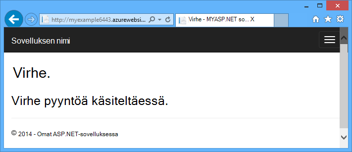
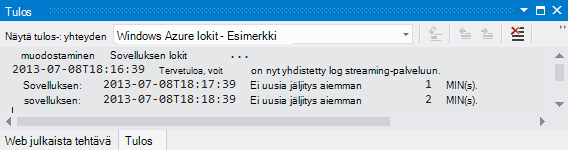
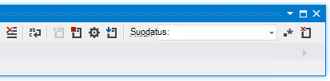

<properties 
    pageTitle="Azure-sovelluksen palvelun Visual Studiossa verkkosovellukseen vianmääritys" 
    description="Opi suorittamaan Azure web app-sovelluksessa käyttämällä remote virheenkorjaus, seuranta ja kirjaaminen työkaluja, joilla on muodostettu Visual Studio 2013." 
    services="app-service" 
    documentationCenter=".net" 
    authors="tdykstra" 
    manager="wpickett" 
    editor=""/>

<tags 
    ms.service="app-service" 
    ms.workload="na" 
    ms.tgt_pltfrm="na" 
    ms.devlang="dotnet" 
    ms.topic="article" 
    ms.date="08/29/2016" 
    ms.author="rachelap"/>

# Azure-sovelluksen palvelun Visual Studiossa verkkosovellukseen vianmääritys

## Yleiskatsaus

Tässä opetusohjelmassa kerrotaan, miten Visual Studio työkaluista, joiden avulla virheenkorjaus Online- [Sovelluksen palvelun](http://go.microsoft.com/fwlink/?LinkId=529714)käytössä- [tilassa virheenkorjaus](http://www.visualstudio.com/get-started/debug-your-app-vs.aspx) etäyhteyden tai sovelluksen lokit ja web-palvelimen lokit.

[AZURE.INCLUDE [app-service-web-to-api-and-mobile](../../includes/app-service-web-to-api-and-mobile.md)]

Opit:

* Mitä Azure web app-hallintatoiminnot ovat käytettävissä Visual Studiossa.
* Opit käyttämään Visual Studio remote näkymän nopeasti muutosten tekeminen remote web App-sovelluksessa.
* Azure-virheenkorjaus tilaan etäyhteyden projektin suorittaminen toimii sekä verkkosovellukseen WebJob.
* Sovelluksen Jäljityslokit luomisesta ja tarkastella niitä samalla, kun sovellus luo ne.
* Opit tarkastelemaan web server lokit, mukaan lukien yksityiskohtaiset virhesanomat ja pyynnön jäljittäminen epäonnistui.
* Voit lähettää vianmäärityslokit ja Azure-tallennustilan tilin ja tarkastella niitä.

Jos sinulla on Visual Studio Ultimate, voit käyttää myös [IntelliTrace](http://msdn.microsoft.com/library/vstudio/dd264915.aspx) virheiden poistamiseen. Tässä opetusohjelmassa ei koske IntelliTrace.

## Edellytykset

Tässä opetusohjelmassa toimii kehitysympäristö, web-projekti ja Azure-verkkosovelluksen tietokenttiä määritetty [Azure ja ASP.NET aloittaminen][GetStarted]. WebJobs osille, sinun on sovellus, jossa voit luoda [Azure WebJobs SDK: N käytön aloittaminen][GetStartedWJ].

Tässä opetusohjelmassa näytetään MALLIKOODEJA ovat C# MVC web-sovelluksen, mutta vianmääritystoimia ovat samat kuin Visual Basic- ja Internet-lomakkeet-sovellukset.

Opetusohjelman oletetaan, että käytät Visual Studio 2015 tai 2013. Jos käytät Visual Studio 2013-WebJobs ominaisuuksien käyttöön tarvitaan [Päivitä 4](http://go.microsoft.com/fwlink/?LinkID=510314) tai uudempi versio. 

Streaming lokit ominaisuus toimii vain sovelluksissa, jotka kohteen .NET Framework 4 tai uudempi versio.

## Web-sovelluksen määrittäminen ja hallinta

Visual Studio pääsee osaa web app-hallintatoiminnot ja käytettävissä [Azure Portal](http://go.microsoft.com/fwlink/?LinkId=529715)-asetukset. Tässä osassa näet, mikä on **Palvelimen Resurssienhallinnan**avulla. Saat näkyviin uusimmat Azure asiakasintegraatio-ominaisuuksia, kokeile **Cloud Explorer** myös. Voit avata molemmat **Näytä** -valikosta. 

1. Jos ei ole jo kirjautunut sisään, Azure Visual Studiossa, valitse **Palvelin Explorerin** **Azure Yhdistä** -painike.

    Löytämiseen on asentaa hallinta-sertifikaatti, jonka avulla tiliäsi. Jos haluat asentaa sertifikaatin Explorerissa **Server** **Azure** -solmu hiiren kakkospainikkeella ja valitse sitten pikavalikosta **hallinta- ja suodattimen tilaukset** . **Azure-tilausten hallinta** -valintaikkunassa **Varmenteet** -välilehti ja valitse sitten **Tuo**. Voit ladata ja tuo tilaus-tiedosto (kutsutaan myös *.publishsettings* -tiedosto) noudattamalla Azure tilissäsi.

    > [AZURE.NOTE]
    > Jos lataat tilaus-tiedosto, Tallenna tietolähteen koodi-kansioiden (kuten-tiedostot-kansiossa) ulkopuolella olevaan kansioon ja poistaa sen, kun tuonti on valmis. Kuka pääsee käyttämään tilauksen tiedoston joku voi muokata, luominen ja poistaminen Azure palvelujen.

    Saat lisätietoja yhteyden muodostamisesta Azure resurssien Visual Studio [tilien hallinta- ja tilaukset-järjestelmänvalvojan roolit](http://go.microsoft.com/fwlink/?LinkId=324796#BKMK_AccountVCert).

2. **Palvelimen Explorer**Laajenna **Azure** ja laajenna **Sovellus-palvelun**.

3. Laajenna resurssiryhmän, joka sisältää, jonka loit [aloittaminen Azure ja ASP.NET]web Appin[GetStarted], ja napsauta hiiren kakkospainikkeella web app-solmu ja **Näkymän**asetukset.

    

    **Azure Web App** -välilehti tulee näkyviin, ja näet siellä web app hallinta- ja tehtävät, jotka ovat käytettävissä Visual Studiossa.

    

    Tässä opetusohjelmassa käytetään kirjaaminen ja jäljitys-avattavat luettelot. Käytät myös remote virheenkorjaus mutta, jotta se tulee käyttää toista menetelmää.
   
    Lisätietoja tässä ikkunassa sovelluksen asetusten ja yhteyden merkkijonojen ruuduissa on [Azure Web Apps: kuinka sovelluksen merkkijonot ja yhteyden merkkijonot työn](http://blogs.msdn.com/b/windowsazure/archive/2013/07/17/windows-azure-web-sites-how-application-strings-and-connection-strings-work.aspx).

    Jos haluat suorittaa web app hallinta tehtäviä ei voi tehdä tässä ikkunassa, valitse Avaa selainikkunassa Azure-portaaliin **Avaa hallinta-portaalissa** .

## Access web app-tiedostot palvelimen Resurssienhallinnassa

Tavallisesti otat web projektin `customErrors` seuraavan koodin korostetut asettaminen merkinnän `On` tai `RemoteOnly`, mikä tarkoittaa et saa sinulle hyötyä virheilmoitus, kun jokin vikaan. Saat kaikki on paljon virheitä sivun, kuten jompikumpi seuraavista niistä.

**Palvelinvirhe "/" sovelluksen:**

**Virhe:**

**Sivusto ei voi näyttää sivun**

Helpoin tapa löytää virheen syynä on usein käyttöön yksityiskohtaisia virhesanomia, jotka edellisen näyttökuvat ensimmäinen kerrotaan, kuinka voit tehdä. Joka edellyttää seuraavan käyttöön koodin korostetut muutoksen. Voit muokata *seuraavan koodin korostetut projektin* ja ota projektin uudelleen tai luoda [Web.config transform](http://www.asp.net/mvc/tutorials/deployment/visual-studio-web-deployment/web-config-transformations) ja käyttöön virheenkorjaus muodosta, mutta ei nopeampi tapa: Napsauta **Ratkaisunhallinnassa** voit voit suoraan katsella ja muokata tiedostoja remote web App-sovelluksessa *remote näkymä* -toiminnolla.

1. **Palvelimen Explorer**Laajenna **Azure**, laajenna **Sovellus-palvelun**, resurssiryhmä web-sovelluksesi sijaitsee, laajenna ja laajenna sitten web App-solmu.

    Näet solmujen, joiden avulla voit käyttää web-sovelluksen sisällön tiedostoja ja lokitiedostot.

2. Laajenna **tiedostot** -solmu ja kaksoisnapsauta *seuraavan koodin korostetut* .

    

    Visual Studio avautuu seuraavan koodin korostetut etä-web-sovelluksen ja näyttää tiedoston nimen otsikkorivillä [etäyhteyksien].

3. Lisää seuraava rivi, `system.web` elementti:

    `<customErrors mode="Off"></customErrors>`

    

4. Päivitä selain, joka on näkyvissä unhelpful virhesanoma tulee näyttöön, ja nyt saat virhesanoman, kuten seuraavassa esimerkissä:

    

    (Näkyy virhe on luotu lisäämisestä punaisena *Views\Home\Index.cshtml*näytettävä viiva.)

Seuraavan koodin korostetut muokkaaminen on vain yksi esimerkki skenaariot, jossa voi lukea ja muokata tiedostoja Azure koodiin tehdä vianmääritys on helppoa.

## Remote muistin verkkosovelluksissa

Jos yksityiskohtainen virheilmoitus ei ole tarpeeksi tietoa, ei voi luoda uudelleen virheen paikallisesti vianmääritys myös Suorita etäyhteyden virheenkorjaus-tilassa. Voit asettaa keskeytyskohtia, muistin suoraan käsittelevät, käydä läpi koodin ja jopa muuttaa koodin polku. 

Remote virheenkorjaus ei toimi Visual Studio Express-versioissa.

Tässä osassa esitetään, kuinka voit korjata [aloittaminen Azure ja ASP.NET]luot projektin etäyhteyden avulla[GetStarted].

1. Avaa web-projekti, jonka loit [aloittaminen Azure ja ASP.NET][GetStarted].

1. Avaa *Controllers\HomeController.cs*.

2. Poista `About()` menetelmä ja lisää seuraavat koodin sijaintia.

        public ActionResult About()
        {
            string currentTime = DateTime.Now.ToLongTimeString();
            ViewBag.Message = "The current time is " + currentTime;
            return View();
        }

2. [Määritä keskeytyskohdasta](http://www.visualstudio.com/get-started/debug-your-app-vs.aspx) `ViewBag.Message` rivi.

1. **Ratkaisunhallinnassa**projektin hiiren kakkospainikkeella ja valitse **Julkaise**.

2. Valitse **profiili** -avattavasta luettelosta, jota käytit [Azure ja ASP.NET aloittaminen]saman profiilin[GetStarted].

3. **Asetukset** -välilehti ja muuta **määritysten** **Virheenkorjaus**ja valitse sitten **Julkaise**.

    

4. Käyttöönoton jälkeen lopettaa sekä selain avautuu koodiin Azure URL-osoitteeseen, sulje selain.

5. **Palvelimen Explorer**koodiin hiiren kakkospainikkeella ja valitse sitten **Liitä virheenkorjaus**. 

    

    Selain avautuu automaattisesti Azure käynnissä aloitussivulle. Voit joutua odottamaan 20 sekuntia tai niin, kun Azure määrittää palvelimen virheenkorjaus. Tämä viive tapahtuu vain ensimmäisen kerran, voit suorittaa verkkosovellukseen virheenkorjaus-tilassa. Seuraava 48 tuntia, kun käynnistät virheenkorjaus uudelleen siellä myöhemmin kellonaikojen ei viiveen.

    **Huomautus:** Jos sinulla on kaikki käynnistäminen virheenkorjaus ongelmia, kokeile voit tehdä sen sijaan, että **Palvelimen Explorer** **Cloud Resurssienhallinnan** avulla.

6. Valitse **Lisää** -valikossa.

    Visual Studio pysäyttää keskeytyskohdasta ja koodi on käynnissä Azure-tietokannassa, ei ole omassa tietokoneessasi.

7. Pitämällä hiiren osoitinta `currentTime` muuttuja, voit tarkastella aika-arvon.

    

    Kun näet on Azure palvelimen aika, joka voi olla eri kuin paikallisen tietokoneen aikavyöhykkeen.

8. Anna uusi arvo `currentTime` muuttujaan, kuten "Nyt käynnissä Azure".

5. Painamalla F5 Jatka.

    Azure käynnissä tietoja-sivulla näkyy, että currentTime muuttujan syötetty uusi arvo.

    

## Remote muistin WebJobs

Tässä osassa näytetään, miten voit korjata käyttämällä etäyhteyden ja project web app, voit luoda [Azure WebJobs SDK: N käytön aloittaminen](websites-dotnet-webjobs-sdk.md). 

Tässä osassa näytetään ominaisuudet ovat käytettävissä vain Visual Studio 2013 Päivitä 4 tai uudempi. 

Jatkuva WebJobs vain Remote virheenkorjaus toimii. Aikataulun mukainen ja tarvittaessa WebJobs eivät tue virheenkorjaus.

1. Avaa web-projekti, jonka loit [Azure WebJobs SDK: N käytön aloittaminen][GetStartedWJ].

1. Avaa ContosoAdsWebJob projektin *Functions.cs*.

2. [Määritä keskeytyskohdasta](http://www.visualstudio.com/get-started/debug-your-app-vs.aspx) ensimmäinen lause `GnerateThumbnail` menetelmää.

    

1. **Ratkaisunhallinnassa**napsauttamalla sitä hiiren kakkospainikkeella web-projekti (ei WebJob-projekti) ja valitse sitten **Julkaise**.

2. Valitse **profiili** -pudotusvalikosta saman profiilin, jota käytit [Azure WebJobs SDK: N käytön aloittaminen](websites-dotnet-webjobs-sdk.md).

3. **Asetukset** -välilehti ja muuta **määritysten** **Virheenkorjaus**ja valitse sitten **Julkaise**.

    Ottaa käyttöön Visual Studiossa, web- ja WebJob projektien ja koodiin Azure URL-osoite avautuu selaimessa.

5. Laajenna **Palvelimen Explorer** **Azure > App palvelu > resurssiryhmä > web app > WebJobs > jatkuva**, ja napsauta hiiren kakkospainikkeella **ContosoAdsWebJob**.

7. Valitse **Liitä virheenkorjaus**. 

    

    Selain avautuu automaattisesti Azure käynnissä aloitussivulle. Voit joutua odottamaan 20 sekuntia tai niin, kun Azure määrittää palvelimen virheenkorjaus. Tämä viive tapahtuu vain ensimmäisen kerran, voit suorittaa verkkosovellukseen virheenkorjaus-tilassa. Seuraavan kerran, voit liittää virheenkorjaus ei viiveen, jos teet 48 tunnin kuluessa.

6. Web-selaimessa, joka on avattu Contoson Active Directory-aloitussivulle Luo uusi ad. 

    Jonon viestin luodaan, joka poimii WebJob ja käsitellä luominen mainos valitaan. Kun WebJobs SDK soittaa funktion käsitellä jonossa viestiä, koodi painamalla oman keskeytyskohdasta.

7. Virheenkorjaus vaihdot, että keskeytyskohdasta, voit tarkastella ja muuttaa muuttuvaa arvoa, kun ohjelma on käynnissä pilveen. Seuraavassa kuvassa virheenkorjaus näyttää blobInfo objekti, joka on välitetty GenerateThumbnail-menetelmää.

    
 
5. Painamalla F5 Jatka.

    GenerateThumbnail menetelmä on luonut pikkukuva.

6. Selaimen Päivitä hakemisto-sivu ja tuo näkyviin pikkukuva.

6. Visual Studiossa painamalla VAIHTO + F5 lopettavat virheenkorjaus.

7. **Server Exploreria**Napsauta ContosoAdsWebJob-solmu ja valitse **Näytä Raporttinäkymät-ikkunan**.

8. Kirjaudu sisään Azure tunnistetietosi ja valitse sitten Siirry sivulle, että WebJob WebJob nimi. 

    

    Koontinäytön osoittaa, että GenerateThumbnail-funktio suorittaa viimeksi.

    (Seuraavan kerran, valitset **Näytä Raporttinäkymät-ikkunan**sinun ei tarvitse kirjautua sisään ja selaimen siirtyy suoraan oman WebJob.)

9. Valitse Funktionimi, jos haluat nähdä lisätietoja funktion suorittamisen.

    

Jos yhteyttä funktion [kirjoittamasi lokit](websites-dotnet-webjobs-sdk-storage-queues-how-to.md#logs)-voitu napsautat **ToggleOutput** näkyvät.

## Huomautuksia remote virheenkorjaus

* Tuotannon virheenkorjaus-tilassa ei ole suositeltavaa. Jos tuotannon koodiin ei skaalaudu ulos palvelimen useita kertoja, virheenkorjaus estää verkkopalvelin muiden pyyntöihin. Jos on useita web-palvelimen esiintymät, kun liität virheenkorjaus saat satunnaisia esiintymän ja sinulla ei voi varmistaa, että seuraavien selaimen pyynnöt siirtyvät kyseisen esiintymän. Myös yleensä ei käyttöönottoa virheenkorjaus muodosta tuotannon ja kääntäjän optimointi release-versiot, voi olla mahdotonta näyttää, mitä tapahtuu riveittäin lähdekoodia. Tuotannon vianmääritys paras resurssi on sovelluksen jäljityksen ja web server lokit.

* Vältä pitkä sarkaimet keskeytyskohdat kun remote on virheenkorjaus. Azure käsittelee prosessi, jossa on pysähtynyt kauemmin kuin muutama minuutti ei vastaa prosessi, eikä se suljetaan.

* Samalla, kun olet virheenkorjaus-palvelin lähettää tietoja Visual Studiossa, jotka voivat vaikuttaa kaistanleveyden kulut. Lisätietoja kaistanleveyden korvaukset on artikkelissa [Azure hinnoittelua](/pricing/calculator/).

* Varmista, että `debug` -määrite `compilation` *seuraavan koodin korostetut* elementti on määritetty tosi. Arvo on TOSI, kun julkaiset virheenkorjaus koontiversion määrityksen oletusarvoisesti.

        <system.web>
          <compilation debug="true" targetFramework="4.5" />
          <httpRuntime targetFramework="4.5" />
        </system.web>

* Jos huomaat, että virheenkorjaus ei vaihe, jonka haluat korjata-koodiksi, voit joutua muuta vain oman koodin.  Lisätietoja on artikkelissa [rajoittaa vain oman koodin hetken](http://msdn.microsoft.com/library/vstudio/y740d9d3.aspx#BKMK_Restrict_stepping_to_Just_My_Code).

* Ajastin käynnistyy palvelimessa, kun remote muistin-toiminnon käyttöön ottaminen ja 48 tunnin kuluttua toiminto on oletusarvoisesti poissa käytöstä. Tämä 48 tunnin raja on valmis suojaus ja suorituskyvyn syistä. Voit poistaa toiminnon helposti uudelleen käyttöön niin monta kertaa kuin haluat. Suosittelemme, että jätä se ole käytössä, kun ei aktiivisesti korjattava.

* Voit liittää virheenkorjaus manuaalisesti prosessi, paitsi web app prosessin (w3wp.exe). Saat lisätietoja virheenkorjaustilan käyttäminen Visual Studiossa [Virheenkorjaus Visual Studiossa](http://msdn.microsoft.com/library/vstudio/sc65sadd.aspx).

## Vianmäärityslokit yleiskatsaus

ASP.NET-sovellus, joka suoritetaan Azure web App-sovelluksessa voit luoda lokit seuraavanlaisia:

* **Sovelluksen jäljityksen lokit** 
  Sovellus luo lokitiedostot soittamalla maksutapojen [System.Diagnostics.Trace](http://msdn.microsoft.com/library/system.diagnostics.trace.aspx) -luokka.
* **Web-palvelimen lokit** 
  Verkkopalvelin Luo lokitapahtuman jokaisen HTTP-pyynnössä web App-sovellukseen.
* **Yksityiskohtainen virhelokeja viesti** 
  Verkkopalvelin Luo HTML-sivu, jossa joitakin Lisätietoja epäonnistuneiden pyyntöjen (ne, jotka aiheuttavat tilakoodin 400 tai uudempi). 
* **Pyyntö jäljityksen lokitiedostot epäonnistui** 
  Verkkopalvelin Luo XML-tiedosto, jossa epäonnistui pyyntöjen yksityiskohtaiset jäljitystiedot. Verkkopalvelin sisältää myös XSL-tiedoston, jos haluat muotoilla XML-selaimessa.
  
Kirjaaminen vaikuttaa web app-suorituskyvyn, jotta Azure ansiosta voit ottaa käyttöön tai poistaa kunkin tarpeen mukaan. Sovelluksen lokit voit määrittää, että vain tietyt vakavuus tason yläpuolella lokit on kirjoitettava. Kun luot uuden web-sovelluksen, oletusarvoisesti kaikki kirjaaminen on poistettu käytöstä.

Lokit kirjoitetaan koodiin tiedostojärjestelmässä *publish LogFiles* kansiossa sijaitsevien tiedostojen, ja ne ovat käytettävissä FTP. Web-palvelimen lokit ja sovelluksen lokeja voidaan kirjoittaa myös Azure-tallennustilan tilin. Voit säilyttää tallennustilan tilin kuin on mahdollista tiedostojärjestelmän lokien suurempi määrä. Olet rajoitettu enimmäismäärä on 100 megatavua lokit, kun käytät tiedostojärjestelmän. (Tiedoston järjestelmälokit ovat vain lyhytkestoinen säilytys. Azure poistaa vanhoja lokitiedostojen uusia tilan, kun on saavutettu.)  

## Voit luoda ja tarkastella sovelluksen Jäljityslokit

Tässä osassa tee seuraavat toimet:

* Jäljitys-lauseet lisääminen web-projekti, jonka loit [Azure ja ASP.NET aloittaminen][GetStarted].
* Näytä lokit, kun suoritat projektin paikallisesti.
* Tarkastele lokit samalla, kun ne on luotu Azure sovelluksen. 

Tietoja siitä, miten voit luoda sovelluksen kirjautuu WebJobs, on kohdassa [Azure jonon tallennustilan käsittelemisestä käyttämällä WebJobs SDK - viestin kirjoittaminen lokit](websites-dotnet-webjobs-sdk-storage-queues-how-to.md#logs). Lokien tarkasteleminen ja hallinta, miten ne ovat tallennettuina Azure seuraavat ohjeet koskevat myös sovelluksen lokit WebJobs luoma. 

### Jäljitys-lauseet lisääminen sovellukseen

1. Avaa *Controllers\HomeController.cs*ja korvaa `Index`, `About`, ja `Contact` menetelmiä, joilla on seuraava koodi, jotta voit lisätä `Trace` lauseet ja `using` tietosuojatiedot `System.Diagnostics`:

        public ActionResult Index()
        {
            Trace.WriteLine("Entering Index method");
            ViewBag.Message = "Modify this template to jump-start your ASP.NET MVC application.";
            Trace.TraceInformation("Displaying the Index page at " + DateTime.Now.ToLongTimeString());
            Trace.WriteLine("Leaving Index method");
            return View();
        }
        
        public ActionResult About()
        {
            Trace.WriteLine("Entering About method");
            ViewBag.Message = "Your app description page.";
            Trace.TraceWarning("Transient error on the About page at " + DateTime.Now.ToShortTimeString());
            Trace.WriteLine("Leaving About method");
            return View();
        }
        
        public ActionResult Contact()
        {
            Trace.WriteLine("Entering Contact method");
            ViewBag.Message = "Your contact page.";
            Trace.TraceError("Fatal error on the Contact page at " + DateTime.Now.ToLongTimeString());
            Trace.WriteLine("Leaving Contact method");
            return View();
        }       

2. Lisää `using System.Diagnostics;` lauseen tiedoston alkuun.
                
### Tarkastele paikallisesti Jäljityksen tulos

3. Painamalla F5 sovelluksen käyttämiseen virheenkorjaus-tilassa.

    Oletusarvoinen Jäljityksen kuuntelutoiminnon kirjoittaa kaikki jäljitystiedot **tulostusikkunassa, sekä muita virheenkorjaus-tuloste** . Seuraavassa kuvassa näkyy jäljitys-lausekkeita, jotka olet lisännyt tulosteen `Index` menetelmää.

    

    Seuraavat vaiheet näyttää, miten voit tarkastella jäljitystiedot verkkosivulle, ilman kääntäminen virheenkorjaus-tilassa.

2. Avaa seuraavan sovelluksen koodin korostetut (yksi project-kansiossa) ja lisää `<system.diagnostics>` elementin juuri sulkeminen ennen tiedoston lopussa `</configuration>` elementti:

        <system.diagnostics>
            <trace>
              <listeners>
                <add name="WebPageTraceListener"
                    type="System.Web.WebPageTraceListener, 
                    System.Web, 
                    Version=4.0.0.0, 
                    Culture=neutral,
                    PublicKeyToken=b03f5f7f11d50a3a" />
              </listeners>
            </trace>
          </system.diagnostics>

    `WebPageTraceListener` Avulla voit tarkastella Jäljitä tulostus selaamalla `/trace.axd`.

3. Lisää <a href="http://msdn.microsoft.com/library/vstudio/6915t83k(v=vs.100).aspx">Seuranta-osan</a> kohdassa `<system.web>` Web.config-tiedostossa, kuten seuraavassa esimerkissä:

        <trace enabled="true" writeToDiagnosticsTrace="true" mostRecent="true" pageOutput="false" />

3. Paina CTRL + F5 sovelluksen käyttämiseen.

4. Selaimen ikkunan osoiterivillä *trace.axd* lisääminen URL-osoite ja paina sitten Enter (URL-osoite on samankaltainen kuin http://localhost:53370/trace.axd).

5. Valitse **Sovelluksen jäljitys** -sivulla **Tarkasteleminen** ensimmäisellä rivillä (ei viivaa BrowserLink).

    

    **Pyytää tiedot** -sivu tulee näkyviin, ja **Jäljitystiedot** -kohta näyttää jäljitys-lausekkeita, jotka olet lisännyt tulosteen `Index` menetelmää.

    

    Oletusarvon mukaan `trace.axd` on käytettävissä vain paikallisesti. Jos haluat määrittää käytettäväksi etä-web-sovelluksen, voit lisätä `localOnly="false"` , `trace` osan *seuraavan koodin korostetut, kuten seuraavassa esimerkissä* :

        <trace enabled="true" writeToDiagnosticsTrace="true" localOnly="false" mostRecent="true" pageOutput="false" />

    Kuitenkin ottaminen käyttöön `trace.axd` tuotannon web app ei yleensä suositella tietoturvasyistä ja seuraavien osien näet helpompi tapa lukea jäljityksen lokitiedostot Azure web App-sovelluksessa.

### Jäljitys-tulosteen tarkasteleminen Azure

1. **Ratkaisunhallinnassa**Napsauta hiiren kakkospainikkeella web-projekti ja valitse **Julkaise**.

2. Valitse **Julkaise** -valintaikkunan **Julkaise**.

    Kun Visual Studio julkaisee päivitys, se avautuu selainikkunassa (olettaen että **Linkin URL-osoite** ei poista **yhteys** -välilehden) aloitussivulle.

3. **Palvelimen Explorer**koodiin hiiren kakkospainikkeella ja valitse **Näytä Streaming lokit**. 

    

    **Kohde** -ikkunassa näkyy muodostanut yhteyden log streaming-palvelua ja lisää ilmoituksen rivin minuutti, joka johtaa ilman lokia näyttämiseen.

    

4. Selainikkunaan, jossa näkyy sovelluksen aloitus-sivulla Valitse **yhteystieto**.

    Muutamassa virhe tason tulosteen jäljittää voit lisätä `Contact` menetelmä näkyy **kohde** -ikkunassa.

    

    Visual Studio on näkyvissä vain virhe tason jäljittää, koska se on oletusasetus, kun otat seurannan palvelun log. Kun luot uuden Azure web-sovelluksen, kaikki kirjaaminen on poistettu käytöstä oletusarvoisesti, kun näyttöön tuli avaamisen asetukset-sivun aiemmin:

    

    Kuitenkin valittuna **Näytä Streaming lokit**Visual Studio muuttaa automaattisesti **Virhe**, mikä tarkoittaa, että virhe tason lokit ilmoitetaan **Sovelluksen Logging(File System)** . Jotta voit tarkastella kaikkia jäljityksen lokitiedostot, voit muuttaa asetusta **yksityiskohtainen**. Kun valitset pienempi kuin virheen vakavuus tasolla, kaikki lokit suurempi vakavuus tasoissa raportoidaan. Niin kun valitset yksityiskohtainen, voit tarkistaa myös tietoja, varoitus ja virhelokeja.  

4. **Palvelimen Explorer**web-sovelluksen hiiren kakkospainikkeella ja valitse sitten **Näkymäasetukset** , samoin kuin aiemmassa versiossa.

5. Muuta **yksityiskohtainen** **Sovelluksen Logging (File System)** ja valitse sitten **Tallenna**.
 
    

6. Selainikkunassa, joka näkyy nyt **yhteyshenkilö** -sivulla Valitse **Aloitus**-ja valitse **tietoja**ja valitse sitten **yhteyshenkilön**.

    Muutama muutamassa **tulostusikkunassa** näyttää kaikkien jäljitys-tuloste.

    

    Tässä osassa käytössä ja kirjaaminen käytöstä käyttämällä Azure web app-asetukset. Voit ottaa käyttöön ja poistaminen käytöstä jäljityksen kuuntelutoiminnot muokkaamalla seuraavan koodin korostetut. Kuitenkin muokkaaminen seuraavan koodin korostetut aiheuttaa roskakorista, kun web app-määritysten kautta kirjaamisen käyttöönottaminen ei toimi, sovellus-toimialue. Jos ongelma kestää kauan, voit toistaa, tai on katkonainen, kierrättäminen app toimialueen ehkä "korjaustoiminto" ja pakottaa odotettava, kunnes se tapahtuu uudelleen. Ottaminen käyttöön Azure diagnostiikka ei tehdä, voit ryhtyä sieppaus virhetietojen heti.

### Siirtää ikkunan ominaisuudet

**Kohde** -ikkunassa **Azure** -välilehdessä on useita painikkeita ja tekstiruudun:

Nämä suorittaa seuraavat toiminnot:

* Poista **kohde** -ikkunassa.
* Ota käyttöön tai poistaa käytöstä rivityksen.
* Käynnistää tai pysäyttää seuranta lokitiedot.
* Määritä, joka kirjautuu seurannassa.
* Lataa lokitiedot.
* Voit suodattaa lokit hakumerkkijono tai säännöllinen lauseke.
* Sulje **kohde** -ikkunassa.

Jos kirjoitat hakumerkkijono tai säännöllinen lauseke, Visual Studio suodattaa asiakkaan lokitiedot. Tämä tarkoittaa sitä, voit kirjoittaa ehdot, kun **kohde** -ikkunassa näkyvät lokit ja voit muuttaa suodatusehtoa tarvitsematta lokit uudelleen.

## Näytä web server-lokit

Web-palvelimen lokit tallentaa kaikki HTTP-toimintojen web Appissa. Jotta voit tarkastella niitä sinun tarvitse ottaa käyttöön web-sovelluksen ja kerro Visual Studiossa, jota haluat seurata niitä **kohde** -ikkunassa. 

1. Valitse **Azure Web App-määritys** -välilehti, jonka avasit **Server**Explorerista muuttaa Web Server lokiin kirjaaminen **käyttöön**ja valitse sitten **Tallenna**.

    

2. Napsauta **kohde** -ikkunassa **Määritä, mitä seurannassa kirjautuu Azure** -painiketta.
    
    

3. Valitse **Azure kirjaaminen asetukset** -valintaikkunassa valitse **Web-palvelimen lokit**ja valitse sitten **OK**.

    

4. Selainikkunassa, joka näyttää web-sovelluksen Valitse **Aloitus**-ja valitse **tietoja**ja valitse sitten **yhteyshenkilön**.

    Sovelluksen lokit näkyvät yleensä ensin web-palvelimen lokit perään. Voit joutua odottamaan hetken lokit näkyvän. 

    

Kun otat web-palvelimen lokit ensin Visual Studiossa Azure kirjoittaa oletusarvoisesti lokit tiedostojärjestelmän. Voit käyttää seuraavaa vaihtoehtona Määritä lokit on kirjoitettava blob-säilö tallennustilan tilin palvelimella Azure portaalin.

Jos-portaalin käyttäminen WWW-palvelin Azure-tallennustilan tilin kirjaaminen otetaan käyttöön ja Poista lokiin kirjaaminen käyttöön Visual Studiossa, kun uudelleen käyttöön Visual Studiossa kirjautumisesta palautetaan tallennustilan tilin asetukset. 

## Näytä yksityiskohtaiset virhelokeja viesti

Yksityiskohtainen virhelokeja annettava joitakin lisätietoja pyyntöjen, joka johtaa vastauksen virhekoodit (400 tai yläpuolella). Jotta voit tarkastella niitä **kohde** -ikkunassa, sinun on Ota käyttöön web-sovelluksen ja kerro Visual Studiossa, jota haluat seurata niitä.

1. **Azure Web App-määritys** -välilehti, jonka avasit **Server**Explorerista, valitse Muuta **Yksityiskohtaiset virhesanomat** **,**ja valitse sitten **Tallenna**.

    

2. Napsauta **kohde** -ikkunassa **Määritä, mitä seurannassa kirjautuu Azure** -painiketta.

3. Valitse **Azure kirjaaminen asetukset** -valintaikkunassa **kaikki lokit**ja valitse sitten **OK**.

    

4. Selaimen ikkunan osoiterivillä lisätä ylimääräisen merkin 404-virhesanoma aiheuttavan URL-osoite (esimerkiksi `http://localhost:53370/Home/Contactx`), ja paina Enter-näppäintä.

    Yksityiskohtainen virheloki näkyy muutaman sekunnin kuluttua Visual Studio **tulostus** -ikkunassa.

    

    Control + napsauttamalla linkkiä nähdä lokin tulosteen muotoiltu selaimessa:

    

## Lataa tiedosto järjestelmälokit

Voit ladata lokit, jotka voit valvoa **kohde** -ikkunassa myös *.zip* -tiedostona. 

1. Valitse **kohde** -ikkunassa **Lataa Streaming lokitiedot**.

    

    Resurssienhallinnassa Avaa *lataukset* -kansiossa, jossa ladattu tiedosto valittuna.

    

2. Pura *.zip* -tiedosto, jolloin näkyviin tulee seuraava kansiorakenne:

    

    * Sovelluksen jäljityksen lokitiedostot ovat *.txt* *LogFiles\Application* -kansiossa olevat tiedostot.
    * Web-palvelimen lokit ovat *.log* *LogFiles\http\RawLogs* -kansiossa olevat tiedostot. Työkalu, kuten [Log jäsentimen](http://www.microsoft.com/download/details.aspx?displaylang=en&id=24659) voit tarkastella ja käsitellä nämä tiedostot.
    * Yksityiskohtainen virhelokeja viestin ovat *.html* -tiedostoina *LogFiles\DetailedErrors* -kansiossa.

    ( *Ominaisuuksissa* -kansio on luotu tietolähteen ohjausobjektin julkaiseminen; tiedostojen siinä ei ole mitään liittyvät Visual Studio julkaiseminen. *Git* -kansio on hallintaan liittyviä tietoja, julkaiseminen ja kirjaudu tiedostojen streaming-palvelu.)  

## Näytä tallennustilan lokit

Sovelluksen jäljityksen lokitiedot voidaan lähettää myös Azure-tallennustilan tilin ja niitä voi tarkastella Visual Studiossa. Tehdäksesi luot tallennustilan tilin, ota käyttöön perinteinen portaalissa tallennustilan lokit ja tarkastele niitä ** **Azure Web App** -ikkunan-välilehdessä** .

Voit lähettää lokit jonkin tai kaikki kolme kohteisiin:

* Tiedostojärjestelmän.
* Tallennustilan tilin taulukot.
* Tallennustilan tilin BLOB-objektit.

Voit määrittää kunkin kohteen eri vakavuus tason. 

Taulukoiden avulla on helppo tarkastella verkossa lokiin ja niiden tukemista streaming; Voit kyselyn taulukoiden lokit ja nähdä uudet lokit niitä luodaan. BLOB helpottavat voit ladata tiedostoja lokit ja analysointia käyttämällä HDInsight-, koska HDInsight tietää käsittelemisestä Blob-objektien tallennustilaan. Lisätietoja on artikkelissa **Hadoop ja MapReduce** [Tietojen tallennusasetuksia (rakennuksen tosielämän Cloud sovellukset Azure kanssa)](http://www.asp.net/aspnet/overview/developing-apps-with-windows-azure/building-real-world-cloud-apps-with-windows-azure/data-storage-options).

Asennetun tiedoston järjestelmälokit yksityiskohtainen tasolla; seuraavat vaiheet opastusta määrittäminen tiedot tason lokit Siirry tallennustilan tilin taulukot. Tietotasoa tarkoittaa, että kaikki lokit luotu kutsumalla `Trace.TraceInformation`, `Trace.TraceWarning`, ja `Trace.TraceError` näkyvät, mutta ei luotu kutsumalla lokit `Trace.WriteLine`.

Tallennustilan Sähköpostitilit tarjoavat enemmän tallennustilaa ja pidempi kestävä säilytys verrattuna tiedostojärjestelmän lokitiedot. Sovelluksen jäljityksen lokitiedostojen lähettäminen tallennustilan toiseen etuna on se saat kunkin log, et saa järjestelmän lokien muita tietoja.

5. **Tallennustilan** Azure-solmun napsauttamalla hiiren kakkospainikkeella ja valitse sitten **Luo tallennustilan tili**.

3. Kirjoita **Luo tallennustilan tili** -valintaikkunassa tallennustilan tilin nimi. 

    Nimen on oltava on oltava yksilöllinen (ei Azure-tallennustilan tilin voi olla samaa nimeä). Jos kirjoittamasi nimi on jo käytössä saat voit muuttaa sitä.

    Tallennustilan tiliäsi URL-osoite on *{name}*. core.windows.net. 

5. Määrittää alueen **alue tai affiniteetti ryhmän** avattavasta luettelosta sinua lähinnä.

    Tämä asetus määrittää, mitkä Azure palvelinkeskuksen isännöi tallennustilan tilin. Tässä opetusohjelmassa valittua ei tehdä huomattavia ero, mutta tuotannon web-sovelluksen haluat verkkosivustoon ja tallennustilaa tilin Pienennä viive ja tietojen juniin ovat samassa alueelle. Web-sovelluksen käyttäminen minimoida viive selaimet mahdollisimman lähelle alueen Suorita web Appia (jonka luot myöhemmin).

6. Määritä **paikallisesti tarpeettomat** **replikoinnin** avattavasta luettelosta. 

    Kun geo replikointi on käytössä tallennustilan tilin, tallennetun sisällön replikoida toissijainen palvelinkeskukseen käyttöön automaattisesti, jos ensisijainen sijainnissa pää huono kyseiseen sijaintiin. GEO replikoinnin voi olla maksullisia. Numero- ja -tilien yleensä piilotettavien geo toistoa varten. Lisätietoja on artikkelissa [luominen, hallinta, tai poista tallennustilan-tili](../storage-create-storage-account/#replication-options).

5. Valitse **Luo**. 

      

1. Visual Studio **Azure Web App** -ikkunan **lokit** -välilehti ja valitse sitten **Hallinta-portaalin määrittäminen kirjautumisesta**.

    <!-- todo:screenshot of new portal if the VS page link goes to new portal -->
    

    **Määritä** -välilehti avautuu perinteinen portal-koodiin.

2. Perinteinen portaalin **määrittäminen** -välilehdessä Siirry sovelluksen diagnostiikka-osioon ja muuta, **Valitse** **Sovelluksen Logging (taulukkotallennus)** .

3. Muuta **Kirjaamistaso** **tiedot**.

4. Valitse **taulukko-tallennustilan hallinta**.

    

    **Sovelluksen diagnostiikka taulukon tallennustilan hallinta** -ruudussa voit valita tallennustilan tilin, jos sinulla on useampi kuin yksi. Voit luoda uuden taulukon tai Käytä aiemmin luotua.

    

6. Valitse **sovelluksen diagnostiikka taulukon tallennustilan hallinta** -ruudussa Sulje ruutu valintamerkkiä.

6. Valitse perinteinen portaalin **määrittäminen** -välilehdessä **Tallenna**.

7. Selainikkunassa, joka näyttää sovelluksen web app-valitsemalla **Aloitus**-ja sitten Valitse **tietoja**ja valitse sitten **yhteyshenkilön**.

    Nämä web-sivujen selaaminen tuottamat lokitiedot kirjoitetaan tallennustilan-tilille.

8. Valitse **Visual Studiossa **Azure Web App** -ikkunan välilehdessä,** Valitse **Diagnostiikan yhteenveto** **Päivitä** .

    

    **Diagnostiikan yhteenveto** -osassa näkyvät lokit viimeisen 15 minuutin oletusarvoisesti. Voit muuttaa kauden saat näkyviin lisää lokitiedot. 

    (Jos "taulukko ei löydy"-virhe, varmista, että olet siirtynyt sivuja, joiden Tee jäljityksen, kun **Sovellus Logging (tallennus)** ja sen jälkeen, kun olet valinnut **Tallenna**.)

    

    Huomaa, että tässä näkymässä näet **Tunnus** ja **Säikeen tunnusta** kunkin lokin, johon et saa tiedoston järjestelmälokit. Näet Lisää kenttiä tarkastelemalla Azure tallennustilan taulukon suoraan.

8. Valitse **Näytä kaikki sovelluksen lokit**.

    Jäljitä log-taulukko näkyy Azure tallennustilan taulukon katseluohjelmassa.
   
    (Jos "sarjan sisältää elementtejä ei"-virhe, Avaa **Palvelimen Resurssienhallinta**, Laajenna solmu tallennustilan tilin **Azure** -solmun **taulukoiden** hiiren kakkospainikkeella ja valitsemalla **Päivitä**.)

    

    Tässä näkymässä näkyy kenttiä ei näy muissa näkymissä. Tässä näkymässä avulla voit suodattaa lokit käyttämällä erityistä kyselyn muodostin-Käyttöliittymän kyselyn luominen. Lisätietoja on artikkelissa taulukon tiedoilla - suodatuksen kohteiden [Selaaminen tallennustilan resurssien palvelimen Resurssienhallinnassa](http://msdn.microsoft.com/library/ff683677.aspx).

7. Jotta voit tarkastella yhden rivin tietoja, kaksoisnapsauta riveillä.

    

## Tarkastele epäonnistuneen pyynnön jäljitys lokit

Epäonnistuneen pyynnön jäljitys lokit ovat käteviä, kun ymmärtämistä tietoja siitä, miten IIS käsittelee HTTP-pyyntö tilanteissa, kuten URL-Osoitteen uudelleenkirjoitus tai todentaminen ongelmia. 

Azure web Apps-sovellusten käyttää samaa epäonnistuneen pyynnön jäljitys toimintoja, jotka on ollut käytettävissä IIS 7.0 ja uudempi versio. Sinulla ei ole IIS-asetuksia, joka määrittää, mitkä virheet Hae kirjautunut, mutta käyttöoikeus. Kun otat epäonnistuneen pyynnön jäljittäminen, välitetyt kaikki virheet. 

Voit ottaa epäonnistuneen pyynnön jäljittäminen Visual Studiossa, mutta et voi tarkastella niitä Visual Studiossa. Lokitiedostot ovat XML-tiedostoja. Streaming log-palvelu valvoo vain tiedostot, jotka katsotaan luettavissa vain teksti-tilassa: *.txt*, *.html*ja *.log* tiedostot.

Voit tarkastella epäonnistuneen pyynnön jäljityksen lokitiedostot selaimessa suoraan FTP tai paikallisesti, kun olet lataaminen paikalliseen tietokoneeseen FTP-työkalun avulla. Tässä osassa tarkastelet ne selaimessa suoraan.

1. **Azure Web App** -ikkuna, jossa avasit **Server**Explorerista **määritys** -välilehdessä muuta **Epäonnistui pyytää jäljitys** **käyttöön**ja valitse sitten **Tallenna**.

    

4. Joka näyttää web-sovelluksen selaimen ikkunan osoiterivillä ylimääräisiä merkin lisääminen URL-osoite ja valitse Enter 404-virhesanoma aiheuttavan.

    Tämä aiheuttaa epäonnistuneen pyynnön jäljitysloki, luoda ja seuraamalla näitä ohjeita näyttää, miten voit tarkastella tai ladata loki.

2. Valitse Visual Studion **Azure Web App** -ikkunan **määritys** -välilehti **avoinna hallinta-portaalissa**.

3. Web-sovelluksen [Azure Portal](https://portal.azure.com) **asetukset** -sivu, valitse **käyttöönoton tunnistetiedot**ja kirjoita sitten uusi käyttäjänimi ja salasana.

    

    ** Silloin, kun kirjaudut, sinun on käytettävä täydellinen käyttäjänimi web app-nimisen etuliite siihen. Esimerkiksi jos sivusto on "myexample" "myid" Kirjoita käyttäjän nimi, jonka Kirjaudu sisään "myexample\myid".

5. Siirry uudessa selainikkunassa URL-osoite, **FTP-isäntänimi** tai **FTPS hostname** näkyvät web App-ohjelman **Web App** -sivu. 

6. Kirjaudu sisään FTP-tunnistetiedot, jotka olet luonut aiemmin (kuten käyttäjänimen web app nimi-etuliite).

    Selain näyttää web-sovelluksen pääkansio.

6. Avaa *publish LogFiles* -kansio.

    

7. Avaa kansio, jonka nimi on W3SVC plus numeerisen arvon.

    

    Kansiossa on virheitä, kun epäonnistuneen pyynnön jäljittäminen kirjautunut XML-tiedostot ja XSL-tiedoston, selaimen avulla voit muotoilla XML.

    

8. Valitse epäonnistui pyynnön, jota haluat tarkastella tietoja jäljitys XML-tiedosto.

    Seuraavassa kuvassa on esimerkki virheen jäljitystiedot osa.

    

## Seuraavat vaiheet

Nähnyt, miten Visual Studio on helppo tarkastella lokeja Azure web-sovelluksessa. Seuraavissa osissa on lisää resursseja linkkejä valitsemalla Aiheeseen liittyviä ohjeita:

* Azure-web-sovelluksen vianmääritys
* Visual Studiossa virheenkorjaus 
* Etäyhteyksien virheenkorjaus Azure-tietokannassa
* ASP.NET-sovelluksia jäljitys
* Analysoitaessa web-palvelimen lokit
* Pyyntö jäljityksen lokitiedostot analysoiminen epäonnistui
* Virheenkorjaus pilvipalveluihin

### Azure-web-sovelluksen vianmääritys

Saat lisätietoja verkkosovelluksissa Azure sovelluksen-palvelussa on seuraavissa resursseissa:

* [Miten web-sovellusten valvonta](/manage/services/web-sites/how-to-monitor-websites/)
* [Tutkiminen muistivuotoja Azure verkkosovelluksissa Visual Studio 2013: n kanssa](http://blogs.msdn.com/b/visualstudioalm/archive/2013/12/20/investigating-memory-leaks-in-azure-web-sites-with-visual-studio-2013.aspx). Microsoft ALM blogimerkinnässä Visual Studio ominaisuuksista analysointiin hallitun muistin ongelmat.
* [Azure web apps online Työkalut tärkeitä tietoja](/blog/2014/03/28/windows-azure-websites-online-tools-you-should-know-about-2/). Amit Apple blogimerkinnässä.

Ohjeita tiettyyn vianmäärityksen kysymykseen on käynnistää säikeen jompikumpi seuraavista keskustelupalstoilla:

* [Azure-keskustelupalstalla, ASP.NET-sivustossa](http://forums.asp.net/1247.aspx/1?Azure+and+ASP+NET).
* [MSDN-keskustelupalsta Azure](http://social.msdn.microsoft.com/Forums/windowsazure/).
* [StackOverflow.com](http://www.stackoverflow.com).

### Visual Studiossa virheenkorjaus 

Saat lisätietoja virheenkorjaustilan käyttäminen Visual Studiossa [Virheenkorjaus Visual Studiossa](http://msdn.microsoft.com/library/vstudio/sc65sadd.aspx) MSDN aihe ja [Virheenkorjaus vihjeitä Visual Studio 2010: n kanssa](http://weblogs.asp.net/scottgu/archive/2010/08/18/debugging-tips-with-visual-studio-2010.aspx).

### Etäyhteyksien virheenkorjaus Azure-tietokannassa

Saat lisätietoja remote virheenkorjaus Azure web Apps-sovellusten ja WebJobs on seuraavissa resursseissa:

* [Johdanto Remote muistin Azure App Service-verkkosovelluksissa](/blog/2014/05/06/introduction-to-remote-debugging-on-azure-web-sites/).
* [Sisällä Remote virheenkorjaus Remote virheenkorjaus Azure App palvelun Web Apps-osan 2 - esittely](/blog/2014/05/07/introduction-to-remote-debugging-azure-web-sites-part-2-inside-remote-debugging/)
* [Johdanto Remote virheenkorjaus Azure App palvelun Web Apps-osan 3 - usean esiintymä-ympäristön ja GIT](/blog/2014/05/08/introduction-to-remote-debugging-on-azure-web-sites-part-3-multi-instance-environment-and-git/)
* [WebJobs virheenkorjaus (video)](https://www.youtube.com/watch?v=ncQm9q5ZFZs&list=UU_SjTh-ZltPmTYzAybypB-g&index=1)

Jos haluat korjata, web-sovelluksen käyttää Azure verkko-Ohjelmointirajapinnan tai Mobile-palveluihin taustatietokannan, katso [Virheenkorjaus .NET Taustajärjestelmä Visual Studiossa](http://blogs.msdn.com/b/azuremobile/archive/2014/03/14/debugging-net-backend-in-visual-studio.aspx).

### ASP.NET-sovelluksia jäljitys

Ei, ASP.NET jäljitys perusteellisesti ja ajan tasalla esittelyssä käytettävissä Internetissä. Tee parhaiten on aloittaminen vanha johdanto materiaalien kirjoitetut Internet-lomakkeiden koska MVC ei ole vielä ja täydentää, uudempaan blogissa kirjaa kohdistusta tiettyjä ongelmia. Jotkin hyvä aloituskohtaa on seuraavissa resursseissa:

* [Seuranta- ja Telemetriatietojen (rakennuksen tosielämän Cloud sovellukset Azure kanssa)](http://www.asp.net/aspnet/overview/developing-apps-with-windows-azure/building-real-world-cloud-apps-with-windows-azure/monitoring-and-telemetry).  E-kirjan luvun suosituksia jäljitys Azure cloud-sovelluksissa.
* [ASP.NET-jäljitys](http://msdn.microsoft.com/library/ms972204.aspx) 
  Vanhat mutta edelleen basic Johdatus aihe on hyvä resurssi.
* [Jäljityksen kuuntelutoiminnot](http://msdn.microsoft.com/library/4y5y10s7.aspx) 
  Jäljityksen kuuntelutoiminnot tietoja, mutta ei mainita [WebPageTraceListener](http://msdn.microsoft.com/library/system.web.webpagetracelistener.aspx).
* [Vaiheittainen kuvaus: Integraation ASP.NET jäljitys System.Diagnostics jäljitys](http://msdn.microsoft.com/library/b0ectfxd.aspx) 
  Tämä liian on vanha, mutta sisältää joitakin lisätietoja, johdanto artikkelissa ei käsitellä.
* [Jäljitys ASP.NET MVC Razor näkymissä](http://blogs.msdn.com/b/webdev/archive/2013/07/16/tracing-in-asp-net-mvc-razor-views.aspx) 
  Viestin kerrotaan lisäksi Razor näkymien jäljitys-virhe-suodattimen luominen jotta voit kirjautua kaikki käsittelemättömän poikkeukset MVC-sovelluksessa. Katso tietoja Kirjaudu kaikki käsittelemättömän poikkeukset Internet-lomakkeet-sovelluksessa on MSDN- [Virhe käsittelytoimintoja valmis esimerkiksi](http://msdn.microsoft.com/library/bb397417.aspx) Global.asax esimerkissä. MVC tai Internet-lomakkeita, jos haluat kirjautua tiettyjä poikkeuksia, mutta antaa oletusarvon puitteissa käsittelyn tulla voimaan, voit suodattaa ja Uusittavaa seuraavan esimerkin mukaisesti:

        try
        {
           // Your code that might cause an exception to be thrown.
        }
        catch (Exception ex)
        {
            Trace.TraceError("Exception: " + ex.ToString());
            throw;
        } 

* [Streaming diagnostiikka jäljitys kirjaamisen Azure komentoriviltä (plus läpimurtoihin!)](http://www.hanselman.com/blog/StreamingDiagnosticsTraceLoggingFromTheAzureCommandLinePlusGlimpse.aspx) 
  Komentorivin käyttämisestä opetusohjelman mitä näytetään, miten voit tehdä Visual Studiossa. [Läpimurtoihin](http://www.hanselman.com/blog/IfYoureNotUsingGlimpseWithASPNETForDebuggingAndProfilingYoureMissingOut.aspx) on työkalu virheenkorjaus ASP.NET-sovelluksia. 
* [Lokiin kirjaaminen Web-sovellusten ja diagnostiikka - ja David Ebbo käytön](/documentation/videos/azure-web-site-logging-and-diagnostics/) ja [Streaming Web Apps - David Ebbo-lokit](/documentation/videos/log-streaming-with-azure-web-sites/) 
  Scott Hanselman ja David Ebbo videot.

Lokiin, löytämiseen kirjoittamiseen jäljitys-koodi on käyttää Avaa lähde kirjaaminen-framework, kuten [ELMAH](http://nuget.org/packages/elmah/). Lisätietoja on artikkelissa [Scott Hanselman blogimerkinnät ELMAH tietoja](http://www.hanselman.com/blog/NuGetPackageOfTheWeek7ELMAHErrorLoggingModulesAndHandlersWithSQLServerCompact.aspx).

Huomaa, että sinun ei tarvitse käyttää ASP.NET- tai System.Diagnostics jäljitys, jos haluat saada streaming lokit azuren. Azure web app-streaming log palvelu virtauttaa *.txt*-, *.html*- tai *.log* tiedosto, joka lukee *publish LogFiles* -kansio. Sen vuoksi voit luoda oman kirjaaminen järjestelmän, joka kirjoittaa tiedostojärjestelmän web Appin ja tiedoston voi automaattisesti virtauttaa ja ladata. Sinun on tehtävä on kirjoittaminen sovelluksen koodi, joka luo tiedostojen *d:\home\logfiles* -kansioon. 

### Analysoitaessa web-palvelimen lokit

Saat lisätietoja analysoiminen web server lokit on seuraavissa resursseissa:

* [LOGPARSERista](http://www.microsoft.com/download/details.aspx?id=24659) 
  Työkalu, jolla tietojen tarkasteleminen web-palvelimen lokit (*.log* -tiedostot).
* [IIS: N suorituskykyongelmia tai käyttämällä LOGPARSERista sovellusvirheet vianmääritys](http://www.iis.net/learn/troubleshoot/performance-issues/troubleshooting-iis-performance-issues-or-application-errors-using-logparser) 
  Log-jäsentimen työkalua, joka avulla voit analysoida web-palvelimen lokit esittely.
* [Blogimerkinnät mukaan Robert McMurray LOGPARSERista käyttämiseen](http://blogs.msdn.com/b/robert_mcmurray/archive/tags/logparser/) 
* [HTTP-tilakoodin IIS 7.0, IIS 7.5 ja IIS 8.0](http://support.microsoft.com/kb/943891)

### Pyyntö jäljityksen lokitiedostot analysoiminen epäonnistui

Microsoft TechNet-sivustossa on [Käyttäminen epäonnistui pyytää jäljitys](http://www.iis.net/learn/troubleshoot/using-failed-request-tracing) osan jotka voivat olla hyödyllisiä tietoja käyttämisestä lokitiedostot. Kuitenkin dokumentaatio ohjeessa pääasiassa määrittämisestä epäonnistuneen pyynnön jäljittäminen IIS, mitä et voi tehdä Azure-verkkosovelluksissa.

[GetStarted]: web-sites-dotnet-get-started.md
[GetStartedWJ]: websites-dotnet-webjobs-sdk.md
 
