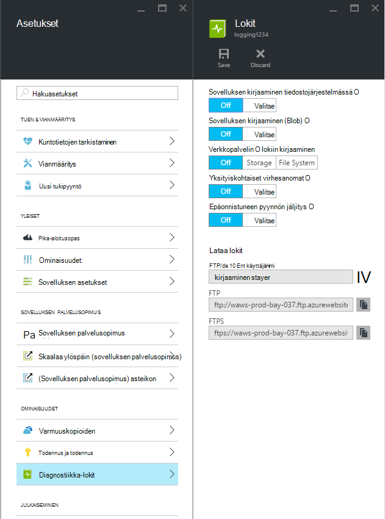
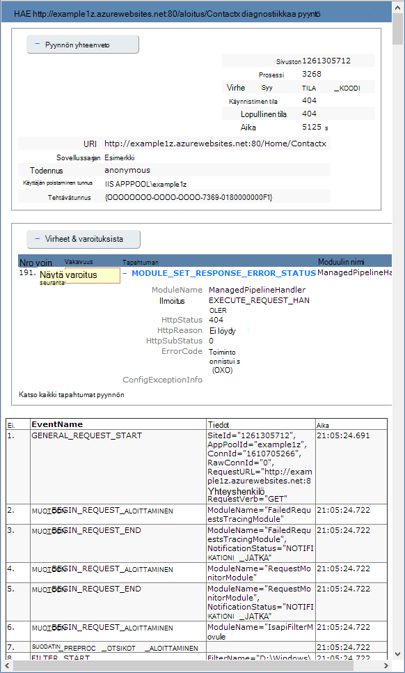

<properties
    pageTitle="Ota Diagnostiikan kirjaus käyttöön verkkosovelluksissa Azure sovelluksen-palvelussa"
    description="Lue Diagnostiikan kirjaus ja instrumentation lisääminen sovelluksen sekä miten voit avata Azure tallentamat tiedot."
    services="app-service"
    documentationCenter=".net"
    authors="cephalin"
    manager="wpickett"
    editor="jimbe"/>

<tags
    ms.service="app-service"
    ms.workload="na"
    ms.tgt_pltfrm="na"
    ms.devlang="na"
    ms.topic="article"
    ms.date="06/06/2016"
    ms.author="cephalin"/>

# Ota Diagnostiikan kirjaus käyttöön verkkosovelluksissa Azure sovelluksen-palvelussa

## Yleiskatsaus

Azure on Sisäänrakennetut diagnostiikkatyökalut helpottamiseksi virheenkorjaus [App palvelun web Appissa](http://go.microsoft.com/fwlink/?LinkId=529714). Tässä artikkelissa käydään Diagnostiikan kirjaus ja instrumentation lisääminen sovelluksen sekä miten voit avata Azure tallentamat tiedot.

Tässä artikkelissa käytetään [Azure-portaalissa](https://portal.azure.com), PowerShellin Azure ja Azure komentorivivalitsimet Interface (Azure CLI) vianmäärityslokit käyttöä varten. Lisätietoja Visual Studiossa vianmäärityslokit käsittelystä on artikkelissa [Azure vianmääritys Visual Studiossa](web-sites-dotnet-troubleshoot-visual-studio.md).

[AZURE.INCLUDE [app-service-web-to-api-and-mobile](../../includes/app-service-web-to-api-and-mobile.md)]

## Web-palvelimen diagnostiikka- ja sovelluksen vianmääritys

Sovelluksen palvelun verkkosovelluksissa toimittaa diagnostiikan lokitiedot verkkopalvelin ja web-sovelluksen toimintoja. Nämä ovat loogisesti jaettu **web server diagnostiikka** - ja **sovelluksen vianmääritys**.

### Web-palvelimen diagnostiikka

Voit ottaa käyttöön tai poistaminen käytöstä lokit seuraavanlaisia:

- **Yksityiskohtainen virhelokit** - yksityiskohtaisia virhetietoja HTTP tilakoodit, jotka ilmaisevat epäonnistui (tilakoodi 400 tai uudempi). Tämä saattaa sisältää tietoja, voit selvittää, miksi palvelin palautti virhekoodi.
- **Epäonnistui pyynnön jäljitys** - epäonnistuneiden pyyntöjen, mukaan lukien jäljityksen IIS-osien avulla pyynnön ja aika, jokaisen osan yksityiskohtaiset tiedot. Tämä voi olla hyödyllinen, jos yrität sivuston suorituskykyä tai eristää mikä aiheuttaa HTTP-virheestä, joka palautetaan.
- **Web-palvelimen lokiin kirjaaminen** - [W3C laajennettu lokitiedostomuoto](http://msdn.microsoft.com/library/windows/desktop/aa814385.aspx)HTTP-tapahtumien tiedot. Tästä on hyötyä määritettäessä yleistä sivuston arvot, kuten pyynnöt käsitellään tai kuinka monta pyynnöt ovat IP-osoite.

### Sovelluksen vianmääritys

Sovelluksen Diagnostiikan avulla voit siepata web-sovelluksen tuottamat tiedot. ASP.NET-sovellukset voivat käyttää [System.Diagnostics.Trace](http://msdn.microsoft.com/library/36hhw2t6.aspx) luokan lokitiedot sovelluksen diagnostiikka lokiin. Esimerkki:

    System.Diagnostics.Trace.TraceError("If you're seeing this, something bad happened");

Suorituksen aikana voit hakea lokitiedostot apua vianmäärityksessä. Lisätietoja on artikkelissa [Azure vianmääritys web apps Visual Studiossa](web-sites-dotnet-troubleshoot-visual-studio.md).

Sovelluksen palvelun verkkosovelluksissa myös kirjautua asennustiedot julkaistessasi sisällön verkkosovellukseen. Tämä tapahtuu automaattisesti ja ei ole käyttöönoton kirjaaminen asetukset. Käyttöönoton kirjaaminen avulla voit selvittää, miksi käyttöönoton epäonnistui. Jos käytössäsi on mukautettu käyttöönoton komentosarja, voit ehkä käyttää käyttöönoton kirjaaminen voit selvittää, miksi komentosarja epäonnistui tuntemattomasta.

## Diagnostiikan ottaminen käyttöön

Käyttöön Diagnostiikka [Azure-portaalissa](https://portal.azure.com), siirry web-sovelluksen sivu ja valitse **Asetukset > diagnostiikka lokit**.

<!-- todo:cleanup dogfood addresses in screenshot -->

Kun otat **sovelluksen diagnostiikka** voit myös valita **taso**. Tämän asetuksen avulla voit suodattaa tietoja **tiedoksi**, **Varoitus** tai **Virhe** kerätyistä tiedoista. Tämän määrittämistä arvoksi **yksityiskohtainen** Kirjaudu kaikki sovelluksen tuottamat tiedot.

> [AZURE.NOTE] Toisin kuin muuttaminen seuraavan koodin korostetut sovelluksen diagnostiikka ottaminen käyttöön tai muuttamalla vianmäärityslokeihin tasot ei Roskakorin sovelluksen toimialue, joka suoritetaan sovellus.

**Määritä** [perinteinen portal](https://manage.windowsazure.com) Web app-välilehdessä voit valita **tallennustilan** tai **tiedostojärjestelmässä** **verkkopalvelin**kirjauduttaessa. **Tallennustilan** valitseminen mahdollistaa tallennustilan-tili ja valitse sitten blob-säilö, johon lokitiedostot kirjoitetaan. Kaikki muut **sivuston diagnostiikka** lokit kirjoitetaan vain tiedostojärjestelmässä.

[Perinteinen portal](https://manage.windowsazure.com) -Web-sovelluksen **määrittäminen** -välilehti on myös lisäasetuksia sovelluksen vianmääritys:

* **Tiedostojärjestelmän** - tallentaa diagnostiikka tiedot web app-tiedostojärjestelmässä. Nämä tiedostot voidaan käyttää FTP tai ladata Zip-arkistona PowerShellin Azure tai Azure käyttöliittymä (Azure CLI) avulla.
* **Taulukkotallennus** - tallentaa tiedot sovelluksen diagnostiikka määritetty Azure-tallennustilan tilin ja taulukon nimi.
* **Blob-objektien tallennustilaan** - tallentaa tiedot sovelluksen diagnostiikka määritetyn Azure-tallennustilan tilin ja blob-säilö.
* **Säilytysaika** - oletusarvoisesti lokit ei poisteta automaattisesti- **Blob-objektien tallennustilaan**. Valitse **Määritä säilytys** ja montako päivää haluat säilyttää lokit, jos haluat poistaa automaattisesti lokit.

>[AZURE.NOTE] Jos olet [uudelleen tallennustilan-tilisi pikanäppäimet](storage-create-storage-account.md#view-copy-and-regenerate-storage-access-keys), nollaa vastaaviin kirjaaminen määritykset päivitetyt-näppäimillä. Toiminto:
>
> 1. Määritä vastaaviin kirjaustoiminto **määrittäminen** -välilehdessä voit **poistaa sen käytöstä**. Tallenna asetusta.
> 2. Ota käyttöön kirjaaminen tallennustilan tilin Blob-objektien tai taulukon uudelleen. Tallenna asetusta.

Yhdistelmän tiedostojärjestelmässä, taulukkotallennus tai Blob-objektien tallennustilaan voidaan ottaa käyttöön samanaikaisesti, ja se on yksittäisiä lokin tason määrityksiä. Jos esimerkiksi haluat virheiden ja varoitusten blob tallennustilan pitkään kirjaaminen ratkaisuksi otettaessa tiedoston järjestelmän kirjaaminen yksityiskohtainen taso ja kirjaudu.

Vaikka kaikki kolme tallennuspaikkojen kirjautuneena tapahtumien samat perustiedot, **taulukkotallennus** ja **Blob-objektien tallennustilaan** Kirjaudu muita tietoja, kuten esiintymä-tunnuksen, viestiketjun ja eritellympiä aikaleima (jakoviivojen format) kuin kirjaaminen **tiedostojärjestelmässä**.

> [AZURE.NOTE] **Taulukkotallennus** tai **Blob-objektien tallennustilaan** tallennettuja tietoja voi käyttää vain tallennustilan asiakas-tai sovellus, joka voi käyttää suoraan tallennustilan järjestelmät. Esimerkiksi Visual Studio 2013 sisältää tallennustilan Explorerista, jossa voidaan tarkastella taulukon tai blob storage ja HDInsight käyttää Blob-objektien tallennustilaan tallennettuja tietoja. Voit myös kirjoittaa sovellus, joka käyttää Azuren tallennustilaan jollakin [Azure SDK: T](/downloads/#).

> [AZURE.NOTE] Diagnostiikan voidaan ottaa käyttöön myös PowerShellin Azure **Määrittäminen AzureWebsite** cmdlet-komennolla. Jos käytössäsi ei ole asennettu PowerShellin Azure tai ei ole määritetty käyttämään Azure-tilauksen, katso, [miten voit käyttää PowerShellin Azure](/develop/nodejs/how-to-guides/powershell-cmdlets/).

##Toimintaohje: lataa lokit

Vianmääritystiedot, jotka on tallennettu web app-tiedostojärjestelmässä niitä voi käyttää suoraan FTP: N avulla. Se voi ladata myös Zip-arkistona PowerShellin Azure tai Azure käyttöliittymä.

Kansiorakenne, joka on tallennettu lokit on seuraavanlainen:

* **Sovelluksen lokit** - /LogFiles/Application /. Tämä kansio sisältää sovelluksen kirjaaminen tuottamat tiedot sisältävä tekstitiedostoista.

* **Pyyntö jäljittää epäonnistui** - / publish LogFiles/W3SVC ### /. Tämä kansio sisältää XSL-tiedoston ja vähintään yksi XML-tiedosto. Varmista, että lataat XSL-tiedoston samaan kansioon kuin XML tiedosto(a), koska XSL-tiedosto sisältää muotoilun ja XML-tiedostot, kun Internet Explorer näyttää sisällön suodattamisesta..

* **Yksityiskohtainen virhelokeja** - /LogFiles/DetailedErrors /. Tämä kansio sisältää vähintään yhden .htm-tiedostoja, jotka antavat tietoja HTTP-virheitä asennuksen aikana tapahtuneista virheistä.

* **Web-palvelimen lokit** - /LogFiles/http/RawLogs. Tämä kansio sisältää vähintään yhden tekstitiedostoista muotoiltu [W3C laajennettu lokitiedostomuoto](http://msdn.microsoft.com/library/windows/desktop/aa814385.aspx).

* **Käyttöönoton lokit** - / publish LogFiles/Git. Tämä kansio sisältää Azure verkkosovelluksissa käytettävä sisäinen käyttöönottoprosessit luomia lokeja sekä kirjautuu Git käyttöönotoissa.

### FTP

Voit käyttää FTP: n vianmääritystiedot käymällä **raporttinäkymät-ikkunan** [perinteinen portal](https://manage.windowsazure.com)-koodiin. **Quick glance** -osassa käyttää **FTP vianmäärityslokit** linkin lokitiedostot, FTP: N avulla. **Käyttöönoton/FTP-käyttäjän** -merkinnässä käyttäjänimi, jota käytetään FTP-sivustoa.

> [AZURE.NOTE] Jos **Käyttöönottoa/FTP-käyttäjän** tapahtuma ei ole määritetty tai kyseisen käyttäjän salasana on unohtunut, voit luoda uuden käyttäjän ja salasanan **raporttinäkymät-ikkunan** **quick glance** -kohdassa **Palauta käyttöönoton tunnistetiedot** -linkin avulla.

### Lataa Azure PowerShellin avulla

Voit ladata lokitiedostojen, Käynnistä PowerShellin Azure uuden esiintymän ja seuraavalla komennolla:

    Save-AzureWebSiteLog -Name webappname

Tallennetaan määrittämää web-sovelluksen lokit **-nimen** parametrin tiedostoon nimeltä **logs.zip** nykyiseen kansioon.

> [AZURE.NOTE] Jos käytössäsi ei ole asennettu PowerShellin Azure tai ei ole määritetty käyttämään Azure-tilauksen, katso, [miten voit käyttää PowerShellin Azure](/develop/nodejs/how-to-guides/powershell-cmdlets/).

### Lataa Azure käyttöliittymä

Voit ladata käyttämällä Azure komentoliittymä rivin lokitiedostot, avaa uuden komentokehote, PowerShell, Bash tai pääte istunnon ja kirjoita seuraava komento:

    azure site log download webappname

Tallennetaan lokit web-sovelluksen nimeltä webappname, jos **diagnostics.zip** nykyiseen kansioon-tiedostoon.

> [AZURE.NOTE] Jos ei ole asennettu Azure käyttöliittymä (Azure CLI) tai ei ole määritetty käyttämään Azure-tilauksen, katso, [miten voit käyttää Azure CLI](../xplat-cli-install.md).

## Toimintaohje: avaa lokit hakemuksen tiedot

Visual Studio hakemuksen tiedot on työkaluja, suodattaminen ja haku lokit ja hajautettuna lokit pyynnöt ja muiden tapahtumien kanssa.

1. Hakemuksen tiedot SDK lisääminen projektiin Visual Studiossa.
 * Napsauta ratkaisunhallinnassa projektin hiiren kakkospainikkeella ja valitse Lisää sovellus-tiedot. Ohjeet opastavat läpi vaiheet, jotka sisältävät sovelluksen tiedot-resurssin luominen. [Opi lisää](../application-insights/app-insights-asp-net.md)
2. Jäljityksen kuuntelutoiminnon paketin lisääminen projektiin.
 * Projektin hiiren kakkospainikkeella ja valitse NuGet pakettien hallinta. Valitse `Microsoft.ApplicationInsights.TraceListener` [Lisätietoja](../application-insights/app-insights-asp-net-trace-logs.md)
3. Lataa projektin ja suorittamalla se luo lokitiedot.
4. [Azure-portaalissa](https://portal.azure.com/)uuden sovelluksen tiedot-resurssin Etsi ja Avaa **haku**. Näet lokitiedot sekä pyynnön, käyttö ja muut telemetriatietojen. Jotkin telemetriatietojen saattaa kestää muutaman minuutin saapuvat: valitsemalla Päivitä. [Opi lisää](../application-insights/app-insights-diagnostic-search.md)

[Lisätietoja suorituskyvyn tracking hakemuksen tiedot](../application-insights/app-insights-azure-web-apps.md)

##Toimintaohje: lähettää lokit

Aikana luomassa sovellusta, on usein hyödyllistä kirjaaminen tietojen tarkasteleminen reaaliaikaiset lähelle. Tämä onnistuu mukaan streaming lokitiedot oman kehitysympäristö PowerShellin Azure tai Azure käyttöliittymä.

> [AZURE.NOTE] Tietyntyyppiset kirjaaminen puskurin kirjoittaa lokitiedostoon, mikä voi johtaa virta epäjärjestyksessä tapahtumat. Esimerkiksi sovelluksen log merkintä, joka seuraa, kun käyttäjä käy sivun saattaa näkyä muodossa ennen sivupyynnön vastaavan HTTP-lokitapahtuman.

> [AZURE.NOTE] Lokitiedoston streaming myös virtauttaa kirjoittaa mitä tahansa tekstitiedostoa tallennettuja tietoja **D:\\home\\publish LogFiles\\ ** kansio.

### Streaming Azure PowerShellin avulla

Virtauttaa lokiin kirjaaminen, aloittaa uuden esiintymän PowerShellin Azure ja kirjoita seuraava komento:

    Get-AzureWebSiteLog -Name webappname -Tail

Muodostaa määrittämää web App-sovellukseen **-nimen** parametrin ja aloittaa streaming PowerShell-ikkunan tietoja tapahtumien poistaminen aikana web Appissa. Tietoja lokitiedostoihin viimeiset, .txt, .log tai .htm, jotka on tallennettu /LogFiles directory (d:/aloitus/publish logfiles) virtauttaa paikallisen konsoliin.

Jos haluat suodattaa tietyn tapahtumia, kuten virheet, käytä **-viestin** parametri. Esimerkki:

    Get-AzureWebSiteLog -Name webappname -Tail -Message Error

Jos haluat suodattaa tiettyjä log tyypit, kuten HTTP-Käytä **-polku** parametri. Esimerkki:

    Get-AzureWebSiteLog -Name webappname -Tail -Path http

Saat luettelon käytettävissä polut, käytä - ListPath parametria.

> [AZURE.NOTE] Jos käytössäsi ei ole asennettu PowerShellin Azure tai ei ole määritetty käyttämään Azure-tilauksen, katso, [miten voit käyttää PowerShellin Azure](/develop/nodejs/how-to-guides/powershell-cmdlets/).

### Streaming with Azure käyttöliittymä

Voit käyttää lokiin kirjaaminen, avaa uuden komentokehote, PowerShell, Bash tai pääte istunnon ja kirjoita seuraava komento:

    azure site log tail webappname

Tämä yhteyden nimeltä "webappname" web App-sovellukseen ja aloita streaming tiedot-ikkunaan tapahtumien poistaminen aikana web Appissa. Tietoja lokitiedostoihin viimeiset, .txt, .log tai .htm, jotka on tallennettu /LogFiles directory (d:/aloitus/publish logfiles) virtauttaa paikallisen konsoliin.

Jos haluat suodattaa tietyn tapahtumia, kuten virheet, käytä **--suodattimen** parametrin. Esimerkki:

    azure site log tail webappname --filter Error

Jos haluat suodattaa tiettyjä log tyypit, kuten HTTP-Käytä **--polku** parametrin. Esimerkki:

    azure site log tail webappname --path http

> [AZURE.NOTE] Jos ei ole asennettu Azure käyttöliittymä tai ei ole määritetty käyttämään Azure-tilauksen, katso, [miten voit käyttää Azure käyttöliittymä](../xplat-cli-install.md).

##Toimintaohje: ymmärtää diagnostiikka-lokit

### Sovelluksen diagnostiikka lokit

Sovelluksen diagnostiikka tallentaa tiedot tietyssä muodossa .NET-sovelluksia, sen mukaan, onko Tallenna lokitiedot tiedostojärjestelmässä, taulukkotallennus tai Blob-objektien tallennustilaan. Perusosoitteen määrittäminen tallennetut tiedot on sama kaikkien kolmen tallennustilan välillä - päivämäärä ja kellonaika tapahtuman, Prosessitunnus, joka tuottaa tapahtuman, tapahtumatyyppi (tiedot, varoitus, virhe) ja tapahtuma-viesti.

__Tiedostojärjestelmässä__

Kunkin rivin kirjautunut tiedostojärjestelmän tai avulla streaming on seuraavanlainen:

    {Date}  PID[{process id}] {event type/level} {message}

Tapahtuman virhe näkyy esimerkiksi seuraavankaltaiselta:

    2014-01-30T16:36:59  PID[3096] Error       Fatal error on the page!

Tiedostojärjestelmän lokiin kirjaaminen on yleisin tietoja käytettävissä kolmesta tavasta, vain kerran, prosessi-tunnus, Tapahtumataso ja viestin.

__Taulukkotallennus__

Kirjauduttaessa taulukkotallennus lisäominaisuuksia käytetään helpottaa haun taulukon sekä eritellympiä tapahtuman tiedot tallennettuja tietoja. Kunkin kohteen (rivin)-taulukkoon käytetään seuraavia ominaisuuksia (sarakkeet).

Ominaisuuden nimi|Arvon tai muoto
---|---
PartitionKey|Päivämäärä ja kellonaika tapahtuman yyyyMMddHH muodossa
RowKey|GUID-arvo, joka yksilöi tämän kohteen
Aikaleima|Päivämäärä ja aika, tapahtuman
EventTickCount|Päivämäärä ja kellonaika, jolloin tapahtuma tapahtui jakoviivojen-muodossa (suurempi tarkkuus)
ApplicationName|Web-sovelluksen nimi
Taso|Tapahtumataso (kuten virhe, Varoitus-tiedot)
EventId|Tapahtuman Tapahtumatunnus

Oletusarvo on 0, jos ei määritetty
Esiintymän tunnus|Web-sovellusta, joka parillinen tapahtui esiintymä
PID|Tunnus
TID|Viestiketjun säikeen, joka tuottaa tapahtuman tunnus
Viestin|Tapahtuman tiedot viesti

__Blob-objektien tallennustilaan__

Kun blob storage sisään, tiedot tallennetaan pilkuilla erotetut arvot (CSV)-muodossa. Taulukkojen tallennustilaan samalla lisäkenttien kirjautunut eritellympiä tietoja tapahtumasta. Kullekin riville CSV käytetään seuraavia ominaisuuksia:

Ominaisuuden nimi|Arvon tai muoto
---|---
Päivämäärä|Päivämäärä ja aika, tapahtuman
Taso|Tapahtumataso (kuten virhe, Varoitus-tiedot)
ApplicationName|Web-sovelluksen nimi
Esiintymän tunnus|Verkkosovelluksen tietokenttiä tapahtuma on tapahtunut esiintymä
EventTickCount|Päivämäärä ja kellonaika, jolloin tapahtuma tapahtui jakoviivojen-muodossa (suurempi tarkkuus)
EventId|Tapahtuman Tapahtumatunnus

Oletusarvo on 0, jos ei määritetty
PID|Tunnus
TID|Viestiketjun säikeen, joka tuottaa tapahtuman tunnus
Viestin|Tapahtuman tiedot viesti

Tiedot tallennetaan blob näyttää seuraavankaltaiselta:

    date,level,applicationName,instanceId,eventTickCount,eventId,pid,tid,message
    2014-01-30T16:36:52,Error,mywebapp,6ee38a,635266966128818593,0,3096,9,An error occurred

> [AZURE.NOTE] Lokiin ensimmäinen rivi sisältää sarakeotsikot kuin tässä esimerkissä esitetään.

### Pyyntö jäljittää epäonnistui

Tapahtumat tallennetaan XML-tiedostoja nimisen __f ### .xml__pyyntö epäonnistui. Voit helpottaa kerättyjä tietoja voidaan tarkastella nimeltä __freb.xsl__ XSL-tyylisivu annetaan samassa kansiossa XML-tiedostoina. Avata jokin XML-tiedostoja Internet Explorerissa käyttää XSL-tyylisivu antamaan muotoiltu näytön jäljitys-tietoja. Tämä näkyy seuraavankaltaiselta:

### Yksityiskohtainen virhelokeja

Yksityiskohtainen virhelokeja ovat HTML-asiakirjat, antaa tarkempia tietoja HTTP-virheitä asennuksen aikana tapahtuneista virheistä. Koska ne ovat vain HTML-asiakirjoja, niitä voidaan tarkastella selaimen avulla.

### Web-palvelimen lokit

Web-palvelimen lokit muotoillaan [W3C laajennettu lokitiedostomuoto](http://msdn.microsoft.com/library/windows/desktop/aa814385.aspx). Nämä tiedot voidaan lukea tekstieditorissa tai jäsentää apuohjelmia, kuten [Log-jäsentimen](http://go.microsoft.com/fwlink/?LinkId=246619)avulla.

> [AZURE.NOTE] Azure verkkosovelluksissa tuottamat lokit eivät tue __s-tietokoneen nimi__, __s-ip__tai __cs-versio__ -kentät.

##Seuraavat vaiheet

- [Miten Web-sovellusten valvonta](/manage/services/web-sites/how-to-monitor-websites/)
- [Azure verkkosovelluksissa Visual Studiossa vianmääritys](web-sites-dotnet-troubleshoot-visual-studio.md)
- [Analysoi web Appin kirjaa Hdinsightiin](http://gallery.technet.microsoft.com/scriptcenter/Analyses-Windows-Azure-web-0b27d413)

> [AZURE.NOTE] Jos haluat aloittaa Azure App palvelun ennen rekisteröimässä Azure-tili, siirry [Yritä App palvelu](http://go.microsoft.com/fwlink/?LinkId=523751), jossa lyhytkestoinen starter verkkosovellukseen heti voit luoda sovelluksen-palvelussa. Ei ole pakollinen; luottokortit ei ole sitoumukset.

## Mikä on muuttunut
* Katso muutoksen opas verkkosivuilta App palveluun: [Azure App palvelu ja sen vaikutus aiemmin Azure-palvelut](http://go.microsoft.com/fwlink/?LinkId=529714)
* Lisätietoja ja uuden portaalin vanha portaalin muutettava artikkelissa: [Siirtyminen Azure portal-viittaus](http://go.microsoft.com/fwlink/?LinkId=529715)
 
