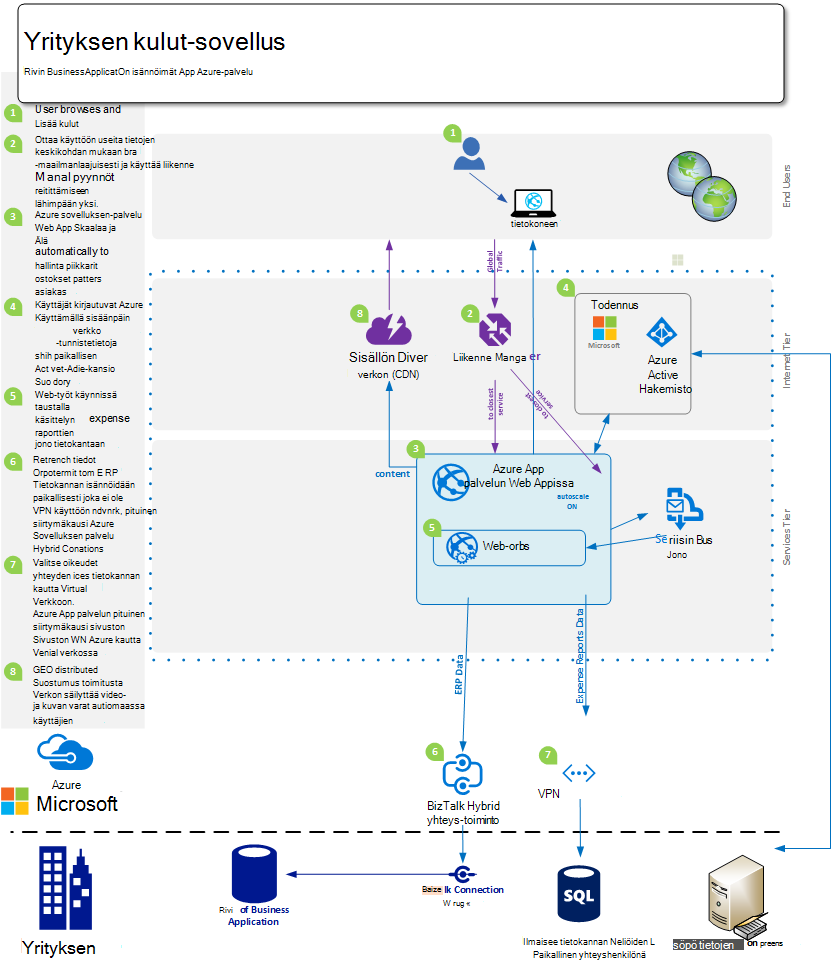
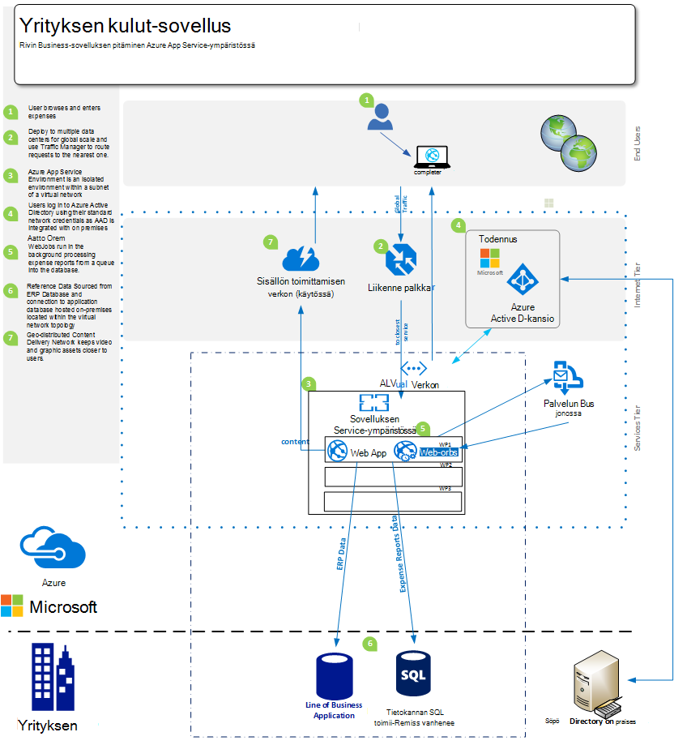
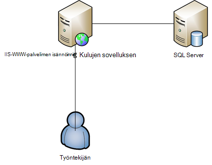

<properties 
    pageTitle="Azure App Web Apps palveluja Enterprise" 
    description="Näyttää, miten Azure App palvelun Web Apps-sovellusten avulla voit luoda yrityksen sivuston ratkaisuja yrityksesi" 
    services="app-service\web" 
    documentationCenter="" 
    authors="apwestgarth" 
    manager="wpickett" 
    editor=""/>

<tags 
    ms.service="app-service-web" 
    ms.workload="web" 
    ms.tgt_pltfrm="na" 
    ms.devlang="na" 
    ms.topic="article" 
    ms.date="07/29/2016" 
    ms.author="anwestg"/>

# Azure App Web Apps palveluja varten yrityksen julkaisu #

Pienentää kustannuksia sekä IT-ratkaisujen nopeampaa nopeasti kehittyvä ympäristössä edellyttää Luo uusia haasteita kehittäjille, IT-ammattilaiset ja valvojat. Käyttäjien etsimäsi yhä rivi, Business ALUESOVELLUKSISTA verkkosovellusten nopeasti, vastaa ja käytettävissä mistä tahansa laitteesta. Yhtä aikaa yritysten rooliin Hyödynnä parantaa tuottavuutta ja tehokkuutta, joka tulee cloud ja mobile-palvelujen, tämä voidaan julkaiseminen helposti kertakirjautumisen Active Directoryn avulla Office 365 yhteistyötä, tietojen kerääminen sisäinen LOB sovelluksesta, joka hakee peräkkäisten tietojen suodattaminen Salesforce yrityksen käyttöönoton laitteiden välillä. [Azure palvelun Web sovellukset](http://go.microsoft.com/fwlink/?LinkId=529714) on yritysluokan-pilvipalvelussa kehittämiseen, testaus ja käynnissä web ja mobile-sovellusten ja verkko-ohjelmointirajapinnan yleinen sivustot. Sen avulla voidaan suorittaa yrityksen sivustot, intranet-sivustoja, business-sovellukset ja digitaalisen markkinointikampanjoita tarkoitettu asteikko ja käytettävyyden sekä jatkuva integrointi tuki palvelinkeskusten yleinen verkossa ja nykyaikaisen DevOps käytäntöjä.  

Tämä julkaisu korostaa kohdistettu erityisesti LOB-Web-sovellusten, aiemmin web-sovellusten siirtäminen ja uusi web Toimialasovellusten ympäristössä käyttöönoton [Web Apps](/services/app-service/web/) -palvelun ominaisuuksia. 

## Käyttäjäryhmälle ##

IT-ammattilaisille, architects ja valvojat, jotka haluat siirtää pilveen web-toiminnoista, jotka ovat parhaillaan käynnissä paikallisen. Web-työmääriä voi olla joko yrityksen työntekijöiden tai kumppanien verkkosovellusten Business.

## Johdanto ##

Palvelun Web sovellukset on ihanteellinen ympäristössä, jossa isännöimiseen sisäisiä ja ulkoisia web-sovellusten ja palveluiden rahaa ylläpito ja sitä tukevat erota ympäristöissä, kun se sisältää edullinen, erittäin skaalattava, hallitun ratkaisu, joilla voit keskittyä toimittaminen käyttäjille liiketoimintatulokset sen sijaan, että yksinkertaistaa merkittävästi summien ajan. Web Apps tarjoaa joustavia ympäristössä, jossa haluat ottaa käyttöön yrityksen web-sovellusten tarjoaminen voi jatkaa todennetaan paikallisen Active Directory kautta integrointi Microsoft Azure Active Directory-tuki on helppoa ja nopeaa ominaisuuksissa tekeminen aikana automaattisesti skaalaus kasvattamista liiketoimintatarpeiden - kaikki hallitut ympäristö, jonka avulla voit keskittyä sovelluksesi ja ei infrastruktuurin-kanssa käytettävät oman sisäinen jatkuva integrointi ja käyttöönoton käytäntöjä,. 

## Ongelma määritys ##

IT-vaaka muuttuu nopeasti, käyttää Siirrä poispäin isännöidä perinteinen palvelimissa niiden hyvin kustannuksia sellainen, joka käyttää tarvittaessa kellonajoiksi pitkä liidi-palveluista, skaalata käsittelemään lataaminen automaattisesti. IT-osastoille liittyy kustannusten vähentäminen ja vaatiman tallennustilan infrastruktuuri ja ylläpidon käyttävät huomion pienentämisestä CAPEX samalla myös joustavuutta kanssa. Vanhat infrastruktuurin ympäristöjen Windows Server 2003, kuten elinkaaren loppuun on alussa IT-osastoille tarkistettava cloud siirron mahdolliset tapa välttää uuden pitkällä aikavälillä kustannuksia. Aiemmin tietohallintajohtajille päätösten ostamisen muiden osastojen; kuitenkin yhä CMOs ja muut business-yksikön perheen kestää sijoitetun niiden on ja miten niiden budjetin jakautuu Lisää aktiivinen rooli. Yritysten on yhä, niiden työvoiman on paljon enemmän mobile kuin koskaan ennen työntekijöiden Etätyö, yksinkertaistaa enemmän aikaa hänen nimeään tarvitse käyttää järjestelmien näissä vapaa-asiakkaiden kanssa.

Yrityksen tarpeet muuttuvat kuukausittain, viikoittain, päivittäin. Yritysten etsimäsi pikaviestien maailmanlaajuisesti säännöllisesti päivitetyn Services uusia ominaisuuksia, kolmannen osapuolen tai sisäisesti täynnä.  Joissakin tapauksissa yritysten myös etsimäsi eristää verkkosovelluksistaan ja käsitellä resurssit, mutta myös tekeminen ominaisuuksien käyttäminen julkisen Cloud tiloja. Käyttäjillä on suurempi odotuksia monta käyttävien omia yksityinen arjen, kuten Office 365-palvelujen kanssa. Odotuksia on samanlainen, ajan tasalla-ominaisuus RTF-palveluiden käyttäminen niiden työ-aika. Tämä vaatimus siten IT on ulkoasun avulla voit ottaa tämän valinnan ja kolmannen osapuolen integrointi business services-ympäristöissä, jotka voit mukauttaa liiketoimintatarpeiden, mutta on luotettava ja rajoitettu kokonaiskustannukset omistajuuden varovainen valintaa.

Kehitystyöryhmiä näyttöä aikana heti business etu, Käynnistä uusia ominaisuuksia valitsemalla säännöllisin väliajoin. Etsimäsi edullinen luotettava ympäristö joka integroituu niiden olemassa työkaluja ja käytännöt – kehitystä, Testaa, Vapauta; ja toimimasta ja IT-osastoille automatisoi käyttöönoton, hallinnasta ja ilmoitat kaikkien nolla käyttökatkot tavoitteen kanssa.

<a href="highlevel" />
## Korkean tason ratkaisu ##

Web-ympäristöissä ja kehysten yhä käytetään kehittämiseen, Testaa ja isännöi yrityssovellussarjan.  Tyypillinen viivalla business-sovelluksen, kuten sisäinen työntekijä kulut järjestelmän usein koostuvat ainoastaan verkkosovellukseen tietokannan varmuuskopioiminen ja tallentaa tiedot sovelluksen kanssa.

Web App-palvelun sovellukset on hyvä vaihtoehto isännöimiseen näiden sovellusten ojentamassa skaalattava ja luotettava infrastruktuuria, joka hallitsee ja lähellä nollaa manuaalisia toimia ja käyttökatkot asennettu. Microsoft Azure-ympäristö on useita web-sovellusten isännöimät verkkosovelluksissa Microsoft Azure SQL-tietokanta, hallitun skaalattava relaatio tietokanta-muodossa--palvelun, Suositut palvelut kumppaneita, kuten ClearDB MySQL-tietokantaan ja MongoDB tietojen säilytysasetukset.

Vaihtoehtoinen menetelmä on aiemmin kiinnostusta paikallinen käyttö. Esimerkkitapaus työntekijöiden kulujen järjestelmän haluta säilyttää tiedot tallennetaan sisäinen infrastruktuurin kuluessa. Tämä voi johtua integroinnin, jossa sisäinen (raportointi, palkanlaskennan, Laskutus jne.) tai IT-hallinnon vaatimus tarpeiden tyydyttämiseksi.  Web Apps antaa käyttöösi useita, voit muodostaa yhteyden käytössä paikallisen infrastruktuurin tavoista:

- [Sovelluksen palvelun ympäristöissä](app-service-app-service-environment-intro.md) - sovelluksen palvelun ympäristöissä (Ietokannan) on uusi Premium-toiminto, jolla on viimeksi lisääminen Microsoft Azure-sovelluksen palvelun tarjoaa.  ASEs tarjoavat täysin erillään ja erillinen ympäristön suorittamisen suojatusti Azure App palvelun sovellukset hyvin tasolla samalla eristystaso ja turvallinen Verkkokäyttö   
- [Hybrid yhteydet](../biztalk-services/integration-hybrid-connection-overview.md) – Hybrid yhteydet ovat ominaisuus Microsoft Azure BizTalk Services ja verkkosovelluksissa muodostaa paikallinen resurssien suojatusti, kuten SQL Server, MySQL, verkko-ohjelmointirajapinnan ja mukautetun verkkopalvelut käyttöön. 
- [Virtuaalinen verkon integrointi](https://azure.microsoft.com/blog/2014/09/15/azure-websites-virtual-network-integration/) – verkkosovelluksissa integrointi Azure Virtual Network avulla voit muodostaa koodiin Azure Virtual verkkoon joka vuorostaan voidaan yhdistää käytössä paikallisen infrastruktuurin sivusto sivusto VPN-verkon kautta. 

Seuraavissa kuvissa kuvaavat Esimerkki ylätason ratkaisu connectivity vaihtoehtojen paikallisen resurssien avulla.  Ensimmäinen esimerkki näyttää, miten tämä onnistuu käyttämällä perusominaisuudet Azure App palvelun ja toinen näyttää, miten voi olla käytettäessä ojentamassa-sovelluksen palvelun ympäristöissä premium.

Vakio App palvelun ominaisuuksien avulla:

Sovelluksen Service-ympäristön avulla:

## Liiketoiminnan edut ##

Web App-palvelun sovellukset on business-toimintoja, jotka antavat paljon edullinen ja joustava toimittamista varten yrityksen tarpeet-funktion isäntä. 

### PaaS malli ###

Web App-palvelun sovellukset on luotu ympäristössä Service-malliksi, joka sisältää useita kustannus- ja tehokkuutta säästöjen.  Enää haluat käyttävät hallinta VMs, korjataan käyttöjärjestelmät ja kehysten tuntia. Web Apps on automaattisesti korjaustiedoston sisältävä ympäristössä, jolloin voit keskittyä web-sovellusten ja ole VMs, jätä ryhmiä vapaasti tarjota muita liiketoiminta-arvon.

Aina verkkosovelluksissa PaaS malli mahdollistaa piirissä DevOps menettelytavan täyttämään niiden tavoitteet. Yrityksen kuin siis koko hallinta ja integrointi koko sovelluksen koko elinkaaren, mukaan lukien kehitystä, testaaminen, Vapauta, seuranta ja hallinta ja tuki. 

Kehitystyöryhmiä jatkuva integrointi ja käyttöönoton työnkulkuja voidaan määrittää Visual Studio Team Services, GitHub, TeamCity, Hudson tai BitBucket, automaattinen muodosta, Testaa ja ottaminen käyttöön nopeammin release jaksot samalla, kun pienentämisestä hankaukselle toimenpiteitä vapauttaminen olemassa olevan infrastruktuurin käyttöönoton ottaminen käyttöön. Web Apps tukee myös useita testaus ja väliaikaisen ympäristöissä release työnkulun luominen enää haluat varata tai laitteiston varaaminen näiltä, voit luoda niin monta ympäristöissä kuin haluat ja määrittää omia muuntaa vapauttamista työnkulun. Päätät voi vapauttaa testi paikka ja tietolähteen ohjausobjektin, suorittaa sarjan ja tutkimusten onnistumiseen yhteydessä yrityksen edistää vaiheen paikka ja lopuksi Vaihda tuotannon ei käyttökatkot lisätty hyötyvät, verkkosovellusten isännöimät Web Apps esiladattuja ja antamaan paras mahdollinen asiakas-toiminto kuuman kanssa.  Lisäksi yritysten tehdä käyttö-sovelluksen palvelun Web Apps-sovellusten ominaisuuksia tuotannon Testing suora osa-liikenne paikalliseen eri paikka, Vahvista muutokset, ennen kuin kaikki liikenne siirrytään uudet käyttöönoton tai palata edelliseen käyttöönottoon kaikki liikenne. 

Toimintojen ryhmiä voi varma, että ne ovat paras mahdollinen sijainti vastata ongelmat niiden isännöimät Web Apps-sovellusten kanssa myös sisäinen web-sovellusten avulla seurannassa ja ilmoitusten ominaisuudet. Olisi toimintojen ryhmiä on jo sijoitetaan analyysin ja seurantaa ratkaisuja, esimerkiksi Microsoft Visual Studio hakemuksen tiedot, uusi Relic ja AppDynamics. Nämä tuetaan myös täysin Web Apps-sovellusten jatkuvuuden ja tuttuja ympäristöissä, josta voit seurata web-sovellusten käyttöön.

Lopuksi verkkosovelluksissa mahdollistaa varmuuskopioiminen automaattisesti oman app(s) ja isännöityä tietokannat suora Azure-Blob-säiliö säilöön. Antaa voit helposti tavalla ja hyvin edullinen menetelmä, jota käytetään tietojen, vähentää kompleksiluvun paikallisen laitteiston ja ohjelmiston edellyttää palauttaminen.

### Siirron helpottaminen ###

Laitteiston ylläpito ja kierto on avaimen ongelman yrityksille release jaksot laitteiston ja käyttöjärjestelmille nopeuttaa. Ehkäpä sinulla on Windows Server 2003 R2-palvelimien jotka 2015 tuki loppuun tulossa määrän, mutta niitä silti isännöit avaimen verkkosovellusten yrityksesi? Web App-palvelun sovellukset on hyvä candidate isännöimiseen ne web-sovellukset, ja voit järkeistäminen business laitteiston myynti. Web Apps-sovellusten avulla voit käyttää solualueeseen, jossa voi hallita ja ylläpitää osana palvelua ei tarvitse ottaa huomioon korvaavan ja kustannuksia infrastruktuurin budjetin osana laitteistomääritykset.  Siirron voi olla pelkästään kopio ja liitä toiminnon aiemmin käyttöönoton verkkosovelluksissa tai monimutkaisempia siirron missä Web Apps siirron hallinnan käyttäminen Lisää arvo. Siirretyt verkkosovellusten Nauti koko eri Azure Services-integrointi lisäpalveluja web-sovelluksiin. Voit esimerkiksi ajattelet lisääminen Azure Active Directory käytönvalvonta sovelluksen käyttäjien liitos suojausryhmille perusteella. Toinen esimerkki voidaan lisääminen välimuistin palvelujen parantaa suorituskykyä ja vähentää viive-antamalla paremmin yleinen käyttökokemusta. 

### Yrityksen luokan isännöinnin ###

Web App-palvelun sovellukset on vakaata ja luotettava-ympäristö, jotka on osoitettu vastaavan voivat käsitellä business erilaisia on pieni sisäinen kehitys- ja toiminnoista, skaalatun erittäin suuri tietoliikenne sivustot. Web-sovellusten käyttämisestä teet käyttäminen samassa yrityksen luokan Isäntäympäristö Microsoft kuin yritys käyttää suuren arvon web toiminnoista. Web Apps-sovellusten ja kaikki palvelut Azure-ympäristössä, on suunniteltu suojaus ja noudattaminen lainmukaisia, kuten ISO (ISO/IEC 27001:2005); SOC1 ja SOC2 SSAE 16/ISAE 3402 todistuksia, HIPAA BAA, PCI ja Fedramp hyvin ydin kunkin elementin ja toimintoa, katso lisätietoja, katso [http://aka.ms/azurecompliance](/support/trust-center/compliance/). 

Microsoft Azure-ympäristön avulla roolin perusteella luvan ohjausobjektien ottaminen käyttöön yrityksen tasolla resursseihin Web-sovelluksista. RBAC antaa yrityksille potenssiin toteuttavien omia access-hallintakäytännöt kaikkien niiden kohteiden Azure-ympäristön käyttäjien määrittäminen ryhmiin ja tarvittavia oikeuksia määritteleminen puolestaan ryhmille vastaan kohteiden, kuten verkkosovellukseen. Saat lisätietoja RBAC Azure [http://aka.ms/azurerbac](../active-directory/role-based-access-control-configure.md). Välityksellä verkkosovelluksissa voidaan että web-sovellusten on otettu käyttöön turvallinen ympäristössä ja sinulla on täydet oikeudet, mitkä alueelle oman varat on otettu käyttöön. 

Azure App palvelun ympäristöissä [http://aka.ms/aseintro](http://aka.ms/aseintro) ovat yritysasiakkaille haluaa käyttää Azure App palvelun uusi premium-palvelun suunnitelma-asetus ja nämä ovat täysin erillään ja erillinen ympäristössä.  Näin yritysasiakkaille sovellusten, voit hyödyntää erittäin suuri asteikko samalla myös, että saapuvan ja lähtevän tietoliikenteen täydet oikeudet ja ASEs mahdollistavat sovellusten on nopea suojattuja yhteyksiä virtual verkoissa paikallisen resursseja.

Sovelluksen palvelun Web Apps myös voivat käyttää kaikkia käytössä paikallisen-sijoitukset tarjoamalla mahdollisuus yhdistää takaisin sisäiset resurssit, kuten tietovarasto tai SharePoint-ympäristössä. Kuten edellä [Korkean tason](#highlevel) ratkaisussa voit tehdä Hybrid yhteyksien ja Virtual verkkoyhteyden avulla muodostaa yhteyksiä paikallisen infrastruktuuri ja palveluista.

### Maailmanlaajuisesti ###

Web App-palvelun sovellukset on yleinen ja skaalattava-ympäristö kasvaa ja mukauttaa kasvava business tarpeisiin nopeasti ja mahdollisimman vähän pitkällä aikavälillä suunnittelu ja kustannukset kanssa web-sovellusten käyttöön. Tyypillinen paikallisen infrastruktuurin skenaarioille laajentaminen ja tarvittaessa kasvu sekä paikallisesti ja maantieteellisesti edellyttävät suuria määriä hallinnointi, suunnittelu ja menot valmistelu ja hallitaan lisäinfrastruktuuri. Web Apps tarjoaa mahdollisuuden skaalata web-sovellusten ebb ja tarpeen sujuvuutta. Käyttäen esimerkiksi kuukauden useimpia kulujen sovelluksen esimerkkinä, käyttäjät voivat Vaalea käyttäjien sovelluksen, mutta määräaikana kulut lähetysten kirjoitettava kunkin kuukauden ja käyttö kasvaa sovelluksessa, Web Apps-sovelluksista on valmistelu automaattisesti lisää infrastruktuurin sovelluksen ominaisuuksien ja sitten kun käyttö on subsided uudelleen sen skaalata takaisin määrität perusaikataulun infrastruktuuri.

Web Apps sisältyy yleisesti 24 palvelinkeskusten kaikkialla maailmassa ja kasvava. Alueiden ja sijainnin viimeksi päivitetty luetteloon Tutustu [http://aka.ms/azlocations](http://aka.ms/azlocations). Web Apps-sovellusten kanssa yrityksesi helposti toteuttaa yleinen reach ja skaalausta. Kun yrityksesi kasvaa uusi alueisiin, raportointi, jota käytetään sovelluksen raporttinäkymät- ja online-isännästä helposti voidaan ottaa huomioon muita palvelinkeskusten ja yhteyshenkilönä Paikalliset käyttäjät kaukana nopeammin Web Apps-sovellusten ja Azure liikenteen hallinta, kaikki lisätty hyötyvät skaalattava infrastruktuurin alapuolella ei voi sopimuksen sekä laajentavat tarpeisiin aluetoimistojen muuta kuin yhdistelmä kautta.
 
## Ratkaisun tiedot ##

Katsotaan Esimerkki sovellusten-siirron skenaario. Tämä jäsentää tiedot siitä, miten sovelluksen palvelun Web Apps-toimintoja muodostaa erinomainen ratkaisu ja liiketoiminta-arvon.
 
Tässä esimerkissä koko on keskustella business-sovelluksen on raportoinnin sovellus, jonka avulla työntekijät voivat lähettää kulunsa korvaus kulun. Sovelluksen isännöidään Windows Server 2003 R2 käynnissä IIS6 ja tietokanta on SQL Server 2005-tietokantaan. Syy on valita vanhempia palvelimen kohdealueen tulevien loppu on palvelu, Windows Server 2003 R2 ja SQL Server 2005: n kanssa, mutta ne ovat [Työkalut](http://aka.ms/websitesmigration) ja siirry Azure kyselyjä työmääriä automaattisesti [ohjeita](http://aka.ms/websitesmigrationresources) . Tässä esimerkissä käytetään kuvion koskevat liittyvän mielessä leveä verity siirron skenaarioita. 

### Siirtää aiemmin luotuun sovellukseen ###

Vaiheessa siirtymisen Web Apps-sovellusten liiketoiminta-sovelluksen yleinen-ratkaisun on olemassa olevan sovelluksen varat ja arkkitehtuuri tunnistaa. Tässä esimerkissä on isännöidään yhden IIS-palvelimen isännöimät erillistä SQL Server-tietokannassa alla olevassa kuvassa osoitetulla tavalla ASP.NET web-sovelluksen. Työntekijöiden kirjautumisen käyttäjänimi ja salasana yhdistämällä järjestelmään, ne Kirjoita kulujen tiedot ja lataa kuitteja tai skannattuja kopiot-tietokantaan, kunkin kohteen kulun. 
 

#### Huomioon otettavat kohteet ####

Kun siirto-sovellus paikallisen ympäristön, haluat ehkä kannattaa pitää mielessä muutama Web Apps-rajoituksia. Seuraavassa on joitakin keskeisiä hyödyllisiä otettava huomioon siirrettäessä verkkosovellusten Web Apps ([http://aka.ms/websitesmigrationresources](http://aka.ms/websitesmigrationresources)):

-   Portti sidontojen – Web Apps tukee vain porttia 80 HTTP ja HTTPS tietoliikenteen porttiin 443. Jos sovellus käyttää muita porttia ja valitse kerran uuteen sovelluksen tekee käyttää HTTP portin 80 ja 443 HTTPS tietoliikenteen portin. Tämä on usein vaarattomia ongelma on yleinen, paikallisen käyttöönotoissa, jotta eri portit, jotta voit ratkaista toimialueen nimiä, erityisesti kehittäminen ja testaa ympäristöissä käyttäminen
-   Todennus – Web Apps tukee Anonyymi todentaminen oletusarvon mukaan ja todennusmenetelmien merkittyä sovelluksen. Web Apps voit tarjota Windows-todennuksen, kun sovellus on integroitu Azure Active Directory ja ADFS vain. Tämä on toiminto, joka on kuvattu tarkemmin [Tässä](http://aka.ms/azurebizapp) 
-   GAC perusteella kokoonpanot – verkkosovelluksissa ei salli käyttöönoton kokoonpanojen, yleiseen kokoonpanon välimuistin (GAC). Sen vuoksi, jos sovellus jätettävien tekee käyttää tätä toimintoa paikallisen, harkitse kokoonpanon siirtämistä sovelluksen bin-kansio.
-   IIS5 Yhteensopivuustila – Web Apps ei tue IIS5 yhteensopivuustila ja sellaisenaan verkkosovelluksissa jokaiselle esiintymälle ja kaikista verkkosovelluksista ylätason Web Apps-esiintymä-kohdassa Suorita sama työntekijä prosessin yksittäisen sovellussarjan.
-   COM-kirjastojen – Web Apps-sovellusten käyttö ei salli COM-komponenttien rekisteröinti-ympäristössä. Näin ollen jos sovellus on käyttää minkä tahansa COM-komponentteja, nämä on kirjoitettava hallittua koodia ja ottaa käyttöön sovelluksen kanssa.
-   ISAPI suodattimet – ISAPI suodattimia voit ehkä tueta verkkosovelluksissa. Ne täytyy ottaa käyttöön sovelluksen osana ja rekisteröity web-sovelluksen koodin korostetut rivit. Lisätietoja on artikkelissa [http://aka.ms/azurewebsitesxdt](web-sites-transform-extend.md). 

Seuraavissa artikkeleissa on otettu huomioon, kun web-sovelluksen on oltava valmiina pilveen. Älä huoli ja jos jotkin aiheet eivät täyty täysin, kun siirtotyökalua käytetään avulla parhaat työmäärään siirtymiseen. 

Siirtoprosessia seuraavat vaiheet ovat sovelluksen web App-palvelun ja Azure SQL-tietokannan luomiseen. On useita koot suorittimen sydämiä erilaisten numerolla esiintymien Web Apps-sovellusten ja RAM-Muistia summat käytettävissä, voit valita perustuvat web-sovellusten vaatimus. Lisää tiedot ja hinnoittelu, katso [http://aka.ms/azurewebsitesskus](/pricing/details/websites/). Microsoft Azure SQL-tietokanta caters vastaavasti kaikissa yrityksen tarpeet eri palvelutasot ja suorituskyvyn tasot, jos täytettävä vaatimuksia. Lisätietoja tukikäytännöistä [http://aka.ms/azuresqldbskus](/pricing/details/sql-database/). Luomiasi sovellus App palvelun Web Apps-joko FTP tai WebDeploy ladataan ja siirtämällä sitten tietokannan päälle.

Tämän siirron ratkaisun käyttää Azure SQL-tietokantaan, mutta ei ei vain tietokanta, joka on tuettu Azure. Yritysten myös hyödyntää MySQL-MongoDB, Azure DocumentDB käyttö ja monista muista lisäosat, jotka voi ostaa [Azure-kaupan](/marketplace/partner-program/)kautta. 

Azure SQL-tietokantaan luotaessa eri ovat käytettävissä aiemmin luodun tietokannan tuominen paikallisen palvelimen luomasta komentosarjan aiemmin luodun tietokannan [tietojen tason sovelluksen vieminen ja tuominen](http://aka.ms/dacpac). 

Kulujen sovelluksen tietokanta on luotu luomalla uuden Azure SQL-tietokannan, SQL Server Management Studiossa ja suorittamalla sitten komentosarjan tietokantayhteyden muodostamisessa muodosta tietokantarakenteen ja lisää aikatauluun paikallisen tietokannan tiedot.

Tässä ensimmäisessä vaiheessa siirron viimeisessä vaiheessa edellyttää tietokannan sovellukselle yhteysmerkkijonojen päivitetään. Tämä onnistuu Azure portaalin kautta. Kunkin web-sovelluksen voit muokata sovelluksen tiettyjä asetuksia, kuten kaikki yhteyden merkkijonoja, mitä tahansa käytössä tietokantayhteyden muodostamisessa sovelluksen käytössä.

### Vaihtoehtojen avulla Azure SQL-tietokanta ###

Azure-ympäristö on useita vaihtoehtoja Azure SQL-tietokannan käyttäminen sovellusten ensisijainen verkkotietokannan, tämä on käyttöön eri toiminnoista eli Käytä NoSQL-ratkaisun tai ottaa käyttöön käyttöympäristön business tietojen tarpeita vastaavaksi. Esimerkiksi yrityksen voivat sisältää tietoja, joita ei voi tallentaa sähköntuotannosta tai julkinen cloud-ympäristössä ja näin ollen näyttäisi ylläpitää niiden paikallisen tietokannan käyttöä.

#### Yhteys paikallisen resursseja ####
Web App-palvelun sovellukset on useita vaihtoehtoja paikallisen resurssit, kuten tietokantoja, valitse yhteyden ottaminen käyttöön aiemmin suuren arvon infrastruktuurin uudelleenkäyttöä varten. Vaihtoehdot ovat alla kuvatulla tavalla:

- Sovelluksen palvelun ympäristöissä eristetty ja luotuihin aliverkon virtual verkon käyttöön siksi ympäristön yksityinen päätepisteet saman virtual verkko - [http://aka.ms/appserviceasenetworking](http://aka.ms/appserviceasenetworking) sijaitseviin viestintään
- Web Apps Virtual verkon integrointi tukee Web Apps-sovelluksista ja Azure Virtual verkon salliminen pääsy resurssien käynnissä Virtual verkossa, jonka, jos sivusto sivusto VPN-verkon käytössä paikallisen yhteys avulla suoraan käytössä paikallisen järjestelmien välinen integrointi.
- Hybrid yhteydet ovat Azure BizTalk palvelujen ominaisuus ja anna helposti muodostaa yhteyden yksittäisiä paikallisen kuten SQL Server, MySQL, HTTP-verkko-ohjelmointirajapinnan ja eniten mukautetun verkkopalvelut resurssit.

#### Asteikko ja Vikasietoisuudelle ####

Kun yrityksen kasvaa sen työvoiman hankinnat tai luonnollinen orgaaniset kasvu niin liian on web-sovellusten asteikko vastaamaan uusia tarpeiden. Varmasti tänään on yleisiä vieläkin leviäminen yhtä sijaitsevat ryhmiä ja remote työntekijöiden nähdäksesi, esimerkiksi toimistot Yhdysvalloissa, Europe ja Aasian, mobile myynnin yhtiöiden pakottaa monissa Lisää alueista. Web Apps tukee käsitellään joustavasti muutoksia mittakaava näppäimistöllä ja automaattisesti.

Web App-palvelun sovellusten avulla verkkosovellusten on määritettävä skaalata automaattisesti Azure-portaalissa kaksi vektorit – ajoitettu aikoja tai suorittimen käytön mukaan kautta. Web Apps Automaattinen skaalaus tarjoaa edullinen ja erittäin joustava tavan mukauttaminen suurempi käyttö kaikki business-sovellukset, web-sovelluksista, kuten järjestelmän markkinoille sivustoihin, mikä versio hyvin purskeen liikenteen ylentäminen lyhyt ajaksi Microsoftin kulujen muutokset. Lisätietoja ja ohjeita skaalaus web-sovellusten Web Apps-sovellusten, katso, [miten asteikko sivustojen](web-sites-scale.md).

Yleistä ympäristö mahdollistaa lisäksi verkkosovelluksissa skaalauksen joustavuutta Liiketoiminnan jatkuvuus ja vikasietoisuudelle mahdollisimman jakauma web-sovellusten ja niiden resurssien eri palvelinkeskusten ja maantieteellisten alueiden välillä.

## Yhteenveto ##
Web App-palvelun sovellukset tarjoaa joustavia, edullinen, vastaa ratkaisun business nopeasti kehittyvä ympäristössä dynaaminen tarpeisiin. Web Apps auttaa yritysten Suurenna tuottavuutta ja tehokas tekeminen käyttää hallitun ympäristön nykyaikaista DevOps ominaisuuksia ja rajoitettu kädet hallintaa, käyttämisessä on enterprise-ominaisuuksien mittakaava, toimintakykyyn, suojaus ja integrointi paikallisen resurssit.

## Soita-toiminto ##
Lisätietoja Azure App palvelun Web Apps-palvelu, johon lisätietoja Orpotermit käy [http://aka.ms/enterprisewebsites](/services/websites/enterprise/) ja kirjaudu sinua tänään [http://aka.ms/azuretrial](/pricing/free-trial/) arvioida palvelua ja tietää, mitä etuja yrityksesi kokeiluversion käyttäjäksi.

[AZURE.INCLUDE [app-service-web-whats-changed](../../includes/app-service-web-whats-changed.md)]

[AZURE.INCLUDE [app-service-web-try-app-service](../../includes/app-service-web-try-app-service.md)]
 
 
