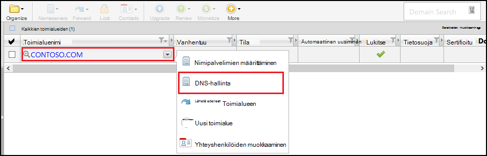
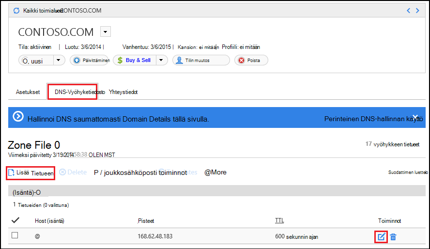
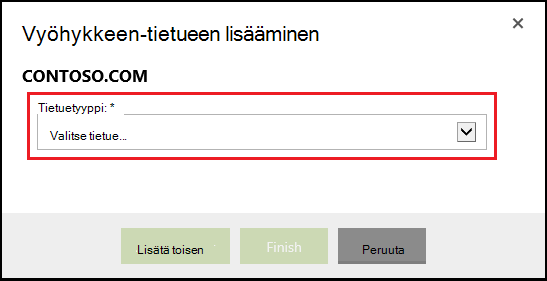
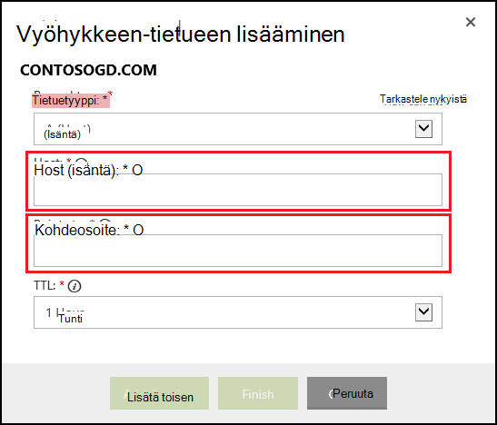

<properties
    pageTitle="Mukautetun toimialuenimen määrittäminen Azure App Service (GoDaddy)"
    description="Opettele käyttämään toimialueen nimeä godaddyltä Azure Web Apps-sovellusten kanssa"
    services="app-service"
    documentationCenter=""
    authors="erikre"
    manager="wpickett"
    editor="jimbe"/>

<tags
    ms.service="app-service"
    ms.workload="na"
    ms.tgt_pltfrm="na"
    ms.devlang="na"
    ms.topic="article"
    ms.date="01/12/2016"
    ms.author="cephalin"/>

# Mukautetun toimialuenimen määrittäminen Azure App Service (hankittu godaddyltä suoraan)

[AZURE.INCLUDE [web-selector](../../includes/websites-custom-domain-selector.md)]

[AZURE.INCLUDE [intro](../../includes/custom-dns-web-site-intro.md)]

Jos olet ostanut toimialueen kautta Azure palvelun Web sovellukset viitata [Verkkosovelluksissa Osta toimialue](custom-dns-web-site-buydomains-web-app.md)viimeisessä vaiheessa.

Tässä artikkelissa on ohjeita käyttämällä mukautettua toimialuenimeä, jotka on ostettu suoraan [GoDaddy](https://godaddy.com) [Sovelluksen palvelun Web Apps -sovellusten](http://go.microsoft.com/fwlink/?LinkId=529714)kanssa.

[AZURE.INCLUDE [introfooter](../../includes/custom-dns-web-site-intro-notes.md)]

##Perustietoja DNS-tietueet

[AZURE.INCLUDE [understandingdns](../../includes/custom-dns-web-site-understanding-dns-raw.md)]

## Mukautetun toimialueen DNS-tietueen lisääminen

Mukautetun toimialueen liitettävä online-palvelun sovelluksen, on lisättävä uusi merkintä DNS-taulukon mukautetun toimialueen varten GoDaddy-työkalujen avulla. Seuraavien vaiheiden avulla voit paikantaa DNS-Työkalut go daddy.com-sivustosta

1. Kirjaudu tiliisi go daddy.com-sivustosta ja valitse **Oma tili** ja **omien toimialueiden hallinta**. Valitse lopuksi avattavasta valikosta toimialuenimi, jota haluat käyttää Azure web App-ohjelmalla ja valitse **DNS-hallinta**.

    

2. Siirry **Domain details** -sivun **DNS Zone File** -välilehti. Tämä on käytettävä lisäämällä ja muokkaamalla toimialuenimen DNS-tietueet kohta.

    

    Valitse **Add Record** , voit lisätä olemassa olevaan tietueeseen.

    Jos haluat **muokata** tietuetta Valitse tietueen vieressä kynä ja paperi-kuvake.

    > [AZURE.NOTE] Ennen kuin lisäät uusia tietueita, Huomaa, että GoDaddy on jo luotu Suositut alitoimialueisiin (jota kutsutaan **Host (isäntä)** -editorin) kuten **sähköpostia**, **tiedostoja**tai **sähköpostin**DNS-tietueet. Jos nimi, jota haluat käyttää jo olemassa, muokkaamaan sijaan uuden olemassa olevaan tietueeseen.

4. Kun tietue lisätään, sinun on valittava tietuetyyppi.

    

    Seuraavaksi sinun on määritettävä **Host** (mukautettua toimialuetta tai aliraportti toimialue) ja sen, mitä se **osoittaa**.

    

    * On **(isäntä)-tietue** - lisättäessä sinun on määritettävä **Host (isäntä)** -kentän joko **@** (tämä osoittaa pääkansion toimialuenimi, esimerkiksi **contoso.com**) *(toisiaan vastaavissa useita alitoimialueisiin yleismerkkiä) tai haluat käyttää aliraportti toimialue (esimerkiksi * *www**.) Sinun on määritettävä * *viittaa** Azure koodiin IP-osoite-kenttään.

    * Kun lisäät **CNAME (alias)-tietue** - haluat käyttää aliraportti toimialueen on määritettävä **Host (isäntä)** -kentän. Esimerkki: **www**. Määritä **Points to** -kentän arvoksi **. azurewebsites.net** toimialuenimen Azure koodiin. Esimerkiksi **contoso.azurewebsites.net**.

5. Valitse **Lisää toiseen**.
6. Valitse **TXT** tietuetyypin ja valitse Määritä **Host (isäntä)** -arvo **@** ja **kohdeosoite-** arvoa ** &lt;yourwebappname&gt;. azurewebsites.net**.

    > [AZURE.NOTE] TXT-tietueen käytetään Azure vahvistamiseen, joka on kuvattu A-tietuetta tai ensimmäisen TXT-tietueen toimialueen omistajuuden. Kun toimialue on määritetty Azure-portaalissa web App-sovellukseen, voit poistaa tämän TXT-tietueen arvon.

5. Kun olet lisännyt tai muokkaat tietueita, valitse **Valmis** , Tallenna muutokset.

## Ota käyttöön toimialuenimen web Appissa

[AZURE.INCLUDE [modes](../../includes/custom-dns-web-site-enable-on-web-site.md)]

>[AZURE.NOTE] Jos haluat aloittaa Azure App palvelun ennen rekisteröimässä Azure-tili, siirry [Yritä App palvelu](http://go.microsoft.com/fwlink/?LinkId=523751), jossa lyhytkestoinen starter verkkosovellukseen heti voit luoda sovelluksen-palvelussa. Ei ole pakollinen; luottokortit ei ole sitoumukset.

## Mikä on muuttunut
* Katso muutoksen opas verkkosivuilta App palveluun: [Azure App palvelu ja sen vaikutus aiemmin Azure-palvelut](http://go.microsoft.com/fwlink/?LinkId=529714)
