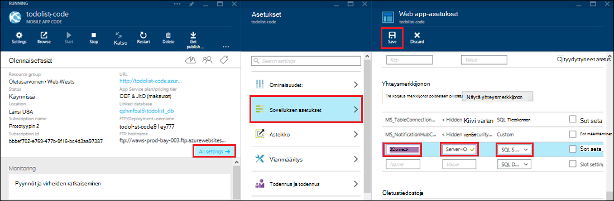

<properties 
    pageTitle="Paikallisen resurssien hybrid yhteyksiä käyttäviä Azure sovelluksen-palvelussa" 
    description="Azure-sovelluksen palvelun verkkosovellukseen ja paikallisen-resurssi, joka käyttää staattinen porttinumeroa välisen yhteyden luominen" 
    services="app-service" 
    documentationCenter="" 
    authors="cephalin" 
    manager="wpickett" 
    editor="mollybos"/>

<tags 
    ms.service="app-service" 
    ms.workload="na" 
    ms.tgt_pltfrm="na" 
    ms.devlang="na" 
    ms.topic="article" 
    ms.date="02/03/2016" 
    ms.author="cephalin"/>

#Paikallisen resurssien hybrid yhteyksiä käyttäviä Azure sovelluksen-palvelussa

Voit muodostaa Azure App palvelun sovelluksen mihin tahansa paikallisen resurssiin, joka käyttää staattinen porttinumeroa, kuten SQL Server, MySQL, HTTP-verkko-ohjelmointirajapinnan ja useimmat mukautetun verkkopalveluihin. Tässä artikkelissa kerrotaan hybrid välisessä App palvelun ja paikallisen SQL Server-tietokannan luominen.

> [AZURE.NOTE] Hybrid yhteydet-ominaisuuden Web Apps-osa on käytettävissä vain [Azure-portaalissa](https://portal.azure.com). Yhteyden luominen BizTalk palvelut-kohdassa [Hybrid yhteydet](http://go.microsoft.com/fwlink/p/?LinkID=397274). 
> 
> Sisällön koskee myös Mobile-sovellusten Azure sovelluksen-palvelussa. 

## Edellytykset
- Azure tilaus. Artikkelissa [Azure maksuttoman kokeiluversion](https://azure.microsoft.com/pricing/free-trial/)ilmainen tilaus. 
 
    Jos haluat aloittaa Azure App palvelun ennen rekisteröimässä Azure-tili, siirry [Yritä App palvelu](http://go.microsoft.com/fwlink/?LinkId=523751), jossa lyhytkestoinen starter verkkosovellukseen heti voit luoda sovelluksen-palvelussa. Ei ole pakollinen; luottokortit ei ole sitoumukset.

- Jos haluat käyttää paikallisen SQL Server- tai SQL Server Express tietokannan hybrid yhteyden, TCP/IP on otettava käyttöön staattinen porttiin. Oletusesiintymää käyttämisestä SQL Server on suositeltavaa, sillä se käyttää staattinen porttia 1433. Tietoja asennuksesta ja määrityksestä hybrid yhteydet käytettäväksi SQL Server Express on ohjeaiheessa [yhteyden muodostaminen paikalliseen SQL Serveriä Azure sivustosta Hybrid yhteydet](http://go.microsoft.com/fwlink/?LinkID=397979).

- Tietokone, jossa on kuvattu paikallisen Hybrid Yhteyksienhallinnan agentti asennetaan tämän artikkelin:

    - On voitava muodostaa yhteys Azure portin 5671 kautta
    - On voitava muodostaa yhteys *isäntänimi*: paikallisen resurssin*PortinNumero* . 

> [AZURE.NOTE] Tämän artikkelin vaiheissa oletetaan, kun käytät selaimessa, joka isännöi paikallisen hybrid yhteyden agentti tietokoneesta.

## Web-sovelluksen luominen Azure-portaalissa ##

> [AZURE.NOTE] Jos olet jo luonut verkkosovellukseen tai Mobile-sovelluksen Taustajärjestelmä Azure-portaalissa, jota haluat käyttää tässä opetusohjelmassa, voit Ohita [Hybrid yhteyden](#CreateHC) ja BizTalk palvelu ja Käynnistä sieltä.

1. Valitse [Azure Portal](https://portal.azure.com)vasemmassa yläkulmassa **Uusi** > **Web + Mobile** > **Web Appissa**.
    
    ![Uusi web app][NewWebsite]
    
2. **Online** -sivu, anna URL-osoite ja valitse **Luo**. 
    
    ![Sivuston nimi][WebsiteCreationBlade]
    
3. Hetken kuluttua web-sovellus on luotu ja sen web app-sivu tulee näkyviin. Sivu on pystysuunnassa vieritettävä raporttinäkymä, jonka avulla voit hallita sivuston.
    
    ![Sivuston käynnissä][WebSiteRunningBlade]
    
4. Voit tarkistaa-sivusto, voit valita näytettävän sivun **Selaa** -kuvakkeen.
    
    ![Valitse Selaa ja katso web Appissa][Browse]
    
    ![Web-sovelluksen oletussivun][DefaultWebSitePage]
    
Seuraavaksi luot hybrid yhteyden ja BizTalk palvelun web-sovelluksen.

## Luo Hybrid yhteyden ja BizTalk-palvelu ##

1. Web app-sivu valitsemalla **kaikki asetukset** > **Verkko** > **määrittäminen hybrid-yhteyden päätepisteet**.
    
    ![Hybrid yhteydet][CreateHCHCIcon]
    
2. Valitse **Lisää**Hybrid yhteydet-sivu.
    
    <!-- ![Add a hybrid connnection][CreateHCAddHC]
-->
    
3. **Lisää hybrid yhteyden** -sivu avautuu.  Tämä on ensimmäinen hybrid yhteyden, **Uusi hybrid yhteys** -vaihtoehto on alustavasti valinnut vaihtoehdon ja **Luo hybrid yhteys** -sivu avautuu.
    
    ![Hybrid yhteyden luominen][TwinCreateHCBlades]
    
    Valitse **Luo hybrid yhteyden sivu**:
    - **Nimi**Anna yhteyden nimi.
    - Kirjoita **isäntänimi**paikallisen tietokoneen, joka isännöi resurssin nimen.
    - Kirjoita **portin**porttinumero paikallisen resurssin käyttää (SQL Server oletusesiintymää 1433).
    - Valitse **Biz puhua palvelu**

4. **Luo BizTalk Service** -sivu avautuu. BizTalk-palvelun nimi ja valitse sitten **OK**.
    
    ![Luo BizTalk-palvelu][CreateHCCreateBTS]
    
    **Luo BizTalk Service** -sivu sulkeutuu ja näkyviin tulee **Luo hybrid yhteys** -sivu.
    
5. Valitse Luo hybrid yhteys-sivu valitsemalla **OK**. 
    
    ![Valitse OK][CreateBTScomplete]
    
6. Kun prosessi on valmis, ilmoitusalueen portaalissa kertoo, että yhteys on luotu onnistuneesti.
    <!---TODO

    Kaikki epäonnistuu tämä vaihe. Ei voi luoda BizTalk palvelun dogfood-portaalissa. Voin vaihtaa perinteinen-portaaliin (täysi portaalin) ja luotu BizTalk-palvelua, mutta se ei vaikuta avulla voit connnect ne – kun olet valmis Luo hybrid yhteys vaihe, saat seuraavan virheilmoituksen hybrid yhteyden RelecIoudHC luominen epäonnistui. Resurssin laji ei löytynyt nimitilan "Microsoft.BizTaIkServices API versio 2014-06-01".
    
    Tämä virhe kertoo, se ei löydä tyyppi ei esiintymä.
    ![Success ilmoitus][CreateHCSuccessNotification]
    -->
7. Web app-sivu, valitse **Hybrid yhteydet** -kuvake näkyy nyt 1 hybrid-yhteys on luotu.
    
    ![Yksi hybrid yhteys luodaan][CreateHCOneConnectionCreated]
    
Tässä vaiheessa olet suorittanut hybrid-yhteyden pilvi-infrastruktuuria tärkeä osa. Seuraavaksi luodaan vastaavan paikallisen-osaa.

## Asenna paikallisen Hybrid Yhteyksienhallinnan yhteyden ##

1. Valitse web app-sivu, **kaikki asetukset** > **Verkko** > **määrittäminen hybrid-yhteyden päätepisteet**. 
    
    ![Hybrid yhteydet-kuvake][HCIcon]
    
2. **Hybrid yhteydet** -sivu äskettäin lisätty päätepisteen **tila** -sarakkeessa näkyy **tarkasteltaviksi**. Valitse yhteys, voit määrittää sen.
    
    ![Ole yhteydessä][NotConnected]
    
    Hybrid yhteys-sivu avautuu.
    
    ![NotConnectedBlade][NotConnectedBlade]
    
3. Valitse sivu- **Listener asetukset**.
    
    ![Listener asetukset][ClickListenerSetup]
    
4. **Hybrid yhteyden ominaisuudet** -sivu avautuu. Valitse **Paikallisen Hybrid Yhteyksienhallinnan**-kohdassa **Asenna napsauttamalla tätä**.
    
    ![Asenna napsauttamalla tätä][ClickToInstallHCM]
    
5. Valitse sovellus suorittaa suojauksen varoitusikkuna, jatka **Suorita** .
    
    ![Valitse Suorita Jatka][ApplicationRunWarning]
    
6.  **Käyttäjätilien valvonta** -valintaikkunassa, valitse **Kyllä**.
    
    ![Valitse Kyllä, jos][UAC]
    
7. Hybrid Yhteyksienhallinnan ladataan ja asennetaan puolestasi. 
    
    ![Asentaminen][HCMInstalling]
    
8. Kun asennus on valmis, valitse **Sulje**.
    
    ![Sulje][HCMInstallComplete]
    
    **Hybrid yhteydet** -sivu, valitse **tila** -sarakkeessa näkyy nyt **yhdistetty**. 
    
    ![Yhdistetyn tila][HCStatusConnected]

Nyt kun hybrid yhteyden infrastruktuuri on valmis, voit luoda hybrid-sovellus, joka käyttää sitä. 

>[AZURE.NOTE]Seuraavissa osissa kerrotaan hybrid yhteyden käyttäminen Mobile-sovellusten .NET Taustajärjestelmä projektin.

## Määritä Mobile-sovelluksen .NET Taustajärjestelmä project muodostaa yhteyden SQL Server-tietokantaan

Sovelluksen palvelussa Mobile-sovellusten .NET Taustajärjestelmä projekti on vain ASP.NET web app-sovelluksessa muita Mobile Apps SDK asennettu ja alustaa kanssa. Käyttämään koodiin mobiilisovellukset taustassa, sinun täytyy [ladata ja alusta Mobile-sovellusten .NET Taustajärjestelmä SDK](../app-service-mobile/app-service-mobile-dotnet-backend-how-to-use-server-sdk.md#install-sdk).  

Mobile-sovellusten myös haluat määrittää paikallisen tietokannan yhteysmerkkijonon ja muokata tätä yhteyttä Taustajärjestelmä. 

1. Napsauta ratkaisunhallinnassa Visual Studiossa Avaa seuraavan koodin korostetut for Mobile-sovelluksen .NET-taustatietokannan, **connectionStrings** -osaan, Lisää uusi SqlClient merkintä seuraavalta, joka osoittaa paikallisen SQL Server-tietokantaan:

        <add name="OnPremisesDBConnection"
         connectionString="Data Source=OnPremisesServer,1433;
         Initial Catalog=OnPremisesDB;
         User ID=HybridConnectionLogin;
         Password=<**secure_password**>;
         MultipleActiveResultSets=True"
         providerName="System.Data.SqlClient" />

    Muista korvata `<**secure_password**>` salasanalla, jonka loit *HybridConnectionLogin*tämän merkkijonon.

3. Valitse **Tallenna** Visual Studiossa seuraavan koodin korostetut tallentamiseen.

    > [AZURE.NOTE]Yhteys-asetusta käytetään, kun paikallisessa tietokoneessa. Kun käynnissä Azure-tietokannassa, tämä asetus on määritetty portaalissa yhteys-asetus ohittaa.

4. Laajenna **Mallit** -kansio ja Avaa malli datatiedosto, joka päättyy *Context.cs*.

6. Muokkaa **DbContext** esiintymäkonstruktori välittää arvot `OnPremisesDBConnection` perus **DbContext** konstruktorille, samalla tavalla kuin seuraavassa koodikatkelman:

        public class hybridService1Context : DbContext
        {
            public hybridService1Context()
                : base("OnPremisesDBConnection")
            {
            }
        }

    Palvelun käyttävät nyt uusi yhteys SQL Server-tietokantaan.

## Päivitä Mobile-sovelluksen käyttämään paikallista yhteysmerkkijonon taustaan

Seuraavaksi haluat lisätä tämän uusi yhteysmerkkijono-sovelluksen-asetusta niin, että sitä voi käyttää azuren.  

1. Takaisin [Azure portal](https://portal.azure.com) web app Taustajärjestelmä koodissa Mobile-sovelluksen, valitse **kaikki asetukset**ja sitten **asetukset**.

3. Vieritä **yhteysmerkkijonon** **Web app-asetukset** -sivu ja Lisää uusi **SQL Server** yhteysmerkkijono, jonka nimi on `OnPremisesDBConnection` arvolla, `Server=OnPremisesServer,1433;Database=OnPremisesDB;User ID=HybridConnectionsLogin;Password=<**secure_password**>`.

    Korvaa `<**secure_password**>` paikallisen tietokannan suojaaminen salasanalla.

    

2. Paina Tallenna juuri luomasi yhteysmerkkijonon hybrid yhteyden **Tallenna** .

Tässä vaiheessa voit julkaista server project ja testata uutta yhteyttä aiemmin mobiilisovellukset-asiakkaiden kanssa. Tiedot voidaan lukea ja kirjoitettu hybrid yhteyden paikalliseen tietokantaan.

## Seuraavat vaiheet ##

- Lisätietoja ASP.NET web-sovelluksen, joka käyttää hybrid yhteyden luomisesta on artikkelissa [yhteyden muodostaminen paikalliseen SQL Serveriä Azure sivustosta käyttämällä Hybrid yhteydet](http://go.microsoft.com/fwlink/?LinkID=397979). 

### Lisäresursseja

[Hybrid Tietoyhteyksien yleiskatsaus](http://go.microsoft.com/fwlink/p/?LinkID=397274)

[Josh kierre esitellään hybrid yhteydet (kanavan 9 video)](http://channel9.msdn.com/Shows/Azure-Friday/Josh-Twist-introduces-hybrid-connections)

[Hybrid yhteydet web-sivusto](https://azure.microsoft.com/services/biztalk-services/)

[BizTalk Services: Raporttinäkymät-ikkunan, näytön, asteikko, määrittäminen ja yhteyden Hybrid välilehdet](../biztalk-services/biztalk-dashboard-monitor-scale-tabs.md)

[Tosielämän Hybrid pilvestä kanssa saumaton sovelluksen siirrettävyys (kanavan 9 video) luominen](http://channel9.msdn.com/events/TechEd/NorthAmerica/2014/DCIM-B323#fbid=)

[Yhteyden muodostaminen paikalliseen-SQL Server Azure Mobile-palveluihin Hybrid yhteydet (kanavan 9 video)](http://channel9.msdn.com/Series/Windows-Azure-Mobile-Services/Connect-to-an-on-premises-SQL-Server-from-Azure-Mobile-Services-using-Hybrid-Connections)

## Mikä on muuttunut
* Katso muutoksen opas verkkosivuilta App palveluun: [Azure App palvelu ja sen vaikutus aiemmin Azure-palvelut](http://go.microsoft.com/fwlink/?LinkId=529714)

<!-- IMAGES -->
[New]:./media/web-sites-hybrid-connection-get-started/B01New.png
[NewWebsite]:./media/web-sites-hybrid-connection-get-started/B02NewWebsite.png
[WebsiteCreationBlade]:./media/web-sites-hybrid-connection-get-started/B03WebsiteCreationBlade.png
[WebSiteRunningBlade]:./media/web-sites-hybrid-connection-get-started/B04WebSiteRunningBlade.png
[Browse]:./media/web-sites-hybrid-connection-get-started/B05Browse.png
[DefaultWebSitePage]:./media/web-sites-hybrid-connection-get-started/B06DefaultWebSitePage.png
[CreateHCHCIcon]:./media/web-sites-hybrid-connection-get-started/C01CreateHCHCIcon.png
[CreateHCAddHC]:./media/web-sites-hybrid-connection-get-started/C02CreateHCAddHC.png
[TwinCreateHCBlades]:./media/web-sites-hybrid-connection-get-started/C03TwinCreateHCBlades.png
[CreateHCCreateBTS]:./media/web-sites-hybrid-connection-get-started/C04CreateHCCreateBTS.png
[CreateBTScomplete]:./media/web-sites-hybrid-connection-get-started/C05CreateBTScomplete.png
[CreateHCSuccessNotification]:./media/web-sites-hybrid-connection-get-started/C06CreateHCSuccessNotification.png
[CreateHCOneConnectionCreated]:./media/web-sites-hybrid-connection-get-started/C07CreateHCOneConnectionCreated.png
[HCIcon]:./media/web-sites-hybrid-connection-get-started/D01HCIcon.png
[NotConnected]:./media/web-sites-hybrid-connection-get-started/D02NotConnected.png
[NotConnectedBlade]:./media/web-sites-hybrid-connection-get-started/D03NotConnectedBlade.png
[ClickListenerSetup]:./media/web-sites-hybrid-connection-get-started/D04ClickListenerSetup.png
[ClickToInstallHCM]:./media/web-sites-hybrid-connection-get-started/D05ClickToInstallHCM.png
[ApplicationRunWarning]:./media/web-sites-hybrid-connection-get-started/D06ApplicationRunWarning.png
[UAC]:./media/web-sites-hybrid-connection-get-started/D07UAC.png
[HCMInstalling]:./media/web-sites-hybrid-connection-get-started/D08HCMInstalling.png
[HCMInstallComplete]:./media/web-sites-hybrid-connection-get-started/D09HCMInstallComplete.png
[HCStatusConnected]:./media/web-sites-hybrid-connection-get-started/D10HCStatusConnected.png
 