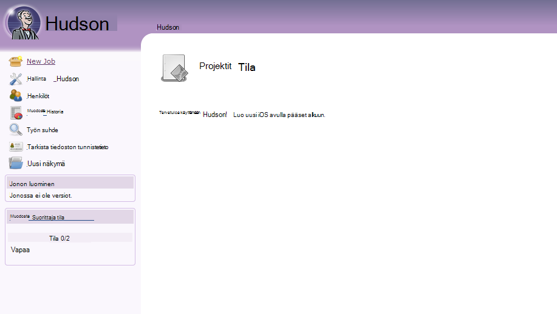
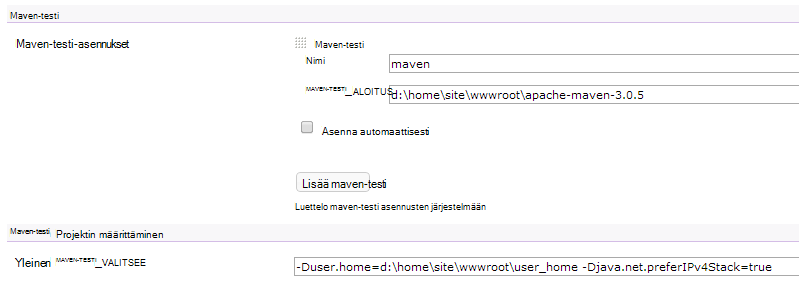

<properties 
    pageTitle="Mukautetun Java-web-sovelluksen lataaminen Azure" 
    description="Tässä opetusohjelmassa näytetään, miten mukautetun Java-web-sovelluksen lataaminen Azure palvelun Web sovellukset." 
    services="app-service\web" 
    documentationCenter="java" 
    authors="rmcmurray" 
    manager="wpickett" 
    editor=""/>

<tags 
    ms.service="app-service-web" 
    ms.workload="web" 
    ms.tgt_pltfrm="na" 
    ms.devlang="Java" 
    ms.topic="article" 
    ms.date="08/11/2016" 
    ms.author="robmcm"/>

# Mukautetun Java-web-sovelluksen lataaminen Azure

Tässä ohjeaiheessa kerrotaan, miten mukautetun Java-web-sovelluksen lataaminen [Azure App palvelun] verkkosovelluksissa. Sisältää tietoja, jotka koskevat kaikkia Java-sivustossa tai web-sovelluksia ja myös esimerkkejä sovelluksia.

Huomaa, että Azure annetaan keino luomiseen Java verkkosovelluksissa Azure-portaalin määritysten Käyttöliittymä ja Azure Marketplace-sivustoon, suorittimessa osoitteessa [luominen Azure-sovelluksen palvelun Java verkkosovellukseen](web-sites-java-get-started.md). Tässä opetusohjelmassa on tilanteissa, joissa voit halua Azure Portal-määritys Käyttöliittymän tai Azure Marketplacesta.  

## Kokoonpano

Seuraavassa kuvataan odotettu mukautetun Java web Apps-sovellusten Azure-asetukset.

- Java-prosessin käytössä HTTP-portin dynaamisesti määritetään.  Prosessi on käytettävä portti-ympäristömuuttuja `HTTP_PLATFORM_PORT`.
- Kaikki kuin yhden HTTP-kuuntelutoiminnon kuunnella portit poistetaan käytöstä.  Tomcat, jossa on Sammuta, HTTPS ja AJP portit.
- Säilön varten on määritettävä IPv4-liikenteen.
- Sovelluksen **Käynnistys** -komento on määritettävä määritykset.
- Sovellukset edellyttävät kansioiden ja kirjoita oikeuksia ei tarvitse sijaita Azure web-sovelluksen sisällön kansioon, joka on **D:\home**.  Ympäristömuuttuja `HOME` D:\home viittaa.  

Voit määrittää seuraavan koodin korostetut ympäristömuuttujat halutulla tavalla.

## Web.config httpPlatform määritys

Seuraavassa kuvataan web.config **httpPlatform** muodossa.
                                 
**argumentit** (Oletus = ""). Suoritettava tiedosto tai komentosarjan **processPath** määritetyn argumentit.

Esimerkkejä (kuten **processPath** sisällyttää kanssa):

    processPath="%HOME%\site\wwwroot\bin\tomcat\bin\catalina.bat"
    arguments="start"
    
    processPath="%JAVA_HOME\bin\java.exe"
    arguments="-Djava.net.preferIPv4Stack=true -Djetty.port=%HTTP\_PLATFORM\_PORT% -Djetty.base=&quot;%HOME%\site\wwwroot\bin\jetty-distribution-9.1.0.v20131115&quot; -jar &quot;%HOME%\site\wwwroot\bin\jetty-distribution-9.1.0.v20131115\start.jar&quot;"

**processPath** - suoritettavat tai komentosarjan, joka käynnistää Kuuntele pyyntöjen prosessin polku.

Esimerkkejä:

    processPath="%JAVA_HOME%\bin\java.exe"

    processPath="%HOME%\site\wwwroot\bin\tomcat\bin\startup.bat"

    processPath="%HOME%\site\wwwroot\bin\tomcat\bin\catalina.bat"
                                                                                       
**rapidFailsPerMinute** (Oletus = 10.) Kuinka monta kertaa **processPath** määritetty prosessi on oikeus kaatumisen minuutissa. Jos rajoitusta ylittyy, **HttpPlatformHandler** Lopeta prosessi, jossa minuutit loput avaamista.
                                    
**requestTimeout** (Oletus = "00: 02:00".) Kesto, jonka **HttpPlatformHandler** odottaa Kuuntele prosessin vastausta `%HTTP_PLATFORM_PORT%`.

**startupRetryCount** (Oletus = 10.) Kuinka monta kertaa **HttpPlatformHandler** yrittää käynnistää **processPath**-parametrissa prosessi. Katso lisätietoja **startupTimeLimit** .

**startupTimeLimit** (Oletus = 10 sekuntia.) Kesto, jonka **HttpPlatformHandler** odottaa suoritettavat/komentosarja Aloita Kuuntele portti.  Jos tämä määräaika ylittyy, **HttpPlatformHandler** lopettaa prosessin ja yritä käynnistää uudelleen **startupRetryCount** kertaa.
                                                                                      
**stdoutLogEnabled** (Oletus = "true".) Jos arvo on TOSI, **stdout** ja **stderr** **processPath** määritetyn prosessin ohjataan **stdoutLogFile** määritettyyn tiedostoon (katso **stdoutLogFile** osio).
                                    
**stdoutLogFile** (Default="d:\home\LogFiles\httpPlatformStdout.log".) Suora tiedostopolku, johon **stdout** ja **stderr** määritetyn **processPath** prosessista kirjataan.
                                    
> [AZURE.NOTE] `%HTTP_PLATFORM_PORT%`on erityisen paikkamerkki, joka on määritetty osana **argumentit** tai **httpPlatform** **environmentVariables** -luetteloon osana. Tämä korvataan sisäisesti portin, **HttpPlatformHandler** mukaan, niin, että **processPath** määrittämän prosessin voit kuunnella portin.

## Käyttöönotto

Java perustuvat verkkosovelluksissa voidaan ottaa helposti – samaan tarkoittaa, että Internet Information Services (IIS) kanssa käytetään yleensä pohjaisen web-sovellusten.  FTP, Git ja Kudu tuetaan kuin käyttöönoton järjestelmiä on integroitu palvelujen ohjauksen hallinta-ominaisuuksien verkkosovelluksissa. Protokolla, WebDeploy toimii kuitenkin kuin Java ole kehittynyt Visual Studiossa WebDeploy ei mahdu Java web app käyttöönoton käyttö palvelupyyntöjen.

## Sovelluksen määritys esimerkkejä

Seuraavat sovellukset, web.config-tiedosto ja sovelluksen kokoonpanon annetaan esimerkkejä näyttää, miten voit ottaa käyttöön sovelluksen palvelun verkkosovelluksissa Java-sovelluksesi.

### Tomcat
Internetissä on myös kaksi Tomcat variaatiot palvelun Web sovellukset mukana toimitettuja, on edelleen aivan voi ladata asiakkaan tietyn esiintymät. Alla on esimerkki, jossa eri Java virtuaalikoneen (JVM) Tomcat asennuksen.

    <?xml version="1.0" encoding="UTF-8"?>
    <configuration>
      <system.webServer>
        <handlers>
          <add name="httpPlatformHandler" path="*" verb="*" modules="httpPlatformHandler" resourceType="Unspecified" />
        </handlers>
        <httpPlatform processPath="%HOME%\site\wwwroot\bin\tomcat\bin\startup.bat" 
            arguments="">
          <environmentVariables>
            <environmentVariable name="CATALINA_OPTS" value="-Dport.http=%HTTP_PLATFORM_PORT%" />
            <environmentVariable name="CATALINA_HOME" value="%HOME%\site\wwwroot\bin\tomcat" />
            <environmentVariable name="JRE_HOME" value="%HOME%\site\wwwroot\bin\java" /> <!-- optional, if not specified, this will default to %programfiles%\Java -->
            <environmentVariable name="JAVA_OPTS" value="-Djava.net.preferIPv4Stack=true" />
          </environmentVariables>
        </httpPlatform>
      </system.webServer>
    </configuration>

Tomcat reunassa on joitakin kokoonpanomuutoksia tehdään. Server.xml on oltava voi muokata, jos haluat määrittää:

-   Sammuta portin =-1
-   HTTP-yhdistin portin = ${port.http}
-   HTTP-yhdistin osoite = "127.0.0.1"
-   Yhdistimien HTTPS ja AJP ulos kommentti
-   Catalina.properties-tiedosto, jossa voit lisätä myös voidaan määrittää IPv4-asetus`java.net.preferIPv4Stack=true`
    
Direct3d puhelut ei tue palvelun Web sovellukset. Voit poistaa ne käytöstä, Lisää seuraava Java-asetus, kannattaa sovelluksen tällaisia puheluja:`-Dsun.java2d.d3d=false`

### Jota

Kuten tapauksessa Tomcat varten, asiakkaat ladata omia esiintymät, jota. Jos kyseessä on täydellinen asennus, jota, määritykset näyttää tältä:

    <?xml version="1.0" encoding="UTF-8"?>
    <configuration>
      <system.webServer>
        <handlers>
          <add name="httppPlatformHandler" path="*" verb="*" modules="httpPlatformHandler" resourceType="Unspecified" />
        </handlers>
        <httpPlatform processPath="%JAVA_HOME%\bin\java.exe" 
             arguments="-Djava.net.preferIPv4Stack=true -Djetty.port=%HTTP_PLATFORM_PORT% -Djetty.base=&quot;%HOME%\site\wwwroot\bin\jetty-distribution-9.1.0.v20131115&quot; -jar &quot;%HOME%\site\wwwroot\bin\jetty-distribution-9.1.0.v20131115\start.jar&quot;"
            startupTimeLimit="20"
          startupRetryCount="10"
          stdoutLogEnabled="true">
        </httpPlatform>
      </system.webServer>
    </configuration>

Jota määritys on vaihdettava voit määrittää start.ini `java.net.preferIPv4Stack=true`.

### Springboot
Jotta saat Springboot sovelluksen sinun tarvitse PURKKI tai SODAN tiedoston lataaminen ja lisätä seuraavan seuraavat koodin korostetut. Seuraavan koodin korostetut siirtyy wwwroot-kansiossa. Säädä web.config argumenttien PURKKI-tiedoston PURKKI tiedosto sijaitsee wwwroot-kansiossa sekä seuraavan esimerkin mukaisesti.  

    <?xml version="1.0" encoding="UTF-8"?>
    <configuration>
      <system.webServer>
        <handlers>
          <add name="httpPlatformHandler" path="*" verb="*" modules="httpPlatformHandler" resourceType="Unspecified" />
        </handlers>
        <httpPlatform processPath="%JAVA_HOME%\bin\java.exe"
            arguments="-Djava.net.preferIPv4Stack=true -Dserver.port=%HTTP_PLATFORM_PORT% -jar &quot;%HOME%\site\wwwroot\my-web-project.jar&quot;">
        </httpPlatform>
      </system.webServer>
    </configuration>

### Hudson

Hudson 3.1.2 sodan ja Tomcat 7.0.50 oletusesiintymää käytettävä tämän testin ilman perusmääritykset käyttöliittymässä.  Koska Hudson on ohjelmiston luominen työkalu, on suositeltavaa asennetaan erillinen esiintymät, jossa **AlwaysOn** -merkinnän määrittäminen web Appissa.

1. Web-sovelluksen pääkansion, kuten **d:\home\site\wwwroot**, luo **webapps** directory (Jos ei vielä ole) ja sijoittaa Hudson.war **d:\home\site\wwwroot\webapps**.
2. Lataa apache maven-testi 3.0.5 (yhteensopiva Hudson) ja sijoita se **d:\home\site\wwwroot**.
3. Luoda web.config **d:\home\site\wwwroot** ja liitä seuraavat:
    
        <?xml version="1.0" encoding="UTF-8"?>
        <configuration>
          <system.webServer>
            <handlers>
              <add name="httppPlatformHandler" path="*" verb="*" 
        modules="httpPlatformHandler" resourceType="Unspecified" />
            </handlers>
            <httpPlatform processPath="%AZURE_TOMCAT7_HOME%\bin\startup.bat"
        startupTimeLimit="20"
        startupRetryCount="10">
        <environmentVariables>
          <environmentVariable name="HUDSON_HOME" 
        value="%HOME%\site\wwwroot\hudson_home" />
          <environmentVariable name="JAVA_OPTS" 
        value="-Djava.net.preferIPv4Stack=true -Duser.home=%HOME%/site/wwwroot/user_home -Dhudson.DNSMultiCast.disabled=true" />
        </environmentVariables>            
            </httpPlatform>
          </system.webServer>
        </configuration>

    Tässä vaiheessa voit käynnistää muutokset tulevat uudelleen web app.  Muodosta yhteys http://yourwebapp/hudson Hudson käynnistämiseen.

4. Kun Hudson määrittää itse, seuraavassa kuvassa pitäisi tulla näyttöön:

    
    
5. Käyttää Hudson määritys-sivulla: Valitse **Hallitse Hudson**ja valitse sitten **Määritä järjestelmä**.
6. Määrittää JDK alla kuvatulla tavalla:

    

7. Määritä maven-testi, alla kuvatulla tavalla:

    

8. Tallenna asetukset. Hudson pitäisi nyt olla määritetty ja käyttövalmis.

Saat lisätietoja Hudson [http://hudson-ci.org](http://hudson-ci.org).

### Liferay

Liferay tuetaan palvelun Web sovellukset. Koska Liferay voi vaatia merkittäviä muistia, web-sovelluksen on Normaali tai suuri erillinen työntekijä, joka voidaan lisätä muisti suoritetaan. Liferay kestää useita minuutteja, kun haluat, että myös. Tästä syystä on suositeltavaa, että määrität web-sovelluksen **Aina**käyttöön.  

Käytä Liferay 6.1.2 yhteisön Edition GA3 yhteen ja Tomcat-seuraavat tiedostot ole muokattu lataamista Liferay:

**Server.XML**

- Muuta Sammuta Port (portti) -1.
- Muuta HTTP yhdistin      `<Connector port="${port.http}" protocol="HTTP/1.1" connectionTimeout="600000" address="127.0.0.1" URIEncoding="UTF-8" />`
- Lisää kommentti AJP yhdistimen ulos.

**Liferay\tomcat-7.0.40\webapps\ROOT\WEB-INF\classes** -kansioon Luo tiedosto nimeltä **portal ext.properties**. Tämä tiedosto on oltava yhdelle riville, kuten kuvassa:

    liferay.home=%HOME%/site/wwwroot/liferay

Samalla tasolla directory tomcat 7.0.40 kansiona Luo tiedosto nimeltä **web.config** seuraavat sisältöä:

    <?xml version="1.0" encoding="UTF-8"?>
    <configuration>
      <system.webServer>
        <handlers>
    <add name="httpPlatformHandler" path="*" verb="*"
         modules="httpPlatformHandler" resourceType="Unspecified" />
        </handlers>
        <httpPlatform processPath="%HOME%\site\wwwroot\tomcat-7.0.40\bin\catalina.bat" 
                      arguments="run" 
                      startupTimeLimit="10" 
                      requestTimeout="00:10:00" 
                      stdoutLogEnabled="true">
          <environmentVariables>
      <environmentVariable name="CATALINA_OPTS" value="-Dport.http=%HTTP_PLATFORM_PORT%" />
      <environmentVariable name="CATALINA_HOME" value="%HOME%\site\wwwroot\tomcat-7.0.40" />
            <environmentVariable name="JRE_HOME" value="D:\Program Files\Java\jdk1.7.0_51" /> 
            <environmentVariable name="JAVA_OPTS" value="-Djava.net.preferIPv4Stack=true" />
          </environmentVariables>
        </httpPlatform>
      </system.webServer>
    </configuration>

Valitse **httpPlatform** , estä **requestTimeout** määritetään "00: 10:00".  Voi heiketä, mutta et todennäköisesti näkyvissä aikakatkaisuvirheitä aikana Liferay on automaattiseen käynnistykseen.  Jos tämä arvo on muutettu, myös **connectionTimeout** -tomcat server.xml muutettava.  

On otettava huomioon, että JRE_HOME environnment varariable on määritetty siten, että 64-bittinen JDK yllä web.config. Oletusarvo on 32-bittinen, mutta koska Liferay saattaa edellyttää korkean tason muistin, kannattaa käyttää 64-bittinen JDK.

Kun olet tehnyt nämä muutokset, Käynnistä käynnissä Liferay koodiin, avaa sitten http://yourwebapp. Liferay-portaali on käytettävissä web app-kansiosta. 

## Seuraavat vaiheet

Saat lisätietoja Liferay [http://www.liferay.com](http://www.liferay.com).

Saat lisätietoja Java [Java Developer Center](/develop/java/).

[AZURE.INCLUDE [app-service-web-whats-changed](../../includes/app-service-web-whats-changed.md)]

[AZURE.INCLUDE [app-service-web-try-app-service](../../includes/app-service-web-try-app-service.md)]
 
 
<!-- External Links -->
[Azure sovelluksen-palvelu]: http://go.microsoft.com/fwlink/?LinkId=529714
