<properties 
    pageTitle="Siirtää Azure App palvelun yrityksen web app-sovelluksessa" 
    description="Esitetään, kuinka voit siirtää aiemmin IIS-sivustoja nopeasti Azure palvelun Web sovellukset Web Apps siirron avustajan avulla" 
    services="app-service" 
    documentationCenter="" 
    authors="cephalin" 
    writer="cephalin" 
    manager="wpickett" 
    editor=""/>

<tags 
    ms.service="app-service" 
    ms.workload="na" 
    ms.tgt_pltfrm="na" 
    ms.devlang="na" 
    ms.topic="article" 
    ms.date="07/01/2016" 
    ms.author="cephalin"/>

# Siirtää Azure App palvelun yrityksen web app-sovelluksessa

Voit siirtää helposti yhteyttä aiemmin sivustot, jotka suoritetaan Internet Information Service (IIS) 6 tai uudempi, [Palvelun Web sovellukset](http://go.microsoft.com/fwlink/?LinkId=529714). 

>[AZURE.IMPORTANT] Windows Server 2003 saavuttanut heinäkuussa 14th 2015 tuen loppuun. Jos isännöit tällä hetkellä oman sivuston IIS-palvelimeen, joka on Windows Server 2003, Web Apps-sovelluksista on pieni-riski, edullinen, ja vähäkitkaista tapa pitää sivustojen verkossa ja Web Apps siirron avustaja voivat auttaa automatisoida siirtoprosessia puolestasi. 

[Web Apps siirron avustaja](https://www.movemetothecloud.net/) voit analysoida IIS-palvelimen asennuksen, mitkä sivustojen voidaan siirtää sovelluksen-palveluun, korosta elementtejä, jotka ei voi siirtää tai joita ei tueta ympäristössä ja sitten siirretään sivustot ja liittyvät tietokannat Azure.

[AZURE.INCLUDE [app-service-web-to-api-and-mobile](../../includes/app-service-web-to-api-and-mobile.md)]

## Vahvistettu yhteensopivuuden analyysin aikana osat ##
Siirto-tilan Luo valmiuden raportin tunnistaa kaikki mahdollisia syitä huolta tai estävät ongelmat, jotka voivat estää onnistuneen siirtoon paikallisen IIS: Azure palvelun Web sovellukset. Jotkin huomioon tärkeimmät osat ovat:

-   Portti sidontojen – Web Apps tukee vain porttiin 80 HTTP ja porttiin 443 HTTPS-liikenne. Eri porttimäärityksiä ohitetaan ja liikenne reititetään 80 ja 443. 
-   Todennus – Web Apps tukee Anonyymi todentaminen oletusarvon mukaan ja todennusmenetelmien tarvittaessa sovelluksen. Windows-todennusta voidaan käyttää vain integrointi Azure Active Directory ja ADFS: N kanssa. Kaikki muut todennus - esimerkiksi Perustodentamista - lomakkeet eivät ole tuettuja. 
-   Yleinen kokoonpanovälimuistiin (GAC) – GAC ei tueta verkkosovelluksissa. Jos sovelluksen viittaa laitekokonaisuuksien, jotka yleensä käyttöönotto välimuistista, sinun on ottamaan Web Apps-sovelluksen bin-kansioon. 
-   IIS5 Yhteensopivuustila – tämä ei tueta verkkosovelluksissa. 
-   Sovellussarjojen – verkkosovelluksissa, kunkin sivuston ja sen ali-sovellukset toimivat samalla sovellussarjan. Jos sivustossa on useita käyttävien useiden sovellussarjojen Alisovelluksia, yhdistää ne yhteen sovellussarjan Yleiset asetukset tai siirtää kunkin sovelluksen eri web App-sovellukseen.
-   COM-komponentteja – Web Apps ei salli COM-komponenttien rekisteröinti-ympäristössä. Jos sivustot ja sovelluksia, että kaikki COM-komponenttien käyttäminen, kirjoita ne uudelleen hallittua koodia ja otetaan käyttöön sivustossa tai sovelluksen kanssa.
-   ISAPI-suodattimet – Web Apps tukee ISAPI suodattimien käytön. Sinun on suoritettava seuraavat:
    -   web-sovelluksen dll käyttöönotto 
    -   Rekisteröi käyttäen [Web.config](http://www.iis.net/configreference/system.webserver/isapifilters) dll-kirjastoista
    -   Sijoita sivuston pääkansion alla sisältöä applicationHost.xdt-tiedosto:

            <?xml version="1.0"?>
            <configuration xmlns:xdt="http://schemas.microsoft.com/XML-Document-Transform">
            <configSections>
                <sectionGroup name="system.webServer">
                  <section name="isapiFilters" xdt:Transform="SetAttributes(overrideModeDefault)" overrideModeDefault="Allow" />
                </sectionGroup>
              </configSections>
            </configuration>

        Katso Lisää esimerkkejä siitä, miten XML-tiedostomuunnoksia käyttäminen sivustossa, [Muunna Microsoft Azure-sivuston](http://blogs.msdn.com/b/waws/archive/2014/06/17/transform-your-microsoft-azure-web-site.aspx).

-   Muita osia, kuten SharePoint-etusivu server-laajennukset (FrontPage), FTP-SSL-varmenteita ei siirretä.

## Opi käyttämään Web Apps siirron avustaja ##
Esimerkki voit siirtää muutamia sivustoja, jotka käyttävät SQL Server-tietokantaan ja paikallinen Windows Server 2003 R2 (IIS 6.0) tietokoneessa käynnissä tämän osan vaiheet:

1.  Siirry IIS-palvelimessa tai asiakaskoneen [https://www.movemetothecloud.net/](https://www.movemetothecloud.net/) 

    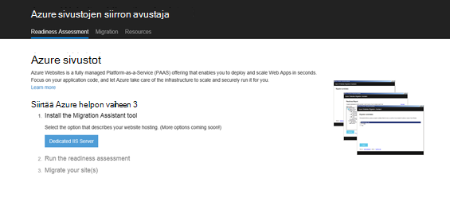

2.  Asenna Web Apps siirron avustaja valitsemalla **Varattu IIS-palvelin** -painiketta. Lisää vaihtoehtoja on lähitulevaisuudessa asetukset. 
4.  Asenna Web Apps siirron avustaja käyttämääsi laitteeseen valitsemalla **Asenna työkalu** .

    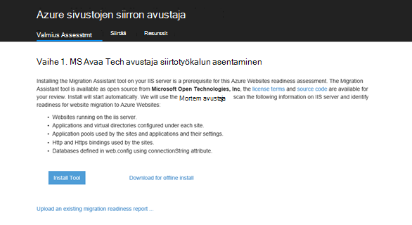

    >[AZURE.NOTE] Voit myös napsauttaa palvelimia ei ole yhteydessä Internetiin asentamisessa ZIP-tiedoston lataaminen **ladata offline-tilassa asennusta varten** . Vaihtoehtoisesti voit napsauttaa **Lataa aiemmin luodun siirron valmius-raportin**, joka on lisäasetusta aiemmin luodun siirron valmiuden raportin, jotka olet aiemmin luonut (kerrotaan myöhemmin)-käyttöä varten.

5.  Valitse **Sovelluksen asennus** -valikon **Asenna** Asenna tietokoneeseen. Se myös asentaa vastaavat riippuvuudet, kuten Web-käyttöön, DacFX ja IIS-tarvittaessa. 

    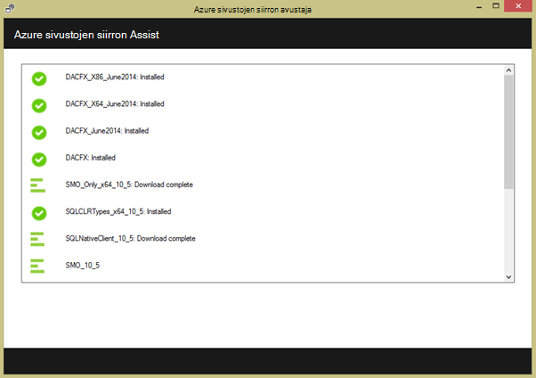

    Kun asennettu, Web Apps siirron avustaja käynnistyy automaattisesti.
  
6.  Valitse **Siirrä sivustot ja tietokantojen etäpalvelimeen, Azure**. Määritä järjestelmänvalvojan tunnistetiedot etäpalvelimeen ja valitse **Jatka**. 

    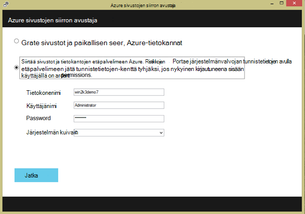

    Voit valita kurssin siirtäminen paikalliseen palvelimeen. Remote-asetus on hyödyllinen, kun haluat siirtää sivustojen tuotannon IIS-palvelimessa.
 
    Tässä vaiheessa siirtotyökalun tarkistaa että IIS-palvelinta kokoonpano, esimerkiksi sivustot, sovellukset, sovellussarjojen ja riippuvuuksien tunnistavan candidate sivustoja siirrossa. 

8.  Seuraavassa näyttökuvassa näkyy kolme sivustot – **oletussivuston**, **TimeTracker**ja **CommerceNet4**. Kaikilla on liittyvän tietokannan, jotka haluat siirtää. Valitse kaikissa sivustoissa, jonka haluat arvioida ja valitse sitten **Seuraava**.

    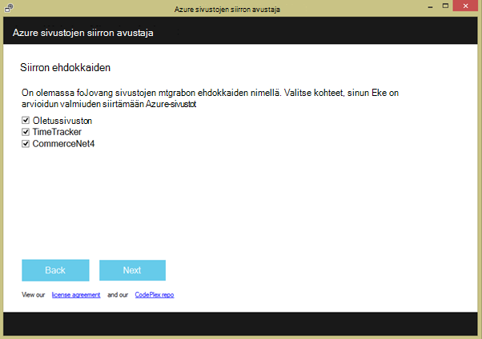
 
9.  Valitse **Lataa** valmius-raportit. Jos valitset **Tallenna tiedosto paikallisesti**, voit suorittaa siirtotyökalun myöhemmin uudelleen ja ladata tallennetun valmius-raportti että edellä.

    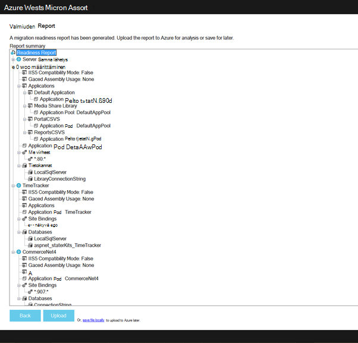
 
    Kun olet ladannut valmius-raportti, Azure suorittaa valmiuden analyysi ja näyttää tulokset. Lisätietoja arviointi kunkin sivuston ja varmista, että ymmärrät tai on osoitettu kaikista ongelmista, ennen kuin jatkat. 
 
    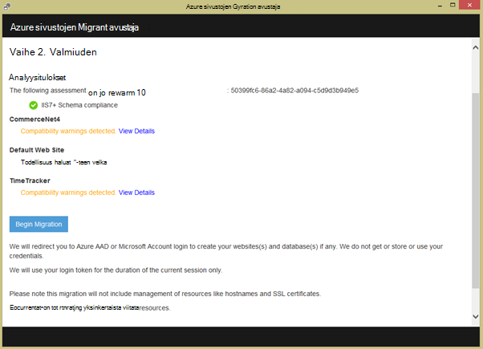

12. Valitse **Aloita siirto** Aloita siirto. Voit nyt uudelleenohjataan Azure kirjautua tilille. On tärkeää, että kirjaudut sisään tilille, jolla on aktiivinen Azure-tilaus. Jos sinulla ei ole Azure-tili sitten voit rekisteröityä varten ilmainen kokeiluversio [tähän](https://azure.microsoft.com/pricing/free-trial/?WT.srch=1&WT.mc_ID=SEM_). 

13. Valitse asiakasympäristön, Azure tilaus ja siirretyt Azure web Apps-sovellusten ja tietokantojen alue ja valitse sitten **Aloita siirto**. Voit valita sivustojen voidaan siirtää myöhemmin.

    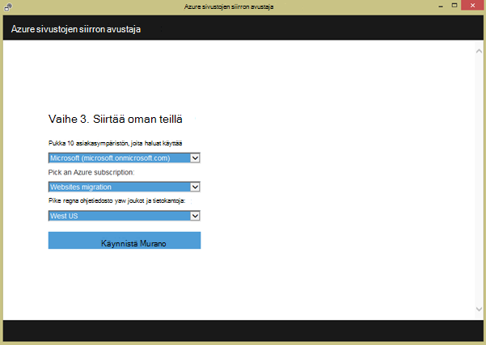

14. Valitse seuraavassa näytössä voit tehdä muutoksia siirron oletusasetuksia, kuten:

    - Käytä aiemmin luotuun Azure SQL-tietokantaan tai Luo uusi Azure SQL-tietokanta ja määritä sen tunnistetiedot
    - Valitse siirrettävä sivustot
    - nimien määrittäminen Azure web Apps-sovellusten ja niiden linkitetty SQL-tietokantoja
    - yleisten asetusten ja sivustotason asetusten mukauttaminen

    Seuraavassa näyttökuvassa näkyy valittuna siirron oletusasetuksilla sivustoille.

    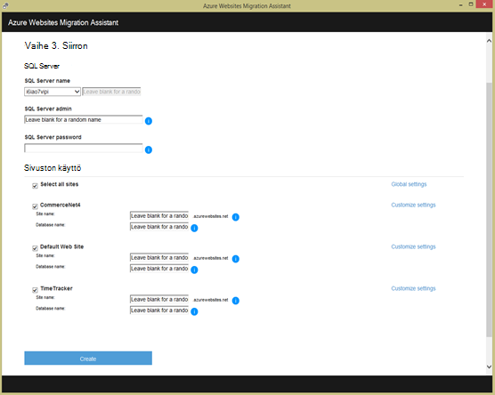

    >[AZURE.NOTE] mukautetut asetukset **Käyttöön Azure Active Directory** -valintaruutu on integroitu Azure Online [Azure Active Directory](active-directory-whatis.md) ( **Oletus-kansio**). Lisätietoja synkronoitavien Azure Active Directory-paikalliseen-Active Directory-kohdassa [yhteystietojen integrointi](http://msdn.microsoft.com/library/jj573653).

16.  Kun olet tehnyt haluamasi muutokset, valitse **Luo** luodaksesi siirtoprosessia. Siirtotyökalun Azure SQL-tietokanta ja Azure web App-sovelluksen luominen ja julkaiseminen sitten sivuston sisältö ja tietokannat. Siirron eteneminen näkyy selvästi siirtotyökalun ja lopussa, mitkä tiedot sivustot siirtänyt, onko siirretyt onnistuu, linkit luomasi Azure web Apps-sovellusten yhteenveto näyttöön tulee näkyviin. 

    Jos mikä tahansa virhe ilmenee siirron aikana, siirtotyökalun selkeästi ilmoittaa virheen ja Peru muutokset. Osaat myös lähettää virheraportin suoraan suunnitteluryhmät ryhmän **Lähetä virheraportti** -painikkeella siepatun virheen puhelun pinon kanssa sekä luomalla viestin tekstiosaan. 

    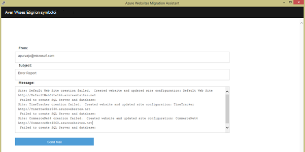

    Jos siirtäminen onnistuu ilman virheitä, voit myös napsauttaa antamaan palautetta suoraan **Antaa palautetta** -painiketta. 
 
20. Linkkejä ja Azure web Apps-sovellusten ja varmista, että siirto onnistui.

21. Voivat nyt hallita Azure-sovelluksen palvelun siirretyt verkkosovelluksissa. Voit tehdä tämän Kirjaudu sisään [Azure-portaalissa](https://portal.azure.com).

22. Azure-portaalissa Avaa Web Apps-sivu, voit nähdä oman siirretyt sivustot (näkyy verkkosovelluksissa) ja valitse sitten Valitse jokin aloitusta verkkosovellus, kuten määrittäminen varmuuskopiot, automaattisen skaalauksen poistaminen, ja seurantaa käyttö tai suorituskyvyn luominen jatkuva julkaisemisen hallinta.

    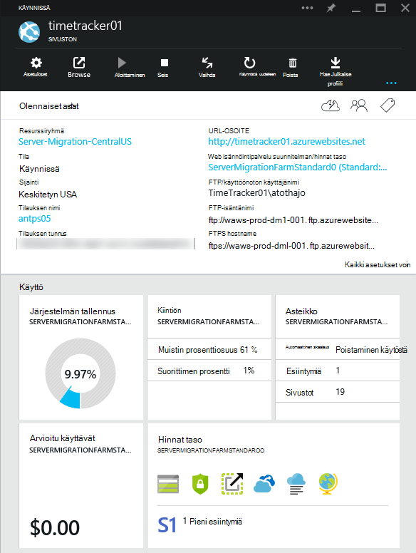

>[AZURE.NOTE] Jos haluat aloittaa Azure App palvelun ennen rekisteröimässä Azure-tili, siirry [Yritä App palvelu](http://go.microsoft.com/fwlink/?LinkId=523751), jossa lyhytkestoinen starter verkkosovellukseen heti voit luoda sovelluksen-palvelussa. Ei ole pakollinen; luottokortit ei ole sitoumukset.

## Mikä on muuttunut
* Katso muutoksen opas verkkosivuilta App palveluun: [Azure App palvelu ja sen vaikutus aiemmin Azure-palvelut](http://go.microsoft.com/fwlink/?LinkId=529714)
 
