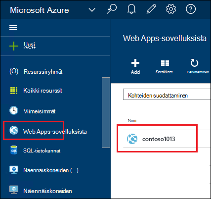
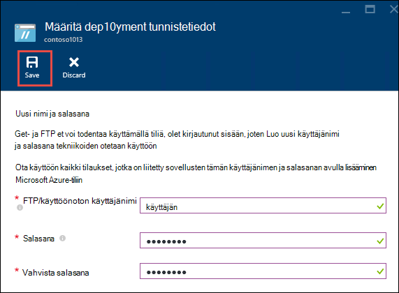
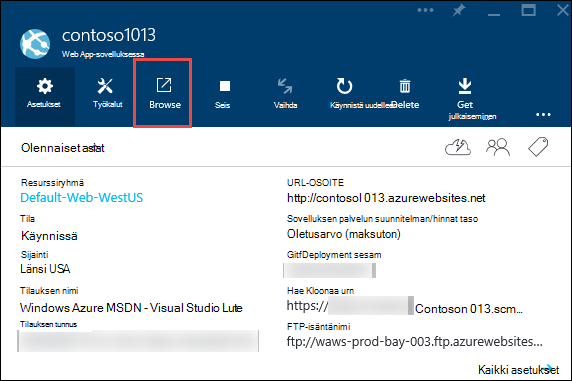
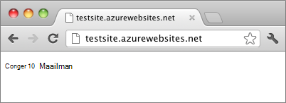

<properties
    pageTitle="Node.js web App-sovelluksen luominen Azure App palvelun | Microsoft Azure"
    description="Opettele Node.js-sovellus App Azure-palvelun web App-sovellukseen."
    services="app-service\web"
    documentationCenter="nodejs"
    authors="rmcmurray"
    manager="wpickett"
    editor=""/>

<tags
    ms.service="app-service-web"
    ms.workload="web"
    ms.tgt_pltfrm="na"
    ms.devlang="nodejs"
    ms.topic="hero-article"
    ms.date="08/11/2016"
    ms.author="robmcm"/>

# Luo Node.js verkkosovellukseen Azure sovelluksen-palvelussa

> [AZURE.SELECTOR]
- [.NET](web-sites-dotnet-get-started.md)
- [Node.js](web-sites-nodejs-develop-deploy-mac.md)
- [Java](web-sites-java-get-started.md)
- [PHP - Git](web-sites-php-mysql-deploy-use-git.md)
- [PHP - FTP](web-sites-php-mysql-deploy-use-ftp.md)
- [Python](web-sites-python-ptvs-django-mysql.md)

Tässä opetusohjelmassa näytetään yksinkertaisen [Node.js](http://nodejs.org) -sovelluksen luominen ja käyttöönotto [web app](app-service-web-overview.md) [sovelluksen Azure](../app-service/app-service-value-prop-what-is.md) -palvelun avulla [Git](http://git-scm.com). Tässä opetusohjelmassa ohjeita on noudatettava sellaisille käyttöjärjestelmille, joka voi suorittaa Node.js.

Opit:

* Miten verkkosovellukseen luominen Azure App palvelun Azure-portaalissa.
* Voit ottaa Node.js web app-ohjelman web-sovelluksen Git säilöön valitseminen.

Valmiin sovelluksen kirjoittaa lyhyt "Tervetuloa maailman" merkkijonon selaimessa.

![Selainta, näet "Hei-maailman"-viestin.][helloworld-completed]

Opetusohjelmat ja otoksen koodin monimutkaisia Node.js-sovellusten kanssa tai muiden Node.js käyttämisestä Azure-aiheisia varten Tutustu [Node.js Developer Center](/develop/nodejs/).

> [AZURE.NOTE]
> Tässä opetusohjelmassa suorittamiseen tarvitset Microsoft Azure-tiliin. Jos sinulla ei ole tiliä, voit [aktivoida Visual Studio tilaajan etuja](/en-us/pricing/member-offers/msdn-benefits-details/?WT.mc_id=A261C142F) tai [maksuttoman kokeiluversion käyttäjäksi rekisteröityminen](/en-us/pricing/free-trial/?WT.mc_id=A261C142F).
>
> Jos haluat aloittaa Azure App palvelun, ennen kuin kirjaudut Azure-tili, siirry [Yritä App palvelu](http://go.microsoft.com/fwlink/?LinkId=523751). Siellä voit luoda lyhytkestoinen starter verkkosovellukseen heti App palvelussa – ei luottokortti ja ei ole sitoumukset.

## Web-sovelluksen luominen ja Git julkaisemisen ottaminen käyttöön

Voit luoda verkkosovellukseen Azure-sovelluksen palvelun ja ottaa Git julkaiseminen seuraavasti. 

[Git](http://git-scm.com/) on jaettu versio ohjausobjektin järjestelmä, joiden avulla voit ottaa käyttöön Azure-sivustoon. Web-sovelluksen paikallisen Git säilöön, kirjoittaa koodin tallentaa ja käyttöön koodisi Azure mukaan valitseminen remote säilöön. Tätä menetelmää käyttöönoton toimintoa App palvelun web Apps-sovelluksista.  

1. Kirjautuminen [Azure Portal](https://portal.azure.com).

2. Napsauta vasemmassa yläkulmassa **+ Uusi** kuvake Azure-portaalissa.

3. Valitse **Web + Mobile**ja valitse sitten **Web Appissa**.

    ![][portal-quick-create]

4. Kirjoita nimi web-sovelluksen **Web app** -ruutuun.

    Tämän nimen on oltava yksilöllinen azurewebsites.net toimialueen, koska web Appin URL-osoite on {name}. azurewebsites.net. Jos kirjoittamasi nimi ei ole yksilöllisiä, punainen huutomerkki näkyy teksti-ruutuun.

5. Valitse **tilaus**.

6. Valitse **Resurssiryhmä** tai luoda uuden.

    Saat lisätietoja resurssiryhmät [Azure resurssin hallinnassa: yleiskatsaus](../azure-resource-manager/resource-group-overview.md).

7. Valitse **Sovelluksen palvelun suunnitelman/sijainti** tai luoda uuden.

    Saat lisätietoja sovelluksen palvelusopimusten vaihtoehdot artikkelissa [Azure App palvelun suunnitelmien yleiskatsaus](../azure-web-sites-web-hosting-plans-in-depth-overview.md)

8. Valitse **Luo**.
   
    ![][portal-quick-create2]

    Lyhyt aika, yleensä alle minuutin Azure on luonut uuden web-sovelluksen.

9. Valitse **WWW-sovellukset > {Uusi web-sovellus}**.

    

10. Valitse **Online** -sivu **käyttöönotto** -osa.

    ![][deployment-part]

11. Valitse **Jatkuva käyttöönottoa** sivu, **Valitse lähde**

12. Valitse **Paikallinen Git säilöön**, ja valitse sitten **OK**.

    ![][setup-git-publishing]

13. Määritä käyttöönoton tunnistetiedot, jos et ole vielä tehnyt niin.

    a. Valitse Web app-sivu **Asetukset > käyttöönoton tunnistetiedot**.

    ![][deployment-credentials]
 
    b. Luo käyttäjänimi ja salasana. 
    
    

14. Web app-sivu, valitse **asetukset**ja valitse sitten **Ominaisuudet**.
 
    Jos haluat julkaista, push remote Git säilöön. Säilön URL-osoite näkyy kohdassa **GIT URL-osoite**. Käytät tätä URL-Osoitetta myöhemmin-opetusohjelman.

    ![][git-url]

## Muodosta ja testaa sovelluksen paikallisesti

Tässä osassa Luo **server.js** tiedosto, joka sisältää [nodejs.org] 'Hei-maailman' esimerkissä toimintoja on muutettu versio. Koodin Lisää process.env.PORT porttina kuunnella suoritettaessa Azure web App-sovelluksessa.

1. Voit luoda hakemiston *helloworld*.

2. Tekstieditorissa avulla voit luoda uuden tiedoston nimi **server.js** *helloworld* hakemistossa.

2. Kopioi seuraava koodi **server.js** -tiedosto ja tallenna sitten tiedosto:

        var http = require('http')
        var port = process.env.PORT || 1337;
        http.createServer(function(req, res) {
          res.writeHead(200, { 'Content-Type': 'text/plain' });
          res.end('Hello World\n');
        }).listen(port);

3. Avaa komentorivi ja seuraavalla komennolla voit käynnistää paikallisesti web app.

        node server.js

4. Avaa selain ja siirry http://localhost:1337. 

    Näkyviin tulee WWW-sivu, jossa näkyy "Hei-maailman", kuten seuraavassa näyttökuvassa.

    ![Selainta, näet "Hei-maailman"-viestin.][helloworld-localhost]

## Sovelluksen julkaiseminen

1. Asenna Git, jos et ole vielä tehnyt niin.

    Katso asennusohjeet omaa ympäristöäsi, [lataussivulle Git](http://git-scm.com/download).

1. Komentoriviltä muuta kansioiden **helloworld** hakemiston ja kirjoita seuraava komento alustaa paikallisen Git säilö.

        git init

2. Tiedostojen lisääminen säilöön seuraavista komennoista avulla:

        git add .
        git commit -m "initial commit"

3. Lisää Git, joka on remote for valitseminen päivitykset web App-sovellukseen, jonka loit aiemmin käyttämällä seuraava komento:

        git remote add azure [URL for remote repository]

4. Siirtää muutokset Azure käyttämällä seuraava komento:

        git push azure master

    Pyydettäessä salasana, jonka loit aiemmin. Tulos on samanlainen kuin seuraavassa esimerkissä.

        Counting objects: 3, done.
        Delta compression using up to 8 threads.
        Compressing objects: 100% (2/2), done.
        Writing objects: 100% (3/3), 374 bytes, done.
        Total 3 (delta 0), reused 0 (delta 0)
        remote: New deployment received.
        remote: Updating branch 'master'.
        remote: Preparing deployment for commit id '5ebbe250c9'.
        remote: Preparing files for deployment.
        remote: Deploying Web.config to enable Node.js activation.
        remote: Deployment successful.
        To https://user@testsite.scm.azurewebsites.net/testsite.git
         * [new branch]      master -> master

5. Voit tarkastella sovelluksen, valitsemalla Azure-portaalissa **Web App** -osassa **Selaa** -painiketta.

    

    

## Sovelluksen muutosten julkaiseminen

1. Avaa **server.js** tiedostoa tekstieditorissa ja muuta 'Hei-World\n' "Hei-Azure\n". 

2. Tallenna tiedosto.

2. Komentoriviltä Vaihda kansioita **helloworld** hakemiston ja suorittamalla seuraavat komennot:

        git add .
        git commit -m "changing to hello azure"
        git push azure master

    Pyydettäessä salasana uudelleen.

3. Päivitä selainikkuna, jotka olet siirtynyt web Appin URL-osoite.

    ![Web-sivun näyttäminen "Hei-Azure"][helloworld-completed]

## Aikaisempi käyttöönoton

**Online** -sivu napsauttamalla **Asetukset > jatkuva käyttöönoton** näet **käyttöönottoa** sivu käyttöönotto-historiatiedot. Jos haluat palata aiemmissa käyttöönoton, voit napsauttamalla sitä ja valitse **Käyttöönoton tiedot** -sivu- **käyttöön** .

## Seuraavat vaiheet

Node.js-sovellus App Azure-palvelun web App-sovellukseen on otettu käyttöön. Lisätietoja suoritustapaa App palvelun verkkosovelluksissa Node.js sovellukset, katso [Azure palvelun Web sovellukset: Node.js](http://blogs.msdn.com/b/silverlining/archive/2012/06/14/windows-azure-websites-node-js.aspx) ja [määrittämällä Node.js versio Azure-sovelluksessa](../nodejs-specify-node-version-azure-apps.md).

Node.js on monipuolisia ekosysteemiin moduuleista, jotka voidaan käyttää sovelluksia. Web Apps-sovellusten toiminta moduulit-kohdassa [käyttämällä Node.js moduulit Azure-sovellusten kanssa](../nodejs-use-node-modules-azure-apps.md).

Jos kohtaat ongelmia sovelluksesi sen jälkeen, kun se on otettu käyttöön Azure, katso, [miten voit korjata Node.js-sovellus App Azure-palvelussa](web-sites-nodejs-debug.md) tietojen mukana.

Tässä artikkelissa käytetään Azure-portaalin web-sovelluksen luominen. Voit käyttää myös [Azure käyttöliittymä](../xplat-cli-install.md) tai [PowerShellin Azure](../powershell-install-configure.md) saman toimintojen suorittaminen.

Saat lisätietoja Azure-sovellusten Node.js [Node.js Developer Center](/develop/nodejs/).

[helloworld-completed]: ./media/web-sites-nodejs-develop-deploy-mac/helloazure.png
[helloworld-localhost]: ./media/web-sites-nodejs-develop-deploy-mac/helloworldlocal.png
[portal-quick-create]: ./media/web-sites-nodejs-develop-deploy-mac/create-quick-website.png
[portal-quick-create2]: ./media/web-sites-nodejs-develop-deploy-mac/create-quick-website2.png
[setup-git-publishing]: ./media/web-sites-nodejs-develop-deploy-mac/setup_git_publishing.png
[go-to-dashboard]: ./media/web-sites-nodejs-develop-deploy-mac/go_to_dashboard.png
[deployment-part]: ./media/web-sites-nodejs-develop-deploy-mac/deployment-part.png
[deployment-credentials]: ./media/web-sites-nodejs-develop-deploy-mac/deployment-credentials.png
[git-url]: ./media/web-sites-nodejs-develop-deploy-mac/git-url.png
