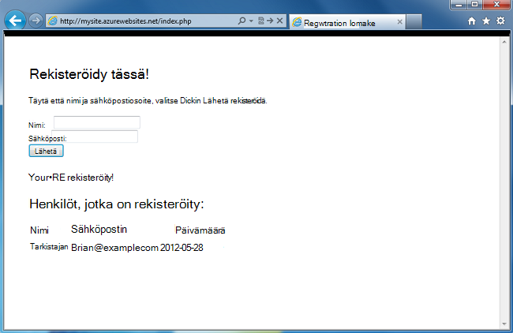
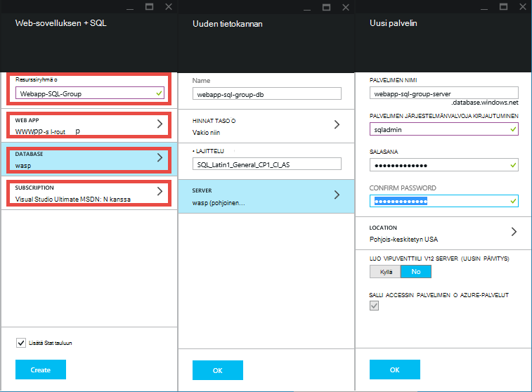
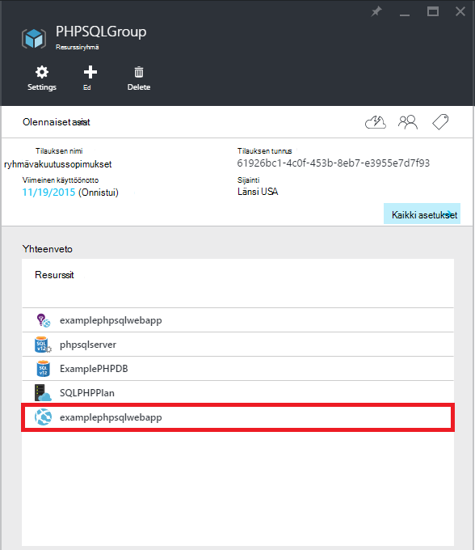
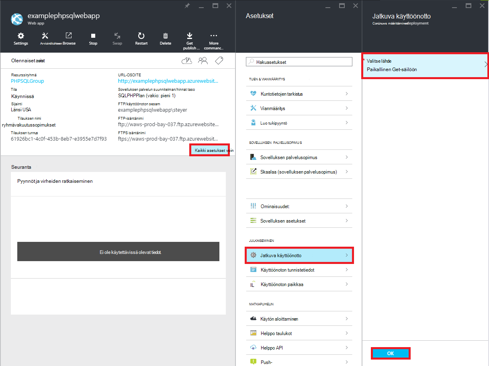
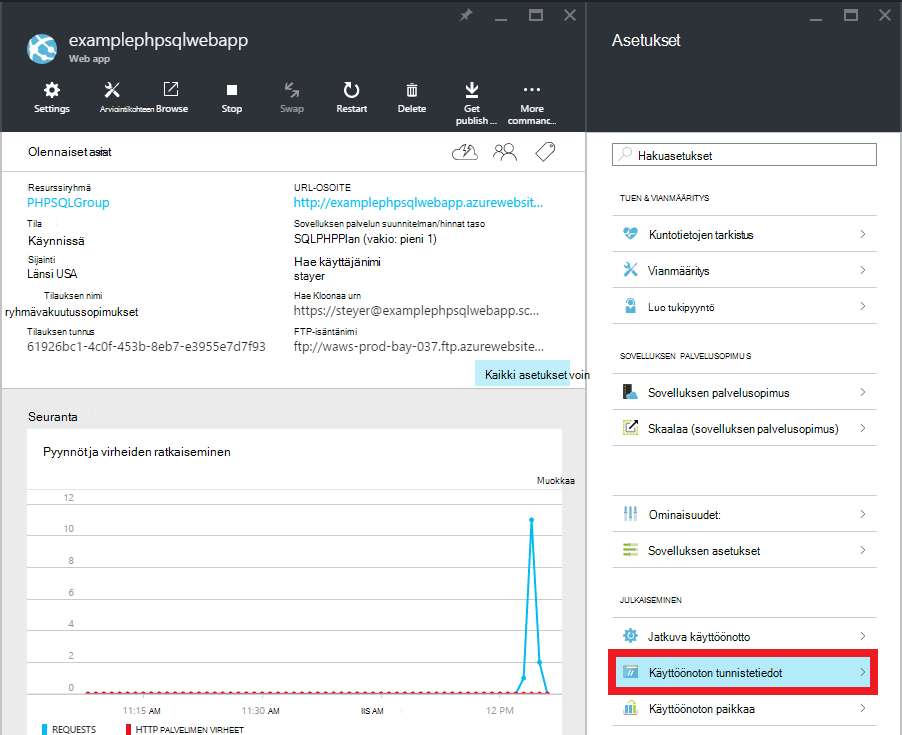
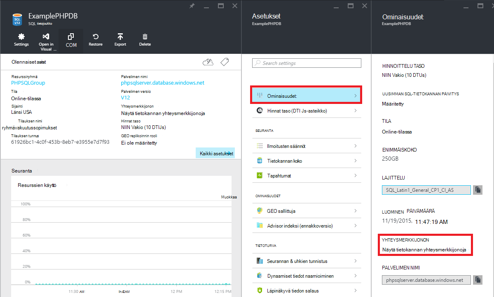

<properties 
    pageTitle="PHP SQL-web-sovelluksen luominen ja ota käyttöön Azure App palvelu Git" 
    description="Opetusohjelma, joka näytetään, miten PHP verkkosovellukseen, joka tallentaa tiedot Azure SQL-tietokannan luominen ja käyttäminen Git käyttöönoton Azure-sovelluksen palveluun." 
    services="app-service\web, sql-database" 
    documentationCenter="php" 
    authors="rmcmurray" 
    manager="wpickett" 
    editor=""/>

<tags 
    ms.service="app-service-web" 
    ms.workload="web" 
    ms.tgt_pltfrm="na" 
    ms.devlang="PHP" 
    ms.topic="article" 
    ms.date="08/11/2016" 
    ms.author="robmcm"/>

# PHP SQL-web-sovelluksen luominen ja ota käyttöön Azure App palvelu Git

Tässä opetusohjelmassa kerrotaan PHP verkkosovellukseen luominen [Azure App palvelu](http://go.microsoft.com/fwlink/?LinkId=529714) , joka yhdistää Azure SQL-tietokanta ja sen Git ottamisesta. Tässä opetusohjelmassa oletetaan, että [PHP][install-php], [SQL Server Express][install-SQLExpress], [Microsoft SQL Server PHP ohjaimet](http://www.microsoft.com/download/en/details.aspx?id=20098)ja [Git] [ install-git] tietokoneessasi. Kun olet suorittanut tämän oppaan, on käynnissä Azure PHP SQL verkkosovellukseen.

> [AZURE.NOTE]
> Voit asentaa ja määrittää PHP, SQL Server Express ja Microsoft Drivers PHP käyttämällä [Microsoftin WWW-ympäristö asennusohjelma](http://www.microsoft.com/web/downloads/platform.aspx)SQL Server.

Opit seuraavat asiat:

* Miten voit luoda Azure online ja [Azure Portal](http://go.microsoft.com/fwlink/?LinkId=529715)SQL-tietokantaan. Koska PHP on oletusarvoisesti käytössä App palvelun Web Apps-sovelluksissa, mitään erityistä tarvitaan PHP koodin suorittaminen.
* Voit julkaista ja julkaista uudelleen käyttämällä Git Azure sovellusta.
 
Tässä opetusohjelmassa seuraamalla voit luoda yksinkertaisen rekisteröinti-web-sovelluksen PHP. Sovelluksen isännöityjen Azure-sivustossa. Näyttökuva valmiin sovelluksen on alla:

[AZURE.INCLUDE [create-account-and-websites-note](../../includes/create-account-and-websites-note.md)]

>[AZURE.NOTE] Jos haluat aloittaa Azure App palvelun ennen rekisteröimässä Azure-tili, siirry [Yritä App palvelu](http://go.microsoft.com/fwlink/?LinkId=523751), jossa lyhytkestoinen starter verkkosovellukseen heti voit luoda sovelluksen-palvelussa. Ei ole pakollinen; luottokortit ei ole sitoumukset.

##Azure-web-sovelluksen luominen ja määrittäminen Git julkaiseminen

Luo Azure online ja SQL-tietokantaan seuraavasti:

1. Kirjaudu sisään [Azure Portal](https://portal.azure.com/).

2. Avaa on Azure Marketplace napsauttamalla **Uusi** -kuvaketta sivun vasempaan Raporttinäkymät-ikkunan, valitse **Valitse kaikki** Marketplace ja valitsemalla **Web + Mobile**-kohdan vieressä.
    
3. Valitse Marketplace- **Web- + Mobile**.

4. Valitse **Web Appissa + SQL** -kuvaketta.

5. Luettuasi Web Appin + SQL-sovelluksen kuvausta valitsemalla **Luo**.

6. Valitse jokaisen osan (**Resurssiryhmä**, **Web App -sovelluksen**, **tietokannan**ja **tilauksen**) ja kirjoita tai valitse tarvittavat kentät arvot:
    
    - Kirjoita valittua URL-nimi   
    - Määritä tietokannan server-tunnistetiedot
    - Sinua lähinnä alue

    

7. Kun olet valmis, web-sovelluksen määrittäminen, valitse **Luo**.

    Kun web-sovellus on luotu, **ilmoitukset** -painike flash näyttämään web app- ja SQL-tietokanta-ryhmässä vihreä **onnistumisen** ja avaa resurssien ryhmä-sivu.

4. Valitse Avaa web app-sivu resurssien ryhmä-sivu-web-sovelluksen kuvakkeen.

    

5. Valitse **asetusten** **Jatkuva käyttöönoton** > **Määritä tarvittavat asetukset**. Valitse **Paikallinen Git säilöön** , ja valitse **OK**.

    

    Jos olet määrittänyt ei ennen Git säilö, Anna käyttäjänimi ja salasana. Voit tehdä tämän valitsemalla **asetukset** > **käyttöönoton tunnistetiedot** -web-sovelluksen sivu.

    

6. Valitse **asetukset** , valitse **Ominaisuudet** Nähdäksesi Git remote URL-Osoitetta haluat ottaa käyttöön PHP sovelluksen myöhemmin.

##SQL-tietokannan yhteystiedot

SQL-tietokanta-esiintymään, joka on linkitetty web app-kohdassa näkyy on yhteystiedot, jonka määritit luodessasi tietokannan. Saat SQL-tietokannan yhteystiedot-seuraavasti:

1. Resurssiryhmä-sivu Valitse SQL-tietokanta-kuvaketta.

2. SQL-tietokanta-sivu, valitse **asetukset** > **Ominaisuudet**, valitse **Näytä tietokannan yhteysmerkkijonoja**. 

    
    
3. Tuloksena oleva valintaikkuna **PHP** -osiosta muistiin arvot `Server`, `SQL Database`, ja `User Name`. Se käyttää näitä arvoja myöhemmin, kun PHP koodiin julkaiseminen Azure App palvelu.

##Muodosta ja testaa sovelluksen paikallisesti

Rekisteröinti-sovellus on yksinkertainen PHP-sovellus, jonka avulla voit rekisteröidä tapahtuman antamalla nimen ja sähköpostiosoitteen. Tietoja edellisen Ilmoittautuneita näkyy taulukon. Rekisteröinnin tiedot tallennetaan SQL-tietokanta-esiintymässä. Sovelluksen kuuluu kaksi tiedostoa (kopioi ja liitä koodi käytettävissä alla):

* **Index.php**: Näyttää lomakkeen rekisteröimiseen ja rekisteröijän tiedot sisältävä taulukko.
* **createtable.php**: Luo sovelluksen SQL-tietokanta-taulukon. Tätä tiedostoa käytetään vain kerran.

Suorita sovellus paikallisesti, noudata seuraavia ohjeita. Huomaa, että seuraavissa vaiheissa oletetaan PHP ja SQL Server Express paikallisessa tietokoneessa määrittäminen ja olet ottanut [SQL Server-laajennus San][pdo-sqlsrv].

1. Luo SQL Server-tietokantaan, jota kutsutaan `registration`. Voit tehdä sen käyttämällä `sqlcmd` komentokehote seuraavia komentoja:

        >sqlcmd -S localhost\sqlexpress -U <local user name> -P <local password>
        1> create database registration
        2> GO   

2. Luo sovelluksen pääkansio kaksi tiedostoa ei - jokin kutsutaan `createtable.php` ja yksi kutsutaan `index.php`.

3. Avaa `createtable.php` tiedoston tekstieditorissa tai IDE ja lisää seuraava koodi. Tämä koodi käytetään luomaan `registration_tbl` taulukkoon `registration` tietokannan.

        <?php
        // DB connection info
        $host = "localhost\sqlexpress";
        $user = "user name";
        $pwd = "password";
        $db = "registration";
        try{
            $conn = new PDO( "sqlsrv:Server= $host ; Database = $db ", $user, $pwd);
            $conn->setAttribute( PDO::ATTR_ERRMODE, PDO::ERRMODE_EXCEPTION );
            $sql = "CREATE TABLE registration_tbl(
            id INT NOT NULL IDENTITY(1,1) 
            PRIMARY KEY(id),
            name VARCHAR(30),
            email VARCHAR(30),
            date DATE)";
            $conn->query($sql);
        }
        catch(Exception $e){
            die(print_r($e));
        }
        echo "<h3>Table created.</h3>";
        ?>

    Huomaa, että sinun on päivitettävä arvot <code>$user</code> ja <code>$pwd</code> paikallisen SQL Server-käyttäjänimi ja salasana.

4. Kirjoita terminaalissa sovelluksen pääkansioon seuraava komento:

        php -S localhost:8000

4. Avaa selain ja siirry **http://localhost:8000/createtable.php**. Tämä vaihtoehto luo `registration_tbl` tietokannan taulukkoon.

5. Avaa **index.php** tiedostoa tekstieditorissa tai IDE ja lisää basic HTML- ja CSS-koodin (PHP koodi lisätään myöhemmin vaiheet)-sivulle.

        <html>
        <head>
        <Title>Registration Form</Title>
        
        </head>
        <body>
        <h1>Register here!</h1>
        
Fill in your name and email address, then click <strong>Submit</strong> to register.

        <form method="post" action="index.php" enctype="multipart/form-data" >
              Name  <input type="text" name="name" id="name"/> 
              Email <input type="text" name="email" id="email"/> 
              <input type="submit" name="submit" value="Submit" />
        </form>
        <?php

        ?>
        </body>
        </html>

6. Lisää PHP koodi tietokantayhteyden muodostamisessa PHP, tunnisteiden sisällä.

        // DB connection info
        $host = "localhost\sqlexpress";
        $user = "user name";
        $pwd = "password";
        $db = "registration";
        // Connect to database.
        try {
            $conn = new PDO( "sqlsrv:Server= $host ; Database = $db ", $user, $pwd);
            $conn->setAttribute( PDO::ATTR_ERRMODE, PDO::ERRMODE_EXCEPTION );
        }
        catch(Exception $e){
            die(var_dump($e));
        }

    Uudelleen, sinun on päivitettävä arvot <code>$user</code> ja <code>$pwd</code> paikallisen MySQL-käyttäjänimi ja salasana.

7. Seurattavat kohteet-tietokannan yhteys-koodin lisääminen koodin lisääminen rekisteröintitietoja tietokantaan.

        if(!empty($_POST)) {
        try {
            $name = $_POST['name'];
            $email = $_POST['email'];
            $date = date("Y-m-d");
            // Insert data
            $sql_insert = "INSERT INTO registration_tbl (name, email, date) 
                           VALUES (?,?,?)";
            $stmt = $conn->prepare($sql_insert);
            $stmt->bindValue(1, $name);
            $stmt->bindValue(2, $email);
            $stmt->bindValue(3, $date);
            $stmt->execute();
        }
        catch(Exception $e) {
            die(var_dump($e));
        }
        echo "<h3>Your're registered!</h3>";
        }

8. Lopuksi seuraavat yllä olevan koodin lisääminen koodi tietojen noutaminen tietokannasta.

        $sql_select = "SELECT * FROM registration_tbl";
        $stmt = $conn->query($sql_select);
        $registrants = $stmt->fetchAll(); 
        if(count($registrants) > 0) {
            echo "<h2>People who are registered:</h2>";
            echo "<table>";
            echo "<tr><th>Name</th>";
            echo "<th>Email</th>";
            echo "<th>Date</th></tr>";
            foreach($registrants as $registrant) {
                echo "<tr><td>".$registrant['name']."</td>";
                echo "<td>".$registrant['email']."</td>";
                echo "<td>".$registrant['date']."</td></tr>";
            }
            echo "</table>";
        } else {
            echo "<h3>No one is currently registered.</h3>";
        }

Voit nyt selata **http://localhost:8000/index.php** Testaa sovellus.

##Sovelluksen julkaiseminen

Kun olet testannut sovelluksesi paikallisesti, julkaiseminen App palvelun Web Apps-sovellusten käyttäminen Git. Sinun on päivitettävä tietokannan yhteystiedot-sovelluksessa. Olet hankkinut yhteystiedot aiemmin ( **Hae SQL-tietokannan yhteystiedot** -osan avulla), Päivitä seuraavat tiedot **sekä** `createdatabase.php` ja `index.php` tiedostoja, joissa kyseiset arvot:

    // DB connection info
    $host = "tcp:<value of Server>";
    $user = "<value of User Name>";
    $pwd = "<your password>";
    $db = "<value of SQL Database>";

> [AZURE.NOTE]
> Valitse <code>$host</code>, palvelimen arvo on $a <code>tcp:</code>.

Nyt olet valmis, voit määrittää Git julkaiseminen ja julkaista sovelluksen.

> [AZURE.NOTE]
> Nämä ovat samat vaiheet ole mainittu edellä **Azure web-sovelluksen luominen ja määrittäminen Git julkaiseminen** osan loppuun.

1. Avaa GitBash (tai päätteen, jos Git on kohdassa `PATH`), muuta kansioiden pääkansion sovelluksesi ( **rekisteröinti** -kansio) ja suorittamalla seuraavat komennot:

        git init
        git add .
        git commit -m "initial commit"
        git remote add azure [URL for remote repository]
        git push azure master

    Voit pyydetään antamaan aiemmin luomasi salasana.

2. Siirry **http://[web sovelluksen name].azurewebsites.net/createtable.php** Luo sovelluksen SQL-tietokannan taulukkoon.
3. Siirry **http://[web sovelluksen name].azurewebsites.net/index.php** , kun haluat käyttää sovellusta.

Kun olet julkaissut sovelluksen, voit aloittaa muutosten tekeminen ja Git avulla voit julkaista ne. 

##Sovelluksen muutosten julkaiseminen

Sovelluksen muutosten julkaiseminen seuraavasti:

1. Muutosten tekeminen sovelluksen paikallisesti.
2. Avaa GitBash (tai päätteeseen, it Git on oman `PATH`), muuta kansioiden sovelluksen pääkansiossa ja suorittamalla seuraavat komennot:

        git add .
        git commit -m "comment describing changes"
        git push azure master

    Voit pyydetään antamaan aiemmin luomasi salasana.

3. Siirry **http://[web sovelluksen name].azurewebsites.net/index.php** voit tarkastella muutoksia.

## Mikä on muuttunut
* Katso muutoksen opas verkkosivuilta App palveluun: [Azure App palvelu ja sen vaikutus aiemmin Azure-palvelut](http://go.microsoft.com/fwlink/?LinkId=529714)

[install-php]: http://www.php.net/manual/en/install.php
[install-SQLExpress]: http://www.microsoft.com/download/details.aspx?id=29062
[install-Drivers]: http://www.microsoft.com/download/details.aspx?id=20098
[install-git]: http://git-scm.com/
[pdo-sqlsrv]: http://php.net/pdo_sqlsrv
 
