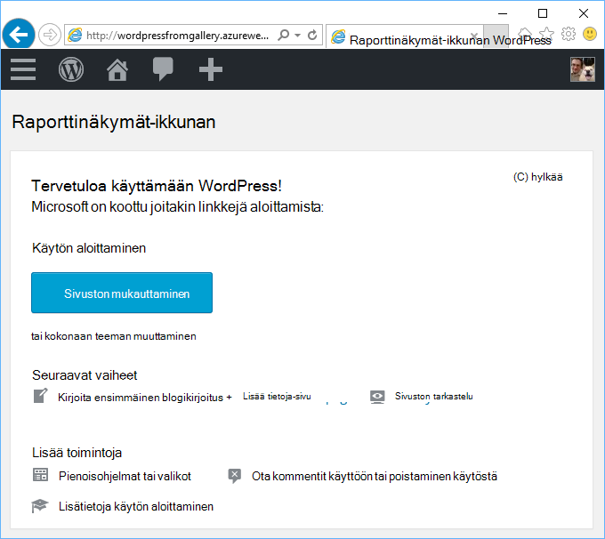
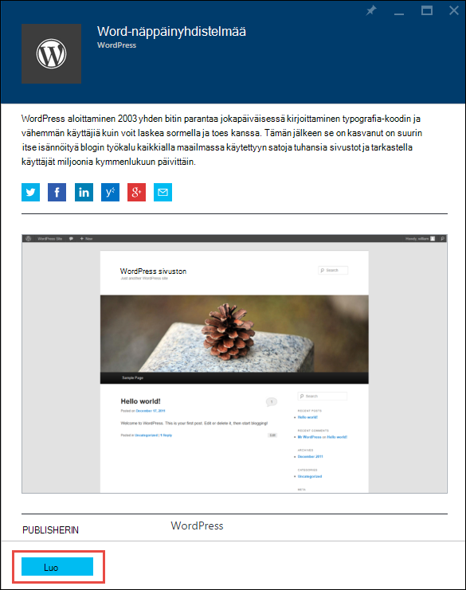
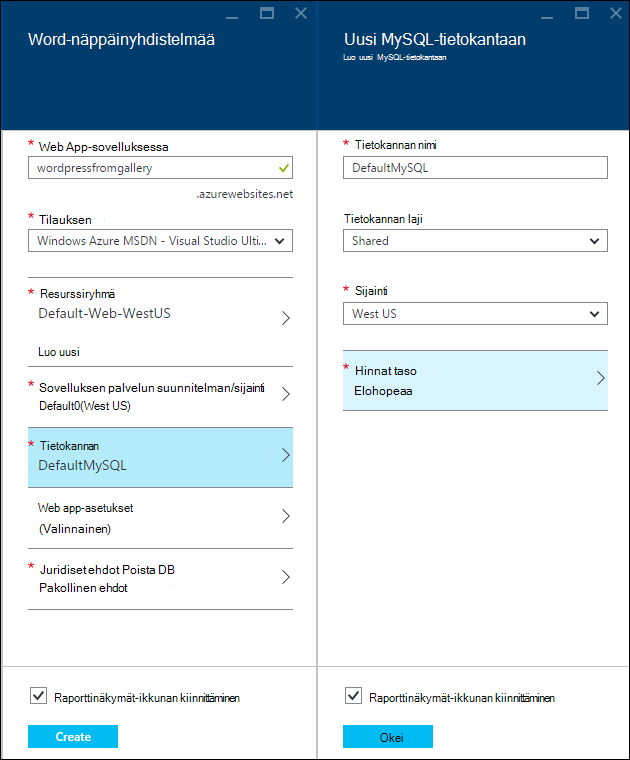
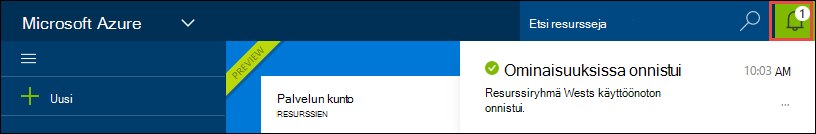
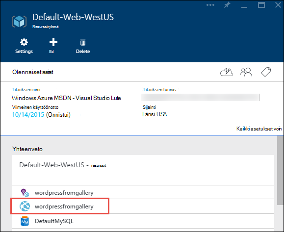
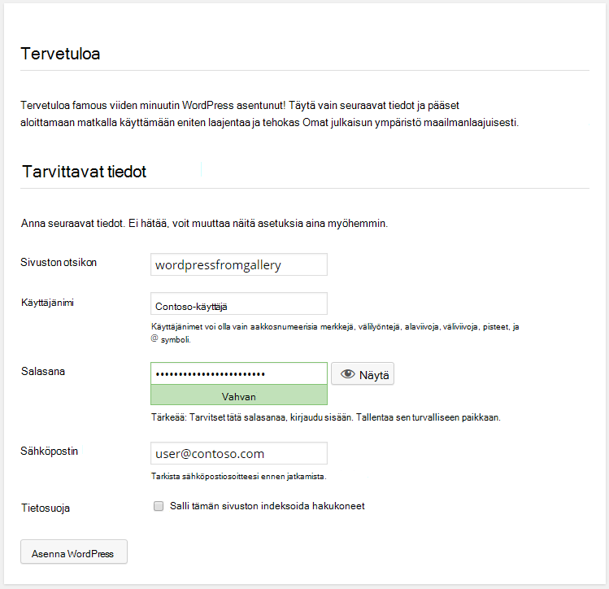

<properties
    pageTitle="WordPress verkkosovellukseen luominen Azure App palvelun | Microsoft Azure"
    description="Opi luomaan uusi Azure verkkosovellukseen WordPress blogin Azure-portaalissa."
    services="app-service\web"
    documentationCenter="php"
    authors="rmcmurray"
    manager="wpickett"
    editor=""/>

<tags
    ms.service="app-service-web"
    ms.workload="na"
    ms.tgt_pltfrm="na"
    ms.devlang="PHP"
    ms.topic="hero-article"
    ms.date="08/11/2016"
    ms.author="robmcm"/>

# Luo WordPress verkkosovellukseen Azure sovelluksen-palvelussa

[AZURE.INCLUDE [tabs](../../includes/app-service-web-get-started-nav-tabs.md)]

Tässä opetusohjelmassa näytetään ottamisesta käyttöön WordPress Blogisivuston Azure Marketplacesta.

Kun enää tarvitse opetusohjelman on omat WordPress Blogisivusto ylöspäin ja suorittamalla pilveen.

Opit:

* Miten sovellusten mallin etsiminen Azure Marketplacesta.
* Miten verkkosovellukseen luodaan Azure App palvelu, joka perustuu malliin.
* Uusi web app ja tietokannan Azure App palvelun asetusten määrittämisestä.

Azure Marketplacesta on käytettävissä monien suosittujen web Apps-sovellusten kehittämä Microsoft kolmansien osapuolien ja Avaa lähde ohjelmiston hankkeita. Web-sovellukset ovat rakennettu monien suosittujen kehysten, kuten tässä WordPress esimerkki, [.NET](/develop/net/), [Node.js](/develop/nodejs/), [Java](/develop/java/)ja [Python](/develop/python/), muun muassa [PHP](/develop/nodejs/) . Web-sovelluksen luominen Azure Marketplacesta, tarvitset vain ohjelmisto on selaimessa, jota käytetään [Azure-portaalissa](https://portal.azure.com/). 

WordPress-sivusto, joka otetaan käyttöön tässä opetusohjelmassa käyttää MySQL tietokantaan. Jos haluat käyttää sen sijaan tietokannalle SQL-tietokantaan, katso [Projektin Nami](http://projectnami.org/). **Projektin Nami** on myös on Marketplace kautta.

> [AZURE.NOTE]
> Tässä opetusohjelmassa suorittamiseen tarvitset Microsoft Azure-tiliin. Jos sinulla ei ole tiliä, voit [aktivoida Visual Studio tilaajan etuja](/pricing/member-offers/msdn-benefits-details/?WT.mc_id=A261C142F) tai [maksuttoman kokeiluversion käyttäjäksi rekisteröityminen](/en-us/pricing/free-trial/?WT.mc_id=A261C142F).
>
> Jos haluat aloittaa Azure App palvelun, ennen kuin kirjaudut Azure-tili, siirry [Yritä App kääntäjä](http://go.microsoft.com/fwlink/?LinkId=523751). Siellä voit luoda lyhytkestoinen starter verkkosovellukseen heti App palvelussa – ei luottokortti ja ei ole sitoumukset.

## Valitse WordPress ja Azure sovelluksen-palvelun määrittäminen

1. Kirjaudu sisään [Azure Portal](https://portal.azure.com/).

2. Valitse **Uusi**.
    
    ![Luo uusi][5]
    
3. Etsi **WordPress**ja valitse sitten **WordPress**. Jos haluat käyttää SQL-tietokantaan sen sijaan, että MySQL-etsiä **Projektin Nami**.

    ![WordPress luettelosta][7]
    
5. Luettuasi WordPress sovelluksen kuvausta valitsemalla **Luo**.

    

4. Kirjoita nimi web-sovelluksen **Web app** -ruutuun.

    Tämän nimen on oltava yksilöllinen azurewebsites.net toimialueen, koska web Appin URL-osoite on {name}. azurewebsites.net. Jos kirjoittamasi nimi ei ole yksilöllisiä, punainen huutomerkki näkyy teksti-ruutuun.

8. Jos sinulla on useita tilauksia, valitse haluamasi vaihtoehto, jota haluat käyttää. 

5. Valitse **Resurssiryhmä** tai luoda uuden.

    Saat lisätietoja resurssiryhmät [Azure resurssin hallinnassa: yleiskatsaus](../azure-resource-manager/resource-group-overview.md).

5. Valitse **Sovelluksen palvelun suunnitelman/sijainti** tai luoda uuden.

    Saat lisätietoja sovelluksen palvelusopimusten vaihtoehdot artikkelissa [Azure App palvelun suunnitelmien yleiskatsaus](../azure-web-sites-web-hosting-plans-in-depth-overview.md) 

7. Valitse **tietokanta**ja anna sitten tarvittavat arvot **Uuteen MySQL-tietokantaan** sivu määrittämiseen MySQL-tietokantaan.

    a. Kirjoita uusi nimi tai jätä oletusnimeä.

    b. Jätä arvoksi **jaetun** **Tietokannan laji** .

    c-näppäinyhdistelmää. Valitse valitsemasi web-sovelluksen samaan sijaintiin.

    d. Valitse hinnoittelu taso. Tässä opetusohjelmassa on hieno elohopeaa (maksuton mahdollisimman vähän sallittujen yhteyksien ja levytilan).

8. Valitse **Uusi MySQL-tietokanta** -sivu valitsemalla **OK**. 

8. **WordPress** -sivu-juridiset ehdot ja valitse sitten **Luo**. 

    

    Azure App palvelun Luo verkkosovellus, yleensä alle minuutissa. Voit katsoa edistymistä napsauttamalla portaalin sivun yläosassa Bellin-kuvaketta.

    

## Käynnistä ja hallita WordPress koodiin
    
7. Kun web-sovelluksen luominen on valmis, siirry Azure portaalin resurssiryhmä, jossa sovellus on luotu ja näet web app- ja tietokanta.

    Hehkulampun-kuvakkeella ylimääräisiä resurssi on [Hakemuksen tiedot](/services/application-insights/), jotka tarjoavat seurantaa web Appissa.

1. **Resurssiryhmä** -sivu valitsemalla web app-rivi.

    

2. Valitse Web app-sivu valitsemalla **Selaa**.

    ![sivuston URL-osoite][browse]

3. WordPress **Tervetuloa** -sivulla WordPress vaatii määritysten tiedot ja valitse sitten **Asenna WordPress**.

    

4. Kirjaudu sisään käyttämällä luomaasi **aloitussivulla** tunnistetietoja.  

5. Sivuston Dashboard-sivu avautuu.    

    

## Seuraavat vaiheet

Nähnyt, miten voit luoda ja ottaa käyttöön PHP verkkosovellukseen valikoimasta. Lisätietoja Azure PHP käyttämisestä on artikkelissa [PHP Developer Center](/develop/php/).

Saat lisätietoja sovelluksen palvelun Web Apps-sovellusten käsittelemisestä linkkejä (for leveä selainikkunat)-sivun vasemmassa reunassa tai (, kapea selainikkunat)-sivun yläreunassa. 

## Mikä on muuttunut
* Katso muutoksen opas App palveluun verkkosivuilta, [Azure App palvelu ja sen vaikutus aiemmin Azure-palvelut](http://go.microsoft.com/fwlink/?LinkId=529714).

[5]: ./media/web-sites-php-web-site-gallery/startmarketplace.png
[7]: ./media/web-sites-php-web-site-gallery/search-web-app.png
[browse]: ./media/web-sites-php-web-site-gallery/browse-web.png
