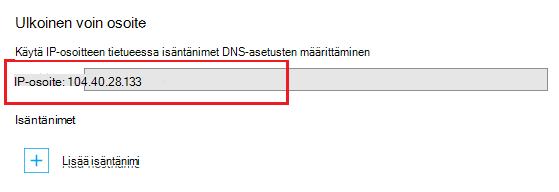

<properties
    pageTitle="Osta ja SSL-varmenteen määrittäminen sovelluksen Azure-palvelussa"
    description="Opettele Osta ja SSL-varmenteen määrittäminen sovelluksen Azure-palvelussa."
    services="app-service"
    documentationCenter=".net"
    authors="apurvajo"
    manager="stefsch"
    editor="cephalin"
    tags="buy-ssl-certificates"/>

<tags
    ms.service="app-service"
    ms.workload="na"
    ms.tgt_pltfrm="na"
    ms.devlang="na"
    ms.topic="article"
    ms.date="09/19/2016"
    ms.author="apurvajo"/>

#Osta ja SSL-varmenteen määrittäminen sovelluksen Azure-palvelussa

> [AZURE.SELECTOR]
- [Osta SSL-varmenteen Azure-tietokannassa](web-sites-purchase-ssl-web-site.md)
- [Käytä SSL-varmenteen muualta](web-sites-configure-ssl-certificate.md)

Oletusarvon mukaan **[Azure App palvelun](http://go.microsoft.com/fwlink/?LinkId=529714)** jo ottaa HTTPS web App-ohjelman kanssa *yleismerkkien varmennetta. azurewebsites.net toimialueen. Jos et aio määrittää mukautetun toimialueen, voit hyötyvät HTTPS varmennetta. Kuitenkin, kuten kaikki * [yleismerkkien toimialueet](https://casecurity.org/2014/02/26/pros-and-cons-of-single-domain-multi-domain-and-wildcard-certificates), ei ole yhtä turvallinen kuin mukautetun toimialueen käyttäminen oman allekirjoituksen. Azure App palvelun nyt löytyy todella yksinkertaistettu voi ostaa ja hallita SSL-varmenteen Azure Portal suoraan portaalin poistumatta.  
Tässä artikkelissa kerrotaan, miten voit ostaa ja SSL-varmenteen määrittäminen **[Azure App palvelun](http://go.microsoft.com/fwlink/?LinkId=529714)** helpon vaiheen 3. 

> [AZURE.NOTE]
> Mukautettu toimialuenimien SSL-varmenteita ei voi käyttää vapaa ja jaettujen web App-ohjelmalla. Sinun on määritettävä Basic, Standard tai Premium-tilan, jotka saattavat muuttua, kuinka paljon tilauksen veloittaa koodiin. Lisätietoja on kohdassa **[Web Apps hinnat tiedot](https://azure.microsoft.com/pricing/details/web-sites/)** .

##Yleiskatsaus
> [AZURE.NOTE]
> Valitse Älä yritä ostaa tilauksen, joka ei ole aktiivinen luottokortin tiedot, joka liittyy käyttäminen SSL-varmenteen. Tämä saattaa johtaa tilauksen poistetaan käytöstä. 

##<a>Ostaa, tallentaa ja SSL-varmenteen mukautetun toimialueen määrittäminen</a>
HTTPS ottaa käyttöön mukautetun toimialueen, kuten contoso.com, sinun on ensin ** [määrittäminen käyttämään mukautettua toimialuenimeä Azure App palvelun.](web-sites-custom-domain-name.md)**

Ennen pyytää SSL-varmenne on ensin määritettävä, mitä toimialuenimet suojataan todistus. Minkä tyyppistä todistusta sinun on hankittava se määrittää. Jos haluat suojata yksittäisen toimialuenimi, esimerkiksi contoso.com tai www.contoso.com standardi (perus) varmenne on riittävä. Jos haluat suojata useiden toimialuenimien, kuten contoso.com, www.contoso.com ja mail.contoso.com, valitse saat ** [yleismerkkivarmenne](http://en.wikipedia.org/wiki/Wildcard_certificate)**

##Vaihe 0: Vie tilauksen SSL-varmenne

Tässä vaiheessa kerrotaan, miten voit tilata valittua SSL-varmenteen.

1.  **[Azure-portaali](https://portal.azure.com/)**valitsemalla Selaa ja "Sovelluksen Service todistusten" Kirjoita etsintäpalkin ja valitse "Sovelluksen Service todistusten" tulos ja valitse Lisää. 

    

    

2.  Kirjoita **kutsumanimi** SSL-varmenne.

3.  Kirjoita **isäntänimi**
> [AZURE.NOTE]
    Tämä on yksi hankkiminen prosessin kannalta osat. Varmista, että oikea isännän nimeä (mukautettu toimialue), jonka haluat suojata tällä varmenteella. **Älä** Liitä isäntänimi WWW kanssa. Mukautettu toimialuenimi on www.contoso.com, valitse Kirjoita isäntänimi-kentän contoso.com, kyseinen sertifikaatti suojaa www-ja ylimmällä tasolla. 
    
4.  Valitse **tilaus**. 

    Jos sinulla on useita tilauksia, varmista, että voit luoda saman tilauksen, joka on kehitetty mukautettua toimialuetta tai Web App SSL-varmenteen poistettavaan.
       
5.  Valitse tai luo **resurssiryhmä**.

    Resurssiryhmät, joiden avulla voit hallita liittyvät Azure resurssit yksikkönä ja on hyötyä, kun sovellus Roolipohjainen käytön hallinta (RBAC) säännöistä. Lisätietoja on artikkelissa Azure resurssien hallinta.
     
6.  Valitse **varmenne SKU** 

    Valitse varmenne, joka sopii tarvittaessa tuote- ja sitten Luo. Nykyään Azure sovelluksen-palvelun avulla voit ostaa kaksi eri tuotteissa • S1 – vakio varmenteen 1 vuoden voimassaoloaika ja automaattinen uusiminen  
           • W1 – 1 vuosi ja kelpoisuuden automaattisen uusimisen varmenteen yleismerkki      
    Lisätietoja on kohdassa **[Web Apps hinnat tiedot](https://azure.microsoft.com/pricing/details/web-sites/)** .

> [AZURE.NOTE]
> SSL-varmenteen luominen kestää missä tahansa 1 – 10 minuuttia. Tämä prosessi suorittaa useita vaiheita, jotka muuten hyvin hankalaa manuaalisesti suorittaa taustalla.  

##Vaihe 1: Tallentaa varmenteen Azure avain säilöön

Tässä vaiheessa kerrotaan, miten voit sijoittaa tallentaa luodun SSL-varmenne, jota olet hankkinut Azure avaimen säilö valittua.

1.  SSL-varmenteen hankkiminen jälkeen sinun tarvitse avata manuaalisesti **App Service todistusten** resurssin sivu selaamalla sen uudelleen (Katso vaiheessa 1 yllä)   

    

    Huomaat, että sertifikaatin tila on **"odotetaan Liittoutumispalvelujen"** on muutamia Lisää vaihetta, sinun on suoritettava, ennen kuin voit käyttää tätä varmenteet.
 
2. Valitse **"todistus-kokoonpanon"** sisällä Sertifikaattiominaisuudet-sivu ja napsauta tallentamiseen tämän todistuksen Azure avain säilöön **"Vaihe-1: Tallenna"** .

3.  Jos haluat valita aiemmin avain-säilö tallentamiseen tämän todistuksen **tai "Luo uusi avain säilö"** Luo uusi avain säilö saman tilauksen ja resurssien ryhmän sisällä **"avaimen säilö säilöön"** **"Avaimen säilö tila-** sivu Valitse.
 
    
 
    > [AZURE.NOTE]
    Azure avaimen säilö on mahdollisimman vähän ovat tämän todistuksen tallentamista varten. Lisätietoja on kohdassa **[Azure avaimen säilö hinnat tiedot](https://azure.microsoft.com/pricing/details/key-vault/)** .

4. Kun olet valinnut tallentamiseen tämän varmenteen avaimen säilöön-säilöön, siirry eteenpäin ja tallenna se napsauttamalla **"Tallentaa"** -painikkeen yläpuolella **"Avaimen säilö tila-** sivu.  

    Tämä kannattaa suorittaa vaiheen tallentaminen Azure avaimen säilö valittua ostit varmenteen. Päivityksen sivu näkyy vihreä Tarkista tässä vaiheessa vastaan Merkitse.
    
##Vaihe 2: Vahvista toimialueen omistajuus

Tässä vaiheessa opit tietoja toimialueen omistajuuden vahvistusta varten SSL-varmenne, jota asetit tilauksen. 

1.  Valitse **"Vaihe 2: Tarkista"** **"Todistus-kokoonpanon"** -sivu-vaihe. Toimialueen vahvistus App Service todistusten tukemat 4 perustyyppiä.

    * **Sovelluksen palvelun todentaminen** 
    
        * Tämä on kätevin prosessi, jos sinulla on jo **-palvelun sovellukset myönnetyt mukautettua toimialuetta.** Tämä menetelmä sisältää luettelon, kaikki-palvelun sovellukset tämän ehtoja vastaavat. 
           Esimerkiksi tässä tapauksessa **contosocertdemo.com** on määritetty sovelluksen palvelun sovelluksen nimeltä **"ContosoCertDemo"** mukautetun toimialueen ja näin ollen, joka on tässä luettelossa vain sovelluksen Service-sovellus. Jos oli monille käyttöönoton jälkeen se luettelo, kaikkien alueiden välillä.
        
           Tarkistus-menetelmä on vain käytettävissä Standard (perus) varmenteen hankintoja. Yleismerkki varmenteiden ohittaa ja siirtyy vaihtoehdon B, C tai D alla.
        * Valitse **"Vahvista"** -painiketta, jos haluat suorittaa tämän vaiheen.
        * Valitse **"Päivitä"** päivittää varmenteen tilan, kun vahvistus on valmis. Saattaa kestää muutaman minuutin suorittamiseen vahvistusta varten.
        
             

    * **Toimialueen vahvistus** 

        * Tämä on **vain, jos** sinulla on kätevin prosessi **[mukautetun toimialueen ostettu Azure App palvelun.](custom-dns-web-site-buydomains-web-app.md)**
        
        * Valitse **"Vahvista"** -painiketta, jos haluat suorittaa tämän vaiheen.
        
        * Valitse **"Päivitä"** päivittää varmenteen tilan, kun vahvistus on valmis. Saattaa kestää muutaman minuutin suorittamiseen vahvistusta varten.

    * **Sähköpostin vahvistus**
        
        * Vahvistussähköposti on jo lähetetty liittyvät tämän mukautetun toimialueen sähköpostiosoitteet.
         
        * Avaa sähköpostiviesti ja viimeistele sähköpostin vahvistus-vaihe vahvistus-linkkiä. 
        
        * Jos haluat lähettää vahvistussähköposti, napsauta **"Lähetä sähköposti-** painiketta.
         
    * **Manuaalinen vahvistus**    
                 
        1. **HTML-Web-sivun todentaminen**
        
            * Luo HTML-tiedosto nimeltä **{Toimialueen vahvistus suojaustunnuksen}**.html (Voit kopioida tunnuksen hän toimialueen vahvistus tila-sivu)
            
            * Sisällön tämän tiedoston on oltava sama nimen, **Toimialueen vahvistustunnuksen**.
            
            * Lataa tämä tiedosto toimialueen isäntäpalvelimen ylimmällä tasolla.
            
            * Valitse **"Päivitä"** päivittää varmenteen tilan, kun vahvistus on valmis. Saattaa kestää muutaman minuutin suorittamiseen vahvistusta varten.
            
            Esimerkiksi jos ostat vakio varmenteen contosocertdemo.com kanssa toimialueen vahvistustunnuksen **'cAGgQrKc'** sitten **'http://contosocertdemo.com/cAGgQrKc.html'** web-pyynnön tulee palauttaa **cAGgQrKc.**
        2. **DNS TXT-tietueen todentaminen**

            * Käyttämällä DNS-hallintaan ja luo TXT-tietueen arvon **"DZC"** -alitoimialueen yhtä suuri kuin **toimialueen vahvistus suojaustunnuksen.**
            
            * Valitse **"Päivitä"** päivittää varmenteen tilan, kun vahvistus on valmis. Saattaa kestää muutaman minuutin suorittamiseen vahvistusta varten.
                              
            Esimerkiksi, jotta suorittaa vahvistus hostname yleismerkkien varmenteen ** \*. contosocertdemo.com** tai ** \*. subdomain.contosocertdemo.com** ja toimialueen vahvistus suojaustunnuksen **cAGgQrKc**, sinun on luotava TXT-tietue-arvolla dzc.contosocertdemo.com **cAGgQrKc.**     

##Vaihe 3: Määritä varmenteen App Service-sovellukseen

Tässä vaiheessa opit määrittäminen tämä ostettu juuri varmenteen App Service-sovelluksiin. 

> [AZURE.NOTE]
> Ennen kuin suoritat tämän osan vaiheet, sinun on on liitetty mukautettua toimialuenimeä sovelluksen. Lisätietoja on artikkelissa ** [määrittäminen käyttämään mukautettua toimialuenimeä web Appissa.](web-sites-custom-domain-name.md)**

1.  Avaa selaimessa ** [Azure-portaalissa.](https://portal.azure.com/)**
2.  Valitse sivun vasemmassa reunassa **App Service** -asetus.
3.  Napsauta, johon haluat määrittää tämän todistuksen sovelluksen nimeä. 
4.  Valitse **asetukset**-kohdassa **SSL-varmenteita**
5.  Valitse **Tuo sovelluksen palvelun varmenne** ja valitse varmenne, juuri hankittu

    

6. Kohdassa **ssl sidontojen** valitsemalla **Lisää sidontojen**
7. Valitse toimialuenimi, jota suojattu SSL ja varmennetta käyttämällä **Lisää SSL sidonta** -sivu avattavista luetteloista avulla. Voit myös valita käytetäänkö **[Palvelimen nimi merkintä (SNI)](http://en.wikipedia.org/wiki/Server_Name_Indication)** tai IP-pohjaiseen SSL.

    

       •    IP based SSL associates a certificate with a domain name by mapping the dedicated public IP address of the server to the domain name. This requires each domain name (contoso.com, fabricam.com, etc.) associated with your service to have a dedicated IP address. This is the traditional          method of associating SSL certificates with a web server.
       •    SNI based SSL is an extension to SSL and **[Transport Layer Security](http://en.wikipedia.org/wiki/Transport_Layer_Security)** (TLS) that allows multiple domains to share the same IP address, with separate security certificates for each domain. Most modern browsers (including Internet Explorer, Chrome, Firefox and Opera) support SNI, however older browsers may not support SNI. For more information on SNI, see the **[Server Name Indication](http://en.wikipedia.org/wiki/Server_Name_Indication)** article on Wikipedia.
       
7. Valitse **Lisää sidonta** voit tallentaa muutokset ja ottaa SSL.

Jos olet valinnut **IP-pohjaisen SSL** ja mukautettu toimialue on määritetty käyttämällä A-tietue, on suoritettava seuraavat vaiheet:

* Kun olet määrittänyt IP perusteella SSL-sidonta, sovellus on määritetty kiinteä IP-osoite. Löydät IP-osoitteen sovelluksesi yläpuolella **isäntänimet** -osan asetukset-kohdassa **Mukautettu toimialue** -sivulla. Se merkitään **Ulkoinen IP-osoite**
    
    

    Huomaa, että tämä IP-osoite on sama kuin aikaisemmin toimialueen A-tietueen määrittäminen virtual IP-osoite. Jos on määritetty käyttämään SNI perusteella SSL tai ei ole määritetty käyttämään SSL-yhteyttä, osoitetta näkyvät tässä vaihtoehdossa.
    
2. Toimialuenimirekisteröintipalvelun varten työkaluilla, muokata mukautettua toimialuenimeä osoittavan IP-osoitteeseen edellisessä vaiheessa A-tietuetta.
Tässä vaiheessa sinun pitäisi käy sovelluksen käyttämällä HTTPS:// HTTP:// sijaan voit varmistaa, että varmenne on määritetty oikein.

##Avaimen uusiminen ja synkronoida varmenne

1. Tietoturvasyistä, jos haluat joskus avaimen uusiminen varmennetta sitten yksinkertaisesti Valitse **Avaimen uusiminen ja synkronoi-** komento **"Sertifikaattiominaisuudet-** sivu. 

2. Valitse **"Avaimen uusiminen"** -painiketta, voit aloittaa. Voi kestää 1 – 10 minuuttia. 

    

3. Uudelleenluonti varmennetta aikaisempi varmenteiden myöntäjältä uusi varmenteiden varmenne.
4. Sinulla ei ole veloitetaanko Rekeying varmenteen elinkaaren varten. 
5. Uudelleenluonti varmennetta tulee käydä läpi odotetaan Liittoutumispalvelujen tila. 
6. Kun varmenne on valmis, varmista, että synkronoit tämän sertifikaatin avulla voit estää palvelun keskeytymisen resurssit.
7. Synkronoi-vaihtoehto ei ole käytettävissä sertifikaatteja, joita ei ole vielä määritetty Web App-sovellukseen. 

## Lisää resursseja ##
- [Ota käyttöön HTTPS sovelluksen Azure sovelluksen-palvelussa](web-sites-configure-ssl-certificate.md)
- [Osta ja määrittäminen käyttämään mukautettua toimialuenimeä App Azure-palvelu](custom-dns-web-site-buydomains-web-app.md)
- [Microsoft Azure-Valvontakeskus](/support/trust-center/security/)
- [Kokoonpanoasetusten määrittäminen lukitus Azure sivustoja](http://azure.microsoft.com/blog/2014/01/28/more-to-explore-configuration-options-unlocked-in-windows-azure-web-sites/)
- [Azure hallinta-portaalissa](https://manage.windowsazure.com)

>[AZURE.NOTE] Jos haluat aloittaa Azure App palvelun ennen rekisteröimässä Azure-tili, siirry [Yritä App palvelu](http://go.microsoft.com/fwlink/?LinkId=523751), jossa lyhytkestoinen starter verkkosovellukseen heti voit luoda sovelluksen-palvelussa. Ei ole pakollinen; luottokortit ei ole sitoumukset.

