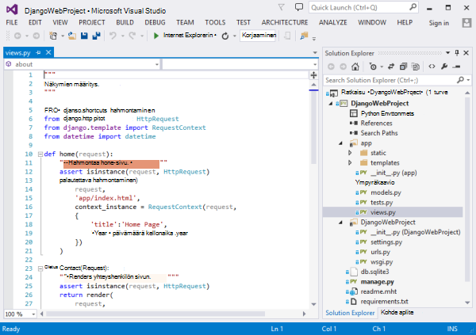
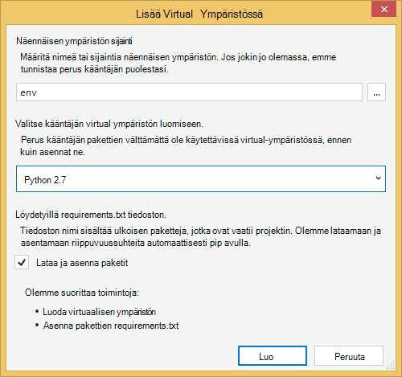
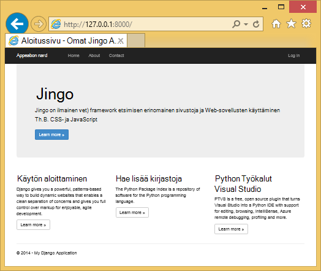
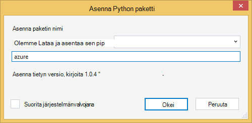
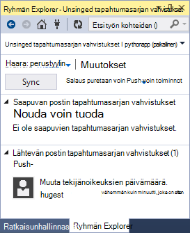
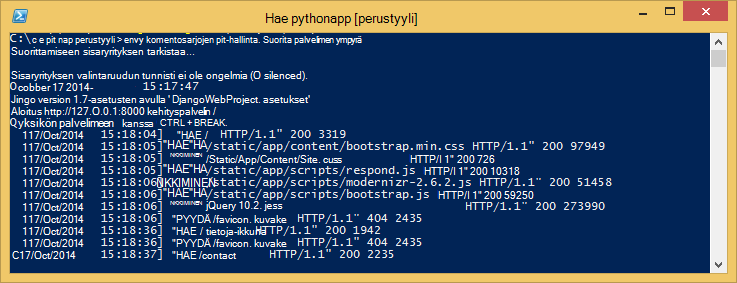
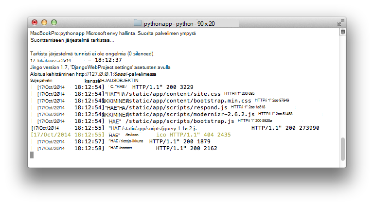
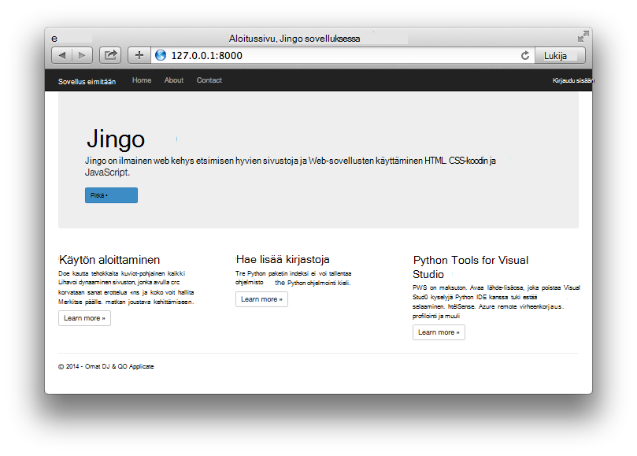

<properties
    pageTitle="Django Azure web Apps-sovellusten luominen"
    description="Opetusohjelma, joissa esitellään käynnissä Python verkkosovellukseen Azure App palvelun verkkosovelluksissa."
    services="app-service\web"
    documentationCenter="python"
    tags="python"
    authors="huguesv" 
    manager="wpickett" 
    editor=""/>

<tags
    ms.service="app-service-web"
    ms.workload="web"
    ms.tgt_pltfrm="na"
    ms.devlang="python"
    ms.topic="hero-article" 
    ms.date="02/19/2016"
    ms.author="huvalo"/>

# Django Azure web Apps-sovellusten luominen

Tässä opetusohjelmassa kerrotaan, miten Aloita Python käytössä [Azure palvelun Web sovellukset](http://go.microsoft.com/fwlink/?LinkId=529714). Web Apps on rajoitettu ilmainen isännöinti ja nopeaa käyttöönottoa ja voit käyttää Python! Kun sovelluksen kasvaa, voit siirtyä maksettu isännöinnin ja voit myös integroida kaikkien Azure muiden kanssa.

Luo Django web framework-sovellus (Katso tämä opetusohjelma vaihtoehtoiset versiot [: N](web-sites-python-create-deploy-flask-app.md) ja [pullot](web-sites-python-create-deploy-bottle-app.md)). Web-sovelluksen luominen Azure Marketplace-Git käyttöönoton asetusten määrittäminen ja Kloonaa säilö paikallisesti. Sitten Suorita sovellus paikallisesti, tehdä muutoksia, Vahvista ja push-Azure. Opetusohjelman esitetään, kuinka voit tehdä tämän Windows-tai Mac tai Linux.

[AZURE.INCLUDE [create-account-and-websites-note](../../includes/create-account-and-websites-note.md)]

>[AZURE.NOTE] Jos haluat aloittaa Azure App palvelun ennen rekisteröimässä Azure-tili, siirry [Yritä App palvelu](http://go.microsoft.com/fwlink/?LinkId=523751), jossa lyhytkestoinen starter verkkosovellukseen heti voit luoda sovelluksen-palvelussa. Ei ole pakollinen; luottokortit ei ole sitoumukset.

## Edellytykset

- Windows, Mac tai Linux
- Python 2.7 tai 3.4
- setuptools, pip-virtualenv (vain Python 2.7)
- Git
- [Python Tools for Visual Studio][] (PTVS) - Huomautus: Tämä on valinnainen

**Huomautus**: TFS julkaiseminen on tällä hetkellä voi käyttää Python projekteissa.

### Windows

Jos sinulla ei vielä ole Python 2.7 tai 3,4 asennettu (32-bittinen), on suositeltavaa [Azure SDK Python 2.7] tai [Azure SDK Python 3.4] käyttäminen WWW-ympäristö asennusohjelma asennuksen. Tämä asentaa 32-bittisen version Python, setuptools, pip, virtualenv, (32-bittinen Python on asennettavat Azure host-tietokoneissa) jne. Voit myös saat Python [python.org].

Git Suosittelemme [Git Windowsin] tai [Windowsin GitHub]. Jos käytät Visual Studiossa, voit käyttää integroitu Git tuki.

On myös suositeltavaa asentaminen [Python Työkalut 2.2 Visual Studio]. Tämä on valinnainen, mutta jos käytössäsi on [Visual Studiossa], mukaan lukien vapaa Visual Studio yhteisön 2013 tai Visual Studio Express 2013 Web-sitten Näin aloitat hyvien Python IDE.

### Mac tai Linux

Pitäisi olla Python ja Git jo asennettu, mutta varmista, että sinulla on Python 2.7 tai 3.4.

## Web-sovelluksen luominen-portaalissa

Sovelluksen luomisessa ensimmäiseksi on [Azure-portaalin](https://portal.azure.com)kautta web-sovelluksen luominen.

1. Kirjaudu Azure-portaaliin ja valitse **Uusi** -painike vasemmassa alakulmassa.
3. Kirjoita hakukenttään "python".
4. Valitse hakutuloksista **Django** (julkaisemat PTVS) ja valitse sitten **Luo**.
5. Määritä uusi Django sovellus, kuten luoda uuden sovelluksen palvelun suunnitelman ja uusi resurssiryhmä sen. Valitse **Luo**.
6. Määritä Git julkaiseminen juuri luomasi web-sovelluksen [Paikallisen Git käyttöönoton Azure sovelluksen-palveluun](app-service-deploy-local-git.md)osoitteessa ohjeita noudattamalla.

## Sovellusten yleiskuvaus

### Git säilöön sisältö

Seuraavassa on perustietoja alkuperäisen Git säilössä, jossa on Kloonaa seuraavan osion löydät tiedostot.

    \app\__init__.py
    \app\forms.py
    \app\models.py
    \app\tests.py
    \app\views.py
    \app\static\content\
    \app\static\fonts\
    \app\static\scripts\
    \app\templates\about.html
    \app\templates\contact.html
    \app\templates\index.html
    \app\templates\layout.html
    \app\templates\login.html
    \app\templates\loginpartial.html
    \DjangoWebProject\__init__.py
    \DjangoWebProject\settings.py
    \DjangoWebProject\urls.py
    \DjangoWebProject\wsgi.py

Sovelluksen tärkeimmät lähteet. Koostuu perustyylin asettelun 3 sivut (indeksi yhteyshenkilön tietoja). Staattiseksi sisällöksi ja komentosarjoja sisältävät automaattinen, jquery, modernizr ja vastata siihen.

    \manage.py

Paikallinen hallinta ja kehittämisen palvelimen tuen. Tämän toiminnon avulla voit suorittaa sovelluksen paikallisesti ja synkronoida tietokanta jne.

    \db.sqlite3

Oletustietokanta. Suorita-sovellukselle tarvittavat taulukot, mutta ei sisällä sellaisten käyttäjien (Synkronoi tietokanta Luo käyttäjä).

    \DjangoWebProject.pyproj
    \DjangoWebProject.sln

Projektin [Python Tools for Visual Studio]tiedostot.

    \ptvs_virtualenv_proxy.py

IIS-välityspalvelimen virtual ympäristöissä ja PTVS remote virheenkorjaus tuki.

    \requirements.txt

Tämän sovelluksen tarvitsemat ulkoiset paketit. Käyttöönoton komentosarja pip Asenna tässä tiedostossa mainittu paketit.

    \web.2.7.config
    \web.3.4.config

IIS: N määritystiedostot. Käyttöönoton komentosarja käyttää tarvittavat web.x.y.config ja kopioida sen web.config.

### Valinnaiset tiedostot - mukauttaminen käyttöönotto

[AZURE.INCLUDE [web-sites-python-django-customizing-deployment](../../includes/web-sites-python-django-customizing-deployment.md)]

### Valinnaiset tiedostot - Python runtime

[AZURE.INCLUDE [web-sites-python-customizing-runtime](../../includes/web-sites-python-customizing-runtime.md)]

### Muita tiedostoja palvelimeen

Joidenkin tiedostojen luotu palvelimeen, mutta ei lisätä git säilöön. Nämä ovat luomia käyttöönoton komentosarja.

    \web.config

IIS-kokoonpanotiedosto. Luotu web.x.y.config jokaisen ympäristöön.

    \env\

Python virtual ympäristössä. Luodaan käyttöönoton aikana, jos yhteensopiva virtual ympäristössä, jossa ei vielä ole web-sovellukseen. Requirements.txt luetellut paketit ovat pip asennettu, mutta pip ohittaa asennus, jos paketit on jo asennettu.

Seuraavat 3 osissa, valitse 3 eri ympäristöissä web app-kehittämiseen toimintatapaa:

- Windowsin Python Tools for Visual Studio
- Komentorivin Windowsiin
- Mac tai Linux-komento viivalla

## Web app-kehitys - Windows - Python Tools for Visual Studio

### Kloonaa säilö

Ensin Kloonaa säilöön käyttämällä annettu Azure-portaalin URL-osoite. Lisätietoja on artikkelissa [Paikallisen Git käyttöönoton Azure-sovelluksen palveluun](app-service-deploy-local-git.md).

Avaa ratkaisutiedosto (.sln), joka sisältyy säilö ylimmällä.

### Luo virtuaalisia ympäristössä

Nyt luoda virtuaalisen ympäristön paikallisen kehittämiseen. Napsauta hiiren kakkospainikkeella **Python ympäristöissä** valitsemalla **Lisää näennäisen ympäristön...**.

- Varmista, että ympäristö on `env`.

- Valitse Perus kääntäjän. Varmista, että käyttää samaa Python, joka on valittuna web-sovelluksen (-runtime.txt tai Azure-portaalissa koodiin **Sovelluksen asetukset** -sivu).

- Varmista, että ladattava ja asennettava pakettien vaihtoehto on valittuna.

Valitse **Luo**. Tämä luo virtual ympäristössä, ja asenna requirements.txt luetellut riippuvuudet.

### Luo pääkäyttäjän

Sovelluksen mukana tietokanta ei ole määritetty mitään pääkäyttäjän. Jotta voit käyttää sovelluksen tai Django järjestelmänvalvojan käyttöliittymä (Jos halua ottaa sen käyttöön)-kirjautuminen-toimintoja, sinun on luoda pääkäyttäjän.

Suorita tämä-komentorivillä projektin kansiosta:

    env\scripts\python manage.py createsuperuser

Määritä käyttäjänimi, salasana jne kehotteiden mukaisesti.

### Suorita development Serveriä käyttämällä

Käynnistä virheenkorjaus painamalla F5-näppäintä ja että selain aukeaa automaattisesti käytössä paikallisesti sivulle.

Voit määrittää keskeytyskohdat käyttää lähteistä, katso Windowsin jne. Katso lisätietoja [Python Tools for Visual Studio dokumentaatio] eri ominaisuuksia.

### Muutosten tekeminen

Nyt voit kokeilla tekemällä muutoksia sovelluksen lähteiden ja/tai malleja.

Kun olet testannut tekemäsi muutokset, Vahvista Git säilö:

### Asenna lisää paketit

Sovellus voi olla riippuvuudet Python ja Django lisäksi.

Voit asentaa muita paketteja käyttämällä pip. Jos haluat asentaa paketin, näennäisen ympäristön hiiren kakkospainikkeella ja valitse **Asenna Python paketti**.

Kirjoita asentaminen Azure SDK Python, jonka kautta pääset käsiksi Azure-tallennustilan, palvelun bus ja Azure muista palveluista, esimerkiksi `azure`:

Virtual ympäristöön hiiren kakkospainikkeella ja valitse **Luo requirements.txt** päivittämään requirements.txt.

Valitse sitten Vahvista muutokset requirements.txt Git säilöön.

### Ottaa käyttöön Azure

Käynnistettävän käyttöönoton valitsemalla **Synkronoi** tai **Push**. Synkronointi ei push ja erotettu.

Ensimmäisen käyttöönoton kestää jonkin aikaa, koska se luo virtuaalisen ympäristön, asenna pakettien jne.

Visual Studio ei näy käyttöönoton etenemisen. Jos haluat tarkastella tulosteen, katso [vianmääritys - käyttöönoton](#troubleshooting-deployment).

Siirry Azure URL-Osoitteen tekemäsi muutokset näkyviin.

## Web-sovellusten kehittämiseen - Windows - komento

### Kloonaa säilö

Ensin Kloonaa säilöön käyttämällä annettu Azure-portaalin URL-osoite ja lisää Azure säilöön etäkohteeseen. Lisätietoja on artikkelissa [Paikallisen Git käyttöönoton Azure-sovelluksen palveluun](app-service-deploy-local-git.md).

    git clone <repo-url>
    cd <repo-folder>
    git remote add azure <repo-url>

### Luo virtuaalisia ympäristössä

Olemme Luo uusi virtuaalisen ympäristön tarkoitettu (Älä lisää se säilö). Virtuaalinen ympäristöissä-Python eivät ole relocatable, joten jokainen parissa sovelluksen kehittäjä Luo omia paikallisesti.

Varmista, että käyttää samaa Python, joka on valittuna web-sovelluksen (-runtime.txt tai Azure-portaalissa koodiin sovelluksen asetukset-sivu).

Saat Python 2.7:

    c:\python27\python.exe -m virtualenv env

Saat Python 3.4:

    c:\python34\python.exe -m venv env

Asenna kaikki sovelluksesi vaatii ulkoisen paketit. Säilön ylimmällä tasolla requirements.txt-tiedoston avulla voit asentaa paketit virtual-ympäristössä:

    env\scripts\pip install -r requirements.txt

### Luo pääkäyttäjän

Sovelluksen mukana tietokanta ei ole määritetty mitään pääkäyttäjän. Jotta voit käyttää sovelluksen tai Django järjestelmänvalvojan käyttöliittymä (Jos halua ottaa sen käyttöön)-kirjautuminen-toimintoja, sinun on luoda pääkäyttäjän.

Suorita tämä-komentorivillä projektin kansiosta:

    env\scripts\python manage.py createsuperuser

Määritä käyttäjänimi, salasana jne kehotteiden mukaisesti.

### Suorita development Serveriä käyttämällä

Voit käynnistää sovellusten kehittämisen-palvelimen seuraavalla komennolla:

    env\scripts\python manage.py runserver

Konsolin näkyy URL-osoite ja palvelimen portti seuraa avulla:

Avaa selain, että URL-osoite.

### Muutosten tekeminen

Nyt voit kokeilla tekemällä muutoksia sovelluksen lähteiden ja/tai malleja.

Kun olet testannut tekemäsi muutokset, Vahvista Git säilö:

    git add <modified-file>
    git commit -m "<commit-comment>"

### Asenna lisää paketit

Sovellus voi olla riippuvuudet Python ja Django lisäksi.

Voit asentaa muita paketteja käyttämällä pip. Jos esimerkiksi asentaminen Azure SDK Python, jonka kautta pääset käsiksi Azure-tallennustilan, palvelun bus ja Azure muista palveluista, kirjoita:

    env\scripts\pip install azure

Varmista, että voit päivittää requirements.txt:

    env\scripts\pip freeze > requirements.txt

Vahvista muutokset:

    git add requirements.txt
    git commit -m "Added azure package"

### Ottaa käyttöön Azure

Käynnistettävän käyttöönoton tuo Azure muutokset:

    git push azure master

Käyttöönoton komentosarja, mukaan lukien näennäisen ympäristön luonti-pakettien asennuksen web.config luominen tulos tulee näkyviin.

Siirry Azure URL-Osoitteen tekemäsi muutokset näkyviin.

## Web-sovellusten kehittämiseen - Mac tai Linux - komento

### Kloonaa säilö

Ensin Kloonaa säilöön käyttämällä annettu Azure-portaalin URL-osoite ja lisää Azure säilöön etäkohteeseen. Lisätietoja on artikkelissa [Paikallisen Git käyttöönoton Azure-sovelluksen palveluun](app-service-deploy-local-git.md).

    git clone <repo-url>
    cd <repo-folder>
    git remote add azure <repo-url>

### Luo virtuaalisia ympäristössä

Olemme Luo uusi virtuaalisen ympäristön tarkoitettu (Älä lisää se säilö). Virtuaalinen ympäristöissä-Python eivät ole relocatable, joten jokainen parissa sovelluksen kehittäjä Luo omia paikallisesti.

Varmista, että käyttää samaa Python, joka on valittuna web-sovelluksen (-runtime.txt tai Azure-portaalissa koodiin sovelluksen asetukset-sivu).

Saat Python 2.7:

    python -m virtualenv env

Saat Python 3.4:

    python -m venv env

tai

    pyvenv env

Asenna kaikki sovelluksesi vaatii ulkoisen paketit. Säilön ylimmällä tasolla requirements.txt-tiedoston avulla voit asentaa paketit virtual-ympäristössä:

    env/bin/pip install -r requirements.txt

### Luo pääkäyttäjän

Sovelluksen mukana tietokanta ei ole määritetty mitään pääkäyttäjän. Jotta voit käyttää sovelluksen tai Django järjestelmänvalvojan käyttöliittymä (Jos halua ottaa sen käyttöön)-kirjautuminen-toimintoja, sinun on luoda pääkäyttäjän.

Suorita tämä-komentorivillä projektin kansiosta:

    env/bin/python manage.py createsuperuser

Määritä käyttäjänimi, salasana jne kehotteiden mukaisesti.

### Suorita development Serveriä käyttämällä

Voit käynnistää sovellusten kehittämisen-palvelimen seuraavalla komennolla:

    env/bin/python manage.py runserver

Konsolin näkyy URL-osoite ja palvelimen portti seuraa avulla:

Avaa selain, että URL-osoite.

### Muutosten tekeminen

Nyt voit kokeilla tekemällä muutoksia sovelluksen lähteiden ja/tai malleja.

Kun olet testannut tekemäsi muutokset, Vahvista Git säilö:

    git add <modified-file>
    git commit -m "<commit-comment>"

### Asenna lisää paketit

Sovellus voi olla riippuvuudet Python ja Django lisäksi.

Voit asentaa muita paketteja käyttämällä pip. Jos esimerkiksi asentaminen Azure SDK Python, jonka kautta pääset käsiksi Azure-tallennustilan, palvelun bus ja Azure muista palveluista, kirjoita:

    env/bin/pip install azure

Varmista, että voit päivittää requirements.txt:

    env/bin/pip freeze > requirements.txt

Vahvista muutokset:

    git add requirements.txt
    git commit -m "Added azure package"

### Ottaa käyttöön Azure

Käynnistettävän käyttöönoton tuo Azure muutokset:

    git push azure master

Käyttöönoton komentosarja, mukaan lukien näennäisen ympäristön luonti-pakettien asennuksen web.config luominen tulos tulee näkyviin.

Siirry Azure URL-Osoitteen tekemäsi muutokset näkyviin.

## -Paketin asennuksen vianmääritys

[AZURE.INCLUDE [web-sites-python-troubleshooting-package-installation](../../includes/web-sites-python-troubleshooting-package-installation.md)]

## Vianmääritys – Virtual ympäristössä

[AZURE.INCLUDE [web-sites-python-troubleshooting-virtual-environment](../../includes/web-sites-python-troubleshooting-virtual-environment.md)]

## Vianmääritys – staattinen tiedostot

Django on staattinen tiedostoja kerätään käsite. Tämä tuo kaikki staattisen tiedostoja niiden alkuperäisestä sijainnista, ja kopioi ne yksittäiseen kansioon. Tämän sovelluksen ne on kopioitu `/static`.

Tämä on valmis, koska staattisia tiedostoja voi tulla eri Django "sovellukset". Esimerkiksi Django järjestelmänvalvojan liittymät staattinen tiedostot sijaitsevat Django kirjaston alikansion virtual-ympäristössä. Tämän sovelluksen määrittämiä staattinen tiedostot sijaitsevat `/app/static`. Kun käytät Lisää Django "sovellukset", on staattinen paikassa useita tiedostoja.

Kun sovellus virheenkorjaus tilassa, sovellus toimii staattisia tiedostoja niiden alkuperäisestä sijainnista.

Kun käynnissä sovelluksen release-tilassa-sovellus toimii **ei** yhteyshenkilönä staattiset tiedostot. Verkkopalvelin tukemaan tiedostot vastuu on. Tämän sovelluksen IIS yhteyshenkilönä staattinen tiedostojen `/static`.

Staattinen tiedostojen kokoelma tapahtuu automaattisesti osa käyttöönoton komentosarja-valinnan aiemmin kerääminen-tiedostoina. Tämä tarkoittaa kokoelman ilmenee jokaisen ympäristöön hidastaa käyttöönoton hieman, mutta se varmistaa, että vanhentuneet tiedostot eivät ole käytettävissä, välttäminen mahdollisen tietoturvaongelman.

Jos haluat ohittaa sivustokokoelman staattiset tiedostot Django sovelluksen:

    \.skipDjango

Valitse sinun on suoritettava manuaalisesti Paikallinen kone-kokoelmaan:

    env\scripts\python manage.py collectstatic

Valitse Poista `\static` kansion `.gitignore` ja lisää se Git säilöön.

## Vianmääritys – asetukset

Sovelluksen erilaisia asetuksia voi muuttaa `DjangoWebProject/settings.py`.

Kehittäjän asiasta Virheenkorjaustila on käytössä. Yksi hyvä puoli vaikutus, joka on on käytössä paikallisesti, eikä sinun tarvitse kerätä staattiset tiedostot näe kuvia ja muita staattiseksi sisällöksi.

Jos haluat virheenkorjaustilan poistaminen käytöstä:

    DEBUG = False

Kun virheenkorjaus on poistettu käytöstä, arvo `ALLOWED_HOSTS` on päivitettävä sisältämään Azure isäntänimi. Esimerkki:

    ALLOWED_HOSTS = (
        'pythonapp.azurewebsites.net',
    )

tai ottaa käyttöön:

    ALLOWED_HOSTS = (
        '*',
    )

Harjoitus haluat ehkä tehtävä joitakin monimutkaisia käsitellä virheenkorjaus siirtyminen ja vapauttaa tilaa, etkä saa isäntänimi.

Voit määrittää **sovelluksen asetukset** -kohdassa ympäristömuuttujat palvelun Azure-portaalissa **määrittäminen** -sivulla.  Tämä on hyvä määrittämisestä arvot, jotka haluat ehkä ei näy lähteitä (yhteysmerkkijonoja, salasanojen jne.) tai, jonka haluat määrittää eri tavalla Azure ja paikallisessa tietokoneessa välillä. Valitse `settings.py`, voit tehdä kyselyn avulla ympäristömuuttujat `os.getenv`.

## Tietokannan käyttäminen

Tietokantoja, jotka ovat mukana sovellus on sqlite tietokanta. Käytettävä kehityksen ja hyödyllistä oletusarvon tietokanta on se vaatii lähes ei ole asetuksia. Tietokanta on tallennettu project-kansiossa db.sqlite3-tiedostoon.

Azure sisältää tietokannan palvelut, joita on helppo käyttää Django-sovelluksesta. Opetusohjelmat käyttämällä [SQL-tietokantaan] ja [MySQL] Django sovelluksesta Näytä vaiheita tarvitse luoda tietokantapalvelu, tietokannan asetusten muuttaminen `DjangoWebProject/settings.py`, ja kirjastoja asentamiseen tarvitaan.

Jos haluat hallita omia tietokantapalvelimia, voit tehdä sen käyttämällä Azure-Windows- tai Linux näennäiskoneiden.

## Django järjestelmänvalvojan käyttöliittymä

Kun olet aloittanut rakentaminen mallit, haluat täyttää tietokannan tietoja. Helppo tapa lisätä ja muokata sisältöä vuorovaikutteisesti on käytettävä Django hallintaliittymä.

Järjestelmänvalvoja-liittymän koodi on Kommentoitu ulos sovelluksen lähteet, mutta se on merkitty selkeästi niin se (Etsi "Järjestelmänvalvoja") ottaminen käyttöön.

Sen jälkeen, kun se on käytössä, synkronoi tietokanta, Käynnistä sovellus ja siirry `/admin`.

## Seuraavat vaiheet

Saat lisätietoja Django ja Python Tools for Visual Studio seuraavista linkeistä:

- [Django dokumentaatio]
- [Python Tools for Visual Studio dokumentaatio]

Lisätietoja SQL-tietokantaan ja MySQL avulla:

- [Django ja MySQL-Azure Python Tools for Visual Studio kanssa]
- [Django ja Visual Studio työkaluilla Python Azure SQL-tietokantaan]

Lisätietoja on artikkelissa [Python Developer Center](/develop/python/).

## Mikä on muuttunut
* Katso muutoksen opas verkkosivuilta App palveluun: [Azure App palvelu ja sen vaikutus aiemmin Azure-palvelut](http://go.microsoft.com/fwlink/?LinkId=529714)

<!--Link references-->
[Django ja MySQL-Azure Python Tools for Visual Studio kanssa]: web-sites-python-ptvs-django-mysql.md
[Django ja Visual Studio työkaluilla Python Azure SQL-tietokantaan]: web-sites-python-ptvs-django-sql.md
[SQL-tietokantaan]: web-sites-python-ptvs-django-sql.md
[MySQL]: web-sites-python-ptvs-django-mysql.md

<!--External Link references-->
[Azure SDK Python 2.7]: http://go.microsoft.com/fwlink/?linkid=254281
[Azure SDK Python 3.4]: http://go.microsoft.com/fwlink/?linkid=516990
[Python.org]: http://www.python.org/
[Git for Windowsissa]: http://msysgit.github.io/
[GitHub for Windowsissa]: https://windows.github.com/
[Python Tools for Visual Studio]: http://aka.ms/ptvs
[Python Tools for Visual Studio 2.2]: http://go.microsoft.com/fwlink/?LinkID=624025
[Visual Studio]: http://www.visualstudio.com/
[Python Tools for Visual Studio dokumentaatio]: http://aka.ms/ptvsdocs
[Django dokumentaatio]: https://www.djangoproject.com/
