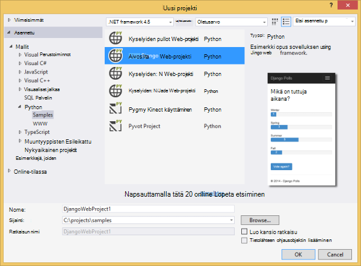
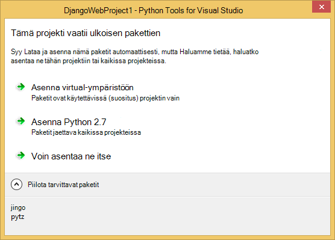
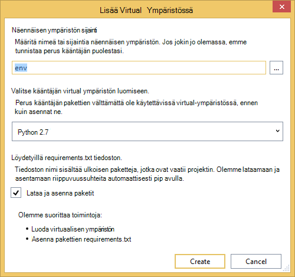
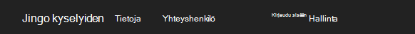
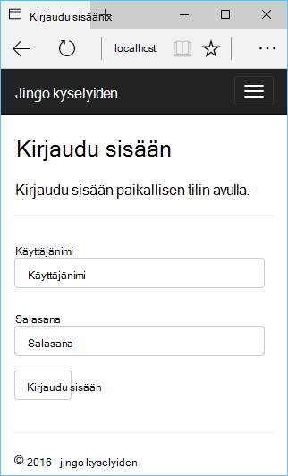
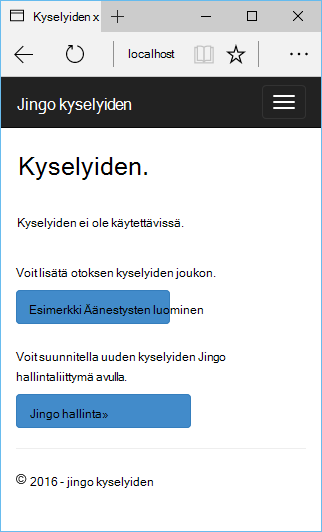
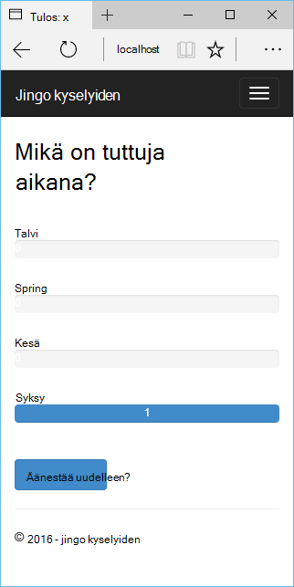
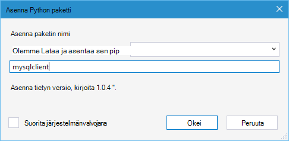
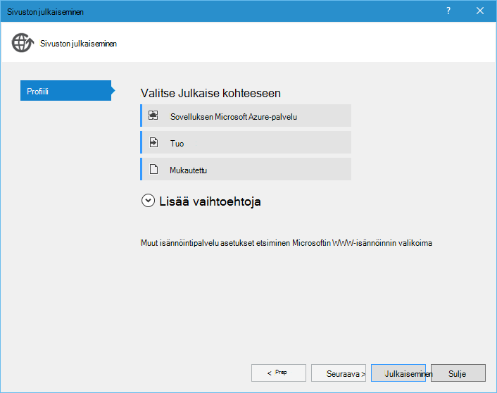
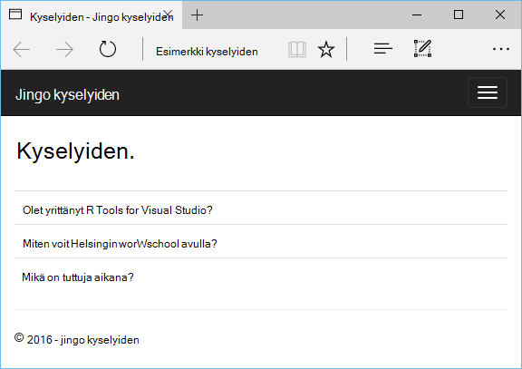

<properties 
    pageTitle="Django ja MySQL-Azure Python työkaluja 2.2 Visual Studio" 
    description="Opettele käyttämään Python Tools for Visual Studio Django web-sovelluksen, joka tallentaa tiedot MySQL-tietokantaan esiintymän luominen ja Azure App palvelun Web Apps-sovellusten käyttöön." 
    services="app-service\web" 
    documentationCenter="python" 
    authors="huguesv" 
    manager="wpickett" 
    editor=""/>

<tags 
    ms.service="app-service-web" 
    ms.workload="web" 
    ms.tgt_pltfrm="na" 
    ms.devlang="python"
    ms.topic="get-started-article" 
    ms.date="07/07/2016"
    ms.author="huvalo"/>

# Django ja MySQL-Azure Python työkaluja 2.2 Visual Studio 

[AZURE.INCLUDE [tabs](../../includes/app-service-web-get-started-nav-tabs.md)]

Tässä opetusohjelmassa käytät [Python Tools for Visual Studio] (PTVS) voit luoda yksinkertaisen kyselyiden verkkosovellukseen jollakin PTVS esimerkkimallit. Opit käyttämisestä isännöimät Azure MySQL-palvelun määrittäminen käyttämään MySQL web-sovelluksen ja julkaiseminen web-sovelluksen [Azure palvelun Web sovellukset](http://go.microsoft.com/fwlink/?LinkId=529714).

> [AZURE.NOTE] Tässä opetusohjelmassa tietoja on myös käytettävissä seuraavassa videossa:
> 
> [PTVS 2.1: Django-sovelluksessa, jossa MySQL][video]

Katso [Python Developer Center] lisää artikkeleita, jotka kattavat kehittäminen Azure App palvelun Web Apps PTVS pullot,: N ja Django web-kehysten käytön Azure-taulukkotallennus, MySQL ja SQL-tietokantaan. Tässä artikkelissa keskitytään App palvelun-aikana vaiheet ovat samalla, kun kehittäminen [Azure pilvipalveluihin].

## Edellytykset

 - Visual Studio 2015
 - [Python 2.7 32-bittinen] tai [Python 3.4 32-bittinen]
 - [Python Tools for Visual Studio 2.2]
 - [Python Tools for Visual Studio näytteiden VSIX 2.2]
 - [Azure SDK työkaluja ja 2015]
 - Django 1.9 tai uudempi versio

[AZURE.INCLUDE [create-account-and-websites-note](../../includes/create-account-and-websites-note.md)]

<!-- This note should not render as part of the the previous include. -->

> [AZURE.NOTE] Jos haluat aloittaa Azure App palvelun ennen rekisteröimässä Azure-tili, siirry [Yritä App palvelu](http://go.microsoft.com/fwlink/?LinkId=523751), jossa lyhytkestoinen starter verkkosovellukseen heti voit luoda sovelluksen-palvelussa. Ilman luottokortti tarvitaan ja ei ole sitoumukset ei tarvita.

## Projektin luominen

Tässä osassa Luo Visual Studio projektin otoksen mallin avulla. Luoda virtuaalisen ympäristön ja asenna tarvittavat paketit. Luo paikallinen tietokanta käyttämällä sqlite. Valitse suoritat sovelluksen paikallisesti.

1. Visual Studiossa Valitse **Tiedosto**, **Uusi projekti**.

1. Project-mallit- [Python Työkalut 2.2 for Visual Studio näytteiden VSIX] ovat valittavissa kohdasta **Python**, **Mallit**. **Kyselyiden Django Web-projekti** ja valitse OK ja luo sitten projekti.

    

1. Voit pyydetään ulkoisen pakettien asentamisen. Valitse **Asenna virtual-ympäristöön**.

    

1. Valitse Perus kääntäjän **Python 2.7** tai **Python 3.4** .

    

1. **Ratkaisunhallinnassa**projektin solmun hiiren kakkospainikkeella ja valitse **Python**ja valitse sitten **Django siirtää**.  Valitse **Django luominen pääkäyttäjän**.

1. Tämä avaa Django hallintakonsoli ja sqlite tietokannan luominen project-kansiossa. Käyttäjän luominen kehotteiden mukaisesti.

1. Varmista, että sovellus toimii painamalla `F5`.

1. Valitse siirtymispalkin yläreunassa **Kirjaudu sisään** .

    

1. Kirjoita luomasi tietokannan synkronointia käyttäjän tunnistetiedot.

    

1. Valitse **malli Äänestysten luominen**.

    

1. Napsauta kyselyn ja äänestä.

    

## Luo MySQL-tietokantaan

Tietokannan Luo isännöityä ClearDB MySQL-tietokantaan Azure.

Vaihtoehtoisesti voit luoda oman virtuaalikoneen Azure-tietokannassa, jossa sitten asentaa ja hallinta MySQL.

Voit luoda tietokantaan ja vapaa-palvelupaketti toimimalla seuraavasti.

1. Kirjaudu sisään [Azure Portal].

1. Siirtymisruudun yläreunassa **Uusi**ja valitse sitten **tietojen + tallennustilan**ja valitse sitten **MySQL-tietokantaan**. 

1. Määritä uusi MySQL-tietokantaan luomalla uusi resurssiryhmä ja valitse sitä vastaava sijainti.

1. Kun MySQL-tietokanta on luotu, valitse **Ominaisuudet** -tietokanta-sivu.

1. Vie **YHTEYSMERKKIJONON** arvo Leikepöydälle käyttämällä Kopioi-painike.

## Projektin määrittäminen

Tässä osassa määrität Microsoftin online juuri luomasi MySQL-tietokantaan. Lisää Python-paketteja, jotka tarvitaan MySQL-tietokantojen käyttäminen Django asentaa myös. Valitse suoritat web-sovelluksen paikallisesti.

1. Avaa Visual Studion **settings.py** *projektin nimi* -kansiosta. Liitä tilapäisesti yhteysmerkkijono-editorissa. Yhteysmerkkijono on tässä muodossa:

        Database=<NAME>;Data Source=<HOST>;User Id=<USER>;Password=<PASSWORD>

    Muuttaa oletusarvon tietokannan **ohjelma** käyttää MySQL ja määrittää arvot **nimi**, **käyttäjän**, **salasana** ja **HOST** **CONNECTIONSTRING**.

        DATABASES = {
            'default': {
                'ENGINE': 'django.db.backends.mysql',
                'NAME': '<Database>',
                'USER': '<User Id>',
                'PASSWORD': '<Password>',
                'HOST': '<Data Source>',
                'PORT': '',
            }
        }

1. Napsauta ratkaisunhallinnassa **Python ympäristöissä**kohdan virtual ympäristöön kakkospainikkeella ja valitse **Asenna Python paketti**.

1. Asenna paketti `mysqlclient` **pip**avulla.

    

1. **Ratkaisunhallinnassa**projektin solmun hiiren kakkospainikkeella ja valitse **Python**ja valitse sitten **Django siirtää**.  Valitse **Django luominen pääkäyttäjän**.

    Tämä luo taulukoiden MySQL-tietokantaan, jonka loit edellisessä osassa. Luo käyttäjä, joka ei ole luotu ensimmäinen osa on tämän artikkelin sqlite tietokanta käyttäjän vastaamaan kehotteiden mukaisesti.

1. Suorita sovellus kanssa `F5`. Kyselyjä, jotka on luotu **Luominen otoksen kyselyiden** ja äänestäminen lähettämät tiedot voi muuntaa sarjaksi MySQL-tietokantaan.

## Web-sovelluksen julkaiseminen App Azure-palvelu

Azure .NET SDK on helppo tapa web-sovelluksen käyttöönotto Azure-sovelluksen palveluun.

1. **Ratkaisunhallinnassa**Napsauta project-solmu ja valitse **Julkaise**.

    

1. Valitse **sovelluksen Microsoft Azure**-palvelusta.

1. Valitse **Uusi** ja luo uusi verkkosovellukseen.

1. Täytä seuraavat kentät ja valitse **Luo**:
    - **Web-sovelluksen nimi**
    - **Sovelluksen palvelusopimus**
    - **Resurssiryhmä**
    - **Alue**
    - Jätä **-Tietokantapalvelin, johon** **ei ole tietokannan** asettaminen

1. Hyväksy kaikki oletusarvot ja valitse **Julkaise**.

1. Selaimen avautuu automaattisesti julkaistun web App-sovellukseen. Raportissa pitäisi näkyä web Appissa, toimi odotetusti, käyttämisestä isännöimät Azure **MySQL** -tietokantaan.

    

    Onnittelen! On julkaistu MySQL-pohjainen web-sovelluksen avulla Azure.

## Seuraavat vaiheet

Näistä linkeistä saat lisätietoja Python Tools for Visual Studio, Django ja MySQL.

- [Python Tools for Visual Studio dokumentaatio]
  - [Web-projektit]
  - [Cloud palvelun projektit]
  - [Microsoft Azure Remote virheenkorjaus]
- [Django dokumentaatio]
- [MySQL]

Lisätietoja on artikkelissa [Python Developer Center](/develop/python/).

<!--Link references-->

[Python Developer Center]: /develop/python/
[Azure pilvipalveluihin]: ../cloud-services-python-ptvs.md

<!--External Link references-->

[Azure Portal]: https://portal.azure.com
[Python Tools for Visual Studio]: http://aka.ms/ptvs
[Python Tools for Visual Studio 2.2]: http://go.microsoft.com/fwlink/?LinkID=624025
[Python Tools for Visual Studio näytteiden VSIX 2.2]: http://go.microsoft.com/fwlink/?LinkID=624025
[Azure SDK työkaluja ja 2015]: http://go.microsoft.com/fwlink/?LinkId=518003
[Python 2.7 32-bittinen]: http://go.microsoft.com/fwlink/?LinkId=517190 
[Python 3.4 32-bittinen]: http://go.microsoft.com/fwlink/?LinkId=517191
[Python Tools for Visual Studio dokumentaatio]: http://aka.ms/ptvsdocs
[Microsoft Azure Remote virheenkorjaus]: http://go.microsoft.com/fwlink/?LinkId=624026
[Web-projektit]: http://go.microsoft.com/fwlink/?LinkId=624027
[Cloud palvelun projektit]: http://go.microsoft.com/fwlink/?LinkId=624028
[Django dokumentaatio]: https://www.djangoproject.com/
[MySQL]: http://www.mysql.com/
[video]: http://youtu.be/oKCApIrS0Lo
