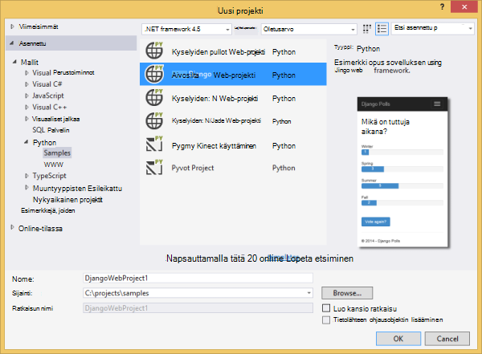
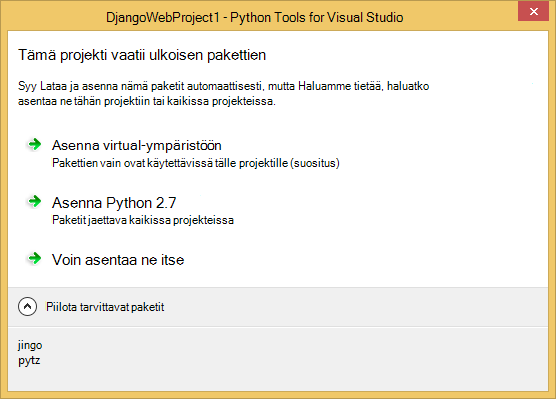
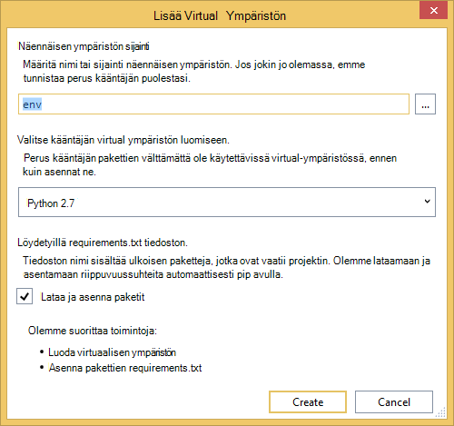
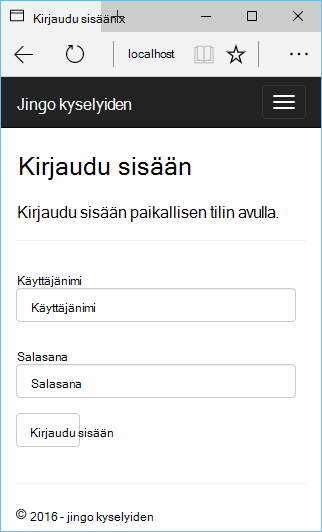
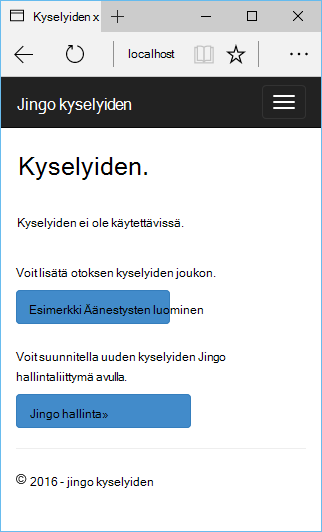
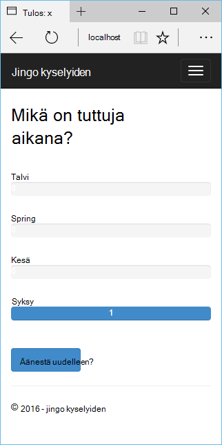
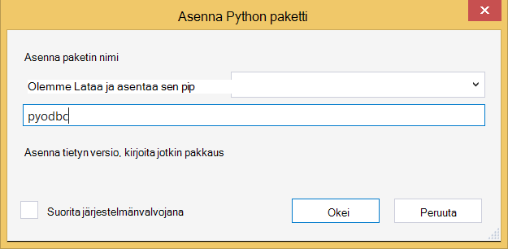
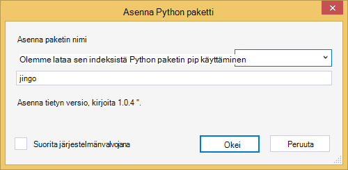
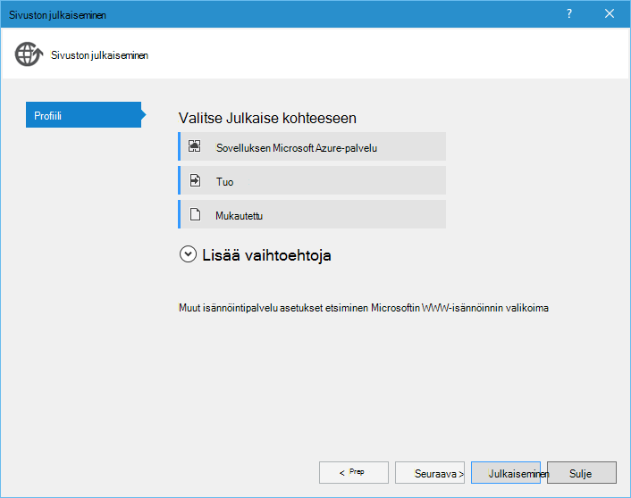
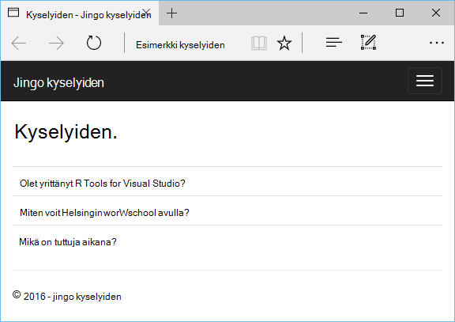

<properties 
    pageTitle="Django ja Visual Studio työkaluja Python 2.2 Azure SQL-tietokantaan" 
    description="Opettele käyttämään Python Tools for Visual Studio Django web-sovelluksen, joka tallentaa tiedot SQL-tietokanta-esiintymän luominen ja Azure App palvelun Web Apps-sovellusten käyttöön." 
    services="app-service\web" 
    tags="python"
    documentationCenter="python" 
    authors="huguesv" 
    manager="wpickett" 
    editor=""/>

<tags 
    ms.service="app-service-web" 
    ms.workload="web" 
    ms.tgt_pltfrm="na" 
    ms.devlang="python" 
    ms.topic="article" 
    ms.date="07/07/2016"
    ms.author="huguesv"/>

# Django ja Visual Studio työkaluja Python 2.2 Azure SQL-tietokantaan 

Tässä opetusohjelmassa on käytetään [Python Tools for Visual Studio] luoda yksinkertaisen kyselyiden verkkosovellukseen jollakin PTVS esimerkkimallit. Tässä opetusohjelmassa on myös käytettävissä [video](https://www.youtube.com/watch?v=ZwcoGcIeHF4).

Olemme saat tietoja siitä, käyttämisestä isännöimät Azure SQL-tietokantaan, SQL-tietokantaan web-sovelluksen määrittäminen ja julkaiseminen web-sovelluksen [Azure palvelun Web sovellukset](http://go.microsoft.com/fwlink/?LinkId=529714).

Katso [Python Developer Center] lisää artikkeleita, jotka kattavat kehittäminen Azure App palvelun Web Apps PTVS pullot,: N ja Django web-kehysten käytön Azure-taulukkotallennus, MySQL-ja SQL-tietokantaan. Tässä artikkelissa keskitytään App palvelun-aikana vaiheet ovat samalla, kun kehittäminen [Azure pilvipalveluihin].

## Edellytykset

 - Visual Studio 2015
 - [Python 2.7 32-bittinen]
 - [Python Tools for Visual Studio 2.2]
 - [Python Tools for Visual Studio näytteiden VSIX 2.2]
 - [Azure SDK työkaluja ja 2015]
 - Django 1.9 tai uudempi versio

[AZURE.INCLUDE [create-account-and-websites-note](../../includes/create-account-and-websites-note.md)]

>[AZURE.NOTE] Jos haluat aloittaa Azure App palvelun ennen rekisteröimässä Azure-tili, siirry [Yritä App palvelu](http://go.microsoft.com/fwlink/?LinkId=523751), jossa lyhytkestoinen starter verkkosovellukseen heti voit luoda sovelluksen-palvelussa. Ei ole pakollinen; luottokortit ei ole sitoumukset.

## Projektin luominen

Tässä osassa Luo Visual Studio projektin otoksen mallin avulla. Olemme luoda virtuaalisen ympäristön ja asenna tarvittavat paketit. Olemme Luo paikallinen tietokanta käyttämällä sqlite. Valitse Microsoft tällöin suoritetaan web-sovelluksen paikallisesti.

1.  Visual Studiossa Valitse **Tiedosto**, **Uusi projekti**.

1.  Project-mallit- [Python Työkalut 2.2 for Visual Studio näytteiden VSIX] ovat valittavissa kohdasta **Python**, **Mallit**. **Kyselyiden Django Web-projekti** ja valitse OK ja luo sitten projekti.

    

1.  Voit pyydetään ulkoisen pakettien asentamisen. Valitse **Asenna virtual-ympäristöön**.

    

1.  Valitse Perus kääntäjän **Python 2.7** .

    

1.  **Ratkaisunhallinnassa**projektin solmun hiiren kakkospainikkeella ja valitse **Python**ja valitse sitten **Django siirtää**.  Valitse **Django luominen pääkäyttäjän**.

1.  Tämä avaa Django hallintakonsoli ja sqlite tietokannan luominen project-kansiossa. Käyttäjän luominen kehotteiden mukaisesti.

1.  Varmista, että sovellus toimii painamalla <kbd>F5-näppäintä</kbd>.

1.  Valitse siirtymispalkin yläreunassa **Kirjaudu sisään** .

    

1.  Kirjoita luomasi tietokannan synkronointia käyttäjän tunnistetiedot.

    

1.  Valitse **malli Äänestysten luominen**.

    

1.  Napsauta kyselyn ja äänestä.

    

## SQL-tietokannan luominen

Tietokannan emme Luo Azure SQL-tietokantaan.

Voit luoda tietokantaan toimimalla seuraavien ohjeiden mukaisesti.

1.  Lokitiedoston [Azure Portal].

1.  Siirtymisruudun alareunassa valitsemalla **Uusi**. , valitse **tietoja + tallennustilan** > **SQL-tietokantaan**.

1.  Määritä uusi SQL-tietokannan luomalla uusi resurssiryhmä ja valitse sitä vastaava sijainti.

1.  Kun SQL-tietokanta on luotu, napsauta **Avaa Visual Studiossa** tietokanta-sivu.
2.  Valitse **Määritä palomuurin**.
3.  Lisää **Palomuuriasetukset** -sivu palomuurisääntö voidaan **ALOITTAA IP** - ja **END IP** asettaminen tietokoneen kehittäminen julkinen IP-osoite. Valitse **Tallenna**.

    Tämä sallii yhteydet tietokantapalvelimeen kehittäminen tietokoneesta.

4.  Edellinen-tietokanta-sivu valitsemalla **Ominaisuudet**ja valitse sitten **Näytä tietokannan yhteysmerkkijonoja**. 

2.  Vie **ADO.NET** arvo Leikepöydälle käyttämällä Kopioi-painike.

## Projektin määrittäminen

Tässä osassa on määritettävä Microsoftin online juuri luomaasi SQL-tietokantaan. Lisää Python-paketteja, jotka tarvitaan SQL-tietokantoja käytettäväksi Django myös asentaa. Valitse Microsoft tällöin suoritetaan web-sovelluksen paikallisesti.

1.  Avaa Visual Studion **settings.py** *projektin nimi* -kansiosta. Liitä tilapäisesti yhteysmerkkijono-editorissa. Yhteysmerkkijono on tässä muodossa:

        Server=<ServerName>,<ServerPort>;Database=<DatabaseName>;User ID=<UserName>;Password={your_password_here};Encrypt=True;TrustServerCertificate=False;Connection Timeout=30;

Muokkaa määritelmän `DATABASES` käyttämään arvojen perusteella.

        DATABASES = {
            'default': {
                'ENGINE': 'sql_server.pyodbc',
                'NAME': '<DatabaseName>',
                'USER': '<UserName>',
                'PASSWORD': '{your_password_here}',
                'HOST': '<ServerName>',
                'PORT': '<ServerPort>',
                'OPTIONS': {
                    'driver': 'SQL Server Native Client 11.0',
                    'MARS_Connection': 'True',
                }
            }
        }

1.  Napsauta ratkaisunhallinnassa **Python ympäristöissä**kohdan virtual ympäristöön kakkospainikkeella ja valitse **Asenna Python paketti**.

1.  Asenna paketti `pyodbc` **pip**avulla.

    

1.  Asenna paketti `django-pyodbc-azure` **pip**avulla.

    

1.  **Ratkaisunhallinnassa**projektin solmun hiiren kakkospainikkeella ja valitse **Python**ja valitse sitten **Django siirtää**.  Valitse **Django luominen pääkäyttäjän**.

    Tämä luo taulukoiden SQL-tietokanta on luotu edellisessä osassa. Luo käyttäjä, joka ei ole käyttäjän sqlite tietokannan luonut ensimmäisen osan vastaamaan kehotteiden mukaisesti.

1.  Suorita sovellus kanssa `F5`. Kyselyjä, jotka on luotu **Luominen otoksen kyselyiden** ja äänestäminen lähettämät tiedot voi muuntaa sarjaksi SQL-tietokantaan.

## Web-sovelluksen julkaiseminen App Azure-palvelu

Azure .NET SDK on helposti web-web-sovelluksen käyttöön Azure palvelun Web sovellukset.

1.  **Ratkaisunhallinnassa**Napsauta project-solmu ja valitse **Julkaise**.

    

1.  Napsauta **Microsoft Azure-verkkosovelluksissa**.

1.  Valitse **Uusi** ja luo uusi verkkosovellukseen.

1.  Täytä seuraavat kentät ja valitse **Luo**.
    -   **Web-sovelluksen nimi**
    -   **Sovelluksen palvelusopimus**
    -   **Resurssiryhmä**
    -   **Alue**
    -   Jätä **-Tietokantapalvelin, johon** **ei ole tietokannan** asettaminen

1.  Hyväksy kaikki oletusarvot ja valitse **Julkaise**.

1.  Selaimen avautuu automaattisesti julkaistun web App-sovellukseen. Pitäisi näkyä toimi oletetulla-web-sovelluksen käyttämisestä isännöimät Azure **SQL** -tietokantaan.

    Onnittelen!

    

## Seuraavat vaiheet

Näistä linkeistä saat lisätietoja Python Tools for Visual Studio, Django ja SQL-tietokantaan.

- [Python Tools for Visual Studio dokumentaatio]
  - [Web-projektit]
  - [Cloud palvelun projektit]
  - [Microsoft Azure Remote virheenkorjaus]
- [Django dokumentaatio]
- [SQL-tietokantaan]

## Mikä on muuttunut
* Katso muutoksen opas verkkosivuilta App palveluun: [Azure App palvelu ja sen vaikutus aiemmin Azure-palvelut](http://go.microsoft.com/fwlink/?LinkId=529714)

<!--Link references-->
[Python Developer Center]: /develop/python/
[Azure pilvipalveluihin]: ../cloud-services-python-ptvs.md

<!--External Link references-->
[Azure Portal]: https://portal.azure.com
[Python Tools for Visual Studio]: http://aka.ms/ptvs
[Python Tools for Visual Studio 2.2]: http://go.microsoft.com/fwlink/?LinkID=624025
[Python Tools for Visual Studio näytteiden VSIX 2.2]: http://go.microsoft.com/fwlink/?LinkID=624025
[Azure SDK työkaluja ja 2015]: http://go.microsoft.com/fwlink/?LinkId=518003
[Python 2.7 32-bittinen]: http://go.microsoft.com/fwlink/?LinkId=517190 
[Python Tools for Visual Studio dokumentaatio]: http://aka.ms/ptvsdocs
[Microsoft Azure Remote virheenkorjaus]: http://go.microsoft.com/fwlink/?LinkId=624026
[Web-projektit]: http://go.microsoft.com/fwlink/?LinkId=624027
[Cloud palvelun projektit]: http://go.microsoft.com/fwlink/?LinkId=624028
[Django dokumentaatio]: https://www.djangoproject.com/
[SQL-tietokantaan]: /documentation/services/sql-database/
