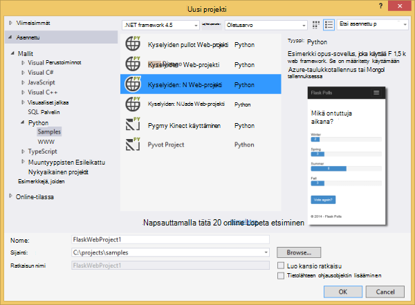
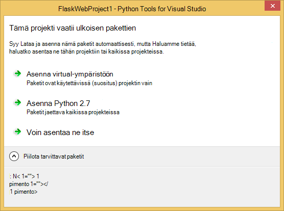
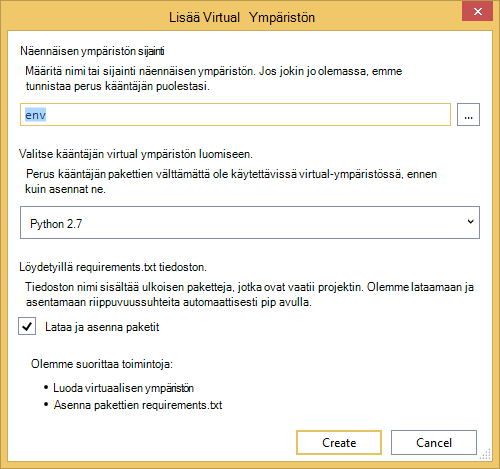
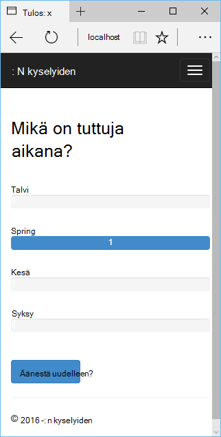
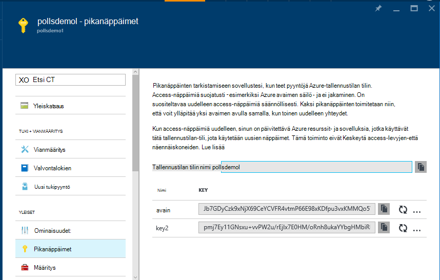
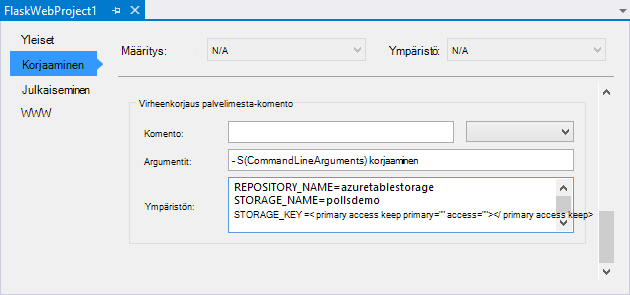
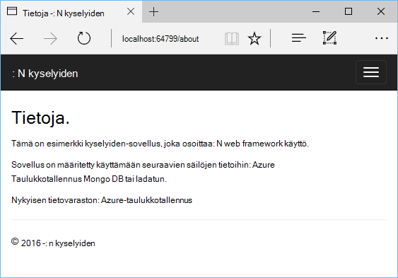
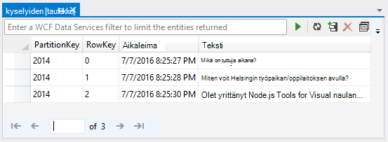
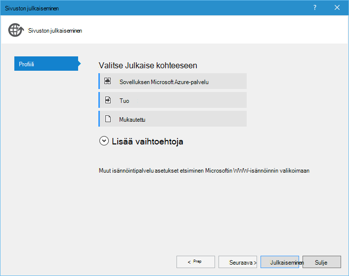
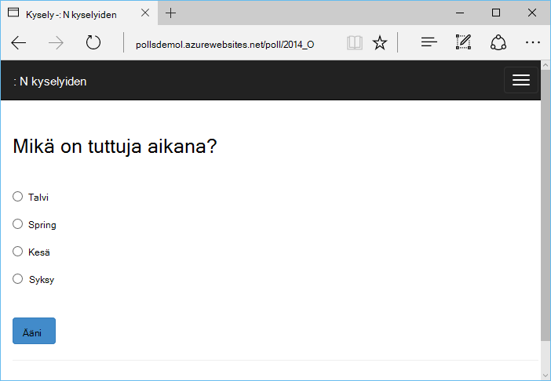

<properties 
    pageTitle=": N ja Visual Studio työkaluja Python 2.2 Azure-Azure-taulukkotallennus" 
    description="Opettele käyttämään Python Tools for Visual Studio, joka tallentaa tiedot Azure-taulukkotallennus: N web-sovelluksen luominen ja Azure App palvelun Web Apps-sovellusten käyttöön." 
    services="app-service\web"
    tags="python"
    documentationCenter="python" 
    authors="huguesv" 
    manager="wpickett" 
    editor=""/>

<tags 
    ms.service="app-service-web" 
    ms.workload="web" 
    ms.tgt_pltfrm="na" 
    ms.devlang="python" 
    ms.topic="article" 
    ms.date="07/07/2016"
    ms.author="huvalo"/>

# : N ja Visual Studio työkaluja Python 2.2 Azure-Azure-taulukkotallennus 

Tässä opetusohjelmassa on käytetään [Python Tools for Visual Studio] luoda yksinkertaisen kyselyiden verkkosovellukseen jollakin PTVS esimerkkimallit. Tässä opetusohjelmassa on myös käytettävissä [video](https://www.youtube.com/watch?v=qUtZWtPwbTk).

Kyselyiden web Appissa määrittää sen säilöön, otetaan, jotta voit helposti siirtyä erityyppisiä säilöjen tietoihin (ladatun, Azure-taulukkotallennus MongoDB).

Olemme Opettele Azure-tallennustilan tilin luominen, käyttämään Azure-taulukkotallennus web App-sovelluksen määrittäminen ja web-sovelluksen julkaiseminen [Azure palvelun Web sovellukset](http://go.microsoft.com/fwlink/?LinkId=529714).

Katso [Python Developer Center] lisää artikkeleita, jotka kattavat kehittäminen Azure App palvelun Web Apps PTVS pullot,: N ja Django web-kehysten käytön MongoDB, Azure-taulukkotallennus, MySQL-ja SQL-tietokantaan. Tässä artikkelissa keskitytään App palvelun-aikana vaiheet ovat samalla, kun kehittäminen [Azure pilvipalveluihin].

## Edellytykset

 - Visual Studio 2015
 - [Python Tools for Visual Studio 2.2]
 - [Python Tools for Visual Studio näytteiden VSIX 2.2]
 - [Azure SDK työkaluja ja 2015]
 - [Python 2.7 32-bittinen] tai [Python 3.4 32-bittinen]

[AZURE.INCLUDE [create-account-and-websites-note](../../includes/create-account-and-websites-note.md)]

>[AZURE.NOTE] Jos haluat aloittaa Azure App palvelun ennen rekisteröimässä Azure-tili, siirry [Yritä App palvelu](http://go.microsoft.com/fwlink/?LinkId=523751), jossa lyhytkestoinen starter verkkosovellukseen heti voit luoda sovelluksen-palvelussa. Ei ole pakollinen; luottokortit ei ole sitoumukset.

## Projektin luominen

Tässä osassa Luo Visual Studio projektin otoksen mallin avulla. Olemme luoda virtuaalisen ympäristön ja asenna tarvittavat paketit. Olemme Suorita sitten sovellus, joka käyttää oletusarvon ladatun säilöön paikallisesti.

1.  Visual Studiossa Valitse **Tiedosto**, **Uusi projekti**.

1.  Project-mallit- [Python Työkalut 2.2 for Visual Studio näytteiden VSIX] ovat valittavissa kohdasta **Python**, **Mallit**. **Kyselyiden: N Web-projekti** ja valitse OK ja luo sitten projekti.

    

1.  Voit pyydetään ulkoisen pakettien asentamisen. Valitse **Asenna virtual-ympäristöön**.

    

1.  Valitse Perus kääntäjän **Python 2.7** tai **Python 3.4** .

    

1.  Varmista, että sovellus toimii painamalla `F5`. Oletusarvon mukaan sovellus käyttää ladatun-säilöön, joka ei edellytä mitään määritys. Kaikki tiedot menetetään, kun verkkopalvelin pysäytetään.

1.  Valitse **Malli-kyselyjen luominen**ja valitse sitten kysely-ja ääni.

    

## Azure-tallennustilan tilin luominen

Käyttää tallennustilan toimintoja, tarvitset Azure-tallennustilan tilin. Voit luoda tallennustilan tili toimimalla seuraavasti.

1.  Lokitiedoston [Azure Portal](https://portal.azure.com/).

2. Valitse-portaalissa vasemmassa yläkulmassa **Uusi** -kuvaketta ja valitse sitten **tiedot + tallennustilan** > **Tallennustilan tilin**. **Luo**, valitse ja sitten tallennustilan tilin yksilöllinen nimeä ja luo uusi [resurssiryhmä](../azure-resource-manager/resource-group-overview.md) .

    

    Kun tallennustilan-tili on luotu, **ilmoitukset** -painike vilkkuu vihreä **onnistumisen** ja tallennustilaa tili-sivu on avoinna osoittamaan, että se kuuluu luomasi uusi resurssiryhmä.

5. Valitse tallennustilan tilin sivu **Pikanäppäimet** -osaa. Ota seuraavat seikat huomioon tilin nimi ja Avain1.

    

    Tarvitsemme määrittäminen projektin seuraavan osion tiedot.

## Projektin määrittäminen

Tässä osassa on määritettävä tämän sovelluksen juuri luomaasi tallennustilan tilin käyttöä varten. Näemme yhteysasetukset hankkiminen Azure-portaalista. Valitse Microsoft Suorita sovellus paikallisesti.

1.  Visual Studiossa Napsauta projektisolmu, napsauta ratkaisunhallinnassa hiiren kakkospainikkeella ja valitse **Ominaisuudet**. Valitse **Virheenkorjaus** -välilehdessä.

    

1.  Määritä ympäristön muuttujien vaatii **Virheenkorjaus palvelimesta-komento**- **ympäristön**sovellukseen.

        REPOSITORY_NAME=azuretablestorage
        STORAGE_NAME=<storage account name>
        STORAGE_KEY=<primary access key>

    Tämä asetus ympäristömuuttujat kun olet **Käynnistä virheenkorjaus**. Voit halutessasi määrittämiseen, kun **Käynnistä virheenkorjaus ilman**on määritetty samat arvot-kohdassa **Suorita palvelimesta-komento** sekä muuttujat.

    Vaihtoehtoisesti voit määrittää ympäristömuuttujat Windowsin Ohjauspaneelissa. Tämä on parempi vaihtoehto, jos haluat välttää tunnistetietojen tallentaminen lähdekoodin / project-tiedosto. Huomaa, että sinun on Visual Studio arvolla ympäristön voi käyttää sovelluksen uudelleen.

1.  Tunnus, jolla toteuttaa Azure-taulukkotallennus säilö on **models/azuretablestorage.py**. On lisätietoja [dokumentaatio] Python taulukon palvelun käytöstä.

1.  Suorita sovellus kanssa `F5`. Kyselyjä, jotka on luotu **Luominen otoksen kyselyiden** ja äänestäminen lähettämät tiedot voi muuntaa sarjaksi Azure-taulukkotallennus.

    > [AZURE.NOTE] Python 2.7 näennäisen-ympäristön saattaa aiheuttaa poikkeuksen sivunvaihto Visual Studiossa.  Paina `F5` Jatka ladataan web-projekti.

1.  Etsi **tietoja** -sivulla voit varmistaa, että sovellus käyttää **Azure-taulukkotallennus** säilö.

    

## Tutustu Azure-taulukkotallennus

On helppoa tarkasteleminen ja muokkaaminen tallennustilan taulukoiden Visual Studiossa Cloud Resurssienhallinnan avulla. Tässä osassa on käytetään palvelimen Explorer kyselyiden sovelluksen taulukot sisällön tarkasteleminen.

> [AZURE.NOTE] Tämä edellyttää Microsoft Azure-työkalut asennetaan, jotka ovat käytettävissä [Azure SDK.NET]osana.

1.  Avaa **Resurssienhallinta pilveen**. Laajenna **Tallennustilan tilit**-tallennustilan tilin, valitse **taulukot**.

    

1.  Kaksoisnapsauta **kyselyiden** tai **valinnat** taulukon taulukon sisällön tarkasteleminen tiedostoikkunassa sekä kohteiden lisääminen, poistaminen tai muokkaaminen.

    

## Web-sovelluksen julkaiseminen App Azure-palvelu

Azure .NET SDK on helppo tapa web-sovelluksen käyttöönotto Azure-sovelluksen palveluun.

1.  **Ratkaisunhallinnassa**Napsauta project-solmu ja valitse **Julkaise**.

    

1.  Napsauta **Microsoft Azure-verkkosovelluksissa**.

1.  Valitse **Uusi** ja luo uusi verkkosovellukseen.

1.  Täytä seuraavat kentät ja valitse **Luo**.
    -   **Web-sovelluksen nimi**
    -   **Sovelluksen palvelusopimus**
    -   **Resurssiryhmä**
    -   **Alue**
    -   Jätä **-Tietokantapalvelin, johon** **ei ole tietokannan** asettaminen

1.  Hyväksy kaikki oletusarvot ja valitse **Julkaise**.

1.  Selaimen avautuu automaattisesti julkaistun web App-sovellukseen. Jos siirryt tiedot-sivulle, näet, että se vastaa **Ladatun** säilöstä ei **Azure-taulukkotallennus** säilö.

    Tämä johtuu ympäristömuuttujat ei ole määritetty Web Apps-esiintymässä Azure sovelluksen-palvelussa, jotta se vastaa **settings.py**määritetyt oletusarvot.

## Määritä Web Apps-esiintymä

Tässä osassa on määritettävä ympäristömuuttujat Web Apps-esiintymän.

1.  [Azure-portaalissa](https://portal.azure.com), avaa web app-sivu valitsemalla **Selaa** > **Sovelluksen Services** > web-sovelluksen nimi.

1.  Web app-sivu, valitse **Kaikki**asetukset ja valitse sitten **Asetukset**.

1.  **Sovelluksen asetukset** -kohdasta kohtaan ja määritä **SÄILÖÖN\_nimi**, **TALLENNUSTILAN\_nimi** ja **TALLENNUSTILAN\_AVAIMEN** **projektin määrittäminen** -kohdassa edellä kuvatulla tavalla.

    

1.  Valitse **Tallenna**. Kun olet saanut muutokset on käytetty ilmoitukset, valitse **Selaa** Web Appin ensisijaisen sivu.

1.  Raportissa pitäisi näkyä web Appissa, toimi odotetusti, käyttämällä **Azure-taulukkotallennus** säilö.

    Onnittelen!

    

## Seuraavat vaiheet

Näistä linkeistä saat lisätietoja Python Tools for Visual Studio,: N ja Azure-taulukkotallennus.

- [Python Tools for Visual Studio dokumentaatio]
  - [Web-projektit]
  - [Cloud palvelun projektit]
  - [Microsoft Azure Remote virheenkorjaus]
- [: N dokumentaatio]
- [Azure-tallennustilan]
- [Azure SDK Python]
- [Opi käyttämään taulukon Tallennuspalvelu Python kohteesta]

## Mikä on muuttunut
* Katso muutoksen opas verkkosivuilta App palveluun: [Azure App palvelu ja sen vaikutus aiemmin Azure-palvelut](http://go.microsoft.com/fwlink/?LinkId=529714)

<!--Link references-->
[Python Developer Center]: /develop/python/
[Azure pilvipalveluihin]: ../cloud-services-python-ptvs.md
[ohjeet]: ../storage-python-how-to-use-table-storage.md
[Opi käyttämään taulukon Tallennuspalvelu Python kohteesta]: ../storage-python-how-to-use-table-storage.md

<!--External Link references-->
[Azure Portal]: https://portal.azure.com
[.NET Azure SDK]: http://azure.microsoft.com/downloads/
[Python Tools for Visual Studio]: http://aka.ms/ptvs
[Python Tools for Visual Studio 2.2]: http://go.microsoft.com/fwlink/?LinkID=624025
[Python Tools for Visual Studio näytteiden VSIX 2.2]: http://go.microsoft.com/fwlink/?LinkID=624025
[Azure SDK työkaluja ja 2015]: http://go.microsoft.com/fwlink/?linkid=518003
[Python 2.7 32-bittinen]: http://go.microsoft.com/fwlink/?LinkId=517190 
[Python 3.4 32-bittinen]: http://go.microsoft.com/fwlink/?LinkId=517191
[Python Tools for Visual Studio dokumentaatio]: http://aka.ms/ptvsdocs
[: N dokumentaatio]: http://flask.pocoo.org/
[Microsoft Azure Remote virheenkorjaus]: http://go.microsoft.com/fwlink/?LinkId=624026
[Web-projektit]: http://go.microsoft.com/fwlink/?LinkId=624027
[Cloud palvelun projektit]: http://go.microsoft.com/fwlink/?LinkId=624028
[Azure-tallennustilan]: http://azure.microsoft.com/documentation/services/storage/
[Azure SDK Python]: https://github.com/Azure/azure-sdk-for-python
 
