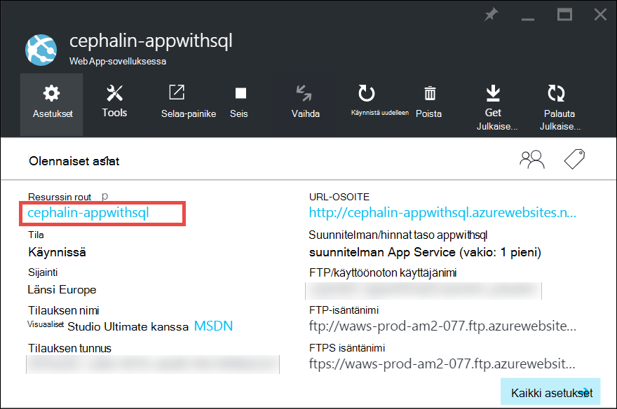
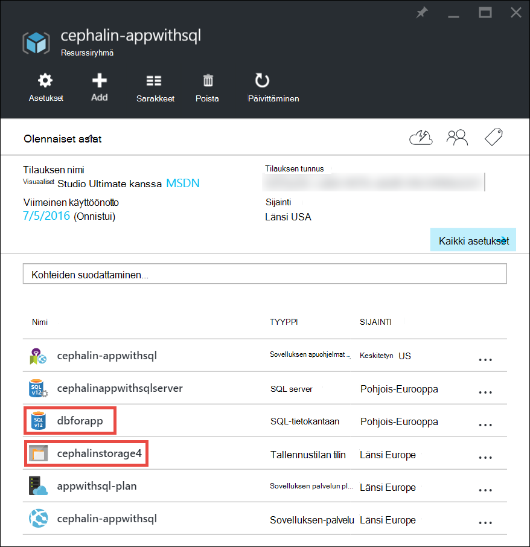
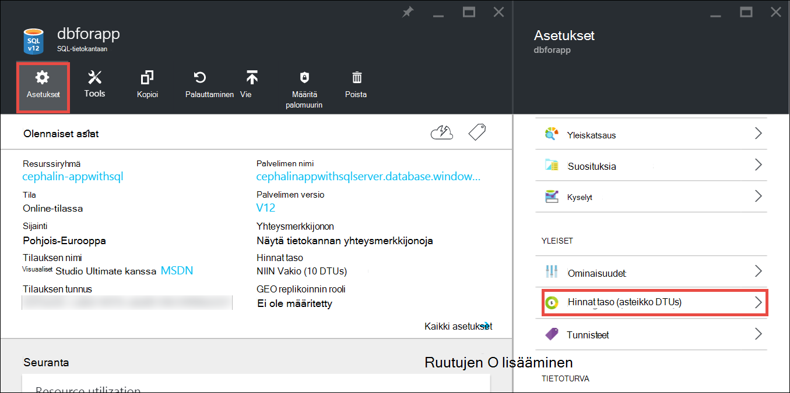
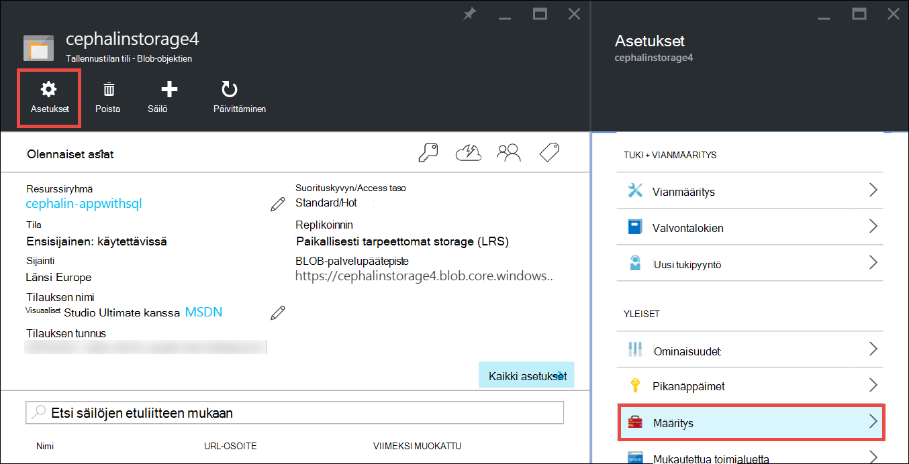

<properties
    pageTitle="Azure-sovelluksen määrittäminen skaalata | Microsoft Azure"
    description="Lue, miten voit Azure App palvelun Lisää kapasiteetin ja ominaisuudet-sovelluksen."
    services="app-service"
    documentationCenter=""
    authors="cephalin"
    manager="wpickett"
    editor="mollybos"/>

<tags
    ms.service="app-service"
    ms.workload="na"
    ms.tgt_pltfrm="na"
    ms.devlang="na"
    ms.topic="article"
    ms.date="07/05/2016"
    ms.author="cephalin"/>

# Skaalaa Azure-sovelluksen määrittäminen #

Tässä artikkelissa kerrotaan, miten sovelluksen Azure sovelluksen-palvelussa. On kaksi työnkulut skaalauksen, asteikon ylöspäin ja mittakaava, ja tässä artikkelissa kerrotaan asteikon työnkulku.

- [Laajentaa](https://en.wikipedia.org/wiki/Scalability#Horizontal_and_vertical_scaling): Lisää suorittimen, muistin, levytilaa ja lisäominaisuuksia, kuten Oma näennäiskoneiden (VMs), mukautetut toimialueet ja todistuksista, väliaikaisen paikkojen ja automaattisen skaalauksen poistaminen. Voit skaalata muuttamalla sovelluksen palvelusopimus, joka kuuluu sovelluksen hinnoittelu taso.
- [Mittakaava,](https://en.wikipedia.org/wiki/Scalability#Horizontal_and_vertical_scaling): Lisää AM esiintymät, jotka suoritetaan sovelluksen.
Voit skaalata jopa 20 esiintymissä hinnoittelu tason mukaan. [Sovelluksen palvelun ympäristöissä](../app-service/app-service-app-service-environments-readme.md) **Premium** taso-edelleen kasvattaa asteikko uloskuittaus-Laske 50 esiintymissä. Saat lisätietoja laajentaminen [skaalata esiintymän Laske manuaalisesti tai automaattisesti](../monitoring-and-diagnostics/insights-how-to-scale.md). Huomaat, miten voit käyttää automaattisen skaalauksen poistaminen, joka on skaalata esiintymän Laske ennalta määritetyt säännöt ja aikatauluja automaattisesti perusteella.

Mittakaava-asetuksia kestää vain koskevat ja vaikuttavat kaikki sovellukset [App palvelusopimus](../app-service/azure-web-sites-web-hosting-plans-in-depth-overview.md)sekunteja.
Ne eivät edellytä voit muuttaa koodin tai ota sovelluksesi uudelleen.

Hinnat ja yksittäisiä App palvelusopimusten vaihtoehdot ominaisuuksien tietoja on artikkelissa [Sovelluksen palvelun hinnat tiedot](/pricing/details/web-sites/).  

> [AZURE.NOTE] Ennen kuin siirryt App Service-suunnitelma- **vapaa** -taso, on poistettava [tehtäviinsä rajoitukset](/pricing/spending-limits/) paikassa Azure tilauksen. Voit tarkastella tai muuttaa Microsoft Azure-sovelluksen palvelun tilauksen asetukset-kohdassa [Microsoft Azure tilaukset][azuresubscriptions].

## Skaalaa hinnoittelu tason määrittäminen

1. Avaa selaimessa [Azure portal][portal].

2. Sinua sovelluksen sivu, valitse **kaikki**asetukset ja valitse sitten **Mittakaava ylöspäin**.

    ![Siirry Azure Appin skaalata.][ChooseWHP]

4. Valitse oman taso ja valitse sitten **Valitse**.

    **Ilmoitukset** -välilehti flash vihreä **onnistui** , kun toiminto on valmis.

## Skaalaa liittyvät resurssit
Jos sovellus riippuu muiden palvelujen, kuten Azure SQL-tietokanta tai Azure-tallennustilan, voit myös skaalata määrittäminen tarvittavat resurssit. Nämä resurssit ovat skaalaudu App palvelusopimus ja on skaalattu erikseen.

1. Napsauta **Essentials** **resurssiryhmä** -linkkiä.

    

2. Valitse **Yhteenveto** - **resurssiryhmä** -sivu-osasta resurssin, jonka haluat skaalata. Seuraavassa näyttökuvassa näkyy SQL-tietokantaan resurssi ja Azure-tallennustilan resurssi.

    

3. SQL-tietokantaan resurssin, valitse **asetukset** > **hinnoittelu taso** skaalata hinnoittelua taso.

    

    Voit myös ottaa [geo replikoinnin](../sql-database/sql-database-geo-replication-overview.md) SQL-tietokanta-esiintymän.

    Valitse Azuren tallennustilaan yritysresurssi **asetuksia** > **määritysten** skaalata tallennustilan asetukset.

    

## Lisätietoja kehittäjä-ominaisuuksista
Hinnoittelu tason mukaan seuraavat developer aloittaminen-ominaisuudet ovat käytettävissä:

### Bittimäärää ###

- **Perustiedot**, **Vakio**ja **Premium** tasoa tue 64-bittistä ja 32-bittinen sovelluksia.
- **Vapaa** ja **jaettujen** suunnitelman tasoa tukevat vain 32-bittiset sovellukset.

### Virheenkorjaus-tuki ###

- Virheenkorjaus tuki on käytettävissä sovelluksen palvelusopimus kohden yhden verkkoyhteydessä **vapaa**, **jaettu**ja **Basic** -tilassa.
- Virheenkorjaus tuki on käytettävissä osoitteessa viisi samanaikaista yhteyttä kohti App palvelusopimus **Vakio** - ja **Premium** -tilassa.

## Lisätietoja muista ominaisuuksista

- Saat lisätietoja kaikki jäljellä olevat App palvelusopimusten vaihtoehdot, kuten hinnat toiminnot ja ominaisuudet (mukaan lukien sovelluskehittäjille) kaikille käyttäjille halutut [App palvelun hinnat tiedot](/pricing/details/web-sites/).

>[AZURE.NOTE] Jos haluat aloittaa Azure App palvelun, ennen kuin kirjaudut Azure-tili, siirry [Yritä App palvelun](http://go.microsoft.com/fwlink/?LinkId=523751) jossa lyhytkestoinen starter verkkosovellukseen heti voit luoda sovelluksen-palvelussa. Ei ole luottokortit tarvittavat ja ei ole sitoumukset.

## Seuraavat vaiheet

- Aloita Azure-kohdassa [Microsoft Azure maksuttoman kokeiluversion](/pricing/free-trial/).
- Lisätietoja hinnat, tuen ja SLA daxista on seuraavissa linkeissä.

    [Tietoja siirtää hinnoittelutiedot](/pricing/details/data-transfers/)

    [Microsoft Azure tuki-Palvelupaketit](/support/plans/)

    [Service Level Agreement](/support/legal/sla/)

    [SQL-tietokannan hinnat tiedot](/pricing/details/sql-database/)

    [Virtuaalikoneen ja Microsoft Azure Cloud palvelun koot][vmsizes]

    [Sovelluksen palvelun hinnat tiedot](/pricing/details/app-service/)

    [Sovelluksen palvelun hinnat tiedot - SSL-yhteyksiä](/pricing/details/web-sites/#ssl-connections)

- Lisätietoja Azure App palvelun parhaita käytäntöjä, mukaan lukien rakentaminen skaalattava ja joustavat arkkitehtuuri-artikkelissa [parhaat käytännöt: Azure palvelun Web sovellukset](http://blogs.msdn.com/b/windowsazure/archive/2014/02/10/best-practices-windows-azure-websites-waws.aspx).

- Katso videoita skaalaus App palvelun sovellukset on seuraavissa resursseissa:

    - [Kun skaalata Azure sivustot - Teemun tilanne Schackow kanssa](/documentation/videos/azure-web-sites-free-vs-standard-scaling/)
    - [Automaattinen skaalaus Azure sivustot-Suoritin tai ajoitetun - Teemun tilanne Schackow kanssa](/documentation/videos/auto-scaling-azure-web-sites/)
    - [Miten Azure sivustojen Skaalaa - Teemun tilanne Schackow kanssa](/documentation/videos/how-azure-web-sites-scale/)

<!-- LINKS -->
[vmsizes]:/pricing/details/app-service/
[SQLaccountsbilling]:http://go.microsoft.com/fwlink/?LinkId=234930
[azuresubscriptions]:http://go.microsoft.com/fwlink/?LinkID=235288
[portal]: https://portal.azure.com/

<!-- IMAGES -->
[ChooseWHP]: ./media/web-sites-scale/scale1ChooseWHP.png
[ChooseBasicInstances]: ./media/web-sites-scale/scale2InstancesBasic.png
[SaveButton]: ./media/web-sites-scale/05SaveButton.png
[BasicComplete]: ./media/web-sites-scale/06BasicComplete.png
[ScaleStandard]: ./media/web-sites-scale/scale3InstancesStandard.png
[Autoscale]: ./media/web-sites-scale/scale4AutoScale.png
[SetTargetMetrics]: ./media/web-sites-scale/scale5AutoScaleTargetMetrics.png
[SetFirstRule]: ./media/web-sites-scale/scale6AutoScaleFirstRule.png
[SetSecondRule]: ./media/web-sites-scale/scale7AutoScaleSecondRule.png
[SetThirdRule]: ./media/web-sites-scale/scale8AutoScaleThirdRule.png
[SetRulesFinal]: ./media/web-sites-scale/scale9AutoScaleFinal.png
[ResourceGroup]: ./media/web-sites-scale/scale10ResourceGroup.png
[ScaleDatabase]: ./media/web-sites-scale/scale11SQLScale.png
[GeoReplication]: ./media/web-sites-scale/scale12SQLGeoReplication.png
