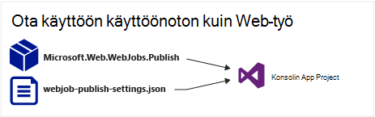
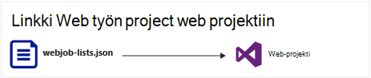
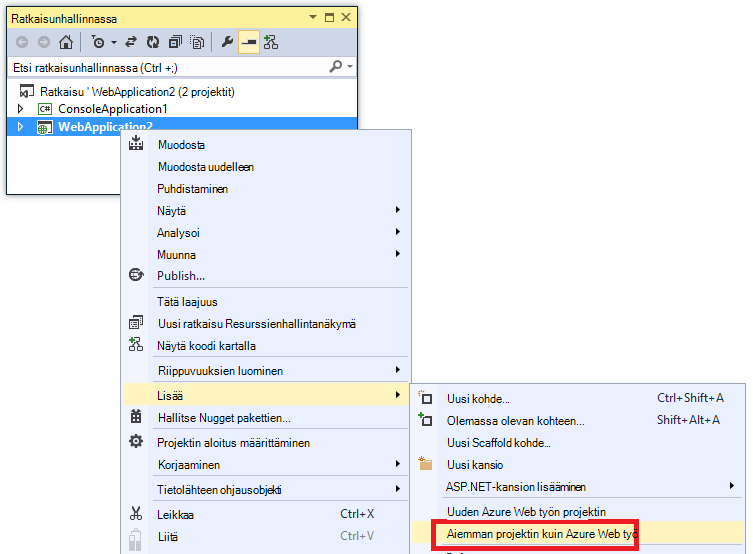
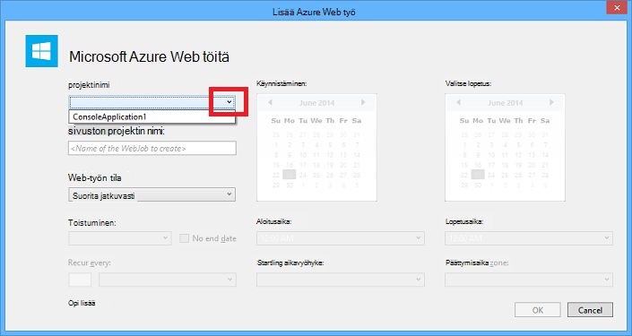
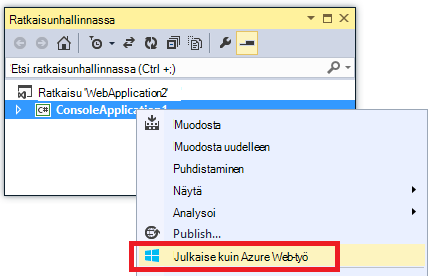
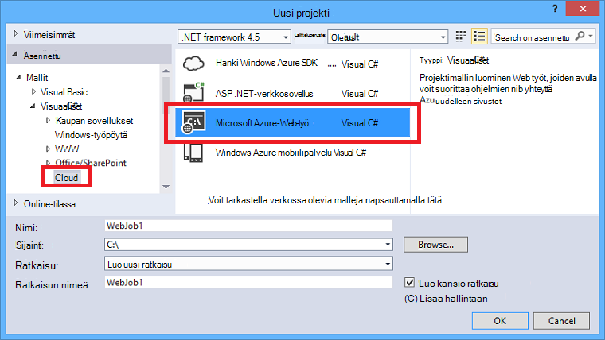
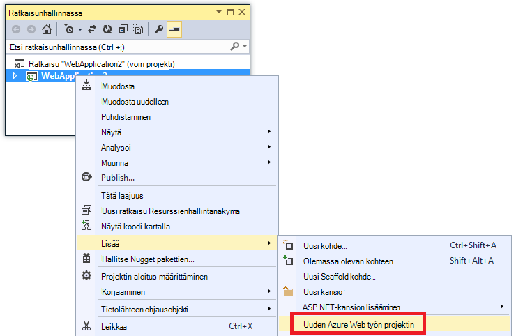
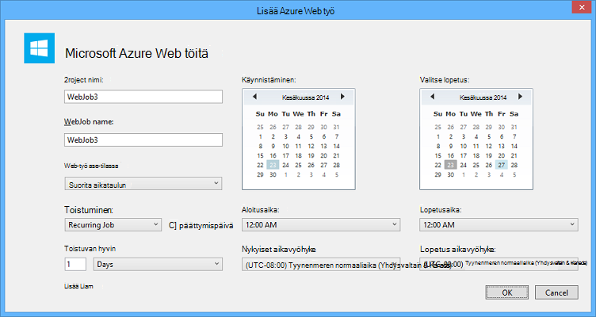

<properties 
    pageTitle="Ottaa käyttöön Visual Studiossa WebJobs" 
    description="Opi ottamaan Azure WebJobs Azure App palvelun Web Apps Visual Studiossa." 
    services="app-service" 
    documentationCenter="" 
    authors="tdykstra" 
    manager="wpickett" 
    editor="jimbe"/>

<tags 
    ms.service="app-service" 
    ms.devlang="dotnet" 
    ms.topic="article" 
    ms.tgt_pltfrm="na" 
    ms.workload="na" 
    ms.date="04/27/2016" 
    ms.author="tdykstra"/>

# Ottaa käyttöön Visual Studiossa WebJobs

## Yleiskatsaus

Tässä ohjeaiheessa kerrotaan, miten konsolisovelluksen project web App-sovellukseen [Azure WebJob](http://go.microsoft.com/fwlink/?LinkId=390226) [Sovelluksen Service](http://go.microsoft.com/fwlink/?LinkId=529714) -Visual Studio avulla. Lisätietoja WebJobs ottamisesta [Azure-portaalissa](https://portal.azure.com)on artikkelissa [WebJobs tehtävien suorittaminen taustalla](web-sites-create-web-jobs.md).

Kun Visual Studio käyttää WebJobs käyttävä Console-sovelluksen projektin, se suorittaa kaksi tehtävää:

* Kopioi runtime tiedostoja kansioon web Appissa (*App_Data/työt/jatkuva* jatkuva WebJobs varten, ajoitetun ja tarvittaessa WebJobs *App_Data/työt/saatu* ).
* Määrittää [Azure ajoituksen työt](#scheduler) , jotka on suunniteltu toimimaan tietyn aikoina WebJobs varten. (Tämä ei tarvita jatkuva WebJobs.)

Projektin WebJobs käytössä on lisätty seuraavat kohteet:

* [Microsoft.Web.WebJobs.Publish](http://www.nuget.org/packages/Microsoft.Web.WebJobs.Publish/) NuGet-paketti.
* [Webjob – Julkaise settings.json](#publishsettings) tiedosto, joka sisältää käyttöönotto- ja ajoituksen asetukset. 

Voit lisätä tällaisia aiemman konsolisovelluksen projektin tai WebJobs käyttävä Console-sovelluksen uuden projektin luominen mallin avulla. 

Voit ottaa projektin WebJob kuin itse tai linkittää sen web-projekti niin, että ottaa käyttöön automaattisesti aina, kun otat käyttöön web-projekti. Visual Studio sisältää linkitettävän projektien WebJobs käyttävä projektin nimeä web-projektin [webjobs list.json](#webjobslist) tiedosto.

## Edellytykset

WebJobs käyttöönotto-ominaisuudet ovat käytettävissä Visual Studio 2015, kun asennat Azure SDK .NET:

* [Azure SDK .NET (Visual Studio 2015)](http://go.microsoft.com/fwlink/?linkid=518003).

## Ota käyttöön WebJobs käyttöönoton aiemman konsolisovelluksen projektin

Sinulla on kaksi vaihtoehtoa:

* [Ota käyttöön automaattinen-ympäristö, jonka web-projekti](#convertlink).

    Määritä aiemman konsolisovelluksen projektin niin, että se automaattisesti ottaa käyttöön WebJob kuin asentaessasi web-projekti. Käytä tätä vaihtoehtoa, jos haluat suorittaa oman WebJob saman web Appissa, jossa liittyvien Verkko-sovelluksen käyttämiseen.

* [Ota käyttöönoton ilman web-projekti](#convertnolink).

    Määritä aiemman konsolisovelluksen projektin käyttöönotto WebJob kuin erillisenä-web-projektia ei ole linkillä. Käytä tätä vaihtoehtoa, kun haluat suorittaa WebJob verkkosovellukseen yksinään, ei ole käynnissä web App-sovelluksessa web-sovelluksen kanssa. Voit haluta toiminto jotta voi skaalata WebJob resurssien ulkopuolisista web-sovelluksen resurssit.

### Ota käyttöön automaattinen WebJobs-ympäristö, jonka web-projekti
  
1. Napsauta **Ratkaisunhallinnassa**web-projekti hiiren kakkospainikkeella ja valitse sitten **Lisää** > **Azure WebJob olemassa olevan projektin**.

    
    
    [Lisää Azure WebJob](#configure) -valintaikkuna.

1. **Projektinimi** avattavasta luettelosta Valitse Lisää WebJob Console-sovelluksen projekti.

    

2. Viimeistele [Azure WebJob lisääminen](#configure) -valintaikkunassa ja valitse sitten **OK**. 

### Ota käyttöön WebJobs käyttöönoton ilman web-projekti
  
1. Napsauta **Ratkaisunhallinnassa**konsolisovelluksen projektin hiiren kakkospainikkeella ja valitse sitten **Julkaise Azure WebJob**. 

    
    
    [Lisää Azure WebJob](#configure) -valintaikkuna tulee näyttöön, kirjoita **projektinimi** -ruutuun valitun projektin.

2.  Täytä [Lisää Azure WebJob](#configure) -valintaikkuna ja valitse sitten **OK**.

    **Sivuston julkaiseminen** ohjattu tulee näkyviin.  Jos et halua julkaista heti, sulje ohjattu toiminto. Asetukset, jotka olet kirjoittanut tallennetaan kun haluat ottaa [käyttöön projektin](#deploy).

## Luo uusi WebJobs käyttävä projekti

Jos haluat luoda uuden WebJobs käyttävä projektin, käyttää konsolisovelluksen project-malli ja käyttöön WebJobs käyttöönoton [edellisessä](#convert)kohdassa kuvatulla. Vaihtoehtoisesti voit WebJobs uuden projektin mallia:

* [Käytä WebJobs uuden projektin mallia riippumaton WebJob](#createnolink)

    Projektin luominen ja määritä se ottaa WebJob-web-projektia ei ole linkillä nimellä. Käytä tätä vaihtoehtoa, kun haluat suorittaa WebJob verkkosovellukseen yksinään, ei ole käynnissä web App-sovelluksessa web-sovelluksen kanssa. Voit haluta toiminto jotta voi skaalata WebJob resurssien ulkopuolisista web-sovelluksen resurssit.

* [Käytä WebJobs uuden projektin mallia WebJob, web-projektiin](#createlink)

    Luo projekti, joka on määritetty käyttöön automaattisesti WebJob saman ratkaisun web-projekti on otettu käyttöön. Käytä tätä vaihtoehtoa, jos haluat suorittaa oman WebJob saman web Appissa, jossa liittyvien Verkko-sovelluksen käyttämiseen.

> [AZURE.NOTE] WebJobs uuden projektin mallia asentaa NuGet pakettien ja sisältää koodin *Program.cs* [WebJobs SDK](http://www.asp.net/aspnet/overview/developing-apps-with-windows-azure/getting-started-with-windows-azure-webjobs)automaattisesti. Jos et haluat käyttää WebJobs SDK-paketissa tai haluat käyttää ajoitetun sijaan jatkuva WebJob, poistaa tai muuttaa `host.RunAndBlock` *Program.cs*-lause.

### Riippumattomien WebJob WebJobs uusi projekti-mallin käyttäminen
  
1. Valitse **Tiedosto** > **Uusi projekti**ja valitse sitten **Uusi projekti** -valintaikkunassa **Cloud** > **Microsoft Azure WebJob**.

    
    
2. Noudata esitettyjä tehdä [Projektin projekti itsenäinen kokonaisuus WebJobs Console-sovellus](#convertnolink).

### Käytä WebJobs uuden projektin mallia WebJob, web-projektiin

1. Napsauta **Ratkaisunhallinnassa**web-projekti hiiren kakkospainikkeella ja valitse sitten **Lisää** > **Uuden Azure WebJob projektin**.

    

    [Lisää Azure WebJob](#configure) -valintaikkuna.

2. Täytä [Lisää Azure WebJob](#configure) -valintaikkuna ja valitse sitten **OK**.

## Lisää Azure WebJob-valintaikkuna

**Lisää Azure WebJob** -valintaikkunan avulla voit määrittää WebJob nimi ja ajoituksen oman WebJob asetuksia. 

Tämän valintaikkunan kentät vastaavat kenttiä Azure-portaalin **Uusi projekti** -valintaikkunassa. Lisätietoja on artikkelissa [WebJobs tehtävien suorittaminen taustalla](web-sites-create-web-jobs.md).

Visual Studio Luo ajoitetun WebJob (ei käytössä jatkuva WebJobs) [Azure ajoitus](/services/scheduler/) -työ sivustokokoelman Jos sellaista ei ole vielä ja luo työn sivustokokoelman:

* Ajoituksen työn sivustokokoelman nimeltä *WebJobs {regionname} -* kohtaa, johon *{regionname}* viittaa alueen web app isännöidään. Esimerkki: WebJobs WestUS.
* Ajoitus-työ on nimeltään *{webappname} – {webjobname}*. Esimerkki: MyWebApp MyWebJob. 
 
>[AZURE.NOTE]
> 
>* Katso lisätietoja komentorivin käyttöönoton [komentorivin ottaminen käyttöön tai jatkuva lähettämisen ja Azure WebJobs](/blog/2014/08/18/enabling-command-line-or-continuous-delivery-of-azure-webjobs/).
>* Jos määritetty toistumistiheys minuuttimäärä ja määritä **Toistuva projekti** , Azure ajoitus-palvelu ei ole vapaa. Muut tiheydet (tunnit, päivän ja niin edelleen) ovat maksuttomia.
>* Jos WebJob ottaminen käyttöön ja sen jälkeen päätät haluat muuttaa WebJob ja laukaisun, tarvitset webjobs – Julkaise settings.json-tiedoston poistaminen. Näin saat Visual Studio Näytä julkaisun asetukset uudelleen, jotta voit muuttaa WebJob tyyppi.
>* Jos käyttöönotto WebJob ja myöhemmin muuttaa suorituksen aikana jatkuva-jatkuva tai päinvastoin, Visual Studio Luo uusi WebJob Azure-tietokannassa, kun olet Ota uudelleen. Jos muut ajoituksen asetusten muuttaminen, mutta jätä suorittaa tilassa sama tai vaihtaa ajoitettu ja pyydettäessä, Visual Studio päivittää olemassa olevan projektin sijaan luoda uuden.

## webjob – Julkaise settings.json

Kun määrität Console-sovelluksen WebJobs käyttöönottoa varten, Visual Studio asentaa [Microsoft.Web.WebJobs.Publish](http://www.nuget.org/packages/Microsoft.Web.WebJobs.Publish/) NuGet paketin ja tallentaa ajoitustiedot *webjob – Julkaise settings.json* tiedostoon WebJobs projektin projektin *Ominaisuudet* -kansiossa. Tässä on esimerkki tiedoston:

        {
          "$schema": "http://schemastore.org/schemas/json/webjob-publish-settings.json",
          "webJobName": "WebJob1",
          "startTime": "2014-06-23T00:00:00-08:00",
          "endTime": "2014-06-27T00:00:00-08:00",
          "jobRecurrenceFrequency": "Minute",
          "interval": 5,
          "runMode": "Scheduled"
        }

Voit muokata tiedostoa suoraan ja Visual Studio sisältää IntelliSense. Tiedoston rakenne on tallennettu [http://schemastore.org](http://schemastore.org/schemas/json/webjob-publish-settings.json) ja voi tarkastella siellä.  

>[AZURE.NOTE]
>
>* Jos Määritä **Toistuva projekti** ja määritä minuuttimäärä, jonka toistumistiheys, Azure ajoitus-palvelu ei ole vapaa. Muut tiheydet (tunnit, päivän ja niin edelleen) ovat maksuttomia.

## webjobs list.json

Kun linkität WebJobs käytössä project web-projekti, Visual Studio tallentaa WebJobs projektin nimeä web-projektin *Ominaisuudet* kansion *webjobs list.json* tiedostoon. Luettelossa voi olla useita WebJobs projekteja, kuten seuraavassa esimerkissä:

        {
          "$schema": "http://schemastore.org/schemas/json/webjobs-list.json",
          "WebJobs": [
            {
              "filePath": "../ConsoleApplication1/ConsoleApplication1.csproj"
            },
            {
              "filePath": "../WebJob1/WebJob1.csproj"
            }
          ]
        }

Voit muokata tiedostoa suoraan ja Visual Studio sisältää IntelliSense. Tiedoston rakenne on tallennettu [http://schemastore.org](http://schemastore.org/schemas/json/webjobs-list.json) ja voi tarkastella siellä.
  
## Ota käyttöön WebJobs-projekti

WebJobs projektia, jota olet linkittänyt web projektin otetaan käyttöön automaattisesti web-projekti. Tutustu tietoja web projektin käyttöönoton [Web Apps -sovellusten käyttöön](web-sites-deploy.md).

Ota käyttöön WebJobs-projekti erillisenä hiiren kakkospainikkeella **Ratkaisunhallinnassa**projektin ja **Azure WebJob**Julkaise. 

    
Riippumattomien WebJob saman ohjatun **Sivuston julkaisemisen** , jota käytetään web-projektit tulee näyttöön, mutta on vähemmän asetuksia voi muuttaa.

## Seuraavat vaiheet

Tässä artikkelissa on tietoja WebJobs ottamisesta käyttöön Visual Studiossa. Saat lisätietoja Azure WebJobs ottamisesta [WebJobs Azure - suositellut resurssit - käyttöönotto](http://www.asp.net/aspnet/overview/developing-apps-with-windows-azure/azure-webjobs-recommended-resources#deploying).
