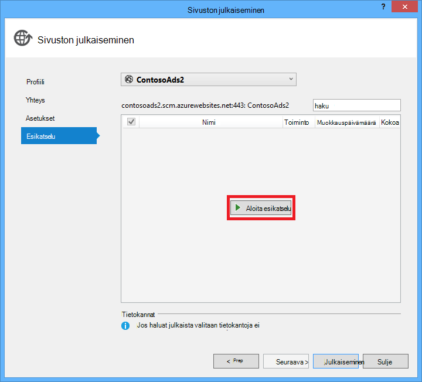

<properties
    pageTitle=".NET-WebJob luominen Azure App palvelun | Microsoft Azure"
    description="ASP.NET-MVC ja Azure monitasoisten sovelluksen luominen. Postikortin etupuoli end-lohkot verkkosovellukseen Azure-sovelluksen palvelun ja taustaan suoritetaan WebJob. Sovellus käyttää kohteen Framework ja SQL-tietokantaan ja Azure tallennustilan olevien BLOB."
    services="app-service"
    documentationCenter=".net"
    authors="tdykstra"
    manager="wpickett"
    editor="mollybos"/>

<tags
    ms.service="app-service"
    ms.workload="na"
    ms.tgt_pltfrm="na"
    ms.devlang="na"
    ms.topic="article"
    ms.date="10/28/2016"
    ms.author="tdykstra"/>

# .NET-WebJob luominen Azure sovelluksen-palvelu

Tässä opetusohjelmassa näytetään, miten yksinkertainen, joka käyttää [WebJobs SDK](websites-dotnet-webjobs-sdk.md)monitasoisten ASP.NET MVC 5-sovelluksen koodin kirjoittaminen.

[WebJobs SDK](websites-webjobs-resources.md) tarkoituksena on yksinkertaistettava kirjoittamasi usein käytettyjen tehtävien WebJob voi suorittaa, kuten kuvankäsittely, jonon käsittely koodin, RSS kooste tiedoston ylläpito tai lähettäminen sähköpostitse. WebJobs SDK on valmiita ominaisuuksia käyttöä Azuren tallennustilaan ja palvelun Bus, tehtävien ajoittaminen ja virheiden ja monia muita yleisiä tilanteita, joissa. Lisäksi se on suunniteltu extensible ja ei [Avaa lähde säilö tunnisteet](https://github.com/Azure/azure-webjobs-sdk-extensions/wiki/Binding-Extensions-Overview).

Esimerkkisovellus on mainonta-ilmoitustaulu. Käyttäjien ladata Active Directory-kuvat ja Taustajärjestelmä prosessin muuntaa kuvat pikkukuvat. Ad-luettelosivulle näytetään pikkukuvat ja ad tiedot-sivu, jossa näkyy Täysikokoinen kuva. Näyttökuva näin:

Tämä malli-sovellus toimii [Azure olevien](http://www.asp.net/aspnet/overview/developing-apps-with-windows-azure/building-real-world-cloud-apps-with-windows-azure/queue-centric-work-pattern) ja [Azure BLOB-objektit](http://www.asp.net/aspnet/overview/developing-apps-with-windows-azure/building-real-world-cloud-apps-with-windows-azure/unstructured-blob-storage). Opetusohjelman esitetään, kuinka voit ottaa käyttöön sovelluksen [Azure App palveluun](http://go.microsoft.com/fwlink/?LinkId=529714) ja [Azure SQL-tietokantaan](http://msdn.microsoft.com/library/azure/ee336279).

## Edellytykset

Opetusohjelman oletetaan, että osaat Visual Studio [ASP.NET MVC 5](http://www.asp.net/mvc/tutorials/mvc-5/introduction/getting-started) projektien käsitteleminen.

Opetusohjelman on kirjoitettu Visual Studio 2013. Jos sinulla ei vielä ole Visual Studiossa, se asennetaan puolestasi automaattisesti, kun asennat Azure SDK .NET.

Opetusohjelman voidaan käyttää Visual Studio 2015, mutta ennen kuin suoritat sovelluksen paikallisesti on muutettava `Data Source` osa SQL Server LocalDB yhteysmerkkijono Web.config ja App.config tiedostot kohteesta `Data Source=(localdb)\v11.0` , `Data Source=(LocalDb)\MSSQLLocalDB`. 

> [AZURE.NOTE] Sinun on suoritettava tässä opetusohjelmassa Azure tilin:
  >
  > + Voit [avata Azure-tili maksutta](https://azure.microsoft.com/pricing/free-trial/?WT.mc_id=A261C142F): Saat hyvitykset avulla voit kokeilla maksettu Azure services ja senkin jälkeen, kun niitä käytetään enintään voit pitää tilin ja käyttää vapaa Azure-palvelut, kuten sivustot. Luottokorttisi koskaan veloitetaan, ellet nimenomaisesti muuttaminen ja pyydä veloitetaan.
  >
  > + Voit [aktivoida MSDN tilaajan edut](https://azure.microsoft.com/pricing/member-offers/msdn-benefits-details/?WT.mc_id=A261C142F): Your MSDN-tilauksen käyttöösi hyvitykset joka kuukausi, jonka maksettu Azure-palveluiden avulla.
  >
  >Jos haluat aloittaa Azure App palvelun ennen rekisteröimässä Azure-tili, siirry [Yritä App palvelu](http://go.microsoft.com/fwlink/?LinkId=523751), jossa lyhytkestoinen starter verkkosovellukseen heti voit luoda sovelluksen-palvelussa. Ei ole pakollinen; luottokortit ei ole sitoumukset.

## Opit

Opetusohjelman esitetään, kuinka voit tehdä seuraavia toimintoja:

* Ota käyttöön tietokoneen Azure kehittämiseen asentamalla Azure SDK-paketissa.
* Automaattinen tunnistus kuin Azure-WebJob, kun otat käyttöön uuden liittyvän Internet-projektin konsolisovelluksen projektin luominen.
* Testaa WebJobs SDK taustassa paikallisesti kehittäminen tietokoneessa.
* Sovellus on WebJobs taustassa julkaiseminen verkkosovellukseen sovelluksen-palvelussa.
* Tiedostoja ladataan ja tallentaa ne Azure-Blob-palvelussa.
* Azure WebJobs SDK avulla voit käsitellä Azuren tallennustilaan olevien ja BLOB-objektit.

## Sovelluksen arkkitehtuuri

Esimerkkisovellus käyttää [jonon keskitettyä työn kuvion](http://www.asp.net/aspnet/overview/developing-apps-with-windows-azure/building-real-world-cloud-apps-with-windows-azure/queue-centric-work-pattern) off-load Suoritinta kuormittavaa työmäärä pikkukuvien Taustajärjestelmä prosessin luomista.

Sovellus tallentaa mainosten SQL-tietokanta, käyttämällä kohteen Framework koodin ensimmäisen taulukoiden luominen ja käyttää tietoja. AD-tietokanta tallentaa kaksi URL-osoitteet: Täysikokoinen kuva ja yksi pikkukuva.

Kun käyttäjä lataa kuva-web-sovellus tallentaa kuvan [Azure blob](http://www.asp.net/aspnet/overview/developing-apps-with-windows-azure/building-real-world-cloud-apps-with-windows-azure/unstructured-blob-storage)ja ad-tiedot tallennetaan tietokannan ja URL-osoite, joka osoittaa blob. Samalla kertaa se kirjoittaa viestin Azure jonossa. Azure-WebJob käynnissä Taustajärjestelmä prosessin WebJobs SDK tekee kyselyn jonossa uusissa viesteissä. Kun uusi viesti näkyy, WebJob Luo pikkukuva, että kuvan ja päivittää kyseisen ad pikkukuvan URL-Osoitteen database-kenttä. Oheinen kaavio kuvaa, joka näyttää, miten sovelluksen osista vaikuttavat:

[AZURE.INCLUDE [install-sdk](../../includes/install-sdk-2015-2013.md)]

Opetusohjelman ohjeet koskevat Azure SDK .NET 2.7.1 tai uudempi versio.

## Azure-tallennustilan tilin luominen

Azure-tallennustilan tilin tarjoaa resurssien jono ja Blob-objektien tietojen tallentaminen pilveen. Se myös käytetään WebJobs SDK kirjaaminen koontinäytön tietojen tallentamiseen.

Tosielämän-sovelluksessa voit luoda yleensä erilliset tilit sovelluksen tiedot ja kirjaa tietoja ja erillinen tilit testitiedot ja tuotannon tiedot. Tässä opetusohjelmassa käytät vain yhtä käyttäen.

1. Avaa Visual Studiossa **Palvelimen** ikkunan.

2. Napsauta hiiren kakkospainikkeella **Azure** -solmu ja valitse sitten **yhteyden muodostaminen Microsoft Azure**.

3. Kirjaudu sisään käyttämällä Azure tunnistetiedot.

5. **Tallennustilan** Azure-solmun napsauttamalla hiiren kakkospainikkeella ja valitse sitten **Luo tallennustilan tili**.

3. Kirjoita **Luo tallennustilan tili** -valintaikkunassa tallennustilan tilin nimi.

    Nimen on oltava on oltava yksilöllinen (ei Azure-tallennustilan tilin voi olla samaa nimeä). Jos kirjoittamasi nimi on jo käytössä saat voit muuttaa sitä.

    Tallennustilan tiliäsi URL-osoite on *{name}*. core.windows.net.

5. Määrittää alueen **alue tai affiniteetti ryhmän** avattavasta luettelosta sinua lähinnä.

    Tämä asetus määrittää, mitkä Azure palvelinkeskuksen isännöi tallennustilan tilin. Tässä opetusohjelmassa valittua ei tehdä huomattavia ero. Tuotannon web-sovelluksen haluat kuitenkin verkkosivustoon ja tallennustilaa tilin Pienennä viive ja tietojen juniin ovat samassa alueelle. Web-sovellus (joka luot myöhemmin) palvelinkeskuksen olisi mahdollisimman lähellä web-sovelluksen käyttäminen minimoida viive selaimissa.

6. Määritä **paikallisesti tarpeettomat** **replikoinnin** avattavasta luettelosta.

    Kun geo replikointi on käytössä tallennustilan tilin, tallennetun sisällön replikoida toissijainen palvelinkeskukseen käyttöön automaattisesti, jos ensisijainen sijainnissa pää huono kyseiseen sijaintiin. GEO replikoinnin voi olla maksullisia. Numero- ja -tilien yleensä piilotettavien geo toistoa varten. Lisätietoja on artikkelissa [luominen, hallinta, tai poista tallennustilan-tili](../storage-create-storage-account/#replication-options).

5. Valitse **Luo**.

    

## Lataa sovellus

1. Lataamalla ja purkamalla [raportoiminen ratkaisu](http://code.msdn.microsoft.com/Simple-Azure-Website-with-b4391eeb)tiedoston.

2. Käynnistä Visual Studio.

3. Valitse **Tiedosto** -valikosta **Avaa > Project-ratkaisun**, siirry, johon olet ladannut ratkaisun ja avaa sitten ratkaisutiedosto.

4. Paina CTRL + VAIHTO + B Rakenna ratkaisu.

    Oletusarvon mukaan Visual Studio palauttaa automaattisesti NuGet palvelupaketin sisältö, joka ei sisälly *.zip* -tiedosto. Jos paketit ei palauta, asentaa ne manuaalisesti siirtymällä **Ratkaisu NuGet pakettien hallinta** -valintaikkuna ja valitsemalla **Palauta** -painiketta oikeassa yläreunassa.

5. **Ratkaisunhallinnassa**Varmista, että **ContosoAdsWeb** on valittu projektin aloitus.

## Määritä sovellus tallennustilan tilin käyttöä varten

1. Avaa *seuraavan sovelluksen koodin korostetut* ContosoAdsWeb Projectissa.

    Tiedostossa on SQL-yhteysmerkkijono ja Azure tallennustilan-yhteysmerkkijonon BLOB-objektit ja olevien käyttämisen.

    SQL-yhteysmerkkijonon osoittaa [SQL Server Express LocalDB](http://msdn.microsoft.com/library/hh510202.aspx) tietokannan.

    Tallennustilan yhteysmerkkijonon on esimerkki, jossa on paikkamerkkejä tallennustilan tilin nimi ja access-näppäintä. Tämä tilalle yhteysmerkkijonon, joka sisältää nimen ja avaimen tallennustilan tilin.  

    <pre class="prettyprint">&lt;connectionStrings&gt;
   &lt;Lisää nimi = "ContosoAdsContext" connectionString = "tietolähteen = (localdb) \v11.0; Alkuperäisen luettelon = ContosoAds; Integroitu suojaus = tosi. MultipleActiveResultSet-sarjoja = tosi; "providerName="System.Data.SqlClient "/&gt;
   &lt;Lisää nimi ="AzureWebJobsStorage"connectionString =" DefaultEndpointsProtocol = https; AccountName =<mark>[accountname]</mark>; AccountKey<mark>[accesskey]</mark>= "/&gt; 
    &lt;/connectionStrings      &gt;</pre>

    Tallennustilan yhteysmerkkijonon nimetään AzureWebJobsStorage koska WebJobs SDK käyttää nimi on oletusarvon mukaan. Samaa nimeä käytetään tässä, eli tarjolla on nyt määritetty vain yksi yhteyden merkkijonoarvona Azure-ympäristössä.

2. **Palvelimen Explorer**-tallennustilan tilin **tallennustilan** solmun hiiren kakkospainikkeella ja valitse sitten **Ominaisuudet**.

    

3. **Ominaisuudet** -ikkunassa **Tallennustilan tilin näppäimiä**ja valitse sitten kolme pistettä.

    

4. Kopioi **yhteysmerkkijono**.

    

5. Korvaa *seuraavan koodin korostetut* tallennustilan-yhteysmerkkijono yhteysmerkkijono, joka on kopioitu. Varmista, että olet valinnut kaikki lainausmerkkien sisällä, mutta ei yhtä ennen liittäminen lainausmerkkejä.

6. Avaa ContosoAdsWebJob projektin *App.config* -tiedostoa.

    Tämä tiedosto on kaksi tallennustilan yhteyden merkkijonoa, yksi sovelluksen tietoja ja yksi vastaavat kirjaaminen. Voit käyttää eri tallennustilan tilit sovelluksen tietojen ja kirjaaminen ja [usean tallennustilan tilin tiedot](https://github.com/Azure/azure-webjobs-sdk/blob/master/test/Microsoft.Azure.WebJobs.Host.EndToEndTests/MultipleStorageAccountsEndToEndTests.cs). Tässä opetusohjelmassa käytät yhden tallennustilan tilin. Yhteyden merkkijonot on tallennustilan tilin näppäimet paikkamerkkeinä. 
    <pre class="prettyprint">&lt;määritysten&gt; 
    &lt;connectionStrings&gt;
   &lt;Lisää nimi = "AzureWebJobsDashboard" connectionString = "DefaultEndpointsProtocol = https; AccountName =<mark>[accountname]</mark>; AccountKey<mark>[accesskey]</mark>= "/&gt;
   &lt;Lisää nimi ="AzureWebJobsStorage"connectionString =" DefaultEndpointsProtocol = https; AccountName =<mark>[accountname]</mark>; AccountKey<mark>[accesskey]</mark>= "/&gt;
   &lt;Lisää nimi ="ContosoAdsContext"connectionString =" tietolähteen = (localdb) \v11.0; Alkuperäisen luettelon = ContosoAds; Integroitu suojaus = tosi. MultipleActiveResultSet-sarjoja = tosi; " /&gt; 
    &lt;/connectionStrings&gt;
   &lt;Käynnistys&gt;
   &lt;supportedRuntime version = "v4.0" tuote = ". NETFramework, versio = v4.5 "/&gt; 
    &lt;/startup&gt;
&lt;/configuration                             &gt;</pre>

    Oletusarvon mukaan WebJobs SDK hakee AzureWebJobsStorage ja AzureWebJobsDashboard yhteyden merkkijonoja. Voit käyttää seuraavaa vaihtoehtona [yhteyden merkkijono, mutta haluat ja välittää sen erikseen, store `JobHost` objektin](websites-dotnet-webjobs-sdk-storage-queues-how-to.md#config).

7. Korvaa aiemmin kopioitu yhteysmerkkijonon sekä tallennustilan yhteyden merkkijonoja.

8. Tallenna muutokset.

## Suorita sovellus paikallisesti

1. Aloita sovelluksen web-edusta-painamalla CTRL + F5.

    Oletusselain avautuu aloitussivulle. (Web-projekti suoritetaan, koska se olet tehnyt projektin aloitus.)

    

2. Aloita sovelluksen WebJob-taustatietokannan, napsauta **Ratkaisunhallinnassa**ContosoAdsWebJob projektin ja valitse sitten **Virheenkorjaus** > **aloittaa uuden esiintymän**.

    Konsolin sovellusikkuna aukeaa ja näyttää viestien lokiin kirjaamisen, joka ilmaisee WebJobs SDK JobHost-objekti on jo alkanut suorittamiseen.

    

3. Selaimessa Valitse **Luo mainos**.

4. Kirjoita testin tietoja ja valitse Lataa kuva ja valitse sitten **Luo**.

    

    Sovelluksen siirtyy indeksi-sivulle, mutta se ei Näytä uusi kuvasarjan pikkukuva, koska kyseisen käsittely ei ole vielä tapahtui.

    Tänä aikana jälkeen lyhyt odotusaika kirjaaminen-sanoma console-sovellusikkunan Näyttää jonon viesti on vastaanotettu ja käsitelty.

    

5. Kun näet console-sovellusikkunan kirjaaminen viestit, Päivitä hakemisto-sivulle nähdäkseen pikkukuva.

    

6. Valitse **tiedot** , että ad Nähdäksesi Täysikokoinen kuva.

    

Voit olet käyttänyt sovelluksen paikalliseen tietokoneeseen, ja se käyttää SQL Serveriä tietokanta on tallennettu tietokoneeseen, mutta se toimii olevien ja BLOB pilveen. Seuraavassa osassa suoritat sovelluksen pilvipalvelussa, cloud tietokannan sekä cloud BLOB-objektit ja olevien avulla.  

## Suorita sovellus pilveen

Tee seuraavat toimet sovelluksen käyttämiseen pilvipalvelussa:

* Ota käyttöön verkkosovelluksissa. Visual Studio luo automaattisesti uuden verkkosovellukseen App palvelu ja SQL-tietokanta-esiintymä.
* Määritä Azure SQL-tietokanta ja tallennustilaa tiliä web-sovellus.

Jotkin mainosten myöhemmin ohjaamiseen pilveen, tarkastelet WebJobs SDK-koontinäytön, RTF seuranta ominaisuuksia uusista ominaisuuksista.

### Web Apps-sovellusten käyttöönotto

1. Sulje selain ja console-sovellusikkunan.

2. **Ratkaisunhallinnassa**ContosoAdsWeb projektin hiiren kakkospainikkeella ja valitse sitten **Julkaise**.

3. Valitse ohjatun **Sivuston julkaisemisen** **profiili** -vaiheessa **Microsoft Azure-verkkosovelluksissa**.

    

4. Kirjaudu Azure Jos et ole vielä kirjautunut sisään.

5. Valitse **Uusi**.

    Valintaikkunan voivat näyttää hieman erilaiset riippuen siitä, mikä Azure SDK .NET-versio on asennettu.

    

6. Kirjoita **Luo web Appin käyttö Microsoft Azure** -valintaikkunan **Web-sovelluksen nimi** -ruutuun yksilöllinen nimi.

    Täydellinen URL-osoite koostuu mitä tähän kohtaan lisäämäsi plus. azurewebsites.net (kuten **Web-sovelluksen nimi** -tekstiruutuun vieressä). Jos web-sovelluksen nimi on ContosoAds, URL-osoite on ContosoAds.azurewebsites.net.

7. Valitse [sovelluksen palvelusopimus](../app-service/azure-web-sites-web-hosting-plans-in-depth-overview.md) pudotusvalikosta **Luo uusi sovelluksen palvelun suunnitelma**. Kirjoita nimi sovelluksen Service-palvelupakettia, kuten ContosoAdsPlan.

8. Valitse **Luo uusi resurssiryhmä** [resurssiryhmä](../azure-resource-manager/resource-group-overview.md) avattavasta luettelosta.

9. Kirjoita resurssiryhmän, kuten ContosoAdsGroup nimi.

10. Valitse **alue** -pudotusvalikosta valitsit tallennustilan tilin saman alueen.

    Tämä asetus määrittää, mitkä Azure palvelinkeskuksen koodiin suoritetaan. Säilyttämällä web app- ja tallennustilaa tilille saman palvelinkeskuksen Minimoi viive ja tietojen juniin kulut.

11. Valitse **Luo uusi palvelin** **-Tietokantapalvelin, johon** avattavasta luettelosta.

12. Kirjoita tietokantapalvelimen, kuten contosoadsserver + numero tai nimi ja tee palvelimen nimi on yksilöllinen nimi. 

    Palvelimen nimi on oltava yksilöllinen. Se voi olla pienet kirjaimet, numerona ja väliviivoja. Se ei voi olla lopussa yhdysmerkin. 

    Voit myös jos tilauksesi jo on palvelimeen, voit valita palvelimen avattavasta luettelosta.

12. Kirjoita järjestelmänvalvojana **tietokannan käyttäjänimi** ja **salasana**.

    Jos valitsit **Uusi SQL-tietokantapalvelinta** ei ole lisääminen aiemmin luotuun käyttäjänimi ja salasana, tähän, lisäät uusi nimi ja salasana, jotka määrität nyt käyttämään myöhemmin, kun käytät tietokannan. Jos olet valinnut palvelimen, jonka loit aiemmin, sinua pyydetään olet jo luonut järjestelmänvalvojan tilin salasana.

13. Valitse **Luo**.

    

    Visual Studio Luo ratkaisun, web-projekti, Azure-web-sovelluksen ja Azure SQL-tietokanta-esiintymä.

14. Ohjatun **Sivuston julkaisemisen** **yhteyden** vaiheessa Valitse **Seuraava**.

    

15. **Asetukset** -kohdassa Poista **Käytä tätä yhteysmerkkijonon suorituksen aikana** -valintaruutu ja valitse sitten **Seuraava**.

    

    Ei tarvitse Julkaise-valintaikkunan avulla voit määrittää SQL-yhteysmerkkijonon, koska määritetty arvo myöhemmin Azure-ympäristössä.

    Voit ohittaa tämän sivun varoitukset.

    * Tavallisesti tallennustilan tilin käytetään silloin, kun käynnissä Azure-tietokannassa on eri kuin käytetään silloin, kun käytössä paikallisesti, mutta opetusohjelmassa on käytössä sama kuin kummassakin ympäristössä. Niin AzureWebJobsStorage yhteysmerkkijonon ei tarvitse muunnettavat. Vaikka haluat käyttää eri tallennustilan tilin pilvipalvelussa, joudut ei muunna yhteysmerkkijonon, koska sovellus käyttää Azure ympäristön asetus suorittaessaan Azure-tietokannassa. Näet tämän opetusohjelman myöhemmän version ominaisuudet.

    * Tässä opetusohjelmassa eivät ole siirtymällä voi tehdä muutoksia käytetään ContosoAdsContext tietokannan tietomalli niin on ei tarvitse käyttää kohteen Framework koodin ensimmäisen siirrot käyttöönottoa varten. Koodi luo ensin automaattisesti uuden tietokannan ensimmäisen kellonajan sovellus yrittää käyttää SQL-tiedot.

    Tässä opetusohjelmassa **Tiedoston Julkaisuasetukset** -asetuksiin oletusarvot on kunnossa.

16. Valitse **Esikatselu** -vaiheessa **Käynnistä esikatselu**.

    

    Voit ohittaa tietokantoja ei julkaistaan varoittaa. Kohteen Framework koodin ensimmäisen luo tietokantaan. se on ei voi julkaista.

    Esikatselu-ikkuna näyttää, että binaaritiedostot ja asetustiedostot WebJob projektista kopioidaan web Appin *app_data\jobs\continuous* -kansio.

    

17. Valitse **Julkaise**.

    Visual Studio ottaa käyttöön sovelluksen ja avaa kotisivun URL-Osoitteen selaimeen.

    Et voi käyttää web-sovelluksen, ennen kuin voit määrittää yhteyden merkkijonoa seuraavan osion Azure-ympäristössä. Näet virhesivun tai kotisivun web app ja tietokannan luominen valitsemiasi asetuksia aiemmin mukaan.

### Määritä Azure SQL-tietokanta ja tallennustilaa tiliä web-sovellus.

Suojauksen paras käytäntö [Vältä luottamuksellisia tietoja, kuten tiedostot, jotka on tallennettu lähde koodin säilöjen tietoihin yhteyden merkkijonot](http://www.asp.net/aspnet/overview/developing-apps-with-windows-azure/building-real-world-cloud-apps-with-windows-azure/source-control#secrets)on. Azure avulla on helppo tehdä: Voit määrittää yhteysmerkkijonon ja muiden asetusten arvoja Azure-ympäristössä ja ASP.NET-määritykset ohjelmointirajapinnan Nosta nämä arvot automaattisesti, kun sovellus käynnistyy Azure-tietokannassa. Voit määrittää nämä arvot Azure **Server Exploreria**, Azure-portaalissa, Windows PowerShell tai Office kaikissa ympäristöissä komentorivivalitsimet käyttöliittymän avulla. Lisätietoja on artikkelissa [miten sovelluksen merkkijonot ja yhteyden merkkijonoja](/blog/2013/07/17/windows-azure-web-sites-how-application-strings-and-connection-strings-work/).

Tässä osassa Käytä **Palvelimen Explorer** määrittämiseen yhteyden merkkijonoarvoa Azure-tietokannassa.

7. **Palvelimen Explorer**hiiren kakkospainikkeella kohdassa koodiin **Azure > App palvelu > {resurssiryhmän}**, ja valitse sitten **Näytä asetukset**.

    **Azure Web App** -ikkuna avautuu **määritys** -välilehti.

9. Siirry ContosoAdsContext DefaultConnection yhteysmerkkijonon nimi.

    Azure luo automaattisesti tämän yhteysmerkkijonon web-sovelluksen luomisen liittyvän tietokannan, siten, että se on jo oikean yhteyden merkkijonoarvona. Haluat vaihtaa vain nimen, millainen koodi on esittää.

9. Lisää uusi yhteysmerkkijonot ja AzureWebJobsStorage ja AzureWebJobsDashboard. Määrittää Mukautettu ja määrittää yhteyden merkkijonoarvo on sama arvo, jota käytit aiemmin *Web.config* ja *App.config* tiedostojen. (Varmista, että Sisällytä koko yhteysmerkkijonon, ei pelkästään pikanäppäin ja eivät sisällä lainausmerkkejä.)

    Merkkijonon yhteys käytetään WebJobs SDK-paketissa, yksi sovelluksen tietoja ja yksi kirjaaminen. Kun näyttöön tuli aiemmin, yhden sovelluksen tietojen käytetään myös web edusta-koodi.

9. Valitse **Tallenna**.

    

10. **Palvelimen Explorer**web-sovelluksen hiiren kakkospainikkeella ja valitse sitten **Lopeta**.

12. Kun web-sovellus lakkaa, web-sovelluksen hiiren kakkospainikkeella uudelleen ja valitse sitten **Käynnistä**.

    WebJob käynnistyy automaattisesti, kun julkaiset, mutta se pysäytetään, kun teet muuta määrityksen. Tekemään niin uudelleen web-sovelluksen tai Käynnistä WebJob [Azure-portaalissa](http://go.microsoft.com/fwlink/?LinkId=529715). Käynnistä web-sovelluksen kokoonpanon muutoksen jälkeen on yleensä suositella.

9. Päivitä selainikkuna, jossa on web Appin URL-osoite osoiteriville sen.

    Aloitus-sivu tulee näkyviin.

10. Kuvasarjan luominen samoin kuin suorittaessasi sovelluksen paikallisesti.

    Indeksi-sivulla näkyvät ilman ensimmäinen pikkukuva.

11. Päivitä sivu muutaman sekunnin kuluttua ja näkyviin tulee pikkukuva.

    Jos pikkukuva ei näy, saatat joutua Odota hetki käynnistämään WebJob varten. Jos jälkeen a hetken ei vieläkään näy pikkukuvan päivittäessäsi sivun, WebJob ei ole aloitettu automaattisesti. Tässä tapauksessa [perinteinen portal](https://manage.windowsazure.com) -sivun web-sovelluksen WebJobs-välilehti ja valitse sitten **Käynnistä**.

### Näytä WebJobs SDK-koontinäyttö

1. Valitse [perinteinen portal](https://manage.windowsazure.com)-koodiin.

2. Valitse **WebJobs** -välilehti.

3. Valitse oman WebJob lokit-sarakkeen URL-Osoitetta.

    

    WebJobs SDK Raporttinäkymät-ikkunan avautuu selaimessa uuteen välilehteen. Koontinäytön näyttää WebJob on käynnissä ja näyttää olevista funktioista on luettelo omassa koodissasi, joka on käynnistänyt WebJobs SDK-paketissa.

4. Valitse jokin Funktiot, jos haluat nähdä lisätietoja sen suorittamisen.

    

    

    Tällä sivulla **Toista-funktio** -painiketta aiheuttaa WebJobs SDK framework kutsua funktiota uudelleen ja sen avulla voit muuttaa funktioon ensin tietoja.

>[AZURE.NOTE] Kun olet valmis testaus, poista web app- ja SQL-tietokanta-esiintymä. Web-sovellus on ilmainen, mutta SQL-tietokannan esiintymän ja tallennustilaa tilin kertymä kulujen (mahdollisimman pieni koko vuoksi). Myös, jos jätät web-sovelluksen käytössä, kuka tahansa löytää URL-osoitteesi voit luoda ja tarkastella Active Directory. Perinteinen-portaalissa Siirry web-sovelluksen **koontinäyttö** -välilehti ja valitse sitten sivun alareunassa **Poista** -painiketta. Voit valita valintaruutuja poisto SQL-tietokanta samaan aikaan. Jos haluat estää muita tilapäisesti käyttämästä web Appissa, valitse **Lopeta** . Tässä tapauksessa ovat edelleen kertymä SQL-tietokantaan ja tallennustilaa tilin. Voit noudattaa samanlaiset menettely, jos haluat poistaa SQL-tietokanta ja tallennustilaa tilin, kun et enää tarvitse niitä.

## Sovelluksen luominen alusta alkaen

Tässä osassa tee seuraavat toimet:

* Luo Visual Studio-ratkaisun web-projekti.
* Lisää luokan kirjaston projektin tiedot access kerroksen, joka on jaettu edusta- ja Taustajärjestelmä välillä.
* Lisätä taustaan-konsolisovelluksen projektille WebJobs käyttöönoton käytössä.
* Lisää NuGet paketit.
* Määritä projektin viittauksia.
* Kopioi ladattu sovellus, jossa opetusohjelman edellisessä osassa tutun sovelluksen koodi- ja tiedostot.
* Tarkista koodin osat, jotka toimivat Azure BLOB-objektit ja olevien ja WebJobs SDK-paketissa.

### Web-projekti ja luokan kirjaston projektin Visual Studio-ratkaisun luominen

1. Visual Studiossa, valitse **Uusi** > **projektin** **Tiedosto** -valikosta.

2. Valitse **Uusi projekti** -valintaikkunasta **Visual C#** > **Web** > **ASP.NET Web-sovelluksen**.

3. Projektin ContosoAdsWeb-ratkaisun ContosoAdsWebJobsSDK (muuta ratkaisun nimeä, jos tallennat sen samaan kansioon ladatut ratkaisuksi) nimi nimeä ja valitse sitten **OK**.

    

5. **Uusi ASP.NET-projekti** -valintaikkunassa valitse MVC malli ja poista **pilveen isäntä** -valintaruutu, jos **Microsoft Azure**-kohdassa.

    Valitsemalla **Host pilveen** mahdollistaa Visual Studio luo automaattisesti uuden Azure web-sovelluksen ja SQL-tietokantaan. Koska olet jo luonut nämä aikaisemmin, sinun ei tarvitse nyt samalla luodaan projekti. Jos haluat luoda uuden, valitse valintaruutu. Jälkeen voit määrittää uuden online- ja SQL-tietokanta on samanlainen kuin aiemmin, kun sovellus on otettu käyttöön.

5. Valitse **Muuta todennusta**.

    

7. **Muuta todennus** -valintaikkunassa valitse **N todennus**ja valitse sitten **OK**.

    

8. Valitse **Uusi ASP.NET-projekti** -valintaikkunasta valitsemalla **OK**.

    Visual Studio Luo ratkaisun ja web-projekti.

9. **Ratkaisunhallinnassa**ratkaisu (ei projekti) hiiren kakkospainikkeella ja valitse **Lisää** > **Uusi projekti**.

11. Valitse **Lisää uusi projekti** -valintaikkunasta **Visual C#** > **Työpöydän** > **Luokkakirjasto** malli.  

10. Projektin *ContosoAdsCommon*nimi ja valitse sitten **OK**.

    Tämä projekti sisältää kohteen Framework yhteydessä ja joka edusta- ja Edellinen Lopeta käyttävät tietomalliin. Vaihtoehtoisena voitu EF liittyviä luokkia määritetään web-projekti ja viitata projektin WebJob projektista. Mutta valitse WebJob projektin on web kokoonpanot, joka ei tarvitse viittaus.

### Lisätään Console-sovellus, jossa on käytössä WebJobs käyttöönotto

1. Web-projekti (ei ratkaisun tai luokan kirjaston projektin) hiiren kakkospainikkeella ja valitse sitten **Lisää** > **Uuden Azure WebJob projektin**.

    

2. Kirjoita **Lisää Azure WebJob** -valintaikkunasta ContosoAdsWebJob **projektinimi** -ja **WebJob nimi**. Jätä **WebJob suorittaa tilan** asettaminen **Suorittaa jatkuvasti**.

3.  Valitse **OK**.

    Visual Studio Luo Console-sovellus, joka on määritetty käyttöönotto WebJob kuin aina, kun otat käyttöön web-projekti. Saadakseen ne se suorittaa seuraavia tehtäviä projektiin luomisen jälkeen:

    * Lisännyt *webjob – Julkaise settings.json* tiedoston WebJob projektin ominaisuudet-kansiossa.
    * Lisännyt *webjobs list.json* tiedoston web projektin ominaisuudet-kansiossa.
    * Microsoft.Web.WebJobs.Publish NuGet paketin asentanut WebJob Projectissa.

    Saat lisätietoja näistä muutoksista [ottamisesta käyttöön Visual Studiossa WebJobs](websites-dotnet-deploy-webjobs.md).

### Lisää NuGet-paketit

Uuden projektin mallista WebJob projektin asentaa WebJobs SDK NuGet paketin [Microsoft.Azure.WebJobs](http://www.nuget.org/packages/Microsoft.Azure.WebJobs) ja riippuvaa automaattisesti.

Yksi WebJobs SDK riippuvuudet, jotka asennetaan automaattisesti WebJob projektissa on Azure tallennustilan asiakkaan kirjaston (SCL). Kuitenkin haluat lisätä sen BLOB-objektit ja olevien web-projekti.

1. Avaa ratkaisun **NuGet pakettien hallinta** -valintaikkuna.

2. Valitse vasemmanpuoleisessa ruudussa **asennetut paketit**.

3. Etsi *Azuren tallennustilaan* paketti ja valitse sitten **hallinta**.

4. **Valitse projektit** -ruudussa Valitse **ContosoAdsWeb** -valintaruutu ja valitse sitten **OK**.

    Kaikki kolme projektia kohteen Framework avulla voit käsitellä tietoja SQL-tietokantaan.

5. Valitse vasemmanpuoleisessa ruudussa **online-tilassa**.

6. Etsi *EntityFramework* NuGet paketti ja asenna se kolme kaikissa projekteissa.

### Määritä projektiviitteet

Web- ja WebJob projektien käsitteleminen SQL-tietokanta niin molemmat on ContosoAdsCommon projektin viittaus.

1. ContosoAdsWeb Projectissa Määritä viittaus ContosoAdsCommon projektiin. (ContosoAdsWeb projektin hiiren kakkospainikkeella ja valitse sitten **Lisää** > **viittaus**. Valitse muutettava **Viittaus hallinta** -valintaikkunasta **ratkaisu** > **projektien** > **ContosoAdsCommon**, ja valitse sitten **OK**.)

1. ContosoAdsWebJob Projectissa Määritä viittaus ContosAdsCommon projektiin.

    WebJob projektin on viittauksia, kuvien ja yhteysmerkkijonon käyttämistä varten.

3. ContosoAdsWebJob Projectissa, Aseta viittaus `System.Drawing` ja `System.Configuration`.

### Koodi- ja tiedostojen lisääminen

Tässä opetusohjelmassa ei näy [MVC ohjaimet ja näkymien rakennustelineet luominen](http://www.asp.net/mvc/tutorials/mvc-5/introduction/getting-started), voit [kirjoittaa kohteen Framework koodia, joka toimii SQL Server-tietokannat](http://www.asp.net/mvc/tutorials/getting-started-with-ef-using-mvc)tai [ASP.NET 4.5 ohjelmoinnin perusteet asynkroninen](http://www.asp.net/aspnet/overview/developing-apps-with-windows-azure/building-real-world-cloud-apps-with-windows-azure/web-development-best-practices#async). Kaikki niin, että tehtävä säilyy on uusi ratkaisu ladatut ratkaisu kopioi koodi- ja tiedostoja. Kun teet näin, seuraavissa osissa Näytä sekä kerrotaan koodin tärkeisiin osiin.

Jos haluat lisätä tiedostoja projektiin tai kansion, projektin tai kansiota hiiren kakkospainikkeella ja valitse **Lisää** > **Olemassa olevan kohteen**. Valitse tiedostot, ja valitse sitten **Lisää**. Jos ohjelma kysyy, haluatko korvata aiemmin luodut tiedostot, valitse **Kyllä**.

1. ContosoAdsCommon Projectissa Poista *Class1.cs* -tiedosto ja lisää sijaintia seuraavat tiedostot ladattu projektista.

    - *AD.cs*
    - *ContosoAdscontext.cs*
    - *BlobInformation.cs*  

2. ContosoAdsWeb Projectissa Lisää seuraavat tiedostot ladattu projektin.

    - *Web.config*
    - *Global.asax.cs*  
    - *Ohjaimet* -kansiossa: *AdController.cs*
    - *Views\Shared* -kansiossa: *_Layout.cshtml* -tiedosto
    - *Views\Home* -kansiossa: *Index.cshtml*
    - *Views\Ad* -kansiossa (Luo kansio ensin): viisi *.cshtml* tiedostoa  

3. ContosoAdsWebJob Projectissa Lisää seuraavat tiedostot ladattu projektin.

    - *App.config* (muuta tiedoston tyyppi suodattimen **Kaikki tiedostot**)
    - *Program.cs*
    - *Functions.cs*

Voit luoda, suorittaa ja ottaa käyttöön sovelluksen aiemmassa opetusohjelman ohjeiden mukaisesti. Ennen kuin teet näin, Lopeta kuitenkin WebJob, joka suoritetaan ensimmäinen web Appissa, voit ottaa käyttöön. Muussa tapauksessa kyseisen WebJob käsittelee sanomien paikallisesti tai käynnissä uuden online-sovelluksessa, koska kaikki käyttävät samaa tallennustilan tiliä sovellus.

## Tarkista sovelluksen-koodi

Seuraavissa osissa kerrotaan WebJobs SDK ja tallennustilaa Azure BLOB-objektit ja olevien liittyvä koodi.

> [AZURE.NOTE] Siirry tiettyyn WebJobs: n SDK-koodin [Program.cs ja Functions.cs](#programcs) osat.

### ContosoAdsCommon - Ad.cs

Ad.cs tiedoston määrittää ad luokkien luettelo ja POCO kohteen luokan ad-tietoja.

        public enum Category
        {
            Cars,
            [Display(Name="Real Estate")]
            RealEstate,
            [Display(Name = "Free Stuff")]
            FreeStuff
        }

        public class Ad
        {
            public int AdId { get; set; }

            [StringLength(100)]
            public string Title { get; set; }

            public int Price { get; set; }

            [StringLength(1000)]
            [DataType(DataType.MultilineText)]
            public string Description { get; set; }

            [StringLength(1000)]
            [DisplayName("Full-size Image")]
            public string ImageURL { get; set; }

            [StringLength(1000)]
            [DisplayName("Thumbnail")]
            public string ThumbnailURL { get; set; }

            [DataType(DataType.Date)]
            [DisplayFormat(DataFormatString = "{0:yyyy-MM-dd}", ApplyFormatInEditMode = true)]
            public DateTime PostedDate { get; set; }

            public Category? Category { get; set; }
            [StringLength(12)]
            public string Phone { get; set; }
        }

### ContosoAdsCommon - ContosoAdsContext.cs

ContosoAdsContext luokan määrittää, että Ad-luokan käytetään DbSet kokoelman, johon kohde Framework tallennetaan SQL-tietokantaan.

        public class ContosoAdsContext : DbContext
        {
            public ContosoAdsContext() : base("name=ContosoAdsContext")
            {
            }
            public ContosoAdsContext(string connString)
                : base(connString)
            {
            }
            public System.Data.Entity.DbSet<Ad> Ads { get; set; }
        }

Luokka on kaksi konstruktoreja. Ensimmäinen käytetään Project web ja määrittää nimen, yhteysmerkkijonon, joka on tallennettu seuraavan koodin korostetut tai Azure runtime-ympäristössä. Toinen konstruktoria avulla voit välittää todellinen yhteysmerkkijonon. Jotka tarvitaan WebJob Project, koska se ei ole Web.config-tiedosto. Näyttöön tuli aiemmin johon tämän yhteysmerkkijonon on tallennettu, ja näet, miten myöhemmin koodin hakee yhteysmerkkijonon, kun se muodostaa DbContext luokan.

### ContosoAdsCommon - BlobInformation.cs

`BlobInformation` Luokkaa käytetään jonon viestiin kuvan Blob-objektien tietojen tallentamiseen.

        public class BlobInformation
        {
            public Uri BlobUri { get; set; }

            public string BlobName
            {
                get
                {
                    return BlobUri.Segments[BlobUri.Segments.Length - 1];
                }
            }
            public string BlobNameWithoutExtension
            {
                get
                {
                    return Path.GetFileNameWithoutExtension(BlobName);
                }
            }
            public int AdId { get; set; }
        }

### ContosoAdsWeb - Global.asax.cs

Koodi, jota kutsutaan `Application_Start` menetelmä luo *kuvat* -blob-säilö ja *kuvat* -jonossa, jos et vielä ole. Näin varmistat, että aina, kun aloitat uuden tallennustilan-tilillä, tarvittavat blob-säilö ja jono luodaan automaattisesti.

Koodin saa tallennustilan tilin käyttö *korostetut* tai Azure runtime ympäristössä tallennustilan yhteysmerkkijonoa käyttämällä.

        var storageAccount = CloudStorageAccount.Parse
            (ConfigurationManager.ConnectionStrings["AzureWebJobsStorage"].ToString());

Valitse se saa viitata *kuvia* blob-säilö, Luo säilö, jos se ei ole vielä käytössä, ja määrittää käyttöoikeudet uuteen säilöön. Oletusarvon mukaan uuden säilöjen Salli vain käyttäjät, joilla tallennustilan tilin tunnistetiedot käyttämään BLOB-objektit. Web-sovelluksen on BLOB sitä niin, että se näyttää kuvia URL-osoitteet, valitse kuva-BLOB avulla.

        var blobClient = storageAccount.CreateCloudBlobClient();
        var imagesBlobContainer = blobClient.GetContainerReference("images");
        if (imagesBlobContainer.CreateIfNotExists())
        {
            imagesBlobContainer.SetPermissions(
                new BlobContainerPermissions
                {
                    PublicAccess = BlobContainerPublicAccessType.Blob
                });
        }

Vastaavat koodi saa viitata *thumbnailrequest* jonossa ja luo uuden jonon. Tässä tapauksessa oikeuksia ei muutosta ei tarvita. 

        CloudQueueClient queueClient = storageAccount.CreateCloudQueueClient();
        var imagesQueue = queueClient.GetQueueReference("thumbnailrequest");
        imagesQueue.CreateIfNotExists();

### ContosoAdsWeb - _Layout.cshtml

*_Layout.cshtml* tiedoston määrittää ylä- ja sovelluksen nimen ja luo merkinnän "Active Directory-valikosta.

### ContosoAdsWeb - Views\Home\Index.cshtml

*Views\Home\Index.cshtml* -tiedosto näyttää luokan linkit aloitussivulla. Linkit välitettävä kokonaislukuarvo `Category` luettelo querystring muuttujaan Active Directory-hakemiston sivulle.

        <li>@Html.ActionLink("Cars", "Index", "Ad", new { category = (int)Category.Cars }, null)</li>
        <li>@Html.ActionLink("Real estate", "Index", "Ad", new { category = (int)Category.RealEstate }, null)</li>
        <li>@Html.ActionLink("Free stuff", "Index", "Ad", new { category = (int)Category.FreeStuff }, null)</li>
        <li>@Html.ActionLink("All", "Index", "Ad", null, null)</li>

### ContosoAdsWeb - AdController.cs

*AdController.cs* -tiedoston konstruktori puhelut `InitializeStorage` menetelmä Azure tallennustilan asiakkaan kirjastoon, jotka sisältävät Ohjelmointirajapinnan BLOB-objektit ja olevien objektien luomiseen.

Valitse koodi saa *kuvia* blob-säilö viittaa kuin aiemmassa *Global.asax.cs*tuli. Kun teet, se asettaa oletusarvo- [käytäntö uudelleen](http://www.asp.net/aspnet/overview/developing-apps-with-windows-azure/building-real-world-cloud-apps-with-windows-azure/transient-fault-handling) vastaava verkkosovellukseen. Eksponentiaalinen backoff uudelleen oletuskäytäntö saattaa jumittua kauemmin kuin toistuvat uudelleenyritykset hetken, lyhytkestoisia vian web-sovelluksen. Tässä määritetty uudelleen käytännön odottaa 3 sekuntia, kun kukin Kokeile 3 yritystä.

        var blobClient = storageAccount.CreateCloudBlobClient();
        blobClient.DefaultRequestOptions.RetryPolicy = new LinearRetry(TimeSpan.FromSeconds(3), 3);
        imagesBlobContainer = blobClient.GetContainerReference("images");

Vastaavat koodin saa *kuvia* jonossa viittaus.

        CloudQueueClient queueClient = storageAccount.CreateCloudQueueClient();
        queueClient.DefaultRequestOptions.RetryPolicy = new LinearRetry(TimeSpan.FromSeconds(3), 3);
        imagesQueue = queueClient.GetQueueReference("blobnamerequest");

Useimmat controller-koodi on tyypillinen käsittelyyn kohteen Framework-tietomalli, DbContext-luokan avulla. Poikkeuksen on HttpPost `Create` menetelmää, jossa Lataa tiedosto palvelimeen ja tallentaa sen Blob-objektien tallennustilaan. Malli-kansion on [HttpPostedFileBase](http://msdn.microsoft.com/library/system.web.httppostedfilebase.aspx) objektin tapaan.

        [HttpPost]
        [ValidateAntiForgeryToken]
        public async Task<ActionResult> Create(
            [Bind(Include = "Title,Price,Description,Category,Phone")] Ad ad,
            HttpPostedFileBase imageFile)

Jos käyttäjä ladattava tiedosto-koodin Lataa tiedosto, tallentaa sen blob ja päivittää Ad-tietokannan tietueen URL-Osoitetta, joka osoittaa blob.

        if (imageFile != null && imageFile.ContentLength != 0)
        {
            blob = await UploadAndSaveBlobAsync(imageFile);
            ad.ImageURL = blob.Uri.ToString();
        }

Koodia, joka tekee lataus on `UploadAndSaveBlobAsync` menetelmää. Se luo blob GUID nimi, lataa ja tallentaa tiedoston ja palauttaa viittauksen tallennetun Blob-objektien.

        private async Task<CloudBlockBlob> UploadAndSaveBlobAsync(HttpPostedFileBase imageFile)
        {
            string blobName = Guid.NewGuid().ToString() + Path.GetExtension(imageFile.FileName);
            CloudBlockBlob imageBlob = imagesBlobContainer.GetBlockBlobReference(blobName);
            using (var fileStream = imageFile.InputStream)
            {
                await imageBlob.UploadFromStreamAsync(fileStream);
            }
            return imageBlob;
        }

Sen jälkeen HttpPost `Create` menetelmä Lataa blob ja päivittää tietokannan, se luo jonon viestin ilmoittaa taustatietokantaan prosessi, että kuva on valmis muuntamiseen pikkukuva.

        BlobInformation blobInfo = new BlobInformation() { AdId = ad.AdId, BlobUri = new Uri(ad.ImageURL) };
        var queueMessage = new CloudQueueMessage(JsonConvert.SerializeObject(blobInfo));
        await thumbnailRequestQueue.AddMessageAsync(queueMessage);

Koodi HttpPost `Edit` menetelmä muistuttaa, sillä erotuksella, että jos käyttäjä valitsee uuden kuvatiedoston minkä tahansa BLOB-objektit, jotka ovat jo tämä kuvasarjan on poistettava.

        if (imageFile != null && imageFile.ContentLength != 0)
        {
            await DeleteAdBlobsAsync(ad);
            imageBlob = await UploadAndSaveBlobAsync(imageFile);
            ad.ImageURL = imageBlob.Uri.ToString();
        }

Näin koodi, joka poistaa BLOB-objektit, kun poistat mainos:

        private async Task DeleteAdBlobsAsync(Ad ad)
        {
            if (!string.IsNullOrWhiteSpace(ad.ImageURL))
            {
                Uri blobUri = new Uri(ad.ImageURL);
                await DeleteAdBlobAsync(blobUri);
            }
            if (!string.IsNullOrWhiteSpace(ad.ThumbnailURL))
            {
                Uri blobUri = new Uri(ad.ThumbnailURL);
                await DeleteAdBlobAsync(blobUri);
            }
        }
        private static async Task DeleteAdBlobAsync(Uri blobUri)
        {
            string blobName = blobUri.Segments[blobUri.Segments.Length - 1];
            CloudBlockBlob blobToDelete = imagesBlobContainer.GetBlockBlobReference(blobName);
            await blobToDelete.DeleteAsync();
        }

### ContosoAdsWeb - Views\Ad\Index.cshtml ja Details.cshtml

*Index.cshtml* -tiedosto näyttää pikkukuvia ad-tietojen kanssa:

        

Täysikokoinen kuva näkyy *Details.cshtml* -tiedosto:

        

### ContosoAdsWeb - Views\Ad\Create.cshtml ja Edit.cshtml

*Create.cshtml* ja *Edit.cshtml* tiedostot Määritä lomakkeen koodaus, jonka avulla saat ohjauskoneen `HttpPostedFileBase` objekti.

        @using (Html.BeginForm("Create", "Ad", FormMethod.Post, new { enctype = "multipart/form-data" }))

`<input>` Elementin kertoo selaimen antamaan tiedoston valinta-valintaikkuna.

        <input type="file" name="imageFile" accept="image/*" class="form-control fileupload" />

### ContosoAdsWebJob - Program.cs

WebJob käynnistyessä, `Main` menetelmä soittaa WebJobs SDK `JobHost.RunAndBlock` tapa aloittaa suorittamisen käynnistää nykyisen säikeen toimii.

        static void Main(string[] args)
        {
            JobHost host = new JobHost();
            host.RunAndBlock();
        }

### ContosoAdsWebJob - Functions.cs - GenerateThumbnail menetelmä

WebJobs SDK kutsuu tätä menetelmää jonon viestin saapuessa. Menetelmä luo pikkukuva ja sijoittaa pikkukuvan tietokannan URL-osoite.

        public static void GenerateThumbnail(
        [QueueTrigger("thumbnailrequest")] BlobInformation blobInfo,
        [Blob("images/{BlobName}", FileAccess.Read)] Stream input,
        [Blob("images/{BlobNameWithoutExtension}_thumbnail.jpg")] CloudBlockBlob outputBlob)
        {
            using (Stream output = outputBlob.OpenWrite())
            {
                ConvertImageToThumbnailJPG(input, output);
                outputBlob.Properties.ContentType = "image/jpeg";
            }

            // Entity Framework context class is not thread-safe, so it must
            // be instantiated and disposed within the function.
            using (ContosoAdsContext db = new ContosoAdsContext())
            {
                var id = blobInfo.AdId;
                Ad ad = db.Ads.Find(id);
                if (ad == null)
                {
                    throw new Exception(String.Format("AdId {0} not found, can't create thumbnail", id.ToString()));
                }
                ad.ThumbnailURL = outputBlob.Uri.ToString();
                db.SaveChanges();
            }
        }

* `QueueTrigger` Määrite ohjaa kutsua tätä menetelmää, kun uusi viesti vastaanotetaan thumbnailrequest jonossa WebJobs SDK-paketissa.

        [QueueTrigger("thumbnailrequest")] BlobInformation blobInfo,

    `BlobInformation` Objekti jonon viestissä on automaattisesti sarjoitus kyselyjä `blobInfo` parametria. Kun menetelmä on valmis, jonossa viesti poistetaan. Jos menetelmä epäonnistuu ennenaikaisesti, jonossa viestiä ei poisteta. 10 minuutin varaus päätyttyä viesti on julkaistu kerätään uudelleen ja käsitteleminen. Tässä järjestyksessä ei toistettava toistaiseksi, jos viestin aina aiheuttaa poikkeuksen. Jälkeen 5 epäonnistua käyttänyt viestin, viesti siirretään jonon nimeltä {queuename}-torjuttujen. Yritykset enimmäismäärä on määritettävä.

* Kahden `Blob` määritteet sisältävät objektit, jotka on sidottu BLOB: jokin olemassa olevan kuvan Blob-objektien ja yksi uusi pikkukuvan-Blob-objektien, menetelmä luo.

        [Blob("images/{BlobName}", FileAccess.Read)] Stream input,
        [Blob("images/{BlobNameWithoutExtension}_thumbnail.jpg")] CloudBlockBlob outputBlob)

    Blob-objektien nimet ovat peräisin ominaisuudet `BlobInformation` jonossa sanomassa vastaanotetun objektin (`BlobName` ja `BlobNameWithoutExtension`). Saat kaikki toiminnot, voit käyttää tallennustilan asiakkaan kirjaston `CloudBlockBlob` luokan BLOB-käyttöä varten. Jos haluat käyttää koodi, joka on kirjoitettu toimimaan `Stream` objekteja, voit käyttää `Stream` luokan.

Lisätietoja viestin kirjoittaminen Funktiot, jotka käyttävät WebJobs SDK määritteet on seuraavissa resursseissa:

* [Voit käyttää Azure jonon tallennustilan WebJobs SDK-paketissa](websites-dotnet-webjobs-sdk-storage-queues-how-to.md)
* [Voit käyttää WebJobs SDK Azure-blob-säiliö](websites-dotnet-webjobs-sdk-storage-blobs-how-to.md)
* [Voit käyttää WebJobs SDK Azure-taulukkotallennus](websites-dotnet-webjobs-sdk-storage-tables-how-to.md)
* [Voit käyttää Azure palvelun Bus WebJobs SDK-paketissa](websites-dotnet-webjobs-sdk-service-bus.md)

> [AZURE.NOTE]
>
> * Jos koodiin suoritetaan useita VMs, useita WebJobs käynnissä yhtä aikaa ja joissakin tapauksissa tämä saattaa johtaa samat tiedot käsitellä useita kertoja. Tämä ei ole ongelma, jos valmiit jonossa, Blob-objektien ja palvelun Bus Käynnistimet. SDK varmistaa, että kunkin viestin ja Blob-objektien käsitellään vain kerran oman funktiot.
>
> * Lisätietoja kaksivaiheista Sammuta ottamisesta käyttöön on artikkelissa [Kaksivaiheista Sammuta](websites-dotnet-webjobs-sdk-storage-queues-how-to.md#graceful).
>
> * Koodi `ConvertImageToThumbnailJPG` menetelmä (ei näy) käyttää luokat `System.Drawing` nimitilan yksinkertaisuuden. Tämä nimitila luokat suunniteltuja kuitenkin käytettäväksi Windows-lomakkeilla. Hän ei tueta Windowsin tai ASP.NET-palvelun käyttöä varten. Saat lisätietoja käsittelyasetukset kuva [Dynaaminen kuva luonti](http://www.hanselman.com/blog/BackToBasicsDynamicImageGenerationASPNETControllersRoutingIHttpHandlersAndRunAllManagedModulesForAllRequests.aspx) ja [Laaja sisällä kuvakoon](http://www.hanselminutes.com/313/deep-inside-image-resizing-and-scaling-with-aspnet-and-iis-with-imageresizingnet-author-na).

## Seuraavat vaiheet

Tässä opetusohjelmassa nähnyt yksinkertainen monitasoisten-sovellus, joka käyttää WebJobs SDK Taustajärjestelmä käsittelyä varten. Tässä osassa on lisätietoja ASP.NET monitasoisten sovellusten ja WebJobs ehdotuksia.

### Puuttuvat toiminnot

Sovellus on on säilytettävä yksinkertainen aloittaminen opetusohjelma. Tosielämän-sovelluksen [riippuvuuden lisäämisen](http://www.asp.net/mvc/tutorials/hands-on-labs/aspnet-mvc-4-dependency-injection) ja [säilöön ja mittayksikön toimivat kuviot](http://www.asp.net/mvc/tutorials/getting-started-with-ef-using-mvc/advanced-entity-framework-scenarios-for-an-mvc-web-application#repo), käyttää [lokiin kirjaaminen käyttöliittymä](http://www.asp.net/aspnet/overview/developing-apps-with-windows-azure/building-real-world-cloud-apps-with-windows-azure/monitoring-and-telemetry#log), [EF koodin ensimmäisen siirrot](http://www.asp.net/mvc/tutorials/getting-started-with-ef-using-mvc/migrations-and-deployment-with-the-entity-framework-in-an-asp-net-mvc-application) avulla voit hallita tietojen mallin muutokset ja [EF yhteyden Vikasietoisuudelle](http://www.asp.net/mvc/tutorials/getting-started-with-ef-using-mvc/connection-resiliency-and-command-interception-with-the-entity-framework-in-an-asp-net-mvc-application) avulla voit hallita lyhytkestoisia verkon virheitä.

### WebJobs skaalaus

WebJobs suoritetaan web Appin ja eivät ole skaalattava erikseen. Esimerkiksi jos sinulla on yhtä normaalin Verkko-sovelluksen esiintymää, sinulla on käynnissä taustalla prosessin vain yhden esiintymän ja se käyttää joidenkin palvelinresurssien (suorittimen, muistin jne.), jotka muuten olisi käytettävissä yhteyshenkilönä verkkosisällön.

Jos liikenne vaihtelee tai päivän, viikon aikana ja Taustajärjestelmä käsittelyn, sinun täytyy odottaa, että WebJobs suorittaa pieni liikenne aikoina voi ajoittaa. Jos kuormituksen on edelleen liian suuri kyseisen ratkaisun, voit suorittaa taustaan kuin WebJob erillinen Verkko-sovelluksessa erillinen tarkoitusta varten. Voit sitten skaalata Taustajärjestelmä koodiin itsenäisesti edusta-verkkosovelluksen.

Lisätietoja on artikkelissa [Skaalaus WebJobs](websites-webjobs-resources.md#scale).

### Web app aikakatkaisu Sammuta lisäysriviä välttäminen

Varmista, että WebJobs suoritetaan aina ja otetaan käyttöön [AlwaysOn](http://weblogs.asp.net/scottgu/archive/2014/01/16/windows-azure-staging-publishing-support-for-web-sites-monitoring-improvements-hyper-v-recovery-manager-ga-and-pci-compliance.aspx) on käytössä web-sovelluksen kaikki esiintymät.

### WebJobs SDK: N ulkopuolella WebJobs avulla

Ohjelma käyttää WebJobs SDK ei ole WebJob Azure suorittamiseen. Voit suorittaa paikallisesti ja se toimii myös muiden ympäristöjen, kuten pilvipalvelussa työntekijän rooli tai Windows-palvelun. Voit kuitenkin vain käyttää WebJobs SDK Raporttinäkymät-ikkunan kautta Azure web app-sovelluksessa. Koontinäytön käyttäminen edellyttää web-sovelluksen yhdistäminen määrittämällä AzureWebJobsDashboard yhteysmerkkijonon perinteinen portaalin **määrittäminen** -välilehden käytät tallennustilan tilin. Sitten voit siirtyä koontinäytön käyttämällä seuraavaa URL-Osoitetta:

https://{webappname}.SCM.azurewebsites.NET/azurejobs/#/Functions

Lisätietoja on artikkelissa [paikallisen kehitys WebJobs SDK Raporttinäkymät-ikkunan käytön](http://blogs.msdn.com/b/jmstall/archive/2014/01/27/getting-a-dashboard-for-local-development-with-the-webjobs-sdk.aspx), mutta Huomaa, että se näkyy vanha yhteys-merkkijono nimi.

### Lisää WebJobs dokumentaatio

Lisätietoja on artikkelissa [Azure WebJobs dokumentaatioresurssit](http://go.microsoft.com/fwlink/?LinkId=390226).
