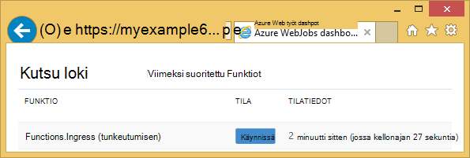
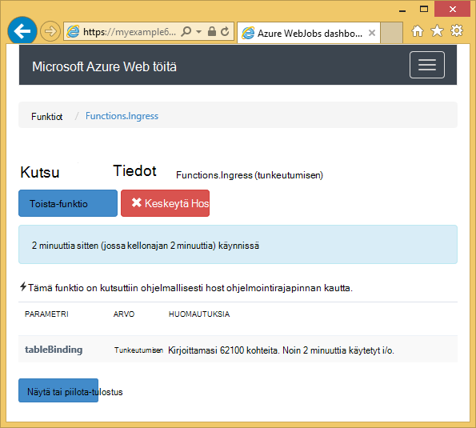
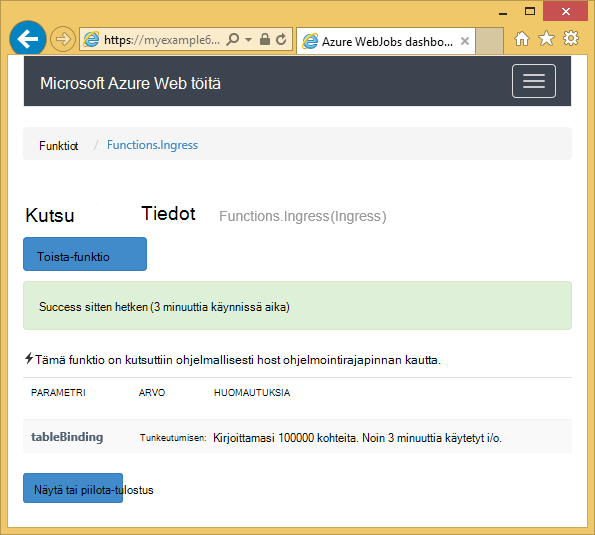

<properties 
    pageTitle="Voit käyttää WebJobs SDK Azure-taulukkotallennus" 
    description="Opettele käyttämään Azure-taulukkotallennus WebJobs SDK: N kanssa. Taulukoiden luominen, kohteiden lisääminen taulukoihin ja lukea olemassa olevat taulukot." 
    services="app-service\web, storage" 
    documentationCenter=".net" 
    authors="tdykstra" 
    manager="wpickett" 
    editor="jimbe"/>

<tags 
    ms.service="app-service-web" 
    ms.workload="web" 
    ms.tgt_pltfrm="na" 
    ms.devlang="dotnet" 
    ms.topic="article" 
    ms.date="06/01/2016" 
    ms.author="tdykstra"/>

# Voit käyttää WebJobs SDK Azure-taulukkotallennus

## Yleiskatsaus

Tässä oppaassa on C# MALLIKOODEJA, joka näyttää, miten lukemiseen ja kirjoittamiseen Azure tallennustilan taulukoita käyttämällä [WebJobs SDK](websites-dotnet-webjobs-sdk.md) versio 1.x.

Oppaan oletetaan, että tiedät, [kuinka voit luoda WebJob projektin Visual Studiossa yhteyden merkkijonoja, jotka osoittavat tallennustilan tilin](websites-dotnet-webjobs-sdk-get-started.md) tai [useiden tallennustilan tilit](https://github.com/Azure/azure-webjobs-sdk/blob/master/test/Microsoft.Azure.WebJobs.Host.EndToEndTests/MultipleStorageAccountsEndToEndTests.cs).
        
Osa Näytä koodikatkelmat `Table` määrite käytetyt toiminnot, jotka eivät [kutsutaan manuaalisesti](websites-dotnet-webjobs-sdk-storage-queues-how-to.md#manual)toisin sanoen jollakin käynnistimen määritteet. 

## Kohteiden lisääminen taulukkoon

Lisää kohteita taulukkoon `Table` määritteiden kanssa `ICollector<T>` tai `IAsyncCollector<T>` parametrin missä `T` määrittää kohteita, johon haluat lisätä rakenteen. Määritteen konstruktoria kestää parametrin, joka määrittää taulukon nimi. 

Lisää seuraavat koodin otosten `Person` *tunkeutumisen*-taulukon kohteiden.

        [NoAutomaticTrigger]
        public static void IngressDemo(
            [Table("Ingress")] ICollector<Person> tableBinding)
        {
            for (int i = 0; i < 100000; i++)
            {
                tableBinding.Add(
                    new Person() { 
                        PartitionKey = "Test", 
                        RowKey = i.ToString(), 
                        Name = "Name" }
                    );
            }
        }

Yleensä tyyppi käyttämällä `ICollector` johdetaan `TableEntity` tai toteuttaa `ITableEntity`, mutta siinä ei ole. Jommankumman seuraavista `Person` luokkien työ näkyvät edeltävän koodilla `Ingress` menetelmää.

        public class Person : TableEntity
        {
            public string Name { get; set; }
        }

        public class Person
        {
            public string PartitionKey { get; set; }
            public string RowKey { get; set; }
            public string Name { get; set; }
        }

Jos haluat käsitellä Azure tallennustilan API, voit lisätä `CloudStorageAccount` parametri menetelmän allekirjoitus.

## Reaaliaikainen seuranta

Koska tietojen tunkeutumisen Funktiot käsitellä usein suurista tietomääristä, WebJobs SDK Raporttinäkymät-ikkunan on reaaliaikainen seurantatiedot. **Kutsu Log** -osassa kerrotaan Jos funktio suoritetaan.

**Kutsu** tietosivu raportoi toiminnon edistyminen (kirjoitettu kohteiden määrä) samalla, kun se on käynnissä, ja voit keskeyttää sen mahdollisuuden. 

Kun toiminto on valmis, **Kutsun tiedot** -sivulla raportit kirjoitettu rivien määrä.

## Useiden kohteiden lukeminen taulukosta

Voit lukea taulukon `Table` määritteiden kanssa `IQueryable<T>` parametrin jossa kirjoittaa `T` johdetaan `TableEntity` tai toteuttaa `ITableEntity`.

Seuraava koodi malli lukee ja kirjaa kaikki rivit `Ingress` taulukkoon:
 
        public static void ReadTable(
            [Table("Ingress")] IQueryable<Person> tableBinding,
            TextWriter logger)
        {
            var query = from p in tableBinding select p;
            foreach (Person person in query)
            {
                logger.WriteLine("PK:{0}, RK:{1}, Name:{2}", 
                    person.PartitionKey, person.RowKey, person.Name);
            }
        }

### Yhden kohteen lukeminen taulukosta

Ei `Table` Määritekonstruktorilla, jonka avulla voit määrittää-osio ja rivin avaimen, kun haluat sitoa yhden taulukon kohteeseen kaksi muut parametrit.

Seuraava koodi malli lukee taulukkorivin varten `Person` kohteen osion avain ja rivin avaimen arvojen perusteella jonon viestin vastaanotettu:  

        public static void ReadTableEntity(
            [QueueTrigger("inputqueue")] Person personInQueue,
            [Table("persontable","{PartitionKey}", "{RowKey}")] Person personInTable,
            TextWriter logger)
        {
            if (personInTable == null)
            {
                logger.WriteLine("Person not found: PK:{0}, RK:{1}",
                        personInQueue.PartitionKey, personInQueue.RowKey);
            }
            else
            {
                logger.WriteLine("Person found: PK:{0}, RK:{1}, Name:{2}",
                        personInTable.PartitionKey, personInTable.RowKey, personInTable.Name);
            }
        }

`Person` Luokan tässä esimerkissä ei tarvitse ottaa käyttöön `ITableEntity`.

## .NET tallennustilan Ohjelmointirajapinnan käyttäminen suoraan taulukon käyttöä varten

Voit käyttää myös `Table` määritteiden kanssa `CloudTable` objektin joustavuutta käyttäminen taulukon.

Seuraava koodi malli käyttää `CloudTable` objekti yhden kohteen lisääminen *tunkeutumisen* taulukkoon. 
 
        public static void UseStorageAPI(
            [Table("Ingress")] CloudTable tableBinding,
            TextWriter logger)
        {
            var person = new Person()
                {
                    PartitionKey = "Test",
                    RowKey = "100",
                    Name = "Name"
                };
            TableOperation insertOperation = TableOperation.Insert(person);
            tableBinding.Execute(insertOperation);
        }

Lisätietoja käyttämisestä `CloudTable` objekti, katso, [miten voit käyttää .NET-taulukkotallennus](../storage/storage-dotnet-how-to-use-tables.md). 

## Aiheeseen liittyvät olevien toimintaohjeet artikkelin aiheita

Lisätietoja käsittelemisestä taulukon käsittely saatu jonon viestin tai WebJobs SDK skenaarioissa ei koske käsittely-taulukossa, katso, [miten voit käyttää Azure jonon tallennustilan WebJobs SDK: N kanssa](websites-dotnet-webjobs-sdk-storage-queues-how-to.md). 

Artikkelin aiheita ovat seuraavat:

* Asynkroninen Funktiot
* Useita kertoja
* Kaksivaiheista sulkeminen
* Käytä funktiota tekstissä WebJobs SDK määritteet
* Määritä SDK yhteyden merkkijonot koodi
* Määritä arvot WebJobs SDK konstruktori parametrit-koodi
* Funktion käynnistäminen manuaalisesti
* Kirjoita lokit

## Seuraavat vaiheet

Tässä oppaassa on tarjonnut MALLIKOODEJA, jotka esittävät yleisiä tilanteita, joissa Azure taulukoiden käsittelemisestä. Saat lisätietoja Azure WebJobs ja WebJobs SDK käyttäminen [Azure WebJobs suositellaan resurssit](http://go.microsoft.com/fwlink/?linkid=390226).
 
