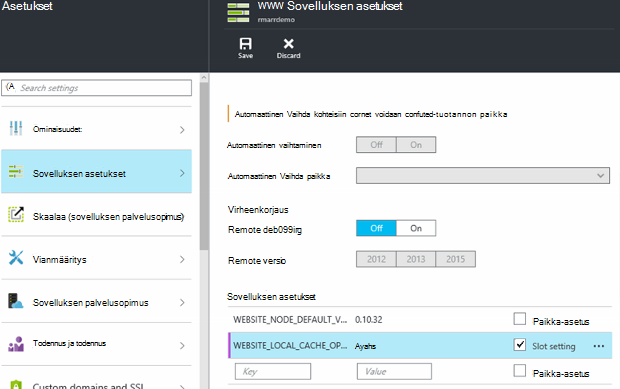

<properties
   pageTitle="Azure App palvelun paikallisen välimuistin yleiskatsaus | Microsoft Azure"
   description="Tässä artikkelissa käsitellään käyttöön, kokoa ja Azure App palvelun paikallisen välimuistin-ominaisuuden tilan kysely"
   services="app-service"
   documentationCenter="app-service"
   authors="SyntaxC4"
   manager="yochayk"
   editor=""
   tags="optional"
   keywords=""/>

<tags
   ms.service="app-service"
   ms.devlang="multiple"
   ms.topic="article"
   ms.tgt_pltfrm="na"
   ms.workload="na"
   ms.date="03/04/2016"
   ms.author="cfowler"/>

# <a name="azure-app-service-local-cache-overview"></a>Azure App palvelun paikallisen välimuistin yleiskatsaus

Azure web app-sisällön Azuren tallennustilaan on tallennettu, ja se on esiin kestävät tavalla kuin sisällön jakaminen. Tämä on tarkoitus käyttää erilaisia sovellukset ja on määritteet:  

* Sisällön jaetaan virtuaalikoneen (AM) useita kertoja web Appissa.
* Sisältö on kestävät ja muokata suorittamalla verkkosovelluksissa.
* Lokitiedostojen ja diagnostiikkatiedot tiedostot ovat valittavissa kohdasta jaetun sisällön samassa kansiossa.
* Uuden sisällön julkaiseminen suoraan päivittää sisällön kansio. Näet välittömästi samaa sisältöä palvelujen ohjauksen hallinta-sivuston ja käynnissä web-sovelluksen kautta (yleensä Kokeile toimintoja, kuten ASP.NET aloittaa web app-tiedoston tehdään muutoksia sisällön saaminen uudelleen).

Vaikka monet web Apps-sovellusten käyttöön jonkin tai kaikki näistä toiminnoista joitakin web Apps-sovellusten Tarvitsetko tehokas, vain luku-sisällön säilön he voivat suorittaa hyvin käytettävissä. Nämä sovellukset voi olla hyötyä tietyn paikallisen välimuistin AM esiintymästä.

Azure App palvelun paikallisen välimuistin-toiminto tarjoaa WWW-roolin näkymän sisältöä. Tämä sisältö on kirjoitus-mutta-hylkää välimuisti tallennustilan sisällön, joka on luotu asynkronisesti sivuston käynnistyksen yhteydessä. Kun välimuistin on valmis, sivuston on vaihdettu suorittamalla välimuistissa olevaa sisältöä. Käynnissä olevat paikallisen välimuistin Web Apps-sovellusten on seuraavat edut:

* He ovat ottaneet, viiveitä, ilmetä, kun he käyttävät sisällön Azure-tallennustilan.
* He ovat ottaneet tarvittavat päivitykset tai suunnittelematon vähämerkityksisten ja kaikki muut keskeytyksiä Azuren tallennustilaan kanssa, jotka ilmenevät palvelimissa, jotka vastaavat sisällön jakaminen.
* Heillä on vähemmän tallennustilan Jaa muutosten vuoksi sovellus käynnistyy.

## <a name="how-local-cache-changes-the-behavior-of-app-service"></a>Paikallisen välimuistin muutoksen App palvelun toimintaa

* Paikallisen välimuistin on kopio web Appin /site ja /siteextensions-kansioissa. Se luodaan web-sovelluksen käynnistys paikallisen AM-esiintymässä. Paikallisen välimuistin kohti web Appin koko on enintään 300 Mt oletusarvoisesti, mutta voit suurentaa sen enintään 1 Gigatavua.
* Paikallisen välimuistin on luku-ja kirjoitusoikeudet. Kuitenkin muutokset hylätään, kun web-sovelluksen käyttäjistä näennäiskoneiden tai saa käynnistetään uudelleen. Älä käytä paikallisen välimuistin, joihin voidaan tallentaa kriittisten tietojen sisällön kaupan sovelluksia varten.
* Web Apps-sovelluksissa voit jatkaa kirjoittamista lokitiedostot ja diagnostiikkatiedot tavalla kuin tällä hetkellä. Lokitiedostojen ja tiedot, mutta tallennetaan paikallisesti AM. Valitse ne kopioidaan päälle säännöllisesti jaetun sisällön kauppa. Jaetun sisällön Store kopio on parasta työmäärään – Kirjoita toisen puolen voi hävitä määräpäivä äkillinen kaatumisen AM esiintymän.
* Tällä web Apps-sovellukset, jotka käyttävät paikallisen välimuistin publish LogFiles ja tietojen kansioista kansiorakenne muutoksen. Tallennustilan publish LogFiles ja tietojen kansiot, jotka noudattavat "yksilöllinen" + aikaleiman nimeämismuoto ovat nyt alikansiot. Kaikki alikansiot vastaa AM esiintymän, josta web app on käytössä tai on suoritettu.  
* Web-sovelluksen avulla julkaisun järjestelmiä julkaisun muutokset voivat julkaista jaetun sisällön kauppa. Tämä on suunniteltu ominaisuus, koska haluamme julkaistun sisältö on kestävät. Web-sovelluksen paikallisen välimuistin päivittäminen on käynnistettävä uudelleen. Tämä näyttää kuin liiallinen vaiheessa? Jotta elinkaari saumattomasti, katso tämän artikkelin tiedot.
* Paikallisen välimuistin osoittaa D:\Home. D:\Local säilyvät tilapäinen AM tietyn tallennustilan osoittamalla.
* Palvelujen ohjauksen hallinta-sivuston sisällön oletusnäkymän säilyvät että jaetun sisällön kauppa.

## <a name="enable-local-cache-in-app-service"></a>Paikallisen välimuistin App palvelun ottaminen käyttöön

Voit määrittää paikallisen välimuistin yhdistelmän varattu sovelluksen asetusten avulla. Voit määrittää sovelluksen asetuksia seuraavilla tavoilla:

* [Azure portal](#Configure-Local-Cache-Portal)
* [Azure Resurssienhallinta](#Configure-Local-Cache-ARM)

### <a name="configure-local-cache-by-using-the-azure-portal"></a>Määrittää paikallisen välimuistin Azure-portaalissa
<a name="Configure-Local-Cache-Portal"></a>

Paikallisen välimuistin käyttöön kohden-web-sovelluksen peruste app tämän asetuksen avulla:`WEBSITE_LOCAL_CACHE_OPTION` = `Always`  



### <a name="configure-local-cache-by-using-azure-resource-manager"></a>Määrittää paikallisen välimuistin käyttämällä Azure resurssien hallinta
<a name="Configure-Local-Cache-ARM"></a>

```
...

{
    "apiVersion": "2015-08-01",
    "type": "config",
    "name": "appsettings",
    "dependsOn": [
        "[resourceId('Microsoft.Web/sites/', variables('siteName'))]"
    ],
    "properties": {
        "WEBSITE_LOCAL_CACHE_OPTION": "Always",
        "WEBSITE_LOCAL_CACHE_SIZEINMB": "300"
    }
}

...
```

## <a name="change-the-size-setting-in-local-cache"></a>Muuta paikallisen välimuistin kokoa-asetusta

Paikallisen välimuistin kokoa on oletusarvoisesti **300 Megatavua**. Tämä sisältää /site ja /siteextensions kansiot, jotka kopioidaan sisällön kaupasta sekä paikallisesti luotu lokit ja tietojen kansiot. Sovelluksen-asetuksen avulla voit lisätä rajoitusta, `WEBSITE_LOCAL_CACHE_SIZEINMB`. Voit suurentaa kokoa enintään **1 Gigatavua** (1 000 Mt) kohti web Appissa.

## <a name="best-practices-for-using-app-service-local-cache"></a>Sovelluksen palvelun paikallisen välimuistin parhaat käytännöt

On suositeltavaa, että käytät paikallisen välimuistin yhdessä [Väliaikaisen ympäristöissä](../app-service-web/web-sites-staged-publishing.md) -ominaisuus.

* Lisää _muistilappuja_ app asetus `WEBSITE_LOCAL_CACHE_OPTION` arvolla `Always` , **tuotannon** paikka. Jos käytät `WEBSITE_LOCAL_CACHE_SIZEINMB`, lisää se myös muistilappuja tuotannon paikka-asetukseksi.
* Luo **väliaikaisen** paikka ja julkaista väliaikaisen paikka. Et määritä yleensä väliaikaisen paikka, saumattoman muodosta-käyttöönotto-testi-elinkaari väliaikaisen, jos saat paikallisen välimuistin edut tuotannon vapaan paikallisen välimuistin avulla.
*   Testaa sivustosi vastaan väliaikaisen paikka.  
*   Kun olet valmis, Lähetä [Vaihda toiminnon](../app-service-web/web-sites-staged-publishing.md#to-swap-deployment-slots) vaiheet ja tuotannon paikkojen välillä.  
*   Yhden sormen asetuksia ovat nimi ja paikka muistilappuja. Niin väliaikaisen paikka saa vaihtaa paikkaa kyselyjä tuotannon, kun se Peri paikallisen välimuistin app-asetukset. Äskettäin vaihdetut tuotannon paikka suoritetaan paikallisen välimuistin muutaman minuutin kuluttua ja lämmitettävä paikka warmup osana vaihdon jälkeen. Niin paikan vaihtaminen päätyttyä tuotannon paikka toimii paikallisen välimuistin vastaan.

## <a name="frequently-asked-questions-faq"></a>Usein kysytyt kysymykset

### <a name="how-can-i-tell-if-local-cache-applies-to-my-web-app"></a>Mistä tiedän, koskeeko paikallisen välimuistin web App-sovellukseen?

Jos web Appissa on tehokas, luotettavia sisällön kaupan, ei käytä sisällön kaupan kirjoittaa suorituksen tärkeitä tietoja ja on pienempi kuin 1 Gigatavua kokonaiskoko, vastaus on "Kyllä"! Saat /site ja /siteextensions kansioiden yhteenlasketun koon, voit käyttää sivuston tunniste "Azure Web Apps levyn käyttö".  

### <a name="how-can-i-tell-if-my-site-has-switched-to-using-local-cache"></a>Mistä tiedän, jos oma sivusto on vaihdettu paikallisen välimuistin avulla?

Jos käytät paikallisen välimuistin-toiminnon vaiheet ympäristöjen kanssa, Vaihda-toiminto ei pääty, kunnes lämmitettävä paikallisen välimuistin. Voit tarkistaa, onko sivuston käynnissä paikallisen välimuistin vastaan, voit tarkistaa työntekijä prosessi-ympäristömuuttuja `WEBSITE_LOCALCACHE_READY`. [Työntekijän prosessin ympäristömuuttuja](https://github.com/projectkudu/kudu/wiki/Process-Threads-list-and-minidump-gcdump-diagsession#process-environment-variable) sivun ohjeita avulla voit käyttää useita kertoja työntekijä prosessi-ympäristömuuttuja.  

### <a name="i-just-published-new-changes-but-my-web-app-does-not-seem-to-have-them-why"></a>Voin julkaisemisen uusia muutoksia, mutta web App-sovelluksen ei vaikuta niiden. Miksi?

Jos web-sovelluksen käyttää paikallisen välimuistin, sinun on käynnistettävä uudelleen sivuston saat uusimmat muutokset. Etkö halua muutosten julkaiseminen tuotannon sivuston? Katso edellisen parhaat käytännöt-osan paikka-asetukset.

### <a name="where-are-my-logs"></a>Missä ovat omat lokit?

Paikallisen välimuistin ja näyttää erilaiselta lokit ja tietokansioita. Kuitenkin oman alikansiot rakenteen säilyy ennallaan, paitsi että alikansiot ovat nestled muodossa "AM yksilöllinen" + aikaleima-alikansioon.

### <a name="i-have-local-cache-enabled-but-my-web-app-still-gets-restarted-why-is-that-i-thought-local-cache-helped-with-frequent-app-restarts"></a>Minulla on otettu käyttöön paikallisen välimuistin, mutta web App-sovelluksen edelleenkään saa käynnistetään uudelleen. Miksi? Voin määritetty paikallisen välimuistin auttoi kanssa usein käytetyt sovellus käynnistyy.

Paikallisen välimuistin estää tallennustilan liittyvät web app käynnistyy. Web-sovelluksen voi silti muuttaminen käynnistyy suunnitellun infrastruktuurin päivitykset AM aikana. Yleistä sovellus käynnistyy, ilmenee paikallisen välimuistin käytössä on oltava vähemmän.
