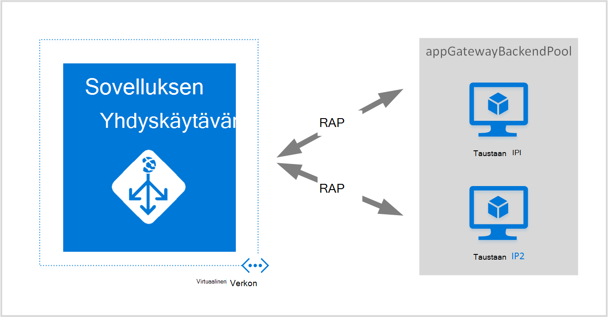
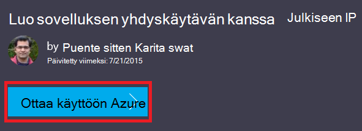
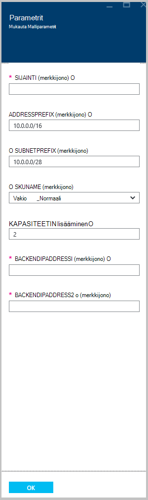

<properties
   pageTitle="Luo sovelluksen yhdyskäytävän Azure Resurssienhallinta mallien avulla | Microsoft Azure"
   description="Tällä sivulla on ohjeita voit luoda yhdyskäytävän Azure sovelluksen Azure Resurssienhallinta-mallin avulla"
   documentationCenter="na"
   services="application-gateway"
   authors="georgewallace"
   manager="carmonm"
   editor="tysonn"/>
<tags
   ms.service="application-gateway"
   ms.devlang="na"
   ms.topic="article"
   ms.tgt_pltfrm="na"
   ms.workload="infrastructure-services"
   ms.date="10/25/2016"
   ms.author="gwallace"/>

# Luo sovelluksen yhdyskäytävän Azure Resurssienhallinta-mallin avulla

> [AZURE.SELECTOR]
- [Azure portal](application-gateway-create-gateway-portal.md)
- [Azure Resurssienhallinta PowerShell](application-gateway-create-gateway-arm.md)
- [Azure perinteinen PowerShell](application-gateway-create-gateway.md)
- [Azure Resurssienhallinta-malli](application-gateway-create-gateway-arm-template.md)
- [Azure CLI](application-gateway-create-gateway-cli.md)

Azure sovelluksen yhdyskäytävä on kerroksen 7 kuormituksen. Se sisältää automaattisesti, suorituskyvyn reititys-pyyntöjen eri palvelinten välillä, olivatpa ne sitten cloud tai paikallisen. Sovelluksen yhdyskäytävän sisältää useita sovelluksen toimituksen ohjauskoneen (ADC) mukaan lukien HTTP kuormituksen tasaamisen, eväste perustuva istunnon affiniteetti, Secure Sockets Layer (SSL) purku mukautetun kunto keräysputkien usean sivuston tuki ja monista muista. Luettelo kaikista tuetut ominaisuudet etsimällä käy [Sovelluksen yhdyskäytävän yleiskatsaus](application-gateway-introduction.md)

Opit lataamisesta ja muokata aiemmin luotua Azure Resurssienhallinta-mallia GitHub-ja GitHub, PowerShell ja Azure-CLI mallin käyttöön.

Jos otat ainoastaan Azure Resurssienhallinta-mallin suoraan GitHub ilman muutoksia, siirry GitHub mallin käyttöön.

## Skenaario

Tässä tapauksessa menettelet seuraavasti:

- Voit luoda yhdyskäytävän sovelluksen kaksi esiintymää.
- Luo virtuaalisia verkko nimeltä VirtualNetwork1 varattu CIDR tekstialueen 10.0.0.0/16 kanssa.
- Luo nimi, joka käyttää 10.0.0.0/28 sen CIDR palkkina Appgatewaysubnet aliverkon.
- Kaksi määrittäminen aiemmin määritettyyn taustatietokantaan IP-osoitteet ladattava saldo WWW-palvelimien liikenteen. Mallin tässä esimerkissä taustatietokantaan IP-osoitteet on 10.0.1.10 ja 10.0.1.11.

>[AZURE.NOTE] Nämä asetukset ovat tämän mallin parametrit. Jos haluat mukauttaa mallia, voit muuttaa sääntöjä, kuuntelua ja, joka avautuu azuredeploy.json SSL.

## Lataa ja ymmärrät Azure Resurssienhallinta-malli

Voit ladata Azure Resurssienhallinta mallia virtual verkko- ja kahden aliverkon luominen GitHub, muutokset saattavat haluat ja käyttää sitä uudelleen. Käytä seuraavia ohjeita:

1. Siirry [sovelluksen Gatewayn luominen](https://github.com/Azure/azure-quickstart-templates/tree/master/101-application-gateway-create).
2. Valitse **azuredeploy.json**ja valitse sitten **raaka**.
3. Tallenna tiedosto tietokoneen paikalliseen kansioon.
4. Jos olet tutustunut Azure Resurssienhallinta malleja, siirry vaiheeseen 7.
5. Avaa tallentamaasi tiedostoa ja määritä **Parametrit** rivillä 5 sisältöä. Azure Resurssienhallinta Malliparametrien avulla paikkamerkin arvoja, jotka voi täyttää käyttöönoton aikana.

  	| Parametri | Kuvaus |
  	|---|---|
  	| **sijainti** | Azure alue, jossa sovellus yhdyskäytävä on luotu |
  	| **VirtualNetwork1** | Uusi virtual verkon nimi |
  	| **addressPrefix** | Osoitetilan virtual verkon CIDR-muodossa |
  	| **ApplicationGatewaysubnet** | Sovelluksen yhdyskäytävän aliverkon nimi |
  	| **subnetPrefix** | Sovelluksen yhdyskäytävän aliverkon CIDR estäminen |
  	| **skuname** | TUOTE esiintymän koon |
  	| **kapasiteetti** | Kerrat |
  	| **backendaddress1** | Ensimmäinen verkkopalvelin IP-osoite |
  	| **backendaddress2** | Toinen verkkopalvelin IP-osoite |

    >[AZURE.IMPORTANT] Azure GitHub ylläpidetään Resurssienhallinta-malleja voi muuttua ajan kuluessa. Varmista, että tarkistat ennen sen käyttämistä malli.

6. Tarkista **resurssit** -kohdassa sisältö ja huomaat seuraavasti:

    - **tyyppi**. Resurssin luomisen mallin tyyppi. Tässä tapauksessa tyyppi on **Microsoft.Network/applicationGateways**, joka edustaa sovelluksen-yhdyskäytävä.
    - **nimi**. Resurssin nimi. Huomaa **[parameters('applicationGatewayName')]**, mikä tarkoittaa, että nimi on syötteeksi itse tai parametrin tiedoston käyttöönoton aikana käyttö.
    - **Ominaisuudet**. Resurssin ominaisuudet luettelo. Tämä malli käyttää VPN- ja julkinen IP-osoite yhdyskäytävän luonnin aikana.

7. Siirry takaisin [https://github.com/Azure/azure-quickstart-templates/blob/master/101-application-gateway-create/](https://github.com/Azure/azure-quickstart-templates/blob/master/101-application-gateway-create).
8. Valitse **azuredeploy paremeters.json**ja valitse sitten **raaka**.
9. Tallenna tiedosto tietokoneen paikalliseen kansioon.
10. Avaa tallentamaasi tiedostoa ja Muokkaa parametrien arvot. Tässä skenaariossa on kuvattu sovelluksen yhdyskäytävän ottaa käyttöön seuraavat arvot.

        {
        "$schema": "http://schema.management.azure.com/schemas/2015-01-01/deploymentParameters.json#",
        {
        "location" : {
        "value" : "West US"
        },
        "addressPrefix": {
        "value": "10.0.0.0/16"
        },
        "subnetPrefix": {
        "value": "10.0.0.0/24"
        },
        "skuName": {
        "value": "Standard_Small"
        },
        "capacity": {
        "value": 2
        },
        "backendIpAddress1": {
        "value": "10.0.1.10"
        },
        "backendIpAddress2": {
        "value": "10.0.1.11"
        }
        }

11. Tallenna tiedosto. Voit testata JSON mallia ja parametri mallin avulla online JSON vahvistus työkaluja, kuten [JSlint.com](http://www.jslint.com/).

## Azure Resurssienhallinta-mallin käyttöön PowerShell-toiminnolla

Jos et ole aikaisemmin käyttänyt PowerShellin Azure, katso, [miten voit asentaa ja määrittää PowerShellin Azure](../powershell-install-configure.md) ja noudata ohjeita kirjautumiseen Azure ja valitse tilauksen.

### Vaihe 1

    Login-AzureRmAccount

### Vaihe 2

Tarkista tilaukset-tilin.

    Get-AzureRmSubscription

Sinua kehotetaan todentamismenetelmä tunnistetiedot.

### Vaihe 3

Valitse, mitä Azure tilauksistasi käyttämään.

    Select-AzureRmSubscription -Subscriptionid "GUID of subscription"

### Vaihe 4

Luo tarvittaessa resurssiryhmä **Uusi AzureResourceGroup** cmdlet-komennolla. Seuraavassa esimerkissä luodaan resurssiryhmä, eli AppgatewayRG Yhdysvaltojen Itä sijainti.

    New-AzureRmResourceGroup -Name AppgatewayRG -Location "East US"

Suorita **Uusi AzureRmResourceGroupDeployment** -cmdlet-komento asentavat uuden virtual verkon edellisen mallia ja parametri tiedostoja ladataan ja muokata.

    New-AzureRmResourceGroupDeployment -Name TestAppgatewayDeployment -ResourceGroupName AppgatewayRG `
        -TemplateFile C:\ARM\azuredeploy.json -TemplateParameterFile C:\ARM\azuredeploy-parameters.json

## Ottaa käyttöön Azure Resurssienhallinta-mallin avulla Azure-CLI

Käyttöönotto lataamasi käyttämällä Azure CLI Azure Resurssienhallinta-malli, noudata seuraavia ohjeita:

### Vaihe 1

Jos et ole aikaisemmin käyttänyt Azure CLI, katso lisätietoja artikkelista [asentaminen ja määrittäminen Azure-CLI](../xplat-cli-install.md) ja noudata ohjeita kohtaan, jossa valitaan Azure-tili ja tilauksen.

### Vaihe 2

Resurssienhallinta-tilassa, siirry **azure config tila** -komennon suorittaminen alla kuvatulla tavalla.

    azure config mode arm

Näin Odotettu tulos yllä-komennon:

    info:   New mode is arm

### Vaihe 3

Tarvittaessa voit luoda uusi resurssiryhmä **azure ryhmän luonti** -komennon suorittaminen alla kuvatulla tavalla. Huomaa komennon. Luettelon, kun tulos kerrotaan käytetyt parametrit. Lisätietoja resurssiryhmät käy [Azure resurssin hallinnassa: yleiskatsaus](../azure-resource-manager/resource-group-overview.md).

    azure group create -n appgatewayRG -l eastus

**-n (tai--nimi)**. Uusi resurssiryhmä nimi. Tässä tapauksessa on *appgatewayRG*.

**-l (tai--sijainti)**. Azure alue, jossa uusi resurssiryhmä on luotu. Tässä tapauksessa on *eastus*.

### Vaihe 4

Suorita **azure ryhmän käyttöönoton luominen** cmdlet-komento otetaan käyttöön uuden virtual verkon avulla mallin ja parametri tiedostoja ladataan ja muokata yläpuolella. Luettelon, kun tulos kerrotaan käytetyt parametrit.

    azure group deployment create -g appgatewayRG -n TestAppgatewayDeployment -f C:\ARM\azuredeploy.json -e C:\ARM\azuredeploy-parameters.json

## Ottaa käyttöön Azure Resurssienhallinta-mallin avulla napsauttamalla-,-käyttöönotto

Valitse-,-käyttöönotto on toinen tapa Azure Resurssienhallinta mallia. On helppo tapa käyttää malleja Azure-portaalissa.

### Vaihe 1

Siirry [Luo julkinen IP sovelluksen-Gatewaylle](https://azure.microsoft.com/documentation/templates/101-application-gateway-public-ip/).

### Vaihe 2

Valitse **Ota käyttöön Azure**.

### Vaihe 3

Täytä parametrit-portaalissa käyttöönottomalli ja valitse **OK**.

### Vaihe 4

Valitse **ehdot** ja valitse **Osta**.

### Vaihe 5

Valitse mukautettu käyttöönotto-sivu valitsemalla **Luo**.

## Seuraavat vaiheet

Jos haluat määrittää SSL purku-kohdassa [Configure sovelluksen yhdyskäytävän SSL purku](application-gateway-ssl.md).

Jos haluat määrittää sovelluksen yhdyskäytävän sisäinen kuormituksen käytettäväksi, katso [luominen sovelluksen yhdyskäytävän sisäinen kuormituksen (ILB) kanssa](application-gateway-ilb.md).

Jos haluat lisätietoja ladata vastatilin asetukset parempi, seuraavassa:

- [Azure kuormituksen](https://azure.microsoft.com/documentation/services/load-balancer/)
- [Azure liikenteen hallinta](https://azure.microsoft.com/documentation/services/traffic-manager/)
