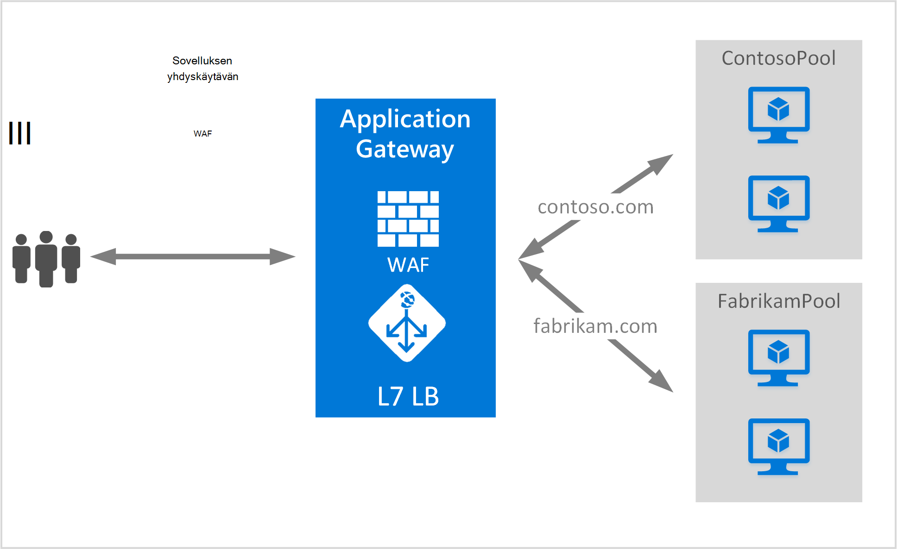

<properties
   pageTitle="Luo sovelluksen yhdyskäytävän isännöimiseen useita sivustoja | Microsoft Azure"
   description="Tällä sivulla on ohjeita voit luoda, määrittää Azure sovelluksen yhdyskäytävän isännöimiseen useita web-sovellusten samassa yhdyskäytävässä."
   documentationCenter="na"
   services="application-gateway"
   authors="amsriva"
   manager="rossort"
   editor="amsriva"/>
<tags
   ms.service="application-gateway"
   ms.devlang="na"
   ms.topic="article"
   ms.tgt_pltfrm="na"
   ms.workload="infrastructure-services"
   ms.date="10/25/2016"
   ms.author="amsriva"/>

# Sovelluksen yhdyskäytävän isännöimiseen useita web-sovellusten luominen

> [AZURE.SELECTOR]
- [Azure portal](application-gateway-create-multisite-portal.md)
- [Azure Resurssienhallinta PowerShell](application-gateway-create-multisite-azureresourcemanager-powershell.md)

Usean sivuston isännöintiä voit ottaa käyttöön useita web-sovelluksen sovelluksen samassa yhdyskäytävässä. Se on riippuvainen merkitsevä saapuvan HTTP-pyynnössä, voit selvittää, mitkä listener näytetä liikenne toimialuenimi. Kuuntelutoiminto ohjaa liikenne tarvittavat Taustajärjestelmä resurssivarantoon sitten yhdyskäytävän säännöt määrityksessä mukaisena. SSL käytössä verkkosovellusten sovelluksen yhdyskäytävän riippuvainen valitsemaan oikean listener web-tietoliikenteen palvelimen nimi merkintä (SNI)-tunniste. Yleisen käytön usean sivuston isännöintiä varten on eri sivustoon toimialueiden toisen taustatietokannan palvelimen jakavat haluat ladata. Saman päätoimialue useita alitoimialueita voi vastaavasti ylläpitää myös sovelluksen samassa yhdyskäytävässä.

## Skenaario

Seuraavassa esimerkissä sovelluksen yhdyskäytävän toimiva liikenne contoso.com ja fabrikam.com ja kaksi taustatietokantaan palvelimen jakavat: contoso palvelimen resurssivaranto ja fabrikam palvelimen resurssivarantoon. Host alitoimialueita, kuten app.contoso.com ja blog.contoso.com avulla voidaan vastaavat asetukset.

## Ennen aloittamista

1. Asentaa uusimman version Azure PowerShell cmdlet-komentojen avulla WWW-ympäristö asennusohjelma. Voit ladata ja asenna uusin versio **Windows PowerShell** -osiosta, [Lataa sivu](https://azure.microsoft.com/downloads/).
2. Lisätty taustatietokantaan resurssivarantoon sovelluksen yhdyskäytävän käyttämään palvelimet on oltava tai niiden päätepisteet luonut joko virtual verkon erillisessä aliverkon tai IP/VIP julkisen määritetty.

## Vaatimukset

- **Taustatietokantaan palvelimen resurssivarantoon:** Taustatietokannan-palvelimien IP-osoitteiden luettelo. IP-osoitteiden luettelossa tulee kuulua joko VPN-aliverkon tai pitäisi olla julkiseen IP-tai VIP. Voidaan myös täydellinen toimialuenimi.
- **Taustatietokantaan resurssivarantoon palvelinasetukset:** Jokaisen varanto on asetusten, kuten portin, protokolla ja evästeiden perustuva affiniteetti. Nämä asetukset on liitetty resurssivarantoon, ja niitä käytetään varannon kaikki palvelimiin.
- **Edusta portti:** Tämä portti on Julkinen portti, joka on avattu sovelluksen yhdyskäytävän. Liikenne käynnit portin ja sitten uudelleenohjataan taustatietokantaan-palvelimia.
- **Listener:** Kuuntelun edusta portti-protokolla (Http tai Https-arvot ovat kirjainkoko on merkitsevä), ja SSL-varmenteen nimi (Jos määrittäminen SSL purku). Usean sivuston käytössä sovelluksen yhdyskäytävien isäntänimi ja SNI ilmaisimet myös lisätään.
- **Säännön:** Säännön sitoo listener taustatietokantaan palvelimen resurssivarantoon, ja määrittää, mitkä taustatietokantaan palvelimen resurssivarantoon liikenne olisi ohjautuu, kun se käynnit tietyn listener.

## Sovelluksen Gatewayn luominen

Sovelluksen yhdyskäytävän luonnissa tarvittavat vaiheet ovat seuraavat:

1. Luo resurssiryhmä resurssien hallinta.
2. Luo virtual verkon aliverkosta ja sovelluksen yhdyskäytävän julkiseen IP.
3. Luo sovelluksen yhdyskäytävän kokoonpano-objekti.
4. Luo sovelluksen yhdyskäytävän yritysresurssi.

## Luoda Resurssiryhmän resurssien hallinta

Varmista, että käytät PowerShellin Azure uusimman version. Lisätietoja on saatavana [Windows PowerShellin resurssien hallinta](../powershell-azure-resource-manager.md).

### Vaihe 1

Azure kirjautuminen

    Login-AzureRmAccount

Sinua kehotetaan todentamismenetelmä tunnistetiedot.

### Vaihe 2

Tarkista tilaukset-tilin.

    Get-AzureRmSubscription

### Vaihe 3

Valitse, mitä Azure tilauksistasi käyttämään.

    Select-AzureRmSubscription -SubscriptionName "Name of subscription"

### Vaihe 4

Resurssiryhmä (ohita tämä vaihe, jos käytät aiemmin resurssiryhmä) luominen

    New-AzureRmResourceGroup -Name appgw-RG -location "West US"

Vaihtoehtoisesti voit myös luoda resurssiryhmä sovelluksen Gatewayn tunnisteet:

    $resourceGroup = New-AzureRmResourceGroup -Name appgw-RG -Location "West US" -Tags @{Name = "testtag"; Value = "Application Gateway multiple site"}

Azure Resurssienhallinta edellyttää, että kaikki resurssiryhmät, valitse sijainti. Tämä sijainti käytetään oletussijainti resurssien resurssin kyseisen ryhmän. Varmista, että kaikki komennot, voit luoda yhdyskäytävän sovelluksen saman resurssiryhmä.

Yllä olevassa esimerkissä luomaasi resurssiryhmän nimeltä "appgw-RG" ja "Länsi US" sijainti.

>[AZURE.NOTE] Jos haluat määrittää mukautetun näytteenottimen sovelluksen Gateway-kohdassa [Luo mukautettu keräysputkien PowerShell-toiminnolla sovelluksen-Gatewaylle](application-gateway-create-probe-ps.md). Sivustossa [mukautettuja keräysputkien ja kunnon valvonta](application-gateway-probe-overview.md) lisätietoja.

## Luo virtuaalisia verkko- ja aliverkosta

Seuraavassa esimerkissä esitetään luomisesta virtual verkon resurssien hallinnan avulla. Tässä vaiheessa luodaan kahden aliverkon. Ensimmäinen aliverkon on sovelluksen yhdyskäytävän itse. Sovelluksen yhdyskäytävän tarvitaan oma aliverkon pitoon sen esiintymät. Vain sovelluksen verkkotunnukset voidaan ottaa käyttöön kyseisen aliverkon. Toinen aliverkon käytetään pidä sovelluksen Taustajärjestelmä-palvelimiin.

### Vaihe 1

Määritä osoite alueen 10.0.0.0/24 aliverkon muuttuja, jota käytetään sovelluksen yhdyskäytävän pitkään.

    $subnet = New-AzureRmVirtualNetworkSubnetConfig -Name appgatewaysubnet -AddressPrefix 10.0.0.0/24

### Vaihe 2

Määritä osoite alueen 10.0.1.0/24 käytettävän taustatietokannan jakavat subnet2-muuttuja.

    $subnet2 = New-AzureRmVirtualNetworkSubnetConfig -Name backendsubnet -AddressPrefix 10.0.1.0/24

### Vaihe 3

Luo virtuaalisia verkko nimeltä "appgwvnet" resurssin ryhmän "appgw-rg" etuliite 10.0.0.0/16 käyttäminen aliverkon 10.0.0.0/24 Länsi US alue ja 10.0.1.0/24.

    $vnet = New-AzureRmVirtualNetwork -Name appgwvnet -ResourceGroupName appgw-RG -Location "West US" -AddressPrefix 10.0.0.0/16 -Subnet $subnet,$subnet2

### Vaihe 4

Määritä aliverkon muuttujan seuraavat vaiheet, joka luo sovelluksen-yhdyskäytävä.

    $appgatewaysubnet = Get-AzureRmVirtualNetworkSubnetConfig -Name appgatewaysubnet -VirtualNetwork $vnet
    $backendsubnet = Get-AzureRmVirtualNetworkSubnetConfig -Name backendsubnet -VirtualNetwork $vnet

## Luo edusta määritysten julkiseen IP-osoite

Luo julkinen IP-resurssin resurssin ryhmän "appgw-rg" Länsi US alue "publicIP01".

    $publicip = New-AzureRmPublicIpAddress -ResourceGroupName appgw-RG -name publicIP01 -location "West US" -AllocationMethod Dynamic

IP-osoite määritetään sovelluksen yhdyskäytävän palvelun käynnistyessä.

## Luo sovelluksen yhdyskäytävän määritys

Ennen kuin luot sovelluksen yhdyskäytävä on määritettävä kaikki määritettävät kohteet. Seuraavat vaiheet Luo määritettävät kohteet, joita tarvitaan sovelluksen yhdyskäytävän resurssin.

### Vaihe 1

Luo sovelluksen yhdyskäytävän IP määritys nimeltä "gatewayIP01". Sovelluksen yhdyskäytävän käynnistyessä vastataan aliverkosta, joka on määritetty IP-osoite ja reitittää verkkoliikenteen taustatietokantaan IP-ryhmän IP-osoitteisiin. Ota huomioon, että jokaiselle esiintymälle on yksi IP-osoite.

    $gipconfig = New-AzureRmApplicationGatewayIPConfiguration -Name gatewayIP01 -Subnet $appgatewaysubnet

### Vaihe 2

Määritä taustatietokantaan IP-osoiteryhmän nimeltä "pool01" ja "pool2" IP-osoitteita "10.0.1.100, 10.0.1.101,10.0.1.102" "pool1" ja "10.0.1.103 10.0.1.104, 10.0.1.105", "pool2".

    $pool1 = New-AzureRmApplicationGatewayBackendAddressPool -Name pool01 -BackendIPAddresses 10.0.1.100, 10.0.1.101, 10.0.1.102
    $pool2 = New-AzureRmApplicationGatewayBackendAddressPool -Name pool02 -BackendIPAddresses 10.0.1.103, 10.0.1.104, 10.0.1.105

Tässä esimerkissä on kaksi taustatietokantaan jakavat reitittää verkkoliikenteen sivusto perusteella. Yhteen resurssivarantoon vastaanottaa liikenne "contoso.com"-sivustosta ja muut ryhmän vastaanottaa liikenne "fabrikam.com"-sivustosta. Sinun on korvaa edellisen IP-osoitteet, voit lisätä oman sovelluksen IP-osoite päätepisteet. Tekstin näyttäminen sisäisiä IP-osoitteita voi käyttää myös julkiseen IP-osoitteet, FQDN tai AM NIC Taustajärjestelmä esiintymien. Käytä "-BackendFQDNs" PowerShellin ja määritä sen sijaan, että IP-osoitteet täydelliset toimialuenimet-parametria.

### Vaihe 3

Sovelluksen yhdyskäytävän asetus "poolsetting01" ja "poolsetting02" määrittäminen taustatietokantaan resurssivarantoon kuormituksen-verkkoliikenteelle. Tässä esimerkissä voit määrittää taustatietokantaan jakavat eri taustatietokantaan resurssivarantoon asetukset. Taustatietokannan kunkin ryhmän voi olla oma taustatietokantaan resurssivarantoon-asetus.

    $poolSetting01 = New-AzureRmApplicationGatewayBackendHttpSettings -Name "besetting01" -Port 80 -Protocol Http -CookieBasedAffinity Disabled -RequestTimeout 120
    $poolSetting02 = New-AzureRmApplicationGatewayBackendHttpSettings -Name "besetting02" -Port 80 -Protocol Http -CookieBasedAffinity Enabled -RequestTimeout 240

### Vaihe 4

Määritä edusta IP julkiseen IP-päätepiste.

    $fipconfig01 = New-AzureRmApplicationGatewayFrontendIPConfig -Name "frontend1" -PublicIPAddress $publicip

### Vaihe 5

Määritä sovelluksen Gatewayn edusta-portti.

    $fp01 = New-AzureRmApplicationGatewayFrontendPort -Name "fep01" -Port 443

### Vaihe 6

Määrittää kahden SSL-varmenteita kaksi sivustot tukemaan tässä esimerkissä tarkastellaan. Yksi varmenne on contoso.com liikenteen ja toinen on fabrikam.com tietoliikenteen. Nämä varmenteet on oltava myöntänyt verkkosivustojen sertifikaatin myöntäjän. Itse allekirjoitetun varmenteet ovat tuettuja, mutta ei suositella tuotannon tietoliikenteen.

    $cert01 = New-AzureRmApplicationGatewaySslCertificate -Name contosocert -CertificateFile <file path> -Password <password>
    $cert02 = New-AzureRmApplicationGatewaySslCertificate -Name fabrikamcert -CertificateFile <file path> -Password <password>

### Vaihe 7: ssä

Määrittää kahden kuuntelijoita kaksi verkkosivustojen tässä esimerkissä. Tässä vaiheessa määrittää julkisen IP-osoite, portin ja vastaanottaa saapuvan liikenteen host kuuntelijoita. HostName parametri tarvitaan usean sivuston tuen ja määritä haluamasi sivustoon, jonka liikenne vastaanotetaan. RequireServerNameIndication parametrin arvoksi true sivustoja, jotka tarvitsevat tukea SSL-usean Host (isäntä)-ympäristössä. SSL-tuki on tehtävä, jos haluat myös määrittää SSL-varmenne, jota käytetään tietoliikenteen, web-sovelluksen. FrontendIPConfiguration, FrontendPort ja HostName yhdistelmän on oltava yksilöllinen kuuntelija. Kunkin listener tukee yksi varmenne.

    $listener01 = New-AzureRmApplicationGatewayHttpListener -Name "listener01" -Protocol Https -FrontendIPConfiguration $fipconfig01 -FrontendPort $fp01 -HostName "contoso11.com" -RequireServerNameIndication true  -SslCertificate $cert01
    $listener02 = New-AzureRmApplicationGatewayHttpListener -Name "listener02" -Protocol Https -FrontendIPConfiguration $fipconfig01 -FrontendPort $fp01 -HostName "fabrikam11.com" -RequireServerNameIndication true -SslCertificate $cert02

### Vaihe 8

Luo kaksi säännön asetus kaksi verkkosovellusten tässä esimerkissä. Säännön sitoo yhdessä kuuntelijoita, Taustajärjestelmä jakavat ja http-asetukset. Tässä vaiheessa määrittää sovelluksen yhdyskäytävän käyttämään Basic reititys säännön, yhteen kunkin sivuston. Kunkin sivuston liikenteen sen määritetyn listener vastaanottanut ja ohjataan sitten määritetyn Taustajärjestelmä-varanto, määritetty BackendHttpSettings ominaisuuksia käyttämällä.

    $rule01 = New-AzureRmApplicationGatewayRequestRoutingRule -Name "rule01" -RuleType Basic -HttpListener $listener01 -BackendHttpSettings $poolSetting01 -BackendAddressPool $pool1
    $rule02 = New-AzureRmApplicationGatewayRequestRoutingRule -Name "rule02" -RuleType Basic -HttpListener $listener02 -BackendHttpSettings $poolSetting02 -BackendAddressPool $pool2

### Vaihe 9

Määritä esiintymät ja koko sovelluksen yhdyskäytävän määrän.

    $sku = New-AzureRmApplicationGatewaySku -Name "Standard_Medium" -Tier Standard -Capacity 2

## Sovelluksen Gatewayn luominen

Voit luoda yhdyskäytävän sovelluksen kaikkien määritysten objektien edellä kuvatut toimet.

    $appgw = New-AzureRmApplicationGateway -Name appgwtest -ResourceGroupName appgw-RG -Location "West US" -BackendAddressPools $pool1,$pool2 -BackendHttpSettingsCollection $poolSetting01, $poolSetting02 -FrontendIpConfigurations $fipconfig01 -GatewayIpConfigurations $gipconfig -FrontendPorts $fp01 -HttpListeners $listener01, $listener02 -RequestRoutingRules $rule01, $rule02 -Sku $sku -SslCertificates $cert01, $cert02

>[AZURE.IMPORTANT] Sovelluksen yhdyskäytävän valmistelu on pitkä käynnissä toiminto ja saattaa kestää kauan.

## Hanki sovellus yhdyskäytävän DNS-nimi

Kun yhdyskäytävä on luotu, seuraava vaihe on viestintään edusta määrittämiseen. Käytettäessä julkiseen IP-sovelluksen yhdyskäytävän edellyttää dynaamisesti määritetty DNS-nimi, joka ei ole helpossa muodossa. Jotta loppukäyttäjät näppäintä sovelluksen yhdyskäytävän CNAME-tietueen avulla voidaan osoittamaan julkisen päätepisteen sovelluksen yhdyskäytävän. [Mukautetun toimialuenimi Azure-tietokannassa määrittäminen](../cloud-services/cloud-services-custom-domain-name-portal.md). Voit tehdä tämän noutaa tiedot sovelluksen yhdyskäytävän ja sen liittyvät IP/DNS-nimen PublicIPAddress-elementin, joka on liitetty sovelluksen yhdyskäytävän avulla. Sovelluksen yhdyskäytävän DNS-nimeä käytetään luomaan CNAME-tietue, joka osoittaa kahden verkkosovellusten DNS-nimeä. A-tietueiden käyttö ei suositella, koska VIP voivat muuttua uudelleenkäynnistyksen sovelluksen yhdyskäytävän.
    
    Get-AzureRmPublicIpAddress -ResourceGroupName appgw-RG -Name publicIP01
        
    Name                     : publicIP01
    ResourceGroupName        : appgw-RG
    Location                 : westus
    Id                       : /subscriptions/<subscription_id>/resourceGroups/appgw-RG/providers/Microsoft.Network/publicIPAddresses/publicIP01
    Etag                     : W/"00000d5b-54ed-4907-bae8-99bd5766d0e5"
    ResourceGuid             : 00000000-0000-0000-0000-000000000000
    ProvisioningState        : Succeeded
    Tags                     : 
    PublicIpAllocationMethod : Dynamic
    IpAddress                : xx.xx.xxx.xx
    PublicIpAddressVersion   : IPv4
    IdleTimeoutInMinutes     : 4
    IpConfiguration          : {
                                 "Id": "/subscriptions/<subscription_id>/resourceGroups/appgw-RG/providers/Microsoft.Network/applicationGateways/appgwtest/frontendIP
                               Configurations/frontend1"
                               }
    DnsSettings              : {
                                 "Fqdn": "00000000-0000-xxxx-xxxx-xxxxxxxxxxxx.cloudapp.net"
                               }

## Seuraavat vaiheet

Lue, miten voit suojata artikkelissa [Application](application-gateway-webapplicationfirewall-overview.md) Gatewayn - Web-sovelluksen palomuuri-sivuston käyttäminen