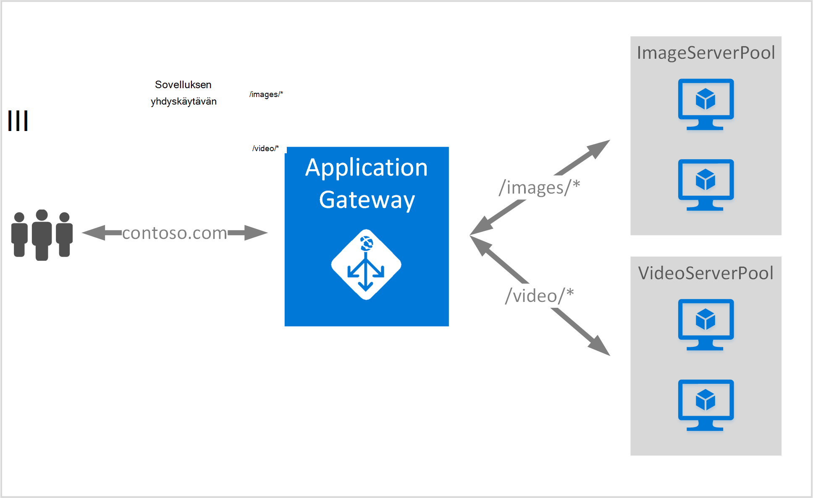

<properties
   pageTitle="Sovelluksen-yhdyskäytävän URL-Osoitteen Reitityssääntöjen luominen | Microsoft Azure"
   description="Tällä sivulla on ohjeita voit luoda, määrittää Azure sovelluksen-yhdyskäytävän Reitityssääntöjen URL-osoite"
   documentationCenter="na"
   services="application-gateway"
   authors="georgewallace"
   manager="jdial"
   editor="tysonn"/>
<tags
   ms.service="application-gateway"
   ms.devlang="na"
   ms.topic="article"
   ms.tgt_pltfrm="na"
   ms.workload="infrastructure-services"
   ms.date="10/25/2016"
   ms.author="gwallace"/>

# Luo sovelluksen yhdyskäytävän käyttämällä polku-pohjainen reititys 

> [AZURE.SELECTOR]
- [Azure portal](application-gateway-create-url-route-portal.md)
- [Azure Resurssienhallinta PowerShell](application-gateway-create-url-route-arm-ps.md)

URL-Osoitteen polku-pohjainen reititys avulla voit yhdistää tiet Http-pyyntö URL-polku perusteella. Se tarkistaa, onko määritetty sovelluksen yhdyskäytävän URL-luetteloiden taustatietokantaan resurssivarantoon reitin ja Lähetä verkkoliikenteen määritetyn taustatietokantaan resurssivarantoon. Yleisen käytön URL-pohjaiset reitittämiseen on eri sisältötyyppien toisen taustatietokannan palvelimen jakavat haluat ladata.

Uuden säännön tyyppi URL-pohjaiset reititys esitellään sovelluksen yhdyskäytävä. Sovelluksen yhdyskäytävä on kaksi säännön: perustiedot ja PathBasedRouting. Perustietoja sääntötyyppi taustatietokantaan jakavat aikana PathBasedRouting lisäksi PYÖRISTÄ-funktiota Mikko jakauman pyöreän pöydän-palvelu sisältää, on myös polku malli pyyntö URL-osoitteen huomioon aikana valitsemalla Taustajärjestelmä resurssivarantoon.

>[AZURE.IMPORTANT] PathPattern: Polku kuviot vastaamaan luettelo. Kunkin alettava / ja ainoa paikka "\*" sallitaan on lopussa. Kelvollinen esimerkit /xyz /xyz* tai /xyz/*. Fed polku matcher merkkijono sisältää tekstiä ensimmäisen jälkeen "?" tai "#" ja merkit eivät ole sallittuja. 

## Skenaario
Seuraavassa esimerkissä sovelluksen yhdyskäytävän toimiva contoso.com liikenteen ja kaksi taustatietokantaan palvelimen jakavat: video palvelimen resurssivaranto ja kuvan palvelimen resurssivarantoon.

Pyyntö http://contoso.com/image* reititetään kuva palvelimen resurssivarantoon (pool1) ja http://contoso.com/video* reititetään videon palvelimen sovellussarjan (pool2). Oletusarvoinen palvelimen resurssivarantoon (pool1) on valittuna, jos mikään polku kuviot vastaa.

## Ennen aloittamista

1. Asentaa uusimman version Azure PowerShell cmdlet-komentojen avulla WWW-ympäristö asennusohjelma. Voit ladata ja asenna uusin versio **Windows PowerShell** -osiosta, [Lataa sivu](https://azure.microsoft.com/downloads/).
2. Voit luoda VPN ja aliverkon sovelluksen Gatewayn. Varmista, että cloud ominaisuuksissa eikä näennäiskoneiden on käytössä aliverkon. VPN-osoitteiden on oltava sovelluksen yhdyskäytävän yksinään.
3. Taustatietokannan resurssivarantoon sovelluksen yhdyskäytävän käyttämään lisätään palvelimet on oltava tai niiden päätepisteet luonut virtual verkossa tai IP/VIP julkisen määritetty kanssa.

## Mikä on luotava sovelluksen yhdyskäytävän?

- **Taustatietokantaan palvelimen resurssivarantoon:** Taustatietokannan-palvelimien IP-osoitteiden luettelo. IP-osoitteiden luettelossa tulee kuulua joko VPN-aliverkon tai pitäisi olla julkiseen IP-tai VIP.
- **Taustatietokantaan resurssivarantoon palvelinasetukset:** Jokaisen varanto on asetusten, kuten portin, protokolla ja evästeiden perustuva affiniteetti. Nämä asetukset on liitetty resurssivarantoon, ja niitä käytetään varannon kaikki palvelimiin.
- **Edusta portti:** Tämä portti on Julkinen portti, joka on avattu sovelluksen yhdyskäytävän. Liikenne käynnit portin ja sitten uudelleenohjataan taustatietokantaan-palvelimia.
- **Listener:** Kuuntelun edusta portti-protokolla (Http tai Https-kirjainkoko on merkitsevä), ja SSL-varmenteen nimi (Jos määrittäminen SSL purku).
- **Säännön:** Säännön sitoo listener taustatietokantaan server-ryhmän ja määrittää, mitkä taustatietokantaan palvelimen resurssivarantoon liikenne olisi ohjautuu, kun se käynnit tietyn listener.

## Sovelluksen Gatewayn luominen

Azure perinteinen ja Azure Resurssienhallinta välinen ero on siinä järjestyksessä, jossa luot sovelluksen yhdyskäytävän ja kohteista, jotka on määritettävä.

Resurssien hallinnan kaikki kohteet, jotka helpottavat sovelluksen yhdyskäytävä on määritetty erikseen ja ladata yhteen, kun haluat luoda sovelluksen yhdyskäytävän resurssia.

Seuraavassa on ohjeet, joita tarvitaan sovelluksen Gatewayn luominen:

1. Luo resurssiryhmä resurssien hallinta.
2. VPN, aliverkon ja julkiseen IP sovelluksen Gatewayn luominen.
3. Luo sovelluksen yhdyskäytävän kokoonpano-objekti.
4. Luo sovelluksen yhdyskäytävän yritysresurssi.

## Luoda Resurssiryhmän resurssien hallinta

Varmista, että käytät PowerShellin Azure uusimman version. Lisätietoja on saatavana [Windows PowerShellin resurssien hallinta](../powershell-azure-resource-manager.md).

### Vaihe 1

Azure kirjautuminen

    Login-AzureRmAccount

Sinua kehotetaan todentamismenetelmä tunnistetiedot. 

### Vaihe 2

Tarkista tilaukset-tilin.

    Get-AzureRmSubscription

### Vaihe 3

Valitse, mitä Azure tilauksistasi käyttämään.  

    Select-AzureRmSubscription -Subscriptionid "GUID of subscription"

### Vaihe 4

Resurssiryhmä (ohita tämä vaihe, jos käytät aiemmin resurssiryhmä) luominen

    New-AzureRmResourceGroup -Name appgw-RG -Location "West US"

Vaihtoehtoisesti voit myös luoda resurssiryhmä sovelluksen Gatewayn tunnisteet:
    
    $resourceGroup = New-AzureRmResourceGroup -Name appgw-RG -Location "West US" -Tags @{Name = "testtag"; Value = "Application Gateway URL routing"} 

Azure Resurssienhallinta edellyttää, että kaikki resurssiryhmät, valitse sijainti. Tämä käytetään oletussijainti resurssien resurssin kyseisen ryhmän. Varmista, että kaikki komennot, voit luoda yhdyskäytävän sovelluksen saman resurssiryhmä.

Yllä olevassa esimerkissä luomaasi nimeltä "appgw RG" ja "Länsi US" sijainnin resurssiryhmä.

>[AZURE.NOTE] Jos haluat määrittää mukautetun näytteenottimen sovelluksen Gateway-kohdassa [Luo mukautettu keräysputkien PowerShell-toiminnolla sovelluksen-Gatewaylle](application-gateway-create-probe-ps.md). Tutustu [mukautetun keräysputkien ja kunnon seuranta](application-gateway-probe-overview.md) .

## Luo virtuaalisia verkko- ja sovelluksen yhdyskäytävän aliverkon

Seuraavassa esimerkissä esitetään luomisesta virtual verkon resurssien hallinnan avulla.

### Vaihe 1

Määritä osoite alueen 10.0.0.0/24 aliverkon muuttujan voidaan luoda virtuaalisia verkkoon.

    $subnet = New-AzureRmVirtualNetworkSubnetConfig -Name subnet01 -AddressPrefix 10.0.0.0/24

### Vaihe 2

Luo virtuaalisia verkko nimeltä "appgwvnet" resurssin ryhmän "appgw-rg" etuliite 10.0.0.0/16 käyttäminen aliverkon 10.0.0.0/24 Länsi US alue.

    $vnet = New-AzureRmVirtualNetwork -Name appgwvnet -ResourceGroupName appgw-RG -Location "West US" -AddressPrefix 10.0.0.0/16 -Subnet $subnet

### Vaihe 3

Määritä aliverkon muuttujan seuraavat vaiheet, joka luo sovelluksen-yhdyskäytävä.

    $subnet=$vnet.Subnets[0]

## Luo edusta määritysten julkiseen IP-osoite

Luo julkinen IP-resurssin resurssin ryhmän "appgw-rg" Länsi US alue "publicIP01".

    $publicip = New-AzureRmPublicIpAddress -ResourceGroupName appgw-RG -name publicIP01 -location "West US" -AllocationMethod Dynamic

IP-osoite määritetään sovelluksen yhdyskäytävän palvelun käynnistyessä.

## Luo sovelluksen yhdyskäytävän määritys

Kaikki määritettävät kohteet on määritettävä, ennen kuin luot sovelluksen yhdyskäytävän. Seuraavat vaiheet Luo määritettävät kohteet, joita tarvitaan sovelluksen yhdyskäytävän resurssin.

### Vaihe 1

Luo sovelluksen yhdyskäytävän IP määritys nimeltä "gatewayIP01". Sovelluksen yhdyskäytävän käynnistyessä vastataan aliverkosta, joka on määritetty IP-osoite ja reitittää verkkoliikenteen taustatietokantaan IP-ryhmän IP-osoitteisiin. Ota huomioon, että jokaiselle esiintymälle on yksi IP-osoite.

    $gipconfig = New-AzureRmApplicationGatewayIPConfiguration -Name gatewayIP01 -Subnet $subnet

### Vaihe 2

Määrittäminen taustatietokantaan IP-osoiteryhmän nimeltä "pool01" ja "pool2" IP-osoitteita "134.170.185.46, 134.170.188.221,134.170.185.50", "pool1" ja "134.170.186.46, 134.170.189.221,134.170.186.50", "pool2".

    $pool1 = New-AzureRmApplicationGatewayBackendAddressPool -Name pool01 -BackendIPAddresses 134.170.185.46, 134.170.188.221,134.170.185.50

    $pool2 = New-AzureRmApplicationGatewayBackendAddressPool -Name pool02 -BackendIPAddresses 134.170.186.46, 134.170.189.221,134.170.186.50

Tässä esimerkissä on kaksi taustatietokantaan jakavat reitittää verkkoliikenteen URL-polku perusteella. Yhteen resurssivarantoon vastaanottaa liikenne URL-polku "/ video- ja muut ryhmän vastaan tietoliikenteen polku" / image ". Korvaa edellisen IP-osoitteet, voit lisätä oman sovelluksen IP-osoite päätepisteet. 

### Vaihe 3

Sovelluksen yhdyskäytävän asetus "poolsetting01" ja "poolsetting02" määrittäminen taustatietokantaan resurssivarantoon kuormituksen-verkkoliikenteelle. Tässä esimerkissä voit määrittää taustatietokantaan jakavat eri taustatietokantaan resurssivarantoon asetukset. Taustatietokannan kunkin ryhmän voi olla oma taustatietokantaan resurssivarantoon-asetus.

    $poolSetting01 = New-AzureRmApplicationGatewayBackendHttpSettings -Name "besetting01" -Port 80 -Protocol Http -CookieBasedAffinity Disabled -RequestTimeout 120

    $poolSetting02 = New-AzureRmApplicationGatewayBackendHttpSettings -Name "besetting02" -Port 80 -Protocol Http -CookieBasedAffinity Enabled -RequestTimeout 240

### Vaihe 4

Määritä edusta IP julkiseen IP-päätepiste.

    $fipconfig01 = New-AzureRmApplicationGatewayFrontendIPConfig -Name "frontend1" -PublicIPAddress $publicip

### Vaihe 5 

Määritä sovelluksen Gatewayn edusta-portti.

    $fp01 = New-AzureRmApplicationGatewayFrontendPort -Name "fep01" -Port 80
### Vaihe 6

Määritä kuuntelua. Tässä vaiheessa määrittää kuuntelua julkiseen IP-osoite ja portin vastaanottamaan saapuvaa verkkoliikennettä. 
 
    $listener = New-AzureRmApplicationGatewayHttpListener -Name "listener01" -Protocol Http -FrontendIPConfiguration $fipconfig01 -FrontendPort $fp01

### Vaihe 7: ssä 

Määritä URL-Osoitteen säännön polut taustatietokantaan jakavat. Tässä vaiheessa määrittää käyttää sovelluksen yhdyskäytävän voit määrittää URL-polku ja mitkä taustatietokantaan resurssivarantoon liitetään saapuvan liikenteen yhdistämisen suhteellinen polku.

Alla olevassa esimerkissä Luo kaksi sääntöä: yhteen "/ kuva /" polku reitittää liikenteen taustatietokantaan "pool1" ja "/ video /" polku reitittää liikenteen taustatietokantaan "pool2" toinen.
    
    $imagePathRule = New-AzureRmApplicationGatewayPathRuleConfig -Name "pathrule1" -Paths "/image/*" -BackendAddressPool $pool1 -BackendHttpSettings $poolSetting01

    $videoPathRule = New-AzureRmApplicationGatewayPathRuleConfig -Name "pathrule2" -Paths "/video/*" -BackendAddressPool $pool2 -BackendHttpSettings $poolSetting02

Säännön polku kartta-määritys määrittää oletusarvon taustatietokantaan osoite resurssivarantoon myös, jos polku ei vastaa mitään valmiiksi määritettyä liikerataa pitkin säännöt. 

    $urlPathMap = New-AzureRmApplicationGatewayUrlPathMapConfig -Name "urlpathmap" -PathRules $videoPathRule, $imagePathRule -DefaultBackendAddressPool $pool1 -DefaultBackendHttpSettings $poolSetting02

### Vaihe 8

Luo sääntö-asetus. Tässä vaiheessa määrittää sovelluksen yhdyskäytävän käyttämään URL-polku-pohjainen reititystä.

    $rule01 = New-AzureRmApplicationGatewayRequestRoutingRule -Name "rule1" -RuleType PathBasedRouting -HttpListener $listener -UrlPathMap $urlPathMap

### Vaihe 9

Määritä esiintymät ja koko sovelluksen yhdyskäytävän määrän.

    $sku = New-AzureRmApplicationGatewaySku -Name "Standard_Small" -Tier Standard -Capacity 2

## Sovelluksen Gatewayn luominen

Voit luoda yhdyskäytävän sovelluksen kaikkien määritysten objektien edellä kuvatut toimet.

    $appgw = New-AzureRmApplicationGateway -Name appgwtest -ResourceGroupName appgw-RG -Location "West US" -BackendAddressPools $pool1,$pool2 -BackendHttpSettingsCollection $poolSetting01, $poolSetting02 -FrontendIpConfigurations $fipconfig01 -GatewayIpConfigurations $gipconfig -FrontendPorts $fp01 -HttpListeners $listener -UrlPathMaps $urlPathMap -RequestRoutingRules $rule01 -Sku $sku

## Hanki sovellus yhdyskäytävän DNS-nimi

Kun yhdyskäytävä on luotu, seuraava vaihe on viestintään edusta määrittämiseen. Käytettäessä julkiseen IP-sovelluksen yhdyskäytävän edellyttää dynaamisesti määritetty DNS-nimi, joka ei ole helpossa muodossa. Jotta loppukäyttäjät näppäintä sovelluksen yhdyskäytävän CNAME-tietueen avulla voidaan osoittamaan julkisen päätepisteen sovelluksen yhdyskäytävän. [Mukautetun toimialuenimi Azure-tietokannassa määrittäminen](../cloud-services/cloud-services-custom-domain-name-portal.md). Voit tehdä tämän noutaa tiedot sovelluksen yhdyskäytävän ja sen liittyvät IP/DNS-nimen PublicIPAddress-elementin, joka on liitetty sovelluksen yhdyskäytävän avulla. Sovelluksen yhdyskäytävän DNS-nimeä käytetään luomaan CNAME-tietue, joka osoittaa kahden verkkosovellusten DNS-nimeä. A-tietueiden käyttö ei suositella, koska VIP voivat muuttua uudelleenkäynnistyksen sovelluksen yhdyskäytävän.
    
    Get-AzureRmPublicIpAddress -ResourceGroupName appgw-RG -Name publicIP01
        
    Name                     : publicIP01
    ResourceGroupName        : appgw-RG
    Location                 : westus
    Id                       : /subscriptions/<subscription_id>/resourceGroups/appgw-RG/providers/Microsoft.Network/publicIPAddresses/publicIP01
    Etag                     : W/"00000d5b-54ed-4907-bae8-99bd5766d0e5"
    ResourceGuid             : 00000000-0000-0000-0000-000000000000
    ProvisioningState        : Succeeded
    Tags                     : 
    PublicIpAllocationMethod : Dynamic
    IpAddress                : xx.xx.xxx.xx
    PublicIpAddressVersion   : IPv4
    IdleTimeoutInMinutes     : 4
    IpConfiguration          : {
                                 "Id": "/subscriptions/<subscription_id>/resourceGroups/appgw-RG/providers/Microsoft.Network/applicationGateways/appgwtest/frontendIP
                               Configurations/frontend1"
                               }
    DnsSettings              : {
                                 "Fqdn": "00000000-0000-xxxx-xxxx-xxxxxxxxxxxx.cloudapp.net"
                               }

## Seuraavat vaiheet

Jos haluat oppia purku Secure Sockets Layer (SSL)-kohdassa [Configure sovelluksen yhdyskäytävän SSL purku](application-gateway-ssl-arm.md).