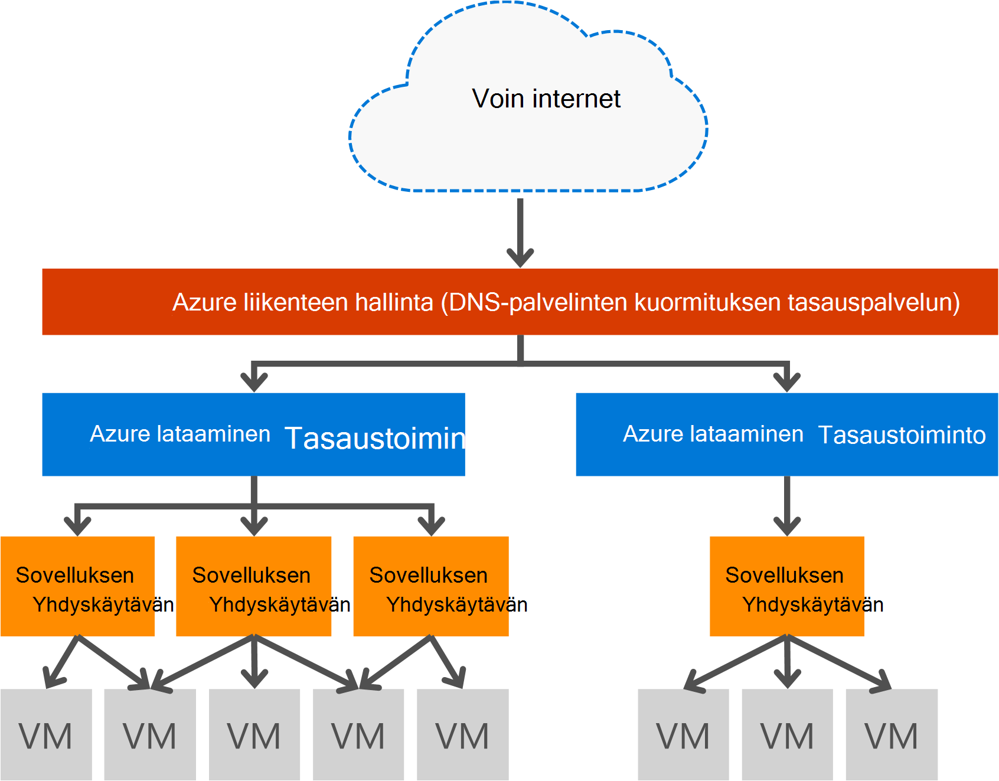

<properties
   pageTitle="Johdanto sovelluksen yhdyskäytävän | Microsoft Azure"
   description="Tällä sivulla esitetään yleiskatsaus sovelluksen yhdyskäytävän palvelu kerroksen 7 kuormituksen tasaamisen, mukaan lukien yhdyskäytävän koot HTTP ladata vastatilin, eväste istunnon affiniteetti ja SSL purku."
   documentationCenter="na"
   services="application-gateway"
   authors="georgewallace"
   manager="carmonm"
   editor="tysonn"/>
<tags
   ms.service="application-gateway"
   ms.devlang="na"
   ms.topic="hero-article"
   ms.tgt_pltfrm="na"
   ms.workload="infrastructure-services"
   ms.date="10/25/2016"
   ms.author="gwallace"/>

# Sovelluksen yhdyskäytävän yleiskatsaus

## Sovelluksen yhdyskäytävän kuvaus

Microsoft Azure sovelluksen yhdyskäytävä on sovelluksen toimituksen ohjauskoneen (ADC) palveluna ojentamassa eri kerroksen 7 kuormituksen tasaamisen sovelluksen ominaisuuksia. Sen avulla voidaan optimoida web tuottavuuden varten purkaminen suorittimen tehostettu SSL tilauksen sovelluksen Gateway asiakkaat. Se sisältää myös muita kerroksen 7 reititys ominaisuuksia kuten saapuvan liikenteen jakautumisen PYÖRISTÄ-funktiota Mikko, eväste istunnon affiniteetti, URL-Osoitteen mukaan reitityksissä ja mahdollisuus isännöidä useita sivustoja yhden sovelluksen yhdyskäytävän takana perusteella. Sovelluksen Gateway tukee myös web application palomuuri (WAF), joka suojaa vastaan OWASP Ylin 10 yleisiä web heikkouksien yleensä sovelluksen. Sovelluksen yhdyskäytävän voi määrittää internet aukeaman yhdyskäytävän, sisäinen yhdyskäytävä tai molempia. Sovelluksen yhdyskäytävä on täysin Azure hallittu, skaalattava ja käytettävissä. Se on monenlaisia diagnostiikka ja kirjaaminen ominaisuuksia hallittavuuden. Sovelluksen yhdyskäytävän toimii näennäiskoneiden, pilvipalveluihin ja sisäisiä ja ulkoisia aukeaman web-sovellusten kanssa.

Sovelluksen yhdyskäytävä on erillinen virtual laitteen sovelluksen ja sisältää useita skaalattavuus ja suuren käytettävyyden työntekijä esiintymät. Kun luot sovelluksen yhdyskäytävän, päätepisteen (julkisen VIP tai sisäinen ILB IP) on liitetty ja käyttää tunkeutumisen verkkoliikenteelle. Tämä VIP tai ILB IP tarjoaa Azure ladata tasaustoiminto transport tasolla (TCP/UDP) ja jossa kaikki parhaillaan kuormitus tasataan sovelluksen yhdyskäytävän työntekijä esiintymät saapuvaa verkkoliikennettä. Sovelluksen yhdyskäytävän sitten tiet HTTP/HTTPS-liikenne perusteella sen määrittäminen, olipa virtual-koneen cloud palvelun, sisäinen tai ulkoinen IP-osoite. Saat SLA ja hinnoittelua, viitata [SLA](https://azure.microsoft.com/support/legal/sla/) ja [hinnoittelu](https://azure.microsoft.com/pricing/details/application-gateway/) -sivuilla.

## Ominaisuudet

Sovelluksen Gateway tukee tällä hetkellä kerroksen 7 sovelluksen toimituksen seuraavia ominaisuuksia:

- **[Web-sovelluksen palomuurin (esikatselu)](application-gateway-webapplicationfirewall-overview.md)** - web application palomuuri (WAF) Azure sovelluksen yhdyskäytävän suojaa verkkosovellusten yleisiä verkkopohjaisia kalastelu, kuten SQL lisäämisen ja komentosarjoja sivustojen-istunnon hijacks.
- **Kuormituksen HTTP** - sovelluksen yhdyskäytävä on PYÖRISTÄ-funktiota Mikko kuormituksen tasaamisen. Kuormituksen tasaamisen on tehty kerroksen 7 ja käytetään ainoastaan HTTP (S)-liikennettä.
- **Evästeiden perustuva istunnon affiniteetti** - toiminto on hyödyllinen, kun haluat säilyttää käyttäjän istuntoon saman taustatietokannan. Yhdyskäytävän hallitun evästeet käyttämällä sovelluksen yhdyskäytävän pystyy ohjaamaan myöhemmin liikenne käyttäjän istunnosta käsittelyä varten samaan taustatietokantaan. Tämä ominaisuus on tärkeää tapauksissa istunnon tila tallennuspaikan paikallisesti taustatietokantaan palvelimessa käyttäjän istuntoa.
- Kallista tehtävä käytöstä WWW-palvelimien liikenteen HTTPS salauksen **[purku secure Sockets Layer (SSL)](application-gateway-ssl-arm.md)** - toiminto kestää. Sovelluksen yhdyskäytävässä SSL-yhteyden ja palvelimen poistaminen salattuja pyynnön välittäminen, verkkopalvelin unburdened salauksen mukaan.  Sovelluksen yhdyskäytävän salaa vastaus uudelleen ennen kuin lähetät sen takaisin asiakkaalle. Tämä ominaisuus on hyödyllinen tilanteissa sitten taustatietokantatiedosto sijainti Azure sovelluksen yhdyskäytävän saman suojatun virtual verkossa.
- **[Lopusta loppuun SSL](application-gateway-backend-ssl.md)** - sovelluksen Gateway tukee liikenteen lopusta loppuun-salausta. Sovelluksen yhdyskäytävän tekee tämän sovelluksen yhdyskäytävässä SSL-yhteyden. Yhdyskäytävän koskee Reitityssääntöjen liikenne, salaa uudelleen paketin ja välittää paketin perusteella määritetty Reitityssääntöjen tarvittavat Taustajärjestelmä. Jokainen vastaus verkkopalvelin käy läpi samoja ohjeita takaisin peruskäyttäjän.
- **[URL-pohjaiset sisällön reititys](application-gateway-url-route-overview.md)** - toiminto tarjoaa mahdollisuuden eri taustatietokantaan palvelinten käyttäminen eri tietoliikenteen. Eri taustatietokannan, vähentää tarpeettomien kuormituksen taustassa, joka ei tue sanomaasi tietyn sisällön voi voidaan reitittää liikenteen WWW-palvelimessa olevaan kansioon tai CDN.
- **[Usean sivuston reititys](application-gateway-multi-site-overview.md)** - sovelluksen yhdyskäytävän avulla voit koota ylöspäin yhden sovelluksen yhdyskäytävän 20 sivustojen.
- **[Websocket tuki](application-gateway-websocket.md)** - toiseen hyvien ominaisuutta sovelluksen yhdyskäytävän on Websocket tuki.
- **[Kunnon seuranta](application-gateway-probe-overview.md)** - sovelluksen yhdyskäytävä on oletusarvoinen kunnon valvonta Taustajärjestelmä resurssien ja mukautettujen probes tiettyihin skenaarioissa seurannassa.

## Edut

Sovelluksen yhdyskäytävä on hyötyä:

- Sovellukset, jotka edellyttävät pyynnöt sama käyttäjä/asiakkaan istunnosta saman taustatietokantaan virtuaalikoneen saavuttamiseksi. Esimerkkejä näiden sovellusten ostokset ostoskorin sovellukset ja web sähköpostipalvelimet.
- Sovellukset, jotka haluat vapauttaa web server klustereihin SSL tilauksen katseltavan kohteesta.
- Sovellusten, kuten sisällön toimittamisen verkossa, joka edellyttää samassa pitkään suoritettavien TCP-yhteydessä reititetään tai ladata useita pyyntöjen saapuva eri taustatietokantaan-palvelimiin.
- Sovellukset, jotka tukevat websocket liikenne
- Yleisiä verkkopohjaisia viesteiltä suojaaminen web-sovellusten, kuten SQL lisäämisen, komentosarjoja sivustojen- ja istunnon hijacks.

Sovelluksen yhdyskäytävän kuormituksen tasaaminen kerroksen 7 kuormituksen, takana Azure ohjelmiston kuormituksen valmistelu Azure hallitun service-toiminnolla. Liikenteen hallinta voidaan suorittamiseen skenaarion tarkastelu seuraavan kuvan mukaisesti. Jos liikenteen hallinta uudelleenohjaus- ja käytettävyyden, kuormituksen on alueen skaalattavuus ja käytettävyys ja sovelluksen yhdyskäytävä on cross alueen kerroksen 7 kuormituksen tasaamisen.

[AZURE.INCLUDE [load-balancer-compare-tm-ag-lb-include.md](../../includes/load-balancer-compare-tm-ag-lb-include.md)]

## Yhdyskäytävän kokojen ja esiintymiä

Sovelluksen yhdyskäytävä on tällä hetkellä tarjoaa kolme kokoa: pieni, Normaali tai suuri. Pieni esiintymän koot on tarkoitettu kehittäminen ja testauksen skenaarioita.

Tällä hetkellä kaksi tuotteissa sovelluksen Gatewayn: WAF ja vakio.

Voit luoda enintään 50 tilauskohtaisten sovelluksen yhdyskäytävien ja kunkin sovelluksen yhdyskäytävän voi olla enintään 10 esiintymät. Kunkin sovelluksen yhdyskäytävän voi olla 20 http kuuntelijoita. Luettelo kaikista sovelluksen yhdyskäytävän rajoitukset [Palvelun rajoitukset](../azure-subscription-service-limits.md#application-gateway) ‑sivustossa.

Seuraavassa taulukossa on keskimääräinen suorituskyky-siirtonopeuden kunkin sovelluksen yhdyskäytävän esiintymän:

| Taustatietokannan sivun vastaus | Pieni | Normaali | Suuri|
|---|---|---|---|
| 6K | 7.5 Mbps | 13 Mbps | 50 Mbps |
|100K | 35 Mbps | 100 Mbps| 200 Mbps |

>[AZURE.NOTE] Nämä arvot ovat sovellus-yhdyskäytävän siirtonopeuden lähes arvot. Todellinen siirtonopeuden määräytyy eri ympäristön tiedot, kuten keskiarvo sivun koko ja taustatietokantaan esiintymät ja käsittelyn kesto tukemaan sivulle. Tarkka suorituskyvyn lukuja Suorita oman testejä, nämä arvot annetaan vain kapasiteetin suunnittelu ohjeita.

## Kunnon seuranta

Azure sovelluksen yhdyskäytävän valvoo automaattisesti kuntoa taustatietokantaan esiintymien basic kautta tai mukautetun kunto probes. Käyttämällä kunto keräysputkien Näin varmistat, että vain kunnossa isännät vastata liikenne. Lisätietoja on artikkelissa [sovelluksen yhdyskäytävän kunnon valvonta yleiskatsaus](application-gateway-probe-overview.md).

## Määrittäminen ja hallinta

Sen päätepisteen sovelluksen yhdyskäytävän voi olla julkiseen IP ja yksityiset IP kun se on määritetty. Sovelluksen yhdyskäytävä on määritetty oma aliverkon virtual verkon sisällä. Aliverkon luodaan tai käyttää sovelluksen yhdyskäytävä ei voi olla muuntyyppisten resursseja, vain resursseja, joiden sallitaan aliverkon on sovelluksen verkkotunnukset. Suojaamiseen Taustajärjestelmä resurssien taustaan palvelinten voit sisältämät eri aliverkon sovelluksen yhdyskäytävän virtual samassa verkossa. Tämä lisää aliverkon, se ei ole pakko täyttää Taustajärjestelmä-sovellusten, kunhan sovelluksen yhdyskäytävän pääsee ip-osoite, sovelluksen yhdyskäytävä on voi antaa ADC ominaisuuksia Taustajärjestelmä palvelimia.

Voit luoda ja hallita sovelluksen yhdyskäytävän REST API, PowerShell-cmdlet-komennot, Azure CLI tai [Azure portal](https://portal.azure.com/)avulla.

## Seuraavat vaiheet

Liittyviä sovelluksen yhdyskäytävän jälkeen voit [luoda yhdyskäytävän sovelluksen](application-gateway-create-gateway-portal.md) tai voit [luoda sovelluksen yhdyskäytävän SSL purku](application-gateway-ssl-arm.md) kuormituksen HTTPS-yhteydet.

Opettele luomaan sovelluksen yhdyskäytävän käyttämällä URL-pohjaiset sisällön reititys, siirtymällä [luominen käyttämällä URL-pohjaiset reititys sovelluksen yhdyskäytävän](application-gateway-create-url-route-arm-ps.md) lisätietoja.

