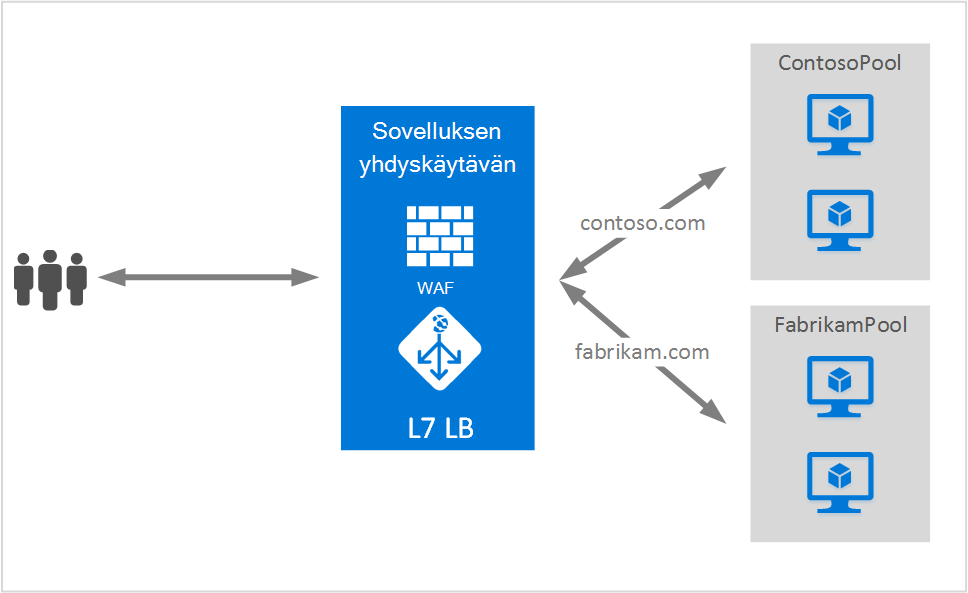

<properties
   pageTitle="Sovelluksen yhdyskäytävän useiden sivustojen isännöintiä | Microsoft Azure"
   description="Tällä sivulla on yleiskuvaus sovelluksen yhdyskäytävän usean sivuston-tukeen."
   documentationCenter="na"
   services="application-gateway"
   authors="amsriva"
   manager="rossort"
   editor="amsriva"/>
<tags
   ms.service="application-gateway"
   ms.devlang="na"
   ms.topic="hero-article"
   ms.tgt_pltfrm="na"
   ms.workload="infrastructure-services"
   ms.date="10/25/2016"
   ms.author="amsriva"/>

# Sovelluksen yhdyskäytävän useita sivuston isännöintiä

Usean sivuston isännöintiä avulla voit määrittää useita web-sovelluksen sovelluksen yhdyskäytävän samassa esiintymässä. Tämän ominaisuuden avulla voit määrittää oman käyttöönotoissa tehokkaampaa topologian lisäämällä sovelluksen yhdyskäytävän enintään 20 sivustot. Kunkin sivuston voit ohjautuu omassa Taustajärjestelmä resurssivarantoon. Seuraavassa esimerkissä sovelluksen yhdyskäytävän toimiva contoso.com ja fabrikam.com kaksi taustatietokantaan palvelimen jakavat ContosoServerPool ja FabrikamServerPool-liikenne.

Pyyntö http://contoso.com reititetään ContosoServerPool ja http://fabrikam.com reititetään FabrikamServerPool.

Samalla tavalla kuin ylätason toimialue kaksi subdomains on isännöitävä samassa sovelluksen gateway-ympäristöön. Esimerkkejä alitoimialueita voivat olla http://blog.contoso.com ja http://app.contoso.com isännöidään yhden sovelluksen gateway-ympäristöön.

## Host ylä- ja palvelimen nimi merkintä (SNI)

On kolme yleisiä tapaa käyttöönoton useita sivuston isännöintiä saman infrastruktuuria.

1. Ylläpitää useita verkkosovellukset kunkin yksilöllinen IP-osoite.
2. Isäntänimi isännöimiseen useita web-sovellusten samaa IP-osoite.
3. Eri portit avulla voit isännöidä useita web-sovellusten samaa IP-osoite.

Tällä hetkellä sovelluksen yhdyskäytävän saa yksittäinen julkiseen IP-osoite, se seuraa tietoliikenteen. Näin ollen tukemaan useita sovelluksia, joissa Oma IP-osoite ei tällä hetkellä tueta. Sovelluksen yhdyskäytävän tukee useita sovelluksia isännöinnin kunkin Kuuntele eri portit, mutta tämä skenaario edellyttäisi Hyväksy liikenne normaalista sovellukset ja ei yleensä ole uudet määritykset. Sovelluksen yhdyskäytävä on riippuvainen HTTP 1.1 toimialuenimiä isännöimiseen sama julkiseen IP-osoite ja portin useita sivustossa. Sovelluksen yhdyskäytävän isännöimät sivustoja voi myös tuki SSL purku palvelimen nimi merkintä (SNI) TLS-tunnisteella. Tässä skenaariossa tarkoittaa, että asiakas-selain ja Taustajärjestelmä WWW-klusterin tuettava HTTP/1.1- ja TLS-tunniste, RFC 6066 määritysten mukaisesti.

## Listener määritys-elementti

Vanhan HTTPListener määritysten elementin paranee tukemaan isännän nimen ja palvelimen nimi merkintä elementit, jota käytetään sovelluksen yhdyskäytävän reitti-liikenne paikalliseen tarvittavat Taustajärjestelmä resurssivarantoon. Seuraavassa esimerkissä koodi on HttpListeners osan mallitiedosto katkelma.

    "httpListeners": [
                {
                    "name": "appGatewayHttpsListener1",
                    "properties": {
                        "FrontendIPConfiguration": {
                            "Id": "/subscriptions/<subid>/resourceGroups/<rgName>/providers/Microsoft.Network/applicationGateways/applicationGateway1/frontendIPConfigurations/DefaultFrontendPublicIP"
                        },
                        "FrontendPort": {
                            "Id": "/subscriptions/<subid>/resourceGroups/<rgName>/providers/Microsoft.Network/applicationGateways/applicationGateway1/frontendPorts/appGatewayFrontendPort443'"
                        },
                        "Protocol": "Https",
                        "SslCertificate": {
                            "Id": "/subscriptions/<subid>/resourceGroups/<rgName>/providers/Microsoft.Network/applicationGateways/applicationGateway1/sslCertificates/appGatewaySslCert1'"
                        },
                        "HostName": "contoso.com",
                        "RequireServerNameIndication": "true"
                    }
                },
                {
                    "name": "appGatewayHttpListener2",
                    "properties": {
                        "FrontendIPConfiguration": {
                            "Id": "/subscriptions/<subid>/resourceGroups/<rgName>/providers/Microsoft.Network/applicationGateways/applicationGateway1/frontendIPConfigurations/appGatewayFrontendIP'"
                        },
                        "FrontendPort": {
                            "Id": "/subscriptions/<subid>/resourceGroups/<rgName>/providers/Microsoft.Network/applicationGateways/applicationGateway1/frontendPorts/appGatewayFrontendPort80'"
                        },
                        "Protocol": "Http",
                        "HostName": "fabrikam.com",
                        "RequireServerNameIndication": "false"
                    }
                }
            ],

Pääset käsiksi [Resurssienhallinta-mallissa käyttämällä useita sivuston isännöintiä](https://github.com/Azure/azure-quickstart-templates/blob/master/201-application-gateway-multihosting) pääty malliin perustuvan käyttöönottoa varten.

## Reititys sääntö

Ei muutoksia ei tarvita reititys säännön. Reititys säännön "Basic" Jatka valittava sitominen sivuston kuuntelua vastaavan Taustajärjestelmä osoite-ryhmään.

    "requestRoutingRules": [
    {
        "name": "<ruleName1>",
        "properties": {
            "RuleType": "Basic",
            "httpListener": {
                "id": "/subscriptions/<subid>/resourceGroups/<rgName>/providers/Microsoft.Network/applicationGateways/applicationGateway1/httpListeners/appGatewayHttpsListener1')]"
            },
            "backendAddressPool": {
                "id": "/subscriptions/<subid>/resourceGroups/<rgName>/providers/Microsoft.Network/applicationGateways/applicationGateway1/backendAddressPools/ContosoServerPool')]"
            },
            "backendHttpSettings": {
                "id": "/subscriptions/<subid>/resourceGroups/<rgName>/providers/Microsoft.Network/applicationGateways/applicationGateway1/backendHttpSettingsCollection/appGatewayBackendHttpSettings')]"
            }
        }

    },
    {
        "name": "<ruleName2>",
        "properties": {
            "RuleType": "Basic",
            "httpListener": {
                "id": "/subscriptions/<subid>/resourceGroups/<rgName>/providers/Microsoft.Network/applicationGateways/applicationGateway1/httpListeners/appGatewayHttpListener2')]"
            },
            "backendAddressPool": {
                "id": "/subscriptions/<subid>/resourceGroups/<rgName>/providers/Microsoft.Network/applicationGateways/applicationGateway1/backendAddressPools/FabrikamServerPool')]"
            },
            "backendHttpSettings": {
                "id": "/subscriptions/<subid>/resourceGroups/<rgName>/providers/Microsoft.Network/applicationGateways/applicationGateway1/backendHttpSettingsCollection/appGatewayBackendHttpSettings')]"
            }
        }

    }
    ]

## Seuraavat vaiheet

Kun liittyviä useita sivuston isännöintiä Siirry luomalla sovelluksen yhdyskäytävän mahdollisuus tukevat useita web-sovelluksen [luominen käyttämällä useita sivuston isännöintiä sovelluksen-yhdyskäytävä](application-gateway-create-multisite-azureresourcemanager-powershell.md) .
