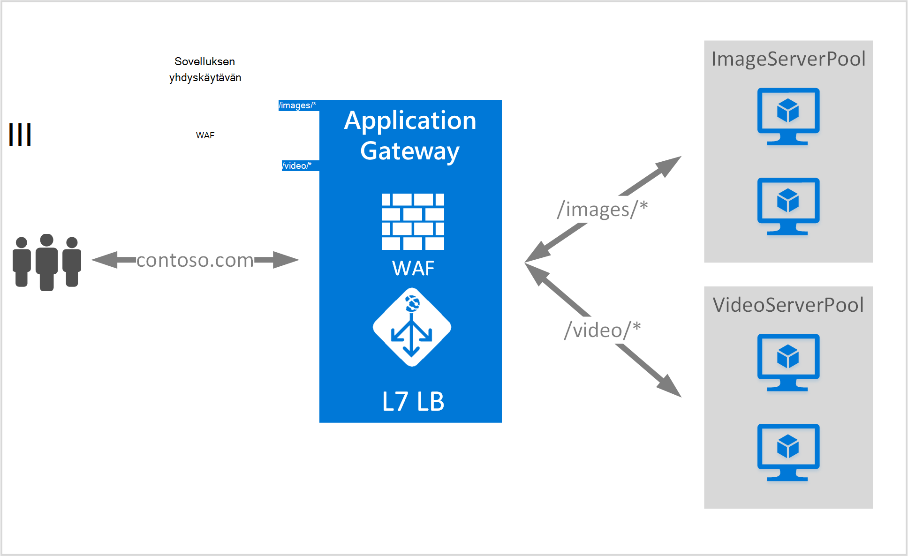

<properties
   pageTitle="URL-pohjaiset sisällön reititys yleiskuvaus | Microsoft Azure"
   description="Tällä sivulla on yleiskuvaus sovelluksen yhdyskäytävän URL-pohjaiset sisällön reititys, UrlPathMap määritys ja PathBasedRouting säännön."
   documentationCenter="na"
   services="application-gateway"
   authors="georgewallace"
   manager="carmonm"
   editor="tysonn"/>
<tags
   ms.service="application-gateway"
   ms.devlang="na"
   ms.topic="hero-article"
   ms.tgt_pltfrm="na"
   ms.workload="infrastructure-services"
   ms.date="10/25/2016"
   ms.author="gwallace"/>

# URL-Osoitteen perusteella reitityksissä yleiskatsaus

URL-Osoitteen perusteella reitityksissä sallii reitti-liikenne paikalliseen taustatietokantaan palvelimen jakavat polut pyynnön perusteella. Yksi käyttötavoista on erilaisia sisältötyyppejä, eri Taustajärjestelmä palvelimen jakavat reitin pyyntö.
Seuraavassa esimerkissä sovelluksen yhdyskäytävän toimiva contoso.com-kolme taustatietokantaan palvelimen jakavat liikenne esimerkiksi: VideoServerPool, ImageServerPool ja DefaultServerPool.

Pyyntö http://contoso.com/video* reititetään VideoServerPool, ja http://contoso.com/images* reititetään ImageServerPool. DefaultServerPool on valittuna, jos yksikään polku kuviot vastaa.

## UrlPathMap määritys-elementti

Polun kuvioiden avulla ja taustatietokantaan palvelimen resurssivarantoon yhdistämismääritysten käytetään UrlPathMap elementti. Seuraavassa esimerkissä koodi on urlPathMap osan mallitiedosto katkelma.

    "urlPathMaps": [
    {
    "name": "<urlPathMapName>",
    "id": "/subscriptions/<subscriptionId>/../microsoft.network/applicationGateways/<gatewayName>/ urlPathMaps/<urlPathMapName>",
    "properties": {
        "defaultBackendAddressPool": {
            "id": "/subscriptions/<subscriptionId>/../microsoft.network/applicationGateways/<gatewayName>/backendAddressPools/<poolName>"
        },
        "defaultBackendHttpSettings": {
            "id": "/subscriptions/<subscriptionId>/../microsoft.network/applicationGateways/<gatewayName>/backendHttpSettingsList/<settingsName>"
        },
        "pathRules": [
            {
                "paths": [
                    <pathPattern>
                ],
                "backendAddressPool": {
                    "id": "/subscriptions/<subscriptionId>/../microsoft.network/applicationGateways/<gatewayName>/backendAddressPools/<poolName2>"
                },
                "backendHttpsettings": {
                    "id": "/subscriptions/<subscriptionId>/../microsoft.network/applicationGateways/<gatewayName>/backendHttpsettingsList/<settingsName2>"
                },

            },

        ],

    }
    }
    

>[AZURE.NOTE] PathPattern: Tämä asetus on polku kuviot vastaamaan luettelo. Kunkin alettava / ja ainoa paikka "*" sallitaan on Lopeta osoitteesta "/". Fed polku matcher merkkijono ei sisällä tekstiä ensimmäisen jälkeen? tai # ja näiden merkkiä eivät ole sallittuja tähän. 

Voit tarkistaa [Resurssienhallinta-mallissa käyttämällä URL-pohjaiset reititys](https://azure.microsoft.com/documentation/templates/201-application-gateway-url-path-based-routing) lisätietoja.

## PathBasedRouting sääntö

Tyypin PathBasedRouting RequestRoutingRule käytetään kuuntelija sitoa urlPathMap. Kaikki pyynnöt, jotka on vastaanotettu tämän listener reititetään määritettyä urlPathMap perusteella.
Katkelma PathBasedRouting säännön:

    "requestRoutingRules": [
    {

    "name": "<ruleName>",
    "id": "/subscriptions/<subscriptionId>/../microsoft.network/applicationGateways/<gatewayName>/requestRoutingRules/<ruleName>",
    "properties": {
        "ruleType": "PathBasedRouting",
        "httpListener": {
            "id": "/subscriptions/<subscriptionId>/../microsoft.network/applicationGateways/<gatewayName>/httpListeners/<listenerName>"
        },
        "urlPathMap": {
            "id": "/subscriptions/<subscriptionId>/../microsoft.network/applicationGateways/<gatewayName>/ urlPathMaps/<urlPathMapName>"
        },

    }
    
## Seuraavat vaiheet

Kun liittyviä URL-pohjaiset sisällön reititys Siirry luomalla sovelluksen yhdyskäytävän URL-Osoitteen Reitityssääntöjen [luominen käyttämällä URL-pohjaiset reititys sovelluksen-yhdyskäytävä](application-gateway-create-url-route-portal.md) .
