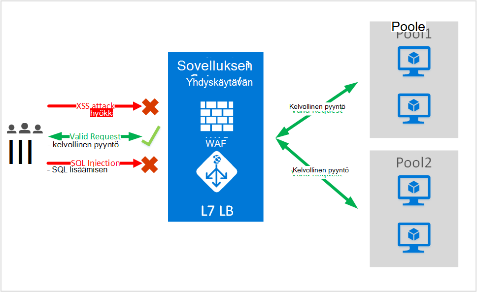
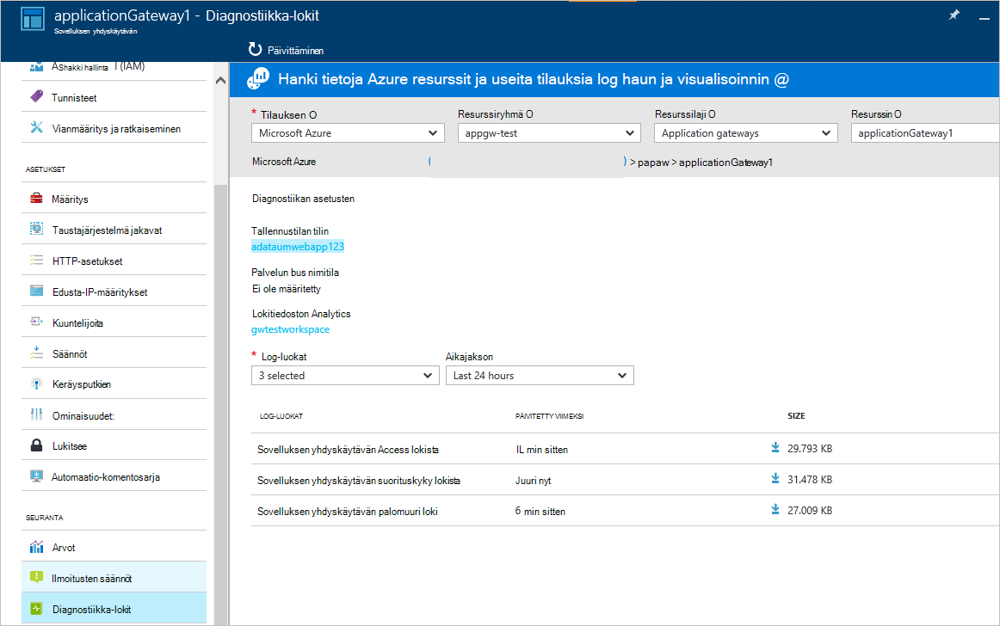

<properties
   pageTitle="Johdanto Web Application palomuurin (WAF) sovelluksen yhdyskäytävän | Microsoft Azure"
   description="Tällä sivulla on yleisiä tietoja Web-sovelluksen palomuurin (WAF)-sovelluksen yhdyskäytävän "
   documentationCenter="na"
   services="application-gateway"
   authors="amsriva"
   manager="rossort"
   editor="amsriva"/>
<tags
   ms.service="application-gateway"
   ms.devlang="na"
   ms.topic="hero-article"
   ms.tgt_pltfrm="na"
   ms.workload="infrastructure-services"
   ms.date="10/25/2016"
   ms.author="amsriva"/>

# Sovelluksen yhdyskäytävän Web Application palomuurin (ennakkoversio)

Web-sovelluksen palomuurin (WAF) toimintoa azure sovelluksen yhdyskäytävään, joka sisältää suojaus verkkosovellusten, joka hyödyntää sovelluksen Gatewayn vakio sovelluksen toimituksen ohjausobjektin (ADC)-funktiot. Web-sovelluksen palomuuri tekee tämän suojaamalla niitä vastaan OWASP Ylin 10 yleisiä web heikkouksien kaiken irti. Verkkosovellusten on yhä haittaohjelmien kalastelu, joka hyödyntää yleisiä tunnetut heikkouksien kohteet. Yleisiä nämä hyödyntämän ovat SQL lisäämisen kalastelu, sivustojenvälisen komentosarjan hyökkäykset muun muassa. Estää tällaisten kalastelu sovelluksen koodissa voi olla hankalaa ja vaatia tiukka ylläpito, päivitetään ja useita kerroksia sovellus topologian valvonta. Keskitetty web application palomuuri suorittaa web kalastelu suojauksen hallinta on helppoa ja antaa parempia assurance luvatonta käyttöä vastaan-sovellukseen. WAF ratkaisua voi myös reagoi suojaus-uhkien nopeampaa mukaan korjataan keskitetyssä sijainnissa ja suojaaminen kunkin yksittäisen web-sovellusten tunnetut haavoittuvuutta. Olemassa olevan sovelluksen yhdyskäytävien voidaan muuntaa web-sovelluksen palomuuri sovelluksen yhdyskäytävän helposti.

Sovelluksen yhdyskäytävän toimii sovelluksen-toimittamista controller ja tarjoaa SSL-tilauksen, eväste perustuva istunnon affiniteetti, pyöreän pöydän kuormituksen hajautuksessa sisällön perusteella reititys, mahdollisuus isännöidä useita sivustoja ja suojaus parannukset. Sovelluksen yhdyskäytävän tarjoamia suojausparannuksia ovat SSL hallinnassa pääty SSL-tuki. Olemme ovat vahvistaminen sovelluksen tietoturvaominaisuudet tämän palvelun tuomalla ojentamassa ADC suoraan integroitu WAF (web-sovelluksen palomuuri). Tämä on helposti keskitetysti hallita ja suojata vastaan yhteiset www-heikkouksien web-sovellusten määrittäminen.

Seuraavat etu määrittäminen WAF osoitteessa sovelluksen yhdyskäytävä on sinulle:

- Suojaa web-sovelluksen web heikkouksien ja kalastelu sellaisenaan Taustajärjestelmä koodiin.
- Suojaa useita web-sovellusten sovelluksen yhdyskäytävän takana samanaikaisesti. Sovelluksen gateway tukee isännöinnin takana yhden yhdyskäytävän, joka saattaa kaikki suojattava web kalastelu enintään 20 sivustot.
- Seurata verkkosovelluksen vastaan kalastelu reaaliaikainen raportin luomien sovelluksen yhdyskäytävän WAF lokitiedot.
- Tiettyjen yhteensopivuuden ohjausobjektit edellyttävät kaikki internet aukeaman päätepisteestä suojattava WAF ratkaisulla. Käyttämällä sovelluksen yhdyskäytävän WAF käytössä täytät nämä vaatimukset.

## Yleiskatsaus

Sovelluksen yhdyskäytävän WAF tarjotaan uusi tuote (WAF SKU) ja on ennalta määritetty ModSecurity ja OWASP Core sääntöjoukon perusaikataulun suojaa OWASP Ylin 10 yleisiä web heikkouksien useimmat niitä.

- SQL-lisäämisen suojaus
- Toimintojen välinen sivuston komentosarjojen suojaus
- Yleisiä Web hyökkäykset suojaus kuten komennon lisäämisen, HTTP-pyyntöjen salakuljettamisesta HTTP-vastaus jakaminen, ja tiedosto etätietokoneessa sisällyttäminen hyökkäyksen
- HTTP-protokolla virheitä suojautumista
- HTTP-protokolla poikkeamia, kuten puuttuu suojautumista isännöidä käyttäjäagentti ja hyväksy otsikot
- HTTP DoS suojaukset HTTP samantyyppisten ja hidas HTTP DoS estäminen
- Bots, hakurit ja skannerit estäminen
- Tunnistaminen yleisiä sovelluksen onko (eli. Apache, IIS jne.)

## WAF tilat

Sovelluksen yhdyskäytävän WAF voidaan määrittää toimimaan seuraavat kaksi tilat:

- **Tunnistamisen tilassa** – kun määritetty käyttämiseen tunnistamisen tilassa sovelluksen yhdyskäytävän WAF valvoo ja kirjaa kaikki uhkien ilmoitukset lokitiedostoon. Haluat varmistaa, että Diagnostiikan kirjaus sovelluksen Gateway on otettu käyttöön diagnostiikka-osassa. Sinun on myös varmistaa, että WAF lokin valittuna ja otettu käyttöön.
- **Estäminen** – kun määritetty käyttämiseen estäminen-sovelluksen yhdyskäytävän aktiivisesti lohkot luvatonta käyttöä ja kalastelu tunnistaa sen säännöt. Hän saa 403 luvattomasti poikkeuksen ja yhteys katkaistaan. Estäminen jatkaa kirjautumalla tällaisten WAF lokit.

## Sovelluksen yhdyskäytävän WAF raportit

Sovelluksen Gateway WAF on kunkin uhkien, se havaitsee yksityiskohtaisen raportoinut. Lokiin kirjaaminen on integroitu Azure diagnostiikka lokit ja ilmoitusten tallennetaan json-muoto.

    {
        "resourceId": "/SUBSCRIPTIONS/<subscriptionId>/RESOURCEGROUPS/<resourceGroupName>/PROVIDERS/MICROSOFT.NETWORK/APPLICATIONGATEWAYS/<applicationGatewayName>",
        "operationName": "ApplicationGatewayFirewall",
        "time": "2016-09-20T00:40:04.9138513Z",
        "category": "ApplicationGatewayFirewallLog",
        "properties":     {
            "instanceId":"ApplicationGatewayRole_IN_0",
            "clientIp":"108.41.16.164",
            "clientPort":1815,
            "requestUri":"/wavsep/active/RXSS-Detection-Evaluation-POST/",
            "ruleId":"OWASP_973336",
            "message":"XSS Filter - Category 1: Script Tag Vector",
            "action":"Logged",
            "site":"Global",
            "message":"XSS Filter - Category 1: Script Tag Vector",
            "details":{"message":" Warning. Pattern match "(?i)(<script","file":"/owasp_crs/base_rules/modsecurity_crs_41_xss_attacks.conf","line":"14"}}
    }

## Sovelluksen yhdyskäytävän WAF SKU hinnat

Esikatselun, aikana veloituksia ei ole muita sovelluksen Gateway WAF käytön. Voit jatkaa aiemmin Basic SKU ovat osoitteessa veloitetaan. Olemme kommunikoi WAF SKU maksut GA aikaan. Asiakkaat, jotka olet valinnut ottaa käyttöön sovelluksen yhdyskäytävän WAF SKU alkaisi kerry WAF SKU hinnat vasta GA ilmoitus.

## Seuraavat vaiheet

Jälkeen Lisätietoja WAF ominaisuuksia, käy [Web Application Gateway sovelluksen palomuuri määrittämisestä](application-gateway-web-application-firewall-portal.md).
