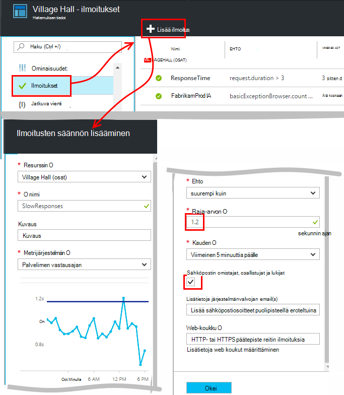
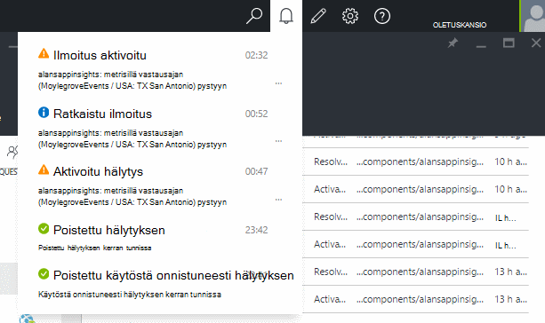
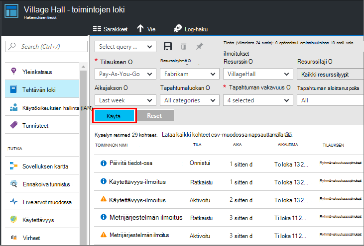

<properties 
    pageTitle="Ilmoitusten määrittäminen hakemuksen tiedot | Microsoft Azure" 
    description="Saat ilmoituksen hidas vastauksen ajat, poikkeukset- ja muut suorituskyvyn tai käyttö muutokset-sovellukseen." 
    services="application-insights" 
    documentationCenter=""
    authors="alancameronwills" 
    manager="douge"/>

<tags 
    ms.service="application-insights" 
    ms.workload="tbd" 
    ms.tgt_pltfrm="ibiza" 
    ms.devlang="na" 
    ms.topic="article" 
    ms.date="10/14/2016" 
    ms.author="awills"/>
 
# Hakemuksen tiedot ilmoitusten määrittäminen

[Visual Studio hakemuksen tiedot] [ start] voit ilmoittaa muutoksiin suorituskyvyn tai käyttö arvot-sovellukseen. 

Hakemuksen tiedot valvoo live sovelluksen [nykyään] [ platforms] suorituskyvyn vianmääritys ja ymmärtää käyttötavat.

Ilmoitusten kolme erilaista:

* **Metrijärjestelmän ilmoitukset** Ilmoita milloin tahansa metrijärjestelmä ylittää raja-arvo ajan – kuten vastauksen ajat, poikkeuksen laskelmia, suorittimen käyttö tai sivun näkymät. 
* [**Web-testien** ] [ availability] kertoa, kun sivusto on käytettävissä Internetissä tai vastaa hitaasti. [Lisätietoja][availability].
* [**Ennakoiva diagnostiikka**](app-insights-proactive-diagnostics.md) määritetään automaattisesti ilmoittaa epätavallisia suorituskyvyn kuviot.

Olemme keskitytään metrisillä ilmoitusten sisältö.

## Määritä metrisillä ilmoitus

Avaa ilmoitusten säännöt-sivu ja valitse Lisää-painikkeella. 

* Resurssin ennen muiden ominaisuuksien määrittäminen. Jos haluat määrittää ilmoituksia suorituskyvyn tai käyttö arvojen mukaisesti **Valitse "(osat)"-resurssi** .
* Nimi, jota voit tarkastella Ilmoita on oltava yksilöllinen resurssiryhmä (et pelkästään sovelluksen).
* Varmista, ettet Huomaa yksiköiden, jossa sinua pyydetään antamaan raja-arvon.
* Jos valintaruutu on valittu "Sähköpostin omistajat..."-ilmoitukset lähetetään sähköpostitse kaikille, joilla on tämä resurssiryhmä käyttöoikeus. Laajenna tämän kohdan arvoksi henkilöistä, lisää ne [resurssiryhmä ja tilauksen](app-insights-resources-roles-access-control.md) (ei resurssi).
* Jos määrität "Lisää sähköpostit"-ilmoitukset lähetetään sopiville henkilöille tai ryhmille (onko voit tarkistaa "sähköpostin omistajat..."-ruutuun). 
* Määritä [webhook osoite](../monitoring-and-diagnostics/insights-webhooks-alerts.md) , jos olet määrittänyt verkkosovellukseen, joka vastaa ilmoitukset. Sen nimi, kun ilmoituksen aktivoidaan (joka on saatu) ja kun se on selvitetty. (Huomaa, että tällä hetkellä kyselyparametrit ei välitetään kautta webhook ominaisuuksina.)
* Voit poistaa käytöstä tai ottaa käyttöön ilmoituksen: näe yläreunaan sivu-painikkeita.

*Lisää ilmoitus-painiketta ei näy.* 

- On käytössä on organisaatiotili? Voit määrittää ilmoitukset, jos sinulla on omistaja tai osallistuja käyttää sovelluksen resurssi. Tutustu käyttöoikeuksien hallinta-sivu. [Lisätietoja käyttöoikeuksien valvonta][roles].

> [AZURE.NOTE] Ilmoitukset-sivu näkyy, että on jo ilmoitusten määrittäminen: [Ennakoiva diagnostiikka](app-insights-proactive-failure-diagnostics.md). Tämä on automaattinen ilmoituksen, joka valvoo yhden tietyn metrisillä, pyyntö virheen korko. Ellet ennakoiva ilmoituksen poistaminen käytöstä ei tarvitse määrittää omia ilmoitus pyynnön virheen korko. 

## Katso ilmoitukset

Saat sähköpostiviestin, kun ilmoitusten muutokset-tila käytöstä poistetut ja käytössä välillä. 

Nykyisen tilan kunkin ilmoitus näkyy ilmoitus säännöt-sivu.

Avattavan luettelon on yhteenveto ilmoituksia viimeisimmät toimista:

Tiedoston muutoshistorian tila on tehtävän lokiin:

## Ilmoitusten toiminta

* Ilmoituksen on kolmesta tilasta: "Ei koskaan aktivoitu", "Aktivoitu" ja "Poistunut". Aktivoitu tarkoittaa määrittämäsi ehto on TOSI, kun se on viimeksi lasketaan.

* Ilmoituksen luodaan, kun ilmoituksen tila muuttuu. (Jos ilmoitusten ehto oli jo TOSI, kun olet luonut ilmoituksen, et ehkä saa ilmoituksen, kunnes ehto siirtyy false.)

* Kunkin ilmoituksen luo sähköpostiviestin, jos valittuna sähköpostit-ruutuun tai annettu sähköpostiosoitteet. Voit myös tarkastella ilmoitukset avattavasta luettelosta.

* Ilmoituksen arvioidaan aina, kun mittarin saapuu, mutta ei muulla tavalla.

* Laskennan koostaa lisätiedot edellisen kuluessa ja vertaa sitä voit määrittää uuden tilan raja-arvon.

* Ajan, joka on valittava määrittää aikavälin tulosjoukko, jolle arvot koostetaan. Sillä ole vaikutusta, kuinka usein ilmoituksen arvioidaan: arvot saapumisesta taajuus riippuu.

* Jos tietoja ei ole saapuvien tietyn mittarin jonkin aikaa, väliä on erilaisia tehosteita ilmoitusten arviointi ja kaaviot metrisillä Resurssienhallinnassa. Jos tietoja on yli kaavion esimerkkejä väli, kaavio näyttää metrisillä Resurssienhallinnassa arvo 0. Mutta ilmoituksen perusteella sama arvo ei ole arvioida uudelleen ja ilmoituksen tila ei muutu. 

    Tietoja tekstin saapuessa kaavion siirtyy takaisin kuin nolla. Ilmoituksen arvioi määrittämäsi kausimäärän käytettävissä olevien tietojen perusteella. Onko käytettävissä ajanjakson vain yksi uusi arvopiste koosteen perustuu vain edelleen, että arvopisteen.

* Ilmoituksen voi välkkyä usein ilmoitusten ja toimintakunnossa puheluikkunassa, vaikka määrität pitkän ajan. Tämä voi johtua metrisillä arvon viedään ympärille raja-arvon. Raja-arvo ei ole hysteresis: ilmoitus siirtymä tapahtuu saman arvon kuin kunnossa siirtymä.

## Mitä on hyvä ilmoitusten määrittäminen?

Odotusaika riippuu sovelluksen. Aluksi ei kannata määrittää liian monta arvot. Silmäile jonkin aikaa katsoo metrisillä kaavioita, kun sovellus on käynnissä, kokeile, miten se toimii yleensä. Tämä auttaa löytämään tapoja parantaa suorituskykyä. Määritä ilmoituksia kertoa, kun määritetty Siirry Normaali alueen ulkopuolella. 

Suositut ilmoitukset ovat seuraavat:

* [Selaimen arvot][client], erityisesti selaimen **sivun lataamista**ovat käteviä, verkkosovelluksissa. Jos sivu on paljon komentosarjat-haluat etsiä **selaimen poikkeukset**. Jotta saat nämä arvot ja ilmoitukset, sinun on määritettävä [verkkosivun seuranta][client].
* Web-sovellusten palvelinpuolen **palvelimen vastausajan** . Sekä määrittämällä ilmoitukset tarkkaile tämän metrijärjestelmä nähdäksesi, jos se vaihtelee säilyttämättä mittasuhteita hyvin pyynnön korvaukset:, jotka saattavat tarkoittaa, että sovellus on käynnissä resurssit. 
* **Palvelimen poikkeukset** - näkyvät, sinun on tehtävä joitakin [lisäasetuksia](app-insights-asp-net-exceptions.md).

Älä unohda kyseisen [ennakoiva virheen korko diagnostiikka](app-insights-proactive-failure-diagnostics.md) automaattisesti seurata, jolla sovellus vastaa pyyntöihin virheen koodeja. 

## Automaatio

* [PowerShellin avulla voit automatisoida ilmoitusten määrittäminen](app-insights-powershell-alerts.md)
* [Webhooks avulla voit automatisoida ilmoituksiin vastaaminen](../monitoring-and-diagnostics/insights-webhooks-alerts.md)

## Katso myös

* [Käytettävyys web testit](app-insights-monitor-web-app-availability.md)
* [Automaattinen ilmoitusten määrittäminen](app-insights-powershell-alerts.md)
* [Ennakoiva diagnostiikka](app-insights-proactive-diagnostics.md) 

<!--Link references-->

[availability]: app-insights-monitor-web-app-availability.md
[client]: app-insights-javascript.md
[platforms]: app-insights-platforms.md
[roles]: app-insights-resources-roles-access-control.md
[start]: app-insights-overview.md

 