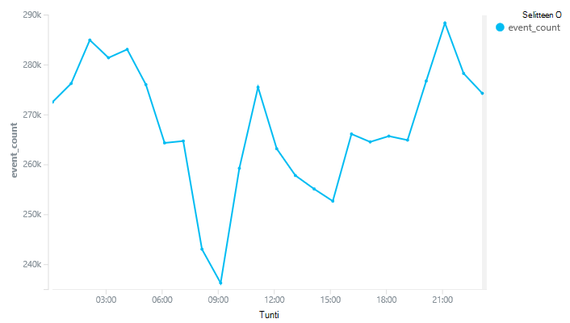
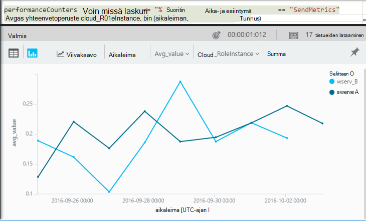

<properties 
    pageTitle="Esittelyn – analysoinnin-sovelluksen tiedot | Microsoft Azure" 
    description="Analytics-sovelluksen tiedot tehokkaita hakutyökalun tärkeimmät kyselyjen lyhyiden objektit." 
    services="application-insights" 
    documentationCenter=""
    authors="alancameronwills" 
    manager="douge"/>

<tags 
    ms.service="application-insights" 
    ms.workload="tbd" 
    ms.tgt_pltfrm="ibiza" 
    ms.devlang="na" 
    ms.topic="article" 
    ms.date="10/15/2016" 
    ms.author="awills"/>


 
# <a name="a-tour-of-analytics-in-application-insights"></a>Käyttää Analytics-sovelluksen tiedot


[Analyysin](app-insights-analytics.md) on tehokas haku-toiminnon [Hakemuksen tiedot](app-insights-overview.md). Nämä sivut kuvaavat Analytics kyselyn lanquage.


* **[Johdanto videossa](https://applicationanalytics-media.azureedge.net/home_page_video.mp4)**.
* Jos sovellus ei ole lähettää tiedot sovelluksen havainnollistamisen vielä **[Kokeile Analytics-Simuloitu tietojamme](https://analytics.applicationinsights.io/demo)** .


Voit haluat tutustua joitakin perustietoja kyselyiden aloittamista.

## <a name="connect-to-your-application-insights-data"></a>Sovelluksen tiedot-tietojen yhdistäminen

Avaa Analytics-sovelluksen tiedot sinua sovelluksen [Yhteenveto-sivu](app-insights-dashboards.md) :


    
## <a name="takeapp-insights-analytics-referencemdtake-operator-show-me-n-rows"></a>[Ota](app-insights-analytics-reference.md#take-operator): Näytä n riviä

Arvopisteitä, kirjaudu käyttäjän toiminnot (yleensä HTTP-pyyntöjen koodiin) tallennetaan taulukossa `requests`. Kukin rivi on vastaanotti hakemuksen tiedot SDK-sovelluksen telemetriatietojen arvopistettä.

Aloitetaan tarkastelemalla taulukon rivit muutama Esimerkki:


> [AZURE.NOTE] Vie kohdistin johonkin ilmoituksen ennen kuin valitset Siirry. Voit jakaa lauseen useamman kuin yhden rivin päälle, mutta älä pidä tyhjät rivit-lauseessa. Tyhjät rivit on kätevä tapa säilyttää useita erilliset kyselyt-ikkunassa.


Valitse sarakkeet ja vedä ne sarakkeet-ryhmä ja suodattaa: 


Laajenna keskustelusta, jos haluat nähdä tiedot:
 


> [AZURE.NOTE] Valitse sarakkeen järjestää uudelleen käytettävissä selaimessa tulokset otsikkoon. Mutta huomioon suuri tulosjoukko, ladata selaimen rivien määrä on rajoitettu. Lajittelu tällä tavalla ei aina kerrotaan ylin tai alin kohteet. Jos haluat lajitella kohteet luotettavasti, käytä `top` tai `sort` operaattori. 

## <a name="topapp-insights-analytics-referencemdtop-operator-and-sortapp-insights-analytics-referencemdsort-operator"></a>[Ylä](app-insights-analytics-reference.md#top-operator) - ja [Lajittelu](app-insights-analytics-reference.md#sort-operator)

`take`on kätevää nopeasti otoksen tuloksen, mutta se näkyy taulukon rivit missään tietyssä järjestyksessä. Saat järjestetyn näkymä-käyttää `top` (n otoksen) tai `sort` (päällä koko taulukko).

Näytä ensimmäisen n riviä, tietyn sarakkeen mukaan:

```AIQL

    requests | top 10 by timestamp desc 
```

* *Syntaksi:* Useimmat operaattoreita on avainsana parametrit `by`.
* `desc`= laskevaan järjestykseen `asc` = Nouseva.


`top...`on useita performant tapa ilmoitus `sort ... | take...`. Emme voi kirjoittanut:

```AIQL

    requests | sort by timestamp desc | take 10
```

Tulos olisi sama, mutta se suoritettiin hieman hitaammin. (Voit myös kirjoittaa `order`, joka on sähköpostitunnus, `sort`.)

Sarakeotsikoiden taulukkonäkymässä voidaan myös näytössä tulosten lajittelutavan. Mutta kurssi, jos olet käyttänyt `take` tai `top` hakea vain taulukko-osaan vain uudelleen tilaat tietueet on noudettu.


## <a name="projectapp-insights-analytics-referencemdproject-operator-select-rename-and-compute-columns"></a>[Projekti](app-insights-analytics-reference.md#project-operator): Valitse nimeä uudelleen ja laskea sarakkeita

Käytä [`project`](app-insights-analytics-reference.md#project-operator) voit valita haluamasi sarakkeet:

```AIQL

    requests | top 10 by timestamp desc
             | project timestamp, name, resultCode
```


Voit myös nimetä uudelleen sarakkeita ja määrittää uusia:

```AIQL

    requests 
  	| top 10 by timestamp desc 
  	| project  
            name, 
            response = resultCode,
            timestamp, 
            ['time of day'] = floor(timestamp % 1d, 1s)
```


* [Sarakkeiden nimet](app-insights-analytics-reference.md#names) voi olla välilyöntejä tai jäsennyssymbolit, jos ne ovat hakasulkeissa tältä: `['...']` tai`["..."]`
* `%`on tavallista modulo operaattori. 
* `1d`(tämä on numero, vastaavaa oli ") on aikajakson, joka on literal eli yksi päivä. Seuraavassa on joitakin muita aikajakson literaalien: `12h`, `30m`, `10s`, `0.01s`.
* `floor`(alias `bin`) pyöristää arvon alaspäin lähimpään kerrannaiseen antaisit ulkopuolella. Niin `floor(aTime, 1s)` pyöristää luvun alaspäin lähimpään toisen kerran.

[Lausekkeiden](app-insights-analytics-reference.md#scalars) voi olla tavallista operaattorit (`+`, `-`,...), ja alueen hyödyllisiä toimintoja.

    

## <a name="extendapp-insights-analytics-referencemdextend-operator-compute-columns"></a>[Laajenna](app-insights-analytics-reference.md#extend-operator): Laske sarakkeet

Jos haluat lisätä olemassa olevia sarakkeita, käytä [`extend`](app-insights-analytics-reference.md#extend-operator):

```AIQL

    requests 
  	| top 10 by timestamp desc
  	| extend timeOfDay = floor(timestamp % 1d, 1s)
```

Käyttämällä [`extend`](app-insights-analytics-reference.md#extend-operator) on pienempi kuin yksityiskohtainen [`project`](app-insights-analytics-reference.md#project-operator) Jos haluat säilyttää kaikki olemassa olevat sarakkeet.


## <a name="summarizeapp-insights-analytics-referencemdsummarize-operator-aggregate-groups-of-rows"></a>[Yhdistä](app-insights-analytics-reference.md#summarize-operator): koostaa rivien ryhmiä

`Summarize`koskee määritettyä *koostefunktio* rivien ryhmiä päälle. 

Esimerkiksi web-sovelluksen, voit vastata kestää aika ilmoitetaan kenttään `duration`. Katsotaan pyynnöt vastauksen keskimääräinen aika:


Tai emme voi erota tulos eri nimiä pyynnöt:


`Summarize`kerää virta arvopisteisiin ryhmiin, jossa `by` lauseke laskee tasaisesti. Jokaisen arvon `by` - kunkin toiminnon nimi edellä olevassa esimerkissä - lauseke tuottaa tulostaulukko rivi. 

Tai kellonaika, emme voi ryhmitellä tulokset:


Ilmoitus siitä, miten esimerkissä on käytössä `bin` funktion (eli `floor`). Jos juuri käytettyjä `by timestamp`, joka syötteen rivi lopettaa vähän ryhmässä. Kuten kertaa tahansa jatkuva skalaari tai lukuja, on poistettava yhtenäisellä solualueella helpommin hallittaviin luvuksi erillinen arvojen ja `bin` -joka on todella vain tuttuja pyöristämisestä-valikon `floor` toimi – on helpoin tapa tehdä.

Olemme vähentää alueiden merkkijonojen samalla tavalla otsikkosivuja avulla:


Huomaa, että voit käyttää `name=` tulos-sarakkeen koostaminen lausekkeita tai by-lause nimen määrittämiseen.

## <a name="counting-sampled-data"></a>Tietojen laskeminen näyte

`sum(itemCount)`on suositellut koosteen laskeminen tapahtumat. Monissa tapauksissa itemCount == 1, joten funktio laskee yksinkertaisesti asetukset-ryhmän rivien määrä. Kun toiminto on [Esimerkkejä](app-insights-sampling.md) , vain nimittäjä alkuperäisen tapahtumat säilytetään kuin arvopisteiden tiedot sovelluksen niin, että kunkin arvopisteen, näet, on, mutta `itemCount` tapahtumat. 

Esimerkiksi jos esimerkkejä hylkää 75 prosenttia alkuperäisen tapahtumien ja sitten itemCount == 4 säilytetä - tietueisiin, eli jokaisen säilytetä tietueen oli neljä alkuperäisen tietueita. 

Mukautuvat esimerkkejä aiheuttaa itemCount voi olla suurempi, kun sovellus on parhaillaan raskaasti kuormitettu aikana.

Alkuperäinen tapahtumien määrä arvioiminen antaa tämän vuoksi itemCount yhteenveto.


On myös `count()` Kooste (ja Laske-toiminto) tapauksia, joissa todella haluat laskea ryhmän rivien määrä.


Tällä [koostefunktiot](app-insights-analytics-reference.md#aggregations)solualueen.


## <a name="charting-the-results"></a>Kaavioiden tulokset


```AIQL

    exceptions 
       | summarize count()  
         by bin(timestamp, 1d)
```

Oletusarvon mukaan näkyviin taulukoksi:


Emme voi tehdä parempi vaihtoehto taulukkonäkymässä. Katsotaan kaavionäkymässä tulokset kanssa pystysuora palkki vaihtoehto:


Huomaa, että, vaikka emme ei ole lajitella tulokset ajan mukaan (kuten näet taulukon näkyviin), kaavio näyttää näkyy aina päivämääriä ja aikoja oikeassa järjestyksessä.


## <a name="whereapp-insights-analytics-referencemdwhere-operator-filtering-on-a-condition"></a>[Jossa](app-insights-analytics-reference.md#where-operator): ehto suodattaminen

Jos olet määrittänyt sovelluksen havainnollistamisen seuranta [asiakkaan](app-insights-javascript.md) ja palvelimen sivuilla sovelluksesi, jotkin telemetriatietojen tietokantaan tulee selaimissa.

Katsotaan vain poikkeukset raportoitu selaimet:

```AIQL

    exceptions 
  	| where client_Type == "Browser" 
  	|  summarize count() 
       by client_Browser, outerMessage 
```


`where` Operaattori kestää totuusarvolauseke. Seuraavassa on joitakin heistä avainkohtia:

 * `and`, `or`: Totuusarvo-operaattorit
 * `==`, `<>` : yhtä suuri kuin ja eri suuri kuin
 * `=~`, `!=` : asennustavan merkkijonon yhtä suuri kuin ja eri suuri kuin. Lisää merkkijonon vertailuoperaattorit on useita.

Lue [skalaarinen](app-insights-analytics-reference.md#scalars)lausekkeet.

### <a name="filtering-events"></a>Tapahtumien suodattaminen

Etsi epäonnistua pyynnöt:

```AIQL

    requests 
  	| where isnotempty(resultCode) and toint(resultCode) >= 400
```

`responseCode`sisältää merkkijonomuotoisen, joista on on numeerinen vertailu, [joka sen](app-insights-analytics-reference.md#casts) .

Yhteenveto eri vastauksia:

```AIQL

    requests
  	| where isnotempty(resultCode) and toint(resultCode) >= 400
  	| summarize count() 
      by resultCode
```

## <a name="timecharts"></a>Timecharts

Näyttää, kuinka monessa lajissa on aina päivän:

```AIQL

    requests
      | summarize event_count=count()
        by bin(timestamp, 1d)
```

Valitse haluamasi kaavion näyttötapa:


## <a name="multiple-series"></a>Useita arvosarjoja 

Useita lausekkeiden `summarize` Luo useita sarakkeita.

Useita lausekkeiden `by` lause luo useita rivejä, yksi arvojen yhdistelmän.


```AIQL

    requests
  	| summarize count(), avg(duration) 
      by bin(timestamp, 1d), client_StateOrProvince, client_City 
  	| order by timestamp asc, client_StateOrProvince, client_City
```


### <a name="segment-a-chart-by-dimensions"></a>Kaavion määritetään dimensioiden mukaan

Jos kaavion taulukko, joka sisältää merkkijonon sarake ja numerosarake, merkkijonon avulla voidaan jakaa numeerisia tietoja erillisessä sarjan pisteiden. Jos näkyvissä on enemmän kuin yksi merkkijono-sarake, voit valita mitkä sarake erotin. 


### <a name="display-multiple-metrics"></a>Näyttää useita arvot

Jos useamman kuin yhden numeerisen sarakkeen lisäksi aikaleimaa, kaavion taulukon voit näyttää haluamasi yhdistelmän.


Älä jaa on valittava ennen kuin voit valita useita numeeristen sarakkeiden et voi jakaa merkkijono-sarakkeen mukaan näyttäminen numeeristen sarakkeiden useamman kuin yhden samaan aikaan. 


## <a name="daily-average-cycle"></a>Päivittäinen keskiarvo kehä

Miten käyttö vaihtelevat keskimääräinen päivän kautta?

Laske pyynnöt modulo yhden päivän ajan mukaan binned tunneiksi:

```AIQL

    requests
  	| extend hour = floor(timestamp % 1d , 1h) 
          + datetime("2016-01-01")
  	| summarize event_count=count() by hour
```



>[AZURE.NOTE] Huomaa, on aika kestot muuntaminen päivämääriä ja aikoja jotta näyttäminen tällä hetkellä kaavioon.


## <a name="compare-multiple-daily-series"></a>Päivittäinen useita arvosarjoja vertailu

Miten käyttö vaihtelevat päivän ajan myötä eri maiden?

```AIQL

 requests  | where tostring(operation_SyntheticSource)
     | extend hour= floor( timestamp % 1d , 1h)
           + datetime("2001-01-01")
     | summarize event_count=count() 
       by hour, client_CountryOrRegion 
     | render timechart
```


## <a name="plot-a-distribution"></a>Piirrä jakauman

Kuinka monta istuntoa onko eri pituinen?

```AIQL

    requests 
  	| where isnotnull(session_Id) and isnotempty(session_Id) 
  	| summarize min(timestamp), max(timestamp) 
      by session_Id 
  	| extend sessionDuration = max_timestamp - min_timestamp 
  	| where sessionDuration > 1s and sessionDuration < 3m 
  	| summarize count() by floor(sessionDuration, 3s) 
  	| project d = sessionDuration + datetime("2016-01-01"), count_
```

Viimeisen rivin tarvitaan muuntaminen päivämäärä ja aika. Tällä hetkellä kaavion x-akselilla näkyy skalaari vain, jos kyseessä päivämäärä ja aika.

`where` Lauseen ulkopuolelle one-shot istuntojen (sessionDuration == 0) ja määrittää x-akselin pituuden.


## <a name="percentilesapp-insights-analytics-referencemdpercentiles"></a>[Prosenttipiste](app-insights-analytics-reference.md#percentiles)

Mitä alueita keston kattaa eri prosenttiosuudet istunnot?

Käytä edellisessä kyselyssä, mutta korvaa viimeisen rivin:

```AIQL

    requests 
  	| where isnotnull(session_Id) and isnotempty(session_Id) 
  	| summarize min(timestamp), max(timestamp) 
      by session_Id 
  	| extend sesh = max_timestamp - min_timestamp 
  	| where sesh > 1s
  	| summarize count() by floor(sesh, 3s) 
  	| summarize percentiles(sesh, 5, 20, 50, 80, 95)
```

On myös poistaa yläraja where-lauseen, jotta saat oikeat kaikki istunnot useita pyynnön kanssa mukaan lukien luvut:


Josta näkyvissä:

* istunnot 5 prosenttia on pienempi kuin 3 minuuttia 34s; kestoa 
* 50 % istuntojen viimeksi alle 36 minnutes;
* 5 % istuntojen viimeksi yli seitsemän päivää

Lukea kunkin maan on vain on tuotava eri breakdown kautta erikseen sekä client_CountryOrRegion-sarakkeen yhteenvedon operaattoreita:

```AIQL

    requests 
  	| where isnotnull(session_Id) and isnotempty(session_Id) 
  	| summarize min(timestamp), max(timestamp) 
      by session_Id, client_CountryOrRegion
  	| extend sesh = max_timestamp - min_timestamp 
  	| where sesh > 1s
  	| summarize count() by floor(sesh, 3s), client_CountryOrRegion
  	| summarize percentiles(sesh, 5, 20, 50, 80, 95)
      by client_CountryOrRegion
```


## <a name="joinapp-insights-analytics-referencemdjoin"></a>[Liittyminen](app-insights-analytics-reference.md#join)

Emme voi käyttää useita taulukoita, mukaan lukien pyynnöt ja poikkeukset.

Etsimiseen liittyviä pyynnön, joka palauttaa virheen vastauksen poikkeukset on voivat liittyä taulukot `session_Id`:

```AIQL

    requests 
  	| where toint(responseCode) >= 500 
  	| join (exceptions) on operation_Id 
  	| take 30
```


On hyvä käyttämään `project` juuri ennen kuin suoritat liitosta annettava sarakkeet.
Saman lauseet-olemme aikaleima nimeä sarake uudelleen.


## <a name="letapp-insights-analytics-referencemdlet-clause-assign-a-result-to-a-variable"></a>[Anna](app-insights-analytics-reference.md#let-clause): määrittää tuloksen muuttujaa

[Anna](./app-insights-analytics-reference.md#let-statements) avulla voit erottaa edellisen lausekkeen osat. Tulokset eivät muutu:

```AIQL

    let bad_requests = 
      requests
        | where  toint(resultCode) >= 500  ;
    bad_requests
  	| join (exceptions) on session_Id 
  	| take 30
```

> Vihje: Analytics-asiakasohjelmassa ei siirtäminen tämän osien välisten tyhjiä rivejä. Varmista, että kaikki nämä suorittamiseen.


## <a name="accessing-nested-objects"></a>Sisäkkäiset objektien käyttäminen

Sisäkkäiset objektit niitä voi käyttää helposti. Esimerkiksi Valitse poikkeukset-muodossa näkyy rakenteellisia objektien tältä:


Litistä se valitsemalla käyttämällä ominaisuudet:

```AIQL

    exceptions | take 10
  	| extend method1 = tostring(details[0].parsedStack[1].method)
```

Huomaa, että sinun on käytettävä [cast](app-insights-analytics-reference.md#casts) asianmukaisen tyypin.

## <a name="custom-properties-and-measurements"></a>Mukautetut ominaisuudet ja mitat

Jos sovelluksen liittää [mukautetun dimensiot (ominaisuudet) ja mukautetun mitat](app-insights-api-custom-events-metrics.md#properties) tapahtumien ja valitse näet niiden `customDimensions` ja `customMeasurements` objekteja.


Jos sovellus on esimerkiksi:

```C#

    var dimensions = new Dictionary<string, string> 
                     {{"p1", "v1"},{"p2", "v2"}};
    var measurements = new Dictionary<string, double>
                     {{"m1", 42.0}, {"m2", 43.2}};
    telemetryClient.TrackEvent("myEvent", dimensions, measurements);
```

Jos haluat poimia Analytics seuraavat arvot:

```AIQL

    customEvents
  	| extend p1 = customDimensions.p1, 
      m1 = todouble(customMeasurements.m1) // cast to expected type

``` 

## <a name="tables"></a>Taulukot

Sovelluksen vastaanotti telemetriatietojen stream on useita taulukoita kautta. Kunkin taulukon ominaisuuksia rakenne näkyy ikkunan vasemmassa.

### <a name="requests-table"></a>Pyynnöt taulukko

Laske pyyntöjen web App ‑sovellukseen ja segmentin sivun nimen mukaan:


Etsi pyynnöt, jotka eivät läpäise useimmat:


### <a name="custom-events-table"></a>Mukautetut tapahtumat-taulukosta

Jos käytät [TrackEvent()](app-insights-api-custom-events-metrics.md#track-event) lähettää oman tapahtumia, voit lukea niitä tämän taulukon. 

Voit esimerkiksi jos app koodi sisältää viivat:

```C#

    telemetry.TrackEvent("Query", 
       new Dictionary<string,string> {{"query", sqlCmd}},
       new Dictionary<string,double> {
           {"retry", retryCount},
           {"querytime", totalTime}})
```

Näyttää, kuinka usein näitä tapahtumia:
 


Pura mitat ja dimensiot tapahtumat:


### <a name="custom-metrics-table"></a>Mukautettua arvot taulukon

Jos käytät [TrackMetric()](app-insights-api-custom-events-metrics.md#track-metric) lähettää metrisillä arvot, löydät sen tulokset **customMetrics** -muodossa. Esimerkki:  


> [AZURE.NOTE] [Arvot Explorer](app-insights-metrics-explorer.md)kaikki mukautetut mitat liitetty kaikenlaisia telemetriatietojen näkyvän yhdessä sekä arvot, jotka on lähettänyt arvot-sivu `TrackMetric()`. Mutta Analytics-mukautetun mitat on liitetty edelleen sen mukaan, kumpi ne suoritetaan - tapahtumia tai pyynnöt ja niin edelleen – kun TrackMetric lähettämä arvot näkyvät oman stream telemetriatietojen tyyppi.

### <a name="performance-counters-table"></a>Suorituskyvyn laskureita taulukko

[Suorituskyvyn laskureita](app-insights-performance-counters.md) Näytä järjestelmän mittarit, kun sovellus, kuten suorittimen ja muistin verkon käyttö. Voit määrittää lähettämään laskureita, mukaan lukien omat mukautetut laskureita SDK.

**PerformanceCounters** rakenteen paljastaa `category`, `counter` nimi- ja `instance` suorituskyvyn kunkin laskuri nimi. Laskuri esiintymien nimet sovelletaan vain joidenkin suorituskyvyn laskureita ja ilmaisevat yleensä, jota määrä koskee prosessin nimen. Kunkin sovelluksen telemetriatietojen näet vain kyseisen ohjelman laskureita. Kuten näet mitä laskureita ovat käytettävissä: 


Pääset kaavion käytettävissä olevan muistin viimeisimmät aikana: 


Muut telemetriatietojen, kuten **performanceCounters** on myös sarake `cloud_RoleInstance` , joka ilmaisee tunnus Host (isäntä)-tietokoneeseen, jossa sovellus on käynnissä. Jos esimerkiksi haluat vertailla eri tietokoneissa sovelluksen: 




### <a name="exceptions-table"></a>Poikkeukset-taulukossa

[Poikkeukset ilmoittaa sovelluksen](app-insights-asp-net-exceptions.md) ovat käytettävissä tässä taulukossa. 

Löydät, sovelluksen on käsittely, kun poikkeus ilmeni HTTP-pyyntö liittyä operation_Id:


### <a name="browser-timings-table"></a>Selaimen ajoitukset taulukko

`browserTimings`Näyttää sivun kuormituksen tietojen kerääminen ja käyttäjien selaimissa.

Jotta voit nähdä nämä arvot [määrittäminen sovelluksen asiakkaan telemetriatietojen varten](app-insights-javascript.md) . 

Malli sisältää [arvot, jotka osoittavat eri vaiheita prosessi ladataan sivun pituudet](app-insights-javascript.md#page-load-performance). (Käyttäjien lukea sivu pituutta ei ilmoittavat.)  

Näytä eri sivujen popularities ja ladata kertaa jokaiselle sivulle:


### <a name="availbility-results-table"></a>Availbility taulukkoa

`availabilityResults`Näyttää [web-testien](app-insights-monitor-web-app-availability.md)tulokset. Kunkin Suorita testi kunkin sijainnista testejä ilmoitetaan erikseen. 


### <a name="dependencies-table"></a>Riippuvuudet taulukko

Sisältää kutsut sovelluksen tekee tietokantojen ja REST API- ja muut soittaa TrackDependency() tulokset.

### <a name="traces-table"></a>Tapahtumat-taulukosta

Sisältää TrackTrace() tai [muita kirjaaminen kehysten](app-insights-asp-net-trace-logs.md)sovelluksen lähettämä telemetriatietojen.

## <a name="dashboards"></a>Raporttinäkymien

Voit kiinnittää raporttinäkymän tulokset jotta voit yhdistää kaikki tärkeimmät kaaviot ja taulukot.

* [Azure jaetun Raporttinäkymät-ikkunan](app-insights-dashboards.md#share-dashboards): pin-kuvaketta. Ennen tämän tekemistä, sinulla on jaettu Raporttinäkymät-ikkunan. Azure-portaalissa Avaa tai Luo raporttinäkymät-ikkuna ja valitse Jaa.
* [Power BI-koontinäytön](app-insights-export-power-bi.md): Valitse vieminen, Power BI-kysely. Tämä vaihtoehto etuna on se, että voit näyttää kyselyn muut lähteet hyvin leveä alueelta tulokset rinnalla.


## <a name="next-steps"></a>Seuraavat vaiheet

* [Analytics kieliohje](app-insights-analytics-reference.md)

[AZURE.INCLUDE [app-insights-analytics-footer](../../includes/app-insights-analytics-footer.md)]


