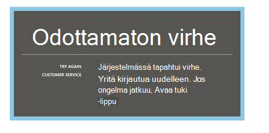
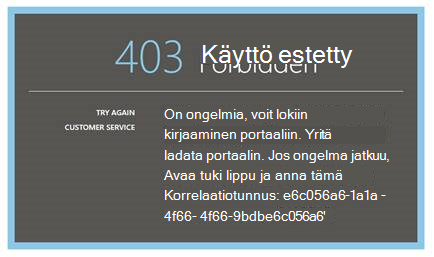
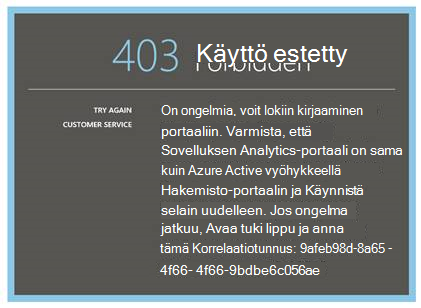
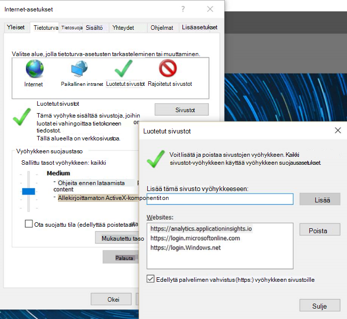
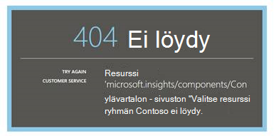
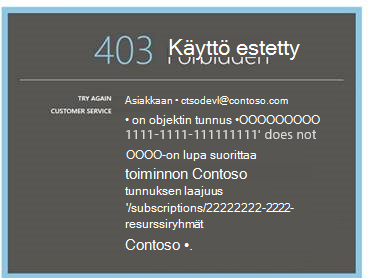
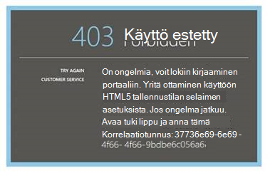
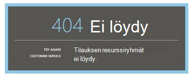
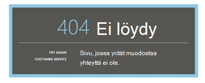

<properties 
    pageTitle="Vianmääritys Analytics - sovelluksen tiedot tehokkaita hakutyökalun | Microsoft Azure" 
    description="Hakemuksen tiedot analytics ongelmia? Aloita tästä. " 
    services="application-insights" 
    documentationCenter=""
    authors="alancameronwills" 
    manager="douge"/>

<tags 
    ms.service="application-insights" 
    ms.workload="tbd" 
    ms.tgt_pltfrm="ibiza" 
    ms.devlang="na" 
    ms.topic="article" 
    ms.date="07/11/2016" 
    ms.author="awills"/>

# Hakemuksen tiedot Analytics vianmääritys

[Hakemuksen tiedot Analytics](app-insights-analytics.md)ongelmia? Aloita tästä. Analyysin on Visual Studio hakemuksen tiedot tehokas haku-työkalu.

## Rajoitukset

* Tällä hetkellä kyselytulokset on rajoitettu juuri viimeisten tietojen viikon ajan.
* Olemme testaamista selaimet: uusin Chrome reuna ja Internet Explorer-versioissa.

## Tunnetut ei ole yhteensopiva selaimen tunnisteet

* Ghostery

Tunnisteen poistaminen käytöstä tai käytä toista selainta.

##"Odottamaton virhe"

Sisäinen virhe aikana portaalin runtime – käsittelemättömän poikkeuksen vuoksi.

* Tyhjennä selaimen välimuisti. 

## 403... Yritä ladata uudelleen

Todennus, jotka liittyvät virhe (todennuksen aikana tai access-tunnuksen luonnin aikana). Portaalissa on ehkä ei voi palauttaa muuttamatta selaimen asetukset.

* Tarkista selaimessa [kolmannen osapuolen evästeet valintaruudut ovat käytössä](#cookies) . 

## 403... Varmista vyöhykkeellä

Todennus, jotka liittyvät virhe (todennuksen aikana tai access-tunnuksen luonnin aikana). Portaalissa on ehkä ei voi palauttaa muuttamatta selaimen asetukset.

1. Tarkista selaimessa [kolmannen osapuolen evästeet valintaruudut ovat käytössä](#cookies) . 

2. Olet käyttänyt suosikki, kirjanmerkki tai tallennettu linkki avaa Analytics-portaali? Olet kirjautunut sisään eri tunnistetietoja kuin voit käyttää, kun olet tallentanut linkin?

2. Kokeile--yksityinen tai incognito-selainikkunassa (kuten windows Sulje). Sinun on annettava tunnistetiedot. 

2. Avaa toisen (tavallisen) selainikkuna ja siirry [Azure](https://portal.azure.com). Kirjaudu ulos. Avaa linkkiä ja kirjaudu sisään tarvittavat tunnistetiedot.

2. Reunan ja Internet Explorerin käyttäjät pääsevät myös tämän virheen, kun Luotetut vyöhykkeen asetukset eivät ole tuettuja.

    Tarkista [Analytics portal](https://analytics.applicationinsights.io) - ja [Azure Active Directory-portaalin](https://portal.azure.com) ovat samassa vyöhykkeellä:

 * Avaa Internet Explorerin **Internet-asetukset**, **Suojaus**, **Luotetut sivustot**, **sivustot**:

    

    Valitse sivustot-luettelosta Jos jokin seuraavista URL-osoitteista on mukana, varmista, että muut sisältyvät myös:

    https://Analytics.applicationinsights.IO 
   https://Login.microsoftonline.com 
   https://Login.Windows.NET

## 404... Resurssia ei löydy

Sovelluksen resurssi on poistettu sovelluksen tiedot, ja se ei enää. Näin voi käydä, jos olet tallentanut Analytics-sivun URL-osoite.

## 403... Lupaa ei

Ei ole oikeutta tämän sovelluksen avaaminen Analytics.

* Hankit linkin joltakulta? Pyydä heitä varmistaaksesi, että olet [lukijat ja osallistujien resurssin ryhmän](app-insights-resources-roles-access-control.md).
* Tallensit käyttämällä eri tunnistetietoja linkin? Avaa [Azure portal](https://portal.azure.com), kirjaudu ulos ja yritä sitten tätä linkkiä uudelleen oikeat käyttöoikeudet.

## 403... HTML5-tallennustilan

Tutustu portal käyttää HTML5 localStorage ja sessionStorage.

* Chrome: Asetukset-tietosuoja sisältöasetukset.
* Internet Explorer: Internet-asetukset, Lisäasetukset-välilehdessä suojaus, ota selaimen Datatallennus

## 404... Tilaus ei löydy

URL-osoite on virheellinen. 

* Avaa app resurssi [Sovelluksen tiedot](https://portal.azure.com)-portaalissa. Käytä Analytics-painike.

## 404... sivua ei ole

URL-osoite on virheellinen.

* Avaa app resurssi [Sovelluksen tiedot](https://portal.azure.com)-portaalissa. Käytä Analytics-painike.

## Kolmannen osapuolen evästeet käyttöön

  Katso, [miten voit poistaa käytöstä kolmannen osapuolen evästeet](http://www.digitalcitizen.life/how-disable-third-party-cookies-all-major-browsers), mutta huomaat annettava **käyttöön** niitä.

## Jos mikään muu ei onnistu    

[Ota meihin yhteyttä](app-insights-get-dev-support.md).
 
[AZURE.INCLUDE [app-insights-analytics-footer](../../includes/app-insights-analytics-footer.md)]

