<properties 
    pageTitle="Analytics - sovelluksen tiedot tehokas haku-työkalun avulla | Microsoft Azure" 
    description="Voit käyttää Analytics-sovelluksen tiedot tehokkaita diagnostiikan hakutyökalun. " 
    services="application-insights" 
    documentationCenter=""
    authors="danhadari" 
    manager="douge"/>

<tags 
    ms.service="application-insights" 
    ms.workload="tbd" 
    ms.tgt_pltfrm="ibiza" 
    ms.devlang="na" 
    ms.topic="article" 
    ms.date="10/21/2016" 
    ms.author="awills"/>

# Hakemuksen tiedot Analytics käyttäminen

[Analyysin](app-insights-analytics.md) on tehokas haku-toiminnon [Hakemuksen tiedot](app-insights-overview.md). Nämä sivut kuvaavat Analytics-kyselykieltä.

* **[Johdanto videossa](https://applicationanalytics-media.azureedge.net/home_page_video.mp4)**.
* Jos sovellus ei ole lähettää tiedot sovelluksen havainnollistamisen vielä **[Kokeile Analytics-Simuloitu tietojamme](https://analytics.applicationinsights.io/demo)** .

## Avoinna Analytics

Napsauta sinua sovelluksen koti resurssin sovelluksen tiedot-analyysin.

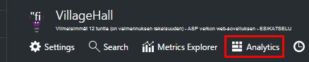

Sisäinen opetusohjelman tutustutaan joitakin ideoita toiminnot.

Tällä [tähän laajemmat esittely](app-insights-analytics-tour.md).

## Kyselyn lisääminen telemetriatietojen

### Kirjoita kyselyn

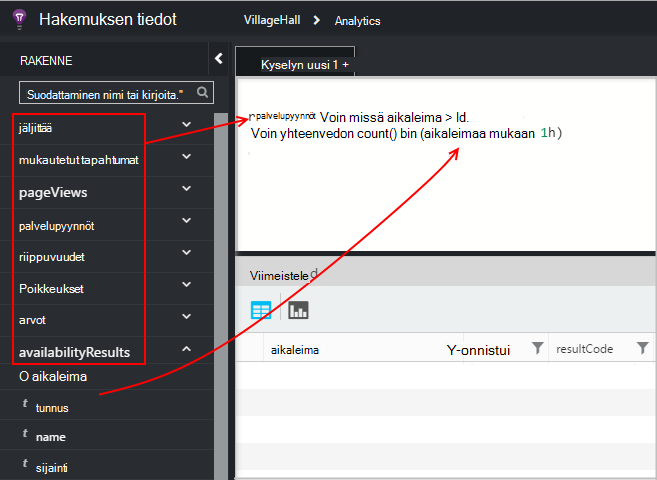

Alkavat luettelossa vasemmalle (tai [alueen](app-insights-analytics-reference.md#range-operator) tai [union](app-insights-analytics-reference.md#union-operator) -operaattorit) taulukoiden nimiin. Käytä `|` [toimijoiden](app-insights-analytics-reference.md#queries-and-operators)putkijohto luomiseen. IntelliSense kehottaa operaattorit ja osa, jota voit käyttää lausekkeen osat.

Katso [Analytics kielen yleiskatsaus](app-insights-analytics-tour.md) ja [viittaus language](app-insights-analytics-reference.md).

### Kyselyn suorittaminen

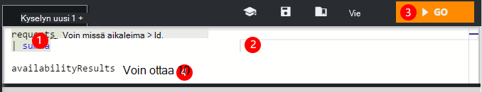

1. Voit käyttää yhden rivin kyselyn.
2. Aseta kohdistin sisällä tai jonka haluat suorittaa kyselyn lopussa.
3. Valitse Siirry Suorita kysely.
4. Kyselyn ei pidä tyhjiä rivejä. Voit pitää useiden erillisten kyselyjen yhden kysely-välilehdessä erottamalla ne tyhjiä rivejä. Kun kohdistin yksi suoritetaan.

### Tallenna kysely

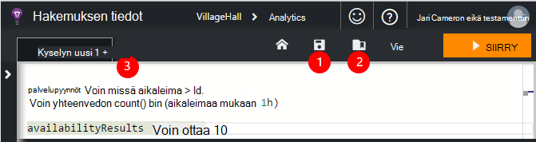

1. Tallentaa nykyisen kyselytiedoston.
2. Avaa tallennettu kysely-tiedosto.
3. Luo uusi kyselytiedosto.

## Katso sen tiedot

Laajenna kaikki rivi tuloksissa nähdäksesi sen luettelo kaikista ominaisuudet. Voit laajentaa edelleen minkä tahansa ominaisuus, joka on rakenteellisia - arvo, esimerkiksi mukautettuja dimensioita ja luetteloa poikkeuksen pinon.

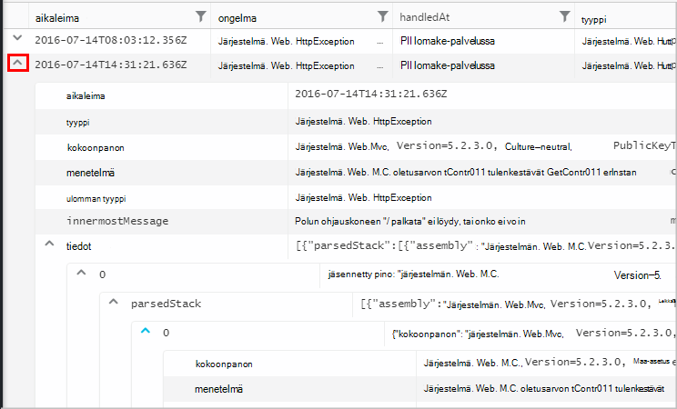

 

## Järjestää tulokset

Voit lajitella, suodattaa, sivuta ja ryhmitellä kyselyn palauttamien tulokset.

> [AZURE.NOTE] Lajittelu, ryhmittely ja suodattaminen selaimessa ei suorita kysely uudelleen. Vain ne järjestää uudelleen, jotka on palautettu viimeisen kyselyn tulokset. 
> 
> Näiden tehtävien suorittamiseen palvelimeen, ennen kuin tulokset palautetaan, Kirjoita kyselyn [lajitteleminen](app-insights-analytics-reference.md#sort-operator), [yhteenvedon](app-insights-analytics-reference.md#summarize-operator) ja [jossa](app-insights-analytics-reference.md#where-operator) operaattoreita.

Valitse sarakkeet, jotka haluat nähdä, sarakeotsikoiden avulla järjestystä vetämällä ja sarakkeiden kokoa vetämällä niiden reunat.

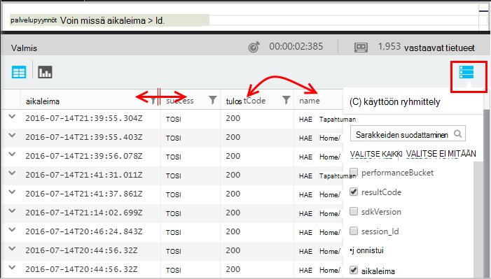

### Kohteiden lajittelu ja suodatus

Lajittele tulokset napsauttamalla sarakkeen otsikko. Lajittele tavalla napsauttamalla uudelleen ja valitse kolmannen, kun haluat palata alkuperäiseen järjestys kyselyn palauttamien.

Suodatinkuvakkeen avulla voit tarkentaa hakua.

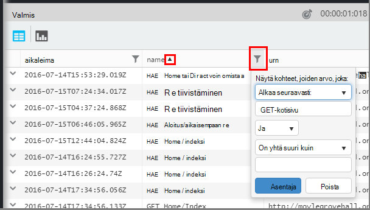

### Ryhmittelyperuste

Jos haluat lajitella useita sarakkeita, käytä ryhmittely. Ensin otettava ja vedä sarakeotsikoiden taulukon yläpuolella olevaa tilaa.

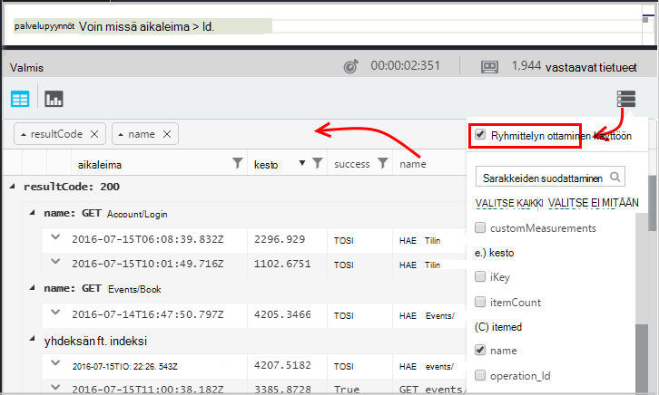

### Puuttuu joitakin tuloksia?

Ei-portaalista palautettujen tulosten noin 10 k rivien enimmäismäärä. Ilmoitus näyttää, jos siirryt ylitetty. Jos näin tapahtuu, lajitteleminen taulukossa tulokset eivät aina näyttää kaikki todellinen ensimmäisen tai viimeisen tulokset. 

Se on hyvä välttää pallolla rajoitus. Käytä operaattoreita, kuten:

* [Jos aikaleima > ago(3d)](app-insights-analytics-reference.md#where-operator)
* [Ensimmäiset 100 aikaleima mukaan](app-insights-analytics-reference.md#top-operator) 
* [Ota 100](app-insights-analytics-reference.md#take-operator)
* [Yhteenveto](app-insights-analytics-reference.md#summarize-operator) 

## Kaaviot

Valitse kaaviotyyppi, kuten:

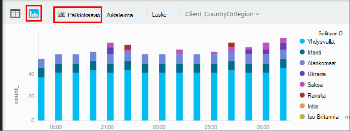

Jos sinulla on useita sarakkeita oikealle tietuetyypeistä, voit valita x ja y-akselit ja sarakkeen dimensioiden Jaa tulokset mukaan.

Oletusarvon mukaan tulokset näytetään aluksi taulukoksi ja valitset kaavio manuaalisesti. Mutta voit tehdä [hahmonnetaan direktiivin](app-insights-analytics-reference.md#render-directive) kyselyn lopussa Valitse kaavio.

## Raporttinäkymät-ikkunan kiinnittäminen

Voit kiinnittää kaavion tai taulukon yhteen [jaettuun raporttinäkymät](app-insights-dashboards.md) - vain valitsemalla PIN-tunnuksen. (Voit joutua [päivityksen sovelluksen käyttäjän hinnat paketti](app-insights-pricing.md) , voit ottaa tämän toiminnon.) 

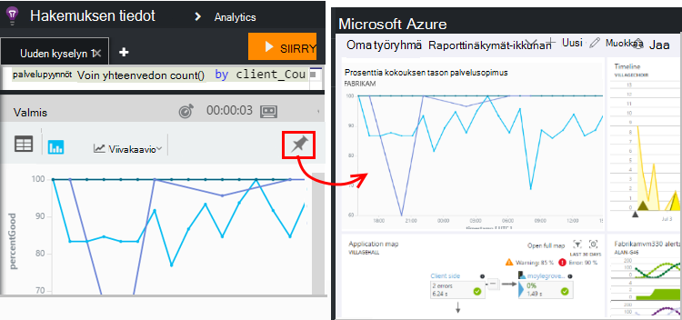

Tämä tarkoittaa, että kun lisäät yhdessä Raporttinäkymät-ikkunan avulla voit valvoa suorituskykyä tai WWW-palveluihin, voit lisätä varsin monimutkainen analyysi muita tietoja: n rinnalla. 

Voit kiinnittää taulukon koontinäyttö, jos siinä on neljä tai vähemmän sarakkeet. Vain seitsemän Ylimmät rivit näkyvät.

#### Raporttinäkymät-ikkunan päivittäminen

Koontinäytön kiinnitettyinä kaavio päivittyy automaattisesti uudelleen suorittamalla kyselyn noin puolessa tunnissa.

#### Automaattinen yksinkertaistaminen

Joissakin tapauksissa tiettyjen yksinkertaistaminen niitä käytetään kaavion, kun kiinnität sen Raporttinäkymät-ikkunan.

Kun Kiinnitä kaavio, jossa on paljon erilliset palkkien (yleensä palkkikaavion) vähemmän täyttää palkkien automaattisesti ryhmitetty yhden "muut" palkin. Esimerkiksi tämä kysely

    requests | summarize count_search = count() by client_CountryOrRegion

Analytics näyttää seuraavanlaiselta:

mutta kun kiinnität raporttinäkymän, se näyttää tältä:

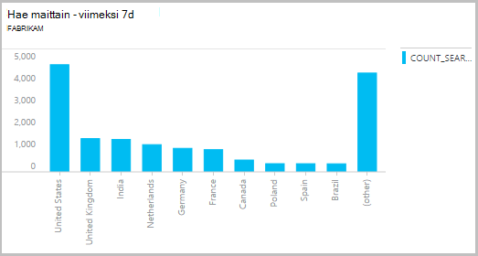

## Tietojen vieminen Exceliin

Kun suoritat kyselyn, voit ladata .csv-tiedoston. Valitse **Vie Exceliin**.

## Power BI vieminen

Siirrä kohdistin kysely ja valitse **Vie Power BI**.

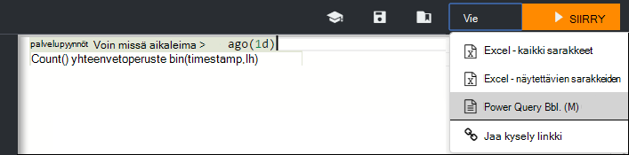

Power BI: n Suorita kysely. Voit määrittää sen päivittämiseen aikataulun.

Voit luoda Power BI-koontinäytöt, joka yhdistää tietoja useista eri lähteistä.

[Lisätietoja Power BI vieminen](app-insights-export-power-bi.md)

[AZURE.INCLUDE [app-insights-analytics-footer](../../includes/app-insights-analytics-footer.md)]

