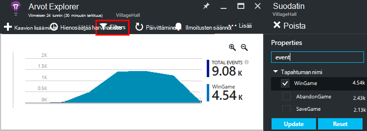

<properties 
    pageTitle="Sovelluksen tiedot-Ohjelmointirajapinnan mukautetut tapahtumat ja arvot | Microsoft Azure" 
    description="Lisää muutama koodin rivit laitteen tai desktop app, verkkosivulle tai palvelu, seurantaa ja vianmääritys." 
    services="application-insights"
    documentationCenter="" 
    authors="alancameronwills" 
    manager="douge"/>
 
<tags 
    ms.service="application-insights" 
    ms.workload="tbd" 
    ms.tgt_pltfrm="ibiza" 
    ms.devlang="multiple" 
    ms.topic="article" 
    ms.date="10/19/2016" 
    ms.author="awills"/>

# <a name="application-insights-api-for-custom-events-and-metrics"></a>Sovelluksen tiedot-Ohjelmointirajapinnan mukautetut tapahtumat ja arvot 

*Hakemuksen tiedot on esikatselu.*

Lisää muutama koodin rivit-sovelluksessa voit selvittää, mitä käyttäjät tekevät sitä tai ongelmien vianmäärityksessä. Voit lähettää telemetriatietojen laitteen ja työpöytäsovelluksiin, verkkosovellukset ja verkko-palvelimiin. [Visual Studio hakemuksen tiedot](app-insights-overview.md) core telemetriatietojen API voit lähettää mukautetut tapahtumat ja arvot ja oman standard telemetriatietojen-versioissa. Tämä API on sama Ohjelmointirajapinnan, jota käytetään vakio-sovelluksen tiedot helposti.

## <a name="api-summary"></a>API yhteenveto

Ohjelmointirajapinnan on yhtenäinen kaikissa ympäristöissä, muutaman pieni variaatiot lukuun ottamatta.

Menetelmä | Käytetään
---|---
[`TrackPageView`](#page-views) | Sivujen, näytöissä, terät tai lomakkeet
[`TrackEvent`](#track-event) | Käyttäjän toimet ja muita tapahtumia. Käytetään seuraamaan käyttäjän toiminnan tai suorituskyvyn seurantaa varten.
[`TrackMetric`](#track-metric) | Suorituskyvyn mitat kuten jonon pituuden ei liity tietyn tapahtumat
[`TrackException`](#track-exception)|Kirjaudu poikkeukset vianmäärityksen. Jäljitä niiden ilmetä suhteessa muita tapahtumia ja tarkastella pinon jäljittää.
[`TrackRequest`](#track-request)| Kirjaudu korkojakso ja suorituskyvyn analysointi-palvelimen pyynnöt kestoa.
[`TrackTrace`](#track-trace)|Vianmäärityslokeihin viestit. Voit myös siepata 3rd osapuolen lokitiedot.
[`TrackDependency`](#track-dependency)|Kirjaudu keston ja ulkoiset osat, josta sovelluksen riippuvainen kutsujen taajuus.

Voit [liittää ominaisuudet ja arvot](#properties) useimmat telemetriatietojen puhelut. 


## <a name="prep"></a>Ennen aloittamista

Jos et ole tehnyt nämä vielä:

* Lisää sovellus havainnollistamisen SDK projektin:
 * [ASP.NET-projekti][greenbrown]
 * [Java-projekti][java] 
 * [JavaScript-web-sivuille][client]   

* Palvelimen laitteen tai web-koodin ovat seuraavat:

    *C#:*`using Microsoft.ApplicationInsights;`

    *VB:*`Imports Microsoft.ApplicationInsights`

    *Java:*`import com.microsoft.applicationinsights.TelemetryClient;`

## <a name="construct-a-telemetryclient"></a>Rakennetta TelemetryClient

Käyttää TelemetryClient esiintymä (paitsi JavaScript-web-sivujen):

*C#:* 

    private TelemetryClient telemetry = new TelemetryClient();

*VB:* 

    Private Dim telemetry As New TelemetryClient

*Java*

    private TelemetryClient telemetry = new TelemetryClient();

TelemetryClient on viestiketjun sopivaa.

Suosittelemme, että käytät esiintymän `TelemetryClient` kunkin sovelluksen moduulin. Esimerkiksi voi olla yksi `TelemetryClient` -web-palvelu ja raportoi saapuvien pyyntöjen ja toinen middleware luokan raportin business logiikan tapahtumat. Voit määrittää ominaisuuksia kuten `TelemetryClient.Context.User.Id` seurata käyttäjille ja istunnot, tai `TelemetryClient.Context.Device.Id` tunnistavan koneen. Nämä tiedot on liitetty kaikki tapahtumat, jotka on lähettänyt esiintymä.


## <a name="track-event"></a>Seuranta-tapahtuma

Hakemuksen tiedot *mukautetun tapahtuman* on arvopiste, että voit näyttää sekä [Arvot] Explorerissa[ metrics] koostetun määränä ja myös yksittäisten esiintymien [Diagnostiikan]hakutoiminnossa[diagnostic]. (Se ei ole yhteydessä MVC tai muita framework "tapahtumien.") 

Lisää TrackEvent puhelut koodissa laskemaan, kuinka usein käyttäjät valita tietyn toiminnon, kuinka usein saavuttaa tietyn tavoitteet tai tehdä ehkä tietyntyyppisten virheen. 

Esimerkiksi Ottelu App lähettää tapahtuman aina, kun käyttäjä voittaa Ottelu: 

*JavaScript*

    appInsights.trackEvent("WinGame");

*C#*
    
    telemetry.TrackEvent("WinGame");

*VB*


    telemetry.TrackEvent("WinGame")

*Java*

    telemetry.trackEvent("WinGame");


### <a name="view-your-events-in-the-azure-portal"></a>Tapahtumien tarkasteleminen Azure portaalissa

Jos haluat nähdä tapahtumien määrä, Avaa [Metrijärjestelmä Explorer](app-insights-metrics-explorer.md) -sivu, uuden kaavion lisääminen ja valitse tapahtumat.  


Voit vertailla eri tapahtumien määrät, Määritä kaaviolajin ruudukko ja ryhmän tapahtuman nimen mukaan:


Valitse ruudukon avulla voit tarkastella kyseisen tapahtuman yksittäiset esiintymät tapahtuman nimi.


Valitse mikä tahansa esiintymä yksityiskohdat.

Keskittyminen Etsi tai metrijärjestelmän Explorer tietyn tapahtumat Määritä suodatin sivu tapahtumanimiä, jotka haluat muuttaa:



## <a name="track-metric"></a>Seuraa arvo

TrackMetric avulla voit lähettää arvot, joita ei ole liitetty tiettyyn tapahtumat. Voit esimerkiksi valvoa jonon pituuden säännöllisin väliajoin. 

Arvot näkyvät tilastokaavion metrisillä Resurssienhallinnassa, mutta toisin kuin tapahtumia, ei voi hakea diagnostiikan Hae yksittäisten esiintymät.

Metrijärjestelmän arvojen on oltava > = 0 välttämättä näy oikein.


*JavaScript*

    appInsights.trackMetric("Queue", queue.Length);

*C#*

    telemetry.TrackMetric("Queue", queue.Length);

*VB*

    telemetry.TrackMetric("Queue", queue.Length)

*Java*

    telemetry.trackMetric("Queue", queue.Length);

Itse asiassa voivat tehdä nämä toimet taustan viestiketjun:

*C#*

    private void Run() {
     var appInsights = new TelemetryClient();
     while (true) {
      Thread.Sleep(60000);
      appInsights.TrackMetric("Queue", queue.Length);
     }
    }


Näet tulokset, Avaa mittarit Resurssienhallinta ja lisätä uuden kaavion tietolähteenä. Määritä tätä yhteyttä arvo.


On joitakin [arvot enimmäismäärään](#limits) voit käyttää.

## <a name="page-views"></a>Sivun näkymät

Laitteen tai verkkosivun app sivun näkymän telemetriatietojen lähetetään oletusarvoisesti, kun kunkin sivun tai näytön ladataan. Mutta voit muuttaa sivun näkymät seurata uusia tai eri aikoina. Esimerkiksi-sovelluksessa, jossa näkyy välilehtiä tai terät, haluat ehkä voi seurata "sivu" aina, kun käyttäjä avaa uusi sivu. 


Käyttäjien ja istunnon tiedot lähetetään ominaisuudet sekä page views niin käyttäjä ja istunnon kaavioiden tulee toiminnassa ei sivun näkymän telemetriatietojen.

#### <a name="custom-page-views"></a>Mukautetun sivun näkymät

*JavaScript*

    appInsights.trackPageView("tab1");

*C#*

    telemetry.TrackPageView("GameReviewPage");

*VB*

    telemetry.TrackPageView("GameReviewPage")


Jos sinulla on useita välilehtiä sisällä eri HTML-sivuja, voit määrittää URL-Osoitteen liian:

    appInsights.trackPageView("tab1", "http://fabrikam.com/page1.htm");

#### <a name="timing-page-views"></a>Ajoitus-sivulla näkymät

Oletusarvon mukaan ajat valmiiksi "Sivun näkymän latausajasta" mitataan kun selain lähettää kutsun, kunnes selaimen sivun kuormituksen tapahtumaa kutsutaan.

Sen sijaan voit:

* Määritä eksplisiittinen kesto [trackPageView](https://github.com/Microsoft/ApplicationInsights-JS/blob/master/API-reference.md#trackpageview) puhelun aikana.
 * `appInsights.trackPageView("tab1", null, null, null, durationInMilliseconds);`
* Käytä ajoittamisen puhelut sivunäkymän `startTrackPage` ja `stopTrackPage`.

*JavaScript*

    // To start timing a page:
    appInsights.startTrackPage("Page1");

... 

    // To stop timing and log the page:
    appInsights.stopTrackPage("Page1", url, properties, measurements);

Nimeä, voit käyttää, kun ensimmäinen parametri liittää aloittamisesta ja lopettamisesta puhelut. Oletusarvoisesti nykyisen sivun nimi. 

Sivun kuormituksen kestot tuloksena versio metrijärjestelmä Explorer näkyvät johdettuja aloittamisesta ja lopettamisesta puhelut väli. On sinulle mitä todellisuudessa aikaa aikaväli.

## <a name="track-request"></a>Seuraa pyyntö

Kirjaudu pyyntöjen SDK-palvelimen avulla. 

Voit myös soittaa se itse voit simuloida pyynnöt kontekstissa kohtaa, johon ei ole käynnissä Internet-palvelun moduuli.

*C#*

    // At start of processing this request:

    // Operation Id and Name are attached to all telemetry and help you identify
    // telemetry associated with one request:
    telemetry.Context.Operation.Id = Guid.NewGuid().ToString();
    telemetry.Context.Operation.Name = requestName;
    
    var stopwatch = System.Diagnostics.Stopwatch.StartNew();

    // ... process the request ...

    stopwatch.Stop();
    telemetry.TrackRequest(requestName, DateTime.Now,
       stopwatch.Elapsed, 
       "200", true);  // Response code, success


## <a name="operation-context"></a>Toiminnon yhteydessä

Telemetriatietojen kohteet on liitetty yhdessä mukaan niihin liittyvät yleiset toiminnon tunnus Seurannan moduulin vakio pyynnön toimii näin poikkeukset ja muita tapahtumia, jotka on lähetetty HTTP-pyyntöä käsiteltäessä. [Haku](app-insights-diagnostic-search.md) -ja [Analytics](app-insights-analytics.md)-löytämistä pyynnön liittyvien tapahtumien tunnus avulla. 

Voit määrittää toiminnon yhteydessä tätä mallia käyttämällä on helpointa tunnuksen määrittäminen:

    // Establish an operation context and associated telemetry item:
    using (var operation = telemetry.StartOperation<RequestTelemetry>("operationName"))
    {
        // Telemetry sent in here will use the same operation ID.
        ...
        telemetry.TrackEvent(...); // or other Track* calls
        ...
        // Set properties of containing telemetry item - for example:
        operation.Telemetry.ResponseCode = "200";
        
        // Optional: explicitly send telemetry item:
        telemetry.StopOperation(operation);

    } // When operation is disposed, telemetry item is sent.

Sekä määrittäminen toiminto-konteksti- `StartOperation` Luo telemetriatietojen kohteen tyyppi, ja lähettää sen, kun toiminnon luovuttaa tai jos eksplisiittisesti kutsua `StopOperation`. Jos käytät `RequestTelemetry` telemetriatietojen Tallennusmuoto-sitten sen kesto on määritetty aloittamisesta ja lopettamisesta ajoitetun väli.

Toiminnon kontekstit ei voi asettaa sisäkkäin. Jos toiminnon yhteydessä on jo olemassa, sen tunnus on liitetty kaikki sisältämät kohteet, joka on luotu käyttämällä StartOperation kohde mukaan luettuna.

Etsi-toiminnon yhteydessä käytetään liittyvien kohteiden luettelon luominen:


## <a name="track-exception"></a>Seurata poikkeuksen

Lähetä poikkeukset sovelluksen havainnollistamisen: Voit [laskea ne][metrics], ongelma; korkojakso osoittimena ja [tarkastella yksittäisiin][diagnostic]. Raportit sisältävät pinon jälkitiedot.

*C#*

    try
    {
        ...
    }
    catch (Exception ex)
    {
       telemetry.TrackException(ex);
    }

*JavaScript*

    try
    {
       ...
    }
    catch (ex)
    {
       appInsights.trackException(ex);
    }

SDK: T todellisen useita poikkeuksia automaattisesti, joten sinulla ei aina kutsu TrackException erikseen.

* ASP.NET: [havaitsemaan poikkeukset koodin kirjoittaminen](app-insights-asp-net-exceptions.md)
* J2EE: [poikkeukset on pyydetty automaattisesti](app-insights-java-get-started.md#exceptions-and-request-failures)
* JavaScript: Pyydettyjen automaattisesti. Jos haluat poistaa käytöstä automaattinen sivustokokoelman, Lisää rivi, jonka voit lisätä verkkosivuille koodikatkelman:

    ```
    ({
      instrumentationKey: "your key"
      , disableExceptionTracking: true
    })
    ```


## <a name="track-trace"></a>Seurata seuranta 

Tämän toiminnon avulla voit selvittää ongelmia lähettämällä 'linkkipolun kirjausketju' hakemuksen tiedot. Voit lähettää diagnostiikan tietoja, ja tarkastaa ne [Diagnostiikan]hakutoiminnossa[diagnostic]. 

 

[Kirjaudu sovittimet] [ trace] Tämä API avulla voit lähettää kolmannen osapuolen lokit-portaaliin.


*C#*

    telemetry.TrackTrace(message, SeverityLevel.Warning, properties);


Voit etsiä viestin sisältöä, mutta (toisin kuin ominaisuusarvoihin) ei voi suodattaa sitä.

Valitse kokorajoitus `message` on paljon suurempi kuin raja-ominaisuudet.
TrackTrace etuna on se, että voit laittaa tietojen suhteellisen pitkää viestiä. Esimerkiksi voi koodata kirjaa tietoja siellä.  


Lisäksi voit lisätä vakavuus tason viestiin. Ja muut telemetriatietojen, kuten voit lisätä ominaisuuden arvoja, jotka voit tehdä suodattimen tai Hae erilaisia arvojoukkoja jäljittää Ohje. Esimerkki:


    var telemetry = new Microsoft.ApplicationInsights.TelemetryClient();
    telemetry.TrackTrace("Slow database response",
                   SeverityLevel.Warning,
                   new Dictionary<string,string> { {"database", db.ID} });

Tämä mahdollisella tavalla, [Etsi][diagnostic], helposti suodattamaan tietyn vakavuus tason tietyn tietokannan liittyvät viestit.

## <a name="track-dependency"></a>Seuranta-riippuvuus

Puhelun avulla voit seurata vastauksen työajat ja success korvaukset koodin ulkoisen osan kutsuja. Tulokset näkyvät portaalissa riippuvuus-kaavioita. 

```C#

            var success = false;
            var startTime = DateTime.UtcNow;
            var timer = System.Diagnostics.Stopwatch.StartNew();
            try
            {
                success = dependency.Call();
            }
            finally
            {
                timer.Stop();
                telemetry.TrackDependency("myDependency", "myCall", startTime, timer.Elapsed, success);
            }
```

Muista, että SDK: T Sisällytä [riippuvuuden moduuli](app-insights-dependencies.md) , joka löytää ja seuraa tiettyjä riippuvuus palvelimelle soittaa automaattisesti – esimerkiksi tietokantojen ja REST API. Sinun on asennettava palvelimeen tehdä toimi moduulin agentti. Puhelun milloin käyttää, jos haluat seurata puheluita, jotka eivät ole pyydetty automaattinen seuranta tai jos et halua asentaa agentti.

Käytöstä vakio riippuvuuden seuranta-moduulin [ApplicationInsights.config](app-insights-configuration-with-applicationinsights-config.md) Muokkaa ja poista viittaus `DependencyCollector.DependencyTrackingTelemetryModule`.


## <a name="flushing-data"></a>Järjestetään tiedot

Tavallisesti SDK lähettää joskus Pienennä vaikutus käyttäjälle valinnut tiedot. Kuitenkin joissakin tilanteissa haluat ehkä tyhjentämään puskuri – esimerkiksi jos käytössäsi on SDK-sovellus, joka sulkee.

*C#*

    telemetry.Flush();

    // Allow some time for flushing before shutdown.
    System.Threading.Thread.Sleep(1000);

Huomaa, että funktio on asynkroninen [palvelimen telemetriatietojen kanavaa](https://www.nuget.org/packages/Microsoft.ApplicationInsights.WindowsServer.TelemetryChannel/), mutta painikkeen, jos haluat käyttää ladatun kanavan tai [pysyvä kanava](app-insights-api-filtering-sampling.md#persistence-channel).


## <a name="authenticated-users"></a>Todennetut käyttäjät

Online-sovelluksessa käyttäjät ovat oletusarvoisesti merkittyä eväste. Käyttäjä voi laskettavat useammin kuin kerran, jos sovellus käyttää toiseen tietokoneeseen tai selaimen tai poistat evästeet. 

Mutta sovelluksen kirjautuminen käyttäjille, saat tarkempia Laske määrittämällä todennetun käyttäjän selaimen koodi:

*JavaScript*

```JS
    // Called when my app has identified the user.
    function Authenticated(signInId) {
      var validatedId = signInId.replace(/[,;=| ]+/g, "_");
      appInsights.setAuthenticatedUserContext(validatedId);
      ...
    }
```

ASP.NET sivuston MVC-sovellus, esimerkiksi:

*Razor*

        @if (Request.IsAuthenticated)
        {
            <script>
                appInsights.setAuthenticatedUserContext("@User.Identity.Name
                   .Replace("\\", "\\\\")"
                   .replace(/[,;=| ]+/g, "_"));
            </script>
        }

Ei tarvitse käyttää käyttäjän todellinen kirjautumisnimi. Sen on oltava tunnuksen, joka on yksilöllinen kyseiselle käyttäjälle vain. Se saa sisältää välilyöntejä tai merkkejä `,;=|`. 

Käyttäjätunnus on myös istunnon eväste määrittäminen ja lähettää palvelimeen. Jos palvelin SDK on asennettu, todennetun käyttäjän lähetetään osana asiakkaan ja palvelimen telemetriatietojen kontekstin ominaisuuksien niin, että voit suodattaa ja etsiä sitä.

Jos sovelluksen groups käyttäjien tileille, voit myös siirtää tunniste tiliäsi (samaa merkin rajoituksia).


      appInsights.setAuthenticatedUserContext(validatedId, accountId);

[Arvot explorer](app-insights-metrics-explorer.md)voit luoda kaavion, joka sisältää **käyttäjät, todennettu** ja **Käyttäjätilit**. 

Voit myös [haun] [ diagnostic] asiakkaan arvopisteiden tiettyjen käyttäjien nimet ja -tilien kanssa.

## <a name="properties"></a>Suodattaminen, Etsi ja määritetään tietojen ominaisuudet

Voit liittää tapahtumien ominaisuudet ja mitat (ja myös arvot,-sivulle näkymien, poikkeukset ja telemetriatietojen muiden tietojen).

**Ominaisuudet** ovat merkkijonoarvot, joiden avulla voit suodattaa oman telemetriatietojen käyttö-raporteissa. Esimerkiksi sovelluksen tarjoaa useita visualisointi n, jos haluat liittää kuhunkin tapahtumaan pelin nimi niin, että näet, mitkä visualisointi n ovat suosittu. 

Ei rajoitettu on noin 1k-merkkijonon pituus. (Jos haluat lähettää suuria tiedot näkyvissä, käytä [TrackTrace](#track-trace)viesti-parametrin.)

**Arvot** ovat numeerisia arvoja, jotka voidaan esittää graafisesti. Haluat esimerkiksi tarkistaa, onko asteittain suureneminen tulosten oman pelaajat saavuttamiseksi. Kaavioiden voit Segmentoitu lähetettäviin tapahtuman ominaisuudet niin, että voi siirtyä eri tai pinottu kaavioiden toinen visualisointi n varten.

Metrijärjestelmän arvojen on oltava > = 0 välttämättä näy oikein.


Jotkin [Ominaisuudet, ominaisuusarvoihin, ja arvot enimmäismäärään](#limits) , jota voit käyttää on.


*JavaScript*

    appInsights.trackEvent
      ("WinGame",
         // String properties:
         {Game: currentGame.name, Difficulty: currentGame.difficulty},
         // Numeric metrics:
         {Score: currentGame.score, Opponents: currentGame.opponentCount}
         );

    appInsights.trackPageView
        ("page name", "http://fabrikam.com/pageurl.html",
          // String properties:
         {Game: currentGame.name, Difficulty: currentGame.difficulty},
         // Numeric metrics:
         {Score: currentGame.score, Opponents: currentGame.opponentCount}
         );
          

*C#*

    // Set up some properties and metrics:
    var properties = new Dictionary <string, string> 
       {{"game", currentGame.Name}, {"difficulty", currentGame.Difficulty}};
    var metrics = new Dictionary <string, double>
       {{"Score", currentGame.Score}, {"Opponents", currentGame.OpponentCount}};

    // Send the event:
    telemetry.TrackEvent("WinGame", properties, metrics);


*VB*

    ' Set up some properties:
    Dim properties = New Dictionary (Of String, String)
    properties.Add("game", currentGame.Name)
    properties.Add("difficulty", currentGame.Difficulty)

    Dim metrics = New Dictionary (Of String, Double)
    metrics.Add("Score", currentGame.Score)
    metrics.Add("Opponents", currentGame.OpponentCount)

    ' Send the event:
    telemetry.TrackEvent("WinGame", properties, metrics)


*Java*
    
    Map<String, String> properties = new HashMap<String, String>();
    properties.put("game", currentGame.getName());
    properties.put("difficulty", currentGame.getDifficulty());
    
    Map<String, Double> metrics = new HashMap<String, Double>();
    metrics.put("Score", currentGame.getScore());
    metrics.put("Opponents", currentGame.getOpponentCount());
    
    telemetry.trackEvent("WinGame", properties, metrics);


> [AZURE.NOTE] Huolehtia ei kirjautua henkilökohtaisia tietoja ominaisuudet.

**Jos olet käyttänyt mittarit**, Avaa metrijärjestelmä Resurssienhallinta ja lisätiedot mukautettu-ryhmästä:


*Jos yhteyttä metrijärjestelmä ei tule näkyviin tai Mukautettu-otsikon ei löydy, sulje valinta-sivu ja yritä myöhemmin. Joskus voi kestää tunnissa for arvot Koostettavan putkijohto kautta.*

**Jos olet käyttänyt ominaisuudet ja arvot**segmentin-ominaisuuden arvo:


**Diagnostiikan haku-**, voit tarkastella ominaisuuksia ja yksittäiset esiintymät tapahtuman arvot.


Tapahtuman esiintymien tietyn kiinteistöistä, joiden arvo hakukentän avulla.


[Lisätietoja haun lausekkeiden][diagnostic].

#### <a name="alternative-way-to-set-properties-and-metrics"></a>Vaihtoehtoista tapaa, jolla voit määrittää ominaisuudet ja arvot

Jos se on tarkoituksenmukaista, voit kerätä tapahtuman lisääminen erillinen objekti parametrit:

    var event = new EventTelemetry();

    event.Name = "WinGame";
    event.Metrics["processingTime"] = stopwatch.Elapsed.TotalMilliseconds;
    event.Properties["game"] = currentGame.Name;
    event.Properties["difficulty"] = currentGame.Difficulty;
    event.Metrics["Score"] = currentGame.Score;
    event.Metrics["Opponents"] = currentGame.Opponents.Length;

    telemetry.TrackEvent(event);

> [AZURE.WARNING] Ei käytä samaa telemetriatietojen kohteen esiintymää (`event` tässä esimerkissä) Soita Track*() useita kertoja. Tämä saattaa aiheuttaa telemetriatietojen lähetettäväksi virheellisistä määrityksistä kanssa.


## <a name="timed"></a>Ajoitustapahtumat

Joskus haluat kaavion, kuinka kauan jonkin toiminnon suorittaminen kestää. Esimerkiksi voit lukea tietää, kuinka kauan käyttäjien take ottaa huomioon Ottelu valinnat. Tämä on hyötyä esimerkki käyttää mitta-parametrin.


*C#*

    var stopwatch = System.Diagnostics.Stopwatch.StartNew();

    // ... perform the timed action ...

    stopwatch.Stop();

    var metrics = new Dictionary <string, double>
       {{"processingTime", stopwatch.Elapsed.TotalMilliseconds}};

    // Set up some properties:
    var properties = new Dictionary <string, string> 
       {{"signalSource", currentSignalSource.Name}};

    // Send the event:
    telemetry.TrackEvent("SignalProcessed", properties, metrics);


## <a name="defaults"></a>Mukautetun telemetriatietojen oletusominaisuudet

Jos haluat määrittää oletusarvon ominaisuusarvoihin joistakin mukautetun tapahtumia, joihin voit kirjoittaa, voit määrittää ne TelemetryClient. Liitetiedostotyypit asiakkaalle lähettämät telemetriatietojen jokaisen kohteen. 

*C#*

    using Microsoft.ApplicationInsights.DataContracts;

    var gameTelemetry = new TelemetryClient();
    gameTelemetry.Context.Properties["Game"] = currentGame.Name;
    // Now all telemetry will automatically be sent with the context property:
    gameTelemetry.TrackEvent("WinGame");
    
*VB*

    Dim gameTelemetry = New TelemetryClient()
    gameTelemetry.Context.Properties("Game") = currentGame.Name
    ' Now all telemetry will automatically be sent with the context property:
    gameTelemetry.TrackEvent("WinGame")

*Java*

    import com.microsoft.applicationinsights.TelemetryClient;
    import com.microsoft.applicationinsights.TelemetryContext;
    ...


    TelemetryClient gameTelemetry = new TelemetryClient();
    TelemetryContext context = gameTelemetry.getContext();
    context.getProperties().put("Game", currentGame.Name);
    
    gameTelemetry.TrackEvent("WinGame");


    
Yksittäisten telemetriatietojen puhelut voit ohittaa ominaisuuden niiden sanastot oletusarvot.

**Saat JavaScript-web-asiakkaille**, [käyttää JavaScriptiä telemetriatietojen Alustajien](#js-initializer).

**Voit lisätä kaikki telemetriatietojen ominaisuuksia** vakio sivustokokoelman moduulit tiedot mukaan lukien [Toteuta `ITelemetryInitializer` ](app-insights-api-filtering-sampling.md#add-properties).


## <a name="sampling-filtering-and-processing-telemetry"></a>Näyte, suodattaminen ja telemetriatietojen käsittely 

Voit kirjoittaa koodi oman telemetriatietojen ennen sen lähettämistä SDK. Käsittely on vakio telemetriatietojen-moduuleja, kuten HTTP pyynnön sivustokokoelman ja riippuvuuden sivustokokoelman lähetetyt tiedot.

* [Lisää ominaisuuksia](app-insights-api-filtering-sampling.md#add-properties) telemetriatietojen käyttämällä `ITelemetryInitializer` – esimerkiksi Lisää versio numeroiden, tai arvot lasketaan muita ominaisuuksia. 
* [Suodattaminen](app-insights-api-filtering-sampling.md#filtering) voit muokata tai hylkää telemetriatietojen ennen sen lähettämistä SDK: n käyttämällä `ITelemetryProcesor`. Voit hallita, mitä lähetetä tai poistetaan, mutta sinun on huomioon, että arvot tehosteen. Sen mukaan, miten voit hylätä kohteita voidaan menettää mahdollisuus siirtymiseen liittyvät kohteet.
* [Näyte](app-insights-api-filtering-sampling.md#sampling) on pakattu ratkaisu, voit pienentää äänenvoimakkuutta portaalin sovelluksestasi lähetettyjä tietoja. Se tekee vaikuttamatta näytetyt arvot ja vaikuttamatta järjestelmänvalvoja suorittaa ongelmien vianmääritystä siirtymällä liittyviä kohteita, kuten poikkeukset, pyynnöt ja sivun näkymien välillä.

[Opi lisää](app-insights-api-filtering-sampling.md)


## <a name="disabling-telemetry"></a>Telemetriatietojen poistaminen käytöstä

**Dynaamisesti Lopeta ja Käynnistä** kokoelma ja telemetriatietojen toimittaminen:

*C#*

```C#

    using  Microsoft.ApplicationInsights.Extensibility;

    TelemetryConfiguration.Active.DisableTelemetry = true;
```

**Valitun vakio keräilijän käytöstä** - esimerkiksi suorituskyvyn laskureita ja pyyntöjen riippuvuudet - Poista tai kommentoi pois asianomaiseen [ApplicationInsights.config][config]. Voit tehdä määrityksen, esimerkiksi jos haluat lähettää TrackRequest omiin tietoihisi.

## <a name="debug"></a>Kehittäjätilan

Aikana virheenkorjaus, se on hyödyllinen muodostamaan yhteyttä telemetriatietojen toimitettu kautta putkijohto niin, että näet tulokset heti. Voit myös get uusia viestejä, jotka auttavat jäljitys telemetriatietojen ongelmia. Poistaa sen käytöstä tuotannon, kuin se voi hidastaa sovelluksen.


*C#*
    
    TelemetryConfiguration.Active.TelemetryChannel.DeveloperMode = true;

*VB*

    TelemetryConfiguration.Active.TelemetryChannel.DeveloperMode = True


## <a name="ikey"></a>Määritä valitun mukautetun telemetriatietojen instrumentation näppäintä

*C#*
    
    var telemetry = new TelemetryClient();
    telemetry.InstrumentationKey = "---my key---";
    // ...


## <a name="dynamic-ikey"></a>Dynaaminen instrumentation avain

Ylös-kehitystä, Testaa ja tuotannon ympäristöissä telemetriatietojen sekoittamalla välttämiseksi voit [luoda erilliset sovelluksen tietoja resurssien] [ create] ja muuttaa niiden näppäimet ympäristön mukaan.

Sen sijaan, että hankkiminen määritystiedosto instrumentation-näppäintä, voit määrittää sen omassa koodissasi. Määrittää käyttäjäavainten alustus-menetelmää, kuten global.aspx.cs ASP.NET-palvelussa:

*C#*

    protected void Application_Start()
    {
      Microsoft.ApplicationInsights.Extensibility.
        TelemetryConfiguration.Active.InstrumentationKey = 
          // - for example -
          WebConfigurationManager.Settings["ikey"];
      ...

*JavaScript*

    appInsights.config.instrumentationKey = myKey; 


Verkkosivujen haluat ehkä määrittää WWW-palvelimen tilan sijaan coding se literaaleina kyselyjä komentosarja. Esimerkiksi web-sivun luotu ASP.NET-sovelluksessa:

*JavaScriptin Razor*

    <script type="text/javascript">
    // Standard Application Insights web page script:
    var appInsights = window.appInsights || function(config){ ...
    // Modify this part:
    }({instrumentationKey:  
      // Generate from server property:
      @Microsoft.ApplicationInsights.Extensibility.
         TelemetryConfiguration.Active.InstrumentationKey"
    }) // ...


## <a name="telemetrycontext"></a>TelemetryContext

TelemetryClient on konteksti-ominaisuus, joka sisältää useita arvoja, jotka lähetetään sekä kaikki telemetriatietojen tiedot. Ne asetetaan tavallisesti vakio telemetriatietojen moduuleissa, mutta voit myös määrittää niitä itse. Esimerkki:

    telemetry.Context.Operation.Name = "MyOperationName";

Jos määrität arvoja itse, harkitse rivi poistetaan [ApplicationInsights.config][config], niin, että arvot ja vakio-arvot eivät sekavalta.

* **Osa** Määrittää sovelluksen ja sen versio
* **Laite** Tietoja laitteen, jossa sovellus on käynnissä (web Apps-sovelluksissa, tämä on palvelin tai asiakas laite, josta lähetetään telemetriatietojen)
* **InstrumentationKey** Näet sovelluksen tiedot resurssin Azure telemetriatietojen paikka. Yleensä poimia ApplicationInsights.config kohteesta
* **Sijainti** Tunnistaa laitteen maantieteellisen sijainnin.
* **Toiminto** Verkkosovelluksissa nykyisen HTTP-pyynnön. Sovelluksen muuntyyppiset voit määrittää tämän ryhmän tapahtumien yhdessä.
 * **ID**: luotu arvo, joka numeroidulla tapahtumista, niin, että kun tarkistat tapauksessa diagnostiikan hakutoiminnossa, voit tarkistaa "liittyvät kohteet"
 * **Nimi**: tunniste, yleensä HTTP-pyyntö URL. 
 * **SyntheticSource**: Jos ei null tai tyhjä, merkkijono tarkoittaa, että pyyntö lähteen yksilöity robotti tai web-testi. Oletusarvon mukaan se jätetään pois arvot Explorer laskutoimituksissa.
* **Ominaisuudet:** Ominaisuudet, jotka lähetetään kaikille telemetriatietojen tiedoilla. Voi ohittaa yksittäisiä Jäljitä * kutsuissa.
* **Istunnon** Määrittää käyttäjän istunto. Tunnus on määritetty on muodostetut arvo, joka on muutettu, kun käyttäjä ei ole aktiivinen jonkin aikaa.
* **Käyttäjän** Käyttäjätiedot. 

## <a name="limits"></a>Rajoitukset


[AZURE.INCLUDE [application-insights-limits](../../includes/application-insights-limits.md)]

*Miten voin estää tietojen korko rajoitus pallolla?*

* Käytä [Esimerkkejä](app-insights-sampling.md).

*Kuinka kauan tietoja säilytetään?*

* Katso, [tietojen säilytys- ja tietosuoja][data].


## <a name="reference-docs"></a>Viittaus asiakirjoja

* [ASP.NET-viittaus](https://msdn.microsoft.com/library/dn817570.aspx)
* [Java-viittaus](http://dl.windowsazure.com/applicationinsights/javadoc/)
* [JavaScript-viittaus](https://github.com/Microsoft/ApplicationInsights-JS/blob/master/API-reference.md)
* [Android SDK-paketissa](https://github.com/Microsoft/ApplicationInsights-Android)
* [iOS SDK-paketissa](https://github.com/Microsoft/ApplicationInsights-iOS)


## <a name="sdk-code"></a>SDK-koodi

* [ASP.NET-Core SDK-paketissa](https://github.com/Microsoft/ApplicationInsights-dotnet)
* [ASP.NET 5](https://github.com/Microsoft/ApplicationInsights-aspnet5)
* [Windows Server-paketit](https://github.com/Microsoft/applicationInsights-dotnet-server)
* [Java SDK-paketissa](https://github.com/Microsoft/ApplicationInsights-Java)
* [JavaScript-SDK](https://github.com/Microsoft/ApplicationInsights-JS)
* [Kaikissa ympäristöissä](https://github.com/Microsoft?utf8=%E2%9C%93&query=applicationInsights)

## <a name="questions"></a>Kysymyksiä

* *Mitä poikkeukset Track_() puhelut voi palauttaa?*
    
    Ei mitään. Sinun ei tarvitse rivittäminen yritä todellisen lauseita. Jos SDK ilmenee ongelmia, se kirjaa viestiin, joka tulee näkyviin tuloksissa virheenkorjaus konsolin ja – jos viestit kautta - diagnostiikan hakutoiminnolla.


* *Onko REST-Ohjelmointirajapinnalla saat tiedot-portaalista?*

    Kyllä, tulossa pian. Käytä- [Jatkuva Vie](app-insights-export-telemetry.md).

## <a name="next"></a>Seuraavat vaiheet


[Etsi tapahtuma- ja lokit][diagnostic]

[Mallit ja vaihe vaiheelta](app-insights-code-samples.md)

[Vianmääritys][qna]


<!--Link references-->

[client]: app-insights-javascript.md
[config]: app-insights-configuration-with-applicationinsights-config.md
[create]: app-insights-create-new-resource.md
[data]: app-insights-data-retention-privacy.md
[diagnostic]: app-insights-diagnostic-search.md
[exceptions]: app-insights-asp-net-exceptions.md
[greenbrown]: app-insights-asp-net.md
[java]: app-insights-java-get-started.md
[metrics]: app-insights-metrics-explorer.md
[qna]: app-insights-troubleshoot-faq.md
[trace]: app-insights-search-diagnostic-logs.md

 
